# Development of a General and Practical Iron Nitrate/TEMPO-Catalyzed Aerobic Oxidation of Alcohols to Aldehydes/Ketones: Catalysis with Table Salt

Shengming Ma,a,b,\* Jinxian Liu,a Suhua Li,b Bo Chen,b Jiajia Cheng,b Jinqiang Kuang,a Yu Liu,a Baoqiang Wan,b Yuli Wang,a Juntao Ye,b Qiong Yu,a Weiming Yuan,a and Shichao Yub

a Shanghai Key Laboratory of Green Chemistry and Chemical Process, Department of Chemistry, East China Normal University, 3663 North Zhongshan Lu, Shanghai 200062, People-s Republic of China Fax: (+86)-21-6260-9305; e-mail: masm@sioc.ac.cn   
b State Key Laboratory of Organometallic Chemistry, Shanghai Institute of Organic Chemistry, Chinese Academy of Sciences, 354 Fenglin Lu, Shanghai 200032, P. R. China

Received: January 14, 2011; Published online: April 13, 2011

Supporting information for this article is available on the WWW under http://dx.doi.org/10.1002/adsc.201100033.

Abstract: Oxidation of alcohols is a fundamental transformation related to our daily life. Traditional approaches with at least one stoichiometric amount of oxidants are expensive and cause serious environmental burdens. There are many reports on the aerobic oxidation of simple alcohols such as alkyl or phenyl carbinols and allylic alcohols, which used oxygen or air as the environmentally benign oxidant forming water as the only by-product. However, no such protocol has been reported for allenols and propargylic alcohols. Thus, it still highly desirable to develop efficient room temperature oxidations of alcohols with a wide scope including allenols and propargylic alcohols. In this paper, an efficient and clean aerobic oxidation of so far the widest spectrum of alcohols using 1 atm of oxygen or air, producing aldehydes/ketones at room temperature in fairly high isolated yields mostly within a couple of hours is described. It is interesting to observe that the reaction has been efficiently expedited by a catalytic amount of sodium chloride in easily recoverable 1,2-dichloroethane. A mechanism involving NO and NO2 has been proposed based on the results of the control experiments and GC-MS studies of the in-situ formed gas phase of the reaction mixture.

Keywords: aerobic oxidation; alcohols; catalysis; iron nitrate; TEMPO

# Introduction

Oxidation of alcohols to aldehydes/ketones is a fundamental transformation in many organic chemistry-related disciplines since aldehydes/ketones are common precursors for the synthesis of compounds ranging from fragrances to drugs to materials used for many purposes.[1,2] Traditionally, at least a stoichiometric amount of certain expensive oxidants is applied with possible uncontrollable explosive danger yielding almost the same amount of oxidant-derived waste, which causes a heavy burden to the environment during continuous mass manufacturing.[1] For this reason, over the last three decades, much attention has been paid to eco-friendly aerobic oxidations of alcohols using oxygen as the oxidant forming water as the only by-product with transition metal catalysts of Pd,[3–6] Ru,[7–9] Mo-Co,[10] Co,[11] Pt,[12] Os-Cu,[13] Os,[14] Ni,[15] Cu,[16–19] Fe,[20–25] etc.[26] or even without a metallic catalyst.[27,28] Obviously, a room temperature protocol would be most energy-effective for all the alcohols and advantageous for those thermo-sensitive compounds. However, the reported room temperature protocols suffer from being limited to aldehyde formation,[19] the application of expensive or non-convenient catalysts[24]/solvents,[16,2 5] acidic conditions,[28] or in slow rates (8 \~ 72 h),[21,24,25,28] except for those with a high additive loading;[22] more critically, among the known aerobic oxidations, in addition to the simple non-functionalized alkylic or phenyl carbinols, the only functionalized alcohols studied are simple and non-sterically hindered allylic alcohols.[16] In reality, we are facing the oxidation of alcohols bearing very diversified funtionalities which may be elaborated afterwards. Furthermore, there are usually issues of over-oxidation to carboxylic acids for primary alcohols and very different reactivities for primary and secondary alcohols.[25,29,30] These have severely limited the daily practice of the known alcohol aerobic oxidations. We have been studying the aerobic oxidation of 2,3-allenols by applying the known aerobic oxidation protocols,[3–25,28] however, it turned out to be very challenging since all these aerobic procedures did not work very well here. The main problem is a very slow reaction and the required high temperature implicating the issue of instability of the forming 1,2-allenyl ketones. Thus, we conceived that if we could develop an efficient room temperature aerobic oxidation for the most challenging 2,3-allenols, it would be easily applicable to various types of other different alcohols commonly encountered in industry and academic organic chemistry-related laboratories with highly loaded functionalities for further elaboration.

It should be noted that TEMPO has been utilized as the catalyst together with at least one molar equivalent of NaOCl to oxidize the alcohols in industry.[1] In addition, it may convert simple non-functionalized alkyl/phenyl carbinols and allylic alcohols to the corresponding aldehydes or ketones with oxygen as the oxidant in the presence of organic or inorganic additives.[9,16,25,27,28]

As we know, living organisms utilize copper and iron for their oxidation reactions and iron-containing hemoglobin carries oxygen for our breathing. In addition, the following values were reported by: Martin (10 mol% of iron nitrate and 5 mol% of FeBr for 24 h, no reaction for 18 alkyl carbinols),[21] Firouzabadi (50 \~ 62.5 mol% of iron nitrate together with 5 \~ 10 mol% of H PW),[22] and Varma (66 \~ 100 mol% of iron nitrate at 60 \~ 80 8C).[23] In all these studies the catalyst loading is too high, thus, not practical for large-scale preparations. Recently, Liang et al. observed that 5 \~ 8 mol% of iron nitrate and 3 \~ 8 mol% of the modified TEMPO (4-OH-TEMPO) (for 10 \~ 24 h) may catalyze the aerobic oxidation of alcohols.[24] Based on that Liang-Liu reported a better protocol using FeCl -NaNO -unmodified TEMPO as the catalyst,[25a] which works for primary or secondary benzylic alcohols and secondary alkanols in an expensive solvent (PhCF ) at room temperature. Much recently, Liang and Liu et al. further reported a modified procedure by using FeCl /4-acetamido-TEMPO/ NaNO as the catalyst to partially solve the problems of the limitation to primary alkanols and the solvent; the reaction was conducted at 50 8C with 0.4 MPa of oxygen.[25b] We noticed that even under their most recently modified procedure,[25b] the NMR yield of the ketone after 24 h was only 11% with the starting 3-(nhexyl)-1,2-octadien-4-ol being recovered in 62%; increasing the loadings to 10 mol% each led to 25% yield of the ketone with 50% of the allenol being recovered after 24 h (Scheme 1). In this paper, we wish to disclose an iron nitrate/TEMPO-catalyzed aerobic oxidation by applying an unusual inorganic ligand (NaCl) approach, which is very efficient at room temperature, and is complete within a couple of hours for essentially all types of alcohols bearing different unsaturated carbon-carbon bonds with high efficiency, not mentioning the simple alkyl or phenyl carbinols.

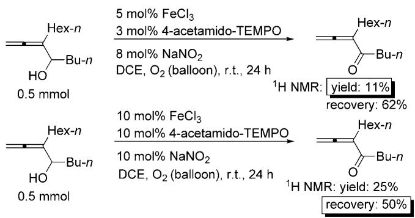

chemical

Chemical reaction scheme showing two pathways of hexyl halide derivatives with varying FeCl3, NaNO2, and O2 (balloon) yields under different TEMPO conditions

Scheme 1. FeCl /NaNO -4-acetamido-TEMPO-catalyzed aerobic oxidation of 3-(n-hexyl)-1,2-octadien-4-ol.

# Results and Discussion

# Optimization of Reaction Conditions

Based on our previous control experiment (Scheme 1), we used the highly sterically hindered 3- (n-hexyl)-1,2-octadien-4-ol as the model alcohol with TEMPO as the catalyst and set the following criteria for the to-be-established new aerobic oxidation protocol to have a practical procedure for aerobic oxidation of alcohols to aldehydes: (i) cheap routine chemicals (the catalysts and solvent); (ii) a room temperature reaction for energy efficiency and thermodynamically sensitive substrates; (iii) an atmospheric pressure of oxygen for an autoclave-free easy and controllable operation; (iv) a spot-to-spot fast reaction.

Thus, our first attempt is to identify the best solvent for the reaction with 10 mol% each of iron nitrate and TEMPO as the catalysts and the results are shown in Table 1. It turned out that the reaction in 1,2-dichloroethane gave the highest conversion (entry 5, Table 1). In addition, it should be noted that under the Martin-s[21] or Liang-s earlier protocols,[24] the corresponding reaction in MeCN is extremely low-yielding although the conversion reached 55% (entry 6, Table 1).

Based on this observation, we used 1,2-dichloroethane as the solvent to see whether there is any better inorganic catalyst for this purpose with the results being summarized in Table 2. Based on the results presented in Table 2, it turned out that $\mathrm { F e } ( \mathrm { N O } _ { 3 } ) _ { 3 } { \cdot } 9 \mathrm { H } _ { 2 } \mathrm { O }$ and 1,2-dichloroethane is the best combination, however, the reaction is still very slow (75% of conversion after 2 days !). Thus, we started to test the effect of additives (Table 3): The addition of $\mathrm { N a N O } _ { 2 } , \mathrm { K N O } _ { 2 } ,$ or TBN[25,28,30] did not help much (entries 1–3); then we proceeded to consider of adding suitable ligands to in-situ form a highly active catalyst.

Table 1. $\mathrm { F e ( N O _ { 3 } ) _ { 3 } } { \cdot } 9 \mathrm { H _ { 2 } O / T E M P O } .$ catalyzed room temperature aerobic oxidation of 3-(n-hexyl)-1,2-octadien-4-ol in different solvents.[a]   
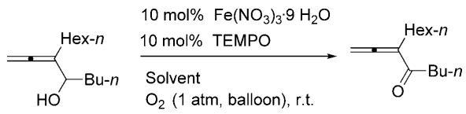

chemical

Chemical reaction scheme showing conversion of a hydroxybenzene derivative to a ketone using Fe(NO3)3·9 and TEMPO in solvent, with O2 as reagent

<table><tr><td>Entry</td><td>Solvent</td><td>Time [h]</td><td>Conv. [%, NMR]</td><td>Yield [%, NMR]</td></tr><tr><td>1</td><td>DCM</td><td>48</td><td>44</td><td>25</td></tr><tr><td>2</td><td>toluene</td><td>48</td><td>52</td><td>21</td></tr><tr><td>3</td><td>THF</td><td>48</td><td>50</td><td>19</td></tr><tr><td>4</td><td>DME</td><td>48</td><td>54</td><td>22</td></tr><tr><td>5</td><td>DCE</td><td>48</td><td>75</td><td>43</td></tr><tr><td>6</td><td> $CH_3CN$ </td><td>39</td><td>55</td><td>13</td></tr><tr><td>7</td><td> $CH_3CN/H_2O^{[b]}$ </td><td>39</td><td>28</td><td>9</td></tr><tr><td>8</td><td>benzene</td><td>39</td><td>59</td><td>20</td></tr><tr><td>9</td><td>DMF</td><td>39</td><td>23</td><td>4</td></tr><tr><td>10</td><td>ethyl acetate</td><td>39</td><td>57</td><td>21</td></tr></table>

[a] Reaction conditions: alcohol (0.2 mmol), TEMPO (0.02 mmol), and Fe(NO3)3. 9H2O (0.02 mmol) in solvent (2 mL) at room temperature.   
[b] CH3CN/H2O = 9/1

Table 2. TEMPO-catalyzed room temperature aerobic oxidation of 3-(n-hexyl)-1,2-octadien-4-ol in 1,2-dichloroethane-screening for a better cocatalyst.[a]   
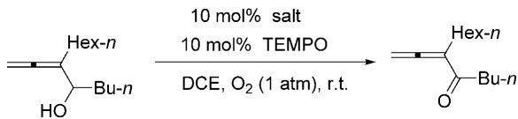

chemical

Chemical reaction scheme showing conversion of a substituted cyclohexane derivative to a ketone using 10 mol% salt and TEMPO in DCE/O2 at room temperature

<table><tr><td>Entry</td><td>Salts</td><td>Time [h]</td><td>Conv. [%, NMR]</td><td>Yield [%, NMR]</td></tr><tr><td> $1^{[b]}$ </td><td> $Fe(NO_3)_3 \cdot 9H_2O$ </td><td>48</td><td>75</td><td>43</td></tr><tr><td>2</td><td> $FeCl_36H_2O$ </td><td>24</td><td>19</td><td>12</td></tr><tr><td>3</td><td> $Cu(NO_3)_23H_2O^{[29]}$ </td><td>24</td><td>44</td><td>33</td></tr><tr><td>4</td><td> $Zn(NO_3)_26H_2O$ </td><td>24</td><td>10</td><td>2</td></tr></table>

[a] Reaction conditions: alcohol (0.5 mmol), TEMPO (0.05 mmol), salt (0.05 mmol), solvent (3 mL), room temperature.   
[b] Reaction conditions: alcohol (0.2 mmol), TEMPO (0.02 mmol), Fe(NO3)3·9 H2O (0.02 mmol), solvent (2 mL), rt.

Table 3. $\mathrm { F e ( N O _ { 3 } ) _ { 3 } } { \cdot } 9 \mathrm { H _ { 2 } O / T E M P O } .$ -catalyzed room temperature aerobic oxidation of 3-(n-hexyl)-1,2-octadien-4-ol in 1,2-dichloroethane-screening for a cheap additive as the cocatalyst for a fast reaction.[a]   
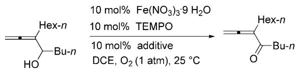

chemical

Chemical reaction scheme showing oxidation of a substituted cyclohexanone derivative using Fe(NO3)3·9 and TEMPO under additive conditions

<table><tr><td>Entry</td><td>Additive</td><td>Time [h]</td><td>Conv. [%, NMR]</td><td>Yield [%, NMR]</td></tr><tr><td>1</td><td> $NaNO_{2}$ </td><td>36</td><td>55</td><td>35</td></tr><tr><td>2</td><td> $KNO_{2}$ </td><td>36</td><td>48</td><td>24</td></tr><tr><td>3</td><td>TBN</td><td>36</td><td>58</td><td>24</td></tr><tr><td>4</td><td> $LiCl\cdot H_{2}O$ </td><td>10</td><td>95</td><td>74</td></tr><tr><td>5</td><td>NaCl</td><td>4</td><td>100</td><td>72</td></tr><tr><td>6</td><td>KCl</td><td>4.5</td><td>100</td><td>81</td></tr><tr><td>7</td><td>RbCl</td><td>3</td><td>100</td><td>74</td></tr><tr><td>8</td><td>CsCl</td><td>3</td><td>100</td><td>73</td></tr><tr><td>9</td><td> $KF\cdot 2H_{2}O$ </td><td>25</td><td>49</td><td>13</td></tr><tr><td>10</td><td>KBr</td><td>25</td><td>75</td><td>50</td></tr><tr><td>11</td><td>KI</td><td>25</td><td>45</td><td>20</td></tr><tr><td>12</td><td> $NaCl^{[b]}$ </td><td>5</td><td>100</td><td>72</td></tr></table>

[a] Reaction conditions: alcohol (0.5 mmol), TEMPO (0.05 mmol), nitrate (0.05 mmol), additive (0.05 mmol), DCE (3 mL), 25 8C.   
[b] NaCl (20 mol%) was used.

Traditionally, organic ligands are frequently used, however, in order to have a cheap, readily available, easy to use ligand, we took a different approach by screening inorganic halide ligands since halide anions have been reported to act as ligands for transition metals.[21,28,31] Thus, the cheap and readily available inorganic halides were screened in the first place for such a purpose. With this approach we were excited to observe that 10 mol% of LiCl improved the conversion to 95% within 10 h (entry 4)! Furthermore, 10 mol% of NaCl, KCl, RbCl, or CsCl all converted the slow reaction into a very efficient one, which goes to completion within a couple of hours ! In terms of efficiency the order is CsCl> RbCl > KCl > NaCl > LiCl (entries 4–9). For the obvious reason of cost and availability, we chose the kitchen chemical sodium chloride as the additive: the reaction was completed within 4 h to afford 3-(n-hexyl)-1,2-octadien-4-one in 72% isolated (entry 5); the results of KF, KBr, and KI are poor (entries 9–11).

# The Scope of the Reaction

After further optimization, we defined 5 mol% of Fe-(NO ) ·9 H O, 3 or 5 mol% of TEMPO, and 5 mol% of NaCl as the standard catalytic formula. We were pleased to observe that this protocol easily converts 1 mmol of differently substituted primary as well as

(5 h, 74%, 72%)([a,h] (10 h, 72%, 71%)[b.h]

(5 h, 85%, 80%)[a,h] (9 h, 84%, 82%)[b,h]

(3 h, 93%, 87%)[a,h] (5 h, 94%, 88%)(b.h]

(24 h, 58%, 54%)(c,h]

(4 h, 84%)[a,h] (8.5 h, 83%)[b,h] (5.5 h, 84%, 78%)([d,h]

(4 h, 75%, 75%)(c,h] (24 h, 73%, 65%)(d,i]

[a] Fe(NO3)39 H20 (5 mol%), TEMPO (10 mo1%), NaCI (10 mo1%).   
) Fe(NO)39 H20 (5mol%), TEMPO (5mol%), NaCl (5mol%)   
FNO9 H(10ol%), TEMPO0%) NaCI (0ol%).   
[d] $\mathsf { F e } ( \mathsf { N O } _ { 3 } ) _ { 3 } { \boldsymbol { \mathfrak { s } } } \mathsf { \Theta } \mathsf { H } _ { 2 } \mathsf { O }$ (5 mo1%), TEMPO (5 mo1%), NaCI (10 mol%).   
$\mathsf { F e } ( \mathsf { N O } _ { 3 } ) _ { 3 }$ 9 H2O (5 mo1%), TEMPO (3 mol%), NaCl (5 mol%).   
f Fe(NO3)39 H20 (2 mol%), TEMPO (2 mol%), NaCI (2 mol%).   
[g) Fe(NO3)39 H20 (5 mo1%), TEMPO (3 mol%), NaCI (10 mol%).   
[h] 1 mmol scale.   
[] 10 mmol scale.   
] 1 mol scale.

Scheme 2. Room temperature aerobic oxidation of allenols to aldehydes or ketones [reaction time, NMR yield (%), and isolated yield (%)].

secondary allenols into allenyl aldehydes or ketones all within 10 h although with the sterically bulky allenols (the examples with footnote[c]) require 10 mol% each of iron nitrate, TEMPO and NaCl (Scheme 2). Over-oxidation to acids from primary allenols was not observed.

In addition, quitely surprisingly we also noticed that there is essentially no report on the aerobic oxidation of readily available propargylic alcohols to the synthetically very useful 2-alkynones. Control experiments show that the aerobic oxidation of 1-(p-methoxyphenyl)-2-heptynol with Fe $\mathrm { C l } _ { 3 ^ { - } } \mathrm { N a N O } _ { 2 }$ -4-acetamido-TEMPO[25] is very slow and the purity of the isolated product is very low (Scheme 3). Happily, we found that this recipe may be applied smoothly to the aerobic oxidation of a series of different primary or secondary propargylic alcohols, a class of very readily available functionalized alcohols (Scheme 3 and Scheme 4). As we know 2-alkynones are very useful in organic synthesis, showing the potential of this methodology.

Last but not the least, we are very pleased to see that this protocol is also applicable to the aerobic oxidation of the most commonly sudied allylic alcohols (Scheme 5, Part 1), phenyl carbinols (Scheme 5, Part 1), and normal alkyl carbinols (Scheme 5, Part 3). Again, it works for both primary and secondary alcohols. In order to compare the efficiency of the current protocol with the known room temperature

Scheme 3. Control experiment of aerobic oxidation of 1-(p-methoxy)-phenyl-2-heptynol.

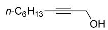  
(5 h, 86%, 86%)le,h]

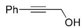  
(4 h, 91%, 86%)[b,h] (2.5 h, 82%, 79%)(e,i]

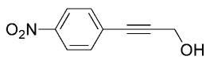  
(6.5 h, 84%, 76%)(e,h]

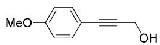  
(3.5 h, 67%, 69%)[a,h]   
(4 h, 75%, 78%)[d,h]

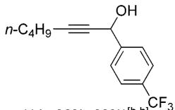  
(4 h, 98%, 89%)[b,h] (5.5 h, 88%, 78%)[e,h

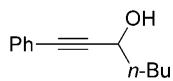  
(8 h, 91%, 91%)[b,h]   
(4 h, 97%, 93%)e,i]

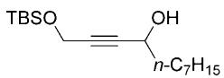  
(4 h, 95%, 92%)[b,h] (8.5 h, 89%, 89%)le,h]

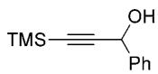  
(2 h, 97%, 92%)[b,h] (4 h, 96%, 93%)(e,h]

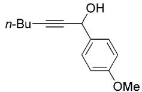  
(3.5 h, 87%, 84%)(b,h] (5.5 h, 83%, 85%)le,h]

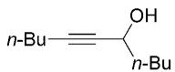  
(4 h, 94%, 92%)[b,h] (5.5 h, 97%, 92%)(e,h]

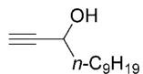  
(5 h, 95%, 93%)[b,h] (12.5 h, 98%, 91%)(e.,h]   
For footnotes, see Scheme 2   
Scheme 4. Room temperature aerobic oxidation of propargylic alcohols to aldehydes or ketones [reaction time, NMR yield (%), and isolated yield (%)].

Part 1 Allylic alcohols   
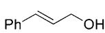  
(3 h, 90%, 84%)e,i]

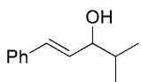  
(4 h, 87%, 86%)(e,h]

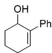  
(10 h, 93%, 85%)(a,h] (22 h, 83%, 81%)e,i]

Part 2 Benzylic alcohols   
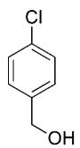  
(6 h, 94%, 87%)[b,h] (4.5 h, 90%, 83%)(e,i]

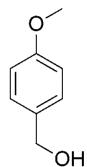  
(6 h, 96%, 93%)[b,h] (4 h, 95%, 88%)e,i]

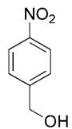  
$\begin{array} { l } { ( 2 . 5 \mathsf { h } , \mathbb { 9 6 } \% , \mathbb { 9 } 2 \% ) ^ { [ \mathsf { b } , \mathsf { h } ] } } \\ { ( 3 \mathsf { h } , \mathrm { ~ \mathbb { - } , ~ } 8 7 \% ) ^ { [ \mathsf { e } , \mathsf { i } ] } } \end{array}$

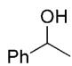  
(5 h, 89%, 87%)(b,h] (4 h, --, 92%)(fj]

Part 3 Normal alkanols   
$\scriptstyle n - \mathsf { C } _ { 1 6 } \mathsf { H } _ { 3 3 } \mathsf { O } \mathsf { H }$ (18 h, 64%, 67%)[b,h] (8.5 h, 78%, 76%)(g.i]   
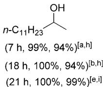  
For footnotes, see Scheme 2.   
Scheme 5. Room temperature aerobic oxidation of most commonly stuided alcohols to aldehydes or ketones [reaction time, NMR yield (%), and isolated yield (%)].

ones,[16,19,21,22,24,25,28] some 10 mmol scale reactions of comparable or same substrates were conducted with the results shown in Scheme 5 (examples with footnote[i]): the reactions of benzylic alcohols and allylic alcohols are much faster and those of alkyl carbinols are at the same level, if not better.

The results shown in Scheme 2, Scheme 4, and Scheme 5 nicely demonstrate the beauty of this new methodology: (i) functional groups such as OMe, $\mathrm { C F } _ { 3 } ,$ $\mathrm { N O } _ { 2 } , \mathrm { C l }$ , TMS, OTBS, terminal alkyne, etc. have been smoothly tolerated; (ii) the reaction is very clean and fast: spot to spot transformation mostly within a couple of hours; (iii) high-yielding; (iv) general for both primary and secondary alcohols; for primary alcohols, over-oxidation to carboxylic acids was not observed; (v) a room temperature reaction with the lowest energy consumption; (vi) an efficient transformation mostly with 5 mol% of $\mathrm { F e } ( \mathrm { N O } _ { 3 } ) _ { 3 } { \cdot } 9 \mathrm { H } _ { 2 } \mathrm { O } ,$ , 3 mol% of TEMPO, and 5 mol% of NaCl; (vii) the widest scope so far covering alcohols with nearly all the types of unsaturated functionalities for further elaboration in a synthetic chemistry-related laboratory.

# Large-Scale Reactions for Practical Use

The reaction may be conducted by just using the oxygen in the air with the same result [Eq. (1)].

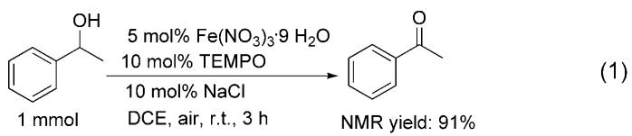

chemical

Organic synthesis reaction showing conversion of 1 mmol to 91% NMR using Fe(NO3)3·9 H2O and TEMPO under NaCl conditions

To further show the practicality and efficiency of this catalytic system, a 1.0-mol reaction of 1-phenylethanol was conducted by using 2 mol% each of $\mathrm { F e } ( \mathrm { N O } _ { 3 } ) _ { 3 } { \cdot } 9 \mathrm { H } _ { 2 } \mathrm { O } .$ , TEMPO, and NaCl to give phenyl methyl ketone in 91% isolated yield within 4 h (Part 3, Scheme 5). Its industrial potential has further been demonstrated by running the oxidation of 488.64 g (4 mol) of 1-phenylethanol to phenyl methyl ketone with just 1 mol% each of $\mathrm { F e } ( \bar { \bf N } { \bf O } _ { 3 } ) _ { 3 } { \cdot } 9 \mathrm { H } _ { 2 } \mathrm { O } ,$ TEMPO, and NaCl using a line to provide 1 atm of oxygen gas within \~ 9 h after addition without external heating. Due to the highly exothermic nature here, the addition rate for the alcohol had to be manipulated to ensure a mild, controllable and safe reaction, which is vital for industrial application. After the reaction was complete as monitored by TLC, no work-up is needed: the resulting mixture was directly distilled under the atmospheric pressure to recover 88% of 1,2-dichloroethane and collect 59 mL of the by-product water. After this, distillation under vacuum was employed to produce a 91% isolated yield of pure phenyl methyl ketone [Eq. (2)]. It should be noted that commercially available chemicals were used directly without further treatment.

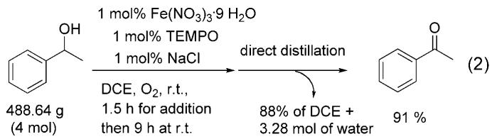

chemical

Organic reaction scheme showing oxidation of phenol to ketone using Fe(NO3)3·9 and NaCl, with DCE and water addition steps

# Mechanistic Studies

In order to understand the role of each catalyst, a few control experiments have been conducted: No reaction occurred in the absence of TEMPO (entry 1, Table 4); the reaction did not take place in the presence of 2.5 equiv. of TEMPO, 2.5 equiv. of TEMPO together with 1 equiv. of NaCl, or 2.5 equiv. of TEMPO together with 1 equiv. each of NaCl and ${ \bf N a N O } _ { 3 }$ indicating the importance of the $\mathrm { F e } ^ { 3 + }$ in the current oxidation reaction of alcohols and catalyst regeneration.

In addition, we noticed in the very beginning that ${ \bf N a N O } _ { 3 }$ and $\mathrm { \tilde { H N O } } _ { 3 } ^ { [ 3 2 ] }$ failed to replace $\mathrm { \bar { F e } } ( \mathrm { N O } _ { 3 } ) _ { 3 }$ in the recation of $3 \mathrm { - } ( n \mathrm { - h e x y l ) - } 1 , 2$ -octadien-4-ol, indicating the importance of $\mathrm { F e } ^ { \dot { 3 } + }$ in the reaction (Scheme 6).

In the large-scale reaction shown in Eq. (2), NO has been detected by GC-MS analysis and the presence of NO was confirmed by its characteristic reddish-brown color in the gas phase of the reaction mixture. Thus, a rationale was proposed for this recation (Scheme 7): TEMPO should couple with $\mathrm { F e } ^ { 3 + }$ to afford intermediate 1, which would react with the alcohol to form intermediate 2 by releasing $\mathrm { H ^ { + } } .$ . This intermediate would undergo b-H elimination and reductive elimination to produce the aldehyde or ketone, $\mathrm { F e } ^ { 2 + }$ , and TEMPOH. TEMPOH may be converted to TEMPO by its reaction with $\mathrm { F e } ^ { 3 + } . ^ { [ 3 3 ] } \mathrm { F e } ^ { 2 + }$ would be reoxidized to $\mathrm { F e } ^ { 3 + }$ by the reaction with $\Nu O _ { 2 }$ in the presence of a proton, forming NO and water at the same time. $\Nu O _ { 2 }$ was first generated from NO - and would be regenerated by the reaction of NO with $\mathrm { O } _ { 2 } .$ Although the role of NaCl is not quite clear yet, we believe that $\mathrm { C l ^ { - } }$ is most likely behaving as a unique electron-donating ligand31 to pump electrons to the d orbitals of $\mathrm { F e } ^ { 3 + }$ to facilitate the semi-oxidative addition-type coupling with TEMPO. Due to the + 3 oxidation state, this coupling reaction of TEMPO with $\mathrm { F e } ^ { 3 + }$ would be very slow in the absence of sodium chloride. Of course, further study is obviously needed to unveil the actual mechanism.

Table 4. Control experiments for the aerobic oxidation of 1- phenylethanol. 

<table><tr><td colspan="2"></td><td colspan="3">DCE,  $O_2$  (1 atm), r.t.</td></tr><tr><td>Etry</td><td>TEMPO(equiv.)</td><td>NaCl(equiv.)</td><td>Time[h]</td><td>Conv. (yield)[%]</td></tr><tr><td> $1^{[a]}$ </td><td>0</td><td>0.1</td><td>26</td><td>2 (1)</td></tr><tr><td>2</td><td>2.5</td><td>0</td><td>10</td><td>1 (0)</td></tr><tr><td>3</td><td>2.5</td><td>1</td><td>10</td><td>0 (0)</td></tr><tr><td> $4^{[b]}$ </td><td>2.5</td><td>1</td><td>10</td><td>1 (0)</td></tr></table>

[a] 0.05 equiv. of $\mathrm { F e } ( \mathrm { N O } _ { 3 } ) _ { 3 } { \cdot } 9$ H2O was added.   
3 3[b] 1.0 equiv. of NaNO3 was added instead of $\mathrm { F e } ( \mathrm { N } { \bf \bar { O } } _ { 3 } ) _ { 3 } { \cdot } 9 \mathrm { H } _ { 2 } \mathrm { O } .$

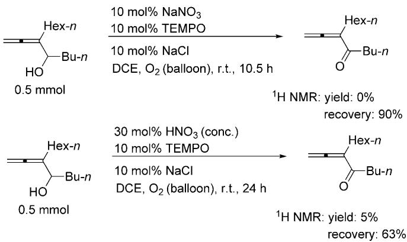

chemical

Two reaction schemes showing 1H NMR yields with varying compound structures and reagents, including NaNO3, TEMPO, NaCl, and balloon conditions.

Scheme 6. The importance of $\mathrm { F e } ^ { 3 + }$ in the current reaction.

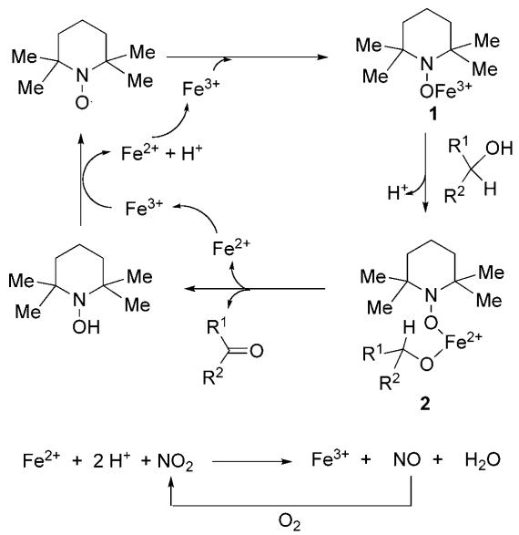

chemical

Reaction mechanism diagram showing iron ion coordination and radical intermediates with electron transfer steps

Scheme 7. A proposed mechanism.

# Conclusions

In conclusion, we have developed a mild and practical Fe(NO ) /TEMPO-catalyzed aerobic oxidation of the most commonly used alcohols in academic and industrial laboratories such as primary as well as secondary normal alkanols, benzylic, allylic, propargylic accohols, and allenols expedited by a catalytic amount of sodium chloride efficiently. Of particular interest, it should be noted that for 2,3-allenols and propargylic alcohols, this is the only reported aerobic oxidation protocol producing the synthetically attractive 1,2-allenyl ketones and 2-alkynones. Based on a comparison with the known protocols for the commonly studied alcohols, this is the most efficient room temperature aerobic reaction with just $\leq 5$ mol% of the catalyst loadings so far. In a large scale experiment (4 mol), a loading of 1 mol% for each catalyst is enough with direct distillation to yield the product. This spot-to-spot protocol with 1 atm oxygen is energy-effective, going to completion at room temperature within just a couple of hours, which may be of high interest both to the academic laboratories and industry in terms the scale of the reaction, cost, efficiency, and energy consumption. Further studies are needed to unveil the mechanism and the exact role of sodium chloride. Further studies including the role of NaCl and better solvents for industrial use and application of this reaction in organic synthesis is in progress in this group.

# Experimental Section

# Typical Procedure for the Synthesis of Aldehydes or Ketones

To a 10-mL, dried three-necked flask were added Fe(NO ) ·9 H O (0.05 mmol), DCE (4 mL), TEMPO (0.10 mmol) and NaCl (0.10 mmol) under an atmosphere of oxygen. The resulting suspension was stirred at room temperature for 5 min under oxygen. A solution of alcohol (1.0 mmol) in DCE (1,2-dichloroethane, 1 mL) was then added to the suspension and the resulting mixture was stirred at room temperature with oxygen from a balloon until the reaction was complete as monitored by TLC (eluent: petroleum ether/ethyl acetate=10:1). The resulting mixture was diluted with diethyl ether (30 mL), dried over anhydrous $\mathrm { M g } \mathrm { S O } _ { 4 } ,$ and filtered through a short column of silica gel to remove the inorganic salts. After evaporation, the NMR yield was determined by 1 H NMR analysis and the residue was purified by column chromatography on silica gel (petroleum ether/diethyl ether = 20/1) to afford the corresponding the aldehyde or ketone.

# Synthesis of 2-Benzylbuta-2,3-dienal

The reaction of 2-benzylbuta-2,3-dien-1-ol (160.6 mg, 1.0 mmol), Fe(NO ) ·9 H O (20.3 mg, 0.05 mmol), TEMPO (15.6 mg, 0.10 mmol) and NaCl (5.8 mg, 0.10 mmol) in DCE (5 mL) afforded 2-benzylbuta-2,3-dienal as an oil; yield: 114.5 mg (72%); 1 H NMR (300 MHz, CDCl3): d = 9.61 (s, 1 H), 7.31–7.15 (m, 5 H), 5.28 (t, J = 2.4 Hz, 2 H), 3.52 (t, J = 2.6 Hz, 2 H); 13C NMR (75.4 MHz, CDCl3): d = 222.50,

191.41, 138.52, 128.84, 128.35, 126.41, 110.62, 80.83, 30.84; IR (neat): n =2827, 2728, 1955, 1928, 1677, 1602, 1495, 1454, 1426, 1227, 1144, 1071, 1030 cm-1 ; MS (EI): m/z =158 (M+, 5.25), 129 (100); HR-MS: m/z =158.0733, calcd. for $\mathrm { C _ { 1 1 } H _ { 1 0 } O }$ (M+): 158.0732.

The reaction of 2-benzylbuta-2,3-dien-1-ol (160.2 mg, 1.0 mmol), $\mathrm { F e } ( \mathrm { N O } _ { 3 } ) _ { 3 } { \cdot } 9 \mathrm { H } _ { 2 } \mathrm { O }$ (20.3 mg, 0.05 mmol), TEMPO (7.8 mg, 0.05 mmol) and NaCl (2.9 mg, 0.05 mmol) in DCE (5 mL) afforded 2-benzylbuta-2,3-dienal as an oil; yield: 112.5 mg (71%).

# Synthesis of 2,3-Tridecadienal

The reaction of 2,3-tridecadien-1-ol (196.4 mg, 1.0 mmol), Fe(NO3)3·9 H2O (20.2 mg, 0.05 mmol), TEMPO (15.7 mg, 0.10 mmol) and NaCl (5.8 mg, 0.10 mmol) in DCE (5 mL) afforded 2,3-tridecadienal as an oil; yield: 156.2 mg (80%) (petroleum ether/ethyl acetate=40/1); 1 H NMR (300 MHz, CDCl ): d = 9.44 (d, J = 7.2 Hz, 1 H), 5.84–5.71 (m, 2 H), 2.25–2.10 (m, 2 H), 1.55–1.42 (m, 2 H), 1.42–1.20 (m, 12 H), 0.84 (t, J = 6.6 Hz, 3 H); 13C NMR (75.4 MHz, CDCl ): d = 218.94, 192.00, 98.47, 96.19, 31.73, 29.38, 29.17, 29.15, 28.82, 28.71, 27.36, 22.53, 13.94; MS(EI): m/z = 194 (M+, 0.79), 81 (100); IR (neat): n =2924, 2854, 1943, 1690, 1465, 1107, 1081 cm-1 ; HR-MS: $m / z = 1 9 4 . 1 6 7 1$ , calcd. for $\mathrm { C } _ { 1 3 } \mathrm { H } _ { 2 2 } \mathrm { O }$ (M+): 194.1671.

The reaction of 2,3-tridecadien-1-ol (196.5 mg, 1.0 mmol), $\mathrm { F e } ( \mathrm { N O } _ { 3 } ) _ { 3 } { \cdot } 9 \mathrm { H } _ { 2 } \mathrm { O }$ (20.1 mg, 0.05 mmol), TEMPO (7.8 mg, 0.05 mmol) and NaCl (3.1 mg, 0.05 mmol) in DCE (5 mL) afforded 2,3-tridecadienal as an oil; yield: 159.6 mg (82%) (petroleum ether/ethyl acetate =40/1).

# Synthesis of Trideca-1,2-dien-4-one

The reaction of trideca-1,2-dien-4-ol (197.0 mg, 1.0 mmol), $\mathrm { F e } ( \mathrm { N O } _ { 3 } ) _ { 3 } { \cdot } 9 \mathrm { H } _ { 2 } \mathrm { O }$ (21.0 mg, 0.05 mmol), TEMPO (15.2 mg, 0.10 mmol) and NaCl (6.2 mg, 0.10 mmol) in DCE (5 mL) afforded trideca-1,2-dien-4-one as an oil; yield: 169.0 mg (87%); 1 H NMR (300 MHz, CDCl ): d = 5.74 (t, J = 6.5 Hz, 1 H), 5.20 (d, J =6.3 Hz, 2 H), 2.57 (t, J= 7.4 Hz, 2 H), 1.63– 1.50 (m, 2 H), 1.35–1.17 (m, 12 H), 0.85(t, J=6.3 Hz, 3 H); 13C NMR (75.4 MHz, CDCl3): d= 216.57, 200.88, 96.62, 79.16, 39.19, 31.81, 29.37, 29.33, 29.19, 29.14, 24.53, 22.59, 14.00; IR (neat): n =2955, 2854, 1961, 1934, 1681, 1465, 1410, 1365, 1157, 1105, 1068 cm-1 ; MS (EI): m/z =194 (M+, 1.37), 41 (100); HR-MS: m/z =194.1673, calcd. for $\mathrm { C } _ { 1 3 } \mathrm { H } _ { 2 2 } \mathrm { O }$ (M+): 194.1671.

The reaction of trideca-1,2-dien-4-ol (196.3 mg, 1.0 mmol), Fe(NO3)3·9 H2O (20.2 mg, 0.05 mmol), TEMPO (7.8 mg, 0.05 mmol) and NaCl (2.9 mg, 0.05 mmol) in DCE (5 mL) afforded trideca-1,2-dien-4-one as an oil; yield: 171.5 mg (88%).

# Synthesis of 2-Hexyl-1-phenylbuta-2,3-dien-1-one

The reaction of 2-hexyl-1-phenylbuta-2,3-dien-1-ol (229.4 mg, 1.0 mmol), $\mathrm { F e } ( \mathrm { N O } _ { 3 } ) _ { 3 } { \cdot } 9 \mathrm { H } _ { 2 } \mathrm { O }$ (40.6 mg, 0.10 mmol), TEMPO (15.7 mg, 0.10 mmol) and NaCl (5.7 mg, 0.10 mmol) in DCE (5 mL) afforded 2-hexyl-1-phenylbuta-2,3-dien-1-one as an oil: yield: 123.1 mg (54%) (petroleum ether/ethyl acetate = 30/1): 1 H NMR (300 MHz, CDCl ): d= 7.76 (d, J = 7.8 Hz, 2 H), 7.49 (t, J = 7.1 Hz, 1 H), 7.38 (t, J = 7.7 Hz, 2 H), 5.04 (t, J= 2.7 Hz, 2 H), 2.45–2.35 (m, 2 H), 1.58–1.25 (m, 8 H), 0.90 (t, J = 6.5 Hz, 3 H); 13C NMR (75.4 MHz, CDCl ): d=216.95, 194.78, 138.34, 131.85, 128.97, 127.73, 106.88, 79.26, 31.56, 28.85, 27.83, 27.80, 22.53, 13.98; IR (neat): n =3059, 2955, 2856, 1932, 1650, 1598, 1579, 1447, 1315, 1269, 1177, 1072 cm-1 ; MS (EI): m/z = 228 (M+, 1.69), 105 (100); HR-MS: $m / z = 2 2 8 . 1 5 1 2 .$ , calcd. for $\dot { \mathrm { \bf C } } _ { 1 6 } \mathrm { H } _ { 2 0 } \mathrm { O \ ( \dot { \bf M } ^ { + } ) }$ : 228.1514.

# Synthesis of 1-(4-Chlorophenyl)buta-2,3-dien-1-one

The reaction of 1-(4-chlorophenyl)-buta-2,3-dien-1-ol (178.4 mg, 1.0 mmol), Fe(NO ) ·9 H O (19.8 mg, 0.05 mmol), TEMPO (8.1 mg, 0.05 mmol) and NaCl (5.6 mg, 0.10 mmol) in DCE (5 mL) afforded 1-(4-chlorophenyl)buta-2,3-dien-1- $\mathrm { o n e } ^ { [ 3 4 ] }$ as an oil; yield: 136.9 mg (78%); 1 H NMR (300 MHz, CDCl ): d = 7.84 (d, J = 8.7 Hz, 2 H), 7.42 (d, J = 8.7 Hz, 2 H), 6.39 (t, J = 6.5 Hz, 1 H), 5.27 (d, J = 6.6 Hz, 2 H); 13C NMR (75.4 MHz, CDCl3): d= 217.1, 189.9, 139.1, 135.7, 130.1, 128.6, 93.2, 79.4; IR (neat): n =3065, 2987, 1960, 1930, 1653, 1586, 1487, 1400, 1276, 1211, 1174, 1090, 841 cm-1 ; MS (EI): $m / z = 1 8 0 [ \mathrm { M } ( ^ { 3 7 } \mathrm { C l } ) ^ { + }$ , 1.61] , 178 [M( 35Cl)+, 5.71], 139 (100).

The reaction of 1-(4-chlorophenyl)-buta-2,3-dien-1-ol (180.1 mg, 1.0 mmol), $\mathrm { F e } ( \mathrm { N O } _ { 3 } ) _ { 3 } { \cdot } 9 \mathrm { H } _ { 2 } \mathrm { O }$ (20.4 mg, 0.05 mmol), TEMPO (15.7 mg, 0.10 mmol) and NaCl (5.9 mg, 0.10 mmol) in DCE (5 mL) afforded 1-(4-chlorophenyl)buta-2,3-dien-1-one ;[34] NMR yield : 84%.

The reaction of 1-(4-chlorophenyl)-buta-2,3-dien-1-ol (180.6 mg, 1.0 mmol), Fe(NO3)3·9 H2O (20.3 mg, 0.05 mmol), TEMPO (8.0 mg, 0.05 mmol) and NaCl (3.0 mg, 0.05 mmol) in DCE (5 mL) afforded 1-(4-chlorophenyl)buta-2,3-dien-1- one ;[34] NMR yield : 83%.

# Synthesis of 3-Hexylocta-1,2-dien-4-one

The reaction of 3-hexylocta-1,2-dien-4-ol (211.3 mg, 1.0 mmol), Fe(NO ) ·9 H O (41.0 mg, 0.10 mmol), TEMPO (16.1 mg, 0.10 mmol) and NaCl (5.4 mg, 0.10 mmol) in DCE (5 mL) afforded 3-hexylocta-1,2-dien-4-one as an oil; yield: 156.1 mg (75%); 1 H NMR (300 MHz, CDCl ): d = 5.16 (t, J = 2.9 Hz, 2 H), 2.64 (t, J = 7.7 Hz, 2 H), 2.20–2.10 (m, 2 H), 1.61–1.49 (m, 2 H), 1.42–1.21 (m, 10 H), 0.93–0.82 (m, 6 H); 13C NMR (75.4 MHz, CDCl3): d= 216.25, 201.38, 108.62, 79.35, 38.94, 31.61, 28.88, 27.82, 27.21, 26.27, 22.58, 22.37, 14.02, 13.82; IR (neat): n =2957, 2928, 2858, 1934, 1677, 1464, 1410, 1379, 1349, 1259, 1175, 1086, 1020 cm-1 ; MS (EI): m/z = 208 (M+, 0.48), 85 (100); HR-MS: m/z = 208.1826, calcd. for $\mathrm { C _ { 1 4 } H _ { 2 4 } O }$ (M+): 208.1827.

The reaction of 3-hexylocta-1,2-dien-4-ol (2.1031 g, 10.0 mmol), $\mathrm { F e } ( \mathrm { N O } _ { 3 } ) _ { 3 } { \cdot } 9 \mathrm { H } _ { 2 } \mathrm { O }$ (208.2 mg, 0.5 mmol), TEMPO (77.7 mg, 0.50 mmol) and NaCl (59.7 mg, 1.0 mmol) in DCE (4 mL) afforded 3-hexylocta-1,2-dien-4-one as an oil: yield: 1.3472 g (65%).

# Synthesis of Non-2-ynal

The reaction of non-2-yn-1-ol (140.3 mg, 1.0 mmol), Fe-$( \mathrm { N O } _ { 3 } ) _ { 3 } { \cdot } 9 \mathrm { H } _ { 2 } \mathrm { O }$ (20.5 mg, 0.05 mmol), TEMPO (7.7 mg, 0.05 mmol) and NaCl (3.0 mg, 0.05 mmol) in DCE (5 mL) afforded non-2-ynal[35] as an oil; yield: 121.6 mg (88%) (petroleum ether/ethyl acetate=15/1); 1 H NMR (300 MHz, CDCl ): d = 9.18 (s, 1 H), 2.41 (t, J = 7.1 Hz, 2 H), 1.66–1.50 (m, 2 H), 1.48–1.24 (m, 6 H), 0.90 (t, J = 6.6 Hz, 3 H); 13C NMR (75.4 MHz, CDCl3): d =176.86, 99.20, 81.61, 31.07,

28.39, 27.41, 22.34, 19.00, 13.86; IR (neat): n =2930, 2859, 2237, 2200, 1716, 1670, 1458, 1380, 1278, 1225, 1137 cm-1 ; MS (EI): m/z = 138 (M+, 0.40), 137 (M+-H, 1.57), 41 (100).

The reaction of non-2-yn-1-ol (139.2 mg, 1.0 mmol), Fe-(NO3)3·9 H2O (20.7 mg, 0.05 mmol), TEMPO (4.7 mg, 0.03 mmol) and NaCl (2.9 mg, 0.05 mmol) in DCE (5 mL) afforded non-2-ynal[35] as an oil; yield: 117.6 mg (86%) (petroleum ether/ethyl acetate=20/1).

# Synthesis of 3-Phenylpropynal

The reaction of 3-phenylprop-2-yn-1-ol (132.3 mg, 1.0 mmol), Fe(NO ) ·9 H O (19.8 mg, 0.05 mmol), TEMPO (7.8 mg, 0.05 mmol) and NaCl (2.9 mg, 0.05 mmol) in DCE (5 mL) afforded 3-phenylpropynal[36] as an oil: yield: 112.1 mg (86%) (petroleum ether/diethyl ether= 20/1); 1 H NMR (300 MHz, CDCl3): d = 9.41 (s, 1 H), 7.59 (d, J = 7.8 Hz, 2 H), 7.48 (t, J = 6.9 Hz, 1 H), 7.39 (t, J = 6.9 Hz, 2 H); 13C NMR (75.4 MHz, CDCl3): d= 176.61, 133.16, 131.19, 128.65, 119.34, 94.96, 88.35; IR (neat): n =2854, 2738, 2240, 2185, 1654, 1489, 1443, 1387, 1260, 1070 cm-1 ; MS (EI): m/z = 130 (M+, 64.02), 102 (100).

The reaction of 3-phenylprop-2-yn-1-ol (1.3092 mg, 10.0 mmol), Fe(NO ) ·9 H O (205.0 mg, 0.5 mmol), TEMPO (45.4 mg, 0.3 mmol) and NaCl (30.5 mg, 0.5 mmol) in DCE (4 mL) afforded 3-phenylpropynal[36] as an oil: yield: 1.024 g (79%) (petroleum ether/diethyl ether =20/1).

# Synthesis of 3-(4-Nitrophenyl)propynal

The reaction of 3-(4-nitrophenyl)prop-2-yn-1-ol (178.3 mg, 1.0 mmol), Fe(NO ) ·9 H O (20.5 mg, 0.05 mmol), TEMPO (8.0 mg, 0.05 mmol) and NaCl (3.0 mg, 0.05 mmol) in DCE (5 mL) afforded 3-(4-nitrophenyl)-propynal[37] as a yellow solid; yield: 151.9 mg (86%) (petroleum ether/diethyl ether = 20/1); 1 H NMR (300 MHz, CDCl3): d = 9.43 (s, 1 H), 8.24 (d, J= 8.4 Hz, 2 H), 7.75 (d, J =8.7 Hz, 2 H); 13C NMR (75.4 MHz, CDCl ): d=176.03, 148.70, 133.78, 125.87, 123.71, 90.67, 90.49; IR (neat): n = 2924, 2854, 2195, 1655, 1592, 1511, 1342, 1103 cm-1 ; MS (EI): m/z = 175 (M+, 54.92), 75 (100).

The reaction of 3-(4-nitrophenyl)prop-2-yn-1-ol (177.6 mg, 1.0 mmol), Fe(NO3)3·9 H2O (20.3 mg, 0.05 mmol), TEMPO (4.9 mg, 0.03 mmol) and NaCl (3.0 mg, 0.05 mmol) in DCE (5 mL) afforded 3-(4-nitrophenyl)-propynal[37] as a yellow solid; yield: 133.7 mg (76%) (petroleum ether/ethyl acetate = 10/1).

# Synthesis of 3-(4-Methoxyphenyl)propynal

The reaction of 3-(4-methoxyphenyl)prop-2-yn-1-ol (161.9 mg, 1.0 mmol), Fe(NO ) ·9 H O (20.2 mg, 0.05 mmol), TEMPO (15.6 mg, 0.10 mmol) and NaCl (6.0 mg, 0.10 mmol) in DCE (5 mL) afforded (4-methoxyphenyl)propynal[38] as a solid; yield: 110.8 mg (69%) (petroleum ether/ diethyl ether = 20/1); 1 H NMR (300 MHz, CDCl ): d= 9.38 (s, 1 H), 7.54 (d, J = 8.7 Hz, 2 H), 6.90 (d, J = 8.7 Hz, 2 H), 3.83 (s, 3 H); 13C NMR (75.4 MHz, CDCl ): d= 176.32, 161.78, 135.03, 114.14, 110.67, 96.15, 88.37, 55.07; IR (neat): n =2178, 1643, 1598, 1507, 1303, 1254, 1175, 1022 cm-1 ; MS (EI): m/z (%) = 160 (M+, 100).

The reaction of 3-(4-methoxyphenyl)prop-2-yn-1-ol (162.2 mg, 1.0 mmol), $\mathrm { F e } ( \mathrm { N O } _ { 3 } ) _ { 3 } { \cdot } 9 \mathrm { H } _ { 2 } \mathrm { O }$ (20.6 mg, 0.05 mmol), TEMPO (8.1 mg, 0.05 mmol) and NaCl (6.0 mg, 0.10 mmol) in DCE (5 mL) afforded (4-methoxyphenyl)propynal[38] as a solid; yield: 124.2 mg (78%) (petroleum ether/diethyl ether = 20/1).

# Synthesis of 1-(4-Trifluoromethylphenyl)hept-2-yn-1- one

The reaction of 1-(4-trifluoromethylphenyl)hept-2-yn-1-ol (256.1 mg, 1.0 mmol), Fe(NO3)3·9 H2O (20.2 mg, 0.05 mmol), TEMPO (7.8 mg, 0.05 mmol) and NaCl (2.9 mg, 0.05 mmol) in DCE (5 mL) afforded 1-(4-trifluoromethyl-phenyl)hept-2- yn-1-one as an ouil; yield: 227.2 mg (89%) (petroleum ether/diethyl ether = 20/1); 1 H NMR (300 MHz, CDCl ): d = 8.24 (d, J = 8.1 Hz, 2 H), 7.74 (d, J = 8.1 Hz, 2 H), 2.54 (t, J = 6.9 Hz, 2 H), 1.75–1.61 (m, 2 H), 1.58–1.44 (m, 2 H), 0.98 (t, J = 7.4 Hz, 3 H); 13C NMR (75.4 MHz, CDCl ): d = 176.78, 139.45, 134.91 (q, J= 32.3 Hz), 129.70, 125.60–125.40 (m), 123.54 (q, J= 272.6 Hz), 98.27, 79.38, 29.70, 22.02, 18.85, 13.37; IR (neat): n =2962, 2936, 2875, 2239, 2201, 1650, 1583, 1509, 1466, 1411, 1322, 1261, 1170, 1128, 1108, 1064, 1016 cm-1 ; MS (EI): m/z = 254 (M+, 3.14), 173 (100); HR-MS: m/z =254.0919, calcd. for $\mathrm { C _ { 1 4 } H _ { 1 3 } O F _ { 2 } }$ (M+): 254.0918.

The reaction of 1-(4-trifluoromethylphenyl)hept-2-yn-1-ol (256.0 mg, 1.0 mmol), Fe(NO ) ·9 H O (20.5 mg, 0.05 mmol), TEMPO (4.7 mg, 0.03 mmol) and NaCl (2.9 mg, 0.05 mmol) in DCE (5 mL) afforded 1-(4-trifluoromethyl-phenyl)hept-2- yn-1-one as an oil: yield: 197.8 mg (78%) (petroleum ether/ diethyl ether =20/1).

# Synthesis of 1-Phenylhept-1-yn-3-one

The reaction of 1-phenylhept-1-yn-3-ol (187.8 mg, 1.0 mmol), Fe(NO ) ·9 H O (20.5 mg, 0.05 mmol), TEMPO (16.0 mg, 0.10 mmol) and NaCl (6.0 mg, 0.10 mmol) in DCE (5 mL) afforded 1-phenylhept-1-yn-3-one[39] as an oil: yield: 161.3 mg (87%) (petroleum ether/diethyl ether= 20/1); 1 H NMR (300 MHz, CDCl3): d = 7.56 (d, J = 7.5 Hz, 2 H), 7.47–7.30 (m, 3 H), 2.66 (t, J = 7.4 Hz, 2 H), 1.78–1.64 (m, 2 H), 1.46–1.31 (m, 2 H), 0.95 (t, J = 7.4 Hz, 3 H); 13C NMR (75.4 MHz, CDCl ): d=188.01, 132.87, 130.50, 128.50, 119.97, 90.37, 87.77, 45.14, 26.14, 22.05, 13.70; IR (neat): n = 3063, 2958, 2872, 2201, 1666, 1489, 1443, 1272, 1158, 1125, 1067 cm-1 ; MS (EI): m/z = 186 (M+, 1.67), 129 (100).

The reaction of 1-phenylhept-1-yn-3-ol (187.9 mg, 1.0 mmol), Fe(NO ) ·9 H O (20.1 mg, 0.05 mmol), TEMPO (7.9 mg, 0.05 mmol) and NaCl (3.0 mg, 0.05 mmol) in DCE (5 mL) afforded 1-phenylhept-1-yn-3-one[39] as an oil; yield: 169.3 mg (91%) (petroleum ether/diethyl ether= 20/1).

The reaction of 1-phenylhept-1-yn-3-ol (1.8686 g, 10.0 mmol), Fe(NO3)3·9 H2O (205.9 mg, 0.5 mmol), TEMPO (47.7 mg, 0.3 mmol) and NaCl (28.6 mg, 0.5 mmol) in DCE (4 mL) afforded 1-phenylhept-1-yn-3-one[39] as an oil; yield: 1.7103 g (93%) (petroleum ether/diethyl ether=20/1).

# Synthesis of 1-(tert-Butyldimethylsilyloxy)undec-2-yn-4-one

The reaction of 1-(tert-butyldimethylsilanyloxy)undec-2-yn-4-ol (298.8 mg, 1.0 mmol), Fe(NO3)3·9 H2O (21.2 mg, 0.05 mmol), TEMPO (7.9 mg, 0.05 mmol) and NaCl (3.1 mg, 0.05 mmol) in DCE (5 mL) afforded 1-(tert-butyldimethylsilanyloxy)undec-2-yn-4-one as an oil; yield: 271.3 mg (92%)

(petroleum ether/diethyl ether = 20/1); 1 H NMR (300 MHz, CDCl ): d = 4.46 (s, 2 H), 2.54 (t, J = 7.4 Hz, 2 H), 1.74–1.62 (m, 2 H), 1.38–1.22 (m, 8 H), 0.96–0.86 (m, 12 H), 0.13 (s, 6 H); 13C NMR (75.4 MHz, CDCl ): d =187.71, 90.19, 83.88, 51.50, 45.33, 31.59, 28.95, 28.90, 25.70, 23.97, 22.55, 18.22, 14.0, -5.23; IR (neat): n = 2929, 2857, 2216, 1679, 1464, 1364, 1255, 1153, 1098 cm-1 ; MS (EI): m/z = 296 (M+, 0.15), 239 (M+-butyl, 67.49), 75 (100); HR-MS: $m / z = 2 9 6 . 2 1 7 4 .$ , calcd. for $\mathrm { C _ { 1 7 } H _ { 3 2 } O _ { 2 } S i }$ (M+): 296.2172.

The reaction of 1-(tert-butyldimethylsilanyloxy)undec-2- yn-4-ol (292.4 mg, 1.0 mmol), $\mathrm { F e } ( \mathrm { N O } _ { 3 } ) _ { 3 } { \cdot } 9 \mathrm { H } _ { 2 } \mathrm { O }$ (21.1 mg, 0.05 mmol), TEMPO (5.1 mg, 0.03 mmol) and NaCl (3.2 mg, 0.05 mmol) in DCE (5 mL) afforded 1-(tert-butyldimethylsilanyloxy)undec-2-yn-4-one as an oil: yield: 257.9 mg (89%) (petroleum ether/diethyl ether = 30/1).

# Synthesis of 1-Phenyl-3-(trimethylsilyl)propynone

The reaction of 1-phenyl-3-trimethylsilanylprop-2-yn-1-ol (201.8 mg, 1.0 mmol), $\mathrm { F e } ( \mathrm { N O } _ { 3 } ) _ { 3 } { \cdot } 9 \mathrm { H } _ { 2 } \mathrm { O }$ (20.8 mg, 0.05 mmol), TEMPO (8.1 mg, 0.05 mmol) and NaCl (3.0 mg, 0.05 mmol) in DCE (5 mL) afforded 1-phenyl-3-(trimethylsilyl)propynone[40] as an oil; yield: 183.5 mg (92%) (petroleum ether/diethyl ether = 20/1); 1 H NMR (300 MHz, CDCl3): d = 8.14 (d, J = 8.1 Hz, 2 H), 7.61 (t, J = 7.4 Hz, 1 H), 7.48 (t, J = 7.7 Hz, 2 H), 0.32 (s, 9 H); 13C NMR (75.4 MHz, CDCl3): d = 177.64, 136.48, 134.11, 129.60, 128.54, 100.84, 100.49, -0.73; IR (neat): n =2153, 1643, 1598, 1579, 1450, 1312, 1243, 1173, 1035, 1016 cm-1 ; MS (EI): m/z = 202 (M+, 16.37), 187 (100).

The reaction of 1-phenyl-3-trimethylsilanylprop-2-yn-1-ol (200.6 mg, 1.0 mmol), $\mathrm { F e } ( \mathrm { N O } _ { 3 } ) _ { 3 } { \cdot } 9 \mathrm { H } _ { 2 } \mathrm { O }$ (21.9 mg, 0.05 mmol), TEMPO (4.7 mg, 0.03 mmol) and NaCl (3.2 mg, 0.05 mmol) in DCE (5 mL) afforded 1-phenyl-3-(trimethylsilyl)propynone[40] as an oil; yield: 185.5 mg (93%) (petroleum ether/diethyl ether = 20/1).

# Synthesis of 1-(4-Methoxyphenyl)hept-2-yn-1-one

The reaction of 1-(4-methoxyphenyl)hept-2-yn-1-ol (218.7 mg, 1.0 mmol), Fe(NO3)3·9 H2O (20.2 mg, 0.05 mmol), TEMPO (7.9 mg, 0.05 mmol) and NaCl (3.0 mg, 0.05 mmol) in DCE (5 mL) afforded 1-(4-methoxyphenyl)hept-2-yn-1- $\mathrm { o n e ^ { [ 4 1 ] } }$ as an oil; yield: 181.4 mg (84%) (petroleum ether/diethyl ether =10/1); 1 H NMR (300 MHz, CDCl ): d=8.10 (d, J = 8.4 Hz, 2 H), 6.94 (d, J = 8.7 Hz, 2 H), 3.87 (s, 3 H), 2.48 (t, J = 6.9 Hz, 2 H), 1.71–1.58 (m, 2 H), 1.57–1.42 (m, 2 H), 0.96 (t, J = 7.2 Hz, 3 H); 13C NMR (75.4 MHz, CDCl3): d = 176.74, 164.12, 131.70, 130.23, 113.57, 95.69, 79.50, 55.38, 29.76, 21.91, 18.71, 13.35; IR (neat): n =2958, 2934, 2872, 2238, 2199, 1635, 1594, 1573, 1508, 1460, 1421, 1316, 1251, 1164, 1113, 1026 cm-1 ; MS (EI): m/z = 216 (M+, 63.27), 135 (100).

The reaction of 1-(4-methoxyphenyl)hept-2-yn-1-ol (218.5 mg, 1.0 mmol), Fe(NO ) ·9 H O (20.1 mg, 0.05 mmol), TEMPO (4.7 mg, 0.03 mmol) and NaCl (3.0 mg, 0.05 mmol) in DCE (5 mL) afforded 1-(4-methoxyphenyl)hept-2-yn-1- $\mathrm { o n e } ^ { [ 4 1 ] }$ as an oil; yield: 183.1 mg (85%) (petroleum ether/diethyl ether = 10/1).

# Synthesis of Undec-6-yn-5-one

The reaction of undec-6-yn-5-ol (168.0 mg, 1.0 mmol), $\mathrm { F e } ( \mathrm { N O } _ { 3 } ) _ { 3 } { \cdot } 9 \mathrm { H } _ { 2 } \mathrm { O }$ (20.4 mg, 0.05 mmol), TEMPO (7.9 mg, 0.05 mmol) and NaCl (3.0 mg, 0.05 mmol) in DCE (5 mL) afforded undec-6-yn-5-one[42] as an oil; yield: 152.4 mg (92%) (petroleum ether/diethyl ether= 15/1); 1 H NMR (300 MHz, CDCl ): d = 2.52 (t, J = 7.4 Hz, 2 H), 2.37 (t, J = 6.9 Hz, 2 H), 1.71–1.60 (m, 4 H), 1.60–1.28 (m, 4 H), 0.97– 0.89 (m, 6 H); 13C NMR (75.4 MHz, CDCl3): d = 188.43, 94.10, 80.87, 45.20, 29.71, 26.19, 22.08, 21.89, 18.57, 13.72, 13.40; IR (neat): n =2959, 2933, 2873, 2213, 1672, 1465, 1243, 1168 cm-1 ; MS (EI): m/z =165 (M+-H, 0.07), 151 $( \mathbf { M } ^ { + } \mathrm { - } \mathbf { C } \mathbf { H } _ { 3 } , 4 . 5 7 )$ , 109 (M+-n-butyl, 100).

The reaction of undec-6-yn-5-ol (168.0 mg, 1.0 mmol), Fe(NO3)3·9 H2O (20.4 mg, 0.05 mmol), TEMPO (4.9 mg, 0.03 mmol) and NaCl (3.0 mg, 0.05 mmol) in DCE (5 mL) afforded undec-6-yn-5-one[42] as an oil; yield: 152.2 mg (92%) (petroleum ether/diethyl ether =25/1).

# Synthesis of Dodec-1-yn-3-one

The reaction of dodec-1-yn-3-ol (182.3 mg, 1.0 mmol), Fe(NO3)3·9 H2O (20.4 mg, 0.05 mmol), TEMPO (7.9 mg, 0.05 mmol) and NaCl (3.1 mg, 0.05 mmol) in DCE (5 mL) afforded dodec-1-yn-3-one[43] as an oil; yield: 167.4 mg (93%) (petroleum ether/diethyl ether = 20/1); 1 H NMR (300 MHz, CDCl3): d = 3.20 (s, 1 H), 2.58 (t, J = 7.4 Hz, 2 H), 1.75–1.60 (m, 2 H), 1.37–1.20 (m, 12 H), 0.88 (t, J = 6.3 Hz, 3 H); 13C NMR (75.4 MHz, CDCl3): d =187.51, 81.49, 78.18, 45.44, 31.82, 29.33, 29.26, 29.20, 28.87, 23.77, 22.63, 14.04; IR (neat): n =2925, 2855, 2093, 1681, 1465, 1404, 1377, 1205, 1132, 1089, 1051 cm-1 ; MS (EI): m/z = 180 (M+, 0.22), 179 (M+-H, 0.85), 53 (100).

The reaction of dodec-1-yn-3-ol (182.6 mg, 1.0 mmol), $\mathrm { F e } ( \mathrm { N O } _ { 3 } ) _ { 3 } { \cdot } 9 \mathrm { H } _ { 2 } \mathrm { O }$ (20.4 mg, 0.05 mmol), TEMPO (4.7 mg, 0.03 mmol) and NaCl (2.9 mg, 0.05 mmol) in DCE (5 mL) afforded dodec-1-yn-3-one[43] as an oil; yield: 163.2 mg (91%) (petroleum ether/diethyl ether =25/1).

# Synthesis of (E)-3-Phenyl-2-propen-1-al

The reaction of (E)-3-phenyl-2-propen-1-ol (1.3492 g, 10.0 mmol), Fe(NO3)3·9 H2O (207.8 mg, 0.5 mmol), TEMPO (47.7 mg, 0.3 mmol) and NaCl (28.3 mg, 0.5 mmol) in DCE (4 mL) afforded (E)-3-phenyl-2-propen-1-al[44] as an oil; yield: 1.1127 g (84%) (petroleum ether/diethyl ether =20/1) as oil; 1 H NMR (300 MHz, CDCl ): d = 9.71 (d, J = 7.8 Hz, 1 H), 7.61–7.39 (m, 6 H), 6.73 (dd, J = 16.2 Hz, J = 7.8 Hz, 1 H); 13C NMR (75.4 MHz, CDCl ): d=193.7, 152.8, 134.0, 131.3, 129.1, 128.6, 128.5; IR (neat): n =3061, 3028, 2814, 2743, 1670, 1625, 1494, 1450, 1294, 1251, 1120, 971, 745 cm-1 ; MS (EI): m/z (%) = 132 (M+, 61.81), 131 (100).

# Synthesis of (E)-4-Methyl-1-phenylpent-1-en-3-one

The reaction of (E)-4-methyl-1-phenylpent-1-en-3-one (1.7630 g, 10.0 mmol), Fe(NO3)3·9 H2O (202.0 mg, 0.5 mmol), TEMPO (46.9 mg, 0.3 mmol) and NaCl (29.2 mg, 0.5 mmol) in DCE (4 mL) afforded (E)-4-methyl-1-phenylpent-1-en-3- one45 as an oil; yield: 1.4985 g (86%) (petroleum ether/diethyl ether =20/1); 1 H NMR (300 MHz, CDCl ): d=7.61 (d, J = 16.2 Hz, 1 H), 7.57–7.52 (m, 2 H), 7.41–7.34 (m, 3 H), 6.82 (d, J = 7.8 Hz, 1 H), 2.93 (hept, J = 6.9 Hz, 1 H), 1.19 (s, 3 H), 1.17 (s, 3 H); 13C NMR (75.4 MHz, CDCl ): d= 203.62, 142.27, 134.59, 130.21, 128.79, 128.16, 124.36, 39.14, 18.37; IR (neat): n =3028, 1687, 1662, 1610, 1576, 1495, 1465, 1449,

1383, 1348, 1301, 1201, 1147, 1120, 1087, 1054 cm-1 ; MS (EI): m/z = 159 (M+-CH3, 7.13), 41 (100).

# Synthesis of 2-Phenylcyclohex-2-enone

The reaction of 2-phenylcyclohex-2-enol (175.0 mg, 1.0 mmol), Fe(NO3)3·9 H2O (20.2 mg, 0.05 mmol), TEMPO (15.6 mg, 0.10 mmol) and NaCl (5.9 mg, 0.10 mmol) in DCE (5 mL) afforded 2-phenylcyclohex-2-enone[46] as an oil; yield: 149.2 mg (86%) (petroleum ether/diethyl ether =20/ 1); 1 H NMR (300 MHz, CDCl3): d = 7.34–7.20 (m, 5 H), 6.95 $( \mathrm { t } , J { = } 4 . 1$ Hz, 1 H), 2.56–2.40 (m, 4 H), 2.08–1.96 (m, 2 H); 13C NMR (75.4 MHz, CDCl3): d= 197.47, 147.75, 139.92, 136.32, 128.31, 127.61, 127.16, 38.73, 26.22, 22.57; IR (neat): n =2948, 2930, 1661, 1553, 1491, 1443, 1427, 1357, 1315, 1279, 1261, 1208, 1155, 1119, 1071, 1032 cm-1 ; MS (EI): m/z = 172 (M+, 59.46), 115 (100).

The reaction of 2-phenylcyclohex-2-enol (1.7440 g, 10.0 mmol), Fe(NO3)3·9 H2O (202.0 mg, 0.5 mmol), TEMPO (46.9 mg, 0.3 mmol) and NaCl (29.3 mg, 0.5 mmol) in DCE (4 mL) afforded 2-phenylcyclohex-2-enone[46] as an oil; yield: 1.3963 g (81%) (petroleum ether/ethyl acetate=20/1).

# Synthesis of 4-Chlorobenzaldehyde

The reaction of 4-chlorophenyl)methanol (142.6 mg, 1.0 mmol), $\mathrm { F e } ( \mathrm { N O } _ { 3 } ) _ { 3 } { \cdot } 9 \mathrm { H } _ { 2 } \mathrm { O }$ (20.0 mg, 0.05 mmol), TEMPO (8.4 mg, 0.05 mmol) and NaCl (3.0 mg, 0.05 mmol) in DCE (5 mL) afforded 4-chlorobenzaldehyde[44] as a white solid; yield: 122.2 mg (87%) (petroleum ether/diethyl ether =20/ 1); 1 H NMR (300 MHz, CDCl ): d = 9.98 (s, 1 H), 7.82 (d, J =7.5 Hz, 2 H), 7.51 (d, J = 7.8 Hz, 2 H); 13C NMR (75.4 MHz, CDCl ): d=190.75, 140.91, 134.72, 130.85, 129.42; IR (neat): 2856, 1699, 1588, 1575, 1485, 1385, 1295, 1264, 1205, 1165, 1092, $1 0 1 2 \mathrm { c m } ^ { - 1 } ;$ MS (EI): m/z = 142 $[ \mathbf { M } ^ { + } ( ^ { 3 7 } \mathbf { C } ] )$ , 10.04], 140 [M+(35Cl), 35.62], 41 (100).

The reaction of 4-chlorophenyl)methanol (1.4259 g, 10.0 mmol), $\mathrm { F e } ( \mathrm { N O } _ { 3 } ) _ { 3 } { \cdot } 9 \mathrm { H } _ { 2 } \mathrm { O }$ (203.1 mg, 0.5 mmol), TEMPO (47.5 mg, 0.3 mmol) and NaCl (29.7 mg, 0.5 mmol) in DCE (4 mL) afforded 4-chlorobenzaldehyde[44] as a white solid: yield: 1.1675 g (83%) (petroleum ether/diethyl ether =20/1).

# Synthesis of 4-Methoxybenzaldehyde

The reaction of (4-methoxyphenyl)methanol (137.6 mg, 1.0 mmol), $\mathrm { F e } ( \mathrm { N O } _ { 3 } ) _ { 3 } { \cdot } 9 \mathrm { H } _ { 2 } \mathrm { O }$ (21.0 mg, 0.05 mmol), TEMPO (7.6 mg, 0.05 mmol) and NaCl (3.1 mg, 0.05 mmol) in DCE (5 mL) afforded 4-methoxybenzaldehyde[47] as an oil; yield: 126.2 mg (93%) (petroleum ether/diethyl ether= 15/1); 1 H NMR (300 MHz, CDCl ): d = 9.87 (s, 1 H), 7.82 (d, J = 8.4 Hz, 2 H), 6.99 (d, J = 8.4 Hz, 2 H), 3.87 (s, 3 H); 13C NMR (75.4 MHz, CDCl ): d=190.24, 164.13, 131.45, 129.49, 113.84, 55.09; IR (neat): n =2840, 2739, 1680, 1595, 1576, 1510, 1460, 1426, 1393, 1314, 1255, 1214, 1182, 1157, 1108, 1021 cm-1 ; MS (EI): m/z 136 (M+, 69.21), 135 (100).

The reaction of (4-methoxyphenyl)methanol (1.3799 g, 10.0 mmol), Fe(NO ) ·9 H O (203.4 mg, 0.5 mmol), TEMPO (46.6 mg, 0.3 mmol) and NaCl (29.3 mg, 0.5 mmol) in DCE (4 mL) afforded 4-methoxybenzaldehyde[47] as an oil; yield: 1.200 g (88%) (petroleum ether/diethyl ether=15/1).

# Synthesis of 4-Nitrobenzaldehyde

The reaction of (4-nitrophenyl)methanol (152.6 mg, 1.0 mmol), $\mathrm { F e } ( \mathrm { N O } _ { 3 } ) _ { 3 } { \cdot } 9 \mathrm { H } _ { 2 } \mathrm { O }$ (20.6 mg, 0.05 mmol), TEMPO (8.1 mg, 0.05 mmol) and NaCl (2.9 mg, 0.05 mmol) in DCE (5 mL) afforded 4-nitrobenzaldehyde[48] as a solid; yield: 139.1 mg (92%) (petroleum ether/diethyl ether= 5/1); 1 H NMR (300 MHz, CDCl3): d = 10.16 (s, 1 H), 8.39 (d, J = 8.4 Hz, 2 H), 8.07 (d, J = 8.4 Hz, 2 H); 13C NMR (75.4 MHz, CDCl3): d =190.23, 140.07, 130.45, 124.28; IR (neat): n = 2852, 1707, 1606, 1539, 1382, 1346, 1325, 1287, 1198, 1105, 1008 cm-1 ; MS (EI): m/z = 151 (M+, 73.95), 51 (100).

The reaction of (4-nitrophenyl)methanol (11.5304 g, 10.0 mmol), $\mathrm { F e } ( \mathrm { N O } _ { 3 } ) _ { 3 } { \cdot } 9 \mathrm { H } _ { 2 } \mathrm { O }$ (202.5 mg, 0.5 mmol), TEMPO (47.7 mg, 0.3 mmol) and NaCl (29.5 mg, 0.5 mmol) in DCE (4 mL) afforded 4-nitrobenzaldehyde[48] as a solid; yield: 1.3114 g (87%) (petroleum ether/ethyl acetate=5/1).

# Synthesis of Acetophenone

The reaction of 1-phenylethanol (121.2 mg, 1.0 mmol), $\mathrm { F e } ( \mathrm { N O } _ { 3 } ) _ { 3 } { \cdot } 9 \mathrm { H } _ { 2 } \mathrm { O }$ (20.6 mg, 0.05 mmol), TEMPO (7.8 mg, 0.05 mmol) and NaCl (2.9 mg, 0.05 mmol) in DCE (5 mL) afforded acetophenone[48] as an oil; yield: 103.4 mg (87%) (petroleum ether/diethyl ether = 15/1); 1 H NMR (300 MHz, CDCl3): d = 7.96 (d, J = 7.8 Hz, 2 H), 7.56 (t, J = 7.4 Hz, 1 H), 7.46 (t, J = 7.7 Hz, 2 H), 2.60 (s, 3 H); 13C NMR (75.4 MHz, CDCl ): d= 198.09, 137.15, 133.05, 128.54, 128.27, 26.53; IR (neat): n =1681, 1598, 1582, 1448, 1358, 1263, 1180, 1078, 1024 cm-1 ; MS (EI): m/z = 120 (M+, 33.35), 77 (100).

To a 500-mL, dried, three-necked flask were added $\mathrm { F e } ( \mathrm { N O } _ { 3 } ) _ { 3 } { \cdot } 9 \mathrm { H } _ { 2 } \mathrm { O }$ (8.0782 g, 20 mmol), TEMPO (3.1221 g, 20 mmol), NaCl (1.6731 g, 20 mmol) and DCE (100 mL) under an atmosphere of oxygen. This resulting suspension was stirred at room temperature for 5 min under oxygen. 1- Phenylethanol (120 mL, 1.0 mol) was then added to the suspension dropwise and the resulting mixture was stirred at room temperature under the atmosphere of oxygen until the reaction was complete as monitored by TLC (eluent: petroleum ether/ethyl acetate =10:1). The resulting mixture was then distilled under the atmospheric pressure to remove 1,2- dichloroethane and water. Then, the residue was distilled under the reduced pressure to afford phenyl methyl ketone (bp 98 \~ 100 8C/20 mmHg); yield: 109.7478 g (91%).

For a 4.0-mol scale reaction with 1 mol% of each catalyst.; to a 2000-mL, three-necked flask equipped with a thermometer and an addition funnel were added Fe-$( \mathrm { N O } _ { 3 } ) _ { 3 } { \cdot } 9 \mathrm { H } _ { 2 } \mathrm { O }$ (16.1607 g, 40.0 mmol, 1 mol%), TEMPO (6.2510 g, 40.0 mmol, 1 mol%), NaCl (2.3377 g, 40 mmol, 1 mol%), and DCE (400 mL) under an atmosphere of air at room temperature. Then the air atmosphere was replaced with oxygen and the suspension was stirred at room temperature for 10 min. 1-Phenylethyl alcohol (484 mL, $d { = } 1 . 0 1$ , 488.64 g, 4.0 mol) was then added to the suspension dropwise with stirring at room temperature. The reaction was exothermic, thus, the addition rate of the alcohol was controlled to keep the inside temperature around $4 5 { \sim } 5 0 ^ { \circ } \mathrm { C } .$ . The addition lasted \~ 1.5 h. After the addition, the temperature of the resulting mixture dropped a little bit, then started to rise to> $4 0 { } ^ { \circ } \dot { \mathrm { C } } .$ , and lasted at $4 2 { \sim } 5 2 ^ { \circ } \mathrm { C }$ for 9 h without external heating. After that, the temperature dropped to room temperature, which indicated the completion of the reaction as confirmed by TLC analysis. During all the process the flask was connected to a line to supply 1 atm of oxygen without releasing the oxygen to air. The resulting mixture was then distilled under atmospheric pressure to affordd a mixture of 1,2-dichloroethane and water, which separated into two layers to recover 350 mL. of the solvent (88% recovery) and collect 59 mL of water. Then the residue was distilled under the reduced pressure to afford phenyl methyl ketone (bp $9 8 - 1 0 0 ~ ^ { \circ } \mathrm { C } / / 2 0$ mmHg); yield: 436.6414 g (91%).

# Synthesis of Hexadecanal

The reaction of hexadecan-1-ol (241.7 mg, 1.0 mmol), $\mathrm { F e } ( \mathrm { N O } _ { 3 } ) _ { 3 } { \cdot } 9 \mathrm { H } _ { 2 } \mathrm { O }$ (20.5 mg, 0.05 mmol), TEMPO (8.2 mg, 0.05 mmol) and NaCl (3.1 mg, 0.05 mmol) in DCE (5 mL) afforded hexadecanal[48,49] as a solid; yield: 160.4 mg (67%); 1 H NMR (300 MHz, CDCl3): d = 9.76 (s, 1 H), 2.41 (t, J = 7.4 Hz, 2 H), 1.68–1.56 (m, 2 H), 1.36–1.18 (m, 24 H), 0.88 (t, J = 6.2 Hz, 3 H); 13C NMR (75.4 MHz, CDCl ): d = 202.82, 43.89, 31.91, 29.64, 29.56, 29.40, 29.33, 29.16, 22.66, 22.08, 14.06; IR (neat): n =2912, 2849, 1729, 1704, 1470, 1411, 1392, 1373 cm-1 ; MS (EI): m/z = 240 (M+, 2.20), 57 (100).

The reaction of hexadecan-1-ol (2.4269 g, 10.0 mmol), Fe(NO3)3·9 H2O (209.0 mg, 0.5 mmol), TEMPO (48.0 mg, 0.3 mmol) and NaCl (58.2 mg, 1.0 mmol) in DCE (10 mL) afforded hexadecanal[48,49] as a solid; yield: 1.8371 g (76%).

# Synthesis of Tridecan-2-one

The reaction of tridecan-2-ol (201.1 mg, 1.0 mmol), $\mathrm { F e } ( \mathrm { N O } _ { 3 } ) _ { 3 } { \cdot } 9 \mathrm { H } _ { 2 } \mathrm { O }$ (20.7 mg, 0.05 mmol), TEMPO (15.4 mg, 0.10 mmol) and NaCl (6.0 mg, 0.10 mmol) in DCE (5 mL) afforded tridecan-2-one[50] as a solid; yield: 186.4 mg (94%); 1 H NMR (300 MHz, CDCl3): d = 2.31 (t, J = 7.4 Hz , 2 H), 2.02 (s, 3 H), 1.53–1.42 (m, 2 H), 1.27–1.10 (m, 16 H), 0.78 (t, J =6.3 Hz, 3 H); 13C NMR (75.4 MHz, CDCl ): d= 208.60, 43.52, 31.71, 29.47, 29.42, 29.29, 29.22, 29.14, 28.99, 23.66, 22.47, 13.84; IR (neat): n =2923, 2853, 1717, 1465, 1411, 1358, 1260, 1226, 1162 cm-1 ; MS (EI): m/z = 198 (M+, 2.18), 43 (100).

The reaction of tridecan-2-ol (201.1 mg, 1.0 mmol), $\mathrm { F e } ( \mathrm { N O } _ { 3 } ) _ { 3 } { \cdot } 9 \mathrm { H } _ { 2 } \mathrm { O }$ (20.4 mg, 0.05 mmol), TEMPO (7.8 mg, 0.05 mmol) and NaCl (3.0 mg, 0.05 mmol) in DCE (5 mL) afforded tridecan-2-one[50] as a solid; yield: 186.0 mg (94%).

The reaction of tridecan-2-ol (1.9974 g, 10.0 mmol), Fe-$( \mathrm { N O } _ { 3 } ) _ { 3 } { \cdot } 9 \mathrm { H } _ { 2 } \mathrm { O }$ (202.3 mg, 0.5 mmol), TEMPO (46.6 mg, 0.3 mmol) and NaCl (29.2 mg, 0.5 mmol) in DCE (4 mL) afforded tridecan-2-one[50] as a solid; yield: 1.9630 g (99%).

# Acknowledgements

We greatly acknowledge the financial support from the Major State Basic Research Development Program of China (No. 2009CB825300) and the NSF of China (20732005). We thank Mr. Guofei Chen in this group for reproducing the results presented in Eq. (2).

# References

[1] S. Caron, R. W. Dugger, S. G. Ruggeri, J. A. Ragan, D. H. B. Ripin, Chem. Rev. 2006, 106, 2943.   
[2] G. Tojo, M. I. Fernandez, (Eds.), Oxidation of Alcohols to Aldehydes and Ketones: A Guide to Current Common Practice, Springer, Berlin, Heidelberg, 2006.   
[3] For a seminal report, see: T. F. Blackburn, J. Schwartz, J. Chem. Soc. Chem. Commun. 1977, 157.   
[4] For a representative report, see: K. B. Peterson, R. C. Larock, J. Org. Chem. 1998, 63, 3185.   
[5] For a representative report, see: G. T. Brink, I. W. C. E. Arends, R. Sheldon, Science 2000, 287, 1636.   
[6] For a representative report, see: D. R. Jensen, M. J. Schultz, J. A. Mueller, M. S. Sigman, Angew. Chem. 2003, 115, 3940; Angew. Chem. Int. Ed. 2003, 42, 3810.   
[7] For a seminal report, see: M. Matsumoto, S. Ito, J. Chem. Soc. Chem. Commun. 1981, 907.   
[8] For a supported Ru-catalysis, see: K. Yamaguchi, N. Mizuno, Angew. Chem. 2002, 114, 4720; Angew. Chem. Int. Ed. 2002, 41, 4538.   
[9] For Ru-TEMPO-cocatalyzed oxidation, see: A. Dijksman, I. W. C. E. Arends, R. A. Sheldon, Chem. Commun. 1999, 1591.   
[10] C. Y. Lorber, S. P. Smidt, J. A. Osborn, Eur. J. Inorg. Chem. 2000, 655.   
[11] T. Iwahama, S. Sakaguchi, Y. Nishiyama, Y. Ishii, Tetrahedron Lett. 1995, 36, 6923.   
[12] C. G. Jia, F. Y. Jing, W. D. Hu, M. Y. Huang, Y. Y. Jiang, J. Mol. Catal. 1994, 91, 139.   
[13] K. S. Coleman, M. Coppe, C. Thomas, J. A. Osborn, Tetrahedron Lett. 1999, 40, 3723.   
[14] C. Dçbler, G. M. Mehltretter, U. Sundermeier, M. Eckert, H. C. Militzer, M. Beller, Tetrahedron Lett. 2001, 42, 8447.   
[15] B. M. Choudary, M. L. Kantam, A. Rahman, C. V. Reddy, K. K. Rao, Angew. Chem. 2001, 113, 785; Angew. Chem. Int. Ed. 2001, 40, 763.   
[16] M. F. Semmelhack, C. R. Schmid, D. A. Cortes, S. Chou, J. Am. Chem. Soc. 1984, 106, 3374. This aerobic reaction with 10 mol% CuCl was conducted in DMF at 25 8C within 1 – 24 h and was limited to non-sterically hindered alcohols.   
[17] I. E. Marko, P. R. Giles, M. Tsukazaki, S. M. Brown, C. J. Urch, Science 1996, 274, 2044.   
[18] For a representative recent report, see: I. E. Marko, A. Gautier, R. Dumeunier, K. Doda, F. Philippart, S. M. Brown, C. J. Urch, Angew. Chem. 2004, 116, 1614; Angew. Chem. Int. Ed. 2004, 43, 1588.   
[19] P. Gamez, I. W. C. E. Arends, J. Reedijk, R. A. Sheldon, Chem. Commun. 2003, 2414.   
[20] M. Higuchi, I. Ikeda, T. Hirao, J. Org. Chem. 1997, 62, 1072.   
[21] S. E. Martn, D. F. Surez, Tetrahedron Lett. 2002, 43, 4475.   
[22] For a quick reaction completed within 5–90 min with 10 mol% of tungstophosphoric acid and 50\~62.5 mol% of $\mathrm { F e } ( \mathrm { N O } _ { 3 } ) _ { 3 }$ , see: H. Firouzabadi, N. Iranpoor, K. Amani, Synthesis 2003, 408.   
[23] V. V. Namboodiri, V. Polshettiwar, R. S. Varma, Tetrahedron Lett. 2007, 48, 8839. The reaction was conduct-

ed at 60 \~80 8C at a very high loading of iron nitrate (0.66 \~1 equiv.).   
[24] X. Wang , X. Liang Chin, J. Catal. 2008, 29, 935.   
[25] For a room temperature reaction with trifluoromethylbenzene as the solvent, see: N. Wang, R. Liu, J. Chen, X. Liang, Chem. Commun. 2005, 5322. For a modified procedure conducted at 50 8C with 0.4 MPa of oxygen, see : W. Yin, C. Chu, Q. Lu, J. Tao, X. Liang, R. Liu, Adv. Synth. Catal. 2010, 352, 113.   
[26] For a most recent comprehensive review, see: J. Piera, J.-E. Bckvall, Angew. Chem. 2008, 120, 3558; Angew. Chem. Int. Ed. 2008, 47, 3506.   
[27] For a recent review, see: R. A. Sheldon, I. W. C. E. Arends, Adv. Synth. Catal. 2004, 346, 1051.   
[28] For a representative recent report at room temperature for 10 \~24 h with HCl and TEMPO/HCl/NaNO catalyst, see : X. Wang, R. Liu, Y. Jin, X. Liang, Chem. Eur. J. 2008, 14, 2679.   
[29] For reports on Cu(II)-TEMPO-catalyzed aerobic oxidations, see: E. T. T. Kumpulatinen, A. M. P. Koskinen, Chem. Eur. J. 2009, 15, 10901; M. M. Hossain, S. S. Shyu, Adv. Synth. Catal. 2010, 352, 3061. The limitation on primary electron-deficient benzylic alcohols, secondary allylic alcohols, and primary alkanols is obvious based on the examples presented inside.   
[30] X. He, Z. Shen, W. Mo, W. N. Sun, B. Hu, X. Hu, Adv. Synth. Catal. 2009, 351, 89. The reaction does not work for cinamyl alcohol.   
[31] E. W. Abel, F. G. A. Stone, G. Wilkinson, (Eds.), Comprehensive Organometallic Chemistry II, Vol. 7, Pergamon, 1995, pp 78 – 79.   
[32] For studies on the HNO3-catalyzed related reaction, see: Y. Kuang, H. Rokubuichi, Y. Nabae, T. Hayakawa,

M.-a. Kakimoto, Adv. Synth. Catal. 2010, 352, 2635. Over oxidation (10 \~29%) to acids were observed for primary alcohols.   
[33] P. Bar-On, M. Mohsen, R. Zhang, E. Feigin, M. Chevion, A. Samuni, J. Am. Chem. Soc. 1999, 121, 8070.   
[34] A. S. K. Hashmi, T. L. Ruppert, T. Knçfel, J. W. Bats, J. Org. Chem. 1997, 62, 7295.   
[35] F.-T. Luo, A. C. Bajji, A. Jeevanandam, J. Org. Chem. 1999, 64, 1738.   
[36] M. Noro, T. Masuda, A. S. Ichimura, N. Koga, H. Iwamura, J. Am. Chem. Soc. 1994, 116, 6179.   
[37] K. Kondo, T. Fujitani, N. Ohnishi, J. Mater. Chem. 1997, 7, 429.   
[38] D. H. Wadsworth, S. M. Geer, M. R. Detty, J. Org. Chem. 1987, 52, 3662.   
[39] L. Delaude, A. M. Masdeu, H. Alper, Synthesis 1994, 1149.   
[40] M. W. Logue, G. L. Moore, J. Org. Chem. 1975, 40, 131.   
[41] R. Shintani, T. Hayashi, Org. Lett. 2005, 7, 2071.   
[42] R. Gleiter, M. Merger, Synthesis 1995, 969.   
[43] E. C. McLaughlin, M. P. Doyle, J. Org. Chem. 2008, 73, 4317.   
[44] V. Zeng, T. E. Ballard, C. Melander, Tetrahedron Lett. 2006, 47, 5923.   
[45] K. Tanaka, T. Shoji, Org. Lett. 2005, 7, 3561.   
[46] S. Danishefsky, P. Cain, J. Org. Chem. 1975, 40, 3606.   
[47] V. P. Baillargeon, J. K. Stille, J. Am. Chem. Soc. 1986, 108, 452.   
[48] C. O. D. Kangani, E. Kelley, B. W. Day, Tetrahedron Lett. 2006, 47, 6289.   
[49] N. Kornblum, A. S. Erickson, W. J. Kelly, B. Henggeler, J. Org. Chem. 1982, 47, 4534.   
[50] C. N. Cornell, M. S. Sigman, Org. Lett. 2006, 8, 4117.