# RESEARCH ARTICLE

View Article Online

View Journal | View Issue

Check for updates

Cite this: , 2023, 10, 1505

Received 10th November 2022,

Accepted 22nd January 2023

DOI: 10.1039/d2qo01800d

rsc.li/frontiers-organic

# Iron nitrate and 4-OH-TEMPO-cocatalyzed aerobic oxidation of isochromans†

Qian Zhang,a Jiabin Zhang,b Hui Qian \*a and Shengming Ma \*a,b,c

An efficient aerobic oxidation of isochromans and their derivatives with $\mathsf { F e } ( \mathsf { N O } _ { 3 } ) _ { 3 } { \cdot } 9 \mathsf { H } _ { 2 } \mathsf { O }$ and 4-OH-TEMPO as catalysts at room temperature has been developed. This method provides a convenient approach for synthesizing biologically active isochromanone-containing compounds. Optically active products could be prepared from optically active isochromans without racemization. This catalytic protocol can also be extended to the oxidation of xanthene and phthalan in satisfactory yields.

# Introduction

Isochromanone derived structures broadly exist in natural products $( \mathrm { F i g } . \ 1 ) .$ Oxygen is environmentally friendly and inexpensive, hence, the aerobic oxidation of the benzylic C–H bonds of isochromans has attracted much attention.2 Direct aerobic oxidation of isochromans was reported; however, a high temperature of 80 or 140 °C was required (Scheme 1a).3 Recently, photoredox catalysts,4 electrochemical catalysts,5 acid catalysts,6 organocatalysts,7 nitroxyl catalysts,8 doped carbon materials,9 and transition metal catalysts10 have been employed in the aerobic oxidation of isochromans. Iron-based catalysis has received much attention because of its natural abundance, low cost and environmentally friendly nature (Scheme 1b):11 Xiao and coworkers reported $\mathrm { F e } ( \mathrm { O T f } ) _ { 2 }$ with a PyBisulidine ligand with low conversion with 1,1′-oxidi-isochromans as the byproducts;11a in 2017, Shen et al. successfully applied $\mathrm { F e } ( \mathrm { N O } _ { 3 } ) _ { 3 } { \cdot } 9 \mathrm { H } _ { 2 } \mathrm { O }$ with $\mathrm { K P F _ { 6 } }$ for the aerobic oxidation of isochromans in MeCN at 80 ${ } ^ { \circ } { \bf C } ; { } ^ { 1 1 b }$ later, this transformation was also realized at 80 °C by Feng and He via the incorporation of dppf with disulfide;11c herein, based on our early reports with $\mathrm { F e } ( \mathrm { N O } _ { 3 } ) _ { 3 } { \cdot } 9 \mathrm { H } _ { 2 } \mathrm { O }$ catalysis,11d,12 we wish to report our recent observation that with the help of 4-OH-TEMPO, the $\mathrm { F e } ( \mathrm { N O } _ { 3 } ) _ { 3 } { \cdot } 9 \mathrm { H } _ { 2 } \mathrm { O }$ catalyzed aerobic oxidation of isochromans could be realized in high yields under very mild conditions of rt (Scheme 1c).

a Research Center for Molecular Recognition and Synthesis, Department of Chemistry, Fudan University, 220 Handan Lu, Shanghai 200433, China.

E-mail: masm@sioc.ac.cn, qian\_hui@fudan.edu.cn

b Laboratory of Molecular Recognition and Synthesis, Department of Chemistry, Zhejiang University, Hangzhou 310027, Zhejiang Province, China

c State Key Laboratory of Organometallic Chemistry, Shanghai Institute of Organic Chemistry, Chinese Academy of Sciences, 345 Lingling Lu, Shanghai 200032, China

† Electronic supplementary information (ESI) available. See DOI: https://doi.org/ 10.1039/d2qo01800d

# Results and discussion

Our study commenced with the aerobic oxidation of isochroman 1a (Table 1). The reaction was carried out with 5 mol% Fe (NO ) ·9H O and 5 mol% 4-OH-TEMPO in MeCN at room temperature with an oxygen balloon. To our delight, the desired lactone was obtained in 100% yield within 24 h (entry 1). With the encouraging preliminary result, we screened the solvents including DCM, DCE, $\mathrm { C H C l } _ { 3 } ,$ toluene, MTBE and MeOH (entries 2–7) first. MeCN gave the best result and MeOH totally shut down the reaction. A range of TEMPO derivatives were investigated (entries 8–13). Considering the cost, we chose 4-OH-TEMPO as the catalyst. Lowering the loading of catalysts led to a lower yield (entry 1 vs. entries 14 and 15). Control experiments showed that both iron and 4-OH-TEMPO were necessary (entries 16 and 17). It is noteworthy that no dimeric byproduct 2a′ was observed.11a

The scope of isochromans was subsequently evaluated under the optimal conditions (Scheme 2). Both electronneutral and -rich substituents of isochromans displayed high

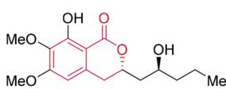  
Fusarentin (natural insecticide)

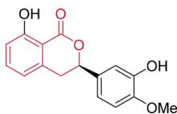  
Phyllodulcin (natural sweetener)

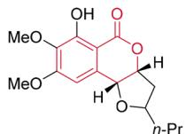  
Monocerin (fungal metabolic product)

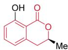  
(+)-Mellein (fungal metabolic product)   
Fig. 1 Selected natural products containing isochromanone.

(a) Direct aerobic oxidation of isochromans   
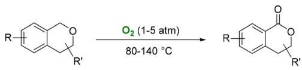

chemical

Chemical reaction equation showing oxidation of a naphthalene derivative to an enone using oxygen under 80-140 °C conditions

(b) Iron-catalyzed aerobic oxidation of isochromans   
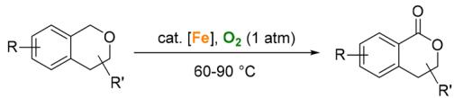

chemical

Chemical reaction equation showing oxidation of a ketone to an enone using Fe and O2 at 60-90°C

(c) This work   
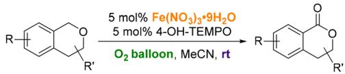

chemical

Chemical reaction scheme showing oxidation of a substituted furan derivative using Fe(NO3)3·9H2O and 4-OH-TEMPO under O2 balloon conditions

Mild conditions   
Non-noble metal catalysis   
High yields   
Easy scale up

Scheme 1 Aerobic oxidation of isochromans.   
Table 1 Optimization of the reaction conditionsa 

<table><tr><td>1a</td><td> $\xrightarrow[\text{solvent (0.8 mL)}]{\text{X mol\% Fe(NO}_3\text{)}_3 \cdot 9\text{H}_2\text{O}}$ 2a</td><td>2a&#x27; not observed</td></tr></table>

<table><tr><td>Entry</td><td>X</td><td>Nitroxyl</td><td>Solvent</td><td>Recovery of 1a (%)</td><td>NMR yield of 2a (%)</td></tr><tr><td>1</td><td>5</td><td>4-OH-TEMPO</td><td>MeCN</td><td>0</td><td> $100 (94^b)$ </td></tr><tr><td>2</td><td>5</td><td>4-OH-TEMPO</td><td>DCM</td><td>12</td><td>89</td></tr><tr><td>3</td><td>5</td><td>4-OH-TEMPO</td><td>DCE</td><td>16</td><td>84</td></tr><tr><td>4</td><td>5</td><td>4-OH-TEMPO</td><td>CHCl3</td><td>50</td><td>50</td></tr><tr><td>5</td><td>5</td><td>4-OH-TEMPO</td><td>Toluene</td><td>78</td><td>22</td></tr><tr><td>6</td><td>5</td><td>4-OH-TEMPO</td><td>MTBE</td><td>58</td><td>40</td></tr><tr><td>7</td><td>5</td><td>4-OH-TEMPO</td><td>MeOH</td><td>97</td><td>1</td></tr><tr><td>8</td><td>5</td><td>4-OMe-TEMPO</td><td>MeCN</td><td>0</td><td>100</td></tr><tr><td>9</td><td>5</td><td>4-OBz-TEMPO</td><td>MeCN</td><td>0</td><td>100</td></tr><tr><td>10</td><td>5</td><td>4-Oxo-TEMPO</td><td>MeCN</td><td>25</td><td>75</td></tr><tr><td>11</td><td>5</td><td>4-NHAc-TEMPO</td><td>MeCN</td><td>0</td><td>100</td></tr><tr><td>12</td><td>5</td><td>4-NH2-TEMPO</td><td>MeCN</td><td>0</td><td>100</td></tr><tr><td>13</td><td>5</td><td>TEMPO</td><td>MeCN</td><td>1</td><td>99</td></tr><tr><td>14</td><td>2</td><td>4-OH-TEMPO</td><td>MeCN</td><td>15</td><td>85</td></tr><tr><td>15</td><td>1</td><td>4-OH-TEMPO</td><td>MeCN</td><td>50</td><td>42</td></tr><tr><td> $16^c$ </td><td>5</td><td>4-OH-TEMPO</td><td>MeCN</td><td>100</td><td>0</td></tr><tr><td> $17^d$ </td><td>5</td><td>—</td><td>MeCN</td><td>97</td><td>0</td></tr></table>

a Reaction conditions: 1a (1.0 mmol), Fe(NO ) ·9H O (X mol%) and 4-OH-TEMPO (X mol%) in solvent (1.25 M) with an oxygen balloon at room temperature and the recovery and NMR yield were determined by 1 H NMR analysis of the crude product. b Isolated yield. c Without Fe $\left( \mathbf { N O } _ { 3 } \right) _ { 3 } { \cdot } 9 \mathbf { H } _ { 2 } \mathbf { O } . \mathbf { \Lambda } ^ { i }$ Without 4-OH-TEMPO.

reactivity and provided lactones 2a–2e in excellent yields. The reaction rate of electron-withdrawing substrates was relatively slow, thus, higher loadings of catalysts were required with excellent yields for products 2g–2i. This transformation could

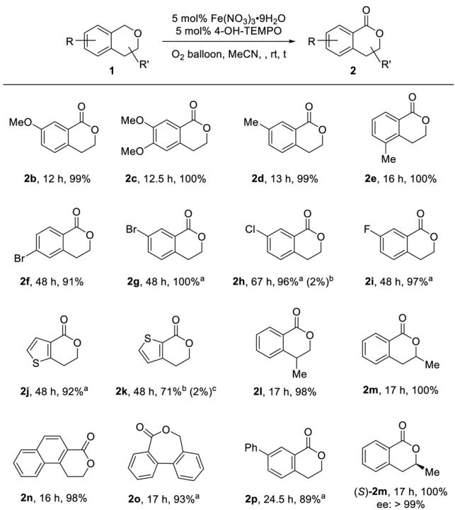

chemical

Chemical reaction scheme showing oxidation of indole derivatives to ketone, with yields and stereoselectivity data for various substrates

Scheme 2 Scope study. Reaction conditions: 1 (1.0 mmol), Fe (NO3)3·9H2O (5 mol%) and 4-OH-TEMPO (5 mol%) in MeCN (0.8 mL) with an oxygen balloon at rt. All yields were isolated yields unless otherwise mentioned. Recovery was determined by 1 H NMR analysis of the crude reaction mixture using dibromomethane as the internal standard. a 10 mol% each of Fe(NO3)3·9H2O and 4-OH-TEMPO were used. b Recovery of the starting material. c Isolated yield of thiophene-2,3- dicarbaldehyde 3k is shown in parenthesis.

be extended to heteroaromatic derivatives 2j and 2k. Methylsubstituted products 2l and 2m may also be prepared in excellent yields. Naphthyl and biphenyl groups were also compatible (2n–2p). Furthermore, it is noted that chiral substrate (S)- 1m (>99% ee) was oxidized under the standard conditions without racemization.

Next, we examined the scope of this method. In addition to isochromans, the reaction of xanthene 4 could be performed well under the standard conditions, giving xanthone 5 in 100% yield (eqn (1)). With 2 mol% each of $\mathrm { F e } ( \mathrm { N O } _ { 3 } ) _ { 3 } { \cdot } 9 \mathrm { H } _ { 2 } \mathrm { O }$ and 4-OH-TEMPO in MeCN, phthalan 1q was successfully transformed into phthalide 2q in 60% yield,3a,4b,c,f,n–p,6a,e,7,8l–n,10a–c,e,h,i,m,n,11c,13 although 12% yield of o-phthalaldehyde 3q was observed (eqn (2)). In addition, the practicality has been demonstrated by applying 10 mmol of 1a, affording 1.4506 g of 2a in 98% yield (eqn (3)).

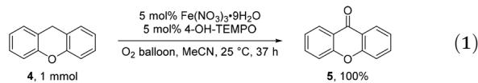

chemical

Chemical reaction equation showing oxidation of naphthalene derivative 4,1 mmol to ketone 5,100% using Fe(NO3)3·9H2O and 4-OH-TEMPO catalyst

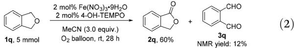

chemical

Chemical reaction equation showing oxidation of 1q to 2q using Fe(NO3)3·9H2O and 4-OH-TEMPO under MeCN conditions

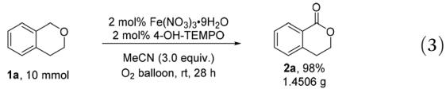

chemical

Chemical reaction equation showing oxidation of 1a to 2a using Fe(NO3)3·9H2O and 4-OH-TEMPO under MeCN conditions

Several control experiments were carried out to gain insight into the reaction mechanism. Under an Ar atmosphere, 5 mol% each of two catalysts could also generate 13% yield of product 2a (Table 2, entry 1). This discovery prompted us to increase the loading of each catalyst (Table 2, entries 2 and 3). As we expected, higher loadings of the catalysts led to higher yield of product 2a even in the absence of oxygen. Thus, the presence of oxygen is critical for the catalytic cycle. Isotopic $^ { 1 8 } \mathrm { O }$ distribution experiments were also carried out using $^ { 1 8 } { \bf O } _ { 2 }$ instead of $^ { 1 6 } { \bf O } _ { 2 }$ or adding 2.0 equivalents of ${ \mathrm { H } } _ { 2 } ^ { \ 1 8 } \mathrm { O }$ under the standard conditions to demonstrate the source of the oxygen atom in 2a (Scheme 3A). It is clear that the oxygen atom on carbonyl comes from ${ \bf O } _ { 2 }$ and/or ${ \bf H } _ { 2 } { \bf O } _ { \mathrm { \ell } }$ . We also conducted control experiments to verify how water affects the reaction: with the addition of $\mathbf { H } _ { 2 } \mathbf { O } ,$ , the reaction slowed down (Table 3, entry 1 vs. entries 2 and 3). The reaction rate also reduced with the addition of $5 \mathrm { ~ \AA ~ }$ molecular sieves (Table 3, entries 4–6). Given that there is crystal water in the $\mathrm { F e } ( \mathrm { N O } _ { 3 } ) _ { 3 } { \cdot } 9 \mathrm { H } _ { 2 } \mathrm { O }$ catalyst and also water could be formed in the reaction process, additional water is unnecessary.

Based on the results of mechanistic studies and literature reports, a plausible mechanism is proposed (Scheme 3B). Nitrate is reduced to radical species, $\mathbf { N O } _ { 2 }$ and $\mathbf { N O } ,$ by 4-OH-TEMPO under the promotion of $\mathrm { F e } ^ { \mathrm { I I I } } . \mathrm { \Lambda } ^ { 1 2 , 1 4 } \mathrm { \ N O } _ { 2 }$ would abstract a benzylic hydrogen atom producing benzylic radical 1a′. Next, $\mathbf { 1 } \mathbf { a } ^ { \prime }$ may couple with $\mathbf { N O } _ { 2 }$ affording nitrite ester Int 1, which would undergo HNO elimination to afford the target product $2 \mathbf { a } . ^ { 6 b }$ Alternatively, the hydrolysis of Int 1 may afford the hemiacetal Int 2, which could be further oxidized to give 2a. The hemiacetal Int 2 may also be generated from Int 3, which was formed by hydride transfer from the benzylic carbon of 1a to the oxygen of the oxoammonium salt 4-OH-TEMPO+ . 15 Oxygen plays an important role in regenerating $\mathbf { N O } _ { 2 }$ by oxidizing $\mathrm { N O . } ^ { 1 2 }$ The presence of peroxide intermediates cannot be excluded: radical 1a′ could react with $\mathbf { O } _ { 2 }$ to afford peroxyl radical species Int 4, which could be further transformed to afford lactone 2a.6b,7

Table 2 Control experimentsa 

<table><tr><td></td><td>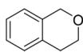1a</td><td>X mol% Fe(NO3)3·9H2O X mol% 4-OH-TEMPO Ar, MeCN, 25 °C, 24 h</td><td>2a</td></tr><tr><td>Entry</td><td>X mol%</td><td>Recovery of 1a (%)</td><td>NMR yield of 2a (%)</td></tr><tr><td>1</td><td>5</td><td>85</td><td>13</td></tr><tr><td>2</td><td>15</td><td>62</td><td>35</td></tr><tr><td>3</td><td>40</td><td>14</td><td>86</td></tr></table>

a Reaction conditions: 1a (1.0 mmol), Fe(NO ) ·9H O (X mol%) and 4-OH-TEMPO (X mol%) in MeCN (0.8 mL) at $2 5 ~ ^ { \circ } \mathrm { C } .$ . Recovery and NMR yield were determined by 1 H NMR analysis of the crude product. The reaction was carried out under an argon atmosphere and MeCN was degassed.

Isotopic  Distribution Experiments   
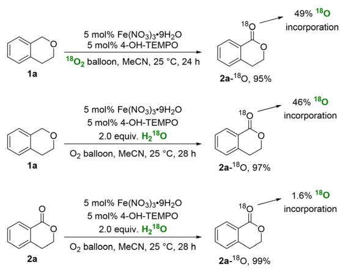

chemical

Three-step organic synthesis reaction scheme involving 1a, 2a, and 2a-18O intermediates with reagents and yields

Proposed Mechanisms   
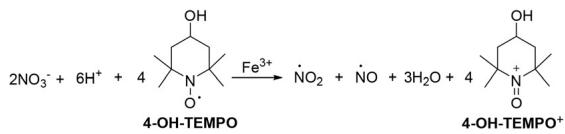

chemical

Chemical reaction equation showing oxidation of 4-OH-TEMPO to 4-OH-TEMPO+ using Fe³⁺ catalyst

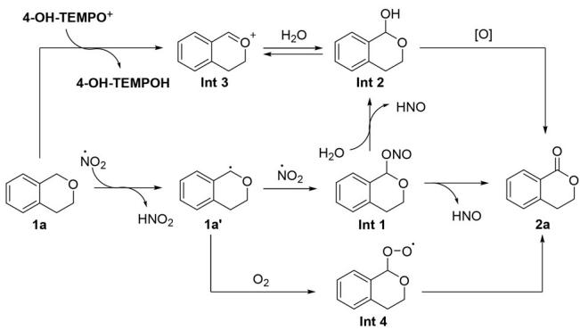

chemical

Reaction mechanism diagram showing intermediates 1a, 1a', 1b', 2a, and 2b' with reagents like 4-OH-TEMPO⁺, HNO₂, and [O]

Scheme 3 Mechanistic studies and proposed mechanisms.

Table 3 The effect of ${ \sf H } _ { 2 } { \sf O }$ in aerobic oxidation of isochroman $\pmb { 1 } \hat { \mathbf { a } } ^ { a }$ 

<table><tr><td>Entry</td><td>X (equiv.)</td><td>Y (mg)</td><td>Recovery of 1a (%)</td><td>NMR yield of 2a (%)</td></tr><tr><td>1</td><td>0</td><td>0</td><td>0</td><td>100</td></tr><tr><td>2</td><td>1</td><td>0</td><td>44</td><td>53</td></tr><tr><td>3</td><td>2</td><td>0</td><td>62</td><td>35</td></tr><tr><td>4</td><td>0</td><td>20</td><td>7</td><td>93</td></tr><tr><td>5</td><td>0</td><td>40</td><td>15</td><td>85</td></tr><tr><td>6</td><td>0</td><td>60</td><td>65</td><td>25</td></tr></table>

a Reaction conditions: 1a (1.0 mmol), Fe(NO ) ·9H O (5 mol%), 4-OH-TEMPO (5 mol%) and H2O (X equiv.) or 5 Å molecular sieves (Y mg) in MeCN (0.8 mL) with an oxygen balloon at 25 °C. Recovery and NMR yield were determined by 1 H NMR analysis of the crude product.

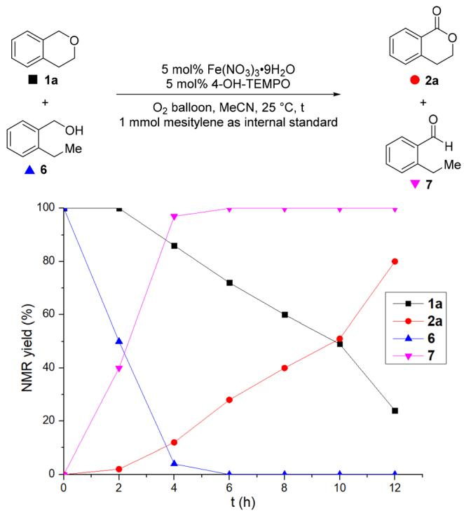

line

| t (h) | 1a   | 2a   | 6    |
|-------|------|------|------|
| 0     | 100  | 0    | 100  |
| 2     | 100  | 2    | 50   |
| 4     | 85   | 12   | 3    |
| 6     | 72   | 28   | 0    |
| 8     | 60   | 40   | 0    |
| 10    | 48   | 50   | 0    |
| 12    | 24   | 80   | 0    |

Fig. 2 The monitoring of iron nitrate and 4-OH-TEMPO-cocatalyzed aerobic oxidation of isochroman 1a and o-ethylbenzyl alcohol 6.

We also compared the efficiency of oxidation of the benzyl position by monitoring the iron nitrate and 4-OH-TEMPOcocatalyzed aerobic oxidation of isochroman 1a and o-ethylbenzyl alcohol 6 showing that the oxidation of o-ethylbenzyl alcohol 6 to aldehyde 7 is more efficient (Fig. 2).

# Conclusions

In summary, $\mathrm { F e } ( \mathrm { N O } _ { 3 } ) _ { 3 } { \cdot } 9 \mathrm { H } _ { 2 } \mathrm { O }$ and 4-OH-TEMPO were found to be effective for the aerobic oxidation of the benzylic $\mathsf { s p } ^ { 3 }$ C–H bonds of isochromans under very mild conditions. This catalytic protocol can be extended to the oxidation of xanthene and phthalan in satisfactory yields as well. Based on mechanistic studies, a rationale has been proposed. Further investigations in this area are ongoing in our laboratory.

# Conflicts of interest

There are no conflicts to declare.

# Acknowledgements

Financial support from the National Natural Science Foundation of China (grant no. 21988101) and the National Key R&D Program of China (2022 YFA1503200) is greatly appreciated. We thank Mr Yaqi Shi in this group for reproducing the results of 2b, 2k and 5 presented in Scheme 2 and eqn (1).

# References

1 For selected reports on natural products containing 1-isochromanone structures, see: (a) J. F. Grove and M. Pople, Metabolic products of fusarium larvarum fuckel. The fusarentins and the absolute configuration of monocerin, J. Chem. Soc., Perkin Trans. 1, 1997, 2048–2051; (b) M. Yoshikawa, E. Uchida, N. Chatani, H. Kobayashi, Y. Naitoh, Y. Okuno, H. Matsuda, J. Yamahara and N. Murakami, Thunberginols C, D, and E, new antiallergic and antimicrobial dihydroisocoumarins, and thunberginol G 3′-O-glucoside and (-)-hydrangenol 4′-O-glucoside, new dihydroisocoumarin glycosides, from hydrangeae dulcis folium, Chem. Pharm. Bull., 1992, 40, 3352–3354; (c) D. C. Aldridge and W. B. Turner, Metabolites of helminthosporium monoceras: structures of monocerin and related benzopyrans, J. Chem. Soc. C, 1970, 18, 2598–2600; (d) E. L. Patterson, W. W. Andres and N. Bohonos, Isolation of the optical antipode of mellein from an unidentified fungus, Experientia, 1966, 22, 209–210.

2 For selected reviews on the aerobic oxidation of the benzylic C–H bonds of isochromans, see: (a) Y. Ishii, S. Sakaguchi and T. Iwahama, Innovation of hydrocarbon oxidation with molecular oxygen and related reactions, Adv. Synth. Catal., 2001, 343, 393–427; (b) T. Punniyamurthy, S. Velusamy and J. Iqbal, Recent advances in transition metal catalyzed oxidation of organic substrates with molecular oxygen, Chem. Rev., 2005, 105, 2329–2364; (c) K. Chen, P. Zhang, Y. Wang and H. Li, Metal-free allylic/ benzylic oxidation strategies with molecular oxygen: recent advances and future prospects, Green Chem., 2014, 16, 2344–2374; (d) H. Sterckx, B. Morel and B. U. W. Maes, Catalytic aerobic oxidation of C(sp3 )-H bonds, Angew. Chem., Int. Ed., 2019, 58, 7946–7970.

3 For reports on the direct aerobic oxidation of isochromans, see: (a) X. Tian, X. Cheng, X. Yang, Y.-L. Ren, K. Yao, H. Wang and J. Wang, Aerobic conversion of benzylic $\mathsf { s p } ^ { 3 }$ C-H in diphenylmethanes and benzyl ethers to C=O bonds under catalyst-, additive- and light-free conditions, Org. Chem. Front., 2019, 6, 952–958; (b) P. Thapa, E. Corral, S. Sardar, B. S. Pierce and F. W. Foss, Isoindolinone synthesis: selective dioxane-mediated aerobic oxidation of Isoindolines, J. Org. Chem., 2019, 84, 1025–1034.

4 For reports on the photo-catalyzed aerobic oxidation of isochromans, see: (a) H. Yi, C. Bian, X. Hu, L. Niu and A. Lei, Visible light mediated efficient oxidative benzylic $\mathsf { s p } ^ { 3 }$ C-H to ketone derivatives obtained under mild conditions using $\mathbf { O } _ { 2 } ,$ Chem. Commun., 2015, 51, 14046–14049; (b) J. Li, W. Bao, Z. Tang, B. Guo, S. Zhang, H. Liu, S. Huang, Y. Zhang and Y. Rao, Cercosporin-bioinspired selective photooxidation reactions under mild conditions, Green

Chem., 2019, 21, 6073–6081; (c) P. Geng, Y. Tang, G. Pan, W. Wang, J. Hu and Y. Cai, A $\mathrm { g } { \mathrm { - } } \mathrm { C } _ { 3 } \mathrm { N } _ { 4 }$ -based heterogeneous photocatalyst for visible light mediated aerobic benzylic C-H oxygenations, Green Chem., 2019, 21, 6116–6122; (d) D. Hu and X. Jiang, Stepwise benzylic oxygenation via uranyl-photocatalysis, Green Chem., 2022, 24, 124–129; (e) S.-S. Zhu, Y. Liu, X.-L. Chen, L.-B. Qu and B. $\mathbf { Y u } ,$ Polymerization-enhanced photocatalysis for the functionalization of C(sp3 )-H bonds, ACS Catal., 2022, 12, 126–134. For reports on the light- and radical initiatormediated aerobic oxidation of isochromans, see: (f ) H. Seto, K. Yoshida, S. Yoshida, T. Shimizu, H. Seki and M. Hoshino, Oxidation of ethers to esters by photoirradiation with benzil and oxygen, Tetrahedron Lett., 1996, 37, 4179–4182; (g) A. Itoh, T. Kodama and Y. Masaki, New synthetic method of benzaldehydes and α,β-unsaturated aldehydes with $\mathbf { I } _ { 2 }$ under photoirradiation, Chem. Lett., 2001, 30, 686–687. For reports on the photo- and organocatalyzed aerobic oxidation of isochromans, see: (h) F. Rusch, J.-C. Schober and M. Brasholz, Visible-light photocatalytic aerobic benzylic $\mathbf { C } ( \mathbf { s } \mathbf { p } ^ { 3 } )$ -H oxygenations with the 3 DDQ\*/tert-butyl nitrite co-catalytic system, ChemCatChem, 2016, 8, 2881–2884; (i) X. Liu, L. Lin, X. Ye, C.-H. Tan and Z. Jiang, Aerobic oxidation of benzylic $\mathsf { s p } ^ { 3 }$ C-H bonds through cooperative visible-light photoredox catalysis of N-hydroxyimide and dicyanopyrazine, Asian J. Org. Chem., 2017, 6, 422–425. For reports on the photoand metal-catalyzed aerobic oxidation of isochromans, see: ( j) J. Santamaria and R. Jroundi, Electron transfer activation - a selective photooxidation method for the preparation of aromatic aldehydes and ketones, Tetrahedron Lett., 1991, 32, 4291–4294; (k) B. Mühldorf and R. Wolf, C-H photooxygenation of alkyl benzenes catalyzed by riboflavin tetraacetate and a non-heme iron catalyst, Angew. Chem., Int. Ed., 2016, 55, 427–430; (l) P. Dongare, I. MacKenzie, D. Wang, D. A. Nicewicz and T. J. Meyer, Oxidation of alkyl benzenes by a flavin photooxidation catalyst on nanostructured metal-oxide films, Proc. Natl. Acad. Sci. U. S. A., 2017, 114, 9279–9283; (m) L. Ren, M.-M. Yang, C.-H. Tung, L.-Z. Wu and H. Cong, Visible-light photocatalysis employing dye-sensitized semiconductor: selective aerobic oxidation of benzyl ethers, ACS Catal., 2017, 7, 8134–8138; (n) A. Sagadevan, K. C. Hwang and M.-D. Su, Singlet oxygen-mediated selective C-H bond hydroperoxidation of ethereal hydrocarbons, Nat. Commun., 2017, $\mathbf { 8 } ,$ 1812–1819; (o) L. C. Finney, L. J. Mitchell and C. J. Moody, Visible light mediated oxidation of benzylic $\mathsf { s p } ^ { 3 }$ C-H bonds using catalytic 1,4-hydroquinone, or its biorenewable glucoside, arbutin, as a pre-oxidant, Green Chem., 2018, 20, 2242–2249; (p) Y.-H. Wang, Q. Yang, P. J. Walsh and E. J. Schelter, Light-mediated aerobic oxidation of $\mathbf { C } ( \mathbf { s p } ^ { 3 } ) – \mathbf { H }$ bonds by a Ce(IV) hexachloride complex, Org. Chem. Front., 2022, 9, 2612–2620.

5 X. Li, F. Bai, C. Liu, X. Ma, C. Gu and B. Dai, Selective electrochemical oxygenation of alkylarenes to carbonyls, Org. Lett., 2021, 23, 7445–7449.

6 (a) Á. Pintér and M. Klussmann, Sulfonic acid-catalyzed autoxidative carbon-carbon coupling reaction under elevated partial pressure of oxygen, Adv. Synth. Catal., 2012, 354, 701– 711; (b) Z. Zhang, Y. Gao, Y. Liu, J. Li, H. Xie, H. Li and W. Wang, Organocatalytic aerobic oxidation of benzylic $\displaystyle { \mathsf { s p } } ^ { 3 }$ C-H bonds of ethers and alkylarenes promoted by a recyclable TEMPO catalyst, Org. Lett., 2015, 17, 5492–5495; (c) X. Tian, F. Ren, B. Zhao, Y.-L. Ren, S. Zhao and J. Wang, Nitric acid-catalyzed aerobic oxidation of benzylic $\mathsf { s p } ^ { 3 }$ C-H bonds of isochromans, xanthenes and 9-fluorenone under additive-free conditions, Catal. Commun., 2018, 106, 44–49; (d) T. Katsina, L. Clavier, J.-F. Giffard, N. M. P. da Silva, J. Fournier, R. Tamion, C. Copin, S. Arseniyadis and A. Jean, Scalable aerobic oxidation of alcohols using catalytic DDQ/ $\mathrm { H N O } _ { 3 } ,$ Org. Process Res. Dev., 2020, 24, 856–860; (e) K. Niu, X. Shi, L. Ding, Y. Liu, H. Song and Q. Wang, HCl-catalyzed aerobic oxidation of alkylarenes to carbonyls, ChemSusChem, 2022, 15, e202102326.

7 T. Thatikonda, S. K. Deepake, P. Kumar and U. Das, α-Angelica lactone catalyzed oxidation of benzylic $\displaystyle \mathbf { s } \mathbf { p } ^ { 3 }$ C-H bonds of isochromans and phthalans, Org. Biomol. Chem., 2020, 18, 4046–4050.

8 For a report on the TEMPO-catalyzed aerobic oxidation of isochromans, see: (a) P. Thapa, S. Hazoor, B. Chouhan, T. T. Vuong and F. W. Foss, Flavin nitroalkane oxidase mimics compatibility with NOx/TEMPO catalysis: aerobic oxidization of alcohols, diols, and ethers, J. Org. Chem., 2020, 85, 9096–9105. For selected reports on the NHPI-catalyzed aerobic oxidation of isochromans, see: (b) Y. Ishii, K. Nakayama, M. Takeno, S. Sakaguchi, T. Iwahama and Y. Nishiyama, A novel catalysis of N-hydroxyphthalimide in the oxidation of organic substrates by molecular oxygen, J. Org. Chem., 1995, 60, 3934–3935; (c) Z. Li, Y. Zhang, K. Li, Z. Zhou, Z. Zha and Z. Wang, Selective electrochemical oxidation of aromatic hydrocarbons and preparation of mono/ multi-carbonyl compounds, Sci. China: Chem., 2021, 64, 2134–2141; (d) Q. Ma, S. Zhang, Y. Yuan, H. Ding, Y. Li, Z. Sun, Y. Yuan and X. Jia, Multifunctionalization of C(sp3 )- H bond of tetrahydroisoquinolines through C-H activation relay (CHAR) using α-cyanotetrahydroisoquinolines as starting materials, Eur. J. Org. Chem., 2022, e202200554. For reports on the NHPI type- and metal-catalyzed aerobic oxidation of isochromans, see: (e) Y. Ishii, A novel catalysis of N-hydroxyphthalimide (NHPI) combined with Co(acac)n (n = 2 or 3) in the oxidation of organic substrates with molecular oxygen, J. Mol. Catal. A: Chem., 1997, 117, 123– 137; (f ) J.-R. Wang, L. Liu, Y.-F. Wang, Y. Zhang, W. Deng and Q.-X. Guo, Aerobic oxidation with N-hydroxyphthalimide catalysts in ionic liquid, Tetrahedron Lett., 2005, 46, 4647–4651; (g) Y. Wang, X. Chen, H. Jin and Y. Wang, Mild and practical dirhodium(II)/NHPI-mediated allylic and benzylic oxidations with air as the oxidant, Chem. – Eur. J., 2019, 25, 14273–14277; (h) L. Wang, Y. Zhang, H. Yuan, R. Du, J. Yao and H. Li, Selective aerobic oxidation of secondary C(sp3 )-H bonds with NHPI/ CAN catalytic system, Catal. Lett., 2021, 151, 1663–1669;

(i) M. Nechab, C. Einhorn and J. Einhorn, New aerobic oxidation of benzylic compounds: efficient catalysis by N-hydroxy-3,4,5,6-tetraphenylphthalimide (NHTPPI)/CuCl under mild conditions and low catalyst loading, Chem. Commun., 2004, 2004, 1500–1501; ( j) Y. Kadoh, K. Oisaki and M. Kanai, Enhanced structural variety of nonplanar N-oxyl radical catalysts and their application to the aerobic oxidation of benzylic C-H bonds, Chem. Pharm. Bull., 2016, 64, 737–753. For reports on heterocatalysis, see: (k) M. Zhao, X.-W. Zhang and C.-D. Wu, Structural transformation of porous polyoxometalate frameworks and highly efficient biomimetic aerobic oxidation of aliphatic alcohols, ACS Catal., 2017, 7, 6573–6580; (l) W.-L. He, X.-L. Yang, M. Zhao and C.-D. Wu, Suspending ionic single-atom catalysts in porphyrinic frameworks for highly efficient aerobic oxidation at room temperature, J. Catal., 2018, 358, 43–49; (m) M. Wang, G. Liang, Y. Wang, T. Fan, B. Yuan, M. Liu, Y. Yin and L. Li, Merging N-hydroxyphthalimide into metal-organic frameworks for highly efficient and environmentally benign aerobic oxidation, Chem. – Eur. J., 2021, 27, 9674–9685; (n) S. A. Pawar, S. V. Poojari and A. Vijay Kumar, Cu2O-CD nanosuperstructures as a biomimetic catalyst for oxidation of benzylic $\mathsf { s p } ^ { 3 }$ C-H bonds and secondary amines using molecular oxygen: first total synthesis of proposed Swerilactone O, Asian J. Org. Chem., 2022, 11, e202200030.   
9 Z.-Y. Ju, L.-N. Song, M.-B. Chong, D.-G. Cheng, Y. Hou, X.-M. Zhang, Q.-H. Zhang and L.-H. Ren, Selective aerobic oxidation of $\mathrm { C } _ { \mathrm { s p } ^ { 3 } } .$ H bonds catalyzed by yeast-derived nitrogen, phosphorus, and oxygen codoped carbon materials, J. Org. Chem., 2022, 87, 3978–3988.   
10 For reports on the noble metal-catalyzed aerobic oxidation of isochromans, see: (a) M. Sommovigo and H. Alper, Aerobic oxidation of ethers and alkenes catalyzed by a novel palladium complex, J. Mol. Catal., 1994, 88, 151–158; (b) M. Miyamoto, Y. Minami, Y. Ukaji, H. Kinoshita and K. Inomata, A new aerobic oxidation system using Pd-Cu catalysts in the presence of CO, Chem. Lett., 1994, 23, 1149– 1152; (c) N. Yasukawa, T. Kanie, M. Kuwata, Y. Monguchi, H. Sajiki and Y. Sawama, Palladium on carbon-catalyzed benzylic methoxylation for synthesis of mixed acetals and orthoesters, Chem. – Eur. J., 2017, 23, 10974–10977; (d) H.-X. Wang, Q. Wan, K. Wu, K.-H. Low, C. Yang, C.-Y. Zhou, J.-S. Huang and C.-M. Che, Ruthenium(II) porphyrin quinoid carbene complexes: synthesis, crystal structure, and reactivity toward carbene transfer and hydrogen atom transfer reactions, J. Am. Chem. Soc., 2019, 141, 9027– 9046; (e) S. Liu, S. Li, X. Shen, Y. Wang, J. Du, B. Chen, B. Han and H. Liu, Selective aerobic oxidation of cyclic ethers to lactones over Au/CeO without any additives, Chem. Commun., 2020, 56, 2638–2641. For reports on the cheap metal-catalyzed aerobic oxidation of isochromans, see: (f) P. Li and H. Alper, Cobalt-catalyzed oxidation of ethers using oxygen, J. Mol. Catal., 1992, 72, 143–152; (g) K. Nakayama, M. Hamamoto, Y. Nishiyama and Y. Ishii, Oxidation of benzylic derivatives with dioxygen catalyzed by

mixed addenda metallophosphate containing vanadium and molybdenum, Chem. Lett., 1993, 22, 1699–1702; (h) M. T. Reetz and K. Töllner, Cobalt-catalyzed partial oxidation of olefins and ethers using molecular oxygen, Tetrahedron Lett., 1995, 36, 9461–9464; (i) A. M. Romano and M. Ricci, New efficient catalysts for the aerobic oxidation of ethers, J. Mol. Catal. A: Chem., 1997, 120, 71–74. For selected reports on heterocatalysis, see: ( j) A. Shaabani, Z. Hezarkhani and E. Badali, Wool supported manganese dioxide nano-scale dispersion: a biopolymer based catalyst for the aerobic oxidation of organic compounds, RSC Adv., 2015, 5, 61759–61767; (k) A. Shaabani, S. Shaabani and H. Afaridoun, Highly selective aerobic oxidation of alkyl arenes and alcohols: cobalt supported on natural hydroxyapatite nanocrystals, RSC Adv., 2016, 6, 48396–48404; (l) A. Shaabani, Z. Hezarkhani and M. K. Nejad, Cr- and Zn-substituted cobalt ferrite nanoparticles supported on guanidine-modified graphene oxide as efficient and recyclable catalysts, J. Mater. Sci., 2017, 52, 96–112; (m) N. Nagarjun and A. Dhakshinamoorthy, Aerobic oxidation of benzylic hydrocarbons by iron-based metal organic framework as solid heterogeneous catalyst, ChemistrySelect, 2018, 3, 12155–12162; (n) K. Gao, C. Huang, Y. Yang, H. Li, J. Wu and H. Hou, Cu(I)-based metal-organic frameworks as efficient and recyclable heterogeneous catalysts for aqueous-medium C-H oxidation, Cryst. Growth Des., 2019, 19, 976–982; (o) Y. Zheng, Q. Shen, Z. Li, X. Jing and C. Duan, Two copper-containing polyoxometalate-based metal-organic complexes as heterogeneous catalysts for the C-H bond oxidation of benzylic compounds and olefin epoxidation, Inorg. Chem., 2022, 61, 11156–11164.

11 (a) A. Gonzalez-de-Castro, C. M. Robertson and J. Xiao, Dehydrogenative α-oxygenation of ethers with an iron catalyst, J. Am. Chem. Soc., 2014, 136, 8350–8360; (b) C. Hong, J. Ma, M. Li, L. Jin, X. Hu, W. Mo, B. Hu, N. Sun and Z. Shen, Ferric nitrate-catalyzed aerobic oxidation of benzylic $\mathsf { s p } ^ { 3 }$ C-H bonds of ethers and alkylarenes, Tetrahedron, 2017, 73, 3002–3009; (c) S. Geng, B. Xiong, Y. Zhang, J. Zhang, Y. He and Z. Feng, Thiyl radical promoted iron-catalyzed-selective oxidation of benzylic $\mathsf { s p } ^ { 3 }$ C-H bonds with molecular oxygen, Chem. Commun., 2019, 55, 12699–12702; (d) J. Wang, C. Zhang, X.-Q. Ye, W. Du, S. Zeng, J.-H. Xu and H. Yin, An efficient and practical aerobic oxidation of benzylic methylenes by recyclable N-hydroxyimide, RSC Adv., 2021, 11, 3003–3011.

12 For selected reports on Fe(NO ) ·9H O-catalyzed aerobic oxidative reactions, see: (a) S. Ma, J. Liu, S. Li, B. Chen, J. Cheng, J. Kuang, Y. Liu, B. Wan, Y. Wang, J. Ye, Q. Yu, W. Yuan and S. Yu, Development of a general and practical iron nitrate/TEMPO-catalyzed aerobic oxidation of alcohols to aldehydes/ketones: catalysis with table salt, Adv. Synth. Catal., 2011, 353, 1005–1017; (b) J. Liu, X. Xie and S. Ma, Aerobic oxidation of propargylic alcohols to $\alpha , \beta \cdot$ -unsaturated alkynals or alkynones catalyzed by Fe $\left( \mathrm { N O } _ { 3 } \right) _ { 3 } { \cdot } 9 \mathrm { H } _ { 2 } \mathrm { O } _ { 3 }$ , TEMPO and sodium chloride in toluene,

Synthesis, 2012, 1569–1576; (c) J. Liu and S. Ma, Iron-catalyzed aerobic oxidation of allylic alcohols: the issue of C=C bond isomerization, Org. Lett., 2013, 15, 5150–5153; (d) J. Liu and S. Ma, Room temperature $\mathrm { F e } \left( \mathrm { N O } _ { 3 } \right) _ { 3 } { \cdot } 9 \mathrm { H } _ { 2 } \mathrm { O } /$ TEMPO/NaCl-catalyzed aerobic oxidation of homopropargylic alcohols, Tetrahedron, 2013, 69, 10161–10167; (e) X. Jiang, J. Zhang and S. Ma, Iron catalysis for roomtemperature aerobic oxidation of alcohols to carboxylic acids, J. Am. Chem. Soc., 2016, 138, 8344–8347; (f) L. Wang, S. Shang, G. Li, L. Ren, Y. Lv and S. Gao, Iron/ABNO-catalyzed aerobic oxidation of alcohols to aldehydes and ketones under ambient atmosphere, J. Org. Chem., 2016, 81, 2189–2193; (g) K. Lagerblom, P. Wrigstedt, J. Keskiväli, A. Parviainen and T. Repo, Iron-catalysed selective aerobic oxidation of alcohols to carbonyl and carboxylic compounds, ChemPlusChem, 2016, 81, 1160–1165; (h) X. Jiang and S. Ma, Studies on iron-catalyzed aerobic oxidation of benzylic alcohols to carboxylic acids, Synthesis, 2018, 1629– 1639; (i) X. Jiang, Y. Zhai, J. Chen, Y. Han, Z. Yang and S. Ma, Iron-catalyzed aerobic oxidation of aldehydes: single component catalyst and mechanistic studies, Chin. J. Chem., 2018, 36, 15–19; ( j) D. Zhai, L. Chen, M. Jia and S. Ma, One pot synthesis of γ-benzopyranones via ironcatalyzed aerobic oxidation and subsequent 4-dimethylaminopyridine catalyzed 6-endo cyclization, Adv. Synth. Catal., 2018, 360, 153–160; (k) X. Jiang, J. Liu and S. Ma, Iron-catalyzed aerobic oxidation of alcohols: lower cost and improved selectivity, Org. Process Res. Dev., 2019, 23, 825– 835; (l) M. Hong, J. Min, S. Wu, H. Cui, Y. Zhao, J. Li and S. Wang, Metal nitrate catalysis for selective oxidation of 5-hydroxymethylfurfural into 2,5-diformylfuran under oxygen atmosphere, ACS Omega, 2019, 4, 7054–7060; (m) J. E. Nutting, K. Mao and S. S. Stahl, Iron(III) nitrate/ TEMPO-catalyzed aerobic alcohol oxidation: distinguishing between serial versus integrated redox cooperativity, J. Am. Chem. Soc., 2021, 143, 10565–10570.

13 For selected reports on the aerobic oxidation of phthalans, see: (a) J. A. Pincock, A. L. Pincock and M. A. Fox, Controlled oxidation of benzyl ethers on irradiated semiconductor powders, Tetrahedron, 1985, 41, 4107–4117; (b) O. Fukuda, S. Sakaguchi and Y. Ishii, Preparation of hydroperoxides by N-hydroxyphthalimide-catalyzed aerobic oxidation of alkylbenzenes and hydroaromatic compounds and its application, Adv. Synth. Catal., 2001, 343, 809–813;

(c) N. S. Kus and C. Kazaz, Some oxidation reactions with molecular oxygen in subcritical water, Asian J. Chem., 2008, 20, 1226–1230; (d) A. Shaabani, E. Farhangi and A. Rahmati, Aerobic oxidation of alkyl arenes and alcohols using cobalt(II) phthalocyanine as a catalyst in 1-butyl-3- methyl-imidazolium bromide, Appl. Catal., A, 2008, 338, 14–19; (e) J. Zakzeski, A. Dębczak, P. C. A. Bruijnincx and B. M. Weckhuysen, Catalytic oxidation of aromatic oxygenates by the heterogeneous catalyst Co-ZIF-9, Appl. Catal., A, 2011, 394, 79–85; (f) A. Shaabani, M. Borjian Boroujeni and M. S. Laeini, Porous chitosan–MnO2 nanohybrid: a green and biodegradable heterogeneous catalyst for aerobic oxidation of alkylarenes and alcohols, Appl. Organomet. Chem., 2016, 30, 154–159; (g) S. Nakai, T. Uematsu, Y. Ogasawara, K. Suzuki, K. Yamaguchi and N. Mizuno, Aerobic oxygenation of alkylarenes over ultrafine transition-metal-containing manganese-based oxides, ChemCatChem, 2018, 10, 1096–1106; (h) G. Laudadio, S. Govaerts, Y. Wang, D. Ravelli, H. F. Koolman, M. Fagnoni, S. W. Djuric and T. Noël, Selective C(sp3 )-H aerobic oxidation enabled by decatungstate photocatalysis in flow, Angew. Chem., Int. Ed., 2018, 57, 4078–4082; (i) A. Gonzalez-de-Castro, C. M. Robertson and J. Xiao, Boosting molecular complexity with O2: iron-catalysed oxygenation of 1-arylisochromans through dehydrogenation, Csp3 -O bond cleavage and hydrogenolysis, Chem. – Eur. J., 2019, 25, 4345–4357; ( j) X. Liu, X.-S. Luo, H.-L. Deng, W. Fan, S. Wang, C. Yang, X.-Y. Sun, S.-L. Chen and M.-H. Huang, Functional porous organic polymers comprising a triaminotriphenylazobenzene subunit as a platform for copper-catalyzed aerobic C-H oxidation, Chem. Mater., 2019, 31, 5421–5430; (k) E. Hayashi, T. Tamura, T. Aihara, K. Kamata and M. Hara, Base-assisted aerobic C-H oxidation of alkylarenes with a murdochite-type oxide $\mathbf { M g _ { 6 } M n O _ { 8 } }$ nanoparticle catalyst, ACS Appl. Mater. Interfaces, 2022, 14, 6528–6537.

14 Y. Kuang, H. Rokubuichi, Y. Nabae, T. Hayakawa and M. Kakimoto, A nitric acid-assisted carbon-catalyzed oxidation system with nitroxide radical cocatalysts as an efficient and green protocol for selective aerobic oxidation of alcohols, Adv. Synth. Catal., 2010, 352, 2635–2642.

15 P. P. Pradhan, J. M. Bobbitt and W. F. Bailey, Oxidative cleavage of benzylic and related ethers, using an oxoammonium salt, J. Org. Chem., 2009, 74, 9524–9527.