Check for updates

Cite this: Chem. Commun., 2023,

59, 5281

Received 28th February 2023,

Accepted 22nd March 2023

DOI: 10.1039/d3cc00963g

rsc.li/chemcomm

# Copper-catalyzed aerobic oxidation of primary alcohols to carboxylic acids†

Yibo Yu, a Di Zhai,a Zhengnan Zhou,a Sheng Jiang,a Hui Qian \*a and Shengming Ma \*ab

Here, the first copper-catalyzed aerobic oxidation of primary alcohols to carboxylic acids with TEMPO and $K H S O _ { 4 }$ as the co-catalysts has been developed. The reaction exhibits excellent substrate scope and functional group compatibility under mild conditions. Even the very sensitive chiral alcohols, chiral amino alcohols, and alcohol-containing steroid skeletons may be oxidized to afford the corresponding carboxylic acids or lactones without racemization.

Carboxylic acids are prevalent in natural products, agrochemicals and drug molecules, such as ibuprofen, flurbiprofen, naproxen $e t c . ^ { 1 }$ Furthermore, carboxylic acids are widely featured in the synthesis of other chemicals of academic and/or industrial interest.2 One of the most common protocols for synthesizing carboxylic acids is the oxidation of primary alcohols.3–5 However, at least stoichiometric amounts of toxic and expensive oxidants are required in the traditional approaches, which is not cost-effective and environmentally friendly due to the high cost of such oxidants and the corresponding derived hazardous wastes.4,6,7 In this regard, the development of catalytic strategies using the environmentally benign and inexpensive molecular oxygen as the oxidant has been prominent.5,8–10 Some such methods with metal catalysts have been reported.11,12 However, the substrate scope is still very limited: the challenging substrates are the chiral alcohols including drug molecules, (S)-2-methylbutanol,13 and chiral amino alcohols14 due to very sensitive nature of the corresponding chiral acids with an a-chirality under the employed reaction parameters (Scheme 1a). Thus, we turned our attention to copper catalysis. The oxidation of primary alcohols to carboxylic acids with very high loadings of terminal oxidants,

such as, TBHP (5–14 equiv)) or $\mathbf { H } _ { 2 } \mathbf { O } _ { 2 }$ (5–20 equiv), has been reported (Scheme 1b).15 So far, there are no reports on the copper-catalyzed aerobic oxidation of primary alcohols to carboxylic acids.16,17 Herein, we present the first copper-catalyzed aerobic oxidation of primary alcohols to carboxylic acids under very mild conditions with a remarkable functional group compatibility under the assistance of a catalytic amount each of TEMPO and KHSO (Scheme 1c).

We commenced our investigations with the evaluation of different catalysts to enable the direct aerobic oxidation of alcohols to carboxylic acids by using cetyl alcohol (1a) as the model substrate (Table 1). Aldehyde 2a0 was formed in a 61% yield with 21% of recovery of 1a when the reaction was

(a) The earth-abundant metals-catalyzed aerobic oxidation of primary alcohols to carboxylic acids   
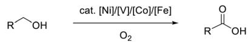

challenging substrates:   
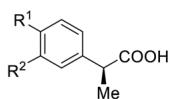  
drug molecules   
R1 = i-Bu, R{2}=}H buprofen   
R1= Ph, R{2}= F Flurbiprofen

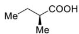  
useful building block

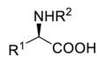  
chiral amino acids

(b) Copper-catalyzed oxidation of primary alcohols to carboxylic acids with highloadings of oxidants   
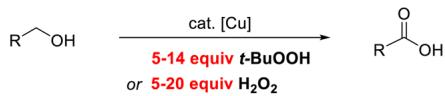

chemical

Chemical reaction equation showing oxidation of aldehyde to ketone using copper catalyst and t-BuOOH or H2O2 reagents

(c) Copper-catalyzed aerobic oxidation of alcohols to carboxylic acids (this work)   
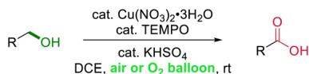  
readily available catalysts   
broad substrate scope   
very mild conditions   
chiral acid syntheses

Scheme 1 (a) The known earth-abundant metal-catalyzed aerobic oxidation of primary alcohols to carboxylic acids; (b) and (c) coppercatalyzed oxidation of primary alcohols to carboxylic acids.

Table 1 Screening of an extra catalyst for the aerobic oxidation of $\pmb { 1 } \hat { \mathbf { a } } ^ { a }$ 

<table><tr><td colspan="2"> $n-C_{15}H_{31}CH_2OH$ </td><td>Cu(NO3)2·3H2O (10 mol%)TEMPO (10 mol%)additive (10 mol%)DCE, O2(balloon), rt, 36 h</td><td> $n-C_{15}H_{31}CHO$  +  $2a'$ </td><td> $n-C_{15}H_{31}COOH$ 2a</td></tr><tr><td>Entry</td><td>Additive</td><td>Recovery of 1a(%)</td><td>NMR yield of 2a&#x27; (%)</td><td>NMR yield of 2a(%)</td></tr><tr><td>1</td><td>None</td><td>21</td><td>61</td><td>0</td></tr><tr><td>2</td><td>KHCO3</td><td>95</td><td>5</td><td>0</td></tr><tr><td>3</td><td>K2CO3</td><td>93</td><td>5</td><td>0</td></tr><tr><td>4</td><td>K3PO4</td><td>94</td><td>6</td><td>0</td></tr><tr><td>5</td><td>K2HPO4</td><td>95</td><td>6</td><td>0</td></tr><tr><td>6</td><td>KCl</td><td>0</td><td>18</td><td>76</td></tr><tr><td>7</td><td>KBr</td><td>0</td><td>61</td><td>30</td></tr><tr><td>8</td><td>KI</td><td>67</td><td>31</td><td>0</td></tr><tr><td>9</td><td>K2SO4</td><td>48</td><td>35</td><td>0</td></tr><tr><td>10</td><td>KH2PO4</td><td>0</td><td>12</td><td>87</td></tr><tr><td>11</td><td>NaH2PO4</td><td>0</td><td>0</td><td>98</td></tr><tr><td>12</td><td>NaHSO4·H2O</td><td>0</td><td>0</td><td>99</td></tr><tr><td>13</td><td>KHSO4</td><td>0</td><td>0</td><td>100</td></tr><tr><td>14</td><td>AlCl3</td><td>0</td><td>6</td><td>90</td></tr><tr><td>15</td><td>ZnCl2</td><td>0</td><td>4</td><td>92</td></tr><tr><td> $16^b$ </td><td>KHSO4</td><td>100</td><td>0</td><td>0</td></tr><tr><td> $17^c$ </td><td>KHSO4</td><td>0</td><td>10</td><td>88</td></tr></table>

a The reaction was conducted with 1.0 mmol of 1a, 10 mol% each of $\mathrm { C u } ( \mathrm { N O } _ { 3 } ) _ { 2 } { \cdot } 3 \mathrm { H } _ { 2 } \mathrm { O } ,$ , TEMPO, and additive in 4 mL of DCE at rt for 36 h with an O2 balloon. The NMR yield and recovery were determined by $^ 1 \mathrm { H }$ NMR analysis using dibromomethane as the internal standard. b Without $\mathrm { C u ( \bar { N } O _ { 3 } ) } _ { 2 } { \cdot } 3 \mathrm { H } _ { 2 } \mathrm { ( } \mathrm { ) } .$ c The reaction was conducted for 72 h with an air balloon.

conducted with 10 mol% of $\mathrm { C u } ( \mathrm { N O } _ { 3 } ) _ { 2 } { \cdot } 3 \mathrm { H } _ { 2 } \mathrm { O }$ and TEMPO (entry $1 ) . ^ { 1 7 c } \mathrm { K H C O _ { 3 } } , \mathrm { K _ { 2 } C O _ { 3 } } , \mathrm { K _ { 3 } P O _ { 4 } } ,$ and $\mathrm { K } _ { 2 } \mathrm { H P O } _ { 4 } ,$ , were first tested with considerable recovery of starting alcohol 1a (entries $2 { - } 5 )$ . Potassium halides have also been screened, and among them, KCl is better than KBr and KI albeit all with poor results (entries 6–8). Further screening led to the observation that the addition of $\mathrm { K H S O _ { 4 } }$ yielded carboxylic acid 2a in a quantitative yield (entry 13). A range of Lewis acids and solvents were also tested (Tables S1 and S2, ESI†), more than 90% of the corresponding acid 2a was formed in the presence of $\mathbf { A l C l } _ { 3 }$ or $\mathbf { Z } \mathrm { n C l } _ { 2 }$ (entries 14 and 15). Control experiment indicated that no reaction occurred in the absence of copper (entry 16) and a much lower efficiency was observed when the reaction was conducted in an air atmosphere (entry 17).

With these optimal reaction conditions in hand, the substrate scope was evaluated (Scheme 2). In addition to nonfunctionalized aliphatic acids 2a–c, the reaction may tolerate various functional groups, such as halogens, esters, ethers, and aryl and heteroaryl groups, affording the corresponding carboxylic acids 2d–m in up to 99% yields. Besides, the sterically more hindered 2-phenylpropan-1-ol, 2-methylbutan-1-ol, cyclohexyl methanol, and even 1-adamantanemethanol could be converted to the corresponding acids 2n–q. Notably, chiral acids (S)-2m and (S)-2n could be formed efficiently without erosion of enantiomeric excess as compared with the starting chiral alcohols.

To demonstrate the practicality of this protocol, some gramscale reactions were executed. When 10 mmol of cetyl alcohol 1a was submitted to the standard conditions at 50 ${ } ^ { \circ } \mathbf { C } ,$ 2.3 g (90% yield) of 2a could be afforded via simple recrystallization. (S)-2-methylbutanoic acid is an important chiral building block and very expensive $\left( \Psi \ : 1 3 9 3 \ : \mathrm { g } ^ { - 1 } \right.$ from Aldrich). Jones oxidation of (S)-2-methylbutanol, which utilized the highly toxic chromium compounds, is one of the traditional approaches to afford the chiral acid.13 Benefiting from the green and mild protocol developed here, a 50 mmol scale reaction of (S)-2-methylbutanol (S)-1o readily available from Aldrich (f 869/100 mL) could smoothly provide 3.6 g (72% yield) of (S)-2o via a simple distillation (eqn (1)). Also, the same reaction could be performed with a yield of 81% by using an air bag for 12 h first, which was followed by the supplementary supply of oxygen from a pure O2 bag (eqn (2)).

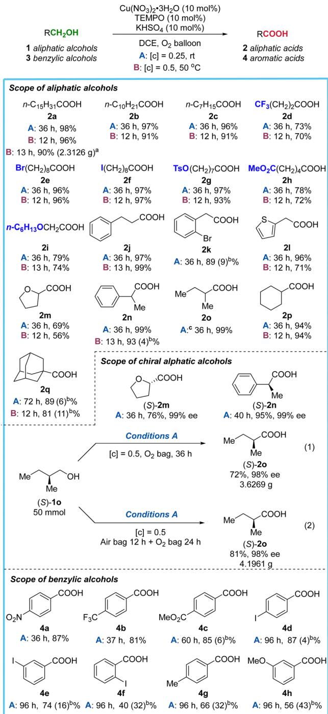

other

| Compound | Yield (%) | Condition | Yield (g) |
| :--- | :--- | :--- | :--- |
| RCH₂OH | 1 | [c] = 0.5, O₂ bag, 36 h | 36 h, 87% |
| Cu(NO₃)₂·3H₂O | 10 mol% | MeO₂C-COOH | 60 h, 85 (6)b% |
| TEMPO | 10 mol% | MeO-COOH | 96 h, 87 (4)b% |
| KHSO₄ | 10 mol% | I-C₆H₅COOH | 96 h, 74 (16)b% |
| DCE, O₂ balloon | 10 mol% | MeO-COOH | 96 h, 66 (32)b% |
| A: [c] = 0.25, rt | 10 mol% | MeO-COOH | 96 h, 56 (43)b% |
| B: [c] = 0.5, 50 °C | 10 mol% | MeO-COOH | 96 h, 66 (32)b% |
| RCOOH | 2 | [c] = 0.5, O₂ bag, 36 h | 36 h, 87% |
| 2 aliphatic acids | 2 | MeO-COOH | 96 h, 56 (43)b% |
| 4 aromatic acids | 2 | MeO-COOH | 96 h, 56 (43)b% |
| Scope of aliphatic alcohols | n-C₁₅H₃₁COOH | [c] = 0.5, O₂ bag, 36 h | 36 h, 87% |
| n-C₁₀H₂₁COOH | n-C₁₀H₂₁COOH | [c] = 0.5, O₂ bag, 36 h | 36 h, 87% |
| n-C₇H₁₅COOH | n-C₇H₁₅COOH | [c] = 0.5, O₂ bag, 36 h | 36 h, 87% |
| CF₃(CH₂)₂COOH | CF₃(CH₂)₂COOH | [c] = 0.5, O₂ bag, 36 h | 36 h, 87% |
| Br(CH₂)₈COOH | Br(CH₂)₈COOH | [c] = 0.5, O₂ bag, 36 h | 36 h, 87% |
| I(CH₂)₈COOH | I(CH₂)₈COOH | [c] = 0.5, O₂ bag, 36 h | 36 h, 87% |
| TsO(CH₂)₇COOH | TsO(CH₂)₇COOH | [c] = 0.5, O₂ bag, 36 h | 36 h, 87% |
| MeO₂C(CH₂)₄COOH | MeO₂C(CH₂)₄COOH | [c] = 0.5, O₂ bag, 36 h | 36 h, 87% |
| n-C₆H₁₃OCH₂COOH | n-C₆H₁₃COOH | [c] = 0.5, O₂ bag, 36 h | 36 h, 87% |
| n-C₆H₁₃OCH₂COOH | n-C₆H₁₃COOH | [c] = 0.5, O₂ bag, 36 h | 36 h, 87% |
| n-C₆H₁₃OCH₂COOH (2i) | n-C₆H₁₃OCH₂COOH (2j) | [c] = 0.5, O₂ bag, 36 h | 36 h, 87% |
| n-C₆H₁₃OCH₂COOH (2l) | n-C₆H₁₃OCH₂COOH (2k) | [c] = 0.5, O₂ bag, 36 h | 36 h, 87% |
| n-C₆H₁₃OCH₂COOH (2m) | n-C₆H₁₃OCH₂COOH (2n) | [c] = 0.5, O₂ bag, 36 h | 36 h, 87% |
| n-C₆H₁₃OCH₂COOH (2q) | n-C₆H₁₃OCH₂COOH (2m) | [c] = 0.5, O₂ bag, 36 h | 36 h, 87% |
Scope of chiral alphatic alcohols: 
[Structure: benzyl alcohol]
- [Condition: MeO-COOH] 
- Conditions: Air bag
- [c] = 0.5, O₂ bag
- Conditions: Air bag
- [c] = 0.5, O₂ bag
- [c] = 0.5, O₂ bag
- Conditions: Air bag
- Conditions: Air bag
- Conditions: Air bag
- Conditions: Air bag
- Conditions: Air bag
- Conditions: Air bag
- Conditions: Air bag
- Conditions: Air bag
- Conditions: Air bag
- Conditions: Air bag
- Conditions: Air bag
- Conditions: Air bag
- Conditions: Air bag
- Conditions: Air bag
- Conditions: Air bag
- Conditions: Air bag
- Conditions: Air bag
- Scyclohexane: [c] = 0.5, O₂ bag
- Scyclohexane: [c] = 0.5, O₂ bag
- Scyclohexane: [c] = 0.5, O₂ bag
- Scyclohexane: [c] = 0.5, O₂ bag
- Scyclohexane: [c] = 0.5, O₂ bag
- Scyclohexane: [c] = 0.5, O2 bag
- Scyclohexane: [c] = 0.5, O₂ bag
- Scyclohexane: [c] = 0.5, O₂ bag
- Scyclohexane: [c] = 0.5, O₂ bag
- Scyclohexane: [c] = 0.5, O₂ bag
- Scyclohexane: [c] = 0.5, O² bag
- Scyclohexane: [c] = 0.5, O² bag
- Scyclohexane: [c] = 0.5, O² bag
- Scyclohexane: [c] = 0.5, O² bag
- Scyclohexane: [c] = 0.5, O² bag
- Scyclohexane: [c] = 0.5, O⁡ bag
- Scyclohexane: [c] = 0.5, O² bag
- Scyclohexane: [c] = 0.5, O² bag
- Scyclohexane: [c] = 0.5, O⁴ bag
- Scyclohexane: [c] = 0.5, O⁴ bag
- Scyclohexane: [c] = 0.5, O⁴ bag
- Scyclohexane: [c] = 0.5, O⁴ bag
- Scyclohexane: [c] = 0.5, O⁴ bag
- Scyclohexane: [c] = 0.

Scheme 2 Substrate scope of aliphatic alcohols and benzylic alcohols. Conditions A: The reaction was conducted with a 1.0 mmol scale of alcohol in 4 mL of DCE at rt with an $O _ { 2 }$ balloon. Conditions B: The reaction was conducted with a 1.0 mmol scale of alcohol in 2 mL of DCE at $5 0 ~ ^ { \circ } \mathsf { C }$ with an $O _ { 2 }$ balloon. a The reaction was conducted with 10 mmol scale of alcohol in 20 mL of DCE at $5 0 ~ ^ { \circ } \mathsf { C }$ with an $O _ { 2 }$ balloon. b NMR yields of the aldehydes in parentheses were determined by 1 H NMR analysis using dibromomethane as the internal standard. c NMR yields were determined by 1 H NMR analysis using dibromomethane as the internal standard.

Next, benzylic alcohols were tested. The reaction is amenable to electron-withdrawing groups substituted at the para-position on the phenyl ring. Various functional groups, including nitro (4a), trifluoromethyl (4b), ester (4c), and halogen (4d) are well tolerated. We also found that the reactivity of substrates bearing the iodo group at the o-, m-, and p-positions increased as the steric hindrance decreased (4d–f). However, a mixture of the aldehydes and acids was obtained when the phenyl rings were substituted with electron-donating groups, such as methyl (4g) or methoxy (4h) groups.

We also explored the scope of synthetically attractive alkynylic alcohols (Scheme 3). The alcohols bearing a terminal CC bond unit via different lengths of carbon chains could be oxidized to the corresponding acids in good to excellent yields (6a–c). TMS-substituted propargyl alcohol could also be converted to the corresponding acid 6d with a slightly higher loading of TEMPO. The methyl- or propargyl-substituted hept-6-yl-1-ol afforded the corresponding acids 6e–g via varying the catalyst loading.

Oxidation of alcohols with a chiral center at the a-position is very challenging due to the possible racemization of the corresponding rather sensitive carboxylic acid products: (1) amino alcohols are very attractive substrates for aerobic oxidation.14 The current protocol has been applied successfully to provide the corresponding amino acids 8a–g smoothly in excellent yields (Scheme 4). (2) Furthermore, this methodology could be applied for the synthesis of racemic drug molecules, such as naproxen 10a, flurbiprofen 10b, ibuprofen 10c, felbinac 10d, loxoprofen 10e, and indomethacin 10f, from the corresponding

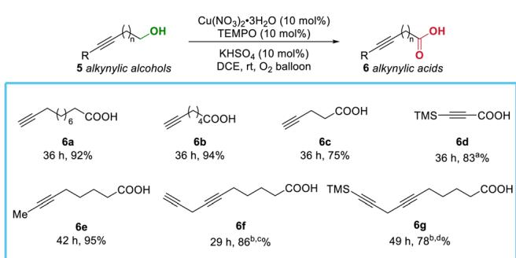

Scheme 3 Substrate scope of alkynylic alcohols. The reaction was conducted with 1.0 mmol scale of alcohol in 4 mL of DCE at rt with an $O _ { 2 }$ balloon. a 10 mol% $\mathsf { C u } ( \mathsf { N O } _ { 3 } ) _ { 2 } . 3 \mathsf { H } _ { 2 } \mathsf { O } ,$ 12 mol% TEMPO and 10 mol% KHSO4 were used. b The reaction was conducted with 0.5 mmol scale of alcohol in 2 mL of DCE at rt with an $O _ { 2 }$ balloon. c 20 mol% Cu(NO ) -3H O, 25 mol% TEMPO and 20 mol% ${ \sf K H S O _ { 4 } }$ were used. $^ d 2 0$ mol% $\mathsf { C u } ( \mathsf { N O } _ { 3 } ) _ { 2 } . 3 \mathsf { H } _ { 2 } \mathsf { O } .$ , 30 mol% TEMPO and 20 mol% ${ \mathsf { K H S O } } _ { 4 }$ were used.   
Syntheses of amino acids   
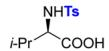  
(R)-8a 24 h, 92% >99%e

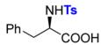  
(R)-8b 24 h, 96% >99% ee

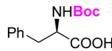  
(R)-8c 17 h, 97% >99% ee

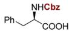  
(R)-8d 22 h, 90% >99% ee

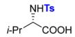  
(S)-8a 24 h, 88% >99% ee

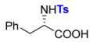  
(S)-8b 24 h, 92% >99% ee

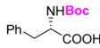  
(S)-8c 17 h, 93% >99% ee

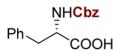  
(S)-8d 22 h, 93% >99% ee

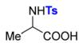  
8e 16 h, 87%

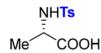  
(S)-8e 12 h, 84% >99% ee

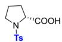  
(R)-8f 25 h, 91% >99% ee

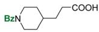  
8g 36 h, 87a%

Syntheses of drug molecules   
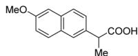  
10a (±)-naproxen 41h, 98%

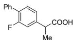  
10b (±)-flurbiprofen 40 , 98%

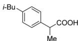  
10c (±)-ibuprofen 40h, 98%

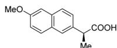  
(S)-10a (S)-naproxer 47 h, 94%, 99% ee

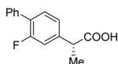  
(R)-10b (R)-flurbiprofen 38 h, 98%, 99% ee

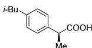  
(S)-10c (S)-ibuprofen42 h, 97%, 98% ee

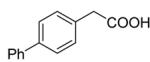  
10d felbinac 47 h, 87%

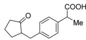  
10e Loxoprofen 84 h, 96%

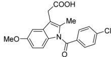  
10f Indometacin 90 h, 65 (4%)b%

Syntheses of structurally complex molecules   
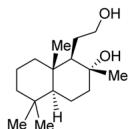  
11a

Cond. A 24 h   
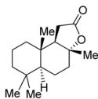  
12 98%, dr > 20:1

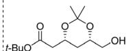  
11c

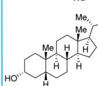  
11b

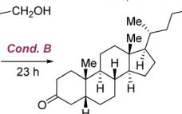  
1371%, dr > 20:1

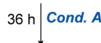

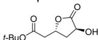  
14 76%, dr > 20:1   
Scheme 4 Syntheses of amino acids, drug molecules, and structurally complex molecules. The reaction was conducted with a 1.0 mmol scale of alcohol in 4 mL of DCE at rt with an $O _ { 2 }$ balloon. a The reaction was conducted with 0.5 mmol scale of alcohol in 2 mL of DCE at rt with an O2 balloon. bNMR yield of the aldehyde in parentheses was determined by 1 H NMR analysis using dibromomethane as the internal standard. For conditions A and conditions B, see footnotes of Scheme 2.

alcohols in good to excellent yields. In addition, the corresponding optically active drug molecules, such as (S)-naproxen, (R)-flurbiprofen, and (S)-ibuprofen were also prepared without racemization. Interestingly, sclareolide 12 could be efficiently synthesized via the sequential oxidation and lactonization of the tertiary alcohol unit in the molecule. Alcohol 11b containing a steroid skeleton could be oxidized to 13 in 71% yield with the secondary alcohol being converted to the ketone as well. Of note, chiral substrate 11c with a ketal structure unit could also undergo a highly efficient sequential aerobic oxidation, deacetalization, and lactonization to produce lactone 14 with a free hydroxyl group under the standard conditions.

In conclusion, we have developed the first copper nitratecatalyzed aerobic oxidation of alcohols to carboxylic acids with the help of TEMPO and $\mathrm { K H S O _ { 4 } }$ . The reaction is applicable to a very wide range of alcohols, such as aliphatic alcohols, benzylic alcohols, alkynylic alcohols, amino alcohols, drug precursors, and structurally complex molecules, providing the corresponding carboxylic acids in good to excellent yields. Benefiting from the mild conditions, optically active acids could be prepared from chiral amino alcohols, chiral drug precursors, and structurally complex chiral molecules efficiently without racemization. Furthermore, the oxidation reaction could be readily conducted on a practical scale (50 mmol) for the synthesis of not readily available (S)-2-methylbutanoic acid with a similar efficiency. Further studies including the roles of Cu and KHSO are being actively pursued in our laboratory.

Financial support from National Natural Science Foundation of China (Grant No. 21988101 for S. M.) and National Key R&D Program of China (2022YFA1503200 for S. M.) is greatly appreciated. We thank Mr Junlin Li in this group for reproducing the results of 2m, 6d, and 10b presented in this study.

# Conflicts of interest

There are no conflicts to declare.

# Notes and references

1 (a) S. Patai, The chemistry of acid derivatives, wiley, New York, 1992; (b) H. Maag, Prodrugs of carboxylic acids, Springer, USA, 2007.   
2 (a) L. J. Gooßen, N. Rodrı´guez and K. Gooßen, Angew. Chem., Int. Ed., 2008, 47, 3100; (b) N. Rodrı´guez and L. J. Goossen, Chem. Soc. Rev., 2011, 40, 5030; (c) C. Min and D. Seidel, Chem. Soc. Rev., 2017, 46, 5889.   
3 M. A. Ogliaruso and J. F. Wolfe, The Chemistry of Functional Groups, John Wiley & Sons, New York, 1991, pp. 40–49.   
4 G. Tojo and M. I. Ferna´ndez, Oxidation of Primary Alcohols to Carboxylic Acids: A Guide to Current Common Practice, Springer, New York, 2007.   
5 I. W. C. E. Arends and R. A. Sheldon, Modern Oxidation Methods, Wiley-VCH, Weinheim, Germany, 2nd Ed., 2010.   
6 (a) M. Uyanik and K. Ishihara, Chem. Commun., 2009, 2086; (b) A. E. Wendlandt and S. S. Stahl, Angew. Chem., Int. Ed., 2015, 54, 14638; (c) S. Shereena, F. Muhammad, S. Aamer, G. Sarfaraz Ali, R. E.-S. Hesham, R. Samina, A. Nadir, L. Fayaz Ali, C. Pervaiz Ali, F. Tanzeela Abdul, A. Zaman and S. Zulfiqar Ali, Curr. Org. Synth., 2018, 15, 109.   
7 W.-Y. Tan, Y. Lu, J.-F. Zhao, W. Chen and H. Zhang, Org. Lett., 2021, 23, 6648.   
8 For reviews on aerobic oxidation of alcohols, see: (a) T. Mallat and A. Baiker, Chem. Rev., 2004, 104, 3037; (b) B.-Z. Zhan and A. Thompson, Tetrahedron, 2004, 60, 2917; (c) M. J. Schultz and M. S. Sigman, Tetrahedron, 2006, 62, 8227; (d) T. Matsumoto, M. Ueno, N. Wang and S. Kobayashi, Chem. Asian J., 2008, 3, 196; (e) C. Parmeggiani and F. Cardona, Green Chem., 2012, 14, 547.

9 For selected reports on aerobic oxidation of primary alcohols to carboxylic acids with stoichiometric amount of base as promoter, see: (a) S. Ohta, T. Tachi and M. Okamoto, Synthesis, 1983, 291; (b) J. Wang, C. Liu, J. Yuan and A. Lei, New J. Chem., 2013, 37, 1700; (c) D.-F. Yu, P. Xing and B. Jiang, Tetrahedron, 2015, 71, 4269; (d) C. Liu, Z. Fang, Z. Yang, Q. Li, S. Guo and K. Guo, RSC Adv., 2015, 5, 79699; (e) R. Naik, P. Joshi and R. K. Deshpande, Catal. Commun., 2004, 5, 195; ( f ) K.-J. Liu, S. Jiang, L.-H. Lu, L.-L. Tang, S.-S. Tang, H.-S. Tang, Z. Tang, W.-M. He and X. Xu, Green Chem., 2018, 20, 3038.   
10 For the reports on aerobic photooxidation of primary alcohols to carbolic acids, see: (a) K. Kuwabara and A. Itoh, Synthesis, 2006, 1949; (b) X. Zhu, C. Liu, Y. Liu, H. Yang and H. Fu, Chem. Commun., 2020, 56, 12443.   
11 For selected reviews on aerobic oxidation of alcohols with noble metal catalysts, see: (a) T. Mallat and A. Baiker, Catal. Today, 1994, 19, 247; (b) T. Naota, H. Takaya and S.-I. Murahashi, Chem. Rev., 1998, 98, 2599; (c) C. D. Pina, E. Falletta and M. Rossi, Chem. Soc. Rev., 2012, 41, 350; (d) D. Wang, A. B. Weinstein, P. B. White and S. S. Stahl, Chem. Rev., 2018, 118, 2636.   
12 For selected reports on aerobic oxidation of alcohols to acids with non-noble metal catalysts, see: (a) G. Urgoitia, R. SanMartin, M. T. Herrero and E. Domı´nguez, Chem. Commun., 2015, 51, 4799; (b) P. J. Figiel, J. M. Sobczak and J. J. Zio´łkowski, Chem. Commun., 2004, 244; (c) T. Iwahama, S. Sakaguchi, Y. Nishiyama and Y. Ishii, Tetrahedron Lett., 1995, 36, 6923; (d) B. Saha, D. Gupta, M. M. Abu-Omar, A. Modak and A. Bhaumik, J. Catal., 2013, 299, 316; (e) X. Jiang, J. Zhang and S. Ma, J. Am. Chem. Soc., 2016, 138, 8344; ( f ) K. Lagerblom, P. Wrigstedt, J. Keskiva¨li, A. Parviainen and T. Repo, ChemPlusChem, 2016, 81, 1160; (g) X. Jiang and S. Ma, Synthesis, 2018, 1629.   
13 T. Tashiro and K. Mori, Eur. J. Org. Chem., 1999, 2167.   
14 For selected reports on oxidation of amino alcohols to amino acids, see: (a) A. Avenoza, C. Cativiela, F. Corzana, J. M. Peregrina and M. M. Zurbano, J. Org. Chem., 1999, 64, 8220; (b) M. Zhao, J. Li, E. Mano, Z. Song, D. M. Tschaen, E. J. J. Grabowski and P. J. Reider, J. Org. Chem., 1999, 64, 2564; (c) L. De Luca, G. Giacomelli, S. Masala and A. Porcheddu, J. Org. Chem., 2003, 68, 4999.   
15 For selected reports on Cu-catalyzed anaerobic oxidation of primary alcohols to carboxylic acids, using tert-butyl hydroperoxide (TBHP) as oxidant, see: (a) S. Mannam and G. Sekar, Tetrahedron Lett., 2008, 49, 2457; (b) R. Das and D. Chakraborty, Appl. Organometal. Chem., 2011, 25, 437. For selected reports on Cu-catalyzed non-aerobic oxidation of primary alcohols to carboxylic acids, using hydrogen peroxide as oxidant, see: (c) S. Velusamy and T. Punniyamurthy, Eur. J. Org. Chem., 2003, 3913; (d) P. Karthikeyan, S. A. Aswar, P. N. Muskawar, P. R. Bhagat and S. S. Kumar, Catal. Commun., 2012, 26, 189; (e) A. Maurya and C. Haldar, J. Coord. Chem., 2021, 74, 885.   
16 For selected reviews on copper catalyzed aerobic oxidation of alcohols, see: (a) I. E. MarkO´, P. R. Giles, M. Tsukazaki, I. ChellE´-Regnaut, A. Gautier, R. Dumeunier, F. Philippart, K. Doda, J.-L. Mutonkole, S. M. Brown and C. J. Urch, Adv. Inorg. Chem., 2004, 56, 211; (b) R. A. Sheldon and I. W. C. E. Arends, Adv. Synth. Catal., 2004, 346, 1051; (c) J. Piera and J.-E. Ba¨ckvall, Angew. Chem., Int. Ed., 2008, 47, 3506; (d) B. L. Ryland and S. S. Stahl, Angew. Chem., Int. Ed., 2014, 53, 8824; (e) Q. Cao, L. M. Dornan, L. Rogan, N. L. Hughes and M. J. Muldoon, Chem. Commun., 2014, 50, 4524; ( f ) S. E. Allen, R. R. Walvoord, R. Padilla-Salinas and M. C. Kozlowski, Chem. Rev., 2013, 113, 6234.   
17 For selected reports on copper catalyzed aerobic oxidation of alcohols with carboxylic acids as the minor by-products, see: (a) H. Korpi, P. Lahtinen, V. Sippola, O. Krause, M. Leskela¨ and T. Repo, Appl. Catal. A, 2004, 268, 199; (b) A. Dhakshinamoorthy, M. Alvaro and H. Garcia, ACS Catal., 2011, 1, 48; (c) D. Zhai and S. Ma, Org. Chem. Front., 2019, 6, 3101.