# Fe(III)-Catalyzed Aerobic Oxidation of $^ { 1 , 4 , \mathsf { D i o l s } ^ { \dagger } }$

Junlin Li, Jinxian Liu, Chunling Fu, and Shengming Ma\*

Laboratory of Molecular Recognition and Synthesis, Department of Chemistry, Zhejiang University, Hangzhou, Zhejiang 310027, China

# Keywords

Aerobic oxidation | 1,4-Diol | γ-Lactone | Catalysis | Iron | TEMPO | KCl | Chemoselectivity | Chirality | Selective oxidation

# Comprehensive Summary

Synthesis of γ-lactones from 1,4-diols

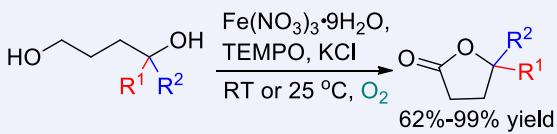

chemical

Chemical reaction scheme showing oxidation of a chiral alcohol using Fe(NO3)3·9H2O in TEMPO/KCl at room temperature for 25°C and 62%-99% yield

oxygen as oxidant

mild reaction conditions

good chemo- and regioselectivity

economical and environmentally friendly

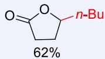

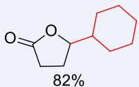

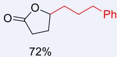

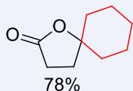

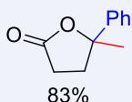

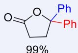

of ntic ally otiv

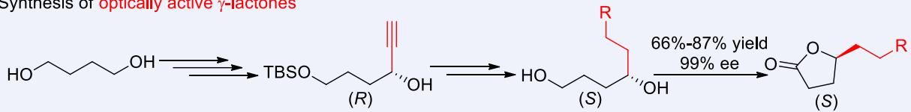

chemical

Synthesis of optically active γ-lactones showing conversion of hydroxyaldehyde to (R)-cyclohexanol via TBSO and (S) intermediates, with 66%-87% yield and 99% ee data

Synthesis of NBP

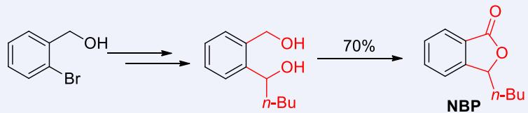

chemical

Chemical reaction pathway showing bromination, oxidation to n-butyl alcohol, and subsequent rearrangement to NBP product

Aerobic oxidation has been catching more and more attention because of its atom economy and environmental friendliness. Oxidation of diols is a challenge due to various oxidative products. Thus, highly selective aerobic oxidation affording specific products is of current interest. In this work, a combination of $\mathsf { F e } ( \mathsf { N O } _ { 3 } ) _ { 3 } { \cdot } \mathsf { 9 H } _ { 2 } \mathsf { O } / \mathsf { T E M P O } / \mathsf { K C l }$ catalysis has been identified as an efficient recipe for the aerobic oxidation of 1,4-diols affording γ-butyrolactones under mild conditions. The reaction exhibits decent chemo- and regioselectivity of symmetrical and unsymmetrical 1,4-diols. The optically active γ-lactones may also be prepared from optically active 1,4-diols without erosion of the ee via this method. Furthermore, this approach was successfully applied to synthesize NBP, a commercial drug.

\*E-mail: masm@sioc.ac.cn   
† In Memory of Professor Xiyan Lu.

# Background and Originality Content

Catalytic aerobic oxidation of alcohols has been attracting more and more attention due to the importance of the corresponding products and environmentally friendly nature.[1] Recently, we reported that the Fe(NO3)3·9H2O/TEMPO/MCl-catalyzed aerobic oxidation of alcohols afforded aldehydes/ketones or acids at room temperature with a very high selectivity (Scheme 1).[2] Aerobic oxidation of diols could afford various products due to the involvement of two hydroxyl groups, in which lactones are important ones.[3] In recent years, noble metal catalysts, such as [Pd], [Au], and [Ru], earth abundant metal [Cu(MeCN)4]OTf/Nitroxyl, and enzymes were also used to realize aerobic oxidative lactonization of $1 , 4 \mathrm { - d i o l s . } ^ { [ 3 - 5 ] }$ Here we wish to report our recent observation of aerobic oxidation of 1,4-diols affording γ-butyrolactones using this catalysis.[3]

Scheme 1 Fe(III)-catalyzed aerobic oxidative lactonization of 1,4-diols   
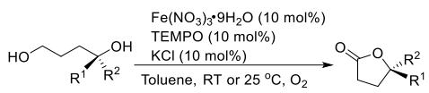

chemical

Organic reaction scheme showing oxidation of aldehyde with nitro and malonic acid under specific conditions

# Results and Discussion

Firstly, in order to avoid the issue of regioselectivity, the simple symmetric butan-1,4-diol 1a was chosen to investigate the optimal reaction conditions. Because there are two primary hydroxy groups in butan-1,4-diol (1a), the predicted possible products are 4-hydroxybutanal 5a, butanedial 6a, 3-formylpropanoic acid 7a, and lactone 2a. We initially tried the reaction with 10 mol% each of Fe(NO3)3·9H2O, TEMPO, and KCl in DCE with a balloon of oxygen and γ-butyrolactone 2a was formed exclusively with 59% NMR yield, without observing 5a, 6a or 7a (Table 1, entry 1). Study on the solvent effect led to the observation that the highest NMR yield of 87% for lactone 2a was realized upon using toluene as solvent (Table 1, entry 7). The role of $\mathsf { F e } ( \mathsf { N O } _ { 3 } ) _ { 3 } { \cdot } \mathsf { 9 H } _ { 2 } \mathsf { O }$ and TEM-PO was found to be vital, since no product 2a was formed without both catalysts (Table 1, entries 9 and 10). If the amount of Fe(NO3)3·9H2O or TEMPO was reduced to 5 mol% each, lactone 2a was formed in a similar NMR yield as compared to that in entry 7, albeit with a much longer time of 95 h (Table 1, entries 11 and 12). When the reaction was conducted in the absence of KCl, the NMR yield of 2a was 80% (Table 1, entry 8). The reaction using 4-OH-TEMPO afforded 2a with a much lower yield of 38% (Table 1, entry 13). While the reaction was conducted under air, only 3% yield of 2a was obtained (Table 1, entry 14). The reaction with other Fe(III) salts, such as $\mathsf { F e C l } _ { 3 } { \cdot } 6 \mathsf { H } _ { 2 } 0 ,$ gave no product 2a (Table 1, entry 15). As a result, we defined 10 mol% each of $\mathsf { F e } ( \mathsf { N O } _ { 3 } ) _ { 3 } { \cdot } 9 \mathsf { H } _ { 2 } 0 _ { \cdot }$ , TEMPO, and KCl in toluene with $\scriptstyle { 0 _ { 2 } , }$ at $2 5 ~ ^ { \circ } \mathsf { C }$ as the optimized conditions.

With standard conditions in hand, we explored the generality of the reaction with various 1,4-diols. Non-symmetrical 1,4-diols containing one each of 1o-OH and 2o-OH were firstly investigated. The oxidation of such diols may lead to several possible products, lactones 2, 4-hydroxybutyl ketone 5, keto-aldehyde 6 or ketocarboxylic acid 7. To our delight, γ-lactones 2b—2f were afforded highly selectively with decent yields under the standard conditions (Scheme 2). In addition, 10 mmol scale reaction of 1a (0.9014 g) was conducted to afford 2a with 69% yield. To show the role of KCl, parallel reactions of 1c with or without KCl were conducted, indicating that the reaction with KCl afforded 2c in a higher yield. Then the scope was extended to diols containing one each of 1o-OH and 3o-OH. Diols with two alkyl substituents 1g—1j were oxidized to afford γ-lactones 2g—2j with yields ranging from 54% to 86% (Scheme 2). The incorporation of one or two phenyl group(s) improved the yields of the products 2k (one phenyl group) and 2l—2p (two phenyl groups).

Table 1 The effects of solvents and the loading of catalystsa   
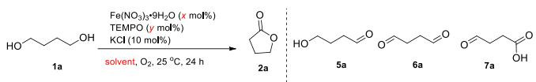

chemical

Chemical reaction scheme showing oxidation of compound 1a to products 2a, 5a, 6a, and 7a under specified reagents and conditions

<table><tr><td>Entry</td><td>x</td><td>y</td><td>Solvent</td><td>NMR yield of 2a/%</td></tr><tr><td>1</td><td>10</td><td>10</td><td>DCE</td><td>59</td></tr><tr><td>2</td><td>10</td><td>10</td><td>DCM</td><td>35</td></tr><tr><td>3</td><td>10</td><td>10</td><td> $CH_3CN$ </td><td>65</td></tr><tr><td>4</td><td>10</td><td>10</td><td>THF</td><td>17</td></tr><tr><td>5</td><td>10</td><td>10</td><td> $Et_2O$ </td><td>11</td></tr><tr><td>6</td><td>10</td><td>10</td><td>Cyclohexane</td><td>2</td></tr><tr><td>7</td><td>10</td><td>10</td><td>Toluene</td><td>87 (81b)</td></tr><tr><td>8c</td><td>10</td><td>10</td><td>Toluene</td><td>80</td></tr><tr><td>9d</td><td>10</td><td>0</td><td>Toluene</td><td>0</td></tr><tr><td>10d</td><td>0</td><td>10</td><td>Toluene</td><td>0</td></tr><tr><td>11e</td><td>5</td><td>10</td><td>Toluene</td><td>88</td></tr><tr><td>12e</td><td>10</td><td>5</td><td>Toluene</td><td>88</td></tr><tr><td>13f</td><td>10</td><td>10</td><td>Toluene</td><td>38</td></tr><tr><td>14g</td><td>10</td><td>10</td><td>Toluene</td><td>3</td></tr><tr><td>15h,i</td><td>10</td><td>10</td><td>Toluene</td><td>0</td></tr></table>

a Reaction conditions: 1a (1 mmol), unless otherwise noted. b Isolated yield. c Without KCl. d 100% of recovery. e Reaction for 95 h. f 4-OH-TEMPO used instead of TEMPO. g Air used instead of $\mathsf { O } _ { 2 } .$ . h FeCl3·6H2O used instead of Fe(NO3)3·9H2O. i 24% of recovery.

Scheme 2 The scope of 1,4-diolsa,b   
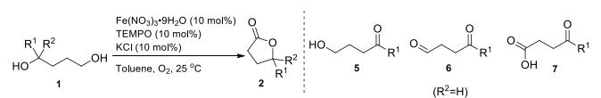

chemical

Organic reaction scheme showing oxidation of aldehyde 1 to ketone 2, followed by cyclization to products 5, 6, and 7 with R²=H and temperature data

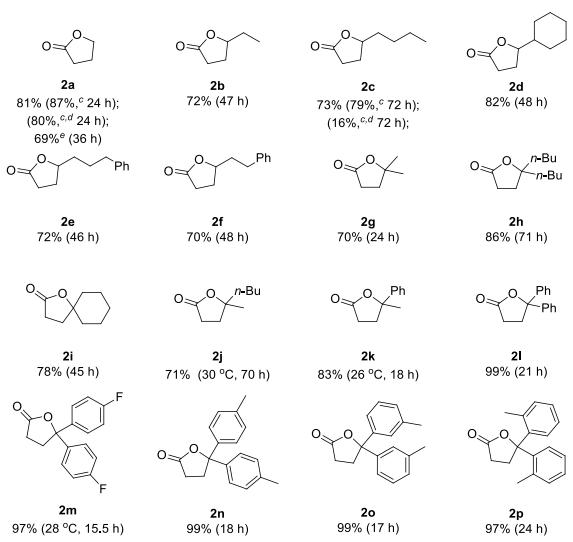

other

| Compound | Yield (%) | Reaction Time (h) | Chemical Shift (°C) |
| :--- | :--- | :--- | :--- |
| 2a | 81 | 87 | 24 h |
| 2b | 72 | 47 | 47 h |
| 2c | 73 | 79 | 72 h |
| 2d | 82 | 48 | 48 h |
| 2e | 72 | 46 | 46 h |
| 2f | 70 | 48 | 48 h |
| 2g | 70 | 24 | 24 h |
| 2h | 86 | 71 | 71 h |
| 2i | 78 | 45 | 45 h |
| 2j | 71 | 30 | 30 h |
| 2k | 83 | 26 | 18 h |
| 2l | 99 | 21 | 21 h |
| 2m | 97 | 28 | 15.5 h |
| 2n | 99 | 18 | 18 h |
| 2o | 99 | 17 | 17 h |
| 2p | 97 | 24 | 24 h |
The chart displays the chemical structures of various organic compounds with their corresponding reaction times in hours.

a Reaction conditions: 1 (1 mmol), Fe(NO3)3·9H2O (10 mol%), TEMPO (10 mol%), KCl (10 mol%), toluene (5 mL), unless otherwise noted. b Isolated yield. c NMR yield. d Without KCl. e The reaction was conducted with 10 mmol 1, Fe(NO3)3·9H2O (10 mol%), TEMPO (4 mol%), toluene (20 mL).

γ-Butyrolactone is a very common unit in natural products and drugs.[6] For example, n-butylphthalide (NBP) is a marketed antiplatelet drug for ischemia-cerebral apoplexy.[7,8b] Canonne’s group used 3-hydroxyisobenzofuran-1(3H)-one and n-butyl magnesium bromide to afford NBP.[8a] Satyanarayana’s group synthesized NBP through palladium-catalyzed acylation of ethyl 2-iodobenzoate and reduction and in situ intramolecular nucleophilic attack with $\mathsf { C e C l _ { 3 } / N a B H _ { 4 } } . \mathsf { [ 8 b ] }$ Utpal Das’ group reported the method to obtain NBP with α-angelica lactone catalyzed oxidation of n-butyl phthalan.[8c] Our strategy on synthesis of NBP started with 2-bromobenzyl alcohol, which was converted to diol 1q via lithiation with n-BuLi and 1,2-addition with valeraldehyde.[9] By applying the standard conditions, NBP 2q was delivered with 70% isolated yield (Scheme 3).

Scheme 3 Synthesis of NBP   
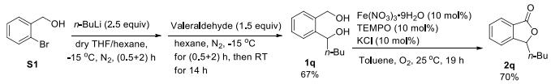

chemical

Organic synthesis reaction scheme showing conversion of compound S1 to 2q using various reagents and conditions

Furthermore, we explored the oxidation of chiral diols for the synthesis of optically active γ-butyrolactones (Scheme 4). Monosilylation of butan-1,4-diol 1a afforded 3a,[10] which was oxidized to the corresponding aldehyde 4a following the Fe(NO3)3·9H2O/ TEMPO/NaCl-protocol.[2a] The reaction of aldehyde 4a with ethynylmagnesium bromide afforded racemic propargylic alcohol 3r.[11] By applying Novozym 435-catalyzed kinetic resolution,[12] (R)-3r was recovered with >99% ee. Optically active diol (S)-1b was prepared from hydrogenation and deprotection of (R)-3r. Lactone (S)-2b was synthesized in 69% yield by applying the current optimized reaction conditions with 99% ee with essentially no racemization as compared to the ee of (R)-3r (>99% ee) [Scheme 4, (1)]. Furthermore, (R)-3r was converted to the phenyl-substituted optically active propargylic alcohol (R)-3s via Sonogashira coupling reaction.[13] Hydrogenation and deprotection of (R)-3s afforded (S)-1f (98% ee), which afforded (S)-2f with 87% yield and 99% ee under the optimized reaction conditions [Scheme 4, (2)]. Finally, (S)-2c (66% yield, 99% ee) was prepared by following the same

Scheme 4 Synthesis of optically active γ-lactones with (R)-3r as the platform molecule   
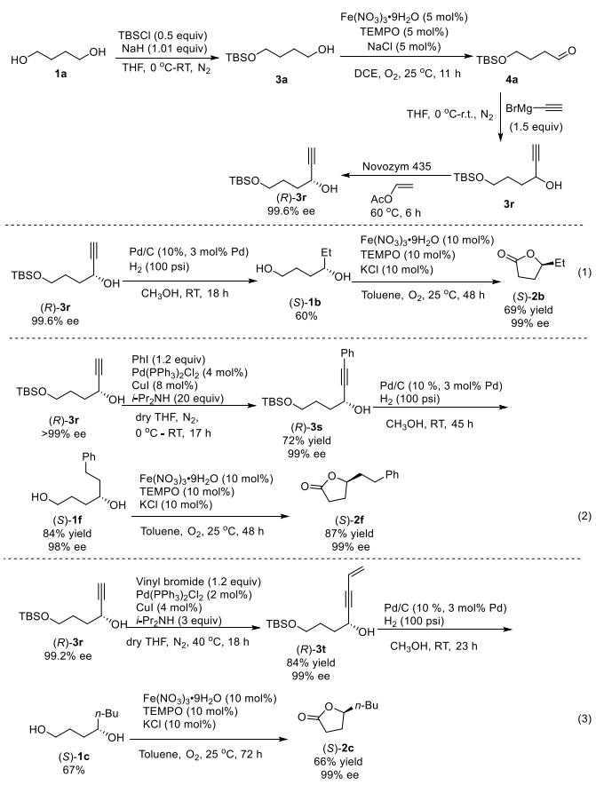

chemical

Multi-step organic synthesis reaction scheme showing transformations from compound 1a to (S)-2c with reagents, yields, and stereochemistry

protocol [Scheme 4, (3)]. Thus, this presented protocol is a general approach for the syntheses of optically active γ-lactones.

1,4-Diols with pyridyl (1u) or imidazolyl (1v) failed to afford the corresponding lactone products (Scheme 5).

Scheme 5 Aerobic oxidative lactonization of 1u and 1v   
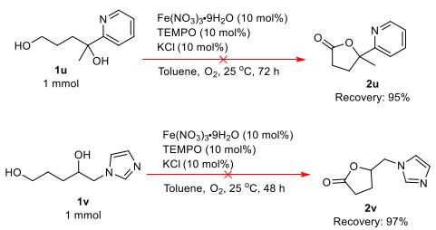

chemical

Chemical reaction scheme showing synthesis of compounds 2u and 2v from 1u and 1v under specified reagents and conditions

# Conclusions

In summary, we have developed an efficient method of applying Fe(NO3)3·9H2O/TEMPO/KCl as the catalytic recipe for the aerobic oxidation of 1,4-diols to γ-lactones with $\mathsf { O } _ { 2 }$ at room temperature or $2 5 ~ ^ { \circ } \mathsf { C }$ affording γ-butyrolactones with a decent activity and an excellent selectivity. The reaction with optically active 1,4-diol afforded optically active lactones without racemization. The reaction has been applied to the efficient synthesis of the commercial drug NBP. Further studies in this area are being actively pursued in this laboratory.

# Supporting Information

The supporting information for this article is available on the WWW under https://doi.org/10.1002/cjoc.202200768.

# Acknowledgement

Financial support from the National Natural Science Foundation of China (21988101) is greatly appreciated. We thank Mr. Zuizhi Lin in this group for reproducing the preparation of 2g, 2n and (S)-2c. Shengming Ma is a Qiu Shi Adjunct Professor at Zhejiang University.

# References

For aerobic oxidation of alcohols, see: (a) Mallat, T.; Baiker, A. Oxidation of Alcohols with Molecular Oxygen on Solid Catalysts. Chem. Rev. 2004, 104, 3037‒3058; (b) Ryland, B. L.; Stahl, S. S. Practical Aerobic Oxidations of Alcohols and Amines with Homogeneous Copper/ TEMPO and Related Catalyst Systems. Angew. Chem. Int. Ed. 2014, 53, 8824‒8838; (c) Wang, D.; Weinstein, A. B.; White, P. B.; Stahl, S. S. Ligand-Promoted Palladium-Catalyzed Aerobic Oxidation Reactions. Chem. Rev. 2018, 118, 2636−2679.   
(a) Ma, S.; Liu, J.; Li, S.; Chen, B.; Cheng, J.; Kuang, J.; Liu, Y.; Wan, B.; Wang, Y.; Ye, J.; Yu, Q.; Yuan, W.; Yu, S. Development of a General and Practical Iron Nitrate/TEMPO-Catalyzed Aerobic Oxidation of Alcohols to Aldehydes/Ketones: Catalysis with Table salt. Adv. Synth. Catal. 2011, 353, 1005‒1017; (b) Jiang, X.; Zhang, J.; Ma, S. Iron Catalysis for Room-Temperature Aerobic Oxidation of Alcohols to Carboxylic Acids. J. Am. Chem. Soc. 2016, 138, 8344‒8347; (c) Jiang, X.; Liu, J.; Ma, S. Iron-Catalyzed Aerobic Oxidation of Alcohols: Lower Cost and Improved Selectivity. Org. Process Res. Dev. 2019, 23, 825‒ 835.   
Xie, X.; Stahl, S. S. Efficient and selective Cu/nitroxyl-Catalyzed Methods for Aerobic Oxidative Lactonization of Diols. J. Am. Chem. Soc. 2015, 137, 3767‒3770.   
For aerobic oxidation of 1,4-diols to afford γ-lactones with noble metal catalysts, see: (a) Nishimura, T.; Onoue, T.; Ohe, K.; Uemura, S. Palladium(II)-Catalyzed Oxidation of Alcohols to Aldehydes and Ke-

tones by Molecular Oxygen. J. Org. Chem. 1999, 64, 6750‒6755; (b) Mitsudome, T.; Noujima, A.; Mizugaki, T.; Jitsukawaa, K.; Kaneda, K. Supported Gold Nanoparticles as a Reusable Catalyst for Synthesis of Lactones from Diols using Molecular Oxygen as an Oxidant Under Mild Conditions. Green Chem. 2009, 11, 793‒797; (c) Endo, Y.; Bäckvall, J. E. Aerobic Lactonization of Diols by Biomimetic Oxidation. Chem. - Eur. J. 2011, 17, 12596‒12601.   
For aerobic oxidation of 1,4-diols to afford γ-lactones with enzymes, see: (a) Díaz-Rodríguez, A.; Lavandera, I.; Kanbak-Aksu, S.; Sheldon, R. A.; Gotor, V.; Gotor-Fernández, V. From Diols to Lactones under Aerobic Conditions using a Laccase/TEMPO Catalytic System in Aqueous Medium. Adv. Synth. Catal. 2012, 354, 3405‒3408; (b) Kara, S.; Spickermann, D.; Schrittwieser, J. H.; Weckbecker, A.; Leggewie, C.; Arends, I. W. C. E.; Hollmann, F. Access to Lactone Building Blocks via Horse Liver Alcohol Dehydrogenase-Catalyzed Oxidative Lactonization. ACS Catal. 2013, 3, 2436‒2439.   
(a) Kopp, J.; Brückner, R. Stereoselective Total Synthesis of the Dimeric Naphthoquinonopyrano-γ-Lactone (−)-Crisamicin A: Introducing the Dimerization Site by a Late-Stage Hartwig Borylation. Org. Lett. 2020, 22, 3607‒3612; (b) Kitaura, T.; Endo, H.; Nakamoto, H.; Ishihara, M.; Kawai, T.; Nokami, J. Isolation and Synthesis of a New Natural Lactone in Apple Juice (Malus × domestica var. Orin). Flavour Fragr. J. 2004, 19, 221‒224; (c) Zhou, J.; Fu, C.; Ma, S. Gold-Catalyzed Stereoselective Cycloisomerization of Allenoic Acids for Two Types of Common Natural γ-Butyrolactones. Nat. Commun. 2018, 9, 1654.   
(a) Nozohouri, S.; Sifat, A. E.; Vaidya, B.; Abbruscato, T. J. Novel Approaches for the Delivery of Therapeutics in Ischemic Stroke. Drug Discov. Today. 2020, 25, 535‒551; (b) Liao, S.; Lin, J.; Pei, Z.; Liu, C.; Zeng, J.; Huang, R. Enhanced Angiogenesis with Dl-3n-butylphthalide Treatment after Focal Cerebral Ischemia in RHRSP. Brain Res. 2009, 1289, 69‒78.   
(a) Canonne, P.; Akssira, M. Nouvelle Methode de Synthese des

γ-Lactones et (5H)Furannones-2-monosubstituees. Tetrahedron Lett. 1984, 25, 3453‒3456; (b) Suchand, B.; Satyanarayana, G. Palladium-Catalyzed Environmentally Benign Acylation. J. Org. Chem. 2016, 81, 6409‒6423; (c) Thatikonda, T.; Deepake, S. K.; Kumara, P.; Das, U. α-Angelica Lactone Catalyzed Oxidation of Benzylic sp3 C–H Bonds of Isochromans and Phthalans. Org. Biomol. Chem. 2020, 18, 4046‒ 4050.   
Parham, W. E.; Montgomery, W. C. An Improved Synthesis of Indenes. II. Alkyl-Substituted Indenes. J. Org. Chem. 1974, 39, 2048‒ 2050.   
Mann, S.; Carillon, S.; Breyne; O.; Marquet, A. Total Synthesis of Amiclenomycin, an Inhibitor of Biotin Biosynthesis. Chem. - Eur. J. 2002, 8, 439‒450.   
Min, X.; Xu, X.; He, Y. Axial-to-central Chirality Transfer for Construction of Quaternary Stereocenters via Dearomatization of BINOLs. Org. Lett. 2019, 21, 9188‒9193.   
Xu, D.; Li, Z.; Ma, S. Novozym-435-Catalyzed Enzymatic Separation of Racemic Propargylic Alcohols. A Facile Route to Optically Active Terminal Aryl Propargylic Alcohols. Tetrahedron Lett. 2003, 44, 6343‒ 6346.   
Guisán-Ceinos, M.; Martín-Heras, V.; Tortosa, M. Regio- and Stereospecific Copper-Catalyzed Substitution Reaction of Propargylic Ammonium Salts with Aryl Grignard Reagents. J. Am. Chem. Soc. 2017, 139, 8448‒8451.

Manuscript received: November 24, 2022

Manuscript revised: April 5, 2023

Manuscript accepted: April 6 , 2023

Accepted manuscript online: April 10, 2023

Version of record online: May 10, 2023

The Authors   
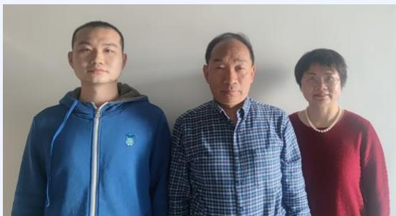

natural_image

Three individuals standing side by side against a plain wall (no text or symbols visible)

natural_image

Portrait of a man wearing glasses and a suit (no visible text or symbols)

Left to Right: Junlin Li, Shengming Ma, Chunling Fu, Jinxian Liu