# Relay Catalysis for Selective Aerobic Oxidative Esterification of

# Primary Alcohols with Methanol

Yibo Yu,a Jie Lin,†,a Anni Qin,†,a Huanan Wang,†,a Jie Wang,†,a Weiyi Wang,†,a Guolin Wu,†,a Qian Zhang,†,a Hui Qian\*,a and Shengming Ma\*,a,b

a Research Center for Molecular Recognition and Synthesis, Department of Chemistry, Fudan University, 220 Handan Lu, Shanghai 200433, P. R. China.   
b State Key Laboratory of Organometallic Chemistry, Shanghai Institute of Organic Chemistry, Chinese Academy of Sciences, 345 Lingling Lu, Shanghai 200032, P. R. China.   
† These authors contributed equally.

Supporting Information 

<table><tr><td>General Information</td><td>S2</td></tr><tr><td>Identification of the slowly oxidizing alcohols</td><td>S3</td></tr><tr><td>Optimization for the aerobic oxidative methyl esterification of alcohols</td><td>S4-S7</td></tr><tr><td>Experimental details and analytical data</td><td>S8-S31</td></tr><tr><td>References</td><td>S32-S33</td></tr><tr><td> $^{1}H, ^{13}C$  NMR and HPLC spectra of products</td><td>S34-S124</td></tr></table>

General Information. NMR spectra were taken with an Agilent-400 spectrometer (400 MHz for 1H NMR, 100 MHz for 13C NMR, 376 MHz for 19F NMR). All reactions were carried out in 50 mL flask unless otherwise mentioned. $\mathrm { F e } ( \mathrm { N O } _ { 3 } ) _ { 3 } { \bullet } 9 \mathrm { H } _ { 2 } \mathrm { O }$ was purchased from Energy Chemical; TEMPO (98%) was purchased from Shanghai Darui Fine Chemical Co., Ltd.; BiCl3 was purchased from Alfa Aesar; DCE and MeOH were purchased from Sinopharm Chemical Reagent Co., Ltd and Shanghai Titan Scientific Co., Ltd, respectively, and used directly as received without further treatment. All the temperatures were referred to the oil baths or ice-water bath $( 0 ~ ^ { \mathrm { o } } \mathrm { C } )$ used. The HRMS analysis was performed with Agilent 7200B GC/Q-TOF.

TEMPO: 2,2,6,6-Tetramethylpiperidinooxy

4-NHAc-TEMPO: 4-(Acetylamino)-2,2,6,6-tetramethylpiperidinooxy   
4-OMe-TEMPO: 4-Methoxy -2,2,6,6-tetramethylpiperidinooxy   
4-OH-TEMPO: 4-Hydroxy)-2,2,6,6-tetramethylpiperidinooxy

ABNO: 9-Azabicyclo[3.3.1]nonane N-oxyl

# Identification of the slowly oxidizing alcohols

To a 50 mL flask were added $\mathrm { F e } ( \mathrm { N O } _ { 3 } ) _ { 3 } { \bullet } 9 \mathrm { H } _ { 2 } \mathrm { O }$ (0.06 mmol), TEMPO (0.05 mmol), $\mathrm { B i C l } _ { 3 }$ (0.1 mmol), 1a (1.0 mmol), 2 (5.0 mmol), and DCE (3 mL) sequentially under air atmosphere. The reaction was then carried out at $5 0 ~ ^ { \mathrm { o } } \mathrm { C }$ under the atmosphere of $\mathrm { O } _ { 2 }$ from a balloon (about 2.5 L) for 48 h. The resulting mixture was cooled to $0 \mathrm { { } ^ { o } C }$ with an ice-water bath for 10 min, then warmed to rt. $\mathrm { C H } _ { 2 } \mathrm { B r } _ { 2 }$ (35 μL) was added as the internal standard. About 0.1 mL of the resulting mixture was taken and filtrated through a disposable syringe filter (PTFE, 13 mm, 0.45 m) eluted with $\mathrm { C D C l } _ { 3 }$ (0.5 mL), and analyzed via 1H NMR. Then the resulting mixture was collected and filtrated through a short column of silica gel eluted with diethyl ether (3 x 25 mL), concentrated, and analyzed via $^ 1 \mathrm { H }$ NMR with $\mathrm { C H } _ { 2 } \mathrm { B r } _ { 2 }$ $( 3 5 ~ \mu \mathrm { L } )$ as the internal standard. According to the comparison of two 1H NMR spectra, the yields of products that have low boiling point were calculated.

Table S1. Identification of the slowly oxidizing alcoholsa   
(A) Identification of the slowly oxidizing alcohols.   
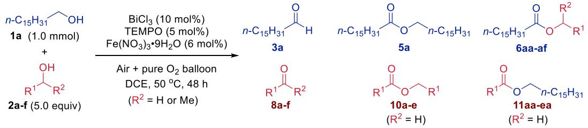

chemical

Organic synthesis reaction scheme showing transformation of compound 1a to products 3a, 5a, 6aa-af, 8a-f, 10a-e, and 11aa-ea under specified conditions

identify the slowly oxidizing alcohols 

<table><tr><td rowspan="2">Entry</td><td rowspan="2"> $R'$ OH</td><td rowspan="2">Recovery of 1a</td><td colspan="6">NMR yield</td></tr><tr><td>3a</td><td>8</td><td>10</td><td>6</td><td>5a</td><td>11</td></tr><tr><td>1</td><td>BnOH (2a)</td><td>0</td><td>69%</td><td>86% (8a)</td><td>3% (10a)</td><td>0</td><td>10%</td><td>0</td></tr><tr><td>2</td><td>n-BuOH (2b)</td><td>11%</td><td>51%</td><td>32% (8b)</td><td>14% (10b)</td><td colspan="3"> $19\%^b$ (6ab + 5a + 11ba)</td></tr><tr><td>3</td><td>n-PrOH (2c)</td><td>9%</td><td>51%</td><td>14% (8c)</td><td>12% (10c)</td><td>8% (6ac)</td><td colspan="2"> $12\%^c$ (5a + 11ca)</td></tr><tr><td>4</td><td>EtOH (2d)</td><td>0</td><td>63%</td><td>12% (8d)</td><td>14% (10d)</td><td>14% (6ad)</td><td>9%</td><td>8% (11da)</td></tr><tr><td>5</td><td>MeOH (2e)</td><td>0</td><td>9%</td><td> $ND^d$ </td><td>9% (10e)</td><td>83% (6ae)</td><td>3%</td><td>1% (11ea)</td></tr><tr><td>6</td><td>i-PrOH (2f)</td><td>49%</td><td>24%</td><td> $45\%^e$ (8f)</td><td>-</td><td>0</td><td>3%</td><td>-</td></tr></table>

a The reaction was conducted with 1a (1.0 mmol), $\mathrm { R } ^ { \prime } \mathrm { C H } _ { 2 } \mathrm { O H }$ (5 mmol), $\mathrm { F e } ( \mathrm { N O } _ { 3 } ) _ { 3 } { \bullet } 9 \mathrm { H } _ { 2 } \mathrm { O }$ (6 mol%), TEMPO (5 mol%), and $\mathrm { B i C l } _ { 3 }$ (10 mol%) in 3 mL of DCE at $5 0 ^ { \mathrm { { o } } } \mathrm { { C } }$ for 48 h with an $\mathrm { O } _ { 2 }$ balloon in a 50 mL flask. The NMR yield and recovery were determined by 1H NMR analysis using dibromomethane as the internal standard. b Combined yield of 6ab, 5a and 11ba based on alcohol $\mathbf { 1 } \mathbf { a } .$ c Combined yield of 5a and 11ca based on alcohol $\mathbf { 1 a . } ^ { d } \mathbf { N D . } \mathbf { \alpha = n o t }$ determined. e NMR yield of acetone 8f.

# Optimization for the oxidative methyl esterification of alcohols

To a 25 mL or 50 mL flask were added $\mathrm { F e ( N O _ { 3 } ) } _ { 3 } { \bullet } 9 \mathrm { H } _ { 2 } \mathrm { O } .$ , TEMPO, Lewis acid, 1a, MeOH, and DCE sequentially in open air. The reaction was then carried out at the specified temperature under the atmosphere of $\mathrm { O } _ { 2 }$ from a balloon (about 2.5 L) until completion of the reaction as monitored by TLC. The resulting mixture was filtrated through a short column of silica gel eluted with diethyl ether (3 x 25 mL), concentrated, and analyzed via 1H NMR with $\mathrm { C H } _ { 2 } \mathrm { B r } _ { 2 }$ (35 μL) as the internal standard.

Table S2. Optimization of the amount of catalysta 

<table><tr><td>n-C15H31CH2OH + MeOH (1.0 mmol)</td><td>Fe(NO3)3·9H2O (x mol%) TEMPO (y mol%)</td><td colspan="2">n-C15H31CHO + HCOOn-C16H33 + n-C15H31COOMe</td></tr><tr><td>1a</td><td>2e</td><td>3a</td><td>11ea</td></tr><tr><td></td><td></td><td>n-C15H31COOn-C16H33 + 5a</td><td>6ae</td></tr><tr><td></td><td></td><td>7ae</td><td></td></tr></table>

<table><tr><td>Entry</td><td>x/y/z</td><td>Recovery of 1a</td><td>NMR Y of 3a</td><td>NMR Y of 11ea</td><td>NMR Y of 6ae</td><td>NMR Y of 5a</td><td>NMR Y of 7ae</td></tr><tr><td>1</td><td>5/5/10</td><td>0</td><td>20%</td><td>1%</td><td>65%</td><td>4%</td><td>8%</td></tr><tr><td>2</td><td>6/5/10</td><td>0</td><td>17%</td><td>1%</td><td>74%</td><td>2%</td><td>6%</td></tr><tr><td>3</td><td>7/5/10</td><td>0</td><td>13%</td><td>1%</td><td>76%</td><td>4%</td><td>9%</td></tr><tr><td>4</td><td>8/5/10</td><td>0</td><td>14%</td><td>1%</td><td>77%</td><td>2%</td><td>4%</td></tr><tr><td>5</td><td>9/5/10</td><td>0</td><td>13%</td><td>1%</td><td>74%</td><td>2%</td><td>4%</td></tr><tr><td>6</td><td>10/5/10</td><td>0</td><td>18%</td><td>1%</td><td>66%</td><td>4%</td><td>6%</td></tr><tr><td>7</td><td>10/10/10</td><td>0</td><td>17%</td><td>2%</td><td>61%</td><td>6%</td><td>7%</td></tr><tr><td>8</td><td>8/3/10</td><td>12%</td><td>34%</td><td>1%</td><td>8%</td><td>4%</td><td>20%</td></tr><tr><td>9</td><td>8/7/10</td><td>0</td><td>14%</td><td>1%</td><td>77%</td><td>2%</td><td>2%</td></tr><tr><td>10</td><td>6/5/8</td><td>0</td><td>18%</td><td>1%</td><td>66%</td><td>4%</td><td>6%</td></tr><tr><td>11</td><td>6/5/6</td><td>0</td><td>22%</td><td>1%</td><td>64%</td><td>2%</td><td>8%</td></tr></table>

a The reaction was conducted with 1a (1.0 mmol), MeOH (5.0 mmol), Fe(NO3)3•9H2O (x mol%), TEMPO (y mol%), and BiCl3 (z mol%) in 4 mL of DCE at $5 0 ~ ^ { \mathrm { o } } \mathrm { C }$ for 40 h with an O2 balloon in a 25 mL flask. The NMR yield and recovery were determined by 1H NMR analysis using dibromomethane as the internal standard.

Table S3. Optimization of the amount of MeOHa 

<table><tr><td rowspan="4">n-C15H31CH2OH + 1a (1.0 mmol)</td><td rowspan="4">MeOH (x equiv)</td><td>BiCl3(10 mol%) TEMPO (5 mol%) Fe(NO3)3·9H2O (6 mol%)</td><td colspan="2">n-C15H31CHO + HCOOn-C16H33 + n-C15H31COOMe</td></tr><tr><td rowspan="3">Air + pure O2 balloon DCE, 50 °C, 40 h</td><td>3a</td><td>11ea</td></tr><tr><td colspan="2">n-C15H31COOn-C16H33 + n-C15H31CH2OMe</td></tr><tr><td>5a</td><td>7ae</td></tr></table>

<table><tr><td>Entry</td><td>x</td><td>Recovery of 1a</td><td>NMR Y of 3a</td><td>NMR Y of 11ea</td><td>NMR Y of 6ae</td><td>NMR Y of 5a</td><td>NMR Y of 7ae</td></tr><tr><td>1</td><td>3</td><td>0</td><td>26%</td><td>1%</td><td>65%</td><td>4%</td><td>3%</td></tr><tr><td>2</td><td>4</td><td>0</td><td>22%</td><td>1%</td><td>71%</td><td>4%</td><td>5%</td></tr><tr><td>3</td><td>5</td><td>0</td><td>14%</td><td>1%</td><td>74%</td><td>4%</td><td>8%</td></tr><tr><td>4</td><td>6</td><td>0</td><td>15%</td><td>1%</td><td>75%</td><td>4%</td><td>7%</td></tr><tr><td>5</td><td>7</td><td>0</td><td>15%</td><td>1%</td><td>74%</td><td>0</td><td>10%</td></tr><tr><td>6</td><td>8</td><td>0</td><td>16%</td><td>1%</td><td>67%</td><td>2%</td><td>14%</td></tr></table>

a The reaction was conducted with 1a (1.0 mmol), MeOH (x mmol), $\mathrm { F e } ( \mathrm { N O } _ { 3 } ) _ { 3 } { \bullet } 9 \mathrm { H } _ { 2 } \mathrm { O }$ (6 mol%), TEMPO (5 mol%), and BiCl3 (10 mol%) in 4 mL of DCE at $5 0 ~ ^ { \mathrm { o } } \mathrm { C }$ for 40 h with an $\mathrm { O } _ { 2 }$ balloon in a 25 mL flask. The NMR yield and recovery were determined by 1H NMR analysis using dibromomethane as the internal standard.

Table S4. Optimization of the concentrationa 

<table><tr><td rowspan="3">n-C15H31CH2OH + MeOH (1.0 mmol)</td><td rowspan="3">2e (5.0 equiv)</td><td>BiCl3(10 mol%) TEMPO (5 mol%) Fe(NO3)3·9H2O (6 mol%)</td><td colspan="3">n-C15H31CHO + HCOOn-C16H33 + n-C15H31COOMe</td></tr><tr><td rowspan="2">Air + pure O2 balloon DCE (x mL), 50 °C, t h</td><td>3a</td><td>11ea</td><td>6ae</td></tr><tr><td>5a</td><td>+</td><td>7ae</td></tr></table>

<table><tr><td>Entry</td><td>x</td><td>t</td><td>Recovery of 1a</td><td>NMR Y of 3a</td><td>NMR Y of 11ea</td><td>NMR Y of 6ae</td><td>NMR Y of 5a</td><td>NMR Y of 7ae</td></tr><tr><td>1</td><td>2</td><td>40 h</td><td>0</td><td>27%</td><td>0</td><td>36%</td><td>4%</td><td>16%</td></tr><tr><td>2</td><td>3</td><td>40 h</td><td>0</td><td>15%</td><td>1%</td><td>75%</td><td>4%</td><td>6%</td></tr><tr><td>3</td><td>3</td><td>48 h</td><td>0</td><td>8%</td><td>1%</td><td>84%</td><td>4%</td><td>5%</td></tr><tr><td>4</td><td>3.5</td><td>40 h</td><td>0</td><td>15%</td><td>1%</td><td>76%</td><td>4%</td><td>6%</td></tr><tr><td>5</td><td>4</td><td>40 h</td><td>0</td><td>14%</td><td>1%</td><td>74%</td><td>4%</td><td>8%</td></tr><tr><td>6</td><td>5</td><td>40 h</td><td>0</td><td>22%</td><td>1%</td><td>63%</td><td>4%</td><td>12%</td></tr><tr><td>7</td><td>6</td><td>40 h</td><td>0</td><td>28%</td><td>1%</td><td>53%</td><td>4%</td><td>17%</td></tr></table>

a The reaction was conducted with 1a (1.0 mmol), MeOH (5.0 mmol), Fe(NO3)3•9H2O (6 mol%), TEMPO (5 mol%), and BiCl3 (10 mol%) in x mL of DCE at $5 0 ~ \mathrm { { ^ \circ C } }$ for t h or 48 h with an O2 balloon in a 25 mL flask. The NMR yield and recovery were determined by 1H NMR analysis using dibromomethane as the internal standard.

Table S5. Optimization of the reaction temperaturea 

<table><tr><td>n-C15H31CH2OH + MeOH 1a (1.0 mmol)</td><td>2e (5.0 equiv)</td><td>BiCl3(10 mol%) TEMPO (5 mol%) Fe(NO3)3·9H2O (6 mol%) Air + pure O2 balloon DCE, T °C, 48 h</td><td>n-C15H31CHO + HCOOn-C16H33 + n-C15H31COOMe 3a 11ea 6ae n-C15H31COOn-C16H33 + n-C15H31OMe 7ae</td></tr></table>

<table><tr><td>Entry</td><td>T</td><td>Recovery of 1a</td><td>NMR Y of 3a</td><td>NMR Y of 11ea</td><td>NMR Y of 6ae</td><td>NMR Y of 5a</td><td>NMR Y of 7ae</td></tr><tr><td>1</td><td>25</td><td>0</td><td>8%</td><td>1%</td><td>52%</td><td>4%</td><td>25%</td></tr><tr><td>2</td><td>35</td><td>0</td><td>7%</td><td>1%</td><td>76%</td><td>4%</td><td>9%</td></tr><tr><td>3</td><td>40</td><td>0</td><td>10%</td><td>1%</td><td>80%</td><td>4%</td><td>5%</td></tr><tr><td>4</td><td>45</td><td>0</td><td>11%</td><td>1%</td><td>81%</td><td>4%</td><td>7%</td></tr><tr><td>5</td><td>50</td><td>0</td><td>8%</td><td>1%</td><td>84%</td><td>4%</td><td>5%</td></tr><tr><td>6</td><td>55</td><td>0</td><td>23%</td><td>1%</td><td>60%</td><td>4%</td><td>7%</td></tr><tr><td>7</td><td>60</td><td>0</td><td>31%</td><td>1%</td><td>56%</td><td>4%</td><td>5%</td></tr></table>

a The reaction was conducted with 1a (1.0 mmol), MeOH (5.0 mmol), Fe(NO3)3•9H2O (6 mol%), TEMPO (5 mol%), and BiCl3 (10 mol%) in 3 mL of DCE at T oC for 48 h with an $\mathrm { O } _ { 2 }$ balloon in a 25 mL flask. The NMR yield and recovery were determined by 1H NMR analysis using dibromomethane as the internal standard.

Table S6. Optimization of the solventa 

<table><tr><td rowspan="4">n-C15H31CH2OH + MeOH (1.0 mmol)</td><td rowspan="4">2e (5.0 equiv)</td><td rowspan="2">BiCl3(10 mol%) TEMPO (5 mol%) Fe(NO3)3·9H2O (6 mol%)</td><td colspan="3">n-C15H31CHO + HCOOn-C16H33 + n-C15H31COOMe</td></tr><tr><td>3a</td><td>11ea</td><td>6ae</td></tr><tr><td rowspan="2">Air + pure O2 balloon solvent, 50 °C, 48 h</td><td>n-C15H31COOn-C16H33 + n-C15H31</td><td>OMe</td><td></td></tr><tr><td>5a</td><td>7ae</td><td></td></tr></table>

<table><tr><td>Entry</td><td>solvent</td><td>Recovery of 1a</td><td>NMR Y of 3a</td><td>NMR Y of 11ea</td><td>NMR Y of 6ae</td><td>NMR Y of 5a</td><td>NMR Y of 7ae</td></tr><tr><td>1</td><td>DCE</td><td>0</td><td>8%</td><td>1%</td><td>84%</td><td>4%</td><td>5%</td></tr><tr><td> $2^b$ </td><td>DCM</td><td>4%</td><td>38%</td><td>2%</td><td>9%</td><td>4%</td><td>40%</td></tr><tr><td>3</td><td>CHCl3</td><td>0</td><td>43%</td><td>1%</td><td>25%</td><td>0</td><td>31%</td></tr><tr><td>4</td><td>CH3CN</td><td>10%</td><td>27%</td><td>1%</td><td>9%</td><td>2%</td><td>23%</td></tr><tr><td>5</td><td>THF</td><td>48%</td><td>22%</td><td>0</td><td>0</td><td>0</td><td>0</td></tr><tr><td>6</td><td>Toluene</td><td>0</td><td>30%</td><td>2%</td><td>44%</td><td>0</td><td>15%</td></tr><tr><td>7</td><td>1,4-dioxane</td><td>0</td><td>20%</td><td>2%</td><td>21%</td><td>0</td><td>1%</td></tr></table>

a The reaction was conducted with 1a (1.0 mmol), MeOH (5.0 mmol), Fe(NO3)3•9H2O (6 mol%), TEMPO (5 mol%), and BiCl3 (10 mol%) in 3 mL of solvent at 50 oC for 48 h with an O2 balloon in a 25 mL flask. The NMR yield and recovery were determined by 1H NMR analysis using dibromomethane as the internal standard. b The reaction was conducted at $3 0 ~ ^ { \mathrm { o } } \mathrm { C } .$ .

Table S7. Optimization of the nitroxyla 

<table><tr><td>n-C15H31CH2OH + MeOH 1a (1.0 mmol)</td><td>2e (5.0 equiv)</td><td>BiCl3 (10 mol%) nitroxyl (5 mol%) Fe(NO3)3·9H2O (6 mol%) Air + pure O2 balloon DCE, 50 °C, 48 h</td><td>n-C15H31CHO + HCOO n-C16H33 + n-C15H31COOMe 3a 11ea 6ae n-C15H31COO n-C16H33 + n-C15H31OMe 5a 7ae</td></tr></table>

<table><tr><td>Entry</td><td>nitroxyl</td><td>Recovery of 1a</td><td>NMR Y of 3a</td><td>NMR Y of 11ea</td><td>NMR Y of 6ae</td><td>NMR Y of 5a</td><td>NMR Y of 7ae</td></tr><tr><td>1</td><td>TEMPO</td><td>0</td><td>8%</td><td>1%</td><td>84%</td><td>4%</td><td>5%</td></tr><tr><td>2</td><td>4-NHAc-TEMPO</td><td>0</td><td>42%</td><td>0</td><td>21%</td><td>0</td><td>18%</td></tr><tr><td>3</td><td>4-OMe-TEMPO</td><td>0</td><td>11%</td><td>1%</td><td>81%</td><td>2%</td><td>3%</td></tr><tr><td>4</td><td>4-OH-TEMPO</td><td>0</td><td>33%</td><td>1%</td><td>40%</td><td>4%</td><td>18%</td></tr><tr><td>5</td><td>ABNO</td><td>3%</td><td>44%</td><td>2%</td><td>8%</td><td>0</td><td>22%</td></tr></table>

a The reaction was conducted with 1a (1.0 mmol), MeOH (5.0 mmol), $\mathrm { F e } ( \mathrm { N O } _ { 3 } ) _ { 3 } { \bullet } 9 \mathrm { H } _ { 2 } \mathrm { O }$ (6 mol%), nitroxyl (5 mol%), and BiCl3 (10 mol%) in 3 mL of DCE at 50 oC for 48 h with an $\mathrm { O } _ { 2 }$ balloon in a 25 mL flask. The NMR yield and recovery were determined by 1H NMR analysis using dibromomethane as the internal standard.

Table S8. Optimization of the Lewis acida 

<table><tr><td rowspan="3">n-C15H31CH2OH + MeOH 1a (1.0 mmol)</td><td rowspan="3">2e (5.0 equiv)</td><td rowspan="2">LA (10 mol%) TEMPO (5 mol%) Fe(NO3)3·9H2O (6 mol%)</td><td colspan="3">n-C15H31CHO + HCOOn-C16H33 + n-C15H31COOMe</td></tr><tr><td>3a</td><td>11ea</td><td>6ae</td></tr><tr><td>Air + pure O2 balloon DCE, 50 °C, 48 h</td><td>n-C15H31COOn-C16H33 + 5a</td><td>7ae</td><td></td></tr></table>

<table><tr><td>Entry</td><td>LA</td><td>Recovery of 1a</td><td>NMR Y of 3a</td><td>NMR Y of 11ea</td><td>NMR Y of 6ae</td><td>NMR Y of 5a</td><td>NMR Y of 7ae</td></tr><tr><td> $1^b$ </td><td> $BiCl_3$ </td><td>0</td><td>9%</td><td>1%</td><td>83% (73%)</td><td>2%</td><td>3%</td></tr><tr><td>2</td><td> $FeCl_3$ </td><td>0</td><td>33%</td><td>0</td><td>31%</td><td>4%</td><td>22%</td></tr><tr><td>3</td><td> $InCl_3$ </td><td>0</td><td>29%</td><td>15%</td><td>35%</td><td>8%</td><td>7%</td></tr><tr><td>4</td><td> $InBr_3$ </td><td>0</td><td>10%</td><td>6%</td><td>57%</td><td>8%</td><td>11%</td></tr><tr><td>5</td><td> $BiBr_3$ </td><td>26%</td><td>16%</td><td>1%</td><td>2%</td><td>2%</td><td>16%</td></tr></table>

a The reaction was conducted with 1a (1.0 mmol), MeOH (5.0 mmol), $\mathrm { F e } ( \mathrm { N O } _ { 3 } ) _ { 3 } { \bullet } 9 \mathrm { H } _ { 2 } \mathrm { O }$ (6 mol%), TEMPO (5 mol%), and Lewis acid (10 mol%) in 3 mL of DCE at 50 oC for 48 h with an $\mathrm { O } _ { 2 }$ balloon in a 50 mL flask. The NMR yield and recovery were determined by 1H NMR analysis using dibromomethane as the internal standard. b 5% of n-C H COOH 4a was isolated.

# Experimental details and analytical data

# 1. Preparation of alcohols

# (1) Preparation of 4-(((6-hydroxyhexyl)oxy)methyl)benzonitrile (1n, yyb-7-005)

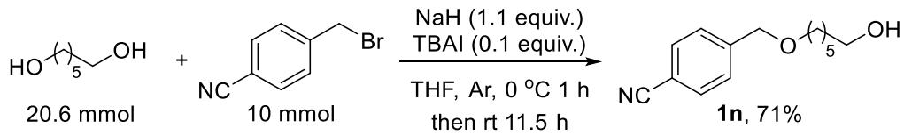

chemical

Chemical reaction equation showing synthesis of compound 1n from hydroxybenzaldehyde and bromocyclohexylamine under specified conditions

To a flask was added 1,6-hexanediol (2.4879 g, 20.6 mmol, 98% purity). Then the flask was degassed and refilled with argon for three times, the anhydrous THF (40 mL) was added and cooled to $0 \mathrm { { } ^ { o } C }$ with an ice-water bath before the addition of NaH (445.7 mg, 11 mmol, 60% in oil). After stirring for 1 h at the same temperature, 4-cyanobenzyl bromide (2.0057 g, 10 mmol, 98% purity) and TBAI (Tetrabutylammonium iodide, 373.9 mg, 1.0 mmol) were added. The resulting mixture was warmed to rt, stirred for 11.5 h, quenched with a saturated aqueous solution of $\mathrm { N H } _ { 4 } \mathrm { C l }$ , and extracted with ethyl acetate (30 mL x 3). The combined organic layer was washed with brine and dried over anhydrous $\mathrm { N a } _ { 2 } \mathrm { S O } _ { 4 }$ . After filtration and evaporation, the crude product was purified by column chromatography on silica gel to afford 1n (1.6552 g, 71%) [eluent: petroleum ether/ethyl acetate = 10/1 (\~330 mL) to 3/1 (\~400 mL), then 2/1 (\~600 mL)] as yellow oil. 1H NMR (400 MHz, CDCl3) δ = 7.63 (d, J = 8.0 Hz, 2 H, Ar-H), 7.45 (d, J = 8.4 Hz, 2 H, Ar-H), 4.55 (s, 2 H, OCH2), 3.62 (t, J = 6.4 Hz, 2 H, OCH2), 3.50 (t, $J = 6 . 6$ Hz, 2 H, OCH2), 2.18 (br, 1 H, OH), 1.65 (quint, J = 6.8 Hz, 2 H, CH2), 1.57 (quint, J = 6.8 Hz, 2 H, CH2), 1.47-1.32 (m, 4 H, 2 x CH2); 13C NMR (100 MHz, CDCl3): δ = 144.2, 132.0, 127.5, 118.7, 110.9, 71.6, 70.8, 62.4, 32.4, 29.4, 25.8, 25.4; IR (neat, cm-1): $\nu = 2 9 3 4$ , 2858, 2228, 1610, 1408, 1361, 1172, 1096; MS (70 eV, EI) m/z (%): 233 (M+, 13.1), 116 (100); HRMS (EI) calcd m/z for $\mathrm { C _ { 1 4 } H _ { 1 9 } N O _ { 2 } }$ [M]+: 233.1410, Found: 233.1410.

# (2) Preparation of 6-hydroxyhexyl methanesulfonate1 (1s, yyb-6-079)

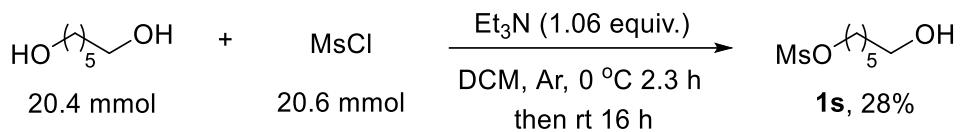

chemical

Organic reaction scheme showing SmCl reacting with Et3N under specified conditions to form MsO and 1s, with yields noted

To a flask were added 1,6-hexanediol (2.4841 g, 20.4 mmol, 97% purity), Et3N (3.0 mL, d = 0.728 g/mL, 21.6 mmol), and DCM (40 mL). Then MsCl (1.6 mL, d = 1.478 g/mL, 20.6 mmol) was added dropwise within 20 min at $0 ~ ^ { \mathrm { { o } } } \mathrm { { C } }$ with an ice-water bath. After being stirred for 2 h at the same temperature, the resulting mixture was warmed to rt and stirred for 16 h. The solvent was removed under reduced pressure and the residue was purified by chromatography on silica gel to afford 1s (1.1072 g, 28%) [first round eluent: petroleum ether/ethyl acetate = 5/1 (\~300 mL) to 3/1 (\~400 mL), then 2/1 (\~600 mL) to 1/1 (\~600 mL) to afford pure 1s (141.5 mg) and impure 1s; second round eluent: DCM/methol = 200/1 (\~600 mL) to 100/1 (\~400 mL), then 20/1 (\~420 mL) to afford pure 1s (0.9657 g)] as light yellow oil. 1H NMR (400 MHz, CDCl3) $\delta = 4 . 2 3$ (t, $J = 6 . 6$ Hz, 2 H, OCH2), 3.62 (t, $J { = } 6 . 4 \ : \mathrm { H z } ,$ , 2 H, OCH2), 3.01 (s, 3 H, CH3), 2.22 (s, 1 H, OH), 1.77 (quint, J = 6.6 Hz, 2 H, CH2), 1.57 (quint, J = 6.6 Hz, 2 H, CH2), 1.50-1.34 (m, 4 H, $2 \mathrm { x } \operatorname { C H } _ { 2 } )$ ; 13C NMR (100 MHz, CDCl3): δ = 70.0, 62.2, 37.1, 32.2, 28.9, 24.99, 24.97; IR (neat, cm-1): v = 2934, 2864, 1468, 1340, 1262, 1169, 1052, 1022; MS (ESI) m/z: 219 $\mathbf { \left( M \mathrm { + N a } \right) ^ { \dagger } }$ +, 197 (M+H)+; HRMS (ESI) calcd m/z for $\mathrm { C _ { 7 } H _ { 1 7 } O _ { 4 } S }$ $[ \mathrm { M } \mathrm { + H } ] ^ { + }$ : 197.0842, found 197.0843.

# 2. Preparation of carboxylic acid esters

# (1) Preparation of methyl palmitate (6ae, yyb-8-102)

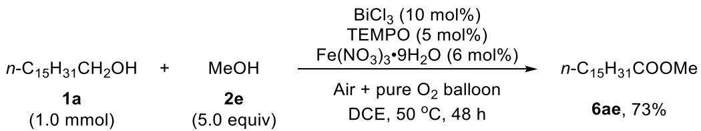

chemical

Chemical reaction scheme for n-C₁₅H₃₁COOMe synthesis using BiCl₃, TEMPO, and Fe(NO₃)₃·9H₂O under air and O₂ balloon conditions

Typical Procedure I: To a 50 mL flask were added $\mathrm { F e } ( \mathrm { N O } _ { 3 } ) _ { 3 } { \bullet } 9 \mathrm { H } _ { 2 } \mathrm { O }$ (24.9 mg, 0.06 mmol), TEMPO (8.0 mg, 0.05 mmol), $\mathrm { B i C l } _ { 3 }$ (31.4 mg, 0.1 mmol), 1a (243.1 mg, 1.0 mmol), MeOH (202 μL, 5 mmol), and DCE (3 mL) sequentially in open air. The reaction was then carried out at $5 0 ^ { \circ } \mathrm { C }$ under the atmosphere of $\mathrm { O } _ { 2 }$ from a balloon (about

2.5 L) until completion of the reaction as monitored by TLC (48 h). The resulting mixture was filtrated through a short column of silica gel eluted with diethyl ether (3 x 25 mL) and concentrated. 6ae was formed in 83% NMR yield based on 1H NMR analysis of the crude product with $\mathrm { C H } _ { 2 } \mathrm { B r } _ { 2 }$ (35 μL) as the internal standard. After evaporation, MeOH (2 mL) and a saturated ${ \mathrm { N a H S O } } _ { 3 }$ aqueous solution (1 mL) were added to the residue. The resulting mixture was stirred vigorously at room temperature for 1 h, dried with anhydrous ${ \mathrm { N a } } _ { 2 } { \mathrm { S O } } _ { 4 } .$ , filtrated through a short column of silica gel (1 cm) eluted with DCM (3 x 15 mL), and concentrated. After evaporation, the residue was purified by chromatography on silica gel to afford ${ \bf 6 a e } ^ { 2 }$ (198.3 mg, 73%) [eluent: petroleum ether/DCM = 10/1 (\~220 mL) to 4/1 (\~250 mL), 2/1 (\~150 mL), then petroleum ether/ethyl acetate = 5/1 (\~300 mL)] as light yellow solid (Low melting point solid, unable to recrystallize to measure melting point). 1H NMR (400 MHz, CDCl3): δ = 3.66 (s, 3 H, OCH3), 2.30 (t, J = 7.4 Hz, 2 H, CH2), 1.67-1.55 (m, 2 H, CH2), 1.38- 1.15 (m, 24 H, 12 x CH2), 0.88 (t, J = 6.8 Hz, 3 H, CH3); 13C NMR (100 MHz, CDCl3): δ = 174.2, 51.3, 34.0, 31.9, 29.65, 29.63, 29.62, 29.55, 29.4, 29.3, 29.2, 29.1, 24.9, 22.6, 14.0; IR (neat, cm-1): v = 2950, 2916, 2849, 1739, 1465, 1436, 1377, 1195, 1164; MS $( 7 0 \mathrm { { e V } , }$ EI) m/z (%): 270 (M+, 19.23), 74 (100).

# (2) Preparation of methyl stearate (6be, QAN-8-169)

$$
\begin{array}{c c c} n - \mathrm{C} _ {1 7} \mathrm{H} _ {3 5} \mathrm{CH} _ {2} \mathrm{OH} & + & \text {MeOH} \\ 1 \mathbf {b} & & 2 \mathbf {e} \\ (1. 0 \mathrm{mmol}) & & (5. 0 \text {equiv}) \end{array} \xrightarrow [ \text {Air + pure O} _ {2} \text {balloon} ]{\substack {\text {BiCl} _ {3} (1 0 \mathrm{mol}\%) \\ \text {TEMPO (5 mol\%)} \\ \text {Fe(NO} _ {3}) _ {3} \cdot 9 \mathrm{H} _ {2} \mathrm{O (6 mol\%)}}} n - \mathrm{C} _ {1 7} \mathrm{H} _ {3 5} \mathrm{COOMe}   6 \mathbf {b e}, 73 \%
$$

Following Typical Procedure Ⅰ, the reaction of 1b (270.5mg, 1.0 mmol), $\mathrm { F e } ( \mathrm { N O } _ { 3 } ) _ { 3 } { \bullet } 9 \mathrm { H } _ { 2 } \mathrm { O }$ (24.7 mg, 0.06 mmol), TEMPO (8.2 mg, 0.05 mmol), BiCl3 (31.6 mg, 0.1 mmol), and MeOH (202 μL, 5 mmol) in DCE (3 mL) afforded ${ \bf 6 6 0 } ^ { 2 }$ (217.8 mg, 73%) [eluent: petroleum ether/DCM = 10/1 (\~220 mL) to 4/1 (\~250 mL), then 2/1 (\~450 mL)] as white solid: m.p. $4 2 . 1 { - } 4 3 . 5 \ ^ { \mathrm { ~ o } } \mathrm { C }$ (We were not able to the recrystallize from the solvents tested, the m.p. of 6be was determined by using the solid right after evaporation of the eluent). 1H NMR (400 MHz, CDCl3) δ = 3.66 (s, 3 H, OCH3), 2.30 (t, J = 7.6 Hz, 2 H, CH2), 1.65-1.58 (m, 2 H, CH2), 1.32-1.17 (m, 28 H, 14 x CH2), 0.88 (t, $J = 6 . 4$ Hz, 3 H, CH3); $^ { 1 3 } \mathbf { C }$ NMR (100 MHz, CDCl3) δ = 174.3, 51.3, 34.1, 31.9, 29.7, 29.6, 29.4, 29.3, 29.2, 29.1, 24.9, 22.7, 14.1; IR (neat, cm-1): v = 2916, 2848, 1738, 1463, 1435, 1380, 1331, 1254, 1213, 1194, 1169, 1105; MS (70 eV, EI) m/z (%): 298 (M+, 43.97), 74 (100).

# (3) Preparation of methyl dodecanoate (6ce, lj-8-081)

$$
\begin{array}{c c c} n - \mathrm{C} _ {1 1} \mathrm{H} _ {2 3} \mathrm{CH} _ {2} \mathrm{OH} & + & \text {MeOH} \\ 1 \mathrm{c} & & 2 \mathrm{e} \\ (1. 0 \mathrm{mmol}) & & (5. 0 \text {equiv}) \end{array} \xrightarrow [ \text {Air + pure O} _ {2} \text {balloon} ]{\substack {\text {BiCl} _ {3} (1 0 \mathrm{mol}\%) \\ \text {TEMPO (5 mol\%)}} \\ \text {Fe(NO} _ {3}) _ {3} \cdot 9 \mathrm{H} _ {2} \mathrm{O (6 mol\%)}} n - \mathrm{C} _ {1 1} \mathrm{H} _ {2 3} \mathrm{COOMe}
$$

Following Typical Procedure Ⅰ, the reaction of 1c (186.4 mg, 1.0 mmol), $\mathrm { F e } ( \mathrm { N O } _ { 3 } ) _ { 3 } { \bullet } 9 \mathrm { H } _ { 2 } \mathrm { O }$ (24.6 mg, 0.06 mmol), TEMPO (8.1 mg, 0.05 mmol), BiCl3 (31.6 mg, 0.1 mmol), and MeOH (202 μL, 5 mmol) in DCE (3 mL) afforded ${ \bf 6 0 e } ^ { 2 }$ (160.7 mg, 75%) [eluent: petroleum ether/ethyl acetate = 20/1 (\~420 mL)] as oil. 1H NMR (400 MHz, CDCl3) δ = 3.66 (s, 3 H, OCH3), 2.30 (t, J = 7.6 Hz, 2 H, CH2), 1.70-1.57 (m, 2 H, CH2), 1.45-1.15 (m, 16 H, $8 \ \mathrm { x } \ \mathrm { C H } _ { 2 } )$ , 0.88 (t, J = 6.6 Hz, 3 H, CH3); $^ { 1 3 } \mathbf { C }$ NMR (100 MHz, CDCl3) δ = 174.2, 51.3, 34.1, 31.9, 29.7, 29.6, 29.4, 29.3, 29.2, 29.1, 24.9, 22.6, 14.0; IR (neat, cm-1): v = 2924, 2855, 1742, 1463, 1438, 1363, 1236, 1198, 1171, 1116; MS $( 7 0 \mathrm { { e V } , }$ EI) m/z (%): 214 (M+, 4.71), 74 (100).

# (4) Preparation of methyl 3-cyclohexylpropanoate (6de, yyb-7-092)

$$
\begin{array}{c} \text {1d} \\ (1. 0 \mathrm{mmol}) \end{array} + \begin{array}{c} \text {MeOH} \\ (5. 0 \mathrm{equiv}) \end{array} \xrightarrow [ \text {Air + pure O } _ {2} \text { balloon} ]{\text {BiCl} _ {3} (1 0 \mathrm{mol} \%)} \begin{array}{c} \text {TEMPO (5 mol\%)} \\ \text {Fe(NO} _ {3}) _ {3} \cdot 9 \mathrm{H} _ {2} \mathrm{O (6 mol\%)} \\ \text {Air + pure O } _ {2} \text { balloon} \\ \text {DCE, 50 °C, 48 h} \end{array} \xrightarrow {\text {6de, 73\%}}
$$

Typical Procedure II: To a 50 mL flask were added $\mathrm { F e } ( \mathrm { N O } _ { 3 } ) _ { 3 } { \bullet } 9 \mathrm { H } _ { 2 } \mathrm { O }$ (24.8 mg, 0.06 mmol), TEMPO (8.4 mg, 0.05 mmol), BiCl3 (31.4 mg, 0.1 mmol), 1d (141.7 mg, 1.0 mmol), MeOH (202 μL, 5 mmol), and DCE (3 mL) sequentially in open air. The reaction was then carried out at $5 0 ^ { \circ } \mathrm { C }$ under the atmosphere of $\mathrm { O } _ { 2 }$ from a balloon (about 2.5 L) until completion of the reaction as monitored by TLC (48 h). The resulting mixture was filtrated through a short column of silica gel eluted with diethyl ether (3 x 25 mL) and concentrated. 6de was formed in 83% NMR yield based on 1H NMR analysis of the crude product with $\mathrm { C H } _ { 2 } \mathrm { B r } _ { 2 }$ (35 μL) as the internal standard. After evaporation, THF (2 mL) and 3 M HCl (0.5 mL) were added to the residue with vigorous stirring at room temperature for 2 h. To the resulting mixture was added a saturated aqueous solution of $\mathrm { N a H C O } _ { 3 }$ slowly until pH \~8. Then a saturated ${ \mathrm { N a H S O } } _ { 3 }$ aqueous solution (2 mL) was added to the residue with vigorous stirring at room temperature for 2 h. The resulting mixture was extracted with DCM (15 mL × 3), washed with brine, and dried over anhydrous ${ \mathrm { N a } } _ { 2 } { \mathrm { S O } } _ { 4 } .$ . After filtration and evaporation, the residue was purified by chromatography on silica gel to afford ${ \bf 6 d e } ^ { 3 }$ (122.0 mg, 73%) [eluent: petroleum ether/ethyl acetate = 100/1 (\~300 mL) to 50/1 (\~100 mL)] as yellow oil. 1H NMR (400 MHz, CDCl3): δ = 3.66 (s, 3 H, OCH3), 2.32 (t, J = 7.8 Hz, 2 H, CH2), 1.77-1.59 (m, 5 H), 1.52 (dd, $J _ { 1 } = 1 5 . 4 \ : \mathrm { H z } ,$ $J _ { 2 } = 7 . 0$ Hz, 2 H, CH2), 1.30-1.10 (m, 4 H), 0.96-0.82 (m, 2 H); 13C NMR (100 MHz, CDCl3): δ = 174.5, 51.3, 37.1, 32.9, 32.3, 31.6, 26.4, 26.1; IR (neat, $\mathrm { c m } ^ { - 1 } )$ : v = 2922, 2851, 1739, 1449, 1436, 1366, 1195, 1165; MS (70 eV, EI) m/z (%): 170 (M+, 1.01), 97 (100).

# (5) Preparation of methyl 3-phenylpropanoate (6ee, lj-8-082)

$$
\begin{array}{c} \text {PhCHCH(OH)} + \text {MeOH} \\ \text {1e (1.0 mmol)} \\ \text {2e (5.0 equiv)} \end{array} \xrightarrow [ \text {Air + pure O } _ {2} \text { balloon} ]{\text {BiCl} _ {3} (1 0 \mathrm{mol}) , \text {TEMPO} (5 \mathrm{mol}) , \text {Fe(NO} _ {3}) _ {3} \cdot 9 \mathrm{H} _ {2} \mathrm{O} (6 \mathrm{mol}) \%}, \quad \text {DCE, 50 °C, 48 h} \quad \text {PhCHCHCOOMe} \quad 6 4 \%
$$

Following Typical Procedure Ⅰ, the reaction of 1e (136.3 mg, 1.0 mmol), $\mathrm { F e } ( \mathrm { N O } _ { 3 } ) _ { 3 } { \bullet } 9 \mathrm { H } _ { 2 } \mathrm { O }$ (24.6 mg, 0.06 mmol), TEMPO (8.1 mg, 0.05 mmol), BiCl3 (31.3 mg, 0.1 mmol), and MeOH $( 2 0 2 \mu \mathrm { L } .$ , 5 mmol) in DCE (3 mL) afforded ${ \bf 6 e e ^ { 4 } }$ (105.1 mg, 64%) [eluent: petroleum ether/ethyl acetate = 20/1 (\~420 mL)] as oil. 1H NMR (400 MHz, CDCl3): $\ S = 7 . 3 2 \ – 7 . 2 5$ (m, 2 H, Ar-H), 7.24-7.12 (m, 3 H, Ar-H), 3.67 (s, 3 H, OCH3), 2.95 (t, J = 7.8 Hz, 2 H, CH2), 2.64 (t, J = 7.8 Hz, 2 H, CH2); $^ { 1 3 } \mathbf { C }$ NMR (100 MHz, CDCl3): $\delta = 1 7 3 . 3$ , 140.5, 128.5, 128.2, 126.2, 51.5, 35.7, 30.9; IR (neat, $\mathrm { c m } ^ { - 1 } )$ : $\nu =$ 3026, 2950, 2834, 1736, 1496, 1443, 1364, 1290, 1255, 1164, 1075, 1055, 1028; MS (70 eV, EI) $m / z \left( \% \right)$ : 164 (M+, 38.9), 104 (100).

# (6) Preparation of methyl 4-phenylbutanoate (6fe, yyb-6-060)

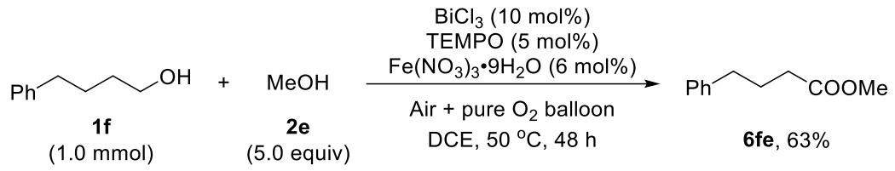

chemical

Organic synthesis reaction scheme showing conversion of compound 1f to 6fe using MeOH and Fe(NO3)3·9H2O under specified conditions

Following Typical Procedure Ⅰ, the reaction of 1f (149.5 mg, 1.0 mmol), $\mathrm { F e } ( \mathrm { N O } _ { 3 } ) _ { 3 } { \bullet } 9 \mathrm { H } _ { 2 } \mathrm { O }$ (24.9 mg, 0.06 mmol), TEMPO (8.2 mg, 0.05 mmol), BiCl3 (31.4 mg, 0.1 mmol), and MeOH (202 μL, 5 mmol) in DCE (3 mL) afforded $\mathbf { 6 f e ^ { 3 } }$ (115.6 mg, 63%, 96% purity) [eluent: petroleum ether/DCM = 10/1 (\~220 mL) to 4/1 (\~250 mL), then 2/1 (\~300 mL)] as light yellow oil. 1H NMR (400 MHz, CDCl3): δ = 7.26 (t, J = 7.4 Hz, 2 H, Ar-H), 7.21-7.10 (m, 3 H, Ar-H), 3.64 (s, 3 H, OCH3), 2.64 (t, J = 7.6 Hz, 2 H, CH2), 2.31 (t, J = 7.6 Hz, 2 H, CH2), 1.95 (quint, J = 7.5 Hz, 2 H, CH2); 13C NMR (100 MHz, CDCl3): δ = 173.8, 141.3, 128.4, 128.3, 125.9, 51.3, 35.0, 33.3, 26.4; IR (neat, $\mathrm { c m } ^ { - 1 } )$ ): v = 3027, 2946, 2864, 1735, 1496, 1442, 1366, 1246, 1168, 1146; MS (70 eV, EI) $m / z \left( \% \right)$ : 178 (M+, 42.91), 104 (100).

# (7) Preparation of methyl 5-phenylpentanoate (6ge, yyb-6-061)

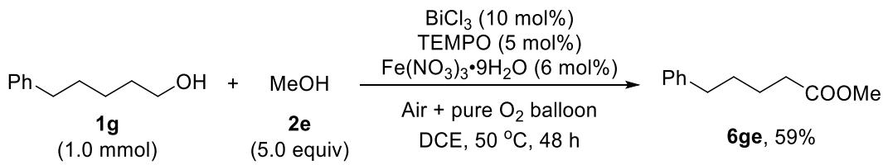

chemical

Organic synthesis reaction scheme showing conversion of compound 1g to 6ge using MeOH and Fe(NO3)3·9H2O under specified conditions

Following Typical Procedure Ⅰ, the reaction of 1g (167.5 mg, 1.0 mmol, 98% purity), $\mathrm { F e } ( \mathrm { N O } _ { 3 } ) _ { 3 } { \bullet } 9 \mathrm { H } _ { 2 } \mathrm { O }$ (24.7 mg, 0.06 mmol), TEMPO (8.1 mg, 0.05 mmol), BiCl3 (32.1 mg, 0.1 mmol), and MeOH (202 μL, 5 mmol) in DCE (3 mL) afforded $\mathbf { 6 { g } e } ^ { 3 }$ (111.8 mg, 59%) [eluent: petroleum ether/DCM = 10/1 (\~220 mL) to 4/1 (\~250 mL), then 2/1 (\~300 mL)] as light yellow oil. 1H NMR (400 MHz, CDCl3): δ = 7.26 (t, J = 7.4 Hz, 2 H, Ar-H), 7.20-7.12 (m, 3 H, Ar-H), 3.65 (s, 3 H, OCH3), 2.62 (t, J = 6.6 Hz, 2 H, CH2), 2.32 (t, J = 6.6 Hz, 2 H, CH2), 1.74-1.55 (m, 4 H, 2 x CH2); 13C NMR (100 MHz, CDCl3): δ = 174.0, 142.1, 128.32, 128.26, 125.7, 51.4, 35.5, 33.9, 30.8, 24.5; IR (neat, $\mathrm { c m } ^ { - 1 } )$ : v = 3026, 2943, 2861, 1736, 1495, 1436, 1360, 1198, 1142; MS (70 eV, EI) m/z (%): 192 (M+, 3.56), 91 (100).

# (8) Preparation of methyl 6-phenylhexanoate (6he, yyb-6-096)

chemical

Organic synthesis reaction scheme showing conversion of compound 1h to 6he using MeOH and Fe(NO3)3·9H2O under BiCl3/TEMPO conditions

Following Typical Procedure Ⅰ, the reaction of 1h (182.8 mg, $9 7 \%$ purity, 1.0 mmol), $\mathrm { F e } ( \mathrm { N O } _ { 3 } ) _ { 3 } { \bullet } 9 \mathrm { H } _ { 2 } \mathrm { O }$ (24.5 mg, 0.06 mmol), TEMPO (8.2 mg, 0.05 mmol), BiCl3 (31.3 mg, 0.1 mmol), and MeOH (202 μL, 5 mmol) in DCE (3 mL) afforded ${ \bf 6 h e ^ { 5 } }$ (162.6 mg, $7 9 \% )$ [eluent: petroleum ether/DCM = 15/1 (\~320 mL) to 5/1 (\~480 mL), then 3/1 (\~400 mL)] as light yellow oil. 1H NMR (400 MHz, CDCl3): δ = 7.25 (t, J = 7.2 Hz, 2 H, Ar-H), 7.20-7.09 (m, 3 H, Ar-H), 3.64 (s, 3 H, OCH3), 2.59 (t, J = 7.6 Hz, 2 H, CH2), 2.28 (t, $J { = } 7 . 6 \ \mathrm { H z } ,$ 2 H, CH2), 1.71-1.56 (m, 4 H, 2 x CH2), 1.35 (quint, $J { = } 7 . 6 \mathrm { H z } ,$ 2 H, CH2); $^ { 1 3 } \mathbf { C }$ NMR (100 MHz, CDCl3): δ = 174.0, 142.4, 128.3, 128.2, 125.6, 51.3, 35.6, 33.9, 30.9, 28.6, 24.7; IR $( \mathrm { n e a t , c m ^ { - 1 } } )$ ): v = 3026, 2930, 2857, 1736, 1495, 1436, 1362, 1198, 1170; MS (70 eV, EI) $m / z \left( \% \right)$ : 206 (M+, 9.32), 91 (100).

# (9) Preparation of methyl 3-(4-cyanophenyl)propanoate (6ie, yyb-7-024)

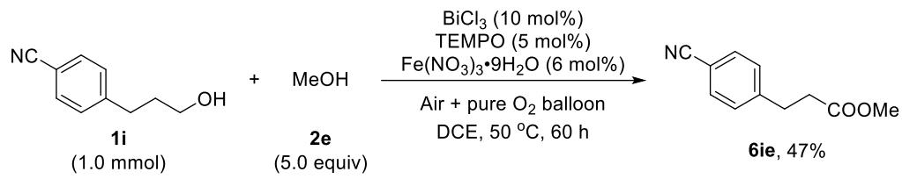

chemical

Organic synthesis reaction scheme showing conversion of compound 1i to 6ie using MeOH and 2e under BiCl3/TEMPO conditions

Following Typical Procedure ⅠI, the reaction of 1i (161.1 mg, 1.0 mmol), $\mathrm { F e } ( \mathrm { N O } _ { 3 } ) _ { 3 } { \bullet } 9 \mathrm { H } _ { 2 } \mathrm { O }$ (24.6 mg, 0.06 mmol), TEMPO (8.2 mg, 0.05 mmol), $\mathrm { B i C l } _ { 3 }$ (31.3 mg, 0.1 mmol), and MeOH (202 μL, 5 mmol) in DCE (4 mL) afforded $\mathbf { 6 i e ^ { 6 } }$ (89.7 mg, 47%) [eluent: petroleum ether/ethyl acetate = 10/1 (\~270 mL) to 8/1 (\~450 mL)] as yellow oil. $\mathbf { 1 } _ { \mathbf { H } }$ NMR (400 MHz, CDCl3): $\delta = 7 . 5 8$ (d, J = 8.4 Hz, 2 H, Ar-H), 7.32 (d, $J = 8 . 4$ Hz, 2 H, Ar-H), 3.67 (s, 3 H, OCH3), 3.02 (t, J = 7.6 Hz, 2 H, CH2), 2.66 (t, J = 7.6 Hz, 2 H, CH2); 13C NMR (100 MHz, CDCl3): δ = 172.5, 146.0, 132.2, 129.1, 118.8, 110.1， 51.6, 34.7, 30.7; IR (neat, cm-1): v = 2952, 2227, 1733, 1608, 1506, 1437, 1365, 1174, 1159; MS (70 eV, EI) m/z (%): 189 (M+, 21.63), 129 (100).

# (10) Preparation of methyl 3-(4-nitrophenyl)propanoate (6je, yyb-7-049)

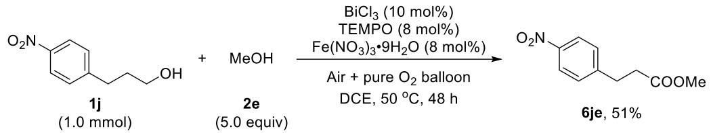

chemical

Chemical reaction scheme showing synthesis of compound 6je from 1j and 2e under specified reagents and conditions

Following Typical Procedure ⅠI, the reaction of 1j (181.3 mg, 1.0 mmol), $\mathrm { F e } ( \mathrm { N O } _ { 3 } ) _ { 3 } { \bullet } 9 \mathrm { H } _ { 2 } \mathrm { O }$ (32.5 mg, 0.08 mmol), TEMPO (13.0 mg, 0.08 mmol), BiCl3 (31.3 mg, 0.1 mmol), and MeOH (202 μL, 5 mmol) in DCE (4 mL) afforded $\mathbf { 6 j e } ^ { 7 }$ (106.4 mg, 51%) [eluent: petroleum ether/ethyl acetate = 7/1 (\~400 mL) to 5/1 (\~120 mL)] as light yellow solid; m.p. 73.7-74.2 oC (petroleum ether/DCM). 1H NMR (400 MHz, CDCl3): $\delta = 8 . 1 5$ (d, J = 8.4 Hz, 2 H, Ar-H), 7.38 (d, J = 8.4 Hz, 2 H, Ar-H), 3.68 (s, 3 H, OCH3), 3.07 (t, J = 7.4 Hz, 2 H, CH2), 2.69 (t, J = 7.4 Hz, 2 H, CH2); 13C NMR (100 MHz, CDCl3): δ $= 1 7 2 . 5 $ , 148.2, 146.6, 129.1, 123.7, 51.7, 34.7, 30.5; IR (neat, cm-1): v = 3113, 3083, 1727, 1607, 1514, 1430, 1346, 1191, 1169; MS (70 eV, EI) m/z (%): 209 (M+, 26.18), 149 (100).

# (11) Preparation of methyl 3-(3-(trifluoromethyl)phenyl)propanoate (6ke, yyb-7- 072)

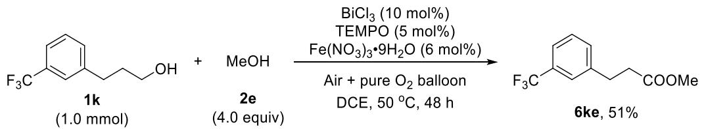

chemical

Organic synthesis reaction scheme showing conversion of compound 1k to 6ke using MeOH and Fe(NO3)3·9H2O under specified conditions

Following Typical Procedure ⅠI, the reaction of 1k (204.1 mg, 1.0 mmol), $\mathrm { F e } ( \mathrm { N O } _ { 3 } ) _ { 3 } { \bullet } 9 \mathrm { H } _ { 2 } \mathrm { O }$ (24.7 mg, 0.06 mmol), TEMPO (8.3 mg, 0.05 mmol), BiCl3 (31.4 mg, 0.1 mmol), and MeOH $( 1 6 2 \mu \mathrm { L } ,$ 4 mmol) in DCE (4 mL) afforded ${ \bf 6 k e } ^ { 6 }$ (121.8 mg, 51%, 98% purity) [eluent: petroleum ether/ethyl acetate = 20/1 (\~420 mL)] as light yellow oil. 1H NMR (400 MHz, CDCl3): δ = 7.51-7.44 (m, 2 H, Ar-H), 7.42-7.34 (m, 2 H, Ar-H), 3.67 (s, 3 H, OCH3), 3.01 (t, J = 7.8 Hz, 2 H, CH2), 2.66 (t, J = 7.6 Hz, 2 H, CH2); $^ { 1 3 } \mathbf { C }$ NMR (100 MHz, CDCl3): δ = 172.8, 141.4, 131.7, 130.8 (q, J = 31.9 Hz), 128.9, 125.0 (q, J = 3.7 Hz), 124.1 (q, J = 270.4 Hz), 123.2 (q, J = 3.7 Hz), 51.6, 35.3, 30.6; ${ } ^ { 1 9 } \mathbf { F }$ NMR (376 MHz, CDCl3): δ = -63.1; IR (neat, $\mathrm { c m } ^ { - 1 } )$ ): v = 1737, 1439, 1365, 1327, 1199, 1159, 1118, 1073; MS (70 eV, EI) m/z (%): 232 (M+, 44.2), 172 (100).

# (12) Preparation of methyl 3-(4-chlorophenyl)propanoate (6le, yyb-7-091)

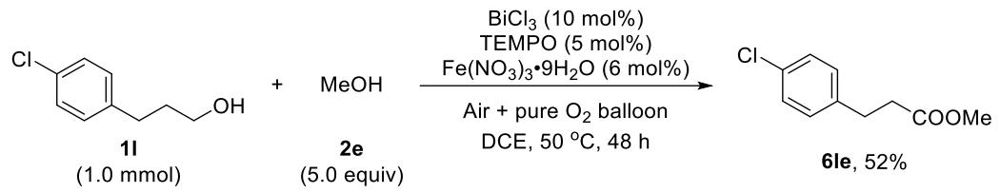

chemical

Organic synthesis reaction scheme showing conversion of compound 1l to 6le using MeOH and 2e under BiCl3/TEMPO conditions

Following Typical Procedure II, the reaction of 1l (169.9 mg, 1.0 mmol), $\mathrm { F e } ( \mathrm { N O } _ { 3 } ) _ { 3 } { \bullet } 9 \mathrm { H } _ { 2 } \mathrm { O }$ (24.7 mg, 0.06 mmol), TEMPO (8.1 mg, 0.05 mmol), BiCl3 (31.4 mg, 0.1 mmol), and MeOH (202 μL, 5 mmol) in DCE (4 mL) afforded ${ \bf 6 1 e ^ { 4 } }$ (103.2 mg, 52%) [eluent: petroleum ether/ethyl acetate = 25/1 (\~260 mL) to 20/1 (\~100 mL)] as yellow oil. 1H NMR (400 MHz, CDCl3): δ = 7.30-7.20 (m, 2 H, Ar-H), 7.17-7.07 (m, 2 H, Ar-H), 3.66 (s, 3 H, OCH3), 2.91 (t, J = 7.6 Hz, 2 H, CH2), 2.60 (t, J = 7.8 Hz, 2 H, CH2); $^ { 1 3 } \mathbf { C }$ NMR (100 MHz, CDCl3): δ = 173.0, 138.9, 132.0, 129.6, 128.5, 51.6, 35.4, 30.2; IR (neat, cm-1): v = 2951, 1734, 1492, 1436, 1364, 1195, 1157, 1092; MS (70 eV, EI) m/z (%): $2 0 0 ( \mathrm { M } ( ^ { 3 7 } \mathrm { C l } ) ^ { + } , 9 . 7 )$ , 198 $( \mathrm { M } ( ^ { 3 5 } \mathrm { C l } ) ^ { + }$ , 29.17), 138 (100).

# (13) Preparation of methyl 3-(4-methoxyphenyl)propanoate (6me, yyb-7-063)

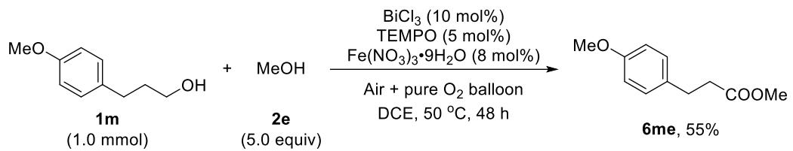

chemical

Organic synthesis reaction scheme showing conversion of compound 1m to 6me using MeOH and Fe(NO3)3·9H2O under specified conditions

Following Typical Procedure II, the reaction of 1m (175.5 mg, 95% purity, 1.0 mmol), $\mathrm { F e } ( \mathrm { N O } _ { 3 } ) _ { 3 } { \bullet } 9 \mathrm { H } _ { 2 } \mathrm { O }$ (32.3 mg, 0.08 mmol), TEMPO (8.1 mg, 0.05 mmol), BiCl3 (32.0 mg, 0.1 mmol), and MeOH (202 μL, 5 mmol) in DCE (4 mL) afforded $\mathbf { 6 m e ^ { 6 } }$ (107.3 mg, 55%) [eluent: petroleum ether/ethyl acetate = 15/1 (\~320 mL) to 10/1 (\~110 mL)] as light yellow oil. 1H NMR (400 MHz, CDCl3): δ = 7.10 (d, J = 8.8 Hz, 2 H, Ar-H), 6.82 (d, J = 8.4 Hz, 2 H, Ar-H), 3.76 (s, 3 H, OCH3), 3.65 (s, 3 H, OCH3), 2.88 (t, J = 7.8 Hz, 2 H, CH2), 2.59 (t, J = 7.8 Hz, 2 H, CH2); 13C NMR (100 MHz, CDCl3): δ $= 1 7 3 . 3$ , 158.0, 132.5, 129.1, 113.8, 55.1, 51.4, 35.9, 30.0; IR (neat, $\mathrm { c m } ^ { - 1 }$ ): $\nu = 3 0 1 1$ , 2929, 1729, 1610, 1511, 1436, 1373, 1176, 1157; MS (70 eV, EI) $m / z \ ( \% )$ : 194 (M+, 21.47), 121 (100).

# (14) Preparation of methyl 6-(4-cyanobenzyloxy)hexanoate (6ne, yyb-7-015)

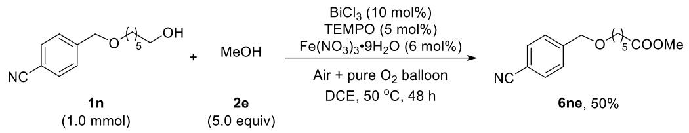

chemical

Organic synthesis reaction scheme showing conversion of compound 1n to 6ne using MeOH and Fe(NO3)3·9H2O under specified conditions

Following Typical Procedure ⅠI, the reaction of 1n (233.0 mg, 1.0 mmol), $\mathrm { F e } ( \mathrm { N O } _ { 3 } ) _ { 3 } { \bullet } 9 \mathrm { H } _ { 2 } \mathrm { O }$ (24.4 mg, 0.06 mmol), TEMPO (8.3 mg, 0.05 mmol), BiCl3 (31.8 mg, 0.1 mmol), and MeOH (202 μL, 5 mmol) in DCE (3 mL) afforded 6ne (129.9 mg, 50%) [eluent: petroleum ether/ ethyl acetate = 10/1 (\~330 mL) to 5/1 (\~240 mL)] as light yellow oil. 1H NMR (400 MHz, CDCl3): δ = 7.63 (d, J = 8.0 Hz, 2 H, Ar-H), 7.44 (d, $J { = } 8 . 0 \mathrm { H z }$ , 2 H, Ar-H), 4.54 (s, 2 H, OCH2), 3.67 (s, 3 H, OCH3), 3.50 (t, J = 6.6 Hz, 2 H, OCH2), 2.33 (t, J = 7.6 Hz, 2 H, CH2), 1.71-1.59 (m, 4 H, 2 x CH2), 1.48-1.35 (m, 2 H, CH2); $^ { 1 3 } \mathbf { C }$ NMR (100 MHz, CDCl3): δ = 173.9, 144.2, 132.0, 127.5, 118.7, 111.0, 71.7, 70.6, 51.3, 33.8, 29.2, 25.6, 24.5; IR $\mathrm { ( n e a t , c m ^ { - 1 } ) }$ : $\nu = 2 9 4 7$ , 2863, 2223, 1738, 1609, 1448, 1371, 1236, 1170, 1099; MS (70 eV, EI) m/z (%): 261 (M+, 3.52), 116 (100); HRMS (EI) calcd m/z for $\mathrm { C _ { 1 5 } H _ { 1 9 } N O _ { 3 } }$ [M]+: 261.1359, Found: 261.1363.

# (15) Preparation of methyl 6-ethoxyhexanoate (6oe, yyb-6-155)

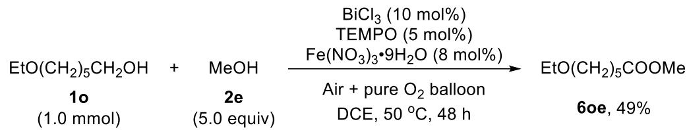

chemical

Organic synthesis reaction scheme for EtO(CH₂)₅COOMe with reagents 1o, 2e, BiCl₃, TEMPO, Fe(NO₃)₃·9H₂O, and COOMe, yielding 6oe at 49%

Following Typical Procedure ⅠI, the reaction of 1o (146.0 mg, 1.0 mmol), $\mathrm { F e } ( \mathrm { N O } _ { 3 } ) _ { 3 } { \bullet } 9 \mathrm { H } _ { 2 } \mathrm { O }$ (32.6 mg, 0.08 mmol), TEMPO (8.1 mg, 0.05 mmol), $\mathrm { B i C l } _ { 3 }$ (31.8 mg, 0.1 mmol), and MeOH (202 μL, 5 mmol) in DCE (3 mL) afforded 6oe (88.6 mg, 49%, 96% purity) [eluent: petroleum ether/ethyl acetate = 20/1 (\~210 mL) to 10/1 (\~220 mL)] as light yellow oil. 1H NMR (400 MHz, CDCl3): δ = 3.66 (s, 3 H, OCH3), 3.46 (q, J = 6.9 Hz, 2 H, OCH2), 3.41 (t, J = 6.6 Hz, 2 H, OCH2), 2.32 (t, J = 7.6 Hz, 2 H, CH2), 1.73-1.52 (m, 4 H, 2 x CH2), 1.46-1.32 (m, 2 H, CH2), 1.19 (t, J = 7.0 Hz, 3 H, CH3); $^ { 1 3 } \mathbf { C }$ NMR (100 MHz, CDCl3): δ = 174.0, 70.2, 66.0, 51.3, 33.9, 29.3, 25.7, 24.7, 15.0; IR (neat, cm-1): v = 2975, 2940, 2860, 1738, 1437, 1376, 1201, 1167, 1109; MS (ESI) m/z: 197 (M+Na)+, 175 (M+H)+; HRMS (ESI) calcd $m / z$ for $\mathrm { C } _ { 9 } \mathrm { H } _ { 1 9 } \mathrm { O } _ { 3 }$ [M+H]+:

# (16) Preparation of methyl 9-phenoxynonanoate (6pe, yyb-6-172)

$$
\begin{array}{c} \text {PhO(CH_{2})_{8} CH_{2} OH} + \text {MeOH} \\ \text {1p} \\ (1. 0 \mathrm{mmol}) \end{array} \xrightarrow [ \text {(5.0 equiv)} ]{\text {BiCl_{3}} (1 0 \mathrm{mol} \%)} \begin{array}{c} \text {PhO(CH_{2})_{8} COOMe} \\ \text {6pe, 63\%} \\ \text {Air + pure O_{2} balloon} \\ \text {DCE, 50 ^{\circ}C, 48 h} \end{array}
$$

Typical Procedure III: To a 50 mL flask were added $\mathrm { F e } ( \mathrm { N O } _ { 3 } ) _ { 3 } { \bullet } 9 \mathrm { H } _ { 2 } \mathrm { O }$ (24.5 mg, 0.06 mmol), TEMPO (8.0 mg, 0.05 mmol), $\mathrm { B i C l } _ { 3 }$ (31.9 mg, 0.1 mmol), 1p (236.7 mg, 1.0 mmol), MeOH (202 μL, 5 mmol), and DCE (3 mL) sequentially in open air. The reaction was then carried out at $5 0 ^ { \circ } \mathrm { C }$ under the atmosphere $\operatorname { o f } \operatorname { O } _ { 2 }$ from a balloon (about 2.5 L) until completion of the reaction as monitored by TLC (48 h). The resulting mixture was filtrated through a short column of silica gel eluted with diethyl ether (3 x 25 mL) and concentrated. 6pe was formed in 73% NMR yield based on 1H NMR analysis of the crude product with $\mathrm { C H } _ { 2 } \mathrm { B r } _ { 2 }$ (35 μL) as the internal standard. After evaporation, the residue was purified by chromatography on silica gel to afford 6pe (166.4 mg, 63%) [first round eluent: petroleum ether/ethyl acetate = 40/1 (\~610 mL); second round eluent: petroleum ether/ethyl acetate = 50/1 (\~510 mL)] as light yellow oil. 1H NMR (400 MHz, CDCl3): δ = 7.32-7.20 (m, 2 H, Ar-H), 6.96-6.83 (m, 3 H, Ar-H), 3.93 (t, J = 6.6 Hz, 2 H, OCH2), 3.65 (s, 3 H, OCH3), 2.29 (t, J = 7.6 Hz, 2 H, CH2), 1.76 (quint, J = 7.0 Hz, 2 H, CH2), 1.62 (quint, J = 7.3 Hz, 2 H, CH2), 1.52-1.40 (m, 2 H, CH2), 1.38-1.27 (m, 6 H, $3 \mathrm { ~ x ~ C H } _ { 2 } )$ ; 13C NMR (100 MHz, CDCl3): δ = 174.1, 159.0, 129.3, 120.3, 114.4, 67.7, 51.3, 33.9, 29.2, 29.1, 29.0, 25.9, 24.8; IR (neat, cm-1): v = 2930, 2856, 1737, 1599, 1496, 1470, 1436, 1242, 1198, 1169; MS (ESI) m/z: 287 $\mathrm { ( M + N a ) } ^ { - }$ +, 265 (M+H)+; HRMS (ESI) calcd m/z for $\mathrm { C _ { 1 6 } H _ { 2 5 } O _ { 3 } }$ [M+H]+: 265.1798, found 265.1796.

# (17) Preparation of methyl 9-bromononanoate (6qe, yyb-6-085)

$$
\begin{array}{c} \text {Br(CH_{2})_{8} CH_{2} OH} + \text {MeOH} \\ \text {1q} \\ (1. 0 \mathrm{mmol}) \end{array} \xrightarrow [ \text {(5.0 equiv)} ]{\substack {\text {BiCl}_{3} (10 \mathrm{mol}\%) \\ \text {TEMPO (5 mol\%)} \\ \text {Fe(NO_{3})_{3} \cdot 9H_{2} O (8 mol\%)}}} \text {Br(CH_{2})_{8} COOMe} \\ \text {Air + pure O_{2} balloon} \\ \text {DCE, 50 °C, 48 h} \\ \text {6qe, 74\%}
$$

Following Typical Procedure Ⅰ, the reaction of 1q (223.5 mg, 1.0 mmol), $\mathrm { F e } ( \mathrm { N O } _ { 3 } ) _ { 3 } { \bullet } 9 \mathrm { H } _ { 2 } \mathrm { O }$ (32.3 mg, 0.08 mmol), TEMPO (8.3 mg, 0.05 mmol), BiCl3 (31.8 mg, 0.1 mmol), and MeOH (202 μL, 5 mmol) in DCE (3 mL) afforded $\mathbf { 6 q e } ^ { 8 }$ (189.5 mg, 74%, 98% purity) [eluent: petroleum ether/DCM = 10/1 (\~220 mL) to 4/1 (\~250 mL), then 2/1 (\~300 mL)] as light yellow oil. 1H NMR (400 MHz, CDCl3): δ = 3.66 (s, 3 H, OCH3), 3.40 (t, J = 6.8 Hz, 2 H, CH2), 2.30 (t, J = 7.4 Hz, 2 H, CH2), 1.85 (quint, $J =$ 7.1 Hz, 2 H, CH2), 1.68-1.56 (m, 2 H, CH2), 1.48-1.37 (m, 2 H, CH2), 1.37-1.27 (m, 3 x CH2); 13C NMR (100 MHz, CDCl3): δ = 174.0, 51.3, 33.9, 33.7, 32.7, 28.91, 28.87, 28.4, 28.0, 24.7; IR (neat, $\mathrm { c m ^ { - 1 } } )$ : v = 2930, 2855, 1737, 1458, 1437, 1362, 1197, 1170; MS (ESI) m/z: 275 $\mathrm { ( M ( ^ { 8 1 } B r ) + N a ) } ^ { - }$ +, 273 $( \mathrm { M } ( ^ { 7 9 } \mathrm { B r } ) { + } \mathrm { N a } ) ^ { + }$ +.

# (18) Preparation of methyl 9-iodononanoate (6re, yyb-6-088)

$$
\begin{array}{c} \mathrm {I(CH_ {2}) _ {8} CH_ {2} OH} + \mathrm{MeOH} \\ \text {1r} \\ (1. 0 \mathrm{mmol}) \end{array} \xrightarrow [ \text {(5.0 equiv)} ]{\text {BiCl} _ {3} (1 0 \mathrm{mol} \%)} \begin{array}{c} \mathrm {TEMPO (5 \mathrm{mol} \%)} \\ \mathrm {Fe(NO_ {3}) _ {3} \cdot 9H_ {2} O (8 \mathrm{mol} \%)} \\ \text {Air + pure O} _ {2} \text {balloon} \\ \text {DCE, 50 °C, 48 h} \end{array} \begin{array}{c} \mathrm {I(CH_ {2}) _ {8} COOMe} \\ \text {6re, 74\%} \end{array}
$$

Following Typical Procedure Ⅰ, the reaction of 1r (269.9 mg, 1.0 mmol), $\mathrm { F e } ( \mathrm { N O } _ { 3 } ) _ { 3 } { \bullet } 9 \mathrm { H } _ { 2 } \mathrm { O }$ (32.3 mg, 0.08 mmol), TEMPO (8.0 mg, 0.05 mmol), BiCl3 (32.1 mg, 0.1 mmol), and MeOH (202 μL, 5 mmol) in DCE (3 mL) afforded ${ \bf 6 r e ^ { 9 } }$ (200.1 mg and 23.2 mg (90% purity), 74%) [eluent: petroleum ether/DCM = 10/1 (\~330 mL) to 4/1 (\~250 mL), then 3/1 (\~200 mL)] as light yellow oil. 1H NMR (400 MHz, CDCl3): $\delta =$ 3.67 (s, 3 H, OCH3), 3.18 (t, J = 7.0 Hz, 2 H, CH2), 2.30 (t, J = 7.6 Hz, 2 H, CH2), 1.82 (quint, J = 7.1 Hz, 2 H, CH2), 1.68-1.56 (m, 2 H, CH2), 1.45-1.35 (m, 2 H, CH2), 1.35- 1.24 (m, 6 H, 3 x CH2); 13C NMR (100 MHz, CDCl3): δ = 174.1, 51.4, 34.0, 33.4, 30.3, 28.9, 28.2, 24.8, 7.1; IR (neat, $\mathrm { c m ^ { - 1 } } )$ ): v = 2926, 2853, 1736, 1459, 1434, 1361, 1195, 1169; MS (ESI) m/z: 321 (M+Na)+, 299 (M+H)+.

# (19) Preparation of methyl 6-((methanesulfonyl)oxy)hexanoate (6se, yyb-6-156)

$$
\begin{array}{c} \text {MsO(CH_{2})_{5}CH_{2}OH} + \text {MeOH} \\ \text {1s} \\ (1. 0 \mathrm{mmol}) \end{array} \xrightarrow [ \text {(5.0 equiv)} ]{\text {BiCl_{3}} (1 0 \mathrm{mol} \%)} \begin{array}{c} \text {Fe(NO_{3})_{3} \cdot 9H_{2}O} (6 \mathrm{mol} \%) \\ \text {Air + pure O_{2} balloon} \\ \text {DCE, 50 °C, 48 h} \end{array} \begin{array}{c} \text {MsO(CH_{2})_{5}COOMe} \\ \text {6se, 47\%} \end{array}
$$

Following Typical Procedure ⅠI, the reaction of 1s (196.7 mg, 1.0 mmol), $\mathrm { F e } ( \mathrm { N O } _ { 3 } ) _ { 3 } { \bullet } 9 \mathrm { H } _ { 2 } \mathrm { O }$ (24.6 mg, 0.06 mmol), TEMPO (8.2 mg, 0.05 mmol), BiCl3 (31.2 mg, 0.1 mmol), and MeOH (202 μL, 5 mmol) in DCE (3 mL) afforded $\mathbf { 6 s e } ^ { 1 0 }$ (106.3 mg, 47%) [eluent: petroleum ether/ethyl acetate = 3/1 (\~200 mL) to 2/1 (\~300 mL)] as light yellow oil. 1H NMR (400 MHz, CDCl3): δ = 4.23 (t, J = 6.4 Hz, 2 H, OCH2), 3.67 (s, 3 H, OCH3), 3.01 (s, 3 H, CH3), 2.34 (t, J = 7.4 Hz, 2 H, CH2), 1.82-1.73 (m, 2 H, CH2), 1.72-1.62 (m, 2 H, CH2), 1.50-1.39 (m, 2 H, CH2); 13C NMR (100 MHz, CDCl3): $\delta =$ 173.7, 69.6, 51.4, 37.1, 33.5, 28.6, 24.8, 24.1; IR (neat, cm-1): v = 2935, 2859, 1732, 1438, 1349, 1169, 1104; MS (ESI) m/z: 247 $\left( \mathrm { M } { + } \mathrm { N a } \right) ^ { + }$ , 225 (M+H)+.

# (20) Preparation of methyl 8-(tosyloxy)octanoate (6te, QAN-8-170)

$$
\begin{array}{c} \text {TsO(CH_{2})_{7} CH_{2} OH} + \text {MeOH} \\ \text {1t} \\ (1. 0 \mathrm{mmol}) \end{array} \xrightarrow [ \text {(5.0 equiv)} ]{\text {BiCl_{3}} (1 0 \mathrm{mol} \%)} \begin{array}{c} \text {TEMPO (5 mol\%)} \\ \text {Fe(NO_{3})_{3} \cdot 9H_{2} O (6 mol\%)} \\ \text {Air + pure O_{2} balloon} \\ \text {DCE, 50 °C, 48 h} \end{array} \begin{array}{c} \text {TsO(CH_{2})_{7} COOMe} \\ \text {6te, 70\%} \end{array}
$$

Following Typical Procedure Ⅰ, the reaction of 1t (300.5mg, 1.0 mmol), $\mathrm { F e } ( \mathrm { N O } _ { 3 } ) _ { 3 } { \bullet } 9 \mathrm { H } _ { 2 } \mathrm { O }$ (24.5 mg, 0.06 mmol), TEMPO (8.1 mg, 0.05 mmol), $\mathrm { B i C l } _ { 3 }$ (31.8 mg, 0.1 mmol), and MeOH (202 μL, 5 mmol) in DCE (3 mL) afforded 6te (230.1 mg, 70%) [eluent: petroleum ether/ ethyl acetate = 15/1 (\~300 mL) to 10/1 (\~400 mL)] as oil. 1H NMR (400 MHz, CDCl3): $\delta = 7 . 7 9$ (d, J = 8.0 Hz, 2 H, Ar-H), 7.35 (d, J = 7.6 Hz, 2 H, Ar-H), 4.01 (t, J = 6.4 Hz, 2 H, CH2), 3.66 (s, 3 H, OCH3), 2.45 (s, 3 H, CH3), 2.28 (d, J = 7.6 Hz, 2 H, CH2), 1.68-1.50 (m, 4 H, 2 x CH2), 1.34-1.18 (m, 6 H, 3 x CH2); 13C NMR (100 MHz, CDCl3): δ = 174.0, 144.6, 133.2, 129.7, 127.8, 70.5, 51.3, 33.8, 28.7, 28.6, 28.4, 25.0, 24.6, 21.5; IR $( \mathrm { n e a t , c m ^ { - 1 } } )$ : v = 2939, 2910, 2868, 1731, 1598, 1466, 1434, 1347, 1311, 1248, 1215, 1173, 1098, 1071, 1048; MS (70 eV, EI) m/z (%): 328 $( \mathbf { M } ^ { + }$ , 7.42), 91 (100); HRMS (EI) calcd $m / z$ for $\mathrm { C _ { 1 6 } H _ { 2 4 } O _ { 5 } S }$ [M]+: 328.1339, Found: 328.1339.

# (21) Preparation of methyl 8-acetyloxyoctanoate (6ue, yyb-7-076)

$$
\begin{array}{c} \text {AcO(CH_{2})_{7}CH_{2}OH} + \text {MeOH} \\ \text {1u} \\ (1. 0 \mathrm{mmol}) \end{array} \xrightarrow [ \text {(5.0 equiv)} ]{\substack {\text {BiCl}_{3} (10 \mathrm{mol}\%) \\ \text {TEMPO} (5 \mathrm{mol}\%) \\ \text {Fe(NO}_{3})_{3} \cdot 9\mathrm{H}_{2}\mathrm{O} (6 \mathrm{mol}\%) \\ \text {Air + pure O}_{2} balloon \\ \text {DCE, 50 }^{\circ}\mathrm{C, 48 h}}} \text {AcO(CH_{2})_{7}COOMe} \\ \text {6ue, 67\%}
$$

Following Typical Procedure ⅠI, the reaction of 1u (189.1 mg, 1.0 mmol), $\mathrm { F e } ( \mathrm { N O } _ { 3 } ) _ { 3 } { \bullet } 9 \mathrm { H } _ { 2 } \mathrm { O }$ (24.3 mg, 0.06 mmol), TEMPO (8.1 mg, 0.05 mmol), BiCl3 (31.4 mg, 0.1 mmol), and MeOH (202 μL, 5 mmol) in DCE (3 mL) afforded 6ue (144.7 mg, 67%) [eluent: petroleum ether/ethyl acetate = 15/1 (\~480 mL) to 10/1 (\~110 mL)] as light yellow oil. 1H NMR (400 MHz, CDCl3): $\delta = 4 . 0 5$ (t, J = 6.8 Hz, 2 H, OCH2), 3.67 (s, 3 H, OCH3), 2.31 (t, J = 7.4 Hz, 2 H, CH2), 2.04 (s, 3 H, CH3), 1.70-1.56 (m, 4 H, 2 x CH2), 1.43-1.28 (m, 6 H, 3 x CH2); $^ { 1 3 } \mathbf { C }$ NMR (100 MHz, CDCl3): δ = 174.0, 171.0, 64.3, 51.3, 33.8, 28.8, 28.7, 28.4, 25.6, 24.7, 20.8; IR $\mathrm { ( n e a t , c m ^ { - 1 } ) }$ : v = 2937, 2858, 1735, 1437, 1365, 1234, 1170, 1034; MS (ESI) m/z: 239 (M+Na)+, 217 (M+H)+; HRMS (ESI) calcd m/z for C11H21O4 [M+H]+: 217.1434, found 217.1429.

# (22) Preparation of 6-methoxy-6-oxohexyl benzoate (6ve, yyb-7-077)

$$
\begin{array}{c} \text {BzO(CH_{2})_{5}CH_{2}OH} + \text {MeOH} \\ \text {1v} \\ (1. 0 \mathrm{mmol}) \end{array} \xrightarrow [ \text {(5.0 equiv)} ]\substack {\text {BiCl}_{3} (10 \mathrm{mol}\%) \\ \text {TEMPO} (5 \mathrm{mol}\%) \\ \text {Fe(NO}_{3})_{3} \cdot 9\mathrm{H}_{2}\mathrm{O} (6 \mathrm{mol}\%) \\ \text {Air + pure O}_{2} balloon \\ \text {DCE, 50 }^{\circ}\mathrm{C, 48 h}} \text {BzO(CH_{2})_{5}COOMe} \\ \text {6ve, 66\%}
$$

Following Typical Procedure ⅠI, the reaction of 1v (220.1 mg, 1.0 mmol), $\mathrm { F e } ( \mathrm { N O } _ { 3 } ) _ { 3 } { \bullet } 9 \mathrm { H } _ { 2 } \mathrm { O }$ (24.5 mg, 0.06 mmol), TEMPO (8.0 mg, 0.05 mmol), BiCl3 (31.0 mg, 0.1 mmol), and MeOH (202 μL, 5 mmol) in DCE (3 mL) afforded 6ve (164.3 mg, 66%) [eluent: petroleum ether/ethyl acetate = 20/1 (\~520 mL)] as light yellow oil. 1H NMR (400 MHz, CDCl3): $\delta = 8 . 0 4$ (d, J = 7.2 Hz, 2 H, Ar-H), 7.54 (t, $J { = } 7 . 4 \mathrm { H z } ,$ 1 H, Ar-H), 7.43 (t, J = 7.6 Hz, 2 H, Ar-H), 4.32 (t, J = 6.6 Hz, 2 H, OCH2), 3.66 (s, 3 H, OCH3), 2.34 (t, J = 7.4 Hz, 2 H, CH2), 1.79 (quint, J = 7.1 Hz, 2 H, CH2), 1.71 (quint, J = 7.7 Hz, 2 H, CH2), 1.54-1.42 (m, 2 H, CH2); 13C NMR (100 MHz, CDCl3): δ = 173.7, 166.4, 132.7, 130.2, 129.3, 128.2, 64.5, 51.3, 33.7, 28.2, 25.4, 24.4; IR (neat, cm-1): v = 2951, 1735, 1715, 1451, 1436, 1271, 1171, 1114; MS (70 eV, EI) m/z (%): 250 (M+, 1.09), 105 (100); HRMS (EI) calcd m/z for $\mathrm { C _ { 1 4 } H _ { 1 8 } O _ { 4 } }$ [M]+: 250.1200, Found: 250.1204.

# (23) Preparation of dimethyl adipate (6we, wj-3-163)

$$
\begin{array}{c} \text {MeO} _ {2} \mathrm{C} (\mathrm{CH} _ {2}) _ {4} \mathrm{CH} _ {2} \mathrm{OH} + \text {MeOH} \\ 1 \mathrm{w} \\ (1. 0 \mathrm{mmol}) \end{array} \xrightarrow [ \text {(5.0 equiv)} ]{\text {BiCl} _ {3} (1 0 \mathrm{mol} \%)} \begin{array}{c} \text {TEMPO (5 mol\%)} \\ \text {Fe(NO} _ {3}) _ {3} \cdot 9 \mathrm{H} _ {2} \mathrm{O (6 mol\%)} \\ \text {Air + pure O} _ {2} \text {balloon} \\ \text {DCE, 50 °C, 48 h} \end{array} \xrightarrow {\text {MeO} _ {2} \mathrm{C} (\mathrm{CH} _ {2}) _ {4} \mathrm{COOMe}} 6 \mathrm{we}, 6 7 \%
$$

Following Typical Procedure I, the reaction of 1w (146.3 mg, 1.0 mmol), $\mathrm { F e } ( \mathrm { N O } _ { 3 } ) _ { 3 } { \bullet } 9 \mathrm { H } _ { 2 } \mathrm { O }$ (24.4 mg, 0.06 mmol), TEMPO (8.1 mg, 0.05 mmol), BiCl3 (31.4 mg, 0.1 mmol), and MeOH (202 μL, 5 mmol) in DCE (3 mL) afforded ${ \bf 6 w e ^ { 1 1 } }$ (116.3 mg, 67%) [eluent: petroleum ether/DCM = 2/1 (\~300 mL) to 1/1 (\~400 mL), then DCM (400 mL)] as oil. 1H NMR (400 MHz, CDCl3): δ = 3.56 (s, 6 H, 2 x OCH3), 2.27-2.13 (m, 4 H, 2 x CH2), 1.60-1.47 (m, 4 H, 2 x CH2); 13C NMR (100 MHz, CDCl3) δ = 173.7, 51.5, 33.6, 24.3; IR (neat, cm-1) v = 2955, 1734, 1437, 1367, 1248, 1197, 1171, 1083; MS (70 eV, EI) $m / z \left( \% \right)$ : 143 ((M-OMe)+, 73.02), 114 (100).

# (24) Preparation of ethyl methyl adipate (6xe, yyb-7-039)

$$
\begin{array}{c} \text {EtO} _ {2} \mathrm{C} (\mathrm{CH} _ {2}) _ {4} \mathrm{CH} _ {2} \mathrm{OH} + \text {MeOH} \\ 1 \mathrm{x} \\ (1. 0 \mathrm{mmol}) \end{array} \xrightarrow [ \text {(5.0 equiv)} ]{\text {BiCl} _ {3} (1 0 \mathrm{mol} \%)} \begin{array}{c} \text {TEMPO (5 mol\%)} \\ \text {Fe(NO} _ {3}) _ {3} \cdot 9 \mathrm{H} _ {2} \mathrm{O (6 mol\%)} \\ \text {Air + pure O} _ {2} \text {balloon} \\ \text {DCE, 50 °C, 48 h} \end{array} \xrightarrow {\text {EtO} _ {2} \mathrm{C} (\mathrm{CH} _ {2}) _ {4} \mathrm{COOMe}} 6 \mathrm{xe}, 5 8 \%
$$

Following Typical Procedure ⅠI, the reaction of 1x (160.7 mg, 1.0 mmol), $\mathrm { F e } ( \mathrm { N O } _ { 3 } ) _ { 3 } { \bullet } 9 \mathrm { H } _ { 2 } \mathrm { O }$ (24.8 mg, 0.06 mmol), TEMPO (8.0 mg, 0.05 mmol), BiCl3 (32.0 mg, 0.1 mmol), and MeOH (202 μL, 5 mmol) in DCE (3 mL) afforded ${ \bf 6 } { \bf x e } ^ { 1 2 }$ (110.3 mg, 58%) [eluent: petroleum ether/ethyl acetate = 20/1 (\~420 mL) to 10/1 (\~330 mL)] as light yellow oil. 1H NMR (400 MHz, CDCl3): δ = 4.13 (q, J = 7.1 Hz, 2 H, OCH2), 3.67 (s, 3 H, OCH3), 2.40-2.26 (m, 4 H, 2 x CH2), 1.73-1.58 (m, 4 H, 2 x CH2), 1.26 (t, J = 7.2 Hz, 3 H, CH3); $^ { 1 3 } \mathbf { C }$ NMR (100 MHz, CDCl3): δ = 173.7, 173.2, 60.2, 51.4, 33.8, 33.5, 24.3, 24.2, 14.1; IR (neat, cm-1): v = 2981, 2945, 2873, 1731, 1438, 1372, 1242, 1172, 1143; MS (ESI) m/z: 211 $\left( \mathrm { M } { + } \mathrm { N a } \right) ^ { + }$ , 189 (M+H)+.

# (25) Preparation of benzyl methyl adipate (6ye, yyb-7-036)

$$
\begin{array}{c} \mathrm {BnO_ {2} C(CH_ {2}) _ {4} CH_ {2} OH} + \mathrm{MeOH} \\ \text {1y} \\ (1. 0 \mathrm{mmol}) \end{array} \xrightarrow [ \text {(5.0 equiv)} ]{\text {BiCl} _ {3} (1 0 \mathrm{mol} \%)} \begin{array}{c} \mathrm {Fe(NO_ {3}) _ {3} \cdot 9H_ {2} O (8 \mathrm{mol} \%)} \\ \text {Air + pure O} _ {2} \text {balloon} \\ \text {DCE, 50 °C, 48 h} \end{array} \begin{array}{c} \mathrm {BnO_ {2} C(CH_ {2}) _ {4} COOMe} \\ \text {6ye, 63\%} \end{array}
$$

Following Typical Procedure ⅠI, the reaction of 1y (223.8 mg, 1.0 mmol), $\mathrm { F e } ( \mathrm { N O } _ { 3 } ) _ { 3 } { \bullet } 9 \mathrm { H } _ { 2 } \mathrm { O }$ (32.3 mg, 0.08 mmol), TEMPO (8.1 mg, 0.05 mmol), BiCl3 (31.6 mg, 0.1 mmol), and MeOH (202 μL, 5 mmol) in DCE (3 mL) afforded ${ \bf 6 y e } ^ { 1 3 }$ (157.9 mg, 63%) [eluent: petroleum ether/ethyl acetate = 25/1 (\~260 mL) to 20/1 (\~630 mL)] as light yellow oil. 1H NMR (400 MHz, CDCl3): δ = 7.44-7.25 (m, 5 H, Ar-H), 5.11 (s, 2 H, OCH2), 3.65 (s, 3 H, OCH3), 2.37 (t, J = 7.0 Hz, 2 H, CH2), 2.32 (t, J = 7.0 Hz, 2 H, CH2), 1.76-1.58 (m, 4 H, 2 x CH2); $^ { 1 3 } \mathbf { C }$ NMR (100 MHz, CDCl3): δ = 173.6, 173.0, 135.9, 128.4, 128.1, 66.0, 51.4, 33.7, 33.5, 24.2; IR $\mathrm { ( n e a t , c m ^ { - 1 } ) }$ ): v = 2951, 1731, 1455, 1438, 1381, 1358, 1164, 1140; MS (ESI) m/z: 273 (M+Na)+, 251 (M+H)+.

# (26) Preparation of methyl 9-(1,3-dioxoisoindolin-2-yl)nonanoate (6ze, yyb-6- 197)

$$
\begin{array}{c} \text {1z} \\ (1. 0 \mathrm{mmol}) \end{array} + \text {MeOH} \xrightarrow [ \text {(5.0 equiv)} ]{\text {BiCl} _ {3} (1 0 \mathrm{mol} \%)} \begin{array}{c} \text {6ze}, 7 8 \% \\ \text {TEMPO} (5 \mathrm{mol} \%), \text {Fe(NO} _ {3}) _ {3} \cdot 9 \mathrm{H} _ {2} \mathrm{O} (6 \mathrm{mol} \%), \text {Air + pure O} _ {2} \text {balloon}, \\ \text {DCE, 50 °C, 48 h} \end{array}
$$

Following Typical Procedure Ⅰ, the reaction of 1z (290.2 mg, 1.0 mmol), $\mathrm { F e } ( \mathrm { N O } _ { 3 } ) _ { 3 } { \bullet } 9 \mathrm { H } _ { 2 } \mathrm { O }$ (24.8 mg, 0.06 mmol), TEMPO (8.2 mg, 0.05 mmol), BiCl3 (31.8 mg, 0.1 mmol), and MeOH $( 2 0 2 \mu \mathrm { L }$ , 5 mmol) in DCE (3 mL) afforded 6ze (248.2 mg, 78%) [eluent: petroleum ether/DCM = 3/1 (\~200 mL) to 1/1 (\~400 mL), then 1/2 (\~300 mL)] as light yellow oil. 1H NMR (400 MHz, CDCl3): δ = 7.91-7.78 (m, 2 H, Ar-H), 7.77- 7.65 (m, 2 H, Ar-H), 3.76-3.55 (m, 5 H, OCH3 and NCH2), 2.29 (t, J = 7.4 Hz, 2 H, CH2), 1.78-1.55 (m, 4 H, 2 x CH2), 1.40-1.19 (m, 8 H, $4 \mathrm { x } \mathrm { C H } _ { 2 } )$ ; $^ { 1 3 } \mathbf { C }$ NMR (100 MHz, CDCl3): $\delta = 1 7 3 . 9$ , 168.1, 133.6, 131.9, 122.9, 51.1, 37.7, 33.7, 28.8, 28.74, 28.69, 28.3, 26.5, 24.6; IR $\mathrm { ( n e a t , c m ^ { - 1 } } ,$ ): v = 2928, 2855, 1736, 1707, 1466, 1436, 1395, 1170, 1060; MS (70 eV, EI) m/z (%): 317 (M+, 9.61), 160 (100); HRMS (EI) calcd $m / z$ for

# (27) Preparation of methyl dec-9-enoate (6Ae, yyb-7-075)

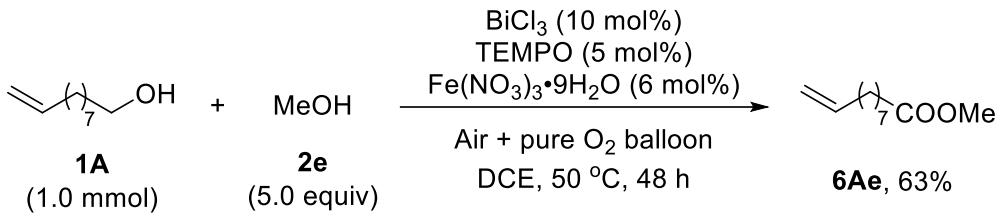

chemical

Organic synthesis reaction scheme showing conversion of compound 1A to 6Ae using MeOH and Fe(NO3)3·9H2O under specified conditions

Following Typical Procedure II, the reaction of 1A (165.1 mg, 95% purity, 1.0 mmol), $\mathrm { F e } ( \mathrm { N O } _ { 3 } ) _ { 3 } { \bullet } 9 \mathrm { H } _ { 2 } \mathrm { O }$ (24.8 mg, 0.06 mmol), TEMPO (8.2 mg, 0.05 mmol), BiCl3 (31.5 mg, 0.1 mmol), and MeOH (202 μL, 5 mmol) in DCE (3 mL) afforded ${ \bf 6 } { \bf A e } ^ { 1 4 }$ (118.6 mg, 63%, 98% purity) [eluent: petroleum ether/ethyl acetate = 60/1 (\~300 mL) to 50/1 (\~250 mL)] as light yellow oil. 1H NMR (400 MHz, CDCl3): δ = 5.87-5.73 (m, 1 H, =CH), 5.03-4.95 (m, 1 H, one proton of =CH2), 4.95-4.88 (m, 1 H, one proton of =CH2), 3.66 (s, 3 H, OCH3), 2.30 (t, J = 7.4 Hz, 2 H, CH2), 2.04 (q, J = 6.9 Hz, 2 H, CH2), 1.67-1.57 (m, 2 H, CH2), 1.42-1.25 (m, 8 H, 4 $\mathbf { x } \ \mathrm { C H } _ { 2 } )$ ; 13C NMR (100 MHz, CDCl3): δ = 174.2, 139.0, 114.1, 51.3, 34.0, 33.7, 29.0, 28.83, 28.76, 24.9; IR (neat, $\mathrm { c m } ^ { - 1 } )$ : v = 3080, 2927, 2855, 1740, 1463, 1436, 1361, 1198, 1169; MS (ESI) m/z: 185 (M+H)+.

# (28) Preparation of methyl undec-10-enoate (6Be, yyb-6-147)

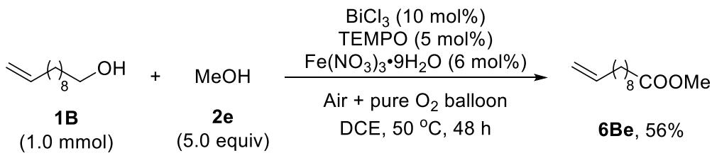

chemical

Organic synthesis reaction scheme showing conversion of compound 1B to 6Be using BiCl3, TEMPO, and Fe(NO3)3·9H2O under specified conditions

Following Typical Procedure IⅠ, the reaction of 1B (171.3 mg, 1.0 mmol), $\mathrm { F e } ( \mathrm { N O } _ { 3 } ) _ { 3 } { \bullet } 9 \mathrm { H } _ { 2 } \mathrm { O }$ (24.4 mg, 0.06 mmol), TEMPO (8.2 mg, 0.05 mmol), BiCl3 (31.3 mg, 0.1 mmol), and MeOH (202 μL, 5 mmol) in DCE (3 mL) afforded ${ \bf 6 8 e ^ { 1 4 } }$ (115.9 mg, 56%, 96% purity) [eluent: petroleum ether/ethyl acetate = 50/1 (\~250 mL)] as yellow oil. 1H NMR (400 MHz, CDCl3): $\delta = 5 . 8 7 - 5 . 7 3$ (m, 1 H, =CH), 5.04-4.95 (m, 1 H, one proton of =CH2), 4.95-4.88 (m, 1 H, one proton of =CH2), 3.66 (s, 3 H, OCH3), 2.30 (t,

J = 7.4 Hz, 2 H, CH2), 2.10-1.97 (m, 2 H, CH2), 1.67-1.57 (m, 2 H, CH2), 1.42-1.20 (m, 10 H, $5 \mathrm { x } \mathrm { C H } _ { 2 } )$ ; 13C NMR (100 MHz, CDCl3): δ = 174.2, 139.1, 114.1, 51.3, 34.0, 33.7, 29.2, 29.1, 29.05, 28.97, 28.8, 24.9; IR (neat, cm-1): v = 3077, 2926, 2855, 1740, 1463, 1436, 1361, 1197, 1170; MS (ESI) m/z: 199 (M+H)+.

# (29) Preparation of methyl hept-6-ynoate (6Ce, yyb-7-074)

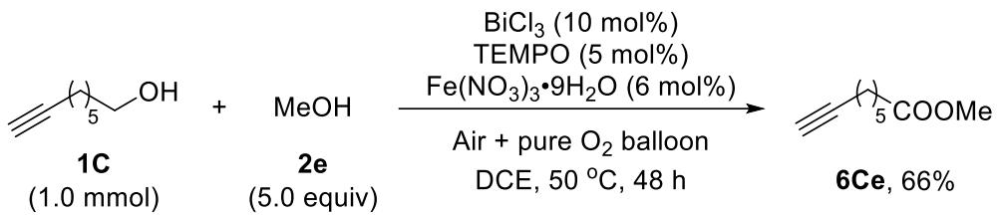

chemical

Organic synthesis reaction scheme showing conversion of compound 1C to 6Ce using MeOH and Fe(NO3)3·9H2O under specified conditions

Following Typical Procedure ⅠI, the reaction of 1C (126.9 mg, 1.0 mmol), $\mathrm { F e } ( \mathrm { N O } _ { 3 } ) _ { 3 } { \bullet } 9 \mathrm { H } _ { 2 } \mathrm { O }$ (24.5 mg, 0.06 mmol), TEMPO (8.2 mg, 0.05 mmol), $\mathrm { B i C l } _ { 3 }$ (31.8 mg, 0.1 mmol), and MeOH (202 μL, 5 mmol) in DCE (3 mL) afforded ${ \bf 6 0 e ^ { 1 5 } }$ (103.9 mg, 66%, 98% purity) [eluent: petroleum ether/ethyl acetate = 30/1 (\~460 mL)] as light yellow oil. 1H NMR (400 MHz, CDCl3): $\delta = 3 . 6 7$ (s, 3 H, OCH3), 2.33 (t, J = 7.6 Hz, 2 H, CH2), 2.20 (td, $J _ { 1 } = 7 . 0$ Hz, $J _ { 2 } = 2 . 7$ Hz, 2 H, CH2), 1.95 (t, J = 2.6 Hz, 1 H, CH), 1.65 (quint, J = 7.5 Hz, 2 H, CH2), 1.60-1.50 (m, 2 H, CH2), 1.48-1.38 (m, 2 H, CH2); $^ { 1 3 } \mathbf { C }$ NMR (100 MHz, CDCl3): δ = 174.0, 84.2, 68.3, 51.4, 33.8, 28.1, 28.0, 24.3, 18.1; IR (neat, cm-1): $\nu = 3 2 9 5$ , 2940, 2863, 2116, 1735, 1460, 1436, 1364, 1202, 1172; MS (ESI) m/z: 155 (M+H)+.

# (30) Preparation of methyl undec-10-ynoate (6De, yyb-6-006)

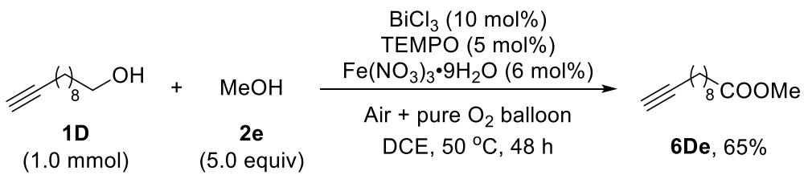

chemical

Organic synthesis reaction scheme showing conversion of compound 1D to 6De using MeOH and COOMe under BiCl3/TEMPO conditions

Following Typical Procedure Ⅰ, the reaction of 1D (167.8 mg, 1.0 mmol), $\mathrm { F e } ( \mathrm { N O } _ { 3 } ) _ { 3 } { \bullet } 9 \mathrm { H } _ { 2 } \mathrm { O }$ (24.8 mg, 0.06 mmol), TEMPO (8.1 mg, 0.05 mmol), BiCl3 (32.1 mg, 0.1 mmol), and MeOH (202 μL, 5 mmol) in DCE (3 mL) afforded ${ \bf 6 0 e } ^ { 1 6 }$ (127.6 mg, 65%) [eluent: petroleum ether/DCM = 10/1 (\~220 mL) to 4/1 (\~250 mL), then 2/1 (\~300 mL)] as light yellow oil. 1H NMR (400 MHz, CDCl3): δ = 3.66 (s, 3 H, OCH3), 2.30 (t, J = 7.4 Hz, 2 H, CH2), 2.17 (t, J = 7.0 Hz, 2 H, CH2), 1.94 (s, 1 H, CH), 1.68- 1.57 (m, 2 H, CH2), 1.52 (quint, J = 7.2 Hz, 2 H, CH2), 1.45-1.24 (m, 8 H, 4 x CH2); $^ { 1 3 } \mathbf { C }$ NMR (100 MHz, CDCl3): δ = 174.1, 84.5, 68.0, 51.3, 33.9, 29.0, 28.9, 28.8, 28.5, 28.3, 24.8, 18.2; IR $\mathrm { ( n e a t , c m ^ { - 1 } ) }$ ): v = 3304, 2933, 2857, 2116, 1737, 1459, 1438, 1361, 1197, 1170; MS (ESI) m/z: 219 (M+Na)+, 197 (M+H)+.

# (31) Preparation of methyl 8-(prop-2-ynoxy)octanoate (6Ee, yyb-7-081)

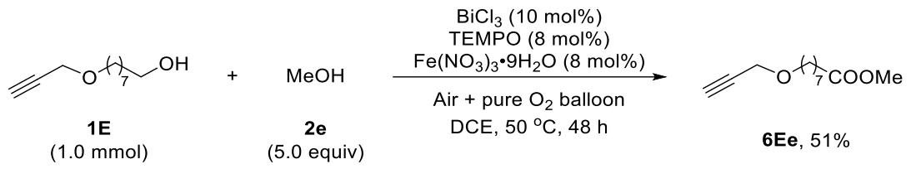

chemical

Organic synthesis reaction scheme showing conversion of aldehyde 1E to ester 6Ee using MeOH and Fe(NO3)3·9H2O under BiCl3/TEMPO conditions

Following Typical Procedure ⅠI, the reaction of 1E (182.7 mg, 1.0 mmol), $\mathrm { F e } ( \mathrm { N O } _ { 3 } ) _ { 3 } { \bullet } 9 \mathrm { H } _ { 2 } \mathrm { O }$ (31.9 mg, 0.08 mmol), TEMPO (12.7 mg, 0.08 mmol), BiCl3 (31.5 mg, 0.1 mmol), and MeOH $( 2 0 2 \mu \mathrm { L }$ , 5 mmol) in DCE (3 mL) afforded 6Ee (108.3 mg, 51%) [eluent: petroleum ether/ ethyl acetate = 15/1 (\~320 mL)] as light yellow oil. 1H NMR (400 MHz, CDCl3): $\delta = 4 . 1 3$ (d, $J = 2 . 4 \ : \mathrm { H z } ,$ 2 H, $\mathrm { O C H } _ { 2 } )$ , 3.66 (s, 3 H, OCH3), 3.50 (t, $J = 6 . 4$ Hz, 2 H, OCH2), 2.43 (t, J = 2.4 Hz, 1 H, CH), 2.30 (t, J = 7.4 Hz, 2 H, CH2), 1.70-1.52 (m, 4 H, 2 x CH2), 1.42-1.26 (m, 6 H, 3 x CH2); 13C NMR (100 MHz, CDCl3): $\delta = 1 7 4 . 1$ , 79.9, 74.0, 70.0, 57.9, 51.3, 33.9, 29.3, 28.92, 28.90, 25.8, 24.7; IR (neat, $\mathrm { c m ^ { - 1 } }$ ): v = 3274, 2932, 2857, 2115, 1735, 1437, 1357, 1249, 1171, 1098; MS (ESI) m/z: 235 $\mathbf { \left( M \mathrm { + } N a \right) ^ { \dagger } }$ +, 213 (M+H)+; HRMS (ESI) calcd m/z for $\mathrm { C _ { 1 2 } H _ { 2 1 } O _ { 3 } }$ [M+H]+: 213.1485, found 213.1484.

# (32) Preparation of methyl 7-methylhept-6-ynoate $( { \bf 6 } { \bf F } { \bf e } ,$ , zhangq-3-158)

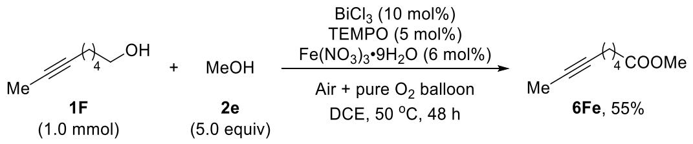

chemical

Chemical reaction scheme showing synthesis of 6Fe from 1F and 2e under BiCl3/TEMPO conditions

Following Typical Procedure Ⅰ, the reaction of 1F (126.0 mg, 1.0 mmo), $\mathrm { F e } ( \mathrm { N O } _ { 3 } ) _ { 3 } { \bullet } 9 \mathrm { H } _ { 2 } \mathrm { O }$ (24.9 mg, 0.06 mmol), TEMPO (7.9 mg, 0.05 mmol), $\mathrm { B i C l } _ { 3 }$ (31.7 mg,

0.1 mmol), and MeOH (202 μL, 5 mmol) in DCE (3 mL) afforded ${ \bf 6 } { \bf F e } ^ { 1 7 }$ (85.3 mg, 55%) [eluent: petroleum ether/DCM = 10/1 (\~440 mL) to 4/1 (\~240 mL), then 2/1 (\~150 mL)] as oil. 1H NMR (400 MHz, CDCl3): δ = 3.67 (s, 3 H, OCH3), 2.33 (t, J = 7.6 Hz, 2 H, CH2), 2.20-2.06 (m, 2 H, CH2), 1.77 (s, 3 H, CH3), 1.75-1.65 (m, 2 H, CH2), 1.55-1.45 (m, 2 H, CH2); 13C NMR (100 MHz, CDCl3): δ = 173.9, 78.5, 75.7, 51.3, 33.5, 28.3, 24.0, 18.3, 3.3; IR (neat, cm-1): v = 2946, 2924, 2220, 1736, 1437, 1358, 1201, 1172, 1152; MS (ESI) m/z: 177 (M+Na)+, 155 (M+H)+.

# (33) Preparation of methyl 7-phenylhept-6-ynoate (6Ge, yyb-7-071)

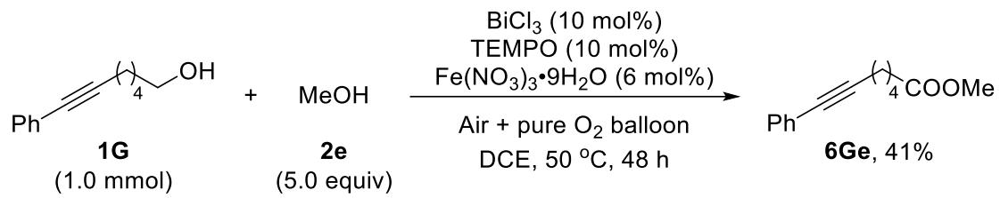

chemical

Organic synthesis reaction scheme showing conversion of compound 1G to 6Ge using MeOH and COOMe under BiCl3/TEMPO conditions

Following Typical Procedure II, the reaction of 1G (189.1 mg, 1.0 mmol), $\mathrm { F e } ( \mathrm { N O } _ { 3 } ) _ { 3 } { \bullet } 9 \mathrm { H } _ { 2 } \mathrm { O }$ (24.8 mg, 0.06 mmol), TEMPO (16.2 mg, 0.1 mmol), BiCl3 (31.5 mg, 0.1 mmol), and MeOH (202 μL, 5 mmol) in DCE (3 mL) afforded ${ \bf 6 6 6 } ^ { 1 8 }$ (90.7 mg, 41%, 98% purity) [eluent: petroleum ether/ethyl acetate = 50/1 (\~510 mL)] as light yellow oil. 1H NMR (400 ${ \mathrm { M H z } } ,$ CDCl3): $\ S = 7 . 4 5 – 7 . 3 5$ (m, 2 H, Ar-H), 7.31-7.22 (m, 3 H, Ar-H), 3.67 (s, 3 H, OCH3), 2.43 (t, J = 7.0 Hz, 2 H, CH2), 2.37 (t, $J = 7 . 4$ Hz, 2 H, CH2), 1.87-1.75 (m, 2 H, CH2), 1.69-1.59 (m, 2 H, $\mathrm { C H } _ { 2 } )$ ; $^ { 1 3 } \mathbf { C }$ NMR (100 MHz, CDCl3): δ = 173.9, 131.5, 128.1, 127.5, 123.8, 89.5, 80.9, 51.5, 33.5, 28.1, 24.1, 19.1; IR (neat, $\mathrm { c m } ^ { - 1 } )$ : v = 2948, 2232, 1735, 1490, 1437, 1359, 1199, 1172, 1146; MS (70 eV, EI) $m / z \left( \% \right)$ : 216 (M+, 28.56), 115 (100).

# (34) Preparation of methyl oct-2-ynoate (6He, yyb-11-173A)

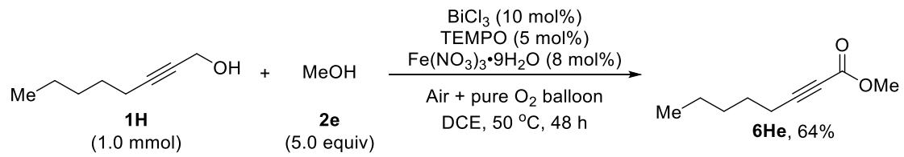

chemical

Organic synthesis reaction scheme showing conversion of compound 1H to 6He using MeOH and Fe(NO3)3·9H2O under BiCl3/TEMPO conditions

Following Typical Procedure ⅠI, the reaction of 1H (127.7 mg, 99% purity, 1.0 mmol), $\mathrm { F e } ( \mathrm { N O } _ { 3 } ) _ { 3 } { \bullet } 9 \mathrm { H } _ { 2 } \mathrm { O }$ (32.6 mg, 0.08 mmol), TEMPO (7.9 mg, 0.05 mmol), BiCl3 (31.3 mg, 0.1 mmol), and MeOH (202 μL, 5 mmol) in DCE (3 mL) afforded ${ \bf 6 { H } e } ^ { 1 9 }$ (99.3 mg, 64%) [eluent: petroleum ether/DCM = 10/1 (\~270 mL) to 5/1 (\~240 mL), then 3/1 (\~200 mL)] as light yellow oil. 1H NMR (400 MHz, CDCl3): δ = 3.76 (s, 3 H, OCH3), 2.33 (t, J = 7.0 Hz, 2 H, CH2), 1.59 (quint, J = 7.2 Hz, 2 H, CH2), 1.44-1.24 (m, 4 H, 2 x CH2), 0.91 (t, J = 7.0 Hz, 3 H, CH3); 13C NMR (100 MHz, CDCl3): $\delta = 1 5 4 . 2$ , 89.8, 72.7, 52.4, 30.8, 27.1, 22.0, 18.5, 13.7; IR (neat, $\mathrm { c m ^ { - 1 } }$ ): $\nu = 2 9 5 6$ , 2863, 2236, 1713, 1458, 1434, 1247, 1075; MS (ESI) m/z: 155 (M+H)+.

# (35) Preparation of methyl 3-phenylbutanoate (6Ie, yyb-12-158)

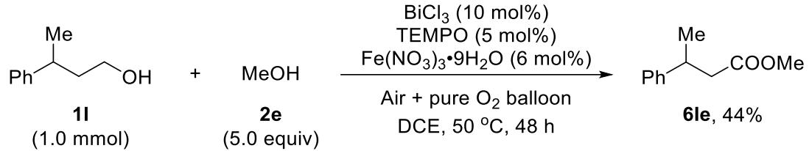

chemical

Organic synthesis reaction scheme showing conversion of compound 1l and 2e to products 6le with yield and conditions

Following Typical Procedure ⅠI, the reaction of 1I (150.0 mg, 1.0 mmol), $\mathrm { F e } ( \mathrm { N O } _ { 3 } ) _ { 3 } { \bullet } 9 \mathrm { H } _ { 2 } \mathrm { O }$ (24.3 mg, 0.06 mmol), TEMPO (7.9 mg, 0.05 mmol), $\mathrm { B i C l } _ { 3 }$ (31.3 mg, 0.1 mmol), and MeOH (202 μL, 5 mmol) in DCE (3 mL) afforded $\mathbf { 6 I e } ^ { 2 0 }$ (77.6 mg, 44%) [eluent: petroleum ether/ethyl acetate = 60/1 (\~300 mL) to 40/1 (\~200 mL)] as light yellow oil. 1H NMR (400 MHz, CDCl3): $\hphantom { - } 8 = 7 . 3 4 \mathrm { - } 7 . 2 6$ (m, 2 H, Ar-H), 7.25-7.15 (m, 3 H, Ar-H), 3.62 (s, 3 H, OCH3), 3.36-3.20 (m, 1 H, CH), 2.63 (dd, J1 = 15.2 Hz, $J _ { 2 } =$ 6.8 Hz, 1 H, one proton of CH2), 2.54 (dd, $J _ { 1 } = 1 5 . 0$ Hz, J2 = 8.2 Hz, 1 H, one proton of CH2), 1.30 (d, J = 6.8 Hz, 3 H, CH3); 13C NMR (100 MHz, CDCl3): δ = 172.8, 145.7, 128.5, 126.7, 126.4, 51.4, 42.7, 36.4, 21.7; IR (neat, $\mathrm { c m } ^ { - 1 } )$ : v = 3029, 2964, 2930, 1735, 1495, 1436, 1378, 1290, 1164, 1085, 1022; MS (ESI) m/z: 179 $\left( \mathrm { M } { + } \mathrm { H } \right) ^ { + }$ + .

# (36) Preparation of methyl 2-methyldecanoate (6Je, yyb-12-157)

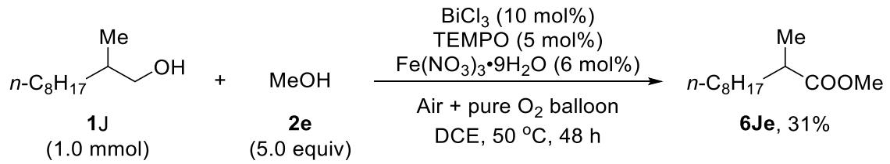

chemical

Chemical reaction scheme showing synthesis of n-C8H17Me and 6Je from precursors 1J and 2e under BiCl3/TEMPO conditions

Following Typical Procedure ⅠI, the reaction of 1J (172.8 mg, 1.0 mmol), $\mathrm { F e } ( \mathrm { N O } _ { 3 } ) _ { 3 } { \bullet } 9 \mathrm { H } _ { 2 } \mathrm { O }$ (24.7 mg, 0.06 mmol), TEMPO (7.9 mg, 0.05 mmol), BiCl3 (31.5 mg, 0.1 mmol), and MeOH (202 μL, 5 mmol) in DCE (3 mL) afforded $\mathbf { 6 J e ^ { 2 1 } }$ (62.3 mg, 31%)

[eluent: petroleum ether/ethyl acetate = 50/1 (\~410 mL)] as light yellow oil. 1H NMR (400 MHz, CDCl3): δ = 3.67 (s, 3 H, OCH3), 2.50-2.37 (m, 1 H, CH), 1.71-1.57 (m, 1 H, one proton of CH2), 1.46-1.35 (m, 1 H, one proton of CH2), 1.35-1.17 (m, 12 H, 6 x CH2), 1.14 (d, J = 6.8 Hz, 3 H, CH3), 0.88 (t, J = 6.6 Hz, 3 H, CH3); 13C NMR (100 MHz, CDCl3): δ = 177.4, 51.4, 39.4, 33.8, 31.8, 29.5, 29.4, 29.2, 27.2, 22.6, 17.0, 14.0; IR (neat, cm-1): v = 2953, 2925, 2855, 1738, 1463, 1434, 1378, 1195, 1164; MS (ESI) m/z: 201 (M+H)+.

# Total synthesis of phlomic acid:

# (1) Preparation of methyl hept-6-ynoate (6Ce, yyb-7-156A)

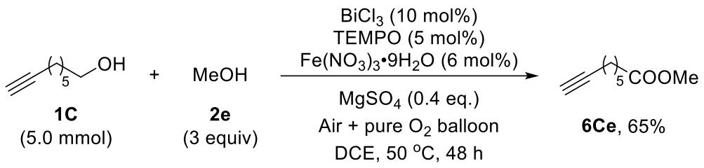

chemical

Organic synthesis reaction scheme showing conversion of compound 1C and 2e to 6Ce using BiCl3, TEMPO, and Fe(NO3)3·9H2O under specified conditions

Following Typical Procedure ⅠI, the reaction of 1C (631.8 mg, 5.0 mmol), $\mathrm { F e } ( \mathrm { N O } _ { 3 } ) _ { 3 } { \bullet } 9 \mathrm { H } _ { 2 } \mathrm { O }$ (121.6 mg, 0.3 mmol), TEMPO (40.0 mg, 0.25 mmol), $\mathrm { B i C l } _ { 3 }$ (157.1 mg, 0.5 mmol), $\mathrm { M g } \mathrm { S O } _ { 4 }$ (249.6 mg, 2.1 mmol), and MeOH (0.6 mL, 15 mmol) in DCE (15 mL) afforded ${ \bf 6 0 e ^ { 1 5 } }$ (516.2 mg, 65%, 97% purity) [eluent: petroleum ether/ethyl acetate = 49/1 (\~600 mL) to 24/1 (\~300 mL)] as light yellow oil. 1H NMR (400 MHz, CDCl3): $\delta = 3 . 6 7$ (s, 3 H, OCH3), 2.33 (t, J = 7.4 Hz, 2 H, CH2), 2.25-2.13 (m, 2 H, CH2), 1.99-1.91 (m, 1 H, CH), 1.65 (quint, J = 7.3 Hz, 2 H, CH2), 1.55 (quint, $J = 7 . 0$ Hz, 2 H, CH2), 1.50-1.38 (m, 2 H, CH2); 13C NMR (100 MHz, CDCl3): δ = 174.0, 84.2, 68.3, 51.4, 33.8, 28.1, 28.0, 24.3, 18.1.

# (2) Preparation of (R)-7,8-Eicosadienoic acid (phlomic acid) $\left( \left( R _ { a } \right) \cdot 1 3 , \right.$ , yyb-7-158, yyb-7-160, yyb-7-163)

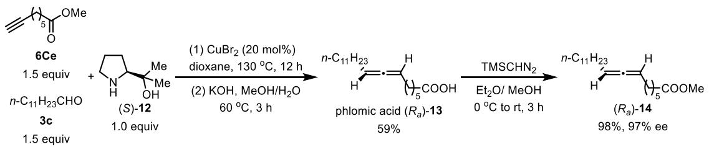

chemical

Organic synthesis reaction scheme showing conversion of compounds 6Ce and 3c to (S)-12, then to (Rₐ)-14 via chiral intermediate and reagents

To an oven dried screw cap reaction tube were added $\operatorname { C u B r } _ { 2 }$ (90.6 mg, 0.4 mmol), (S)-12 (271.6 mg, 95% purity, 2.0 mmol), 6Ce (464.3 mg, 3.0 mmol)/dioxane (3 mL), and 3c (573.4 mg, 97% purity, 3.0 mmol)/dioxane (3 mL) sequentially. The resulting mixture was stirred at $1 3 0 ~ ^ { \mathrm { o } } \mathrm { C }$ for 12 h as monitored by TLC, diluted with 60 mL of ethyl ether, washed with an aqueous solution of HCl (3 M, 40 mL), extracted with ethyl ether (20 mL x 3), washed with brine, and dried over anhydrous ${ \mathrm { N a } } _ { 2 } { \mathrm { S O } } _ { 4 } .$ . After filtration and evaporation, the residue was purified by chromatography on silica gel to afford $( R _ { a } ) – 1 4$ (397.4 mg) [eluent: petroleum ether/ethyl acetate = 99/1 (\~1200 mL)] as light yellow oil.

To a round bottom flask were added KOH (198.3 mg, 3.0 mmol, 85% purity), $( R _ { a } ) \mathrm { ~ }$ - 14 (397.4 mg), and $\mathrm { M e O H / H _ { 2 } O }$ (12 mL, 4:1/v:v) sequentially. The resulting mixture was stirred at $6 0 ~ ^ { \mathrm { { o } } } \mathrm { { C } }$ for 3 h as monitored by TLC. HCl (3 M, 1.2 mL) was added dropwise at $0 ~ ^ { \mathrm { ~ o ~ } } \mathrm { C }$ with an ice-water bath. The resulting mixture was evaporated to remove MeOH, treated with DCM (30 mL) and H2O (25 mL), extracted with DCM (20 mL × 3), washed with brine, and dried over anhydrous $\mathrm { N a } _ { 2 } \mathrm { S O } _ { 4 }$ . After filtration and evaporation, the residue was purified by chromatography on silica gel to afford $( R _ { a } ) \ –$ - $\mathbf { 1 3 ^ { 1 5 } }$ (361.8 mg, 59%) [eluent: petroleum ether/ethyl acetate = 10/1 (\~440 mL) to 4/1 (\~370 mL)] as light yellow solid: m.p. $3 0 . 4 { - } 3 1 . 5 ^ { \mathrm { ~ o } } \mathrm { C }$ (We were not able to recrystallize from the solvents tested, the m.p. of $( R _ { a } ) – 1 3$ was determined by using the solid right after evaporation of the eluent). [α]D27 = -41.3 (c = 0.94, CHCl3) (reported:15 $[ \mathbb { \alpha } ] _ { \mathrm { D } } ^ { 3 0 . 5 } ~ =$ -40.7 (c = 1.03, CHCl3)); 1H NMR (400 MHz, CDCl3) $\delta = 5 . 1 2 - 5 . 0 1$ (m, 2 H, CH=C=CH), 2.35 (t, J = 7.6 Hz, 2 H, CH2), 2.04-1.92 (m, 4 H, 2 x CH2), 1.65 (quint, J $= 7 . 3 \ : \mathrm { H z }$ , 2 H, CH2), 1.48-1.18 (m, 22 H, $1 1 \ \mathrm { x } \ C \mathrm { H } _ { 2 } )$ , 0.88 (t, J = 6.6 Hz, 3 H, CH3); $^ { 1 3 } \mathbf { C }$ NMR (100 MHz, CDCl3): $\delta = 2 0 3 . 9$ , 180.5, 91.1, 90.5, 34.1, 31.9, 29.6, 29.5, 29.4, 29.2, 29.1, 29.0, 28.71, 28.68, 28.5, 24.5, 22.7, 14.1.

The ee of $( R _ { a } ) – 1 3$ was determined by HPLC analysis after being converted to $\left( R _ { a } \right)$ - 14: To the flask containing $( R _ { a } ) – 1 3$ (62.0 mg, 0.2 mmol) was added ethyl ether/MeOH (5.0 mL, 4:1/v:v). TMSCHN2 (0.15 mL, 2.0 M in hexane, 0.3 mmol) was added dropwise at $0 \ : ^ { \mathrm { o } } \mathrm { C }$ . The resulting mixture was warmed up to room temperature and then stirred for 3 h as monitored by TLC. The solvent was removed under reduced pressure and the residue was purified by chromatography on silica gel to afford $( R _ { a } ) \mathbf { - } \mathbf { 1 } \mathbf { 4 } ^ { 1 5 }$ (63.5 mg, 98%, 97% ee) [eluent: petroleum ether/ethyl acetate = 100/1 (\~200 mL) to 20/1 (\~210 mL)] as colorless oil; HPLC conditions: LC column, hexane, 1.5 mL/min, λ = 214 nm, tR (major) = 8.1 min, tR (minor) = 9.8 min; [α]D27 = -39.3 (c = 1.075, CHCl3) (reported:15 $[ \alpha ] _ { \mathrm { D } } ^ { 3 0 . 5 }$ = -39.9 (c = 0.99, CHCl3)); 1H NMR (400 MHz, CDCl3) δ = 5.16- 4.98 (m, 2 H, CH=C=CH), 3.66 (s, 3 H, OCH3), 2.31 (t, J = 7.4 Hz, 2 H, CH2), 2.05- 1.90 (m, 4 H, 2 x CH2), 1.63 (quint, J = 7.5 Hz, 2 H, CH2), 1.48-1.16 (m, 22 H, 11 x CH2), 0.88 (t, J = 6.6 Hz, 3 H, CH3); 13C NMR (100 MHz, CDCl3): δ = 203.8, 174.2, 91.1, 90.5, 51.4, 34.0, 31.9, 29.65, 29.63, 29.62, 29.5, 29.3, 29.2, 29.1, 29.0, 28.73, 28.72, 28.6, 24.8, 22.7, 14.1.

# References:

1. Chen, C.; Hong, S. H., Selective Catalytic sp3 C–O Bond Cleavage with C–N Bond Formation in 3-Alkoxy-1-propanols. Org. Lett. 2012, 14, 2992.   
2. Banerjee, B.; Bhunia, S.; Bhaumik, A., Self-assembled sulfated zirconia nanocrystals with mesoscopic void space synthesized via ionic liquid as a porogen and its catalytic activity for the synthesis of biodiesels. Appl. Catal. A 2015, 502, 380.   
3. Stroek, W.; Keilwerth, M.; Pividori, D. M.; Meyer, K.; Albrecht, M., An Iron–Mesoionic Carbene Complex for Catalytic Intramolecular C–H Amination Utilizing Organic Azides. J. Am. Chem. Soc. 2021, 143, 20157.   
4. Yang, J.; Liu, J.; Ge, Y.; Huang, W.; Schneider, C.; Dühren, R.; Franke, R.; Neumann, H.; Jackstell, R.; Beller, M., A general platinum-catalyzed alkoxycarbonylation of olefins. Chem. Commun. 2020, 56, 5235.   
5. Sun, S.-Z.; Romano, C.; Martin, R., Site-Selective Catalytic Deaminative Alkylation of Unactivated Olefins. J. Am. Chem. Soc. 2019, 141, 16197.   
6. Leow, D.; Chen, Y.-H.; Hung, T.-H.; Su, Y.; Lin, Y.-Z., Photodriven Transfer Hydrogenation of Olefins. Eur. J. Org. Chem. 2014, 7347.   
7. Zheng, Y.; Zhao, Y.; Tao, S.; Li, X.; Cheng, X.; Jiang, G.; Wan, X., Green Esterification of Carboxylic Acids Promoted by tert-Butyl Nitrite. Eur. J. Org. Chem. 2021, 2713.   
8. Porter, N. A.; Ziegler, C. B.; Khouri, F. F.; Roberts, D. H., General synthesis of polyunsaturated fatty acid hydroperoxides involving a novel vinylcyclopropyl bromide ring opening. J. Org. Chem. 1985, 50, 2252.   
9. Nanba, Y.; Shinohara, R.; Morita, M.; Kobayashi, Y., Stereoselective synthesis of 17,18-epoxy derivative of EPA and stereoisomers of isoleukotoxin diol by ring opening of TMS-substituted epoxide with dimsyl sodium. Org. Biomol. Chem. 2017, 15, 8614.   
10. Andersen, C.; Ferey, V.; Daumas, M.; Bernardelli, P.; Guérinot, A.; Cossy, J., Copper-Catalyzed Cross-Coupling between Alkyl (Pseudo)halides and Bicyclopentyl Grignard Reagents. Org. Lett. 2020, 22, 6021.   
11. Yang, J.; Liu, J.; Ge, Y.; Huang, W.; Ferretti, F.; Neumann, H.; Jiao, H.; Franke, R.; Jackstell, R.; Beller, M., Efficient Palladium-Catalyzed Carbonylation of 1,3-Dienes: Selective Synthesis of Adipates and Other Aliphatic Diesters. Angew. Chem. Int. Ed. 2021, 60, 9527.

12. Ji, Y.; Sweeney, J.; Zoglio, J.; Gorin, D. J., Catalytic Methyl Transfer from Dimethylcarbonate to Carboxylic Acids. J. Org. Chem. 2013, 78, 11606.   
13. Poeylaut-Palena, A. A.; Testero, S. A.; Mata, E. G., The non-metathetic role of Grubbs' carbene complexes: from hydrogen-free reduction of α,β-unsaturated alkenes to solid-supported sequential cross-metathesis/reduction. Chem. Commun. 2011, 47, 1565.   
14. Gorecki, L.; Andrys, R.; Schmidt, M.; Kucera, T.; Psotka, M.; Svobodova, B.; Hrabcova, V.; Hepnarova, V.; Bzonek, P.; Jun, D.; Kuca, K.; Korabecny, J.; Musilek, K., Cysteine-Targeted Insecticides against A. gambiae Acetylcholinesterase Are Neither Selective nor Reversible Inhibitors. ACS Med. Chem. Lett. 2020, 11, 65.   
15. Jiang, X.; Zhang, J.; Ma, S., Iron Catalysis for Room-Temperature Aerobic Oxidation of Alcohols to Carboxylic Acids. J. Am. Chem. Soc. 2016, 138, 8344.   
16. Kitamura, T.; Mizuno, S.; Muta, K.; Oyamada, J., Synthesis of β-Fluorovinyliodonium Salts by the Reaction of Alkynes with Hypervalent Iodine/HF Reagents. J. Org. Chem. 2018, 83, 2773.   
17. Song, D.; Blond, G.; Fürstner, A., Study towards bioactive pyrone derivatives from the marine red alga Phacelocarpus labillardieri. Tetrahedron 2003, 59, 6899.   
18. Fan, Q.; Sun, H.; Xie, S.; Dong, Y.; Li, X.; Fuhr, O.; Fenske, D., Nickel-Catalyzed Sonogashira Coupling Reactions of Nonactivated Alkyl Chlorides under Mild Conditions. Organometallics 2021, 40, 2240.   
19. Wuts, P. G. M.; Jung, Y. W., Synthesis of the cannabisativine skeleton via an intramolecular allylsilane-nitrone cycloaddition. J. Org. Chem. 1988, 53, 5989.   
20. Sawano, T.; Ono, M.; Iwasa, A.; Hayase, M.; Funatsuki, J.; Sugiyama, A.; Ishikawa, E.; Yoshikawa, T.; Sakata, K.; Takeuchi, R., Iridium-Catalyzed Branch-Selective Hydroalkylation of Simple Alkenes with Malonic Amides and Malonic Esters. J. Org. Chem. 2023, 88, 1545.   
21. Hirase, K.; Sakaguchi, S.; Ishii, Y., Addition of Carboxyalkyl Radicals to Alkenes through a Catalytic Process, Using a Mn(II)/Co(II)/O2 Redox System. J. Org. Chem. 2003, 68, 5974.

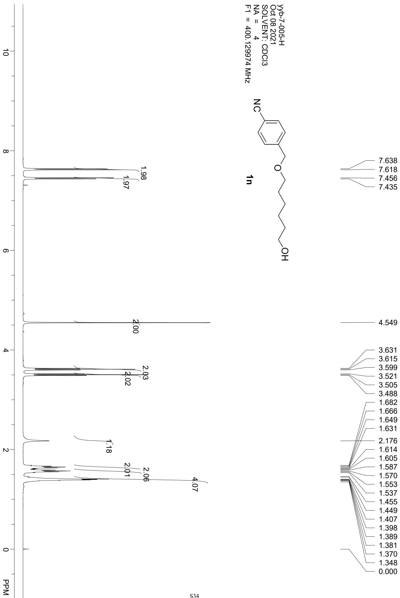

line

| ppm    | Value |
|--------|-------|
| 0.000  | 0.000 |
| 0.1348 | 0.1348 |
| 0.1370 | 0.1370 |
| 0.1381 | 0.1381 |
| 0.1389 | 0.1389 |
| 0.1398 | 0.1398 |
| 0.407  | 0.407 |
| 0.449  | 0.449 |
| 0.455  | 0.455 |
| 0.537  | 0.537 |
| 0.553  | 0.553 |
| 0.570  | 0.570 |
| 0.587  | 0.587 |
| 0.605  | 0.605 |
| 2.176  | 2.176 |
| 1.614  | 1.614 |
| 1.649  | 1.649 |
| 1.666  | 1.666 |
| 1.682  | 1.682 |
| 3.488  | 3.488 |
| 3.505  | 3.505 |
| 3.521  | 3.521 |
| 3.599  | 3.599 |
| 3.615  | 3.615 |
| 3.631  | 3.631 |
| 4.549  | 4.549 |
| 7.456  | -     |
| 7.435  | -     |
| 7.618  | -     |
| 7.638  | -     |
| -      | -     |
| -      | -     |
| -      | -     |
| -      | -     |
| -      | -     |
| -      | -     |
| -      | -     |
| -      | -     |
| -      | -     |
| -      | -     |
| -      | -     |
| -      | -     |
| -      | -     |
| -      | -     |
| -      | +     |
| -      | +     |
| -      | +     |
| -      | +     |
| -      | +     |
| -      | +     |
| -      | +     |
| -      | +     |
| -      | +     |
| -      | +     |
| -      | +     |
| -      | +     |
| -      | +     |
| -      | +     |
| -      | +     |

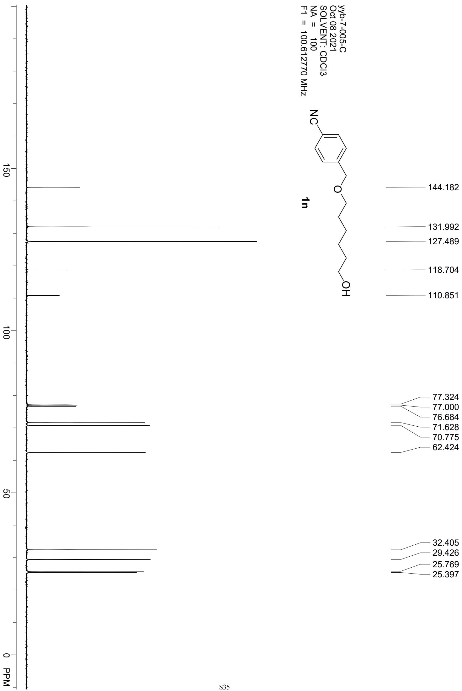

line

| Chemical Shift (ppm) | Integration |
|----------------------|-----------|
| 25.397               | -         |
| 29.426               | -         |
| 32.405               | -         |
| 62.424               | -         |
| 70.775               | -         |
| 71.628               | -         |
| 76.684               | -         |
| 77.000               | -         |
| 77.324               | -         |
| 110.851              | -         |
| 118.704              | -         |
| 127.489              | -         |
| 131.992              | -         |
| 144.182              | -         |

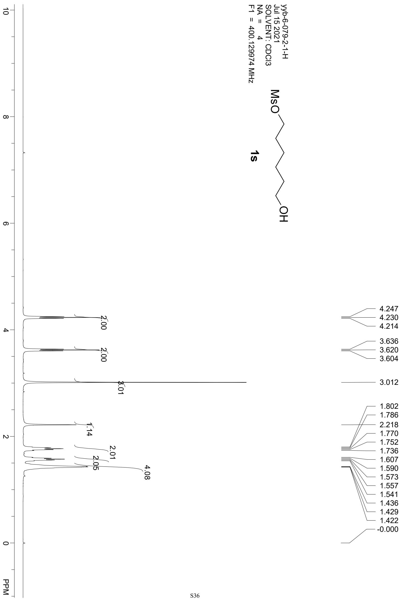

line

| m/z    | Intensity |
| ------ | --------- |
| 2.01   | 4.08      |
| 2.05   | 2.01      |
| 2.08   | 4.08      |
| 3.01   | 3.01      |
| 3.012  | 3.01      |
| 3.604  | 3.604     |
| 3.636  | 3.636     |
| 3.620  | 3.620     |
| 4.214  | 4.214     |
| 4.230  | 4.230     |
| 4.247  | 4.247     |

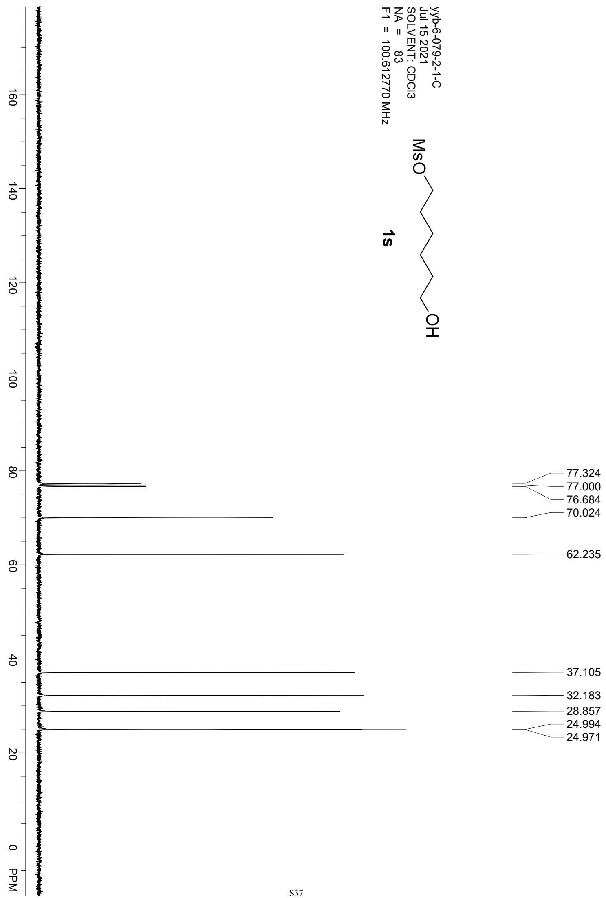

line

| m/z    | Intensity |
| ------ | --------- |
| 24.971 | ~0        |
| 24.994 | ~0        |
| 28.857 | ~0        |
| 32.183 | ~0        |
| 37.105 | ~0        |
| 62.235 | ~0        |
| 70.024 | ~0        |
| 76.684 | ~0        |
| 77.000 | ~0        |
| 77.324 | ~0        |

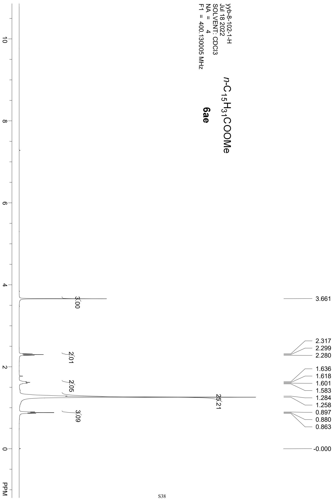

line

| Chemical Shift (ppM) | Integration |
|----------------------|-----------|
| 25.21                | 25.21     |
| 3.00                 | 3.00      |
| 3.09                 | 3.09      |
| 2.01                 | 2.01      |
| 2.05                 | 2.05      |
| 3.00                 | 3.00      |
| 3.661                | 3.661     |

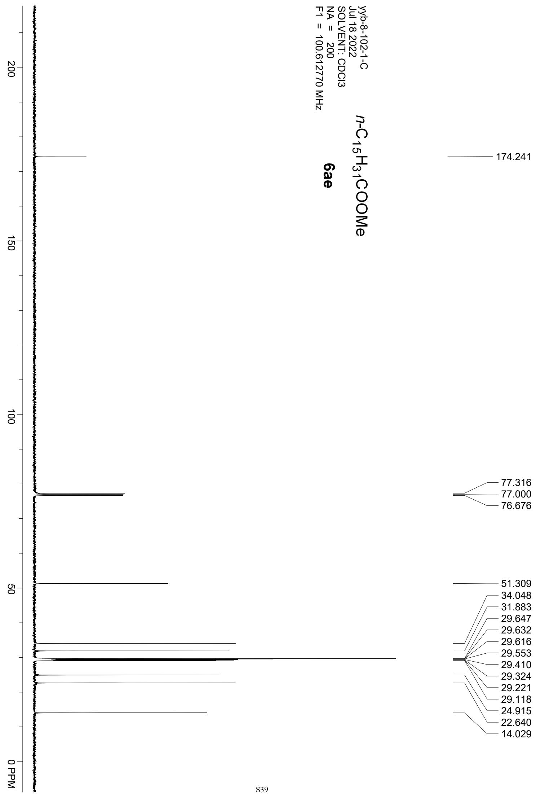

line

| m/z    | Intensity |
| ------ | --------- |
| 14.029 | 0         |
| 22.640 | 0         |
| 24.915 | 0         |
| 29.118 | 0         |
| 29.221 | 0         |
| 29.324 | 0         |
| 29.410 | 0         |
| 29.553 | 0         |
| 29.616 | 0         |
| 29.632 | 0         |
| 29.647 | 0         |
| 31.883 | 0         |
| 34.048 | 0         |
| 51.309 | 0         |
| 76.676 | 0         |
| 77.316 | 0         |
| 174.241| 0         |

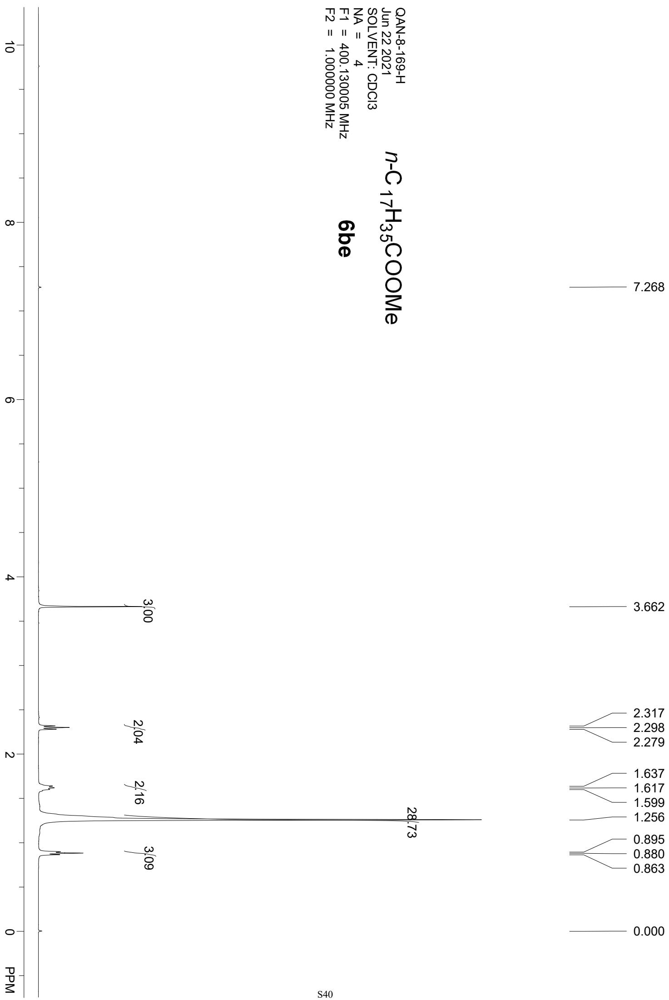

line

| m/z    | Intensity (ppm) |
| ------ | --------------- |
| 28/73  | ~0.000          |
| 3/09   | ~0.000          |
| 3/00   | ~0.000          |
| 2/04   | ~0.000          |
| 2/16   | ~0.000          |
| 2/04   | ~0.000          |
| 3/00   | ~0.000          |
| 3.662  | ~0.000          |
| 7.268  | ~0.000          |

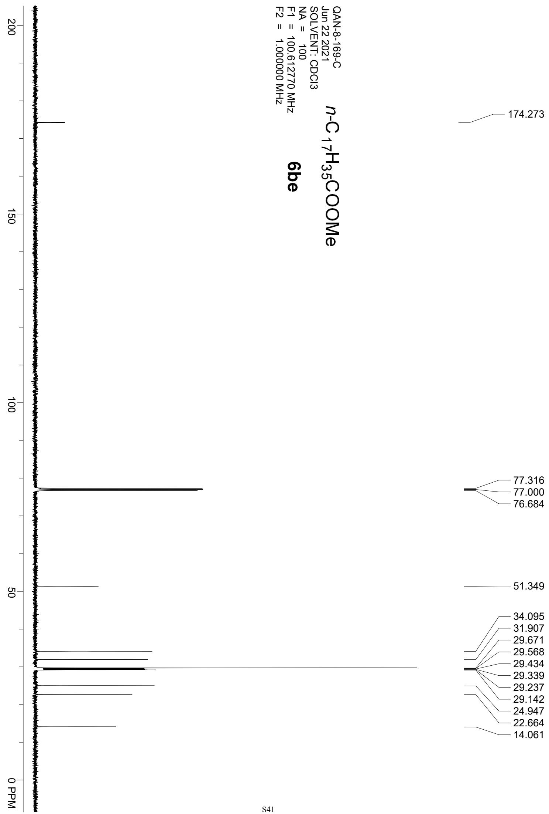

line

| m/z     | Intensity (ppm) |
| ------- | --------------- |
| 14.061  | ~0              |
| 22.664  | ~0              |
| 24.947  | ~0              |
| 29.142  | ~0              |
| 29.237  | ~0              |
| 29.339  | ~0              |
| 29.434  | ~0              |
| 29.568  | ~0              |
| 29.671  | ~0              |
| 31.907  | ~0              |
| 34.095  | ~0              |
| 51.349  | ~0              |
| 76.684  | ~0              |
| 77.316  | ~0              |
| 174.273 | ~0              |

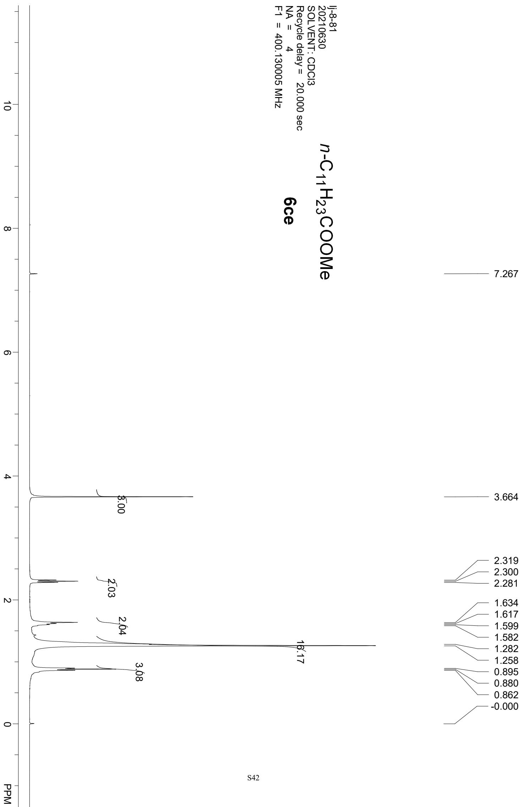

line

| ppm    | Value  |
| ------ | ------ |
| 16.17  |        |
| 3.08   |        |
| 2.04   |        |
| 2.03   |        |
| 3.00   |        |
| 3.664  |        |
| 7.267  |        |

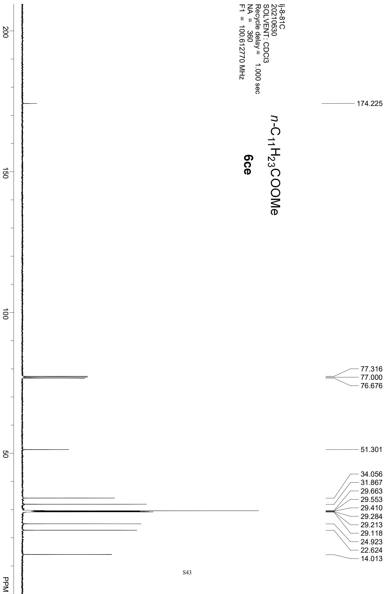

line

| ppm     | Value   |
| ------- | ------- |
| 14.013  | 14.013  |
| 22.624  | 22.624  |
| 24.923  | 24.923  |
| 29.118  | 29.118  |
| 29.213  | 29.213  |
| 29.284  | 29.284  |
| 29.410  | 29.410  |
| 29.553  | 29.553  |
| 29.663  | 29.663  |
| 31.867  | 31.867  |
| 34.056  | 34.056  |
| 51.301  | 51.301  |
| 76.676  | 76.676  |
| 77.000  | 77.000  |
| 77.316  | 77.316  |
| 174.225 | 174.225 |

F1 F1 = 100.612770 MHz   
A = 360   
cycle delay .000 se   
J LVENT: CD   
021063--  
j881

# 6ce

#

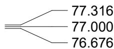

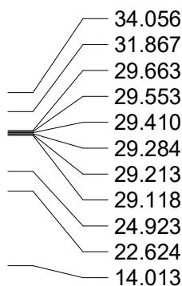

tree

| Node | Value |
|---|---|
| 1 | 34.056 |
| 2 | 31.867 |
| 3 | 29.663 |
| 4 | 29.553 |
| 5 | 29.410 |
| 6 | 29.284 |
| 7 | 29.213 |
| 8 | 29.118 |
| 9 | 24.923 |
| 10 | 22.624 |
| 11 | 14.013 |

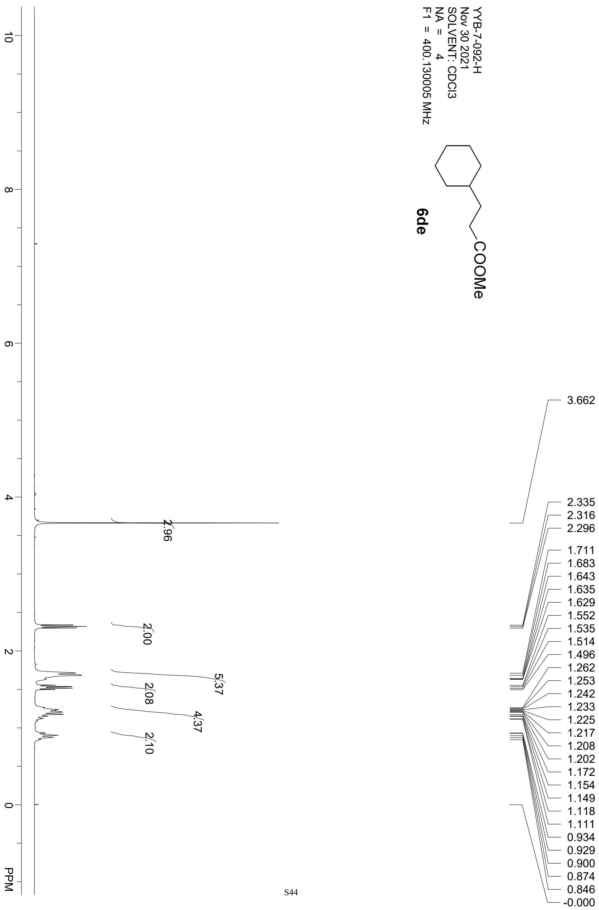

line

| Chemical Shift (ppm) | Integration |
|----------------------|-----------|
| 2.96                 | 2.96      |
| 5.37                 | 5.37      |
| 2.00                 | 2.00      |
| 2.10                 | 2.10      |
| 4.37                 | 4.37      |
| 4.77                 | 4.77      |
| 2.08                 | 2.08      |
| 2.10                 | 2.10      |
| 2.96                 | 2.96      |
| 3.662                | 3.662     |

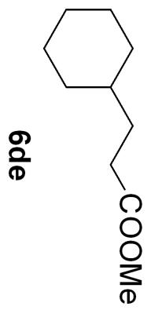

chemical

Chemical structure of a cyclohexene derivative with ester and carboxymethyl substituents

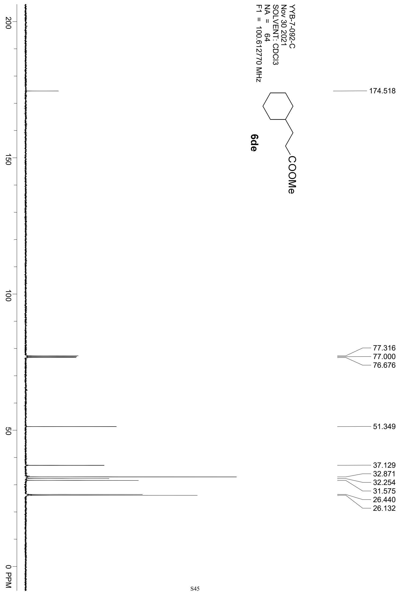

line

| m/z    | Intensity |
| ------ | --------- |
| 26.132 | 0         |
| 26.440 | 0         |
| 31.575 | 0         |
| 32.254 | 0         |
| 32.871 | 0         |
| 37.129 | 0         |
| 51.349 | 0         |
| 76.676 | 0         |
| 77.316 | 0         |
| 174.518| 0         |

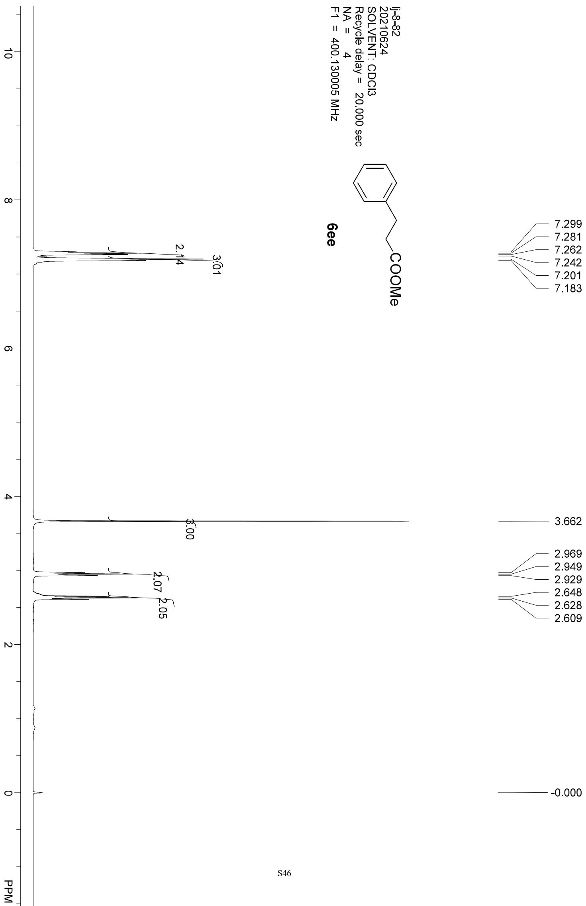

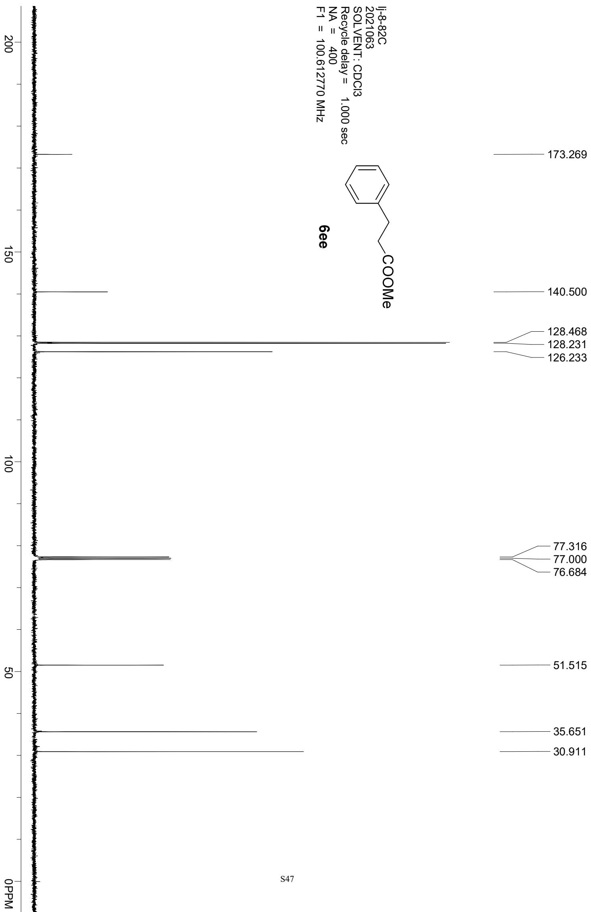

line

| Chemical Shift (δ) | Integration |
| ------------------ | ----------- |
| 30.911             | S47         |
| 35.651             |             |
| 51.515             |             |
| 76.684             |             |
| 77.316             |             |
| 126.233            |             |
| 128.468            |             |
| 128.231            |             |
| 140.500            |             |
| 173.269            |             |

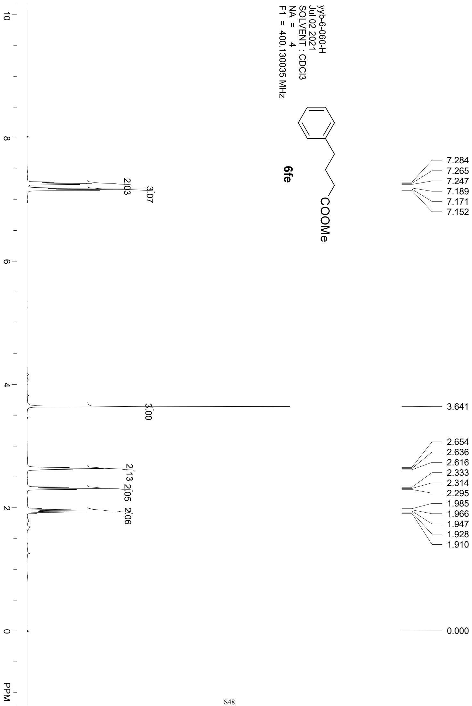

line

| m/z    | Intensity |
| ------ | --------- |
| 3.00   | 2.06      |
| 3.07   | 2.03      |
| 3.641  | 3.00      |
| 1.910  | 0.000     |
| 1.928  | 1.928     |
| 1.947  | 1.947     |
| 1.966  | 1.966     |
| 1.985  | 1.985     |
| 2.295  | 2.295     |
| 2.314  | 2.314     |
| 2.333  | 2.333     |
| 2.616  | 2.616     |
| 2.636  | 2.636     |
| 2.654  | 2.654     |
| 7.152  | 7.152     |
| 7.171  | 7.171     |
| 7.189  | 7.189     |
| 7.247  | 7.247     |
| 7.265  | 7.265     |
| 7.284  | 7.284     |

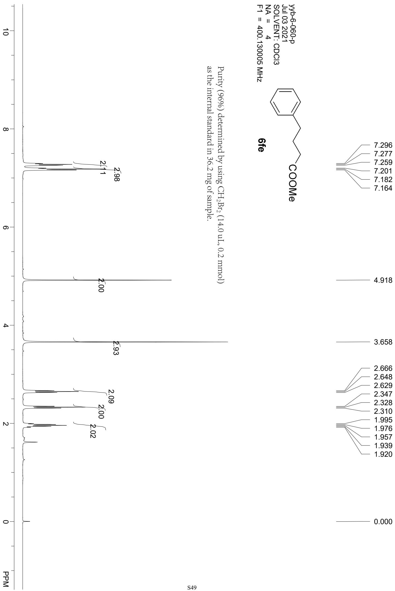

line

| ppm    | Value |
|--------|-------|
| 2.02   | 2.02  |
| 2.00   | 2.00  |
| 2.09   | 2.09  |
| 2.93   | 2.93  |
| 2.98   | 2.98  |
| 3.658  | 3.658 |
| 4.918  | 4.918 |
| 7.164  | 7.164 |
| 7.201  | 7.201 |
| 7.259  | 7.259 |
| 7.277  | 7.277 |
| 7.296  | 7.296 |

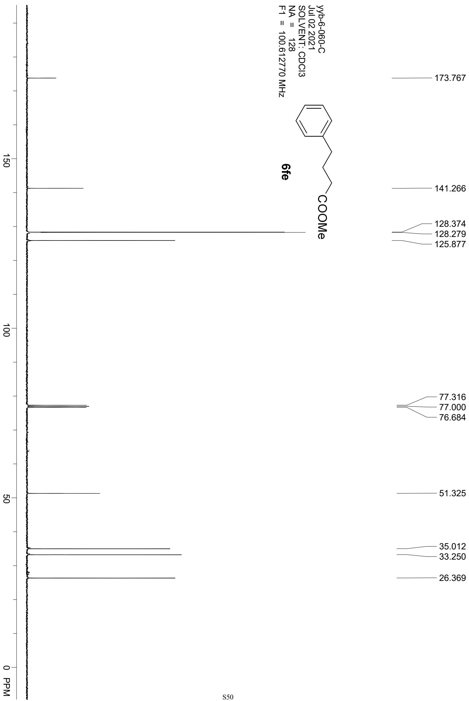

line

| Chemical Shift (ppm) | Integration Value |
|----------------------|-------------------|
| 26.369               |                   |
| 35.012               |                   |
| 33.250               |                   |
| 51.325               |                   |
| 76.684               |                   |
| 77.316               |                   |
| 128.374              |                   |
| 125.877              |                   |
| 128.279              |                   |
| 141.266              |                   |
| 173.767              |                   |

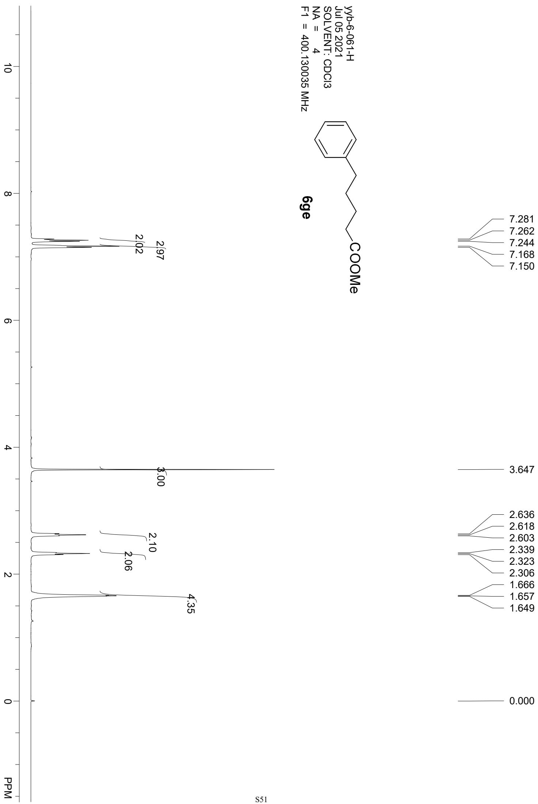

line

| ppm    | Value |
| ------ | ----- |
| 0.000  |       |
| 1.649  |       |
| 1.657  |       |
| 1.666  |       |
| 2.306  |       |
| 2.323  |       |
| 2.339  |       |
| 2.603  |       |
| 2.606  |       |
| 2.618  |       |
| 2.636  |       |
| 3.647  |       |
| 3.00   |       |
| 2.10   |       |
| 2.10   |       |
| 2.10   |       |
| 2.10   |       |
| 2.10   |       |
| 2.10   |       |
| 2.10   |       |
| 2.10   |       |
| 2.10   |       |
| 2.10   |       |
| 2.97   |       |
| 2.02   |       |
| 4.35   |       |
| 3.647  |       |
| 7.150  |       |
| 7.168  |       |
| 7.244  |       |
| 7.262  |       |
| 7.281  |       |
| F1 = 400.130035 MHz
NA = 4
SOLVENT: CDCl3

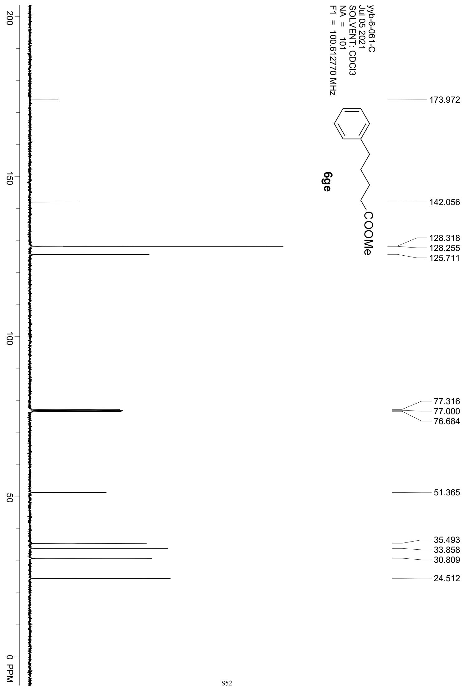

line

| m/z    | Intensity (ppm) |
| ------ | --------------- |
| 24.512 | ~0              |
| 30.809 | ~0              |
| 33.858 | ~0              |
| 35.493 | ~0              |
| 51.365 | ~0              |
| 76.684 | ~0              |
| 77.316 | ~0              |
| 125.711 | ~0              |
| 128.318 | ~0              |
| 128.255 | ~0              |
| 142.056 | ~0              |
| 173.972 | ~0              |

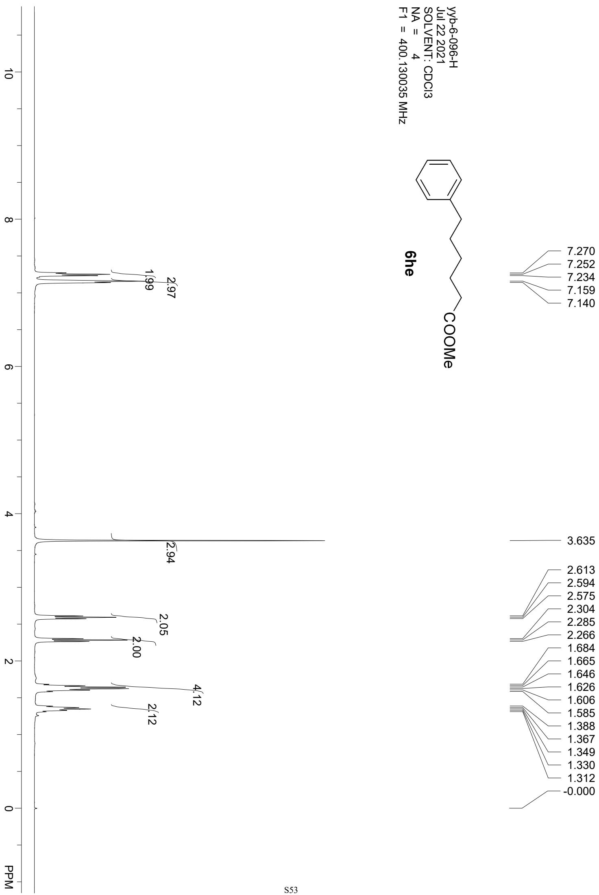

line

| ppm    | Value |
|--------|-------|
| 199    | 2.97  |
| 2.94   | 2.05  |
| 2.05   | 2.00  |
| 2.00   | 1.92  |
| 1.97   | 1.99  |
| 1.92   | 1.99  |
| 1.90   | 1.99  |
| 1.88   | 1.99  |
| 1.86   | 1.99  |
| 1.84   | 1.99  |
| 1.82   | 1.99  |
| 1.80   | 1.99  |
| 1.78   | 1.99  |
| 1.76   | 1.99  |
| 1.74   | 1.99  |
| 1.72   | 1.99  |
| 1.70   | 1.99  |
| 1.68   | 1.99  |
| 1.66   | 1.99  |
| 1.64   | 1.99  |
| 1.62   | 1.99  |
| 1.60   | 1.99  |
| 1.58   | 1.99  |
| 1.56   | 1.99  |
| 1.54   | 1.99  |
| 1.52   | 1.99  |
| 1.50   | 1.99  |
| 1.48   | 1.99  |
| 1.46   | 1.99  |
| 1.44   | 1.99  |
| 1.42   | 1.99  |
| 1.40   | 1.99  |
| 1.38   | 1.99  |
| 1.36   | 1.99  |
| 1.34   | 1.99  |
| 1.32   | 1.99  |
| 1.30   | 1.99  |
| 1.28   | 1.99  |
| 1.26   | 1.99  |
| 1.24   | 1.99  |
| 1.22   | 1.99  |
| 1.20   | 1.99  |
| 1.18   | 1.99  |
| 1.16   | 1.99  |
| 1.14   | 1.99  |
| 1.12   | 1.99  |
| 1.10   | 1.99  |
| 1.08   | 1.99  |
| 1.06   | 1.99  |
| 1.04   | 1.99  |
| 1.02   | 1.99  |
| 1.00   | 1.99  |
| -      | -     |
| -      | -     |
| -      | -     |
| -      | -     |
| -      | -     |
| -      | -     |
| -      | -     |
| -      | -     |
| -      | -     |
| -      | -     |
| -      | -     |
| -      | -     |
| -      | -     |
| -      | -     |
| -      | -     |
|
| -      | -     |
| -      | -     |
| -      | -     |
| -      | -     |
| -      | -     |
| -      | -     |
| -      | -     |
| -      | -     |
| -      | -     |
| -      | -     |
| -      | -     |
| -      | -     |
| -      | -     |
| -      | -     |
| ...    | ...   |
| ...    | ...   |
| ...    | ...   |
| ...    | ...   |
| ...    | ...   |
| ...    | ...   |
| ...    | ...   |
| ...    | ...   |
| ...    | ...   |
| ...    | ...   |
| ...    | ...   |
| ...    | ...   |
| ...    | ...   |
| ...    | ...   |
| ...    | ...   |
|
| ...    | ...   |
|
| ...    | ...   |
|
| ...    | ...   |
|
| ...    | ...   |
|
| ...    | ...   |
|
| ...    | ...   |
|
| ...    | ...   |
|
| ...    | ...   |
|
| ...    | ...   |
|
| ...    | ...   |
|
| ...    | ...   |
|
| ...    | ...   |
|
| ...    +... | ...   |

The structure of the molecule "the" is shown in the image with a chemical formula "yjb-6-0-96-H" and a chemical formula "mol N = H". The structure is annotated with numerical labels such as "mol N", "COOMe", and "N". The structure is also labeled with a chemical formula "F₁ = H₂O, H₃O₃S MHZ". The structure is also annotated with a chemical formula "N_A = H", "mol N = H", and "mol COOMe". The structure is also annotated with a chemical formula "mol COOMe". The structure is also annotated with an additional numerical value "3,635". The structure is also annotated with a chemical formula "7,270". The structure is also annotated with an additional numeric value "7,252". The structure is also annotated with an additional numeric value "7,234". The structure is also annotated with an additional numeric value "7,200". The structure is also annotated with an additional numeric value "7,252". The structure is also annotated with an additional numeric value "7,234". The structure is also annotated with an additional numeric value "7,200". The structure is also annotated with an additional numeric value "7,252". The structure is also annotated with an additional numeric value "7,234". The structure is also annotated with an additional numeric value "7/2" but not explicitly labeled.

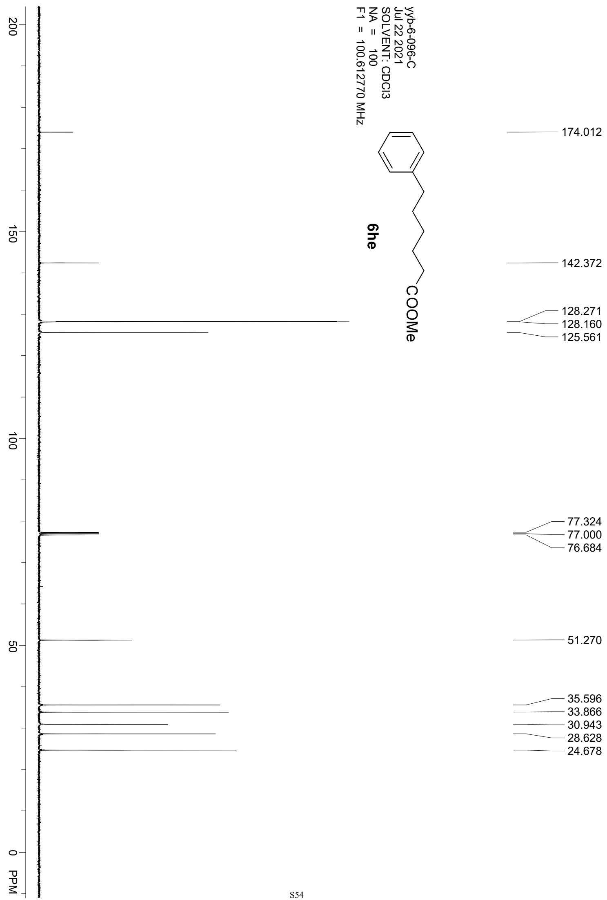

line

| ppm     | Value   |
| ------- | ------- |
| 24.678  | 24.678  |
| 28.628  | 28.628  |
| 30.943  | 30.943  |
| 33.866  | 33.866  |
| 35.596  | 35.596  |
| 51.270  | 51.270  |
| 76.684  | 76.684  |
| 77.324  | 77.324  |
| 125.561 | 125.561 |
| 128.271 | 128.271 |
| 142.372 | 142.372 |
| 174.012 | 174.012 |

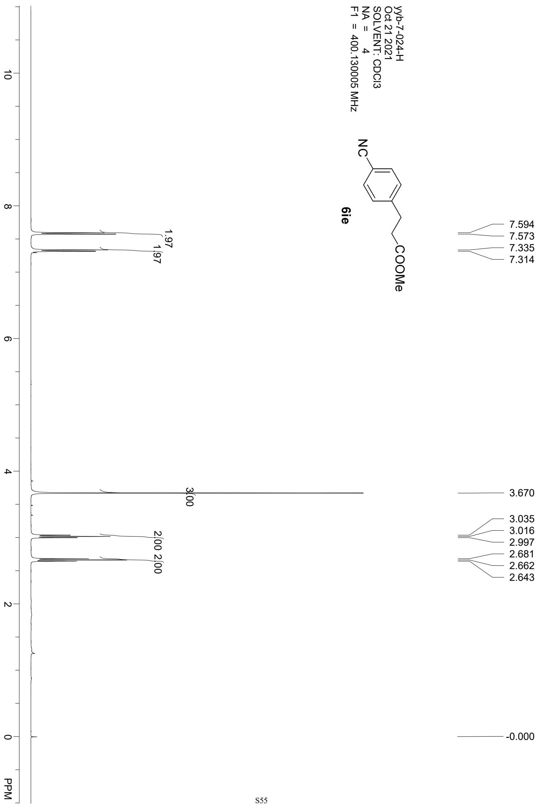

line

ybb-7-024-H
OBT 21 2021
SOLVENT: CDCl3
N/A = 4
CF1 = 400.130005 MHz
N/A = 4
CF1 = 400.130005 MHz
CF1 = 400.130005 MHz
CF1 = 400.130005 MHz
CF1 = 400.130005 MHz
CF1 = 400.130005 MHz
CF1 = 400.130005 MHz
CF1 = 400.130005 MHz
CF1= 4
CF1= 4
CF1= 4
CF1= 4
CF1= 4
CF1= 4
CF1= 4
CF1= 4
CF1= 4
CF1= 4
CF1= 4
CF1= 4
CF1= 4
CF1= 4
CF1= 4
CF1= 4
CF1= 4
CF1 = 4
CF1 = 4
CF1 = 4
CF1 = 4
CF1 = 4
CF1 = 4
CF1 = 4
CF1 = 4
CF1 = 4
CF1 = 4
CF1 = 4
CF1 = 4
CF1 = 4
CF1 = 4
CF1 = 4
CF1 = 4
CF1 = 4
COCOMe
NC
COOMe
2.643
2.662
2.681
2.997
3.016
3.035
3.670
7.314
7.573
7.594

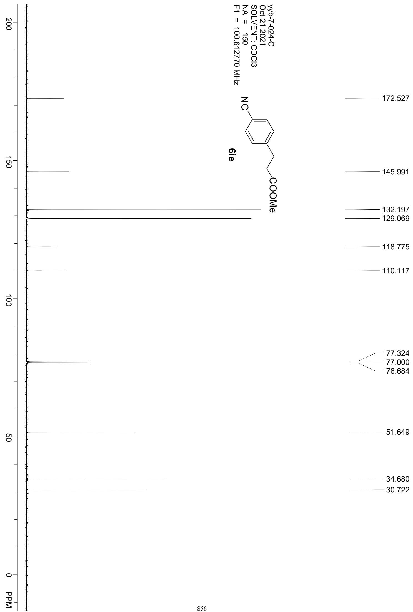

line

| Chemical Shift (δ, ppm) | Integration |
| ------------------------ | ----------- |
| 30.722                   |             |
| 34.680                   |             |
| 51.649                   |             |
| 76.684                   |             |
| 77.000                   |             |
| 77.324                   |             |
| 110.117                  |             |
| 118.775                  |             |
| 129.069                  |             |
| 132.197                  |             |
| 145.991                  |             |
| 172.527                  |             |
| 200                      |             |

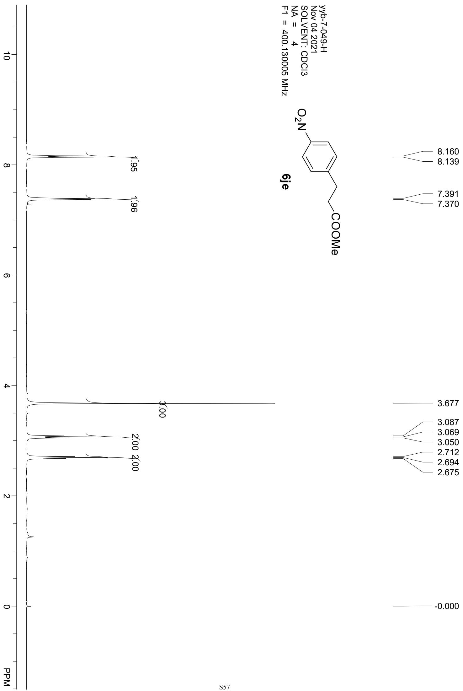

line

| Chemical Shift (δ) | Integration Value |
| ------------------ | ----------------- |
| 0.000              | -                 |
| 2.675              |                   |
| 2.712              |                   |
| 2.694              |                   |
| 2.694              |                   |
| 3.050              |                   |
| 3.069              |                   |
| 3.087              |                   |
| 3.677              |                   |
| 3.000              |                   |
| 2.000              |                   |
| 2.000              |                   |
| 2.712              |                   |
| 2.694              |                   |
| 2.694              |                   |
| 3.050              |                   |
| 3.069              |                   |
| 3.087              |                   |
| 3.677              |                   |
| 3.96               |                   |
| 4                  |                   |
| 4.96               |                   |
| 8                  |                   |
| 10                 |                   |

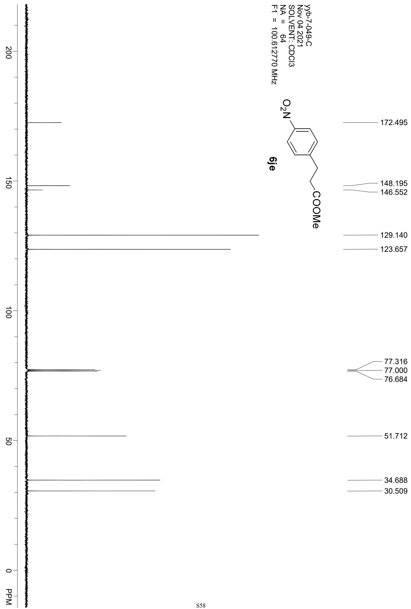

line

| ppm     |
| ------- |
| 30.509  |
| 34.688  |
| 51.712  |
| 76.684  |
| 77.316  |
| 123.657 |
| 129.140 |
| 146.552 |
| 148.195 |
| 172.495 |

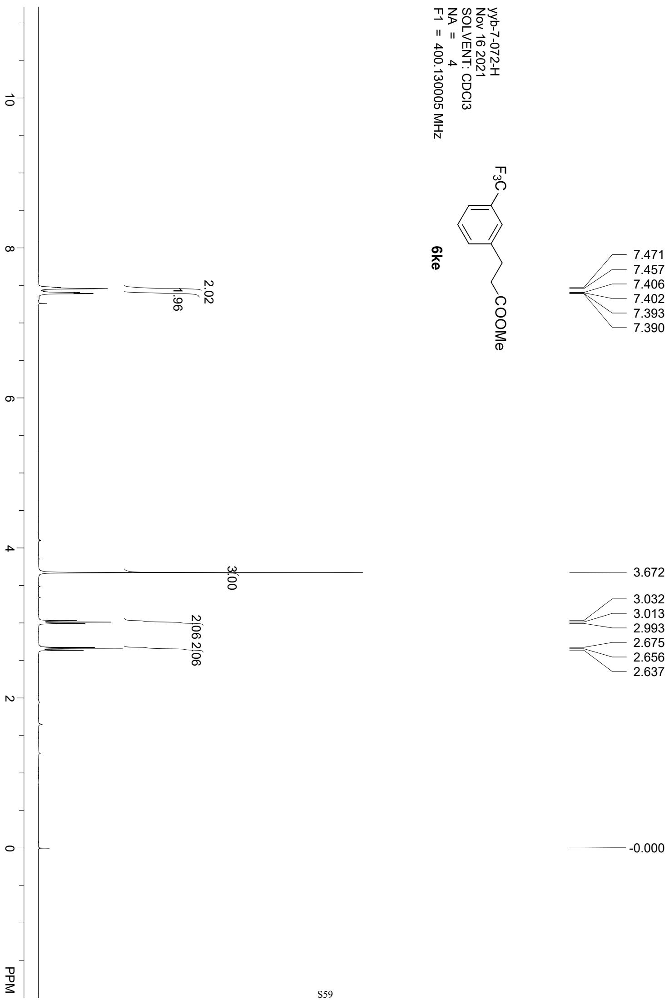

line

yth-7-072-H
Nov 16 2021
SOLVENT: CDCl3
NA = 4
F1 = 400.130005 MHz
SPPM
δ
P
M
S39
δ
P
M
δ
P
M
δ
P
M
δ
P
M
δ
P
M
δ
P
M
δ
P
M
δ
P
M
δ
P
M
δ
P
M
δ
P
M
δ
P
M
δ
P
M
δ
P
M
δ
P
M

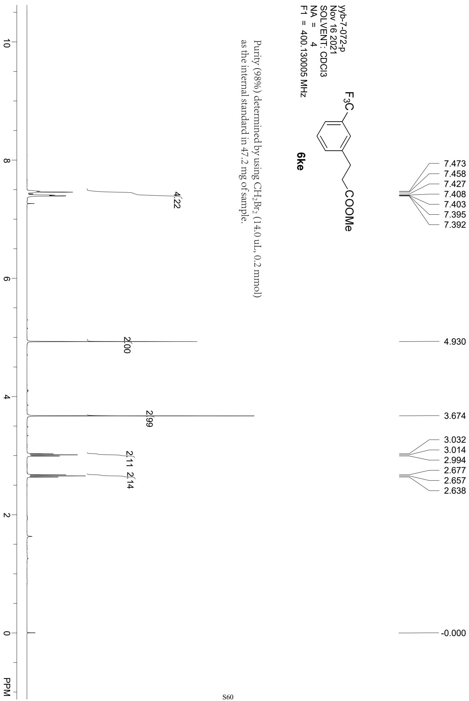

line

| ppm    | Chemical Shift |
| ------ | -------------- |
| 2.000  | -              |
| 2.99   | -              |
| 3.014  | -              |
| 3.674  | -              |
| 4.930  | -              |
| 5.000  | -              |

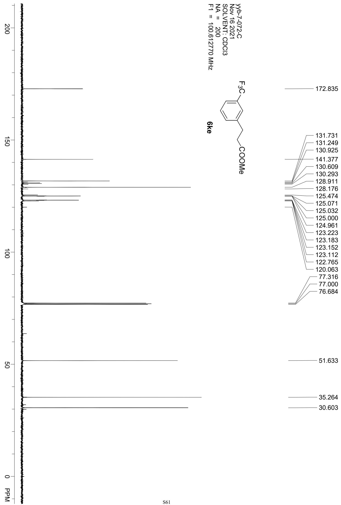

line

| m/z    | Intensity |
| ------ | --------- |
| 30.603 | 1         |
| 35.264 | 1         |
| 51.633 | 1         |
| 76.684 | 1         |
| 77.316 | 1         |
| 120.063| 1         |
| 122.765| 1         |
| 123.112| 1         |
| 123.152| 1         |
| 123.183| 1         |
| 123.223| 1         |
| 124.961| 1         |
| 125.000| 1         |
| 125.032| 1         |
| 125.071| 1         |
| 125.474| 1         |
| 128.176| 1         |
| 128.911| 1         |
| 130.293| 1         |
| 130.609| 1         |
| 141.377| 1         |
| 130.925| 1         |
| 131.731| 1         |
| 131.249| 1         |
| 172.835| 1         |

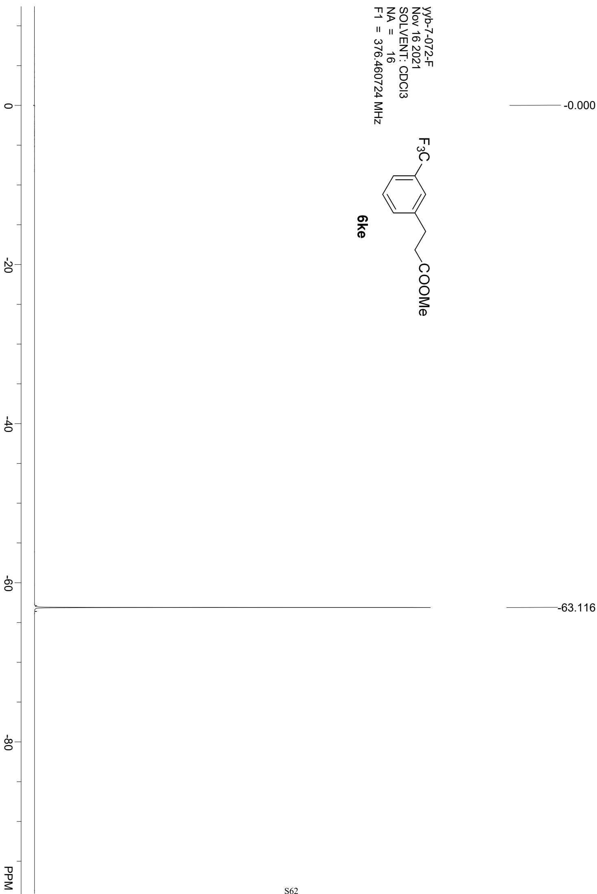

chemical

NMR spectrum of F3C-C6H4 with molecular formula and chemical structure labeled

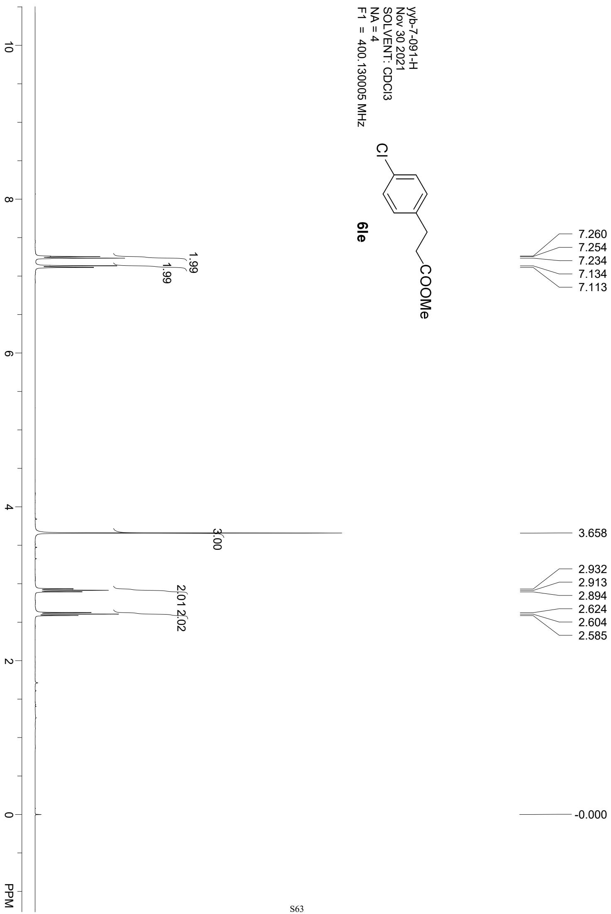

line

| Chemical Shift (ppm) | Integration |
|----------------------|-----------|
| 1.99                 | 1.99      |
| 3.00                 | 3.00      |
| 2.01                 | 2.02      |
| 2.02                 | 2.02      |
| 2.604                | 2.604     |
| 2.894                | 2.894     |
| 2.913                | 2.913     |
| 2.585                | 2.585     |
| 3.658                | 3.658     |
| 7.113                | 7.113     |
| 7.134                | 7.134     |
| 7.254                | 7.254     |
| 7.260                | 7.260     |

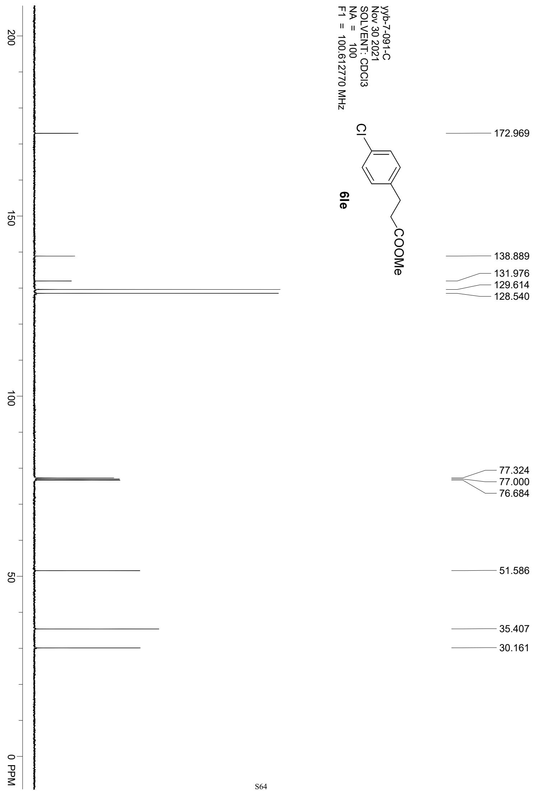

line

| Chemical Shift (ppm) | Integration |
|----------------------|-----------|
| 30.161               | S64       |
| 35.407               |           |
| 51.586               |           |
| 76.684               |           |
| 77.324               |           |
| 128.540              |           |
| 129.614              |           |
| 131.976              |           |
| 138.889              |           |
| 172.969              |           |

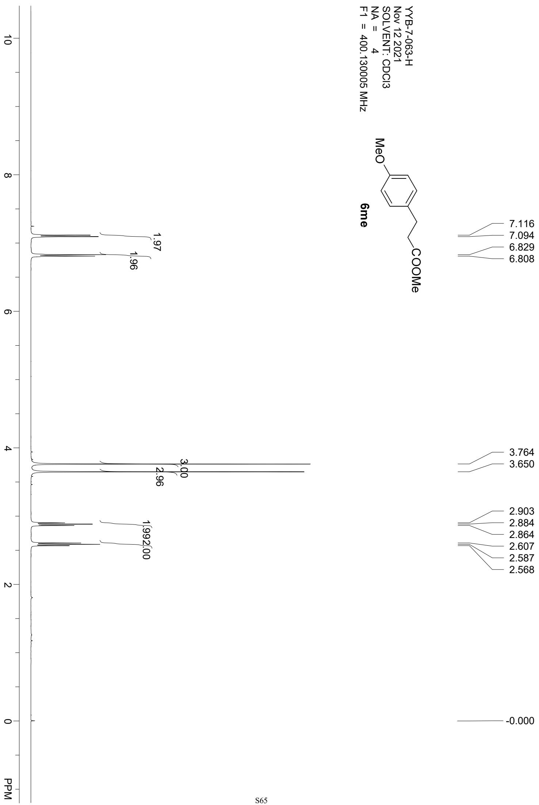

line

| m/z    | Chemical Shift (ppm) |
| ------ | -------------------- |
| 1.992  | 0                    |
| 2.96   | 0                    |
| 3.00   | 0                    |
| 1.97   | 0                    |
| 1.96   | 0                    |
| 2.587  | -0.000               |
| 2.607  | -0.000               |
| 2.864  | -0.000               |
| 2.903  | -0.000               |
| 3.650  | -0.000               |
| 3.764  | -0.000               |
| 6.808  | -0.000               |
| 6.829  | -0.000               |
| 7.094  | -0.000               |
| 7.116  | -0.000               |

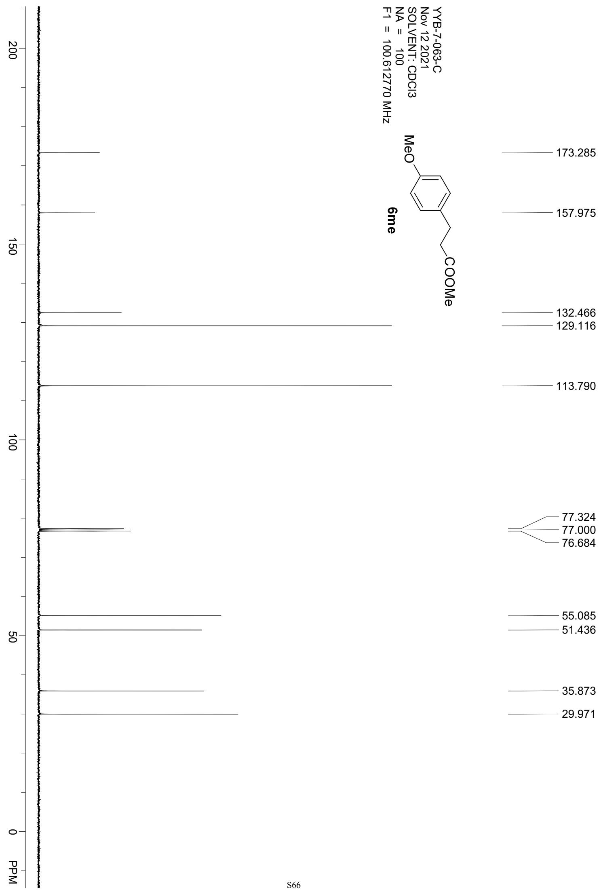

line

| m/z    | Intensity |
| ------ | --------- |
| 29.971 | 0         |
| 35.873 | 0         |
| 51.436 | 0         |
| 55.085 | 0         |
| 76.684 | 0         |
| 77.324 | 0         |
| 113.790| 0         |
| 129.116| 0         |
| 132.466| 0         |
| 157.975| 0         |
| 173.285| 0         |

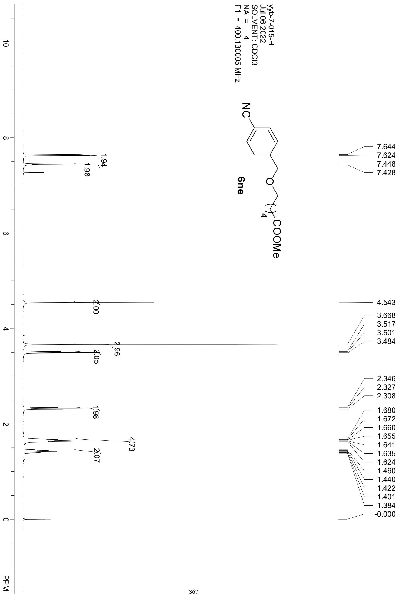

line

Chemical Structure
| Chemical Shift (ppm) | Integration Value |
|----------------------|------------------|
| 0                    | -                |
| 1                    | 0.000            |
| 2                    | 0.000            |
| 3                    | 0.000            |
| 4                    | 0.000            |
| 5                    | 0.000            |
| 6                    | 0.000            |
| 7                    | 0.000            |
| 8                    | 0.000            |
| 9                    | 0.000            |
| 10                   | 0.000            |
| Peak Label           | Value           |
| Peak Label           | (labeled as "one") |
| Approximate Peak     | 98               |
| Approximate Peak     | (labeled as "COOMe") |
| Approximate Peak     | (labeled as "NC")   |
| Approximate Peak     | (labeled as "NCA")   |
| Approximate Peak     | (labeled as "SOLVENT: CDCl3") |
| Approximate Peak     | (labeled as "JNJ 06 2022", "Yb-7-015-H", "NA = 4") |

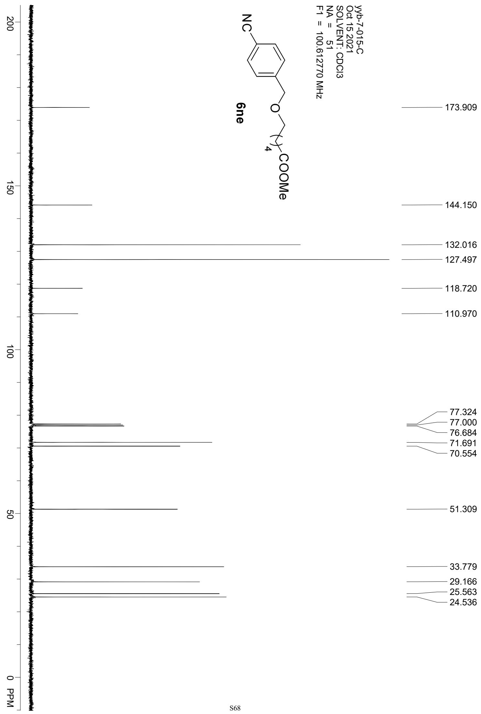

line

| Chemical Shift (ppm) | Integration |
|----------------------|-----------|
| 24.536               | 24.536    |
| 25.563               | 25.563    |
| 29.166               | 29.166    |
| 33.779               | 33.779    |
| 51.309               | 51.309    |
| 70.554               | 70.554    |
| 71.691               | 71.691    |
| 76.684               | 76.684    |
| 77.000               | 77.000    |
| 77.324               | 77.324    |
| 110.970              | 110.970   |
| 118.720              | 118.720   |
| 127.497              | 127.497   |
| 132.016              | 132.016   |
| 144.150              | 144.150   |
| 173.909              | 173.909   |

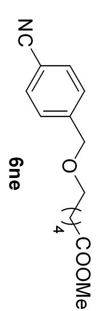

chemical

Chemical structure of a methoxyphenyl ether derivative with cyano and ester functional groups

b-7-015- ct 15 202 LVENT: CD A = 5 = 100.612770

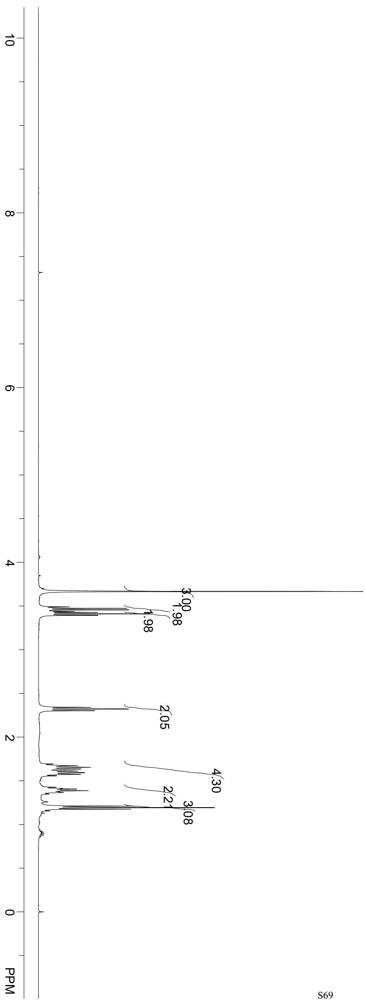

line

| Peak Label | Value |
| ---------- | ----- |
| 3.00       | 3.00  |
| 1.98       | 1.98  |
| 2.05       | 2.05  |
| 2.27       | 2.27  |
| 3.08       | 3.08  |
| 4.30       | 4.30  |

= 400.129974   
A = 4   
LVENT: CD   
ep 10 20   
yb-6-155-

6oe   
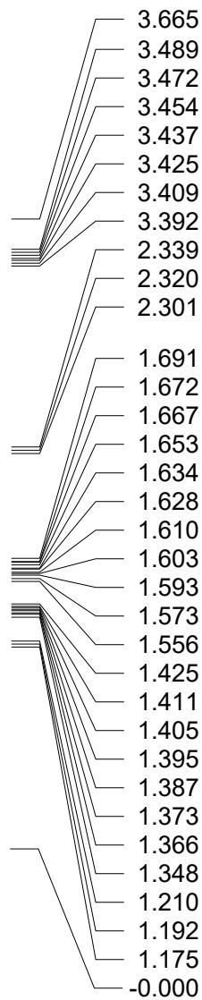

line

| X Value | Y Value |
|---------|---------|
| -0.000  | 1.175   |
| 1.175   | 1.210   |
| 1.192   | 1.348   |
| 1.210   | 1.366   |
| 1.348   | 1.373   |
| 1.373   | 1.387   |
| 1.395   | 1.405   |
| 1.411   | 1.425   |
| 1.425   | 1.556   |
| 1.573   | 1.593   |
| 1.603   | 1.603   |
| 1.610   | 1.628   |
| 1.634   | 1.634   |
| 1.653   | 1.667   |
| 1.672   | 1.691   |
| 2.301   | 2.320   |
| 2.339   | 2.339   |
| 3.392   | 3.409   |
| 3.409   | 3.425   |
| 3.437   | 3.437   |
| 3.454   | 3.472   |
| 3.489   | 3.489   |
| 3.665   | 3.665   |

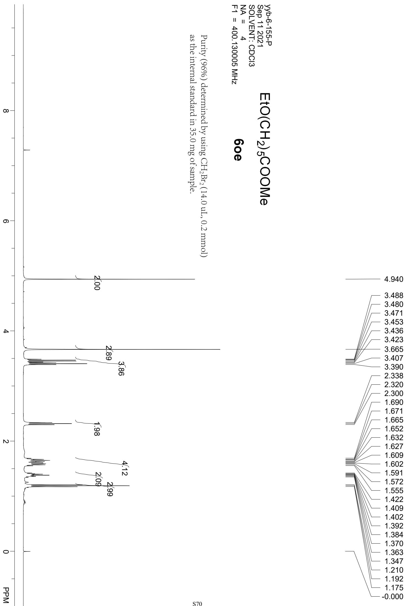

line

| ppm    | Value |
| ------ | ----- |
| 2.00   | 2.00  |
| 3.86   | 3.86  |
| 4.12   | 4.12  |
| 4.99   | 4.99  |
| 5.86   | 5.86  |
| 6.98   | 6.98  |
| 7.00   | 7.00  |
| 4.940  | 4.940 |

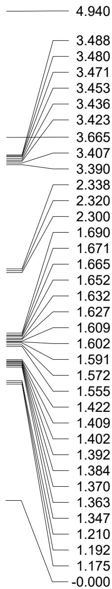

line

| X Value | Series 1 | Series 2 | Series 3 |
|---------|----------|----------|----------|
| -0.000  | 1.175    | 1.210    | 1.347    |
| 1.175   | 1.192    | 1.363    | 1.370    |
| 1.210   | 1.384    | 1.392    | 1.402    |
| 1.347   | 1.409    | 1.422    | 1.555    |
| 1.572   | 1.572    | 1.591    | 1.602    |
| 1.609   | 1.627    | 1.632    | 1.652    |
| 1.690   | 1.671    | 1.690    | 2.300    |
| 2.320   | 2.338    | 2.338    | 3.390    |
| 3.407   | 3.407    | 3.665    | 3.423    |
| 3.488   | 3.488    | 3.480    | 3.471    |
| 4.940   |          |          |          |

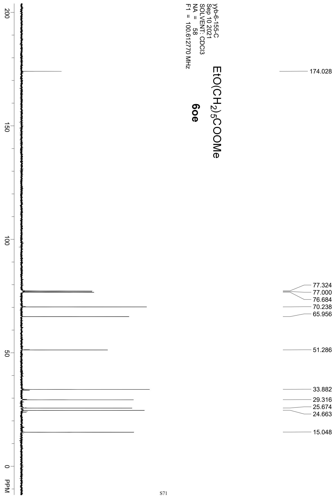

line

| ppm     | Value   |
| ------- | ------- |
| 15.048  |         |
| 24.663  |         |
| 25.674  |         |
| 33.882  |         |
| 51.286  |         |
| 65.956  |         |
| 70.238  |         |
| 76.684  |         |
| 77.000  |         |
| 77.324  |         |
| 174.028 |         |

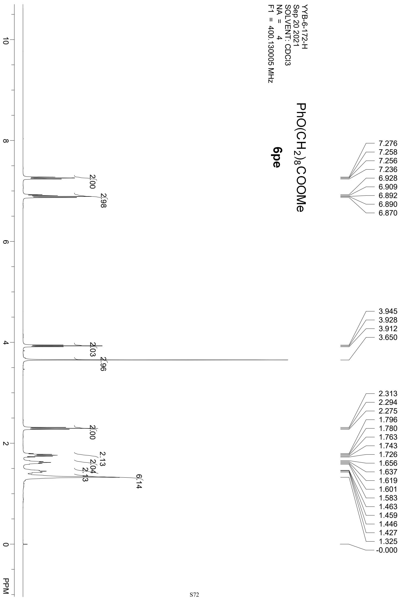

line

| ppm    | Value  |
| ------ | ------ |
| 0      | 0      |
| 2      | 2.96   |
| 4      | 2.03   |
| 6      | 2.13   |
| 8      | 6.14   |
| 10     | 2.98   |
| 12     | 2.00   |
| 14     | 6.870  |
| 16     | 3.945  |
| 18     | 3.650  |
| 20     | 2.275  |
| 22     | 1.796  |
| 24     | 1.763  |
| 26     | 1.743  |
| 28     | 1.726  |
| 30     | 1.656  |
| 32     | 1.637  |
| 34     | 1.619  |
| 36     | 1.583  |
| 38     | 1.463  |
| 40     | 1.459  |
| 42     | 1.427  |
| 44     | -0.000 |
| 46     | -0.000 |
| 48     | -0.000 |
| 50     | -0.000 |
| 52     | -0.000 |
| 54     | -0.000 |
| 56     | -0.000 |
| 58     | -0.000 |
| 60     | -0.000 |
| 62     | -0.000 |
| 64     | -0.000 |
| 66     | -0.000 |
| 68     | -0.000 |
| 70     | -0.000 |
| 72     | -0.000 |
| 74     | -0.000 |
| 76     | -0.000 |
| 78     | -0.000 |
| 80     | -0.000 |
| 82     | -0.000 |
| 84     | -0.000 |
| 86     | -0.000 |
| 88     | -0.000 |
| 90     | -0.000 |
| 92     | -0.000 |
| 94     | -0.000 |
| 96     | -0.000 |
| 98     | -0.000 |
| 100    | -0.000 |
| 102    | -0.000 |
| 104    | -0.000 |
| 106    | -0.000 |
| 108    | -0.000 |
| 110    | -0.000 |
| 112    | -0.000 |
| 114    | -0.000 |
| 116    | -0.000 |
| 118    | -0.000 |
| 120    | -0.000 |
| 122    | -0.000 |
| 124    | -0.000 |
| 126    | -0.000 |
| 128    | -0.000 |
| 130    | -0.000 |
| 132    | -0.000 |
| 134    | -0.000 |
| 136    | -0.000 |
| 138    | -0.000 |
| 140    | -0.000 |
| 142    | -0.000 |
| 144    | -0.000 |
| 146    | -0.000 |
| 148    | -0.000 |
| 150    | -0.000 |
| 152    | -0.000 |
| 154    | -0.000 |
| 156    | -0.000 |
| 158    | -0.000 |
| 160    | -0.313 |
| 162    | -3.945 |
| 164    | -3.912 |
| 166    | -3.659 |
| 168    | -3.994 |
| 170    | -3.999 |
| 172    | -3.998 |
| 174    | -3.998 |
| 176    | -3.998 |
| 178    | -3.998 |
| 180    | -3.998 |
| 182    | -3.998 |
| 184    | -3.998 |
| 186    | -3.998 |
| 188    | -3.998 |
| 190    | -3.998 |
| 192    | -3.998 |
| 194    | -3.998 |
| 196    | -3.998 |
| 198    | -3.998 |
| 200    | -3.998 |
| 2O2    | -3.998 |
| 2O4    | -3.998 |
| 2O6    | -3.998 |
| 2O8    | -3.998 |
| 2O1    | -3.998 |
| O      | +4       |

Phy(CH₂)₆COOMe
YVB-6-172-H
SOPENT: CDCl3
N/A = NA
F₁ = 4₀₀,₁₃₀₀₀₅ MHz

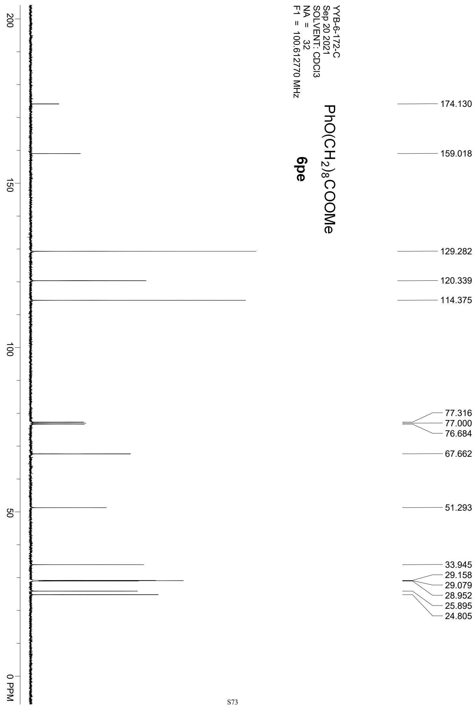

line

| Chemical Shift (ppm) | Integration |
|----------------------|-----------|
| 24.805               | -         |
| 25.895               | -         |
| 28.952               | -         |
| 29.079               | -         |
| 29.158               | -         |
| 33.945               | -         |
| 51.293               | -         |
| 67.662               | -         |
| 76.684               | -         |
| 77.316               | -         |
| 114.375              | -         |
| 120.339              | -         |
| 129.282              | -         |
| 159.018              | -         |
| 174.130              | -         |

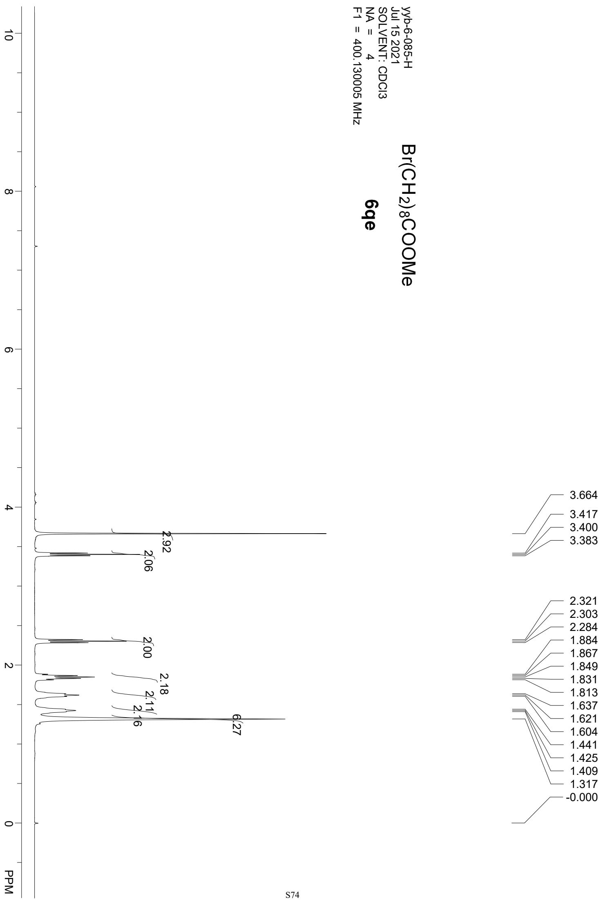

line

| δ (ppm) | Value |
| ------- | ----- |
| 6.27    |       |
| 2.92    |       |
| 2.06    |       |
| 2.18    |       |
| 2.00    |       |
| 2.06    |       |
| 2.11    |       |
| 2.00    |       |
| 2.06    |       |
| 2.18    |       |
| 2.00    |       |
| 2.06    |       |
| 2.11    |       |
| 2.00    |       |
| 2.06    |       |
| 2.18    |       |
| 2.00    |       |
| 2.00    |       |
| 2.06    |       |
| 2.18    |       |
| 2.00    |       |
| 2.06    |       |
| 2.11    |       |
| 2.00    |       |
| 2.06    |       |
| 2.18    |       |
| 2.06    |       |
| 2.11    |       |
| 2.00    |       |
| 2.06    |       |
| 2.18    |       |
| 2.06    |       |
| 2.11    |       |
| 2.00    |       |
| 2.06    |       |
| 2.11    |       |
| 2.00    |       |
| 2.06    |       |
| 2.18    |       |
| 2.06    |       |
| 2.11    |       |
| 2.00    |       |
| 2.00    |       |
| 2.06    |       |
| 2.18    |       |
| 2.06    |       |
| 2.11    |       |
| 2.00    |       |
| 2.06    |       |
| 2.18    |       |
| 2.06    |       |
| 2.19    |       |
| 2.321   |       |
| -0.000  |       |
| -1.317  |       |
| -1.409  |       |
| -1.425  |       |
| -1.441  |       |
| -1.604  |       |
| -1.637  |       |
| -1.813  |       |
| -1.831  |       |
| -1.849  |       |
| -1.867  |       |
| -1.884  |       |
| -2.303  |       |
| -3.383  |       |
| -3.400  |       |
| -3.664  |       |
f1 = 400.130005 MHz; NA = 4; Solvent: CDCl3; Jull 15 2021; ybb-6-085-H

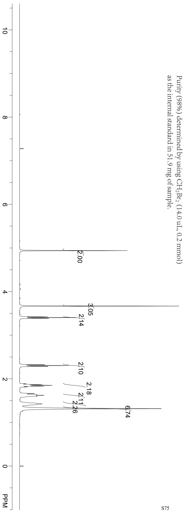

line

| ppm    | Value  |
| ------ | ------ |
| 6.74   |        |
| 2.18   |        |
| 2.10   |        |
| 2.14   |        |
| 3.05   |        |
| 2.00   |        |

Purity (98%) determined by using CH2Br2 as the internal standard in 51.9 mg of sample.   
yb-6-085 ul 16 202 LVENT: CD NA = 4 = 400.130005

6qe   
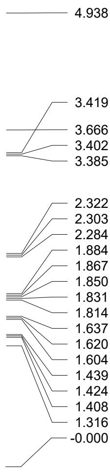

line

| X Value | Y Value |
|---------|---------|
| -0.000  | 1.316   |
| 1.316   | 1.408   |
| 1.408   | 1.424   |
| 1.424   | 1.439   |
| 1.604   | 1.620   |
| 1.637   | 1.637   |
| 1.814   | 1.831   |
| 1.850   | 1.867   |
| 1.884   | 1.884   |
| 2.284   | 2.303   |
| 2.322   | 2.322   |
| 3.385   | 3.666   |
| 3.402   | 3.419   |
| 3.666   | 4.938   |

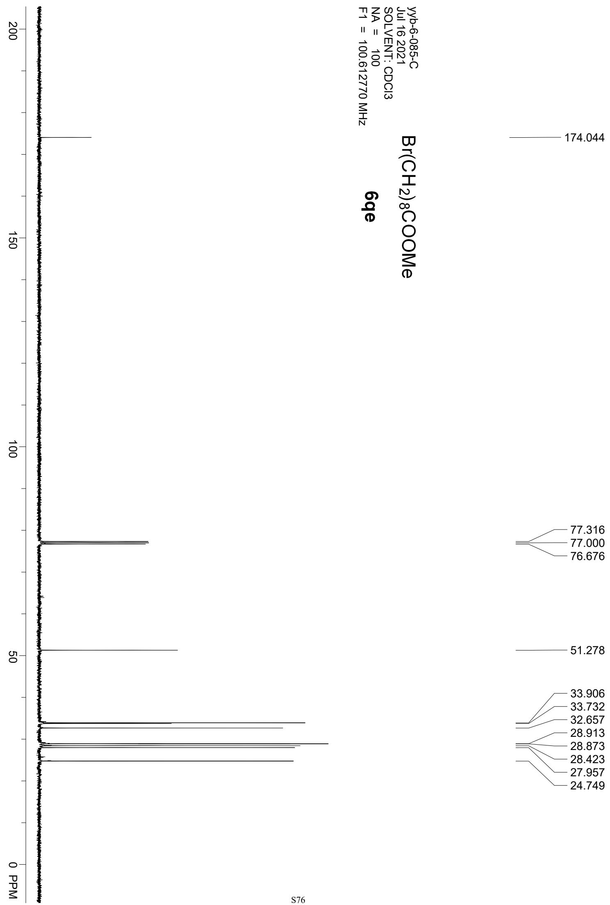

line

| ppm    |
| ------ |
| 24.749 |
| 27.957 |
| 28.423 |
| 28.873 |
| 28.913 |
| 32.657 |
| 33.906 |
| 33.732 |
| 77.000 |
| 76.676 |
| 174.044 |

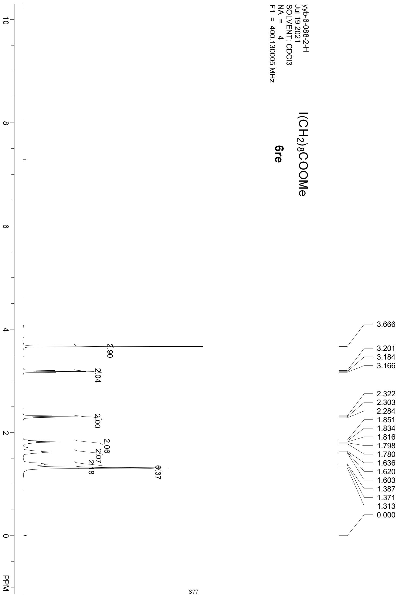

line

| Retention Time (min) | Chemical Shift |
|----------------------|----------------|
| 6.37                 | Peak           |
| 2.90                 | Peak           |
| 2.04                 | Peak           |
| 2.06                 | Peak           |
| 2.07                 | Peak           |
| 2.06                 | Peak           |
| 2.07                 | Peak           |
| 2.06                 | Peak           |
| 2.07                 | Peak           |
| 2.06                 | Peak           |
| 2.05                 | Peak           |
| 2.04                 | Peak           |
| 2.03                 | Peak           |
| 2.02                 | Peak           |
| 2.01                 | Peak           |
| 1.98                 | Peak           |
| 1.97                 | Peak           |
| 1.96                 | Peak           |
| 1.95                 | Peak           |
| 1.94                 | Peak           |
| 1.93                 | Peak           |
| 1.92                 | Peak           |
| 1.91                 | Peak           |
| 1.90                 | Peak           |
| 1.89                 | Peak           |
| 1.88                 | Peak           |
| 1.87                 | Peak           |
| 1.86                 | Peak           |
| 1.85                 | Peak           |
| 1.84                 | Peak           |
| 1.83                 | Peak           |
| 1.82                 | Peak           |
| 1.81                 | Peak           |
| 1.80                 | Peak           |
| 1.79                 | Peak           |
| 1.78                 | Peak           |
| 1.77                 | Peak           |
| 1.76                 | Peak           |
| 1.75                 | Peak           |
| 1.74                 | Peak           |
| 1.73                 | Peak           |
| 1.72                 | Peak           |
| 1.71                 | Peak           |
| 1.70                 | Peak           |
| 1.69                 | Peak           |
| 1.68                 | Peak           |
| 1.67                 | Peak           |
| 1.66                 | Peak           |
| 1.65                 | Peak           |
| 1.64                 | Peak           |
| 1.63                 | Peak           |
| 1.62                 | Peak           |
| 1.61                 | Peak           |
| 1.60                 | Peak           |
| 1.59                 | Peak           |
| 1.58                 | Peak           |
| 1.57                 | Peak           |
| 1.56                 | Peak           |
| 1.55                 | Peak           |
| 1.54                 | Peak           |
| 1.53                 | Peak           |
| 1.52                 | Peak           |
| 1.51                 | Peak           |
| 1.50                 | Peak           |
| 1.49                 | Peak           |
| 1.48                 | Peak           |
| 1.47                 | Peak           |
| 1.46                 | Peak           |
| 1.45                 | Peak           |
| 1.44                 | Peak           |
| 1.43                 | Peak           |
| 1.42                 | Peak           |
| 1.41                 | Peak           |
| 1.40                 | Peak           |
| 1.39                 | Peak           |
| 1.38                 | Peak           |
| 1.37                 | Peak           |
| 1.36                 | Peak           |
| 1.35                 | Peak           |
| 1.34                 | Peak           |
| 1.33                 | Peak           |
| 1.32                 | Peak           |
| 1.31                 | Peak           |
| 1.30                 | Peak           |
| 1.29                 | Peak           |
| 1.28                 | Peak           |
| 1.27                 | Peak           |
| 1.26                 | Peak           |
| 1.25                 | Peak           |
| 1.24                 | Peak           |
| 1.23                 | Peak           |
| 1.22                 | Peak           |
| 1.21                 | Peak           |
| 1.20                 | Peak           |
| 1.19                 | Peak           |
| 1.18                 | Peak           |
| 1.17                 | Peak           |
| 1.16                 | Peak           |
| 1.15                 | Peak           |
| 1.14                 | Peak           |
| 1.13                 | Peak           |
| 1.12                 | Peak           |
| 1.11                 | Peak           |
| 1.10                 | Peak           |
| 1.09                 | Peak           |
| 1.08                 | Peak           |
| 1.07                 | Peak           |
| 1.06                 | Peak           |
| 1.05                 | Peak           |
| 1.04                 | Peak           |
| 1.03                 | Peak           |
| 1.02                 | Peak           |
| 1.01                 | Peak           |
| 0.90                 | Peaks at ~6 S (δS)     |
| Peaks at ~6 S (δS)    | Peaks at ~6 S (δS)   |
| Peaks at ~6 S (δS)    | Peaks at ~6 S (δS)   |
| Peaks at ~6 S (δS)    | Peaks at ~6 S (δS)   |
| Peaks at ~6 S (δS)    | Peaks at ~6 S (δS)   |
| Peaks at ~6 S (δS)    | Peaks at ~6 S (δS)   |
| Peaks at ~6 S      | Peaks at ~6 S       |
| Peaks at ~6 S      | Peaks at ~6 S       |
| Peaks at ~6 S      | Peaks at ~6 S       |
| Peaks at ~6 S      | Peaks at ~6 S       |
| Peaks at ~6 S      | Peaks at ~6 S       |
| Peaks at ~6 S      | Peaks at ~6 S       |
| Peaks at ~6 S      | Peaks at ~6 S       |
| Peaks at ~6 S      | Pm             |

Other peaks: 
- CH₂₃-COOMe
- Solvent: CDCl₃
- CyO
- Solvent: CDCl₃
- Solvent: CDCl₃
- Solvent: CDCl₃
- Solvent: CDCl₃
- Solvent: CDCl₃
- Solvent: CDCl₃
- Solvent: CDCl₃
- Solvent: CDCl₃
- Solvent: CDCl₃
- Solvent: CDCl₃
- Solvent: CDCl₃
- Solvent: CDCl₃

Note: The diagram shows a single line representing a spectral profile for the compound I(CH₂)₈-COOMe.

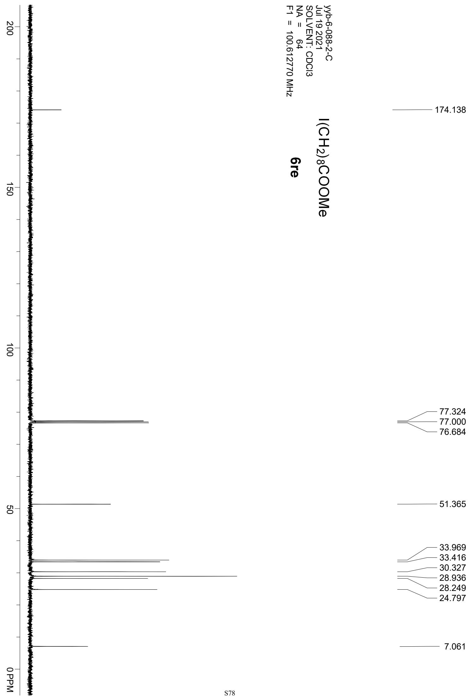

line

| δ (ppm) | Value   |
| ------- | ------- |
| 7.061   | 7.061   |
| 24.797  | 24.797  |
| 28.249  | 28.249  |
| 28.936  | 28.936  |
| 30.327  | 30.327  |
| 33.416  | 33.416  |
| 51.365  | 51.365  |
| 76.684  | 76.684  |
| 77.000  | 77.000  |
| 174.138 | 174.138 |

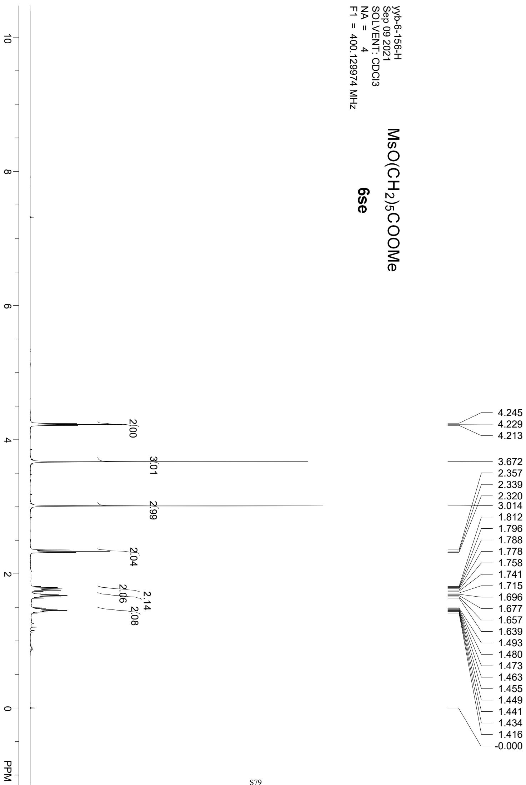

line

| ppm    | Value |
| ------ | ----- |
| 2.00   | 2.00  |
| 2.04   | 2.04  |
| 2.06   | 2.06  |
| 2.08   | 2.08  |
| 2.14   | 2.14  |
| 2.99   | 2.99  |
| 3.01   | 3.01  |
| 3.04   | 3.04  |
| 3.06   | 3.06  |
| 3.08   | 3.08  |
| 3.10   | 3.10  |
| 3.12   | 3.12  |
| 3.14   | 3.14  |
| 3.16   | 3.16  |
| 3.18   | 3.18  |
| 3.20   | 3.20  |
| 3.22   | 3.22  |
| 3.24   | 3.24  |
| 3.26   | 3.26  |
| 3.28   | 3.28  |
| 3.30   | 3.30  |
| 3.32   | 3.32  |
| 3.34   | 3.34  |
| 3.36   | 3.36  |
| 3.38   | 3.38  |
| 3.40   | 3.40  |
| 3.42   | 3.42  |
| 3.44   | 3.44  |
| 3.46   | 3.46  |
| 3.48   | 3.48  |
| 3.50   | 3.50  |
| 3.52   | 3.52  |
| 3.54   | 3.54  |
| 3.56   | 3.56  |
| 3.58   | 3.58  |
| 3.60   | 3.60  |
| 3.62   | 3.62  |
| 3.64   | 3.64  |
| 3.66   | 3.66  |
| 3.68   | 3.68  |
| 3.70   | 3.70  |
| 3.72   | 3.72  |
| 3.74   | 3.74  |
| 3.76   | 3.76  |
| 3.78   | 3.78  |
| 3.80   | 3.80  |
| 3.82   | 3.82  |
| 3.84   | 3.84  |
| 3.86   | 3.86  |
| 3.88   | 3.88  |
| 3.90   | 3.90  |
| 3.92   | 3.92  |
| 3.94   | 3.94  |
| 3.96   | 3.96  |
| 3.98   | 3.98  |
| 4.00   | -     |
| -      | -     |
| -      | -     |
| -      | -     |
| -      | -     |
| -      | -     |
| -      | -     |
| -      | -     |
| -      | -     |
| -      | -     |
| -      | -     |
| -      | -     |
| -      | -     |
| -      | -     |
| -      | -     |
| -      | +     |
| -      | +     |
| -      | +     |
| -      | +     |
| -      | +     |
| -      | +     |
| -      | +     |
| -      | +     |
| -      | +     |
| -      | +     |
| -      | +     |
| -      | +     |
| -      | +     |
| -      | +     |
| -      | +     |

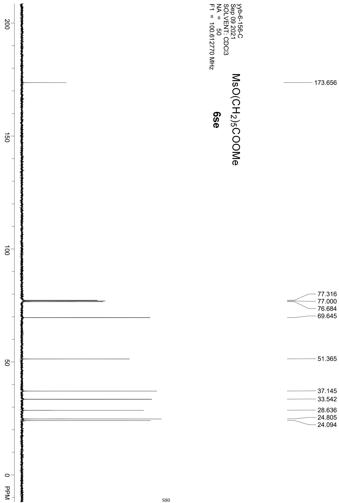

line

| m/z    | Intensity |
| ------ | --------- |
| 24.094 | 0         |
| 24.805 | 0         |
| 28.636 | 0         |
| 33.542 | 0         |
| 37.145 | 0         |
| 51.365 | 0         |
| 69.645 | 0         |
| 76.684 | 0         |
| 77.000 | 0         |
| 77.316 | 0         |
| 173.656| 0         |

yb-6-156- ep 09 20 LVENT: CD A = 5 = 100.612770

1 73 . 656

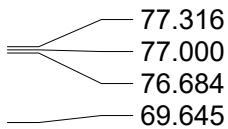

5 1 . 3 6 5

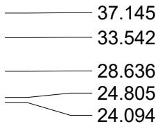

line

| X-Axis Label | Y-Axis Value |
| :--- | :--- |
| 1 | 37.145 |
| 2 | 33.542 |
| 3 | 28.636 |
| 4 | 24.805 |
| 5 | 24.094 |

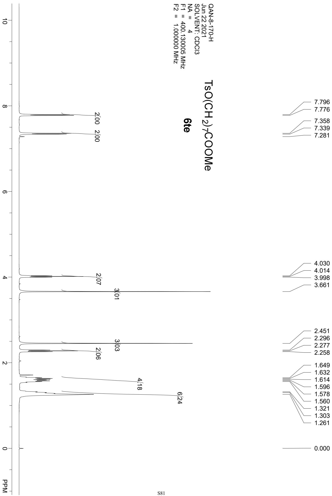

line

| ppm    | Intensity |
| ------ | --------- |
| 0.000  | 0         |
| 1.261  | 1         |
| 1.303  | 2         |
| 1.321  | 3         |
| 1.560  | 4         |
| 1.578  | 5         |
| 1.596  | 6         |
| 1.614  | 7         |
| 1.632  | 8         |
| 1.649  | 9         |
| 2.258  | 10        |
| 2.277  | 11        |
| 2.451  | 12        |
| 3.998  | 13        |
| 4.030  | 14        |
| 4.030  | 15        |
| 4.030  | 16        |
| 4.030  | 17        |
| 4.030  | 18        |
| 4.030  | 19        |
| 4.030  | 20        |
| 4.030  | 21        |
| 4.030  | 22        |
| 4.030  | 23        |
| 4.030  | 24        |
| 4.030  | 25        |
| 4.030  | 26        |
| 4.030  | 27        |
| 4.030  | 28        |
| 4.030  | 29        |
| 4.030  | 30        |
| 4.030  | 31        |
| 4.030  | 32        |
| 4.030  | 33        |
| 4.030  | 34        |
| 4.030  | 35        |
| 4.030  | 36        |
| 4.030  | 37        |
| 4.030  | 38        |
| 4.030  | 39        |
| 4.030  | 40        |
| 4.030  | 41        |
| 4.030  | 42        |
| 4.030  | 43        |
| 4.030  | 44        |
| 4.030  | 45        |
| 4.030  | 46        |
| 4.030  | 47        |
| 4.030  | 48        |
| 4.030  | 49        |
| 4.030  | 50        |
| 4.030  | 51        |
| 4.030  | 52        |
| 4.030  | 53        |
| 4.030  | 54        |
| 4.030  | 55        |
| 4.030  | 56        |
| 4.030  | 57        |
| 4.030  | 58        |
| 4.030  | 59        |
| 4.030  | 60        |
| 4.030  | 61        |
| 4.030  | 62        |
| 4.030  | 63        |
| 4.030  | 64        |
| 4.030  | 65        |
| 4.030  | 66        |
| 4.030  | 67        |
| 4.030  | 68        |
| 4.030  | 69        |
| 4.030  | 70        |
| 4.030  | 71        |
| 4.030  | 72        |
| 4.030  | 73        |
| 4.030  | 74        |
| 4.030  | 75        |
| 4.030  | 76        |
| 4.030  | 77        |
| 4.030  | 78        |
| 4.030  | 79        |
|          |           |

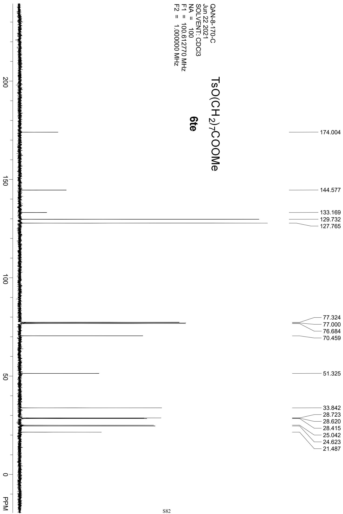

line

| m/z    | Intensity |
| ------ | --------- |
| 21.487 | 0         |
| 24.623 | 0         |
| 25.042 | 0         |
| 28.415 | 0         |
| 28.620 | 0         |
| 33.842 | 0         |
| 51.325 | 0         |
| 70.459 | 0         |
| 76.684 | 0         |
| 77.000 | 0         |
| 127.765| 0         |
| 133.169| 0         |
| 129.732| 0         |
| 133.169| 0         |
| 144.577| 0         |
| 174.004| 0         |

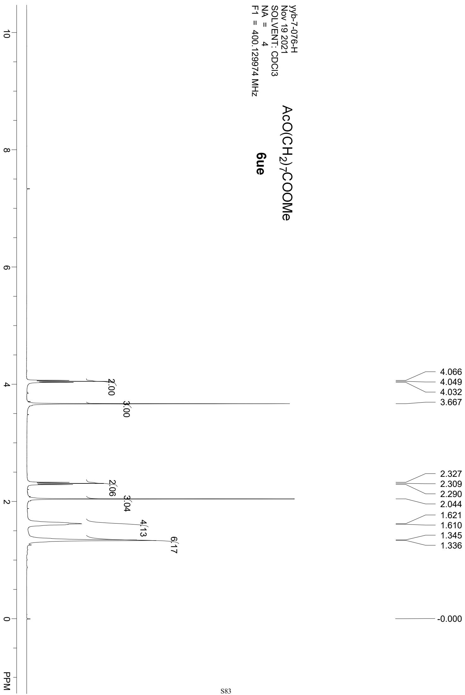

line

| δ (ppm) | Intensity |
| ------- | --------- |
| 6.17    | 6.17      |
| 4.13    | 4.13      |
| 3.04    | 3.04      |
| 2.06    | 2.06      |
| 3.00    | 3.00      |
| 2.00    | 2.00      |
| -       | -         |
| -       | -         |
| -       | -         |
| -       | -         |
| -       | -         |
| -       | -         |
| -       | -         |
| -       | -         |
| -       | -         |
| -       | -         |
| -       | -         |
| -       | -         |
| -       | -         |
| -       | -         |
| -       | -         |
|
| -       | -         |
| -       | -         |
| -       | -         |
| -       | -         |
| -       | -         |
| -       | -         |
| -       | -         |
| -       | -         |
| -       | -         |
| -       | -         |
| -       | -         |
| -       | -         |
| -       | -         |
| -       | -         |
| 2.327   | 2.327     |
| 2.044   | 2.044     |
| 2.290   | 2.290     |
| 1.621   | 1.621     |
| 1.345   | 1.345     |
| 1.336   | 1.336     |
| 4.032   | 4.032     |
| 4.049   | 4.049     |
| 4.066   | 4.066     |
| 4.066   | 4.066     |
| 4.066   | 4.066     |
| 4.066   | 4.066     |
| 4.066   | 4.066     |
| 4.066   | 4.066     |
| 4.066   | 4.367     |
| 4.066   | 4.066     |
| 4.066   | 4.066     |
| 4.066   | 4.066     |
| 4.066   | 4.066     |
| 4.066   | 4.066     |
| 4.066   | 4.137     |
| 4.137   | 4.137     |
| 3.04    | 3.04      |
| 2.06    | 2.06      |
| 1.33    | 1.33      |
| 1.33    | 1.33      |
| -       | -         |
| -       | -         |
| -       | -         |
| -       | -         |
| -       | -         |
| -       | -         |
| -       | -         |
| -       | -         |
| -       | -         |
| -       | -         |
| -       | -         |
| -       | -         |
| -       | -         |
| -       | -         |

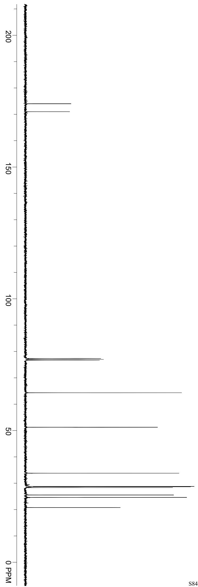

line

| x    | y     |
| ---- | ----- |
| 0    | 0     |
| 50   | 0     |
| 100  | 0     |
| 150  | 0     |
| 200  | 0     |

text_image

yib-7-076-C
Acq(CH2)7COOME
NOV 19 2021
SOLVENT: CDCI3
NA = 64
F1 = 100.612770 MHz
bue

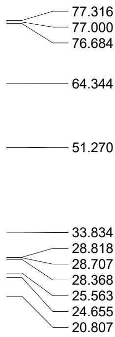

line

| X-Axis Label | Value |
| :--- | :--- |
| 1 | 20.807 |
| 2 | 24.655 |
| 3 | 25.563 |
| 4 | 28.368 |
| 5 | 28.707 |
| 6 | 28.818 |
| 7 | 33.834 |
| 8 | 51.270 |
| 9 | 64.344 |
| 10 | 76.684 |
| 11 | 77.000 |
| 12 | 77.316 |

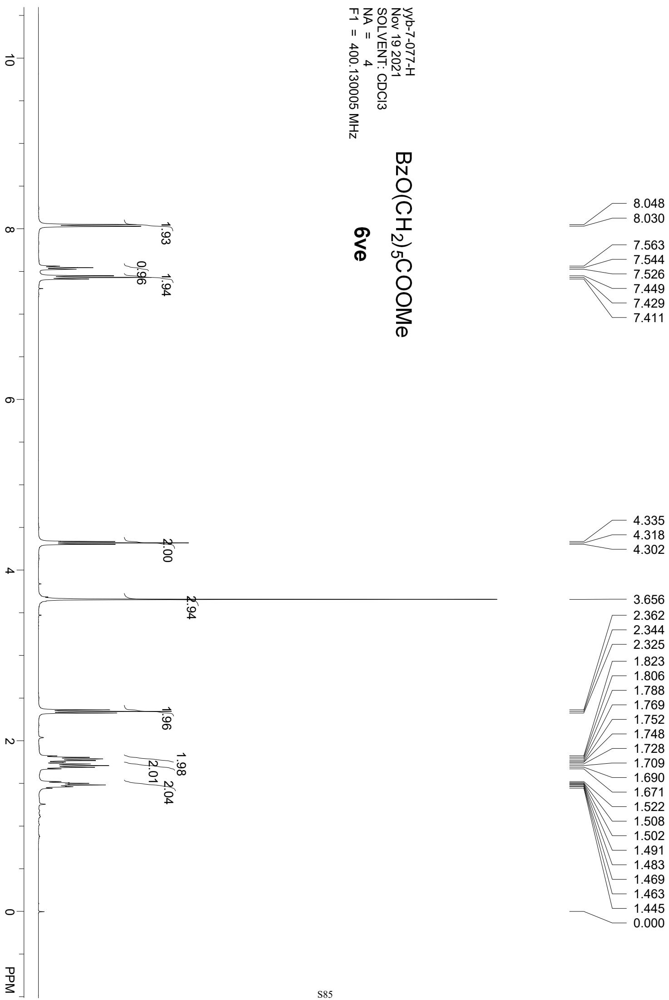

line

| Chemical Shift (δ, ppm) | Integration |
| ------------------------ | ----------- |
| 0.96                     | 1.98        |
| 1.98                     | 2.04        |
| 2.04                     | 2.94        |
| 3.00                     | 2.00        |
| 3.93                     | 0.96        |
| 4.335                    | 4.318       |
| 4.302                    | 4.302       |
| 3.656                    | 3.656       |
| 7.411                    | 7.411       |
| 7.429                    | 7.429       |
| 7.449                    | 7.449       |
| 7.526                    | 7.526       |
| 7.544                    | 7.544       |
| 7.563                    | 7.563       |
| 8.030                    | 8.030       |
| 8.048                    | 8.048       |

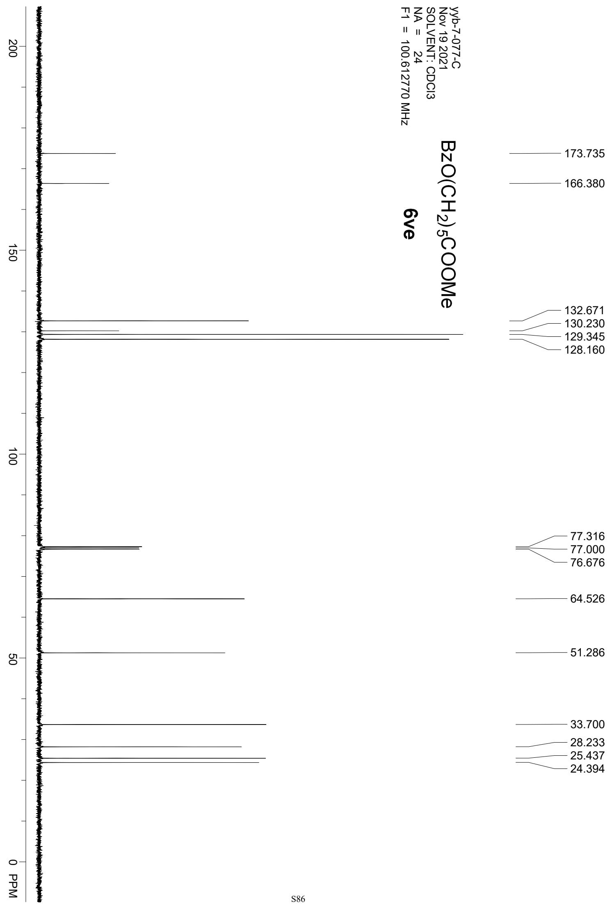

line

| Chemical Shift (ppm) | Integration Value |
|----------------------|-------------------|
| 24.394               | -                 |
| 25.437               | -                 |
| 28.233               | -                 |
| 33.700               | -                 |
| 51.286               | -                 |
| 64.526               | -                 |
| 76.676               | -                 |
| 77.316               | -                 |
| 128.160              | -                 |
| 129.345              | -                 |
| 130.230              | -                 |
| 132.671              | -                 |
| 166.380              | -                 |
| 173.735              | -                 |

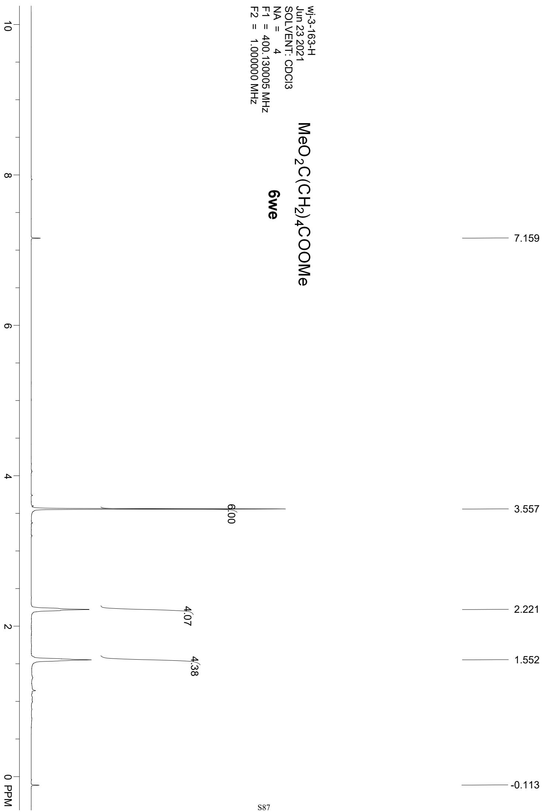

line

| m/z    | Intensity |
| ------ | --------- |
| 1.552  | 0.113     |
| 2.221  | 0.113     |
| 3.557  | 0.113     |
| 4.07   | 0.113     |
| 4.38   | 0.113     |
| 6.00   | 0.113     |
| 7.159  | 0.113     |

F2 = F1 = 400.130005 MHz A = LVENT: CD un 23 202 j-3-163- 000000 M 4

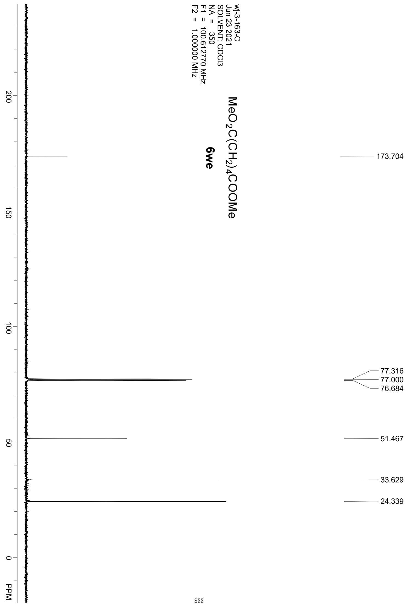

line

| m/z    | Intensity |
| ------ | --------- |
| 24.339 | 0         |
| 33.629 | 0         |
| 51.467 | 0         |
| 76.684 | 0         |
| 77.000 | 0         |
| 173.704 | 0         |

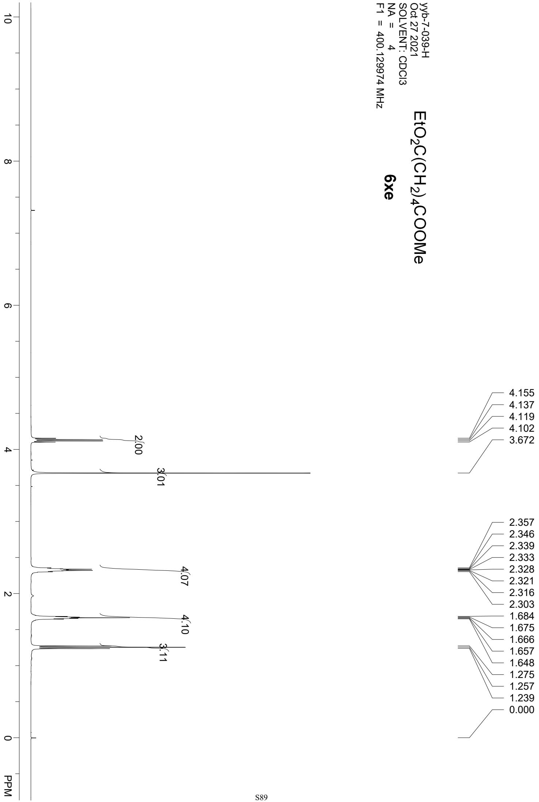

line

| δ     | Intensity |
|-------|---------|
| 0.000 | 0.000   |
| 1.239 | 1.239   |
| 1.257 | 1.257   |
| 1.275 | 1.275   |
| 1.648 | 1.648   |
| 1.657 | 1.657   |
| 1.666 | 1.666   |
| 1.675 | 1.675   |
| 1.684 | 1.684   |
| 2.303 | 2.303   |
| 2.316 | 2.316   |
| 2.321 | 2.321   |
| 2.328 | 2.328   |
| 2.333 | 2.333   |
| 2.339 | 2.339   |
| 2.346 | 2.346   |
| 3.672 | 3.672   |
| 4.102 | 4.102   |
| 4.119 | 4.119   |
| 4.137 | 4.137   |
| 4.155 | 4.155   |

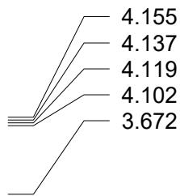

line

| Point | Value |
|---|---|
| 1 | 3.672 |
| 2 | 4.102 |
| 3 | 4.119 |
| 4 | 4.137 |
| 5 | 4.155 |

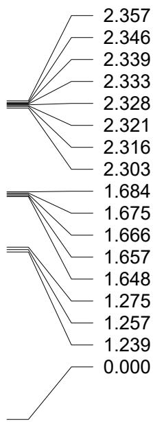

tree

| Node | Value |
|---|---|
| 1 | 0.000 |
| 2 | 1.239 |
| 3 | 1.257 |
| 4 | 1.275 |
| 5 | 1.648 |
| 6 | 1.657 |
| 7 | 1.666 |
| 8 | 1.675 |
| 9 | 1.684 |
| 10 | 2.303 |
| 11 | 2.316 |
| 12 | 2.321 |
| 13 | 2.328 |
| 14 | 2.333 |
| 15 | 2.339 |
| 16 | 2.346 |
| 17 | 2.357 |

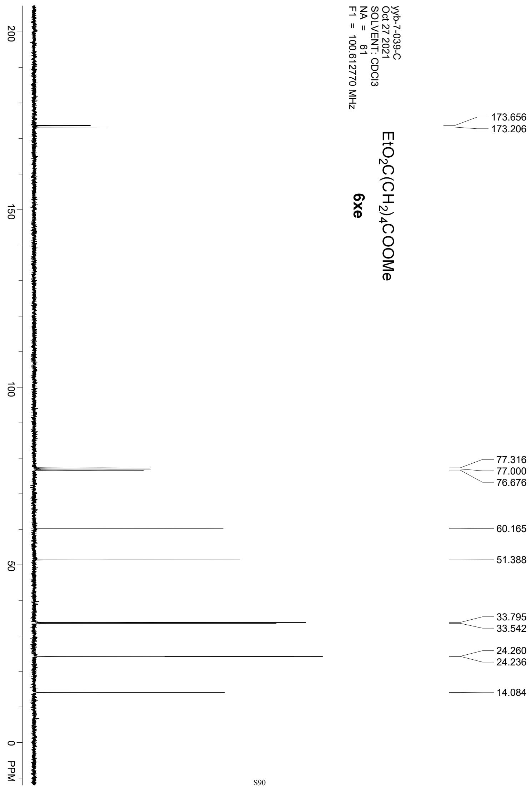

line

| δ      | Intensity |
| ------ | --------- |
| 14.084 | ~0        |
| 24.260 | ~0        |
| 33.795 | ~0        |
| 51.388 | ~0        |
| 60.165 | ~0        |
| 77.000 | ~0        |
| 76.676 | ~0        |
| 173.656| ~0        |

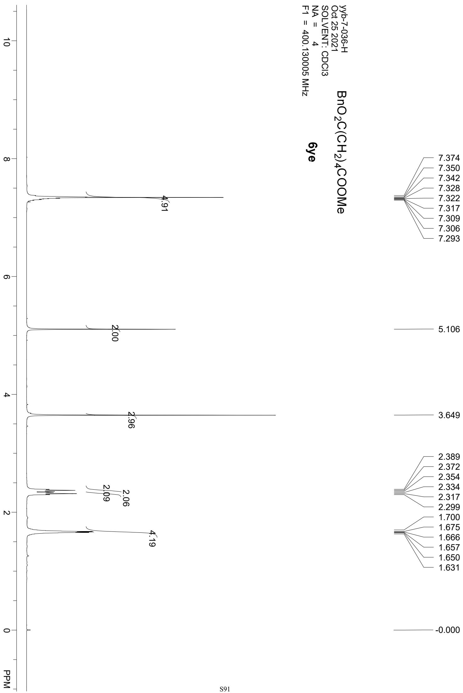

line

| δ (ppm) | Value |
| ------- | ----- |
| 4.19    | 19    |
| 2.06    | 20    |
| 2.96    | 21    |
| 2.00    | 22    |
| 4.91    | 4     |
| 5.106   | 5     |
| -       | -     |
| 1.631   | -     |
| 1.650   | -     |
| 1.657   | -     |
| 1.666   | -     |
| 1.675   | -     |
| 1.700   | -     |
| 2.299   | -     |
| 2.317   | -     |
| 2.334   | -     |
| 2.354   | -     |
| 2.372   | -     |
| 2.389   | -     |
| 3.649   | -     |
| 7.293   | -     |
| 7.306   | -     |
| 7.309   | -     |
| 7.317   | -     |
| 7.322   | -     |
| 7.328   | -     |
| 7.342   | -     |
| 7.350   | -     |
| 7.374   | -     |

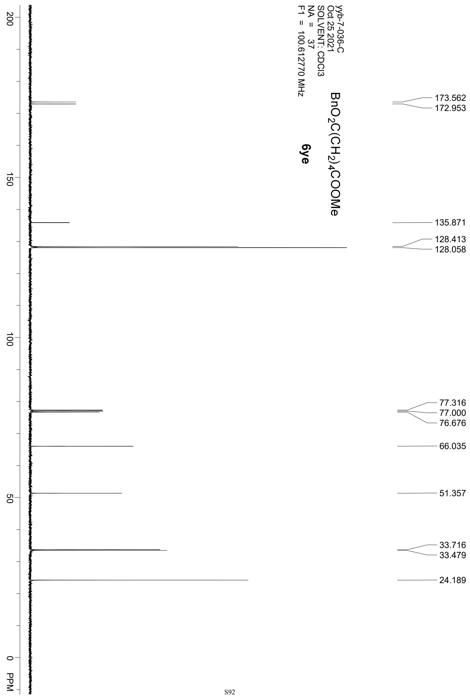

line

| δ (ppm) | Value   |
|---------|---------|
| 24.189  |         |
| 33.716  |         |
| 51.357  |         |
| 66.035  |         |
| 76.676  |         |
| 77.316  |         |
| 128.413 |         |
| 128.058 |         |
| 135.871 |         |
| 172.953 |         |
| 173.562 |         |

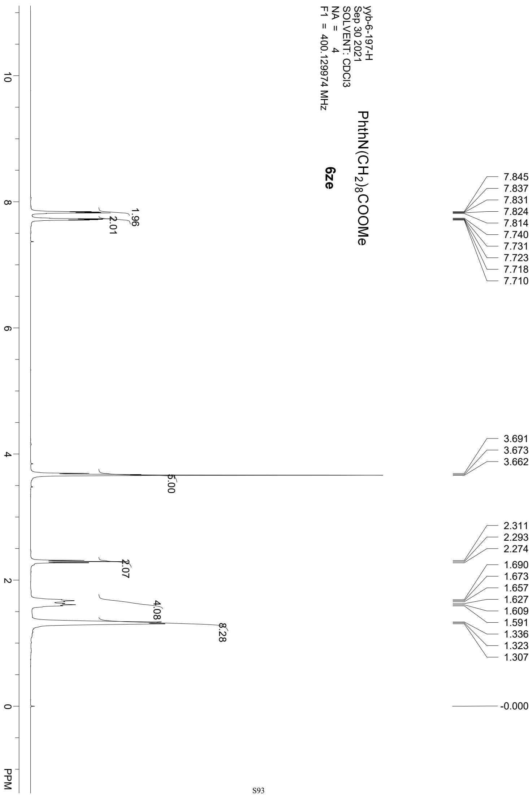

line

| ppm    | Value  |
| ------ | ------ |
| 8.28   |        |
| 4.08   |        |
| 2.07   |        |
| 5.00   |        |
| 1.96   |        |
| 2.01   |        |
| 3.691  |        |
| 3.662  |        |
| 3.673  |        |
| 3.690  |        |
| 2.274  |        |
| 2.293  |        |
| 2.311  |        |
| 1.609  |        |
| 1.627  |        |
| 1.657  |        |
| 1.673  |        |
| 1.690  |        |
| 1.690  |        |
| 1.336  |        |
| 1.323  |        |
| 1.307  |        |
| -0.000 |        |
| 7.710  |        |
| 7.718  |        |
| 7.723  |        |
| 7.731  |        |
| 7.740  |        |
| 7.814  |        |
| 7.824  |        |
| 7.831  |        |
| 7.837  |        |
| 7.845  |        |
| S&P 30:2021 |      |
| SOLVENT: CDCl3 |      |
| F1 = 400.129974 MHz |      |
| zbe    |      |

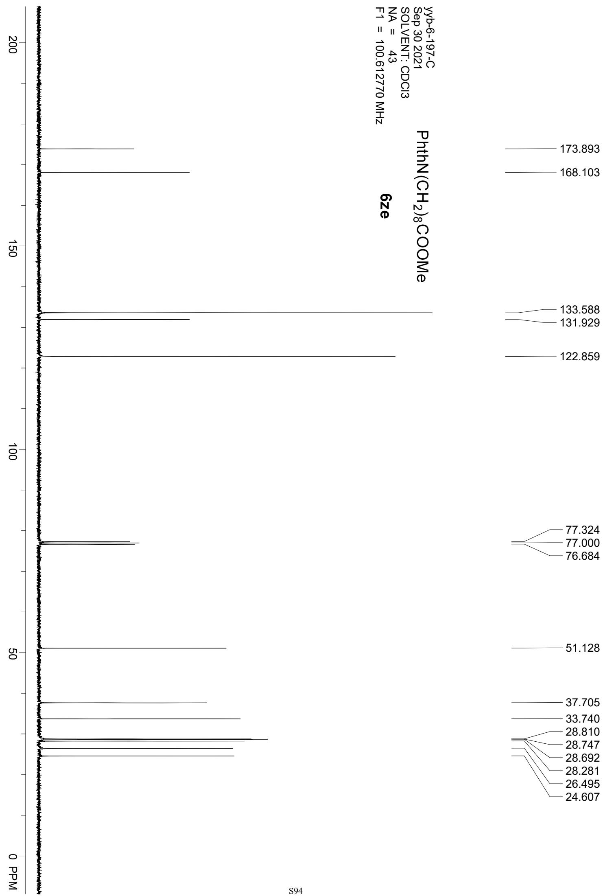

line

| m/z    | Value   |
|--------|---------|
| 24.607 | 0       |
| 26.495 | 0       |
| 28.281 | 0       |
| 28.692 | 0       |
| 28.747 | 0       |
| 28.810 | 0       |
| 33.740 | 0       |
| 37.705 | 0       |
| 51.128 | 0       |
| 76.684 | 0       |
| 77.324 | 0       |
| 122.859| 0       |
| 131.929| 0       |
| 133.588| 0       |
| 168.103| 0       |
| 173.893| 0       |

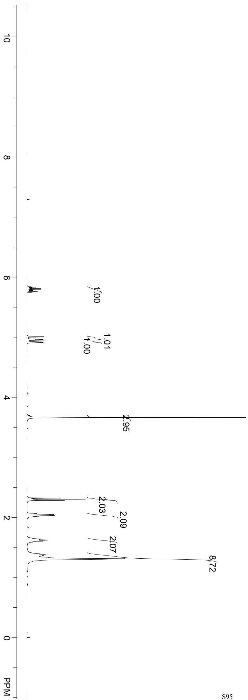

line

| Label | Value |
|-------|-------|
| 8.72  |       |
| 2.09  |       |
| 2.07  |       |
| 2.03  |       |
| 1.01  |       |
| 2.95  |       |
| 1.00  |       |
| 1.00  |       |

chemical

Chemical structure of a carbonyl compound with substituent labels and reaction conditions

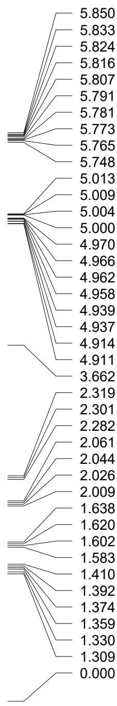

tree

| Level | Value |
|---|---|
| 1 | 0.000 |
| 2 | 1.309 |
| 3 | 1.330 |
| 4 | 1.359 |
| 5 | 1.374 |
| 6 | 1.392 |
| 7 | 1.410 |
| 8 | 1.583 |
| 9 | 1.602 |
| 10 | 1.620 |
| 11 | 1.638 |
| 12 | 2.009 |
| 13 | 2.026 |
| 14 | 2.044 |
| 15 | 2.061 |
| 16 | 2.282 |
| 17 | 2.301 |
| 18 | 2.319 |
| 19 | 3.662 |
| 20 | 4.911 |
| 21 | 4.914 |
| 22 | 4.937 |
| 23 | 4.939 |
| 24 | 4.958 |
| 25 | 4.962 |
| 26 | 4.966 |
| 27 | 4.970 |
| 28 | 5.000 |
| 29 | 5.004 |
| 30 | 5.009 |
| 31 | 5.013 |
| 32 | 5.017 |
| 33 | 5.748 |
| 34 | 5.765 |
| 35 | 5.773 |
| 36 | 5.781 |
| 37 | 5.791 |
| 38 | 5.807 |
| 39 | 5.816 |
| 40 | 5.824 |
| 41 | 5.833 |
| 42 | 5.850 |

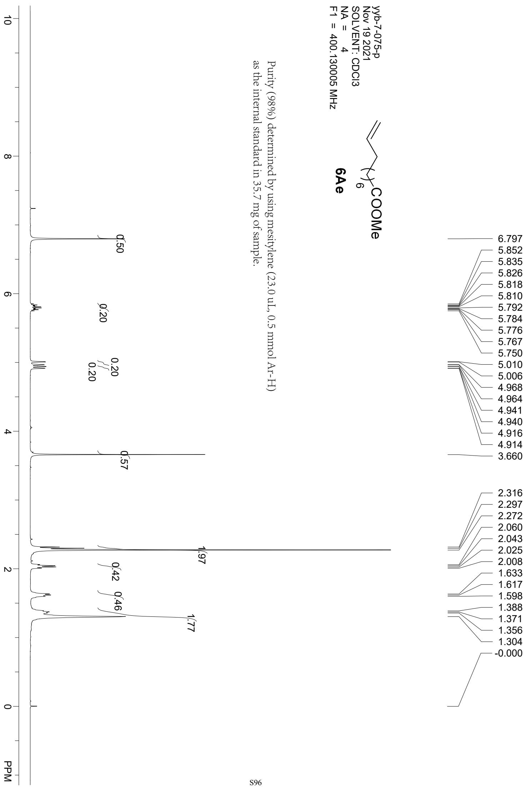

line

| Chemical Shift (ppm) | Integration |
|----------------------|-------------|
| 0.50                 | 0.50        |
| 0.20                 | 0.20        |
| 0.20                 | 0.20        |
| 0.57                 | 0.57        |
| 0.97                 | 0.97        |
| 1.77                 | 1.77        |
| 3.660                | 3.660       |
| 4.914                | 4.914       |
| 4.916                | 4.916       |
| 4.940                | 4.940       |
| 4.941                | 4.941       |
| 4.964                | 4.964       |
| 4.968                | 4.968       |
| 5.006                | 5.006       |
| 5.010                | 5.010       |
| 5.750                | 5.750       |
| 5.767                | 5.767       |
| 5.776                | 5.776       |
| 5.784                | 5.784       |
| 5.792                | 5.792       |
| 5.810                | 5.810       |
| 5.818                | 5.818       |
| 5.826                | 5.826       |
| 5.835                | 5.835       |
| 5.852                | 5.852       |
| 6.797                | 6.797       |
| -                    | -           |
| -                    | -           |
| -                    | -           |
| -                    | -           |
| -                    | -           |
| -                    | -           |
| -                    | -           |
| -                    | -           |
| -                    | -           |
| -                    | -           |
| -                    | -           |
| -                    | -           |
| -                    | -           |
| -                    | -           |
| -                    | -           |
|
| -                    | -           |
| -                    | -           |
| -                    | -           |
| -                    | -           |
| -                    | -           |
| -                    | -           |
| -                    | -           |
| -                    | -           |
| -                    | -           |
| -                    | -           |
| -                    | -           |
| -                    | -           |
| -                    | -           |
| -                    | -           |
| ...                  | ...         |
| ...                  | ...         |

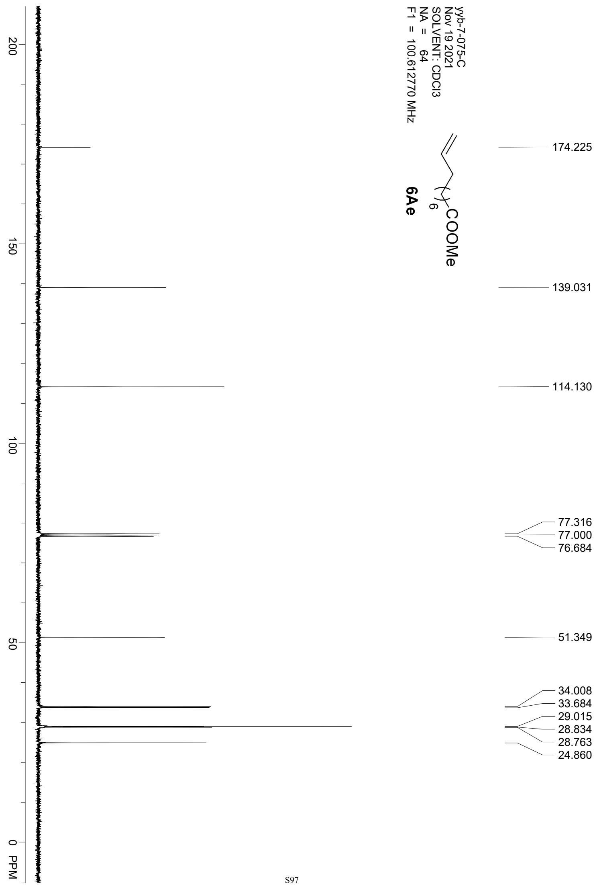

line

| Retention Time (min) | Chemical Shift (ppm) |
|----------------------|----------------------|
| 24.860               | 24.860               |
| 28.763               | 28.763               |
| 28.834               | 28.834               |
| 29.015               | 29.015               |
| 33.684               | 33.684               |
| 34.008               | 34.008               |
| 51.349               | 51.349               |
| 76.684               | 76.684               |
| 77.316               | 77.316               |
| 114.130              | 114.130              |
| 139.031              | 139.031              |
| 174.225              | 174.225              |

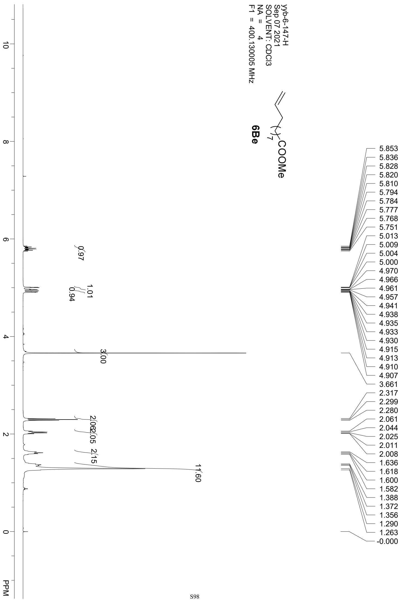

line

| m/z    | Intensity |
| ------ | --------- |
| 1.60   | 1.0       |
| 2.06   | 0.5       |
| 2.15   | 0.5       |
| 3.00   | 0.1       |
| 3.07   | 0.9       |
| 4.09   | 0.4       |
| 5.853  | —         |

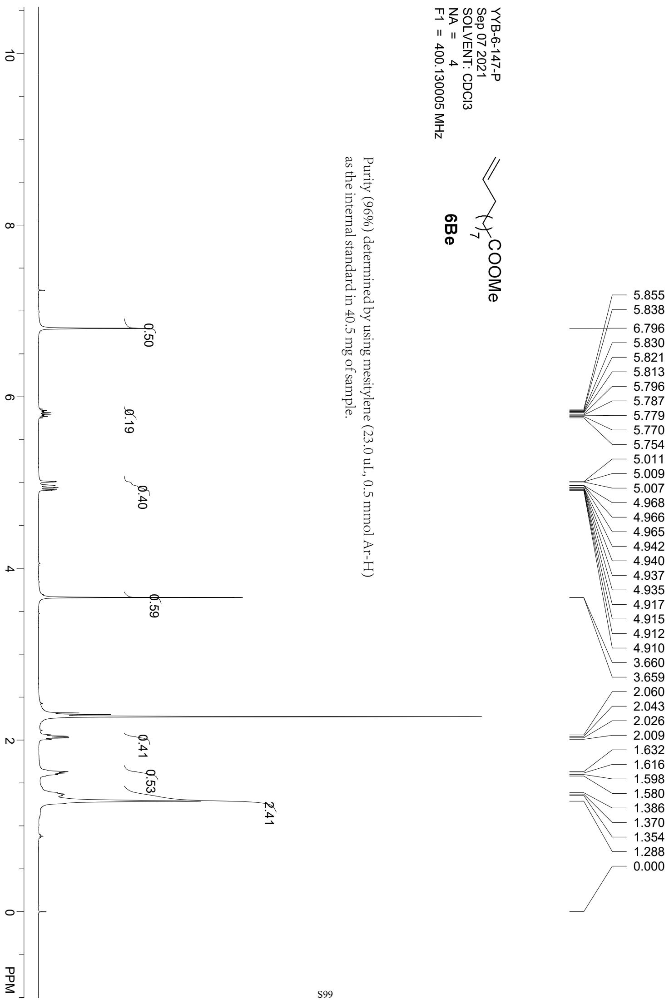

line

| m/z    | ppm    |
| ------ | ------ |
| 2.41   | 0.59   |
| 0.50   | 0.40   |
| 0.19   | 0.33   |
| 0.33   | 0.53   |
| 0.41   | 0.59   |
| 0.59   | 0.40   |
| 0.65   | 0.59   |
| 0.73   | 0.41   |
| 1.288  | 0.59   |
| 1.354  | 0.59   |
| 1.370  | 0.59   |
| 1.386  | 0.59   |
| 1.598  | 0.59   |
| 1.616  | 0.59   |
| 1.632  | 0.59   |
| 2.009  | 0.59   |
| 2.026  | 0.59   |
| 2.043  | 0.59   |
| 2.060  | 0.59   |
| 2.069  | 0.59   |
| 2.166  | 0.59   |
| 2.264  | 0.59   |
| 2.369  | 0.59   |
| 2.467  | 0.59   |
| 2.660  | 0.59   |
| 2.668  | 0.59   |
| 2.764  | 0.59   |
| 2.861  | 0.59   |
| 2.968  | 0.59   |
| 3.164  | 0.59   |
| 3.261  | 0.59   |
| 3.368  | 0.59   |
| 3.475  | 0.59   |
| 3.572  | 0.59   |
| 3.678  | 0.59   |
| 3.774  | 0.59   |
| 3.871  | 0.59   |
| 3.978  | 0.59   |
| 4.074  | 0.59   |
| 4.171  | 0.59   |
| 4.268  | 0.59   |
| 4.374  | 0.59   |
| 4.471  | 0.59   |
| 4.568  | 0.59   |
| 4.674  | 0.59   |
| 4.771  | 0.59   |
| 4.868  | 0.59   |
| 4.974  | 0.59   |
| 5.071  | 0.59   |
| 5.168  | 0.59   |
| 5.264  | 0.59   |
| 5.361  | 0.59   |
| 5.457  | 0.59   |
| 5.563  | 0.59   |
| 5.660  | 0.59   |
| 5.757  | 0.59   |
| 5.852  | -      |
| -      | -      |
| -      | -      |
| -      | -      |
| -      | -      |
| -      | -      |
| -      | -      |
| -      | -      |
| -      | -      |
| -      | -      |
| -      | -      |
| -      | -      |
| -      | -      |
| -      | -      |
| -      | -      |
| -      | ~1     |

The chart displays the chemical shift (δ) in Pm for a mixture of COOMe and NMR spectra based on the NMR spectrum of the sample.

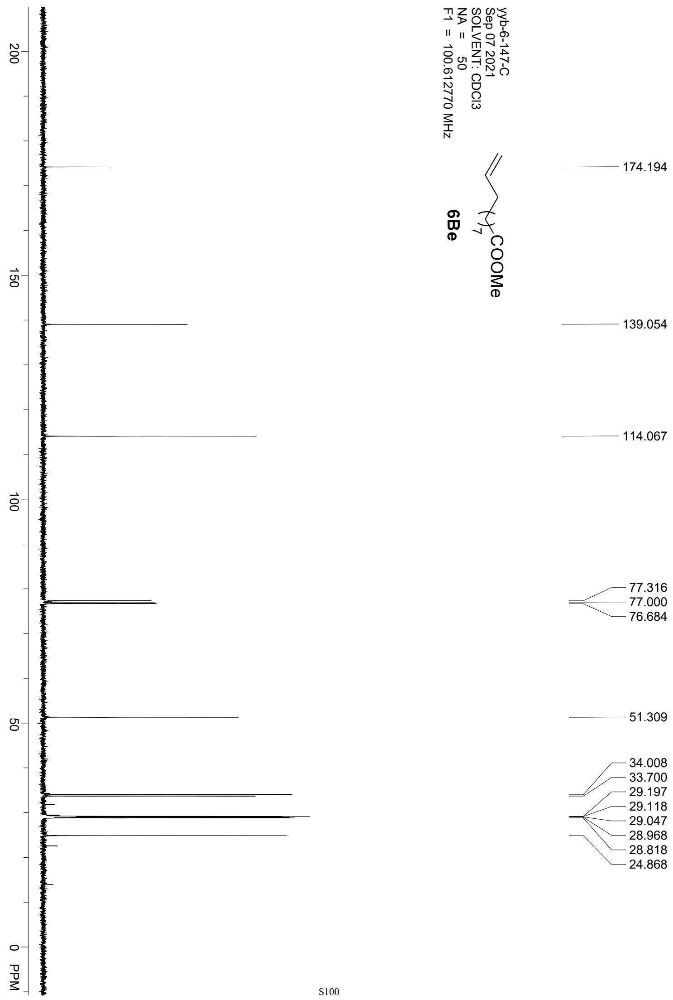

line

| m/z    | Intensity (ppm) |
| ------ | --------------- |
| 24.868 | 0               |
| 28.818 | 0               |
| 28.968 | 0               |
| 29.047 | 0               |
| 29.118 | 0               |
| 29.197 | 0               |
| 33.700 | 0               |
| 34.008 | 0               |
| 51.309 | 0               |
| 76.684 | 0               |
| 77.316 | 0               |
| 114.067| 0               |
| 139.054| 0               |
| 174.194| 0               |

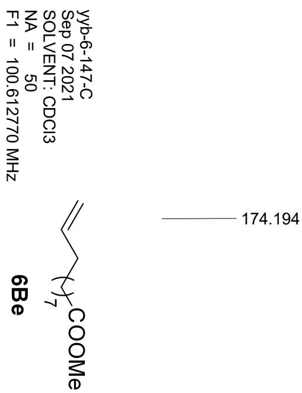

chemical

Chemical structure of a chiral molecule with COOMe, SDEVENT, and N/A substituents, labeled with chemical formula and mass value

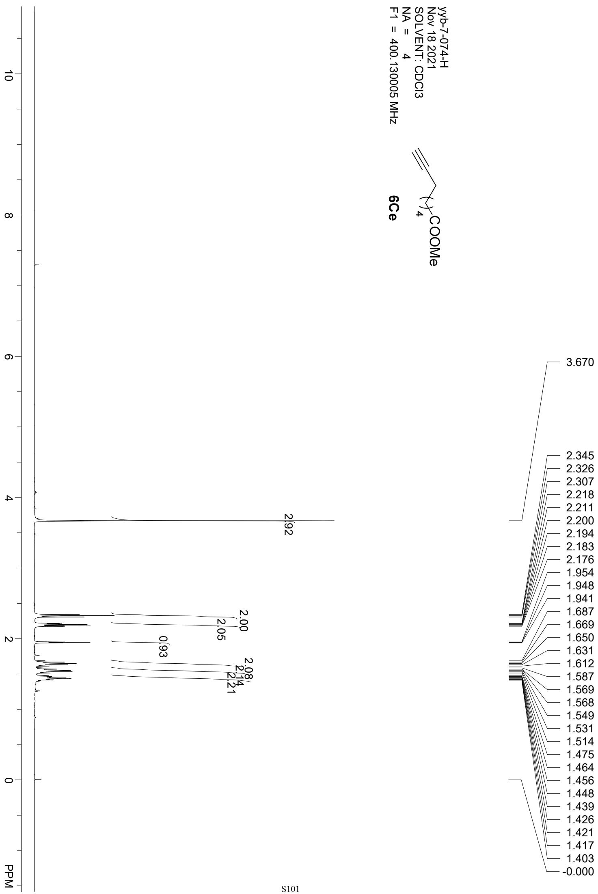

line

| Chemical Shift (ppm) | Integration |
|----------------------|-----------|
| 2.92                 | 2.00      |
| 2.14                 | 2.08      |
| 2.05                 | 2.11      |
| 0.93                 | 2.14      |
| 0.92                 | 2.08      |
| 0.92                 | 2.11      |
| 0.92                 | 2.14      |
| 0.92                 | 2.08      |
| 0.92                 | 2.11      |
| 0.92                 | 2.14      |
| 0.92                 | 2.08      |
| 0.92                 | 2.11      |
| 0.92                 | 2.14      |
|
| 0.92                 | 2.08      |
| 0.92                 | 2.11      |
| 0.92                 | 2.14      |
| 0.92                 | 2.08      |
| 0.92                 | 2.11      |
| 0.92                 | 2.14      |
| 0.92                 | 0.93      |
| 0.92                 | 0.93      |
| 0.92                 | 0.93      |
| 0.92                 | 0.93      |
| 0.92                 | 0.93      |
| 0.92                 | 0.93      |
| 0.92                 | 0.93      |
| 0.92                 --> -1       |

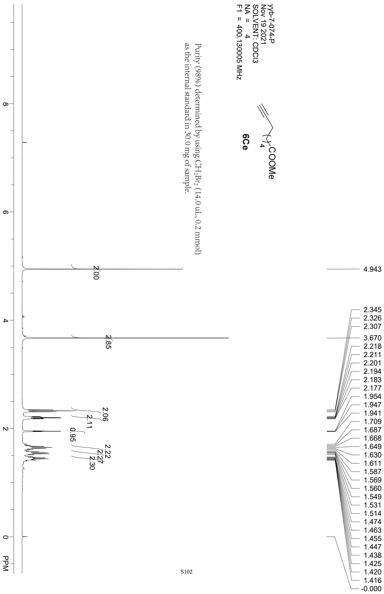

line

| Chemical Shift (ppm) | Integration |
|----------------------|-------------|
| 2.06                 | 2.11        |
| 2.27                 | 2.30        |
| 2.85                 | 2.11        |
| 2.95                 | 2.95        |
| 4.943                | 4.943       |

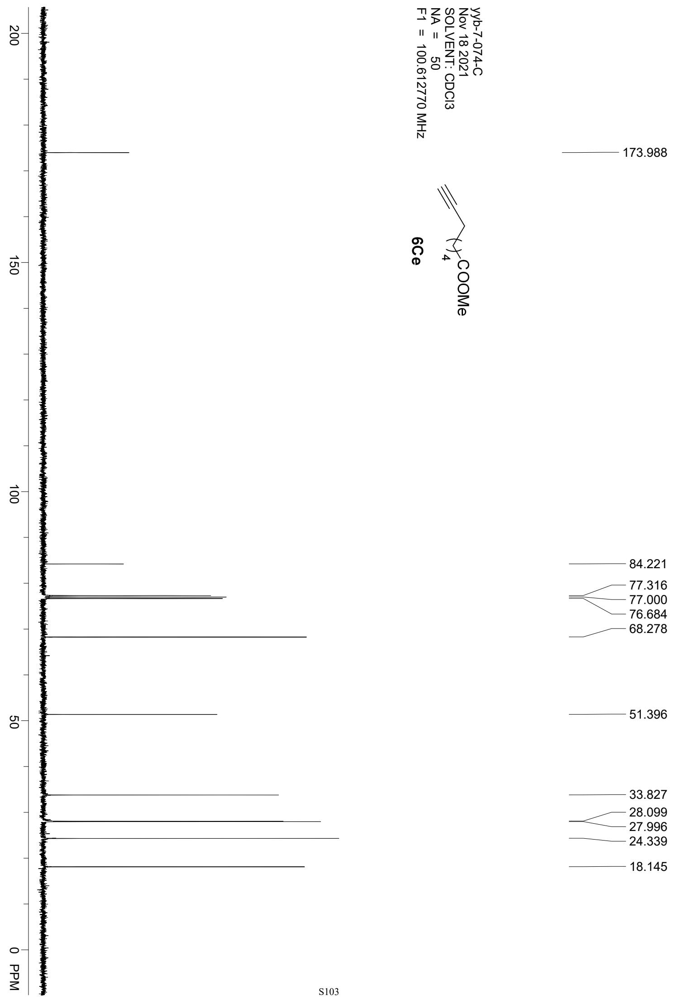

line

| m/z     | Intensity |
| ------- | --------- |
| 18.145  | ~0        |
| 24.339  | ~0        |
| 27.996  | ~0        |
| 28.099  | ~0        |
| 33.827  | ~0        |
| 51.396  | ~0        |
| 68.278  | ~0        |
| 76.684  | ~0        |
| 77.000  | ~0        |
| 77.316  | ~0        |
| 84.221  | ~0        |
| 173.988 | ~0        |

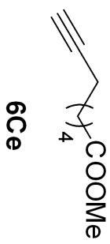

chemical

Chemical structure of a carbonyl compound with stereochemistry and labeled carbon positions

F1 = 100.612770 MHz   
NA = 50   
LVENT: CD   
Nov 18 2021   
ov1820yb-7-074-

1 73 . 988

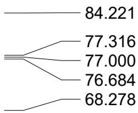

line

| X-Axis Label | Y-Axis Value |
| :--- | :--- |
| 1 | 68.278 |
| 2 | 76.684 |
| 3 | 77.000 |
| 4 | 77.316 |
| 5 | 84.221 |

5 1 . 3 9 6

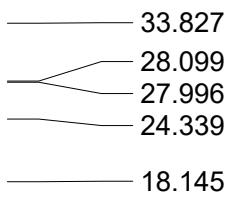

line

| Point | Value |
|---|---|
| 1 | 18.145 |
| 2 | 24.339 |
| 3 | 27.996 |
| 4 | 28.099 |
| 5 | 33.827 |

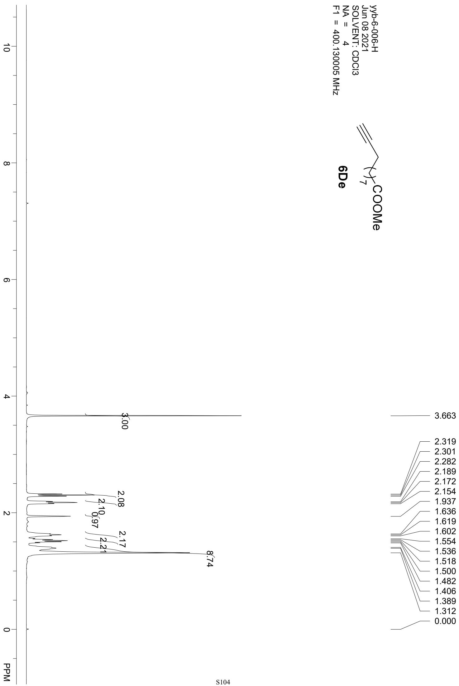

line

| m/z    | Intensity |
| ------ | --------- |
| 8.74   | 100       |
| 3.00   | 100       |
| 2.08   | 100       |
| 2.17   | 100       |
| 2.21   | 100       |
| 2.97   | 100       |
| 3.663  | 100       |

chemical

Chemical structure of a dodecyl ester with a cyclohexene ring and methyl substituent

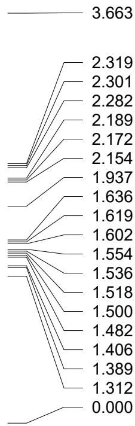

line

| X | Y |
|---|---|
| 0.000 | 0.000 |
| 1.312 | 1.312 |
| 1.389 | 1.389 |
| 1.406 | 1.406 |
| 1.482 | 1.482 |
| 1.500 | 1.500 |
| 1.518 | 1.518 |
| 1.536 | 1.536 |
| 1.554 | 1.554 |
| 1.602 | 1.602 |
| 1.619 | 1.619 |
| 1.636 | 1.636 |
| 1.937 | 1.937 |
| 2.154 | 2.154 |
| 2.172 | 2.172 |
| 2.189 | 2.189 |
| 2.282 | 2.282 |
| 2.301 | 2.301 |
| 2.319 | 2.319 |
| 3.663 | 3.663 |

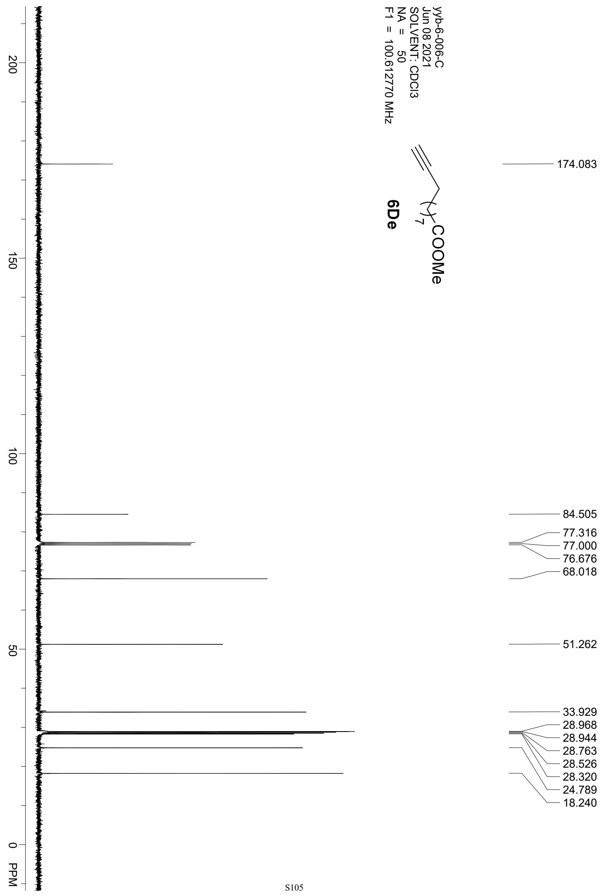

line

| m/z    | Intensity (ppm) |
| ------ | --------------- |
| 18.240 | 0               |
| 24.789 | 0               |
| 28.320 | 0               |
| 28.526 | 0               |
| 28.763 | 0               |
| 28.944 | 0               |
| 28.968 | 0               |
| 33.929 | 0               |
| 51.262 | 0               |
| 68.018 | 0               |
| 76.676 | 0               |
| 77.000 | 0               |
| 77.316 | 0               |
| 84.505 | 0               |
| 174.083| 0               |

chemical

Chemical structure of a molecule with COOMe and 6Dd e groups, featuring a chiral center with methyl substituent

F1 = 100.612770 MHz   
NA = 50   
LVENT: CD   
un 08 20   
yb-6-006-

1 74 . 083

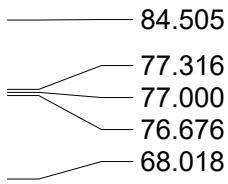

line

| X-Axis Label | Y-Axis Value |
| :--- | :--- |
| 1 | 68.018 |
| 2 | 76.676 |
| 3 | 77.000 |
| 4 | 77.316 |
| 5 | 84.505 |

5 1 . 2 6 2

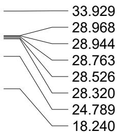

line

| Value |
|---|
| 18.240 |
| 24.789 |
| 28.320 |
| 28.526 |
| 28.763 |
| 28.944 |
| 28.968 |
| 33.929 |

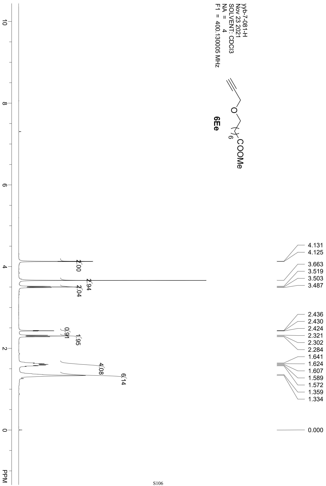

line

| m/z    | Intensity |
| ------ | --------- |
| 0.000  | 0         |
| 1.334  | 0         |
| 1.359  | 0         |
| 1.572  | 0         |
| 1.589  | 0         |
| 1.607  | 0         |
| 1.624  | 0         |
| 1.641  | 0         |
| 2.284  | 0         |
| 2.302  | 0         |
| 2.321  | 0         |
| 2.424  | 0         |
| 2.430  | 0         |
| 2.436  | 0         |
| 3.487  | 0         |
| 3.503  | 0         |
| 3.519  | 0         |
| 3.663  | 0         |
| 4.125  | 0         |
| 4.131  | 0         |

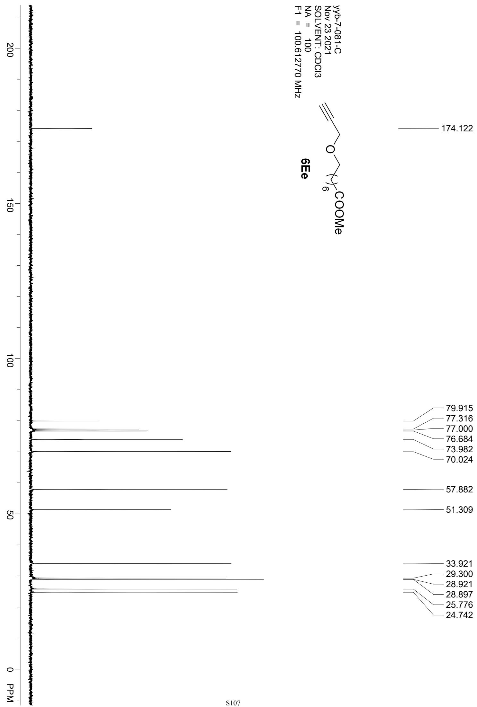

line

| Chemical Shift (δ) | Integration |
| ------------------ | ----------- |
| 24.742             |             |
| 25.776             |             |
| 28.897             |             |
| 28.921             |             |
| 29.300             |             |
| 33.921             |             |
| 51.309             |             |
| 57.882             |             |
| 70.024             |             |
| 73.982             |             |
| 76.684             |             |
| 77.000             |             |
| 77.316             |             |
| 79.915             |             |
| 174.122            |             |

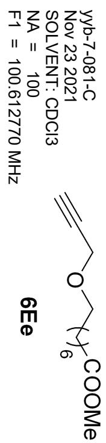

chemical

Chemical structure of a cobalt complex with fluorinated alkene and solvent, labeled as 6Ee

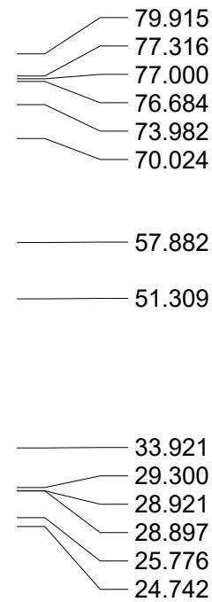

line

| X-Axis Label | Value |
|---|---|
| 1 | 24.742 |
| 2 | 25.776 |
| 3 | 28.897 |
| 4 | 28.921 |
| 5 | 29.300 |
| 6 | 33.921 |
| 7 | 51.309 |
| 8 | 57.882 |
| 9 | 70.024 |
| 10 | 73.982 |
| 11 | 76.684 |
| 12 | 77.000 |
| 13 | 77.316 |
| 14 | 79.915 |

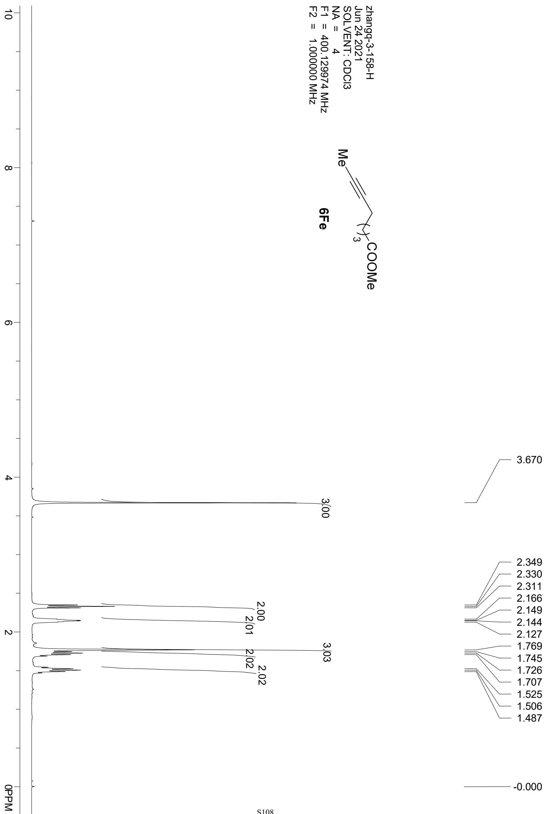

line

| Chemical Shift (ppM) | Integration |
|----------------------|-----------|
| 2.00                 | Me        |
| 2.01                 | Me        |
| 2.02                 | Me        |
| 2.03                 | Me        |
| 3.00                 | Me        |
| 3.670                | Me        |
| 4.00                 | Me        |

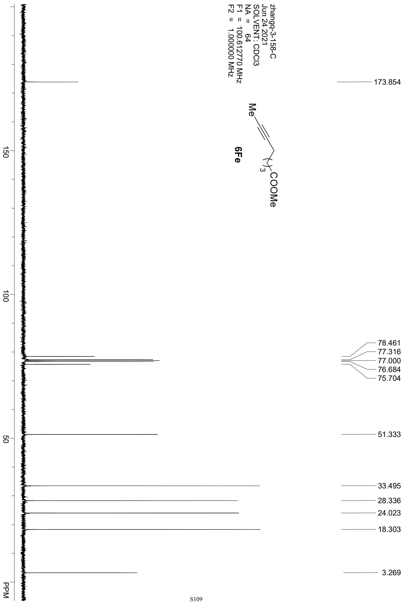

line

| m/z    | Intensity |
| ------ | --------- |
| 3.269  | ~0        |
| 18.303 | ~0        |
| 24.023 | ~0        |
| 28.336 | ~0        |
| 33.495 | ~0        |
| 51.333 | ~0        |
| 75.704 | ~0        |
| 76.684 | ~0        |
| 77.000 | ~0        |
| 77.316 | ~0        |
| 78.461 | ~0        |
| 173.854| ~0        |

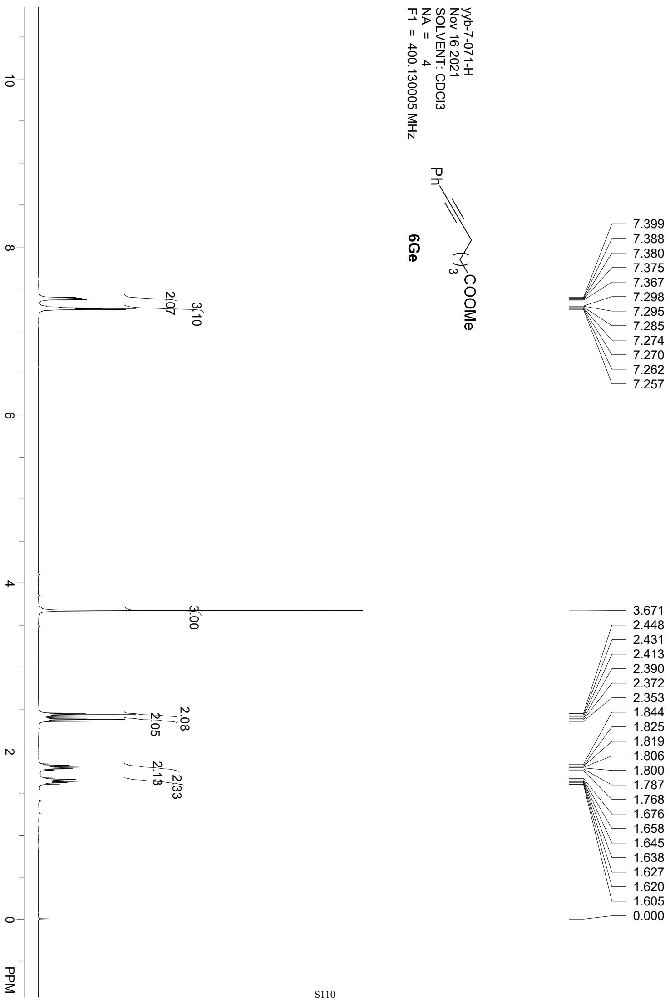

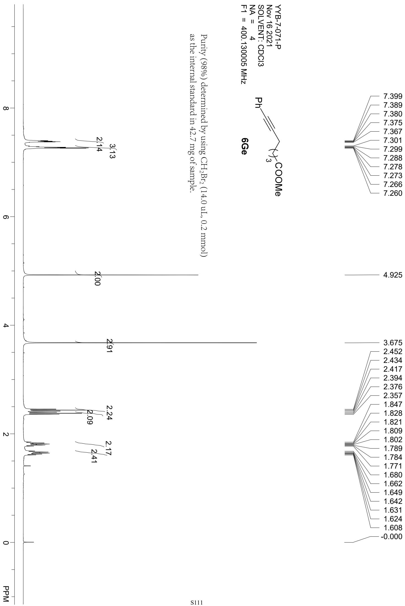

line

| ppm    | Chemical Shift |
| ------ | -------------- |
| 2.09   | 2.17           |
| 2.17   | 2.41           |
| 2.24   | 2.91           |
| 2.91   | 3.13           |
| 3.13   | 3.675          |
| 3.675  | 4.925          |
| 4.925  | 7.260          |

$$
\begin{array}{rl} & {\mathrm{YYB - 7 - 071 - P}}\\ & {\mathrm{NaV162021}} \end{array} \tag{SOLVENT:CDCl3}
$$

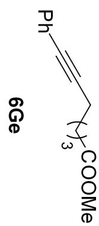

chemical

Chemical structure of a chiral carbon monomer with phenyl group and cyclopentadiene substituent

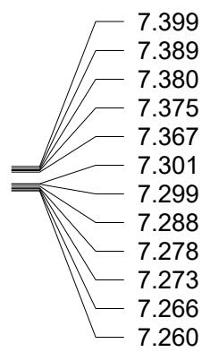

tree

| Node | Value |
|---|---|
| 1 | 7.260 |
| 2 | 7.266 |
| 3 | 7.273 |
| 4 | 7.278 |
| 5 | 7.288 |
| 6 | 7.299 |
| 7 | 7.301 |
| 8 | 7.367 |
| 9 | 7.375 |
| 10 | 7.380 |
| 11 | 7.389 |
| 12 | 7.399 |

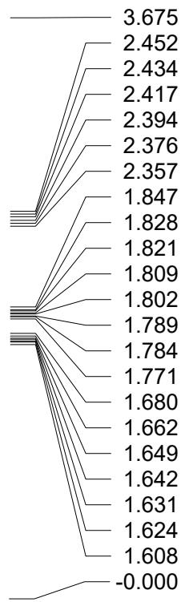

line

| X | Y |
|---|---|
| -0.000 | 1.608 |
| 1.624 | 1.624 |
| 1.631 | 1.631 |
| 1.642 | 1.642 |
| 1.649 | 1.649 |
| 1.662 | 1.662 |
| 1.680 | 1.680 |
| 1.771 | 1.771 |
| 1.784 | 1.784 |
| 1.789 | 1.789 |
| 1.802 | 1.802 |
| 1.809 | 1.809 |
| 1.821 | 1.821 |
| 1.828 | 1.828 |
| 1.847 | 1.847 |
| 2.357 | 2.357 |
| 2.376 | 2.376 |
| 2.394 | 2.394 |
| 2.417 | 2.417 |
| 2.434 | 2.434 |
| 2.452 | 2.452 |
| 3.675 | 3.675 |

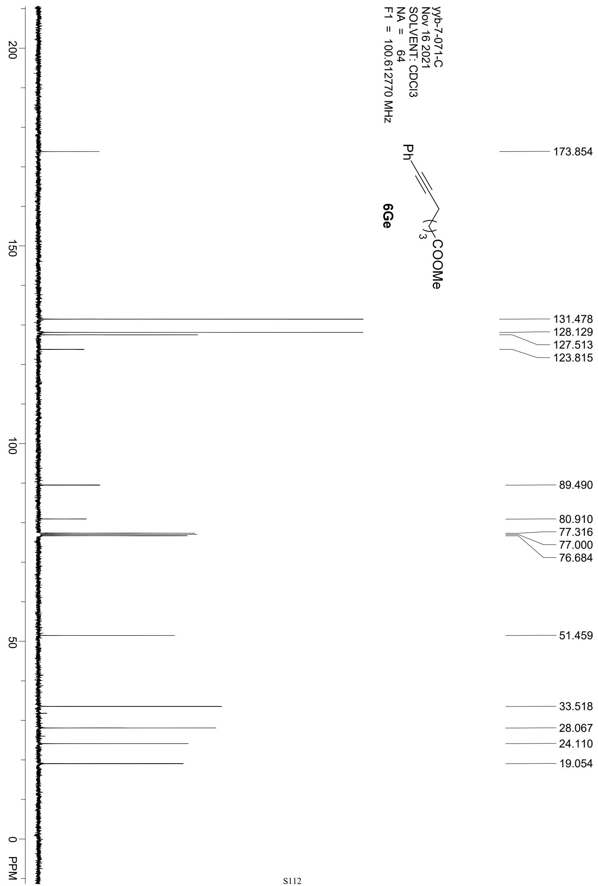

line

| m/z    | Intensity |
| ------ | --------- |
| 19.054 | 0         |
| 24.110 | 0         |
| 28.067 | 0         |
| 33.518 | 0         |
| 51.459 | 0         |
| 76.684 | 0         |
| 77.316 | 0         |
| 80.910 | 0         |
| 89.490 | 0         |
| 123.815| 0         |
| 127.513| 0         |
| 128.129| 0         |
| 131.478| 0         |
| 173.854| 0         |

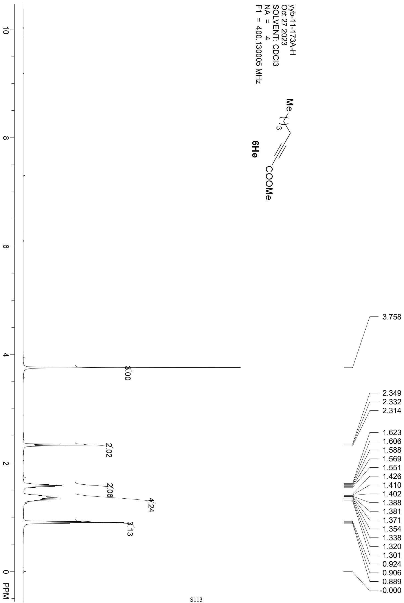

line

| m/z    | Intensity |
| ------ | --------- |
| 3.758  | 6.0       |
| 4.24   | 3.13      |
| 3.00   | 3.00      |
| 2.02   | 2.06      |
| 2.06   | 2.06      |
| 3.13   | 3.13      |
| 3.758  | 3.758     |

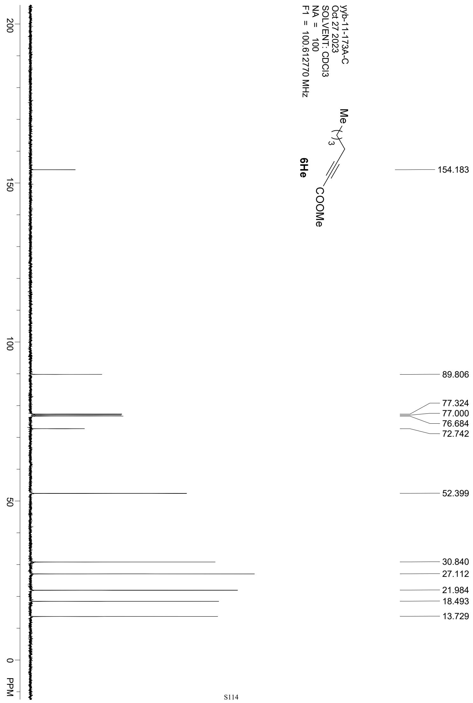

line

| m/z    | Intensity (ppm) |
| ------ | --------------- |
| 13.729 | 0               |
| 18.493 | 0               |
| 21.984 | 0               |
| 27.112 | 0               |
| 30.840 | 0               |
| 52.399 | 0               |
| 72.742 | 0               |
| 76.684 | 0               |
| 77.000 | 0               |
| 77.324 | 0               |
| 89.806 | 0               |
| 154.183| 0               |

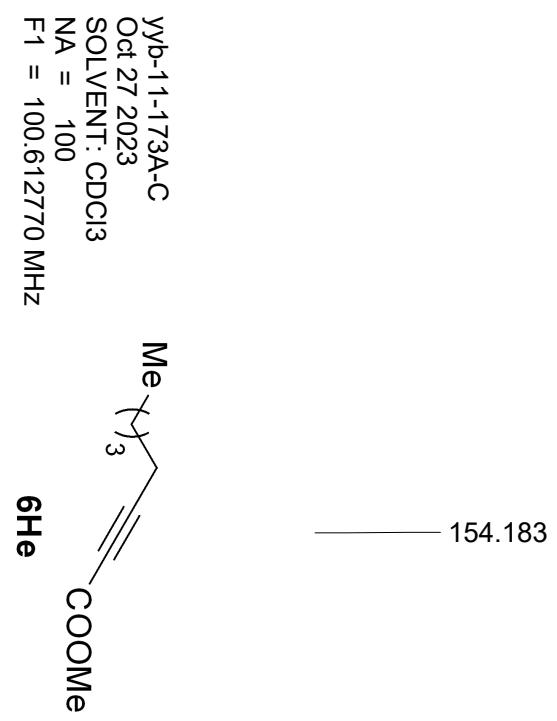

chemical

Chemical structure diagram of a methylene (Me) complex with COOMe and 3, showing molecular formula and chemical parameters

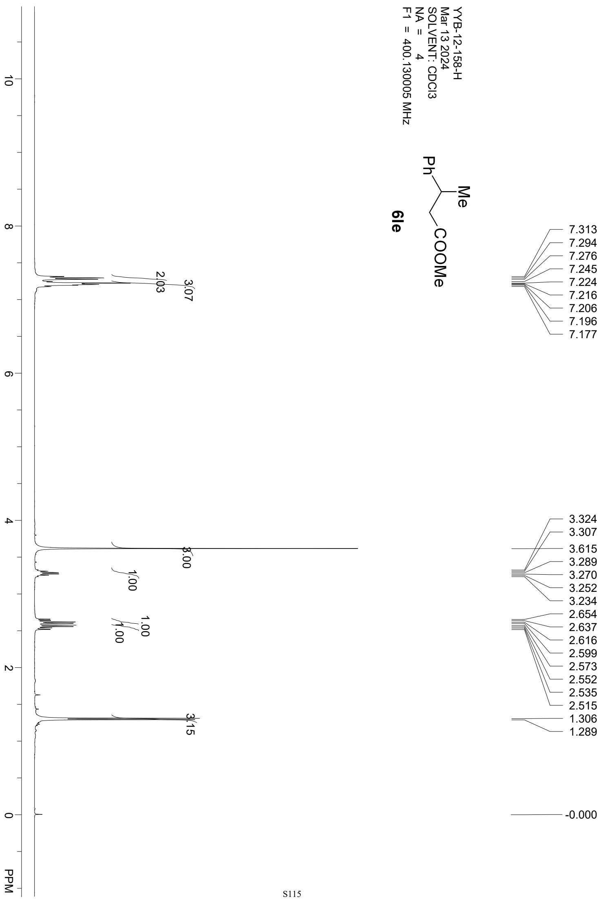

line

YVB-12-158-H
MR 13 2024
SOLVENT: CDCl3
F1 = 400.130005 MHz
NA = 4
MgA = 4
F1 = 400.130005 MHz
MR 13 2024
SOLVENT: CDCl3

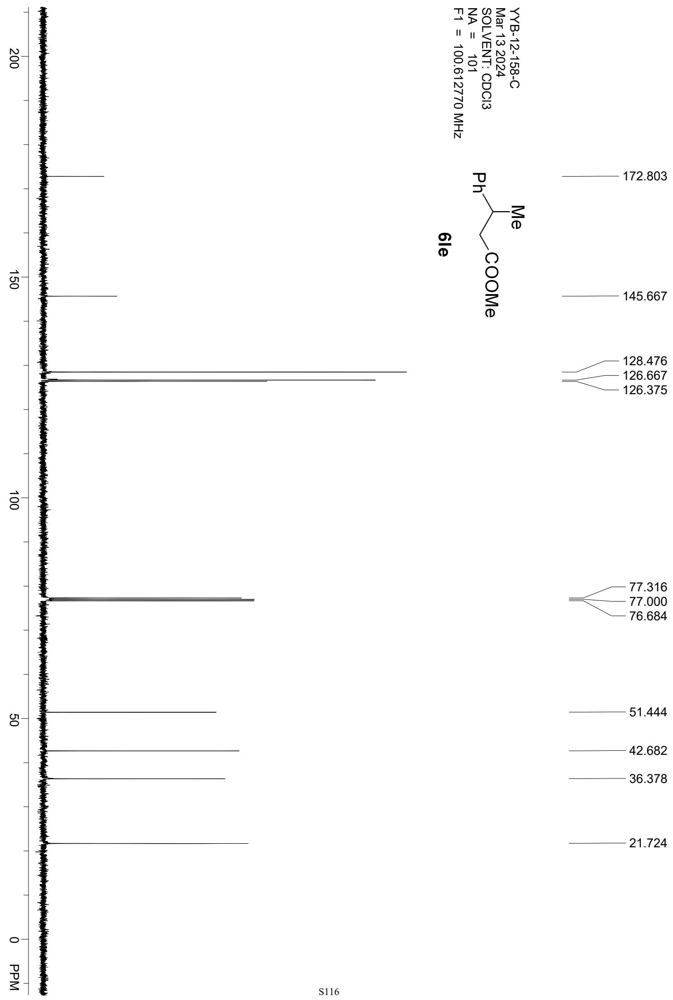

line

| m/z    | Intensity (ppm) |
| ------ | --------------- |
| 21.724 | ~0              |
| 36.378 | ~0              |
| 42.682 | ~0              |
| 51.444 | ~0              |
| 76.684 | ~0              |
| 77.316 | ~0              |
| 126.375 | ~0              |
| 128.476 | ~0              |
| 126.667 | ~0              |
| 145.667 | ~0              |
| 172.803 | ~0              |

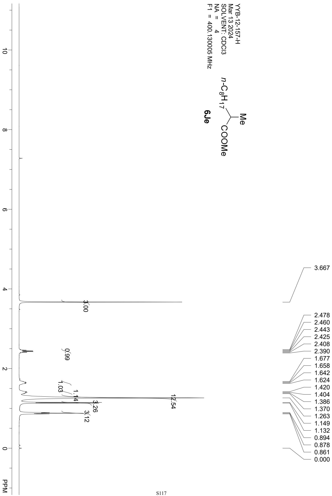

line

| δ    | Intensity |
| ---- | --------- |
| 0.99 | 1.03      |
| 1.03 | 1.14      |
| 1.14 | 1.26      |
| 1.26 | 1.37      |
| 1.37 | 1.40      |
| 1.40 | 1.42      |
| 1.42 | 1.62      |
| 1.62 | 1.64      |
| 1.65 | 1.658     |
| 1.67 | 2.390     |
| 2.390 | 2.408     |
| 2.408 | 2.425     |
| 2.425 | 2.443     |
| 2.43 | 2.460     |
| 2.460 | 2.478     |
| 2.478 | 3.667     |
| 3.00 | —         |
| 3.12 | —         |
| 3.26 | —         |
| 3.54 | —         |
| 3.667 | —         |

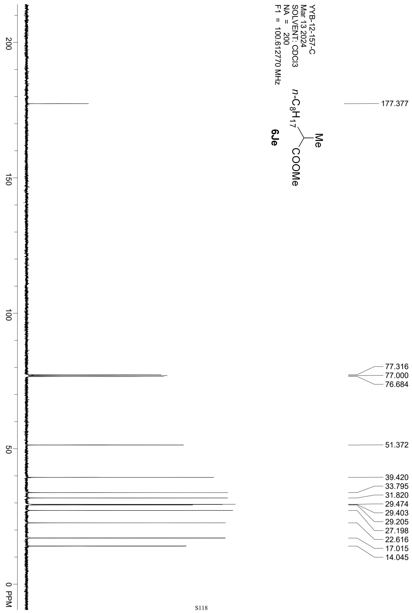

line

| Chemical Shift (ppm) | Integration Value |
|----------------------|-------------------|
| 177.377              | 177.316           |
| 14.045               | 14.045            |
| 17.015               | 17.015            |
| 22.616               | 22.616            |
| 27.198               | 27.198            |
| 29.205               | 29.205            |
| 29.403               | 29.403            |
| 31.820               | 31.820            |
| 33.795               | 33.795            |
| 39.420               | 39.420            |
| 51.372               | 51.372            |
| 76.684               | 76.684            |
| 77.316               | 77.316            |
| 100                  | 100               |
| 150                  | 150               |
| 200                  | 200               |

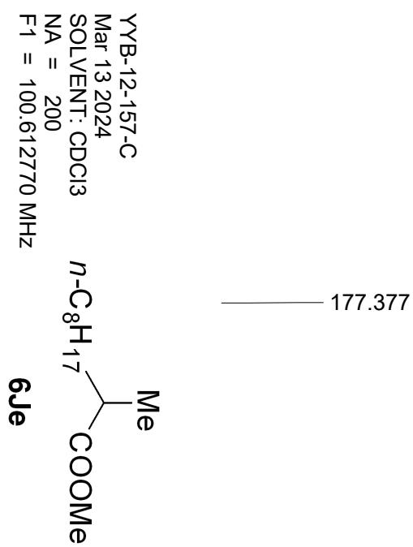

chemical

Chemical structure of a methyl ester compound with molecular formula and reaction conditions

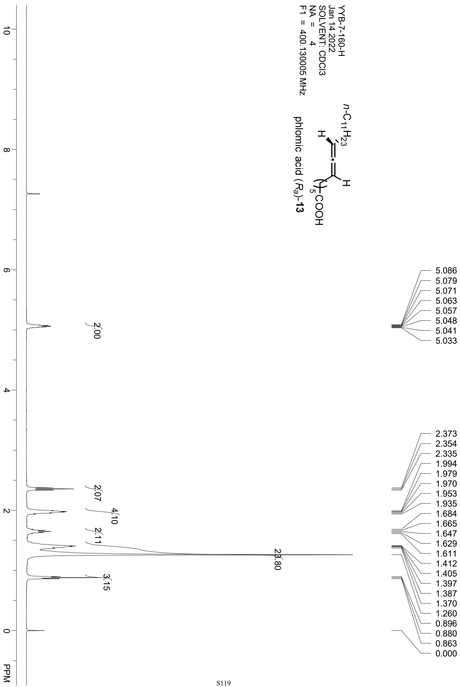

line

| m/z    | Chemical Shift (ppm) |
| ------ | -------------------- |
| 2.580  | 2.580                |
| 3.15   | 3.15                 |
| 4.10   | 4.10                 |
| 2.07   | 2.07                 |
| 2.00   | 2.00                 |
| 2.373  | 2.373                |
| 2.354  | 2.354                |
| 5.033  | 5.033                |
| 5.041  | 5.041                |
| 5.048  | 5.048                |
| 5.057  | 5.057                |
| 5.063  | 5.063                |
| 5.071  | 5.071                |
| 5.079  | 5.079                |
| 5.086  | 5.086                |

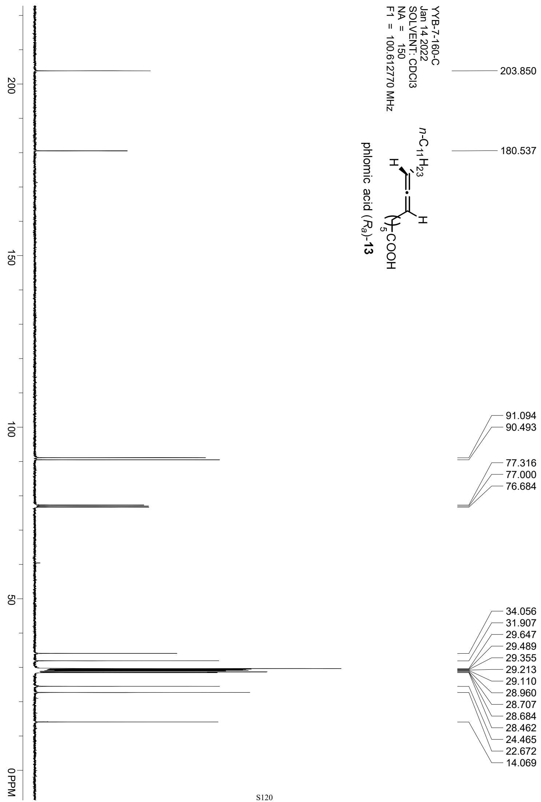

line

| Chemical Shift (ppm) | Integration |
|----------------------|-----------|
| 14.069               | -         |
| 22.672               | -         |
| 24.465               | -         |
| 28.462               | -         |
| 28.684               | -         |
| 28.707               | -         |
| 28.960               | -         |
| 29.110               | -         |
| 29.213               | -         |
| 29.355               | -         |
| 29.489               | -         |
| 29.647               | -         |
| 31.907               | -         |
| 34.056               | -         |
| 76.684               | -         |
| 77.316               | -         |
| 90.493               | -         |
| 91.094               | -         |
| 180.537              | -         |
| 203.850              | -         |

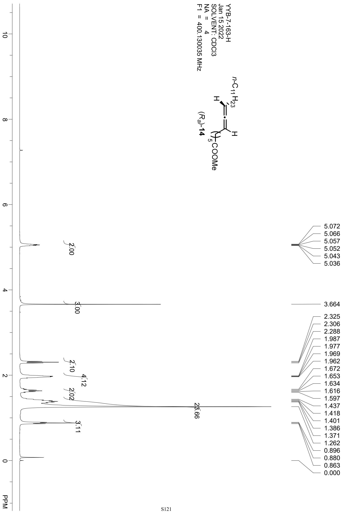

line

| m/z    | Intensity |
| ------ | --------- |
| 2.566  | 2.566     |
| 3.00   | 3.00      |
| 3.11   | 3.11      |
| 3.664  | 3.664     |
| 5.072  | 5.072     |
| 5.036  | 5.036     |
| 5.043  | 5.043     |
| 5.057  | 5.057     |
| 5.066  | 5.066     |
| 5.092  | 5.092     |
| 5.12   | 5.12      |
| 5.18   | 5.18      |
| 5.23   | 5.23      |
| 5.3    | 5.3       |
| 5.4    | 5.4       |
| 5.5    | 5.5       |
| 5.6    | 5.6       |
| 5.7    | 5.7       |
| 5.8    | 5.8       |
| 5.9    | 5.9       |
| 6.0    | 6.0       |
| 6.1    | 6.1       |
| 6.2    | 6.2       |
| 6.3    | 6.3       |
| 6.4    | 6.4       |
| 6.5    | 6.5       |
| 6.6    | 6.6       |
| 6.7    | 6.7       |
| 6.8    | 6.8       |
| 6.9    | 6.9       |
| 7.0    | 7.0       |
| 7.1    | 7.1       |
| 7.2    | 7.2       |
| 7.3    | 7.3       |
| 7.4    | 7.4       |
| 7.5    | 7.5       |
| 7.6    | 7.6       |
| 7.7    | 7.7       |
| 7.8    | 7.8       |
| 7.9    | 7.9       |
| 8.0    | 8.0       |
| 8.1    | 8.1       |
| 8.2    | 8.2       |
| 8.3    | 8.3       |
| 8.4    | 8.4       |
| 8.5    | 8.5       |
| 8.6    | 8.6       |
| 8.7    | 8.7       |
| 8.8    | 8.8       |
| 8.9    | 8.9       |
| 9.0    | 9.0       |
| 9.1    | 9.1       |
| 9.2    | 9.2       |
| 9.3    | 9.3       |
| 9.4    | 9.4       |
| 9.5    | 9.5       |
| 9.6    | 9.6       |
| 9.7    | 9.7       |
| 9.8    | 9.8       |
| 9.9    | 9.9       |
| 10.0   | 10.0      |

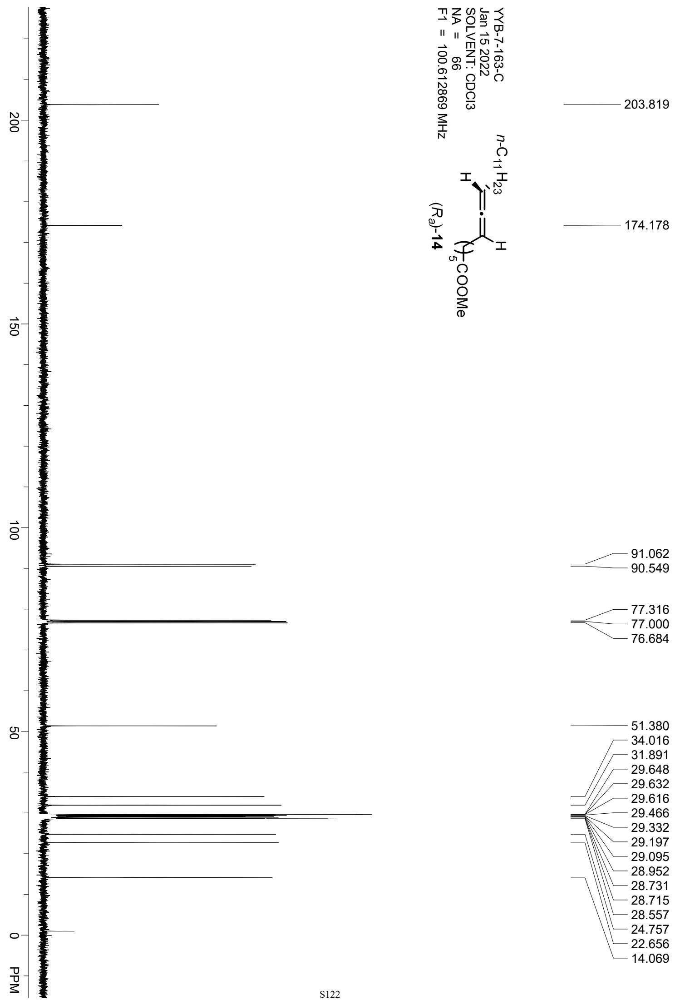

line

| Chemical Shift (δ, ppm) | Integration |
| ------------------------ | ----------- |
| 14.069                   |             |
| 22.656                   |             |
| 24.757                   |             |
| 28.557                   |             |
| 28.715                   |             |
| 28.731                   |             |
| 28.952                   |             |
| 29.095                   |             |
| 29.197                   |             |
| 29.332                   |             |
| 29.466                   |             |
| 29.616                   |             |
| 29.632                   |             |
| 29.648                   |             |
| 31.891                   |             |
| 34.016                   |             |
| 51.380                   |             |
| 76.684                   |             |
| 77.316                   |             |
| 90.549                   |             |
| 91.062                   |             |
| 174.178                  |             |
| 203.819                  |             |

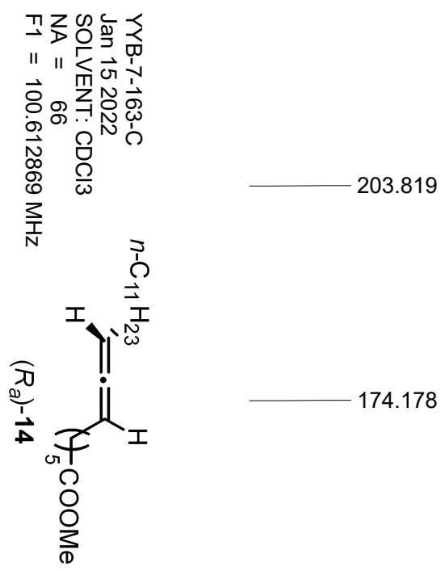

chemical

Chemical structure of a chiral molecule with Rg-14 substituent, showing stereochemistry and reaction conditions

sample yyb-7-163-LC-100-0-1.5-214

Data file: C:\Users\Public\Documents\ChemStation\1\Data\zhangq 2022-01-18 08-52-28\016-P2-E2-yyb-7- 163.D

Acquisition Data:   
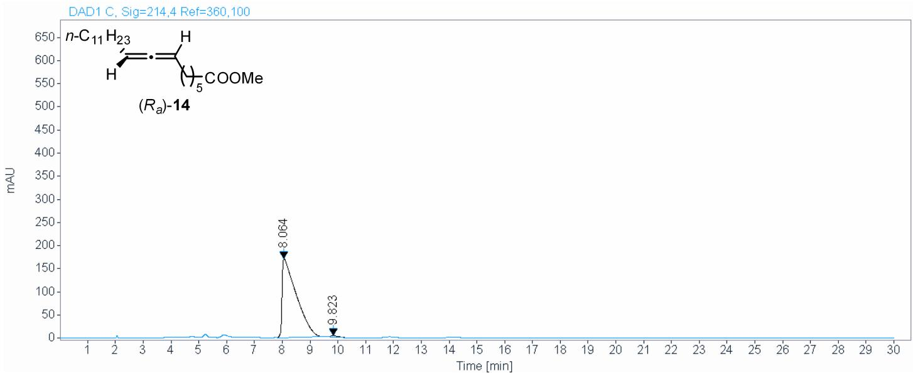

line

| Time [min] | mAU   |
| ---------- | ----- |
| 8.064      | 180   |
| 9.823      | 10    |

Signal: DAD1 C, Sig=214,4 Ref=360,100 

<table><tr><td>RT [min]</td><td>Width [min]</td><td>Height</td><td>Area</td><td>Area%</td></tr><tr><td>8.064</td><td>0.4733</td><td>170.6460</td><td>6073.9258</td><td>98.7344</td></tr><tr><td>9.823</td><td>0.3083</td><td>3.0251</td><td>77.8547</td><td>1.2656</td></tr><tr><td></td><td></td><td>Sum</td><td>6151.7805</td><td>100.0000</td></tr></table>

sample yyb-7-163-rac-LC-100-0-1.5-214

Data file: C:\Users\Public\Documents\ChemStation\1\Data\zhangq 2022-01-18 08-52-28\015-P2-E1-yyb-7- 163-rac.D

Acquisition Data:   
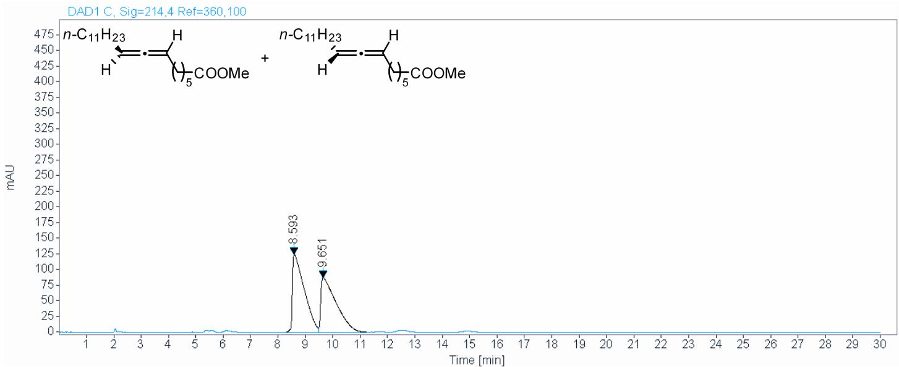

line

| Compound     | mAU    |
| ------------ | ------ |
| n-C₁₁H₂₃     | 450    |
| n-C₁₁H₂₃ +   | 450    |
| n-C₁₁H₂₃ +   | 125    |
| n-C₁₁H₂₃ +   | 90     |

Signal: DAD1 C, Sig=214,4 Ref=360,100 

<table><tr><td>RT [min]</td><td>Width [min]</td><td>Height</td><td>Area</td><td>Area%</td></tr><tr><td>8.593</td><td>0.4101</td><td>124.8337</td><td>3788.8767</td><td>52.3920</td></tr><tr><td>9.651</td><td>0.5235</td><td>87.4124</td><td>3442.9060</td><td>47.6080</td></tr><tr><td></td><td></td><td>Sum</td><td>7231.7827</td><td>100.0000</td></tr></table>