Check for updates

Cite this: Chem. Commun., 2024,

60, 6272

Received 18th March 2024,

Accepted 22nd April 2024

DOI: 10.1039/d4cc01234h

rsc.li/chemcomm

# Iron-catalyzed aerobic oxidation of silyl ethers to carboxylic acids†

Zuizhi Linab and Shengming Ma \*acd

Direct aerobic oxidation of silyl ethers to carboxylic acids has been developed. The mild reaction conditions lead to a broad range of functional group compatibility. Different types of silyl groups have been investigated and selective deprotective oxidation has been realized. The reaction could be conducted under air.

The hydroxy group is a versatile reactive functional group, and silyl groups are commonly used for protecting this functionality aimed at targeted transformations, which would be followed by deprotective oxidation in organic synthesis (Scheme 1A).1,2 Catalytic aerobic oxidation has been developed for the deprotective oxidation of silyl ethers to afford aldehydes and ketones.3 The pioneering preparation of carboxylic acids directly from silyl ethers generally lacks efficiency or suffers from functional group tolerance (Scheme 1B).4–6 Moreover, apart from TMS and TBS ethers, the performance of other popular silyl ethers in catalyzed aerobic oxidation remains unknown. Herein, we report the ironcatalyzed aerobic oxidation of silyl ethers forming carboxylic acids using TEMPO or 4-OH-TEMPO as a co-catalyst (Scheme 1C). Under mild reaction conditions, a broad range of functional groups such as halogen, ether, tosylate, and ester have been tolerated and the highly selective deprotective oxidation of different silyl ethers has been realized.

By using 1-octyl tert-butyldimethylsilylether 1aa as the model substrate, our investigation began with the evaluation of solvents: with 10 mol% of $\mathrm { F e } ( \mathrm { N O } _ { 3 } ) _ { 3 } { \cdot } 9 \mathrm { H } _ { 2 } \mathrm { O }$ as the catalyst, and TEMPO and KCl as the co-catalysts. Reactions in DCM, DCE, or

a State Key Laboratory of Organometallic Chemistry, Shanghai Institute of Organic Chemistry, Chinese Academy of Sciences, 345 Lingling Lu, Shanghai 200032, P. R. China. E-mail: masm@sioc.ac.cn

b University of Chinese Academy of Sciences, Beijing 100049, P. R. China

c Research Center for Molecular Recognition and Synthesis, Department of Chemistry, Fudan University, 220 Handan Lu, Shanghai 200433, P. R. China

d Laboratory of Molecular Recognition and Synthesis, Department of Chemistry Zhejiang University Hangzhou, Zhejiang 310027, P. R. China

† Electronic supplementary information (ESI) available: General experimental procedures, characterization data, and copies of NMR spectra. See DOI: https:// doi.org/10.1039/d4cc01234h

toluene at room temperature for 21 hours hardly or did not give octanoic acid 2a (Table 1, entries 1–3).7 To our delight, the reaction in MeCN or DME gave 82% or 22% NMR yield, respectively (Table 1, entries 4 and 5). The formation of 2a in 88% NMR yield was detected when using THF as the solvent (Table 1, entry 6). Replacing TEMPO with 4-OH-TEMPO gave a similar yield, while NHPI failed to promote the reaction (Table 1, entries 7 and 8). Considering the cost, 4-OH-TEMPO was chosen as the co-catalyst. Noteworthily, the formation of octyl octanoate in 4% NMR yield was observed in the experiment of entry 7, which must be attributed to the high concentration of the substrate. Running at a lower concentration of 1aa in THF at 25 1C for 32 hours exclusively gave the desired product 2a in 92% NMR yield (Table 1, entry 9). No product was detected using FeCl3 or $\mathrm { F e C l } _ { 3 } { \cdot } 6 \mathrm { H } _ { 2 } \mathrm { O }$ as the catalyst; among the nitrates, only $\mathrm { F e } ( \mathrm { N O } _ { 3 } ) _ { 3 } { \cdot } 9 \mathrm { H } _ { 2 } \mathrm { O }$ and $\mathbf { B i } \left( \mathbf { N O } _ { 3 } \right) _ { 3 } { \boldsymbol { \cdot } } 5 \mathbf { H } _ { 2 } \mathbf { O }$ worked and $\mathrm { F e } ( \mathrm { N O } _ { 3 } ) _ { 3 } { \cdot } 9 \mathrm { H } _ { 2 } \mathrm { O }$ was more efficient (for details, see ESI† Table S1). Control experiments showed the necessity of both $\mathrm { F e } ( \mathrm { N O } _ { 3 } ) _ { 3 } { \cdot } 9 \mathrm { H } _ { 2 } \mathrm { O }$ and 4-OH-TEMPO (Table 1, entries 10 and 11). In the absence of KCl, a lower yield of 2a was obtained (Table 1, entry 12).

A. application of silyl protecting group in organic synthesis   
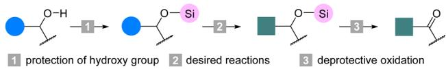

chemical

Chemical reaction pathway showing hydroxy group protection, desired reactions, and deprotective oxidation steps

B. previous reports: catalyzed aerobic oxidation of silyl ethers

(a) Ahmad Shaabani, 2008   
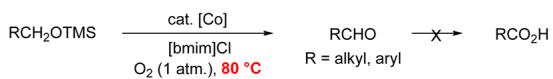

chemical

Chemical reaction scheme showing conversion of RCH2OTMS to RCHO and then to RCO2H using [bmim]Cl and O2 at 80°C

(b) Babak Karimi, 2004

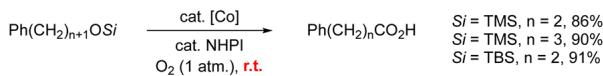

chemical

Chemical reaction scheme showing conversion of Ph(CH2)n+1OSi to Ph(CH2)nCO2H with yield and enantiomeric excess data

(c) Foad Kazemi, 2020   
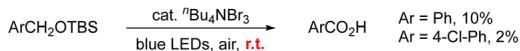

C. this work: iron-catalyzed aerobic oxidation of silyl ethers to obtain carboxylic acids   
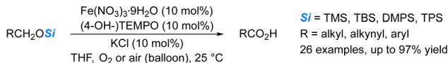

chemical

Chemical reaction scheme showing Fe(NO3)3·9H2O and RCO2H as reactants with specified reagents and conditions

Scheme 1 Deprotective oxidation of silyl ethers.

Table 1 Optimization of the reaction conditionsa 

<table><tr><td></td><td>n-C8H17OTBS 1aa 5.0 mmol</td><td colspan="2">Fe(NO3)3·9H2O (10 mol%) co-catalyst (10 mol%) KCl (10 mol%) solvent (1.2 mL) O2 (balloon), time, r.t.</td><td colspan="2">n-C7H15CO2H 2a</td></tr><tr><td>Entry</td><td>Co-catalyst</td><td>Solvent</td><td>Time (h)</td><td>Yield of 2ab (%)</td><td>Recovery of 1aab (%)</td></tr><tr><td>1</td><td>TEMPO</td><td>DCM</td><td>21</td><td>4</td><td>56</td></tr><tr><td>2</td><td>TEMPO</td><td>DCE</td><td>21</td><td>0</td><td>100</td></tr><tr><td>3</td><td>TEMPO</td><td>Toluene</td><td>21</td><td>0</td><td>100</td></tr><tr><td>4</td><td>TEMPO</td><td>MeCN</td><td>21</td><td>82</td><td>0</td></tr><tr><td>5</td><td>TEMPO</td><td>DME</td><td>21</td><td>22</td><td>48</td></tr><tr><td>6</td><td>TEMPO</td><td>THF</td><td>21</td><td>88</td><td>0</td></tr><tr><td>7</td><td>4-OH-TEMPO</td><td>THF</td><td>21</td><td>88 (84c)</td><td>0</td></tr><tr><td>8</td><td>NHPI</td><td>THF</td><td>21</td><td>0</td><td>57</td></tr><tr><td>9d</td><td>4-OH-TEMPO</td><td>THF</td><td>32</td><td>92</td><td>0</td></tr><tr><td>10e</td><td>4-OH-TEMPO</td><td>THF</td><td>21</td><td>0</td><td>100</td></tr><tr><td>11f</td><td>—</td><td>THF</td><td>21</td><td>0</td><td>41</td></tr><tr><td>12g</td><td>4-OH-TEMPO</td><td>THF</td><td>21</td><td>60</td><td>8</td></tr></table>

a Reaction conditions: 1aa (5.0 mmol), $\mathrm { F e } ( \mathrm { N O } _ { 3 } ) _ { 3 } { \cdot } 9 \mathrm { H } _ { 2 } \mathrm { O }$ (10 mol%), cocatalyst (10 mol%), KCl (10 mol%), and ${ \bf O } _ { 2 }$ (balloon) in solvent (1.2 mL) at room temperature. b Determined by 1 H NMR analysis using $\mathrm { C H } _ { 2 } \mathrm { B r } _ { 2 }$ as the internal standard. c Isolated yield. $^ { d }$ Reaction was conducted using 1aa (1.0 mmol) in 1.0 mL of THF at $2 5 ~ ^ { \circ } \mathrm { C } , \ ^ { \epsilon }$ e Without $\mathrm { F e } ( \mathrm { N O } _ { 3 } ) _ { 3 }$ - $9 \mathrm { H } _ { 2 } \mathrm { O } . ^ { f }$ Without 4-OH-TEMPO. g Without KCl.

To uncover the nature of this deprotective oxidation, different silyl ethers were first evaluated. TBS and TMS ethers, which were frequently used in organic synthesis, smoothly went through deprotective oxidation and gave octanoic acid 2a in 84% yield and 77% yield, respectively (Table 2, entries 1 and 2). The reactions of DMPS or TPS ethers are much slower, giving octanoic acid 2a in 90% or 74% yield, respectively (Table $^ { 2 , }$ entries 3 and 4). Substrates with a halogen (1da, 1ea), ether (1fa, 1ga), tosylate (1ha), ester (1ia), carbon–carbon triple bond (1ja), and thienyl (1ka) were all tolerated, affording the corresponding carboxylic acids 2d–2k in moderate to good yields (Table 2, entries 7–14). In the presence of TEMPO, tert-butyldimethyl-(4- nitrobenzyl-oxy)silane 1la was transformed to 4-nitrobenzoic acid 2l successfully in a mixed solvent (Table 2, entry 15).

TBDPS and TIPS ethers were rather stable and mostly recovered after 59 hours under the standard reaction conditions (Table $^ { 3 , }$ entries 1 and 2). In substrates with more than one type of silyl groups, TMS, TBS, DMPS, and TPS ethers underwent the deprotective oxidation, while TBDPS or TIPS groups in the same molecule remained untouched (Table 3, entries 3–8). This deprotective selectivity suggested the potential value of this protocol in organic synthesis.

Using TEMPO as the co-catalyst, the deprotective oxidation of silyl ethers could also be carried out in air. Substrates containing 3-phenylpropyl (1ca), ether $( \bf { 1 9 2 } ) ,$ a carbon–carbon triple bond (1ja), and thienyl (1ka) were tolerated and gave yields up to 97% (Table 4, entries 1–4). The selective deprotective

Table 2 The substrate scopea 

<table><tr><td></td><td>RCH2OSi1</td><td>Fe(NO3)3·9H2O (10 mol%)4-OH-TEMPO (10 mol%)KCl (10 mol%)O2(balloon), THF, time, 25 °C</td><td>RCO2H2</td><td></td></tr><tr><td>Entry</td><td>Substrate</td><td>Product</td><td>Time(h)</td><td>Yield(%)</td></tr><tr><td>1b</td><td>n-C8H17OTBS (1aa)</td><td>n-C7H15CO2H (2a)</td><td>21</td><td>84</td></tr><tr><td>2</td><td>n-C8H17OTMS (1ab)</td><td>(2a)</td><td>24</td><td>77</td></tr><tr><td>3</td><td>n-C8H17ODMPS (1ac)</td><td>(2a)</td><td>50</td><td>90</td></tr><tr><td>4</td><td>n-C8H17OTPS (1ad)</td><td>(2a)</td><td>59</td><td>74</td></tr><tr><td>5cd</td><td>n-C15H31OTBS (1ba)</td><td>n-C14H29CO2H (2b)</td><td>45</td><td>89</td></tr><tr><td>6</td><td>Ph(CH2)3OTBS (1ca)</td><td>Ph(CH2)2CO2H (2c)</td><td>69</td><td>70</td></tr><tr><td>7</td><td>Cl(CH2)6OTBS (1da)</td><td>Cl(CH2)5CO2H (2d)</td><td>64</td><td>74</td></tr><tr><td>8</td><td>Br(CH2)9OTBS (1ea)</td><td>Br(CH2)8CO2H (2e)</td><td>71</td><td>86</td></tr><tr><td>9d</td><td>BnO(CH2)3OTBS (1fa)</td><td>BnO(CH2)2CO2H (2f)</td><td>53</td><td>63</td></tr><tr><td>10</td><td>n-C6H13O(CH2)2OTBS (1ga)</td><td>n-C6H13OCH2CO2H (2g)</td><td>63</td><td>69</td></tr><tr><td>11</td><td>TsO(CH2)2OTBS (1ha)</td><td>TsOCH2CO2H (2h)</td><td>60</td><td>57</td></tr><tr><td>12d</td><td>MeO2C(CH2)5OTBS (1ia)</td><td>MeO2C(CH2)4CO2H (2i)</td><td>35</td><td>75</td></tr><tr><td>13</td><td>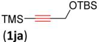</td><td>TMS-≡CO2H(2j)</td><td>65</td><td>59</td></tr><tr><td>14</td><td>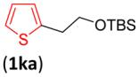</td><td>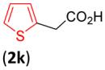</td><td>70</td><td>37</td></tr><tr><td>15e</td><td>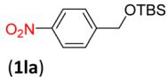</td><td>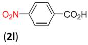</td><td>60</td><td>76</td></tr></table>

a Reaction conditions: 1 (1.0 mmol), $\mathrm { F e } ( \mathrm { N O } _ { 3 } ) _ { 3 } { \cdot } 9 \mathrm { H } _ { 2 } \mathrm { O }$ (10 mol%), 4-OH-TEMPO (10 mol%), KCl (10 mol%), and ${ \dot { \bf O } } _ { 2 }$ (balloon) in THF (1.0 mL) at $2 5 ~ ^ { \circ } \mathbf { C } . ~ ^ { b }$ Reaction was conducted using 1aa (5.0 mmol) in THF (1.2 mL) at room temperature. $\mathrm { \mathrm { ~ \bar { ~ } F e ( N O _ { 3 } ) _ { 3 } { \cdot } 9 H _ { 2 } \mathrm { \bar { O } } } }$ (20 mol%) was used. d 4-OH-TEMPO (20 mol%) was used. e TEMPO (10 mol%) was used, with THF (0.5 mL) and DCE (0.5 mL) as the solvent.

oxidation of 3aeb could also be realized, forming 4ae in 73% yield (Table 4, entry 5).

Table 3 Selective deprotective oxidationa 

<table><tr><td colspan="2"> $Si^{1}O(CH_{2})_{n}OSi^{2}$ 3</td><td>Fe(NO3)3·9H2O (10 mol%)4-OH-TEMPO (10 mol%)KCl (10 mol%)O2(balloon), THF, time, 25 °C</td><td colspan="2"> $Si^{1}O(CH_{2})_{n-1}CO_{2}H$ 4</td></tr><tr><td>Entry</td><td>Substrate</td><td>Product</td><td>Time(h)</td><td>Yield(%)</td></tr><tr><td>1</td><td> $n-C_{8}H_{17}OTBDPS$  (1ae)</td><td>—</td><td>59</td><td>0(99b)</td></tr><tr><td>2</td><td> $n-C_{8}H_{17}OTIPS$  (1af)</td><td>—</td><td>59</td><td>0(92b)</td></tr><tr><td>3</td><td>TBDPSO(CH2)6OTBS (3aea)</td><td>TBDPSO(CH2)5CO2H(4ae)</td><td>42</td><td>74</td></tr><tr><td>4</td><td>TBDPSO(CH2)6OTMS(3aeb)</td><td>(4ae)</td><td>69</td><td>87</td></tr><tr><td>5</td><td>TBDPSO(CH2)6ODMPS(3aec)</td><td>(4ae)</td><td>47</td><td>67</td></tr><tr><td>6</td><td>TBDPSO(CH2)6OTPS (3aed)</td><td>(4ae)</td><td>91</td><td>65</td></tr><tr><td>7</td><td>TIPSO(CH2)6ODMPS (3afc)</td><td>TIPSO(CH2)5CO2H (4af)</td><td>49</td><td>48</td></tr><tr><td>8</td><td>TIPSO(CH2)5ODMPS (3bfc)</td><td>TIPSO(CH2)4CO2H (4bf)</td><td>64</td><td>58</td></tr></table>

a Reaction conditions: 1 or 3 (1.0 mmol), Fe(NO ) -9H O (10 mol%), 4-OH-TEMPO (10 mol%), KCl (10 mol%), and ${ \bf O } _ { 2 }$ (balloon) in THF (1.0 mL) at $2 5 ~ ^ { \circ } \mathbf { C } . ^ { \textit { b } }$ Recovery of 1 was determined $\mathrm { { b y } ^ { 1 } \mathrm { { H } } }$ NMR analysis with $\mathrm { C H } _ { 2 } \mathrm { B r } _ { 2 }$ as an internal standard.

Table 4 Deprotective oxidation in aira 

<table><tr><td>Entry</td><td>Substrate</td><td>Product</td><td>Time (h)</td><td>Yield (%)</td></tr><tr><td>1</td><td> $Ph(CH_2)_3OTBS$  (1ca)</td><td> $Ph(CH_2)_2CO_2H$  (2c)</td><td>94</td><td>97 ( $63^b$ )</td></tr><tr><td>2</td><td> $n-C_6H_{13}O(CH_2)_2OTBS$  (1ga)</td><td> $n-C_6H_{13}OCH_2CO_2H$  (2g)</td><td>72</td><td>70 ( $72^b$ )</td></tr><tr><td>3</td><td> (1ja)</td><td>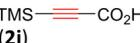</td><td>47</td><td>80</td></tr><tr><td>4</td><td> (1ka)</td><td>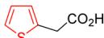 (2k)</td><td>110</td><td>58</td></tr><tr><td>5</td><td> $TBDPSO(CH_2)_6OTMS$  (3aeb)</td><td> $TBDPSO(CH_2)_5CO_2H$  (4ae)</td><td>24</td><td>73</td></tr></table>

a Reaction conditions: 1 or 3 (1.0 mmol), $\mathrm { F e } ( \mathrm { N O } _ { 3 } ) _ { 3 } { \cdot } 9 \mathrm { H } _ { 2 } \mathrm { O }$ (10 mol%), TEMPO (10 mol%), KCl (10 mol%), and air (balloon) in THF (1.0 mL) at $2 5 ~ ^ { \circ } \mathbf { C } . ~ ^ { b }$ 4-OH-TEMPO instead of TEMPO was used and the NMR yield was determined by 1 H NMR analysis with $\mathrm { C H } _ { 2 } \mathrm { B r } _ { 2 }$ as an internal standard.

Formal syntheses of bioactive molecules $\mathbf { 1 0 } ^ { 8 }$ and ${ \bf 1 1 } ^ { 9 }$ were achieved to demonstrate the practicality of this deprotective oxidation protocol. Cyclization of phenol 5 with methyl 3- methyl-2-butenoate (6) in methanesulfonic acid gave lactone 7 in 52% yield. The reaction of 7 with lithium aluminum hydride quantitatively afforded the phenol–alkanol 8. TBS was chosen to protect the alcoholic hydroxy group of 8. The esterification of the phenolic hydroxyl group of 9 with acetic anhydride or the corresponding acyl chloride formed 1ma and 1na, which were conveniently transformed to the carboxylic acids 2m and 2n by this deprotective oxidation in 70% and 60% yields, respectively. When TEMPO was used instead of 4-OH-TEMPO, the desired products 2m and 2n were both obtained in higher yields (Scheme 2).

Based on our previous study,7 we tentatively propose a plausible mechanism (Scheme 3): the silyl ether is hydrolyzed in the presence of $\mathrm { F e } ^ { 3 + }$ and $_ { \mathrm { H } _ { 2 } \mathrm { O } }$ to produce the alcohol Int1, which was observed in the control experiment (Table 1, entry 11). Int1 would be oxidized by $\mathrm { F e } ^ { 3 + }$ and (4-OH-)TEMPO to obtain the aldehyde Int2 with the formation of $\mathrm { F e } ^ { 2 + }$ and (4-OH-)TEMPOH. The hydrate of Int2, Int3, is further oxidized to the carboxylic acid. (4-OH-)TEMPOH could convert back to (4-OH-)TEMPO in its reaction with $\mathrm { F e } ^ { 3 + }$ . The $\mathrm { F e } ^ { 2 + }$ would be oxidized back to $\mathrm { F e } ^ { 3 + }$ by $\Nu { 0 _ { 2 } }$ affording $\mathrm { N O } ,$ which would further react with ${ \bf O } _ { 2 }$ to regenerate $\mathrm { N O } _ { 2 } .$ .

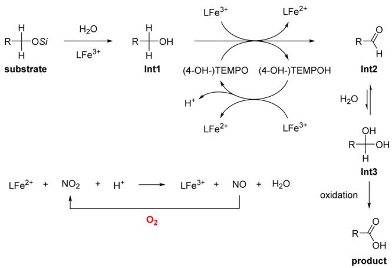

chemical

Reaction mechanism diagram showing oxidation and product formation of Int3 from substrate, including intermediates Int1 and Int2 with reagents like H2O, LFe³⁺, and O₂.

Scheme 3 Plausible mechanism.

In summary, $\mathbf { a _ { \alpha } F e ( N O _ { 3 } ) _ { 3 } . 9 H _ { 2 } O }$ and (4-OH-)TEMPO-catalyzed aerobic deprotective oxidation has been developed. Highly selective deprotective oxidation of different silyl ethers has also been uncovered: TMS, TBS, DMPS, and TPS ethers underwent the deprotective oxidation; while TBDPS or TIPS ethers in the same molecule did not. The synthetic potential of this protocol has been demonstrated through the formal syntheses of bioactive molecules 10 and 11. Further studies on the mechanism and applications are ongoing in our laboratory.

Financial support from the National Key R&D Program of China (No. 2022YFA1503200) and the National Natural Science Foundation of China (No. 21988101) is greatly appreciated. We also thank Sheng Jiang in our group for reproducing the results of 2d in Table $^ { 2 , }$ 4af in Table $^ { 3 , }$ and 2k in Table 4.

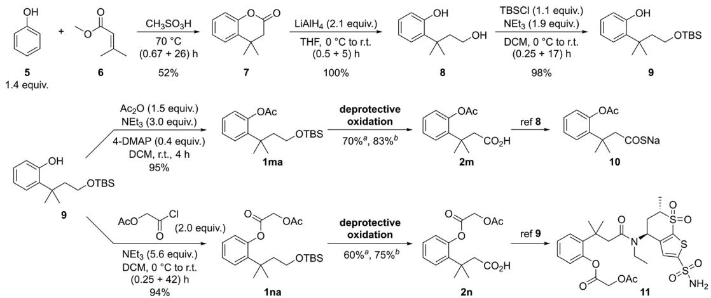

chemical

Multi-step organic synthesis reaction scheme showing intermediates 5–9 and products 10–11 with reagents, conditions, and yields

Scheme 2 Formal syntheses of bioactive molecules 10 and 11. aReaction conditions: 1 (1.0 mmol), Fe(NO3)3-9H2O (10 mol%), 4-OH-TEMPO (10 mol%), KCl (10 mol%), THF (1.0 mL) and $O _ { 2 }$ (balloon) at 25 1C, NMR yield. b TEMPO (10 mol%) was used instead of 4-OH-TEMPO, isolated yield.

# Conflicts of interest

There are no conflicts to declare.

# Notes and references

1 For selected reviews on the protection of hydroxyls using silyl groups, see: (a) R. D. Crouch, Synth. Commun., 2013, 43, 2265; (b) J. Seliger and M. Oestreich, Chem. Eur. J., 2019, 25, 9358; (c) P. I. Abronina, N. M. Podvalnyy and L. O. Kononov, Russ. Chem. Bull., 2022, 71, 6.   
2 For selected reviews on deprotection of silyl ethers, see: (a) T. D. Nelson and R. D. Crouch, Synthesis, 1996, 1031; (b) K. Jarowicki and P. Kocienski, J. Chem. Soc., Perkin Trans. 1, 2000, 2495; (c) R. D. Crouch, Tetrahedron, 2004, 60, 5833; (d) R. D. Crouch, Tetrahedron, 2013, 69, 2383.   
3 For selected reports on deprotective oxidation of silyl ethers, see: (a) J. Muzart, Synthesis, 1993, 11. For selected reports on deprotective oxidation of silyl ethers to carbonyl compounds using stoichiometric amounts of oxidants, see: (b) P. T. Kaye and R. A. Learmonth, Synth. Commun., 1990, 20, 1333; (c) J. Muzart and A. N. Ajjou, Synlett, 1991, 497; (d) K. Nagasawa, N. Matsuda, Y. Nouguchi, M. Yamanashi, Y. Zako and I. Shimizu, J. Org. Chem., 1993, 58, 1483; (e) B. Barnych and J.-M. Vate\`le, Synlett, 2011, 2048; ( f ) Z. Pan, V. Chittavong, W. Li, J. Zhang, K. Ji, M. Zhu, X. Ji and B. Wang, Chem. – Eur. J., 2017,

23, 9838; (g) M. Rasouli, M. A. Zolfigol, M. H. Moslemin and G. Chehardoli, Green Chem. Lett. Rev., 2017, 10, 117.   
4 B. Karimi and J. Rajabi, Org. Lett., 2004, 6, 2841.   
5 A. Shaabani, A. H. Rezayan, M. Heidary and A. Sarvary, Catal. Commun., 2008, 10, 129.   
6 A. Mardani, M. Heshami, Y. Shariati, F. Kazemi, M. A. Kakroudi and B. Kaboudin, J. Photochem. Photobiol., A, 2020, 389.   
7 For reports on Fe(NO3)3-9H2O-TEMPO-catalyzed aerobic oxidations of alcohols, see: (a) S. Ma, J. Liu, S. Li, B. Chen, J. Cheng, J. Kuang, Y. Liu, B. Wan, Y. Wang, J. Ye, Q. Yu, W. Yuan and S. Yu, Adv. Synth. Catal., 2011, 353, 1005; (b) J. Liu, X. Xie and S. Ma, Synthesis, 2012, 1569; (c) J. Liu and S. Ma, Tetrahedron, 2013, 10161; (d) J. Liu and S. Ma, Org. Lett., 2013, 15, 5150; (e) J. Liu and S. Ma, Synthesis, 2013, 1624; ( f ) J. Liu and S. Ma, Org. Biomol. Chem., 2013, 11, 4186; (g) X. Jiang, J. Zhang and S. Ma, J. Am. Chem. Soc., 2016, 138, 8344; (h) J. E. Nutting, K. Mao and S. Stahl, J. Am. Chem. Soc., 2021, 143, 10565; (i) D. Zhai, L. Chen, M. Jia and S. Ma, Adv. Synth. Catal., 2018, 360, 153; ( j ) X. Jiang and S. Ma, Synthesis, 2018, 1629; (k) X. Jiang, Y. Zhai, J. Chen, Y. Han, Z. Yang and S. Ma, Chin. J. Chem., 2018, 36, 15; (l ) X. Jiang, J. Liu and S. Ma, Org. Process Res. Dev., 2019, 23, 825; (m) J. Li, J. Liu, C. Fu and S. Ma, Chin. J. Chem., 2023, 41, 1963.   
8 B. Wang, Y. Zheng, K. Ji, B. Yu and Z. Pan, WO2016161445 A1, 2016.   
9 J. G. Bauman, M. Yang, N. Hoang, E. Cunninggham and J. L. Cleland, WO2020069353 A1, 2020.