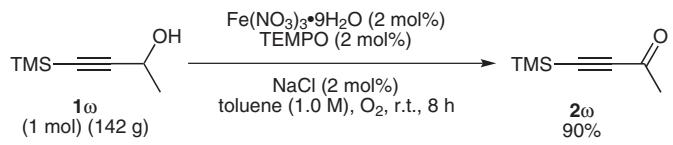

# paper Aerobic Oxidation of Propargylic Alcohols to $\mathbf { \delta } \mathbf { q } , \mathbf { \delta } \mathbf { \beta } \mathbf { \beta } \mathbf { - } \mathbf { U }$ nsaturated Alkynals or Alkynones Catalyzed by $\mathbf { F e } ( \mathbf { N O } _ { 3 } ) _ { 3 } { \cdot } \mathbf { 9 } \mathbf { H } _ { 2 } \mathbf { O }$ , TEMPO and Sodium Chloride in Toluene

Aerobic Oxidation of Propargylic Alcohols Jinxian Liu,a Xi Xie,a Shengming Ma\*a,b

a Shanghai Key Laboratory of Green Chemistry and Chemical Process, Department of Chemistry, East China Normal University, 3663 North Zhongshan Lu, Shanghai 200062, P. R. of China   
b State Key Laboratory of Organometallic Chemistry, Shanghai Institute of Organic Chemistry, Chinese Academy of Sciences, 354 Fenglin Lu, Shanghai 200032, P. R. of China Fax +86(21)62609305; E-mail: masm@sioc.ac.cn

Received: 10.02.2012; Accepted after revision: 04.03.2012

Abstract: A practical aerobic oxidation of propargylic alcohols using $\mathrm { F e ( N O } _ { 3 } ) _ { 3 } { \cdot } 9 \mathrm { H } _ { 2 } \mathrm { O } ,$ TEMPO and sodium chloride in toluene at room temperature was applied to various type of propargylic alcohols affording α,β-unsaturated alkynals or alkynones in good to excellent yields. This protocol could be applied in academic laboratories as well as in industrial-scale production.

Key words: aerobic oxidation, propargylic alcohols, catalysis, iron nitrate, TEMPO

As important intermediates in organic synthesis, α,β-unsaturated alkynals and alkynones are very useful precursors for the preparation of various aromatic compounds,1 heterocyclic compounds,2 α,β-enones,3 β-keto-1,3-dithianes,4 α,β,γ,δ-dienones,5 chiral propargylic alcohols6 as well as other compounds.7 Many approaches for the synthesis of $\alpha , \beta \cdot$ -unsaturated alkynals or alkynones such as acylation of alkynyl organometallic reagents8 or alkynylboronates,9 cross-coupling between terminal alkynes and acyl chlorides,10 and carbonylative Sonogashira coupling reaction have been reported.11 The most convenient way to prepare such compounds should be the oxidation of its corresponding propargylic alcohols. Various recipes for such purpose using stoichiometric oxidants such as $\mathrm { M n O } _ { 2 } \mathrm { , } ^ { \cdot _ { 1 2 } } \dot { \mathrm { P C C } } / \mathrm { P D C } , ^ { \cdot _ { 1 3 } }$ 3 Swern oxidation,14 and hypervalent iodine compounds15 have so far been reported in literature. However, the reaction would yield almost the same amount of oxidant-derived wastes, thus, causing heavy burden to the environment. Therefore, development of a new catalytic method using a clean oxidant under mild reaction conditions suitable for industrial production is highly desirable.

In the last decade, many aerobic oxidation examples were developed using copper, vanadium, ruthenium, or cobalt complex as catalysts for primary and secondly propargylic alcohols. Ishii and co-workers16 reported the first example of aerobic oxidation of secondly propargylic alcohol using Cu(acac)2-NHPI (N-hydroxyphthalimide) in acetonitrile at $7 0 ^ { \circ } \mathrm { C } ,$ but the conversion was low. Uemura17 and Hanson18 reported two different aerobic catalytic oxidation using vanadium complex as catalyst at 80–100 °C for primary and secondly propargylic alcohols; Sain19 developed a cobalt phthalocyanine complex catalyzed aerobic oxidation in xylene under reflux while Pedro20 reported another cobalt o-phenylenebis(N-methyloxamidate) complex catalyzed aerobic oxidation in acetonitrile at room temperature for secondly propargylic alcohols independently; and Katsuki and co-workers21 reported a kinetic resolution of sec-alcohols including sec-propargylic alcohol using a Ru complex as catalyst through catalytic aerobic oxidation. However, heating or precious metal catalyst was required in these protocols.

Recently, our group22 has reported a general and practical approach to aerobic oxidation of alcohols bearing a wide range of substrates including propargylic alcohols at room temperature using $\mathrm { F e ( N O _ { 3 } ) _ { 3 } { \cdot } \bar { 9 } H _ { 2 } O }$ , TEMPO and sodium chloride as catalyst in 1,2-dichloroethane, yielding aldehydes or ketones in good to excellent yields. However, such a chlorinated solvent is disfavored for large scale industrial application. In this paper, we wish to report an industrially practical protocol for such a purpose by using toluene as the solvent.

The solvent effect of the aerobic oxidation reaction at room temperature was first examined in order to select an industrial-friendly solvent with 1-phenyl-3-(trimethylsilyl)prop-2-yn-1-ol (1a) as the substrate. The results of the oxidation of this substrate in the presence of 5 mol% $\mathrm { F e ( N O _ { 3 } ) } _ { 3 } { \cdot } 9 \mathrm { H } _ { 2 } \mathrm { O } , 3$ mol% TEMPO, and 5 mol% NaCl under the atmospheric pressure of oxygen in different solvents are summarized in Table 1. We were delighted to find that when using toluene, p-xylene, acetonitrile, and 1,2-dichloroethane (DCE) as the solvent, the substrate could be converted into its corresponding ynone 2a within two hours in almost quantitative yield (Table 1, entries 1, 2, 4, and 5). As a cheap solvent, toluene is widely used for industrial production.23 Therefore, 5 mol% $\mathrm { F e ( N O } _ { 3 } ) _ { 3 } { \cdot } 9 \mathrm { H } _ { 2 } \mathrm { O } ,$ 3 mol% TEMPO, and 5 mol% NaCl in toluene were chosen as the standard reaction conditions.

The scope of substrates for the aerobic oxidation of propargylic alcohols under the optimized conditions was examined. First, different substituents in the aromatic ring a Yield determined by 1 H NMR analysis.

Table 1 Room-Temperature $\mathrm { F e ( N O _ { 3 } ) _ { 3 } } { \cdot } 9 \mathrm { H } _ { 2 } \mathrm { O } { - } \mathrm { C }$ atalyted Aerobic Oxidation of Propargylic Alcohol 1a to Ketone 2a in Different Solvents 

<table><tr><td>TMS $\overset{\text{1a}}{\underset{\text{(1 mmol)}}{\text{=}}}$ </td><td>Fe(NO3)3·9H2O (5 mol%)TEMPO (3 mol%)NaCl (5 mol%)solvent (1.0 M), O2, r.t., 2 h</td><td>TMS $\overset{\text{2a}}{\underset{\text{(Ph)}}{\text{=}}}$ </td></tr><tr><td>Entry</td><td>Solvent</td><td>Yield of 2a (%)a</td></tr><tr><td>1</td><td>toluene</td><td>99</td></tr><tr><td>2</td><td>p-xylene</td><td>99</td></tr><tr><td>3</td><td>acetone</td><td>11(84)b</td></tr><tr><td>4</td><td>MeCN</td><td>99</td></tr><tr><td>5</td><td>DCE</td><td>98</td></tr></table>

b The yield was 11% and the recovery of alcohol was 84%.

of 4-aryl-3-propargylic alcohols were examined (Table 2). A wide range of functional groups such as F, Cl, Br, I, CO2Et, CN, $\mathrm { N O } _ { 2 } ,$ NHTs, alkyl, MeO, etc. were smoothly tolerated. When R = m-F, o-F, p-Cl, p-CO2Et, and $p { \mathrm { - N O } } _ { 2 } ,$ , the substrates were efficiently oxidized to give the corresponding ketones in high yields with 5 mol% $\hat { \mathrm { F e } } ( \mathrm { N O } _ { 3 } ) _ { 3 } { \cdot } 9 \mathrm { H } _ { 2 } \mathrm { O } , 3$ mol% TEMPO, and 5 mol% NaCl (Table 2, entries 5, 6, 7, 12, and 15); when R = H, p-F, p-Br, $p \mathrm { - } \mathrm { I } , p \mathrm { - } \mathrm { C N } , p \mathrm { - } \mathrm { N } \mathrm { H T s } ,$ the substrates were oxidized to give the corresponding ketones in full conversion with 5 mol% $\mathrm { F e ( N O } _ { 3 } ) _ { 3 } { \cdot } \mathrm { \bar { 9 } H _ { 2 } O } ,$ 5 mol% TEMPO, and 10 mol% NaCl (Table 2, entries 2, 4, 9, 11, 14, and 17). Compared to the electron-withdrawing group, when an electron-donating group was present in the aromatic ring, the reaction was obviously slower. When ${ \sf R } = \mathrm { \Gamma } _ { O - { \bf M } e O }$ , m-MeO, and $p \mathrm { - }$ MeO, the catalyst loading should be increased to 10 mol% $\mathrm { F e } ( \mathrm { N O } _ { 3 } ) _ { 3 } { \cdot } 9 \mathrm { H } _ { 2 } \mathrm { O } .$ , 10 mol% TEMPO, and 10 mol% NaCl for full conversion of the substrate (Table 2, entries 20, 22, and 23).

The optimized conditions were next applied to 1-substituted or unsubstituted undec-2-yn-1-ols (Table 3). When ${ \mathrm { R } } = { \mathrm { a r y l } }$ , the reaction could reach completion in 7.1 hours (Table 3, entries 1–5). A slight difference in reaction time was noted when changing the position of the substituent in the aryl ring (Table 3, entries 3–5). When ${ \mathrm { R } } = { \mathrm { H } } _ { ; }$ , the reaction could reach completion in five hours (Table 3, entry 7); however, when R = alkyl, the reaction time increased to 10.3 hours (Table 3, entry 6). In all the cases, the yields were excellent.

Further study indicates that the scope is very broad. When $\mathbb { R } ^ { 1 } = \operatorname { P h }$ and $\mathrm { R } ^ { 2 } = \mathrm { P h }$ or H, the reaction could reach completion within two hours (Table 4, entries 1 and 2); with $\mathbf { \hat { R } } ^ { 1 } = \mathbf { a r y l }$ and $\mathrm { R } ^ { 2 } = \mathrm { a l k y l }$ , the reaction was much slower, although the yield was still excellent (Table 4, entry 3). The optimized reaction conditions were also applied to terminal propargylic alcohols (Table 4, entries 4 and 5). The TMS-substituted propargylic alcohols also worked smoothly (Table 4, entries 7 and 8).

Table 2 Room-Temperature Aerobic Oxidation of 4-Aryl-3-propargylic Alcohols to the Corresponding Ketonesa 

<table><tr><td>Entry</td><td>Substrate</td><td>R</td><td>Method</td><td>Time (h)</td><td>Isolated yield of 2 (%)</td></tr><tr><td>1</td><td>1b</td><td>H</td><td>A</td><td>24</td><td> $77(2b)^b$ </td></tr><tr><td>2</td><td>1b</td><td>H</td><td>B</td><td>2</td><td>91 (2b)</td></tr><tr><td>3</td><td>1c</td><td>p-F</td><td>A</td><td>24</td><td> $58(2c)^b$ </td></tr><tr><td>4</td><td>1c</td><td>p-F</td><td>B</td><td>2</td><td>90 (2c)</td></tr><tr><td>5</td><td>1d</td><td>m-F</td><td>A</td><td>12</td><td>83 (2d)</td></tr><tr><td>6</td><td>1e</td><td>o-F</td><td>A</td><td>4.5</td><td>94 (2e)</td></tr><tr><td>7</td><td>1f</td><td>p-Cl</td><td>A</td><td>9.5</td><td>86 (2f)</td></tr><tr><td>8</td><td>1g</td><td>p-Br</td><td>A</td><td>24</td><td> $75(2g)^b$ </td></tr><tr><td>9</td><td>1g</td><td>p-Br</td><td>B</td><td>3.3</td><td>93 (2g)</td></tr><tr><td>10</td><td>1h</td><td>p-I</td><td>A</td><td>24</td><td> $59(2h)^b$ </td></tr><tr><td>11</td><td>1h</td><td>p-I</td><td>B</td><td>2</td><td>82 (2h)</td></tr><tr><td>12</td><td>1i</td><td>p- $CO_2Et$ </td><td>A</td><td>24</td><td>79 (2i)</td></tr><tr><td>13</td><td>1j</td><td>p-CN</td><td>A</td><td>24</td><td> $65(11)(2j)^c$ </td></tr><tr><td>14</td><td>1j</td><td>p-CN</td><td>B</td><td>2.7</td><td>87 (2j)</td></tr><tr><td>15</td><td>1k</td><td>p- $NO_2$ </td><td>A</td><td>12.4</td><td>92 (2k)</td></tr><tr><td>16</td><td>1l</td><td>p-NHTs</td><td>A</td><td>46</td><td> $61(2l)^d$ </td></tr><tr><td>17</td><td>1l</td><td>p-NHTs</td><td>B</td><td>2</td><td>84 (2l)</td></tr><tr><td>18</td><td>1m</td><td>p-Me</td><td>A</td><td>24</td><td> $36(41)(2m)^c$ </td></tr><tr><td>19</td><td>1m</td><td>p-Me</td><td>B</td><td>2.1</td><td>91 (2m)</td></tr><tr><td>20</td><td>1n</td><td>p-MeO</td><td>C</td><td>4.2</td><td>70 (2n)</td></tr><tr><td>21</td><td>1o</td><td>m-MeO</td><td>A</td><td>24</td><td> $55(27)(2o)^c$ </td></tr><tr><td>22</td><td>1o</td><td>m-MeO</td><td>C</td><td>1.8</td><td>91 (2o)</td></tr><tr><td>23</td><td>1p</td><td>o-MeO</td><td>C</td><td>1.8</td><td>87 (2p)</td></tr></table>

a Method A: substrate (10 mmol), $\mathrm { F e } ( \mathrm { N O } _ { 3 } ) _ { 3 } { \cdot } 9 \mathrm { H } _ { 2 } \mathrm { O } ( 5 $ mol%), TEMPO (3 mol%), and NaCl (5 mol%) in toluene (10 mL); Method B: substrate (10 mmol), $\mathrm { F e } ( \mathrm { N O } _ { 3 } ) _ { 3 }$ 39H2O (5 mol%), TEMPO (5 mol%), and NaCl (10 mol%) in toluene (10 mL); Method C: substrate (10 mmol), Fe(NO3)39H2O (10 mol%), TEMPO (10 mol%), and NaCl (10 mol%) in toluene (10 mL).

b Incomplete conversion as monitored by TLC after 24 h.

c Isolated yield with the recovery of starting alcohol is shown in the parentheses.

d The yield was determined by 1 H NMR analysis and 24% of starting material (propargylic alcohol) was recovered.

Table 3 Room-Temperature Aerobic Oxidation of 1-Substituted/ Unsubstituted Undec-2-yn-1-ols to the Corresponding Aldehydes or Ketones 

<table><tr><td colspan="5"> $n-C_{8}H_{17} \xrightarrow{1q-w (10\ \text{mmol})} \begin{array}{c}\text{OH} \\|\\\text{R}\end{array} \xrightarrow[\text{toluene (1.0 M), O}_2, \text{ r.t.}]{\text{Fe(NO}_3)_3 \cdot 9\text{H}_2\text{O (5 mol\%)}\text{TEMPO (3 mol\%)}} \begin{array}{c}n-C_{8}H_{17} \xrightarrow{} \text{O}\\|\\\text{R}\end{array}$ </td></tr><tr><td>Entry</td><td>Substrate</td><td>R</td><td>Time(h)</td><td>Isolated yield of 2(%)</td></tr><tr><td>1</td><td>1q</td><td> $p\text{-ClC}_6\text{H}_4$ </td><td>2.5</td><td>98 (2q)</td></tr><tr><td>2</td><td>1r</td><td> $p\text{-CF}_3\text{C}_6\text{H}_4$ </td><td>2.5</td><td>98 (2r)</td></tr><tr><td>3</td><td>1s</td><td> $p\text{-MeOC}_6\text{H}_4$ </td><td>2.5</td><td>92 (2s)</td></tr><tr><td>4</td><td>1t</td><td> $m\text{-MeOC}_6\text{H}_4$ </td><td>3.3</td><td>99 (2t)</td></tr><tr><td>5</td><td>1u</td><td> $o\text{-MeOC}_6\text{H}_4$ </td><td>7.1</td><td>96 (2u)</td></tr><tr><td>6</td><td>1v</td><td> $n\text{-C}_5\text{H}_{11}$ </td><td>10.3</td><td>98 (2v)</td></tr><tr><td>7</td><td>1w</td><td>H</td><td>5</td><td>97 (2w)</td></tr></table>

a Standard reaction conditions: substrate (10 mmol), $\mathrm { F e } ( \mathrm { N O } _ { 3 } ) _ { 3 } { \cdot } 9 \mathrm { H } _ { 2 } \mathrm { O }$ (5 mol%), TEMPO (3 mol%), and NaCl (5 mol%) in toluene (10 mL).

Table 4 Room-Temperature Aerobic Oxidation of Differently Substituted Propargylic Alcohols to the Corresponding Aldehydes or Ketones 

<table><tr><td>Entry</td><td>Substrate</td><td> $R^1$ </td><td> $R^2$ </td><td>Time (h)</td><td>Isolated yield of 2 (%)</td></tr><tr><td>1</td><td>1x</td><td>Ph</td><td>H</td><td>2</td><td>94 (2x)</td></tr><tr><td>2</td><td>1y</td><td>Ph</td><td>Ph</td><td>1.8</td><td>99 (2y)</td></tr><tr><td>3</td><td>1z</td><td>Ph</td><td> $n-C_4H_9$ </td><td>16.5</td><td>93 (2z)</td></tr><tr><td>4</td><td>1α</td><td>H</td><td>Ph</td><td>6.8</td><td>92 (2α)</td></tr><tr><td>5</td><td>1β</td><td>H</td><td> $n-C_9H_{19}$ </td><td>13.2</td><td>95 (2β)</td></tr><tr><td>6</td><td>1γ</td><td> $n-C_4H_9$ </td><td> $p-CF_3C_6H_4$ </td><td>4</td><td>87 (2γ)</td></tr><tr><td>7</td><td>1τ</td><td>TMS</td><td> $n-C_5H_{11}$ </td><td>11.5</td><td>97 (2τ)</td></tr><tr><td>8</td><td>1a</td><td>TMS</td><td>Ph</td><td>3.5</td><td>98 (2a)</td></tr></table>

a Standard reaction conditions: of substrate (10 mmol), Fe(NO3)39H2O (5 mol%), TEMPO (3 mol%), and NaCl (5 mol%) in toluene (10 mL).

# A Large-Scale Reaction for Practical Use

To further show the practicality and efficiency of this catalytic system, a 1.0 mol reaction of 4-(trimethylsilyl)but-$3 - y \mathrm { n - 2 - o l }$ was conducted by using 2 mol% each of $\mathrm { F e ( N O } _ { 3 } ) _ { 3 } { \cdot } 9 \mathrm { H } _ { 2 } \mathrm { O } _ { 3 }$ , TEMPO, and NaCl to give 4-(trimethylsilyl)but-3-yn-2-one (2ω) in 90% isolated yield in eight hours by simple distillation (Scheme 1).

chemical

Chemical reaction scheme showing oxidation of aldehyde 1ω to ketone 2ω using Fe(NO3)3·9H2O and NaCl in toluene solvent

Scheme 1

In summary, we have developed a practical aerobic oxidation protocol for various types of propargylic alcohols using $\mathrm { \bar { F e ( N O _ { 3 } ) _ { 3 } { \cdot } 9 H _ { 2 } O / T E M P O / N a C l } }$ in toluene at room temperature affording the α,β-unsaturated alkynal or alkynones in good to excellent yields. This eco-friendly oxidation system may be applied in academic laboratories as well as industrial scale production.

1 H and $^ { 1 3 } \mathrm { C }$ NMR spectra were recorded with an instrument operating at 300 MHz for 1 H NMR and 75 MHz for $^ { 1 3 } \mathrm { C }$ NMR in CDCl3. Chemical shifts (δ) are given in parts per million (ppm). Infrared spectra were recorded on an FTIR spectrometer. MS and HRMS data were collected in EI mode. Compounds 1b–p and 1x were synthesized by Sonogashira coupling24 and all the other starting materials were synthesized according to the literature.25 Other reagents were commercially available. Petroleum ether (PE) used refers to the fraction boiling in the range $6 0 { - } 9 0 \ ^ { \circ } \mathrm { C } .$

# Oxidation of Propargylic Alcohols; General Procedure

To a 50 mL three-necked flask were added Fe(NO3)39H2O (0.5 mmol), TEMPO (0.30 mmol), NaCl (0.50 mmol), and toluene (10 mL). The propargylic alcohol (10 mmol) was then added to the suspension and the resulting mixture was placed under the atmosphere of $\mathrm { O } _ { 2 }$ from a balloon and stirred at r.t. until the reaction was complete as monitored by TLC (eluent: PE–EtOAc, 10:1). The resulting mixture was purified by column chromatography on silica gel [PE: 200 mL, $\mathrm { P E - E t } _ { 2 } \mathrm { O }$ (10:1): 300–400 mL] to afford the corresponding aldehyde or ketone. The reagent amounts used for methods A–C are given below (cf. Table 2).

Method A: Alcohol (10 mmol), $\mathrm { F e } ( \mathrm { N O } _ { 3 } ) _ { 3 }$ 9H2O (5 mol%), TEMPO (3 mol%), and NaCl (5 mol%) in toluene (10 mL).

Method B: Alcohol (10 mmol), $\mathrm { F e } ( \mathrm { N O } _ { 3 } ) _ { 3 } { \cdot } 9 \mathrm { H } _ { 2 } \mathrm { O } ( 5 $ mol%), TEMPO (5 mol%), and NaCl (10 mol%) in toluene (10 mL).

Method C: Alcohol (10 mmol), Fe(NO3)39H2O (10 mol%), TEMPO (10 mol%), and NaCl (10 mol%) in toluene (10 mL).

# 4-Phenylbut-3-yn-2-one (2b)

Method A: The reaction of 4-phenylbut-3-yn-2-ol (1.4420 g, 10 mmol), Fe(NO3)39H2O (205.0 mg, 0.5 mmol), TEMPO (47.4 mg, 0.3 mmol), and NaCl (29.0 mg, 0.5 mmol) in toluene (10 mL) afforded 2b (1.0926 g, 77%) as an oil.

Method B: The reaction of 4-phenylbut-3-yn-2-ol (1.4620 g, 10 mmol), Fe(NO3)39H2O (202.3 mg, 0.5 mmol), TEMPO (78.4 mg, 0.5 mmol), and NaCl (58.5 mg, 1.0 mmol) in toluene (10 mL) afforded $2  { \mathbf { b } } ^ { 2 6 }$ (1.3131 g, 91%) as an oil.

IR (neat): 2202, 1672, 1490, 1444, 1415, 1359, 1325, 1280, 1157, 1067, 1025, 977 $\mathrm { c m ^ { - 1 } } .$ .

1 H NMR (300 MHz, CDCl3): δ = 7.61–7.54 (m, 2 H, ArH), 7.50– 7.34 (m, 3 H, ArH), 2.45 (s, 3 H, COCH3).

13C NMR (75.4 MHz, CDCl3): δ = 184.59, 133.04, 130.72, 128.62, 119.89, 90.18, 88.25, 32.72.

MS (EI): m/z (%) = 144 (M+, 20.08), 129 (100).

# 4-(4-Fluorophenyl)but-3-yn-2-one (2c)

Method A: The reaction of 4-(4-fluorophenyl)but-3-yn-2-ol (1.6410 g, 10 mmol), Fe(NO3)39H2O (200.6 mg, 0.5 mmol), TEMPO (47.3 mg, 0.3 mmol), and NaCl (28.2 mg, 0.5 mmol) in toluene (10 mL) afforded 2c (0.9348 g, 58%) as an oil.

Method B: The reaction of 4-(4-fluorophenyl)but-3-yn-2-ol (1.6419 g, 10 mmol), Fe(NO3)39H2O (202.2 mg, 0.5 mmol), TEMPO (78.0 mg, 0.5 mmol), and NaCl (58.4 mg, 1.0 mmol) in toluene (10 mL) afforded 2c27 (1.4523 g, 90%) as an oil.

IR (neat): 2204, 1673, 1600, 1505, 1416, 1358, 1283, 1231, 1152, 1095, 1016, 977 cm–1.

1 H NMR (300 MHz, CDCl3): δ = 7.61–7.53 (m, 2 H, ArH), 7.12– 7.03 (m, 2 H, ArH), 2.44 (s, 3 H, CH3).

13C NMR (75.4 MHz, CDCl3): δ = 184.29, 163.80 (d, J = 254.0 Hz), 135.17 (d, J = 8.7 Hz), 116.01 (d, J = 22.5 Hz), 115.81, 89.024, 87.98 (d, J =1.1 Hz), 32.49.

19F NMR (282 MHz, CDCl3): δ = –106.24.

MS (EI): m/z (%) = 162 (M+, 17.88), 147 (100).

# 4-(3-Fluorophenyl)but-3-yn-2-one (2d)

Method A: The reaction of 4-(3-fluorophenyl)but-3-yn-2-ol (1.6297 g, 10 mmol), Fe(NO3)39H2O (205.1 mg, 0.5 mmol), TEMPO (46.8 mg, 0.3 mmol), and NaCl (29.4 mg, 0.5 mmol) in toluene (10 mL) afforded 2d (1.3378 g, 83%) as an oil.

IR (neat): 2201, 1671, 1608, 1580, 1486, 1431, 1359, 1294, 1266, 1200, 1160, 1132, 1078, 1020, 982 cm–1.

1 H NMR (300 MHz, CDCl3): δ = 7.41–7.32 (m, 2 H, ArH), 7.30– 7.23 (m, 1 H, ArH), 7.23–7.12 (m, 1 H, ArH), 2.46 (s, 3 H, CH3).

13C NMR (75.4 MHz, CDCl3): δ = 184.30, 162.19 (d, J = 248.0 Hz), 130.33 (d, J = 8.3 Hz), 128.85 (d, J = 3.2 Hz), 121.66 (d, J = 9.3 Hz), 119.59 (d, J = 23.1 Hz), 118.13 (d, J = 21.5 Hz), 88.38, 88.24 (d, J = 3.2 Hz), 32.67.

19F NMR (282 MHz, CDCl3): δ = –111.73.

MS (EI): m/z (%) = 162 (M+, 20.82), 147 (100).

HRMS: m/z calcd for C10H7FO (M+): 162.0481; found: 162.0482.

# 4-(2-Fluorophenyl)but-3-yn-2-one (2e)

Method A: The reaction of 4-(2-fluorophenyl)but-3-yn-2-ol (1.6417 g, 10 mmol), Fe(NO3)39H2O (202.3 mg, 0.5 mmol), TEMPO (46.9 mg, 0.3 mmol), and NaCl (29.0 mg, 0.5 mmol) in toluene (10 mL) afforded 2e (1.5243 g, 94%) as an oil.

IR (neat): 2209, 1676, 1610, 1578, 1491, 1450, 1418, 1359, 1297, 1263, 1221, 1200, 1166, 1151, 1103, 1020, 978 cm–1.

1 H NMR (300 MHz, CDCl3): δ = 7.57–7.39 (m, 2 H, ArH), 7.20– 7.07 (m, 2 H, ArH), 2.46 (s, 3 H, CH3).

13C NMR (75.4 MHz, CDCl3): δ = 184.18, 163.41 (d, J = 255.1 Hz), 134.53, 132.69 (d, J = 8.2 Hz), 124.23 (d, J = 3.8 Hz), 115.77 (d, J = 20.9 Hz), 108.65 (d, J = 15.4 Hz), 92.41 (d, J = 3.3 Hz), 83.39, 32.60.

19F NMR (282 MHz, CDCl3): δ = –107.26.

MS (EI): m/z (%) = 162 (M+, 21.31), 147 (100).

HRMS: m/z calcd for C10H7FO (M+): 162.0481; found: 162.0480.

# 4-(4-Chlorophenyl)but-3-yn-2-one (2f)

Method A: The reaction of 4-(4-chlorophenyl)but-3-yn-2-ol (1.8164 g, 10 mmol), Fe(NO3)39H2O (201.8 mg, 0.5 mmol), TEMPO (47.3

mg, 0.3 mmol), and NaCl (28.7 mg, 0.5 mmol) in toluene (10 mL) afforded 2f28 (1.5386 g, 86%) as a solid; mp 54–55 °C (c-hexane).

IR (neat): 2203, 1671, 1582, 1486, 1417, 1401, 1359, 1278, 1203, 1156, 1132, 1088, 1014, 983 cm–1.

1 H NMR (300 MHz, CDCl3): δ = 7.50 (dt, J = 8.7, 2.1 Hz, 2 H, ArH), 7.36 (dt, J = 8.4, 2.1 Hz, 2 H, ArH), 2.45 (s, 3 H, CH3).

13C NMR (75.4 MHz, CDCl3): δ = 184.36, 137.13, 134.20, 129.08, 118.33, 88.87, 88.78, 32.67.

MS (EI): m/z (%) 180 [M+( 37Cl), 9.05], 178 [M+( 35Cl), 27.38], 163 (100).

# 4-(4-Bromophenyl)but-3-yn-2-one (2g)

Method A: The reaction of 4-(4-bromophenyl)but-3-yn-2-ol (2.2507 g, 10 mmol), Fe(NO3)39H2O (202.0 mg, 0.5 mmol), TEMPO (47.2 mg, 0.3 mmol), and NaCl (29.5 mg, 0.5 mmol) in toluene (10 mL) afforded 2g (1.6671 g, 75%) as a solid.

Method B: The reaction of 4-(4-bromophenyl)but-3-yn-2-ol (2.2511 g, 10 mmol), Fe(NO3)39H2O (202.3 mg, 0.5 mmol), TEMPO (78.4 mg, 0.5 mmol), and NaCl (58.7 mg, 1.0 mmol) in toluene (10 mL) afforded 2g28 (2.0676 g, 93%) as a solid; mp 64– 65 °C (c-hexane).

IR (neat): 2201, 1668, 1597, 1585, 1506, 1490, 1465, 1435, 1419, 1394, 1358, 1277, 1246, 1233, 1154, 1113, 1096, 1069, 1046, 1011, 977 cm–1.

1 H NMR (300 MHz, CDCl3): δ = 7.52 (dt, J = 9.0, 2.0 Hz, 2 H, ArH), 7.41 (dt, J = 8.7, 2.0 Hz, 2 H, ArH), 2.44 (s, 3 H, CH3).

13C NMR (75.4 MHz, CDCl3): δ = 184.35, 134.27, 131.99, 125.50, 118.76, 88.94, 88.80, 32.65.

MS (EI): m/z (%) = 224 [M+( 81Br), 22.67], 222 [M+( 79Br), 23.47], 207 (100).

# 4-(4-Iodophenyl)but-3-yn-2-one (2h)

Method A: The reaction of 4-(4-iodophenyl)but-3-yn-2-ol (2.7168 g, 10 mmol), Fe(NO3)39H2O (201.2 mg, 0.5 mmol), TEMPO (47.1 mg, 0.3 mmol), and NaCl (28.9 mg, 0.5 mmol) in toluene (10 mL) afforded 2h (1.5913 g, 59%) as a solid; mp 83–84 °C (c-hexane).

Method B: The reaction of 4-(4-iodophenyl)but-3-yn-2-ol (2.7266 g, 10 mmol), Fe(NO3)39H2O (206.6 mg, 0.5 mmol), TEMPO (78.5 mg, 0.5 mmol), and NaCl (57.0 mg, 1.0 mmol) in toluene (10 mL) afforded 2h (2.2059 g, 82%) as a solid.

IR (neat): 3000, 2945, 2889, 2834, 2201, 1709, 1680, 1654, 1579, 1482, 1420, 1391, 1355, 1279, 1154, 1054, 1006, 977 cm–1.

1 H NMR (300 MHz, CDCl3): δ = 7.74 (dt, J = 8.7, 2.0 Hz, 2 H, ArH), 7.28 (dt, J = 8.7, 1.8 Hz, 2 H, ArH), 2.45 (s, 3 H, CH3).

13C NMR (75.4 MHz, CDCl3): δ = 184.29, 137.87, 134.15, 119.27, 97.60, 89.13, 88.91, 32.65.

MS (EI): m/z (%) 270 (M+, 49.02), 255 (100).

Anal. Calcd for C10H7IO: C, 44.47; H, 2.61. Found: C, 44.47; H, 2.61.

# Ethyl 4-(3-Oxobut-1-ynyl)benzoate (2i)

Method A: The reaction of ethyl 4-(3-hydroxybut-1-ynyl)benzoate (2.1693 g, 10 mmol), Fe(NO3)39H2O (202.6 mg, 0.5 mmol), TEMPO (47.5 mg, 0.3 mmol), and NaCl (29.2 mg, 0.5 mmol) in toluene (10 mL) afforded 2i (1.6899 g, 79%) as a solid; mp 52–53 °C (c-hexane).

IR (neat): 2205, 1713, 1669, 1604, 1562, 1507, 1470, 1447, 1404, 1360, 1307, 1272, 1175, 1157, 1105, 1017, 978 cm–1.

1 H NMR (300 MHz, CDCl3): δ = 8.05 (d, J = 8.4 Hz, 2 H, ArH), 7.62 (d, J = 8.4 Hz, 2 H, ArH), 4.39 (q, J = 7.1 Hz, 2 H, OCH2), 2.47 (s, 3 H, COCH3), 1.40 (t, J = 7.2 Hz, 3 H, CH3).

13C NMR (75.4 MHz, CDCl3): δ = 184.29, 165.56, 132.74, 132.05, 129.58, 124.21, 89.73, 88.51, 61.40, 32.71, 14.23.

MS (EI): m/z = 216 (M+, 29.16), 201 (100).

Anal. Calcd for $\mathrm { C } _ { 1 3 } \mathrm { H } _ { 1 2 } \mathrm { O } _ { 3 } ;$ C, 72.21; H, 5.59. Found: C, 72.26; H, 5.53.

# 4-(3-Oxobut-1-ynyl)benzonitrile (2j)

Method A: The reaction of 4-(3-hydroxybut-1-ynyl)benzonitrile (1.7122 g, 10 mmol), Fe(NO3)39H2O (202.3 mg, 0.5 mmol), TEMPO (46.7 mg, 0.3 mmol), and NaCl (29.4 mg, 0.5 mmol) in toluene (10 mL) afforded 2j (1.1018 g, 65%) as a solid.

Method B: The reaction of 4-(3-hydroxybut-1-ynyl)benzonitrile (1.7117 g, 10 mmol), Fe(NO3)39H2O (202.3 mg, 0.5 mmol), TEMPO (78.1 mg, 0.5 mmol), and NaCl (58.7 mg, 1.0 mmol) in toluene (10 mL) afforded 2j (1.4745 g, 87%) as a solid; mp 106– 107 °C (c-hexane).

IR (neat): 2227, 2206, 1671, 1499, 1408, 1359, 1277, 1186, 1152, 1018, 981 cm–1.

1 H NMR (300 MHz, CDCl3): δ = 7.71–7.62 (m, 4 H, ArH), 2.47 (s, 3 H, CH3).

13C NMR (75.4 MHz, CDCl3): δ = 183.91, 133.17, 132.19, 124.65, 117.79, 113.92, 90.50, 86.78, 32.65.

MS (EI): m/z (%) = 169 (M+, 12.91), 154 (100).

Anal. Calcd for C11H7NO: C, 78.09; H, 4.17; N, 8.28. Found: C, 77.89; H, 4.24; N, 8.11.

# 4-(4-Nitrophenyl)but-3-yn-2-one (2k)

Method A: The reaction of 4-(4-nitrophenyl)but-3-yn-2-ol (1.8921 g, 10 mmol), Fe(NO3)39H2O (201.9 mg, 0.5 mmol), TEMPO (46.6 mg, 0.3 mmol), and NaCl (29.3 mg, 0.5 mmol) in toluene (10 mL) afforded 2k (1.7159 g, 92%) as a solid (eluent: PE–EtOAc, 10:1); mp 113–114 °C (c-hexane).

IR (neat): 2208, 1672, 1597, 1518, 1403, 1340, 1309, 1277, 1213, 1179, 1156, 1109, 1013, 977 cm–1.

1 H NMR (300 MHz, CDCl3): δ = 8.24 (d, J = 8.7 Hz, 2 H, ArH), 7.72 (d, J = 8.7 Hz, 2 H, ArH), 2.48 (s, 3 H, CH3).

13C NMR (75.4 MHz, CDCl3): δ = 183.87, 148.60, 133.59, 126.54, 123.73, 90.96, 86.33, 32.68.

MS (EI) m/z (%) = 189 (M+, 18.15), 174 (100).

Anal. Calcd for C10H7NO3: C, 63.49; H, 3.73; N, 7.40. Found: C, 63.46; H, 3.75; N, 7.28.

# 4-Methyl-N-[4-(3-oxobut-1-ynyl)phenyl]benzenesulfonamide (2l)

Method A: To a 50 mL three-necked flask were added Fe(NO3)39H2O (203.7 mg, 0.5 mmol), TEMPO (47.5 mg, 0.3 mmol), NaCl (29.5 mg, 0.5 mmol), and toluene (10 mL). N-[4-(3- Hydroxybut-1-ynyl)phenyl]-4-methylbenzenesulfonamide (3.1596 g, 10 mmol) was then added to the suspension and the resulting mixture was placed under the atmosphere of O2 from a balloon and stirred at r.t. for 46 h. The resulting mixture was filtered and concentrated in vacuo to give the crude product. 1 H NMR analysis indicated that the yield of 2l was 61% and 24% of the alcohol was recovered.

Method B: The reaction of N-[4-(3-hydroxybut-1-ynyl)phenyl]-4- methylbenzenesulfonamide (3.1484 g, 10 mmol), Fe(NO3)39H2O (201.4 mg, 0.5 mmol), TEMPO (78.8 mg, 0.5 mmol), and NaCl (58.8 mg, 1.0 mmol) in toluene (10 mL) afforded 2l (2.6167 g, 84%) as a solid; mp 124–125 °C (c-hexane–Et2O).

IR (neat): 3313, 2988, 2901, 2838, 2203, 1694, 1664, 1604, 1506, 1453, 1401, 1362, 1331, 1282, 1222, 1157, 1087, 1017, 978, 921 cm–1.

1 H NMR (300 MHz, CDCl3): δ = 7.74 (d, J = 8.4 Hz, 2 H, ArH), 7.67 (br d, 1 H, NH), 7.43 (d, J = 8.7 Hz, 2 H, ArH), 7.26 (d, J = 7.8 Hz, 2 H, ArH), 7.12 (d, J = 8.7 Hz, 2 H, ArH), 2.43 (s, 3 H, ArCH3), 2.38 (s, 3 H, CH3).

13C NMR (75.4 MHz, CDCl3): δ = 184.91, 144.48, 139.19, 135.64, 134.45, 129.88, 127.21, 119.56, 115.62, 90.24, 88.56, 32.64, 21.53. MS (EI): m/z (%) = 313 (M+, 100.00).

Anal. Calcd for C17H15NO3S: C, 65.16; H, 4.82; N, 4.47. Found: C, 64.98; H, 4.79; N, 4.20.

# 4-(p-Tolyl)but-3-yn-2-one (2m)

Method A: The reaction of 4-(p-tolyl)but-3-yn-2-ol (1.6021 g, 10 mmol), Fe(NO3)39H2O (202.3 mg, 0.5 mmol), TEMPO (46.7 mg, 0.3 mmol), and NaCl (29.5 mg, 0.5 mmol) in toluene (10 mL) afforded 2m (0.5663 g, 36%) as an oil.

Method B: The reaction of 4-(p-tolyl)but-3-yn-2-ol (1.6022 g, 10 mmol), Fe(NO3)39H2O (202.2 mg, 0.5 mmol), TEMPO (78.3 mg, 0.5 mmol), and NaCl (58.6 mg, 1.0 mmol) in toluene (10 mL) afforded 2m29 (1.4464 g, 91%) as an oil.

IR (neat): 2224, 1668, 1606, 1509, 1454, 1414, 1357, 1281, 1152, 1063, 1019, 975 cm–1.

1 H NMR (300 MHz, CDCl3): δ = 7.47 (d, J = 8.1 Hz, 2 H, ArH), 7.19 (d, J = 7.8 Hz, 2 H, ArH), 2.44 (s, 3 H, ArCH3), 2.38 (s, 3 H, CH3).

13C NMR (75.4 MHz, CDCl3): δ = 184.51, 141.27, 132.90, 129.24, 116.55, 90.81, 87.95, 32.51, 21.52.

MS (EI): m/z (%) = 158 (M+, 22.30), 143 (100).

# 4-(4-Methoxyphenyl)but-3-yn-2-one (2n)

Method C: The reaction of 4-(4-methoxyphenyl)but-3-yn-2-ol (1.7621 g, 10 mmol), Fe(NO3)39H2O (404.1 mg, 1.0 mmol), TEMPO (156.0 mg, 1.0 mmol), and NaCl (58.4 mg, 1.0 mmol) in toluene (10 mL) afforded 2n30 (1.2180 g, 70%) as an oil.

IR (neat): 2196, 1665, 1602, 1568, 1509, 1461, 1442, 1419, 1357, 1280, 1252, 1150, 1109, 1026, 976 cm–1.

1 H NMR (300 MHz, CDCl3): δ = 7.51 (dt, J = 9.0, 2.4 Hz, 2 H, ArH), 6.88 (dt, J = 8.7, 2.4 Hz, 2 H, ArH), 3.82 (s, 3 H, OCH3), 2.41 (s, 3 H, CH3).

13C NMR (75.4 MHz, CDCl3): δ = 184.53, 161.52, 134.97, 114.22, 111.45, 91.38, 88.08, 55.26, 32.47.

MS (EI): m/z (%) = 174 (M+, 35.40), 159 (100).

# 4-(3-Methoxyphenyl)but-3-yn-2-one (2o)

Method A: The reaction of 4-(3-methoxyphenyl)but-3-yn-2-ol (1.7618 g, 10 mmol), Fe(NO3)39H2O (202.3 mg, 0.5 mmol), TEMPO (46.9 mg, 0.3 mmol), and NaCl (29.2 mg, 0.5 mmol) in toluene (10 mL) afforded 2o (0.9523 g, 55%) as a solid.

Method C: The reaction of 4-(3-methoxyphenyl)but-3-yn-2-ol (1.7618 g, 10 mmol), Fe(NO3)39H2O (404.3 mg, 1.0 mmol), TEMPO (156.5 mg, 1.0 mmol), and NaCl (58.4 mg, 1.0 mmol) in toluene (10 mL) afforded 2o (1.5865 g, 91%) as a solid; mp 54– 55 °C (c-hexane).

IR (neat): 2195, 1668, 1602, 1573, 1510, 1483, 1465, 1425, 1356, 1321, 1284, 1254, 1221, 1185, 1153, 1093, 1041, 980 cm–1.

1 H NMR (300 MHz, CDCl3): δ = 7.31 (t, J = 8.1 Hz, 1 H, ArH), 7.17 (dt, J = 7.5, 1.2 Hz, 1 H, ArH), 7.10–7.06 (m, 1 H, ArH), 7.15 (ddd, J = 8.4, 2.7, 0.9 Hz, 1 H, ArH), 3.82 (s, 3 H, OCH3), 2.46 (s, 3 H, CH3).

13C NMR (75.4 MHz, CDCl3): δ = 184.56, 159.33, 129.67, 125.48, 120.73, 117.47, 117.45, 90.15, 87.86, 55.29, 32.65.

MS (EI): m/z (%) = 174 (M+, 34.12), 159 (100).

Anal. Calcd for ${ \mathrm { C } } _ { 1 1 } { \mathrm { H } } _ { 1 0 } { \mathrm { O } } _ { 2 } ;$ C, 75.84; H, 5.79. Found: C, 75.94; H, 5.78.

# 4-(2-Methoxyphenyl)but-3-yn-2-one (2p)

Method C: The reaction of 4-(2-methoxyphenyl)but-3-yn-2-ol (1.7624 g, 10 mmol), Fe(NO3)39H2O (404.2 mg, 1.0 mmol),

TEMPO (156.5 mg, 1.0 mmol), and NaCl (58.3 mg, 1.0 mmol) in toluene (10 mL) afforded 2p (1.5166 g, 87%) as a solid; mp 52– 53 °C (c-hexane).

IR (neat): 2199, 1668, 1595, 1574, 1538, 1491, 1462, 1434, 1362, 1296, 1278, 1246, 1184, 1159, 1110, 1041, 1018, 979 cm–1.

1 H NMR (300 MHz, CDCl3): δ = 7.49 (dd, J = 7.7, 1.7 Hz, 1 H, ArH), 7.44–7.37 (m, 1 H, ArH), 6.96–6.86 (m, 2 H, ArH), 3.88 (s, 3 H, OCH3), 2.45 (s, 3 H, CH3).

13C NMR (75.4 MHz, CDCl3): δ = 184.60, 161.31, 134.86, 132.41, 120.45, 110.71, 108.91, 92.27, 87.52, 55.69, 32.62.

MS (EI): m/z (%) = 174 (M+, 69.00), 159 (100).

Anal. Calcd for $\mathrm { C _ { 1 1 } H _ { 1 0 } O _ { 2 } \colon C } ,$ 75.84; H, 5.79. Found: C, 75.82; H, 5.80.

# 1-(4-Chlorophenyl)undec-2-yn-1-one (2q)

Method A: The reaction of 1-(4-chlorophenyl)undec-2-yn-1-ol (2.7879 g, 10 mmol), Fe(NO3)39H2O (201.8 mg, 0.5 mmol), TEMPO (47.1 mg, 0.3 mmol), and NaCl (29.0 mg, 0.5 mmol) in toluene (10 mL) afforded 2q (2.7184 g, 98%) as an oil.

IR (neat): 2926, 2856, 2237, 2200, 1647, 1587, 1464, 1400, 1261, 1170, 1090, 1013 cm–1.

1 H NMR (300 MHz, CDCl3): δ = 8.06 (dt, J = 9.0, 2.1 Hz, 2 H, ArH), 7.44 (dt, J = 8.4, 1.8 Hz, 2 H, ArH), 2.49 (t, J = 7.2 Hz, 2 H, C≡CCH2), 1.72–1.60 (m, 2 H), 1.52–1.20 (m, 10 H), 0.88 (t, J = 6.6 Hz, 3 H).

13C NMR (75.4 MHz, CDCl3): δ = 176.85, 140.39, 135.30, 130.81, 128.80, 97.48, 79.36, 31.74, 29.07, 28.95, 28.94, 27.72, 22.59, 19.18, 14.04.

MS (EI): m/z (%) = 278 [M+( 37Cl), 0.37], 276 [M+( 35Cl), 1.27], 139 (100).

HRMS: m/z calcd for $\mathrm { C _ { 1 7 } H _ { 2 1 } } ^ { 3 5 } \mathrm { C l O }$ (M+): 276.1281; found:276.1282.

# 1-(4-(Trifluoromethyl)phenyl)undec-2-yn-1-one (2r)

Method A: The reaction of 1-(trifluoromethyl)undec-2-yn-1-ol (3.1237 g, 10 mmol), Fe(NO3)39H2O (202.3 mg, 0.5 mmol), TEMPO (47.2 mg, 0.3 mmol), and NaCl (29.4 mg, 0.5 mmol) in toluene (10 mL) afforded 2r (3.0551 g, 98%) as an oil.

IR (neat): 2928, 2857, 2237, 2201, 1652, 1583, 1509, 1465, 1411, 1323, 1262, 1172, 1131, 1107, 1065, 1016 cm–1.

1 H NMR (300 MHz, CDCl3): δ = 8.23 (d, J = 8.7 Hz, 2 H, ArH), 7.74 (d, J = 8.4 Hz, 2 H, ArH), 2.52 (t, J = 7.1 Hz, 2 H, C≡CCH2), 1.75–1.59 (m, 2 H), 1.53–1.22 (m, 10 H), 0.88 (t, J = 6.8 Hz, 3 H).

13C NMR (75.4 MHz, CDCl3): δ = 176.91, 139.40 (d, J = 1.3 Hz), 134.91 (q, J = 32.6 Hz), 129.72, 125.49 (q, J = 3.8 Hz), 123.52 (q, J = 272.9 Hz), 98.38, 79.38, 31.73, 29.06, 28.94, 27.68, 22.57, 19.17, 13.97.

19F NMR (282 MHz, CDCl3): δ = –63.14.

MS (EI): m/z (%) = 310 (M+, 0.88), 145 (100).

HRMS: m/z calcd for $\mathrm { C _ { 1 8 } H _ { 2 1 } F _ { 3 } O }$ (M+): 310.1545; found: 310.1539.

# 1-(4-Methoxyphenyl)undec-2-yn-1-one (2s)

Method A: The reaction of 1-(4-methoxyphenyl)undec-2-yn-1-ol (2.7443 g, 10 mmol), Fe(NO3)39H2O (202.2 mg, 0.5 mmol), TEMPO (47.0 mg, 0.3 mmol), and NaCl (29.4 mg, 0.5 mmol) in toluene (10 mL) afforded 2s (2.5087 g, 92%) as an oil.

IR (neat): 2927, 2855, 2237, 2198, 1638, 1596, 1574, 1509, 1463, 1421, 1316, 1253, 1165, 1114, 1029, 911 cm–1.

1 H NMR (300 MHz, CDCl3): δ = 8.10 (d, J = 8.7 Hz, 2 H, ArH), 6.94 (d, J = 8.7 Hz, 2 H, ArH), 3.88 (s, 3 H, OCH3), 2.48 (t, J = 7.1 Hz, 2 H, C≡CCH2), 1.73–1.60 (m, 2 H), 1.53–1.20 (m, 10 H), 0.88 (t, J = 6.2 Hz, 3 H).

13C NMR (75.4 MHz, CDCl3): δ = 176.84, 164.14, 131.77, 130.22, 113.58, 95.86, 79.52, 55.41, 31.66, 29.00, 28.88, 28.84, 27.73, 22.51, 19.06, 13.96.

MS (EI): m/z (%) = 272 (M+, 5.74), 135 (100).

HRMS: m/z calcd for $\mathrm { C _ { 1 8 } H _ { 2 4 } O _ { 2 } }$ (M+): 272.1776; found: 272.1775.

# 1-(3-Methoxyphenyl)undec-2-yn-1-one (2t)

Method A: The reaction of 1-(3-methoxyphenyl)undec-2-yn-1-ol (2.7443 g, 10 mmol), Fe(NO3)39H2O (202.2 mg, 0.5 mmol), TEMPO (46.9 mg, 0.3 mmol), and NaCl (29.1 mg, 0.5 mmol) in toluene (10 mL) afforded 2t (2.7050 g, 99%) as an oil.

IR (neat): 2925, 2855, 2221, 1645, 1583, 1485, 1463, 1431, 1322, 1271, 1222, 1182, 1104, 1042, 994 cm–1.

1 H NMR (300 MHz, CDCl3): δ = 7.75 (dt, J = 7.5, 1.2 Hz, 1 H, ArH), 7.62 (dd, J = 2.7, 1.5 Hz, 1 H, ArH), 7.37 (t, J = 7.8 Hz, 1 H, ArH), 7.13 (ddd, J = 8.1, 2.7, 0.9 Hz, 1 H, ArH), 3.85 (s, 3 H, OCH3), 2.48 (t, J = 7.2 Hz, 2 H, COCH2), 1.70–1.60 (m, 2 H), 1.52– 1.39 (m, 2 H), 1.39–1.20 (m, 8 H), 0.87 (t, J = 6.8 Hz, 3 H, CH3).

13C NMR (75.4 MHz, CDCl3): δ = 177.95, 159.65, 138.27, 129.44, 122.73, 120.65, 112.81, 96.75, 79.69, 55.38, 31.73, 29.07, 28.96, 28.93, 27.76, 22.58, 19.17, 14.03.

MS (EI): m/z (%) = 272 (M+, 11.87), 135 (100).

HRMS: m/z calcd for $\mathrm { C _ { 1 8 } H _ { 2 4 } O _ { 2 } }$ (M+): 272.1776; found: 272.1775.

# 1-(2-Methoxyphenyl)undec-2-yn-1-one (2u)

Method A: The reaction of 1-(2-methoxyphenyl)undec-2-yn-1-ol (2.7440 g, 10 mmol), Fe(NO3)39H2O (202.3 mg, 0.5 mmol), TEMPO (46.9 mg, 0.3 mmol), and NaCl (28.9 mg, 0.5 mmol) in toluene (10 mL) afforded 2u (2.6250 g, 96%) as an oil.

IR (neat): 2927, 2856, 2212, 1648, 1625, 1596, 1576, 1486, 1464, 1435, 1299, 1237, 1180, 1164, 1132, 1092, 1048, 1023, 908 cm–1.

1 H NMR (300 MHz, CDCl3): δ = 8.01 (dd, J = 7.8, 1.8 Hz, 1 H, ArH), 7.53–7.45 (m, 1 H, ArH), 7.04–6.93 (m, 2 H, ArH), 3.90 (s, 3 H, OCH3), 2.43 (t, J = 7.1 Hz, 2 H, COCH2), 1.67–1.56 (m, 2 H), 1.49-1.19 (m, 10 H), 0.86 (t, J = 6.9 Hz, 3 H, CH3).

13C NMR (75.4 MHz, CDCl3): δ = 177.13, 159.55, 134.60, 132.91, 126.71, 120.03, 112.00, 95.32, 81.66, 55.74, 31.70, 29.04, 28.94, 28.84, 27.75, 22.54, 19.17, 14.00.

MS (EI): m/z (%) = 272 (M+, 5.59), 135 (100).

HRMS: m/z calcd for $\mathrm { C _ { 1 8 } H _ { 2 4 } O _ { 2 } }$ (M+): 272.1776; found: 272.1778.

# Hexadec-7-yn-6-one (2v)

Method A: The reaction of hexadec-7-yn-6-one (2.3838 g, 10 mmol), Fe(NO3)39H2O (202.3 mg, 0.5 mmol), TEMPO (46.8 mg, 0.3 mmol), and NaCl (29.2 mg, 0.5 mmol) in toluene (10 mL) afforded 2v31 (2.3067 g, 98%) as an oil.

IR (neat): 2957, 2932, 2860, 2213, 1675, 1466, 1235 cm–1.

1 H NMR (300 MHz, CDCl3): δ = 2.51 (t, J = 7.4 Hz, 2 H, C≡CCH2), 2.35 (t, J = 7.1 Hz, 2 H, COCH2), 1.71–1.52 (m, 4 H), 1.45–1.20 (m, 14 H), 0.93–0.82 (m, 6 H).

13C NMR (75.4 MHz, CDCl3): δ = 188.62, 94.28, 80.87, 45.48, 31.76, 31.11, 29.07, 28.95, 28.82, 27.68, 23.82, 22.60, 22.35, 18.90, 14.04, 13.84.

MS (EI): m/z (%) = 236 (M+, 0.55), 221 (M+ – CH3, 0.95), 165 (M+ – C5H11, 42.49), 43 (100).

Anal. Calcd for $\mathrm { C _ { 1 6 } H _ { 2 8 } O } \mathrm { : }$ C, 81.29; H, 11.94. Found: C, 81.61; H, 11.94.

# Undec-2-ynal (2w)

Method A: The reaction of undec-2-yn-1-ol (1.6825 g, 10 mmol), Fe(NO3)39H2O (202.1 mg, 0.5 mmol), TEMPO (46.9 mg, 0.3 mmol), and NaCl (29.3 mg, 0.5 mmol) in toluene (10 mL) afforded 2w32 (1.6157 g, 97%) as an oil.

IR (neat): 2927, 2857, 2201, 1670, 1464, 1387, 1137, 1061, 978 cm–1.

1 H NMR (300 MHz, CDCl3): δ = 9.18 (s, 1 H, CHO), 2.41 (t, J = 7.1 Hz, 2 H, C≡CCH2), 1.65–1.54 (m, 2 H), 1.50–1.20 (m, 10 H), 0.89 (t, J = 6.5 Hz, 3 H).

13C NMR (75.4 MHz, CDCl3): δ = 177.30, 99.44, 81.66, 31.75, 29.05, 28.94, 28.80, 27.51, 22.59, 19.10, 14.05.

MS (EI): m/z (%) = 165 (M+ – H, 2.40), 41 (100).

# 3-Phenylpropynal (2x)

Method A: The reaction of 3-phenylprop-2-yn-1-ol (1.3160 g, 10 mmol), Fe(NO3)39H2O (203.7 mg, 0.5 mmol), TEMPO (47.3 mg, 0.3 mmol), and NaCl (29.5 mg, 0.5 mmol) in toluene (10 mL) afforded 2x22 (1.2154 g, 94%) as an oil.

1 H NMR (300 MHz, CDCl3): δ = 9.43 (s, 1 H), 7.65–7.55 (m, 2 H, ArH), 7.55–7.35 (m, 3 H, ArH).

13C NMR (75.4 MHz, CDCl3): δ = 176.76, 133.24, 131.26, 128.70, 119.36, 95.08, 88.37.

# 1-Phenyl-3-phenylprop-2-yn-1-one (2y)

Method A: The reaction of 1-phenyl-3-phenylprop-2yn-1-ol (2.0825 mg, 10 mmol), Fe(NO3)39H2O (202.1 mg, 0.5 mmol), TEMPO (47.2 mg, 0.3 mmol), and NaCl (29.4 mg, 0.5 mmol) in toluene (10 mL) afforded 2y33 (2.0401 g, 99%) as a solid; mp 49– 50 °C (c-hexane).

IR (neat): 2198, 1633, 1597, 1579, 1488, 1446, 1315, 1288, 1208, 1170, 1071, 1032, 1012, 995, 934 cm-1.

1 H NMR (300 MHz, CDCl3): δ = 8.26–8.18 (m, 2 H, ArH), 7.71– 7.35 (m, 8 H, ArH).

13C NMR (75.4 MHz, CDCl3): δ = 177.85, 136.70, 134.01, 132.92, 130.69, 129.41, 128.56, 128.50, 119.91, 92.99, 86.75.

MS (EI): m/z (%) = 206 (M+, 69.20), 178 (100).

# 1-Phenylhept-1-yn-3-one (2z)

Method A: The reaction of 1-phenylhept-1-yn-3-ol (1.8789 g, 10 mmol), Fe(NO3)39H2O (205.9 mg, 0.5 mmol), TEMPO (46.1 mg, 0.3 mmol), and NaCl (28.5 mg, 0.5 mmol) in toluene (10 mL) afforded 2z22 (1.7268 g, 93%) as an oil.

1 H NMR (300 MHz, CDCl3): δ = 7.57 (d, J = 7.2 Hz, 2 H, ArH), 7.48–7.34 (m, 3 H, ArH), 2.66 (t, J = 7.5 Hz, 2 H, C≡CCH2), 1.78– 1.64 (m, 2 H), 1.47–1.34 (m, 2 H), 0.94 (t, J = 7.2 Hz, 3 H, CH3).

13C NMR (75.4 MHz, CDCl3): δ = 188.36, 132.98, 130.59, 128.57, 120.00, 90.48, 87.79, 45.21, 26.19, 22.10, 13.78.

# 1-Phenylprop-2-yn-1-one (2α)

Method A: The reaction of 1-phenylprop-2-yn-1-ol (1.3214 g, 10 mmol), Fe(NO3)39H2O (202.2 mg, 0. 5 mmol), TEMPO (47.0 mg, 0.3 mmol), and NaCl (29.5 mg, 0.5 mmol) in toluene (10 mL) afforded 2α34 (1.2002 g, 92%) as a solid: mp 50–51 °C (c-hexane).

IR (neat): 3232, 2093, 1641, 1595, 1579, 1452, 1314, 1247, 1174, 1031, 1005 cm–1.

1 H NMR (300 MHz, CDCl3): δ = 8.17 (d, J = 7.5 Hz, 2 H, ArH), 7.64 (t, J = 7.4 Hz, 1 H, ArH), 7.50 (t, J = 7.7 Hz, 2 H, ArH), 3.45 (s, 1 H, C≡CH).

13C NMR (75.4 MHz, CDCl3): δ = 177.38, 136.10, 134.52, 129.68, 128.67, 80.76, 80.22.

MS (EI): m/z (%) = 130 (M+, 49.22), 102 (100).

# Undec-1-yn-3-one (2β)

Method A: The reaction of undec-1-yn-3-ol (1.8227 g, 10 mmol), Fe(NO3)39H2O (201.8 mg, 0.5 mmol), TEMPO (47.2 mg, 0.3 mmol), and NaCl (29.5 mg, 0.5 mmol) in toluene (10 mL) afforded 2β22 (1.7275 g, 95%) as an oil.

1 H NMR (300 MHz, CDCl3): δ = 3.20 (s, 1 H, C≡CH), 2.58 (t, J = 7.4 Hz, 2 H, COCH2), 1.75–1.60 (m, 2 H), 1.37–1.20 (m, 12 H), 0.88 (t, J = 6.6 Hz, 3 H, CH3).

13C NMR (75.4 MHz, CDCl3): δ = 187.63, 81.41, 78.21, 45.44, 31.82, 29.33, 29.26, 29.21, 28.86, 23.74, 22.63, 14.08.

# 1-(4-Trifluoromethylphenyl)hept-2-yn-1-one (2γ)

Method A: The reaction of 1-(4-trifluoromethylphenyl)hept-2-yn-1- ol (2.5566 g, 10 mmol), Fe(NO3)39H2O (201.3 mg, 0.5 mmol), TEMPO (47.0 mg, 0.3 mmol), and NaCl (29.3 mg, 0.5 mmol) in toluene (10 mL) afforded 2γ22 (2.2103 g, 87%) as an oil.

1 H NMR (300 MHz, CDCl3): δ = 8.23 (d, J = 8.1 Hz, 2 H, ArH), 7.73 (d, J = 8.1 Hz, 2 H, ArH), 2.53 (t, J = 6.9 Hz, 2 H, C≡CCH2), 1.75–1.60 (m, 2 H), 1.58–1.44 (m, 2 H), 0.97 (t, J = 7.2 Hz, 3 H, CH3).

13C NMR (75.4 MHz, CDCl3): δ = 176.82, 139.37 (d, J = 1.3 Hz), 134.89 (q, J = 32.6 Hz), 129.70, 125.49 (q, J = 3.8 Hz), 123.51 (q, J = 272.9 Hz), 98.34, 79.38, 29.70, 22.04, 18.90, 13.43.

19F NMR (282 MHz, CDCl3): δ = –63.23.

# 1-(Trimethylsilyl)oct-1-yn-3-one (2τ)

Method A: The reaction of 1-(trimethylsilyl)oct-1-yn-3-ol (1.9835 g, 10 mmol), Fe(NO3)39H2O (202.3 mg, 0.5 mmol), TEMPO (46.6 mg, 0.3 mmol), and NaCl (29.5 mg, 0.5 mmol) in toluene (10 mL) afforded 2τ35 (1.8966 g, 97%) as an oil.

IR (neat): 2960, 2151, 1677, 1618, 1583, 1467, 1407, 1252, 1218, 1134, 1083 cm–1.

1 H NMR (300 MHz, CDCl3): δ = 2.55 (t, J = 7.4 Hz, 2 H, COCH2), 1.72–1.60 (m, 2 H), 1.40–1.20 (m, 4 H), 0.89 (t, J = 6.9 Hz, 3 H), 0.24 [s, 9 H, Si(CH3)3].

13C NMR (75.4 MHz, CDCl3): δ = 188.12, 102.02, 97.53, 45.23, 31.04, 23.58, 22.33, 13.83, –0.79.

MS (EI): m/z (%) = 197 (M+ + 1, 0.51), 196 (M+, 0.48), 195 (M+ – 1, 0.55), 181 (M+ – CH3, 14.17), 125 (M+ – C5H11, 100).

Anal. Calcd for C11H20OSi: C, 67.28; H, 10.27. Found: C, 67.55; H, 10.17.

# 1-Phenyl-3-(trimethylsilyl)propynone (2a)

Method A: The reaction of 1-phenyl-3-trimethylsilylprop-2-yn-1-ol (2.0434 g, 10 mmol), Fe(NO3)39H2O (202.0 mg, 0.5 mmol), TEMPO (46.8 mg, 0.3 mmol), and NaCl (29.3 mg, 0.5 mmol) in toluene (10 mL) afforded 2a (1.9876 g, 98%) as an oil.

1 H NMR (300 MHz, CDCl3): δ = 8.15 (d, J = 7.8 Hz, 2 H, ArH), 7.62 (t, J = 7.4 Hz, 1 H, ArH), 7.49 (t, J = 7.5 Hz, 2 H, ArH), 0.32 [s, 9 H, Si(CH3)3].

13C NMR (75.4 MHz, CDCl3): δ = 177.78, 136.43, 134.17, 129.64, 128.56, 100.79, 100.57, –0.71.

# 4-(Trimethylsilyl)but-3-yn-2-one (2ω)

To a 500 mL three-necked flask were added Fe(NO3)39H2O (8.0907 g, 20 mmol), TEMPO (3.1331 g, 20 mmol), NaCl (1.1752 g, 20 mmol), and toluene (200 mL). The resulting mixture was stirred at r.t. for 10 min, then the atmosphere was replaced by O2 from an O2 bag (42 L). After that, 4-(trimethylsilyl)but-3-yn-2-ol (142.3194 g, 1.0 mol) was added to the suspension within 25 min. After the addition, the resulting reaction mixture was stirred at r.t. for an additional 7.4 h with stirring (inside temperature was kept at <55 °C). The reaction was over as monitored by TLC (eluent: PE– EtOAc, 10:1), the resulting mixture was poured into a funnel, the aqueous suspension layer (water with inorganic salts) was separated, and the organic layer was distilled at atmospheric pressure to afford the target compound 2ω36 [1st fraction: bp 110–120 °C, 144.0454 g, containing 11% of ketone; 2nd fraction: bp 122– 148 °C, 76.7192 g, containing 54% of ketone; 3rd fraction: bp 148– 158 °C, 73.1452 g, (purity, 96%, which was determined by adding mesitylene as an internal stardard)]; combined yield: 90%.

IR (neat): 2965, 2153, 1679, 1421, 1358, 1253, 1198, 979 cm–1.

1 H NMR (300 MHz, CDCl3): δ = 2.33 (s, 3 H, CH3), 0.23 [s, 9 H, Si(CH3)3].

13C NMR (75.4 MHz, CDCl3): δ = 184.44, 102.34, 97.34, 32.47, –0.83.

MS (EI): m/z (%) = 140 (M+, 2.04), 125 (100).

# Acknowledgment

We greatly acknowledge the financial support from the Major State Basic Research Development Program of China (NO. 2009CB825300) and the NSF of China (20732005). We thank C. Xue of our group for reproducing the results of entry 4 and entry 22 in Table 2, entry 4 in Table 3, and entry 8 in Table 4 presented in this study.

Supporting Information for this article is available online at http://www.thieme-connect.com/ejournals/toc/synthesis. onori

# References

(1) Zhang, X.; Sarkar, S.; Larock, R. C. J. Org. Chem. 2006, 71, 236.   
(2) (a) Li, H.; Xu, X.; Yang, J.; Xie, X.; Huang, H.; Li, Y. Tetrahedron Lett. 2011, 52, 530. (b) Abbiati, G.; Arcadi, A.; Marinelli, F.; Rossi, E. Eur. J. Org. Chem. 2003, 1423.   
(c) Wills, M. S. B.; Danheiser, R. L. J. Am. Chem. Soc. 1998, 120, 9378. (d) Arcadi, A.; Marinelli, F.; Rossi, E. Tetrahedron 1999, 55, 13233. (e) Ward, T. R.; Turunen, B. J.; Haack, T.; Neuenswander, B.; Shadrick, W.; Georg, G. I. Tetrahedron Lett. 2009, 50, 6494. (f) Gouault, N.; Roch, M. L.; Cornée, C.; David, M.; Uriac, P. J. Org. Chem. 2009, 74, 5614. (g) Kataoka, T.; Kinoshita, H.; Kinoshita, S.; Iwamura, T. Tetrahedron Lett. 2002, 43, 7039. (h) Alemán, J.; Núñez, A.; Marzo, L.; Marcos, V.; Alvarado, C.; Ruano, J. L. G. Chem.–Eur. J. 2010, 16, 9453. (i) Zhang, X.; Zhang, S.; Wang, W. Angew. Chem. Int. Ed. 2010, 49, 1481.   
(3) (a) Arai, T.; Ikematsu, Y.; Suemitsu, Y. Pure Appl. Chem. 2010, 82, 1485. (b) Ahlquist, M.; Nielsen, T. E.; Quement, S. L.; Tanner, D.; Norrby, P.-O. Chem.–Eur. J. 2006, 12, 2866. (c) Hanzawa, Y.; Tabuchi, N.; Narita, K.; Kakuuchi, A.; Yabe, M.; Taguchi, T. Tetrahedron 2002, 58, 7559. (d) Adams, T. A.; Welker, M. E. Organometallics 1997, 16, 1300.   
(4) Xu, C.; Bartley, J. K.; Enache, D. I.; Knight, D. W.; Lunn, M.; Lok, M.; Hutchings, G. J. Tetrahedron Lett. 2008, 49, 2454.   
(5) (a) Liu, H.-L.; Jiang, H.-F.; Xu, L.; Zhan, H.-Y. Tetrahedron Lett. 2007, 48, 8371. (b) Ma, D.; Yu, Y.; Lu, X. J. Org. Chem. 1989, 54, 1105. (c) Wang, Y.; Jiang, H.; Liu, H.; Liu, P. Tetrahedron Lett. 2005, 46, 3935.   
(6) (a) Matsumura, K.; Hashiguchi, S.; Ikariya, T.; Noyori, R. J. Am. Chem. Soc. 1997, 119, 8738. (b) Eagon, S.; DeLieto, C.; McDonald, W. J.; Haddenham, D.; Saavedra, J.; Kim, J.; Singaram, B. J. Org. Chem. 2010, 75, 7717. (c) Uraguchi, D.; Nakamura, S.; Ooi, T. Angew. Chem. Int. Ed. 2010, 49, 7562. (d) Ganesh, P.; Nicholas, K. M. J. Org. Chem. 1997, 62, 1737.   
(7) Iwata, S.; Hamura, T.; Suzuki, K. Chem. Commun. 2010, 46, 5316.   
(8) Wang, B.; Bonin, M.; Micouin, L. J. Org. Chem. 2005, 70, 6126.

(9) Nishihara, Y.; Saito, D.; Inoue, E.; Okada, Y.; Miyazaki, M.; Inoue, Y.; Takagi, K. Tetrahedron Lett. 2010, 51, 306.   
(10) (a) Palimkar, S. S.; Kumar, P. H.; Jogdand, N. R.; Daniel, T.; Lahoti, R. J.; Srinivasan, K. V. Tetrahedron Lett. 2006, 47, 5527. (b) Karpov, A. S.; Müller, T. J. J. Org. Lett. 2003, 5, 3451. (c) Chen, L.; Li, C.-J. Org. Lett. 2004, 6, 3151.   
(11) Ahmed, M. S. M.; Mori, A. Org. Lett. 2003, 5, 3057.   
(12) Fujita, Y.; Yonehara, M.; Tetsuhashi, M.; Noguchi-Yachide, T.; Hashimoto, Y.; Ishikawa, M. Bioorg. Med. Chem. 2010, 18, 1194.   
(13) Menon, R. S.; Banwell, M. G. Org. Biomol. Chem. 2010, 8, 5483.   
(14) Marshall, J. A.; DuBay, W. J. J. Org. Chem. 1993, 58, 3435.   
(15) (a) Wessig, P.; Matthes, A. J. Am. Chem. Soc. 2011, 133, 2642. (b) Kumaraswamy, G.; Ramakrishna, G.; Sridhar, B. Tetrahedron Lett. 2011, 52, 1778. (c) Uyanik, M.; Akakura, M.; Ishihara, K. J. Am. Chem. Soc. 2009, 131, 251. (d) Uyanik, M.; Ishihara, K. Chem. Commun. 2009, 2086.   
(16) Sakaguchi, S.; Kakase, T.; Iwahama, T.; Ishii, Y. Chem. Commun. 1998, 2037.   
(17) (a) Maeda, Y.; Washitake, Y.; Nishimura, T.; Iwai, K.; Yamauchi, T.; Uemura, S. Tetrahedron 2004, 60, 9031. (b) Maeda, Y.; Kakiuchi, N.; Matsumura, S.; Nishimura, T.; Kawamura, T.; Uemura, S. J. Org. Chem. 2002, 67, 6718. (c) Maeda, Y.; Kakiuchi, N.; Matsumura, S.; Nishimura, T.; Uemura, S. Tetrahedron Lett. 2001, 42, 8877.   
(18) Hanson, S. K.; Wu, R.; Silks, L. A. P. Org. Lett. 2011, 13, 1908.   
(19) Sharma, V. B.; Jain, S. L.; Sain, B. Tetrahedron Lett. 2003, 44, 383.   
(20) Blay, G.; Cardona, L.; Fernández, I.; Pedro, J. R. Synthesis 2007, 3329.   
(21) Masutani, K.; Uchida, T.; Irie, R.; Katsuki, T. Tetrahedron Lett. 2000, 41, 5119.   
(22) Ma, S.; Liu, J.; Li, S.; Chen, B.; Cheng, J.; Kuang, J.; Liu, Y.; Wan, B.; Wang, Y.; Ye, J.; Yu, Q.; Yuan, W.; Yu, S. Adv. Synth. Catal. 2011, 353, 1005.   
(23) Behr, A.; Obst, D.; Schulte, C.; Schosser, T. J. Mol. Catal. A: Chem. 2003, 206, 179.   
(24) Nasveschuk, C. G.; Rovis, T. Angew. Chem. Int. Ed. 2005, 44, 3264.   
(25) Schwier, T.; Rubin, M.; Gevorgyan, V. Org. Lett. 2004, 6, 1999.   
(26) Kuroda, H.; Hanaki, E.; Izawa, H.; Kano, M.; Itahashi, H. Tetrahedron 2004, 60, 1913.   
(27) Shchukin, A. O.; Vasil’ev, A. V.; Grinenko, E. V. Russ. J. Org. Chem. 2010, 46, 82.   
(28) Schubert, T.; Hummel, W.; Kula, M.-R.; Müller, M. Eur. J. Org. Chem. 2001, 4181.   
(29) Kang, S.-K.; Ryu, H.-C.; Hong, Y.-T. J. Chem. Soc. Perkin Trans. 1 2001, 736.   
(30) Aristov, S. A.; Vasil’ev, A. V.; Rudenko, A. P. Russ. J. Org. Chem. 2006, 42, 66.   
(31) Larson, D. P.; Heathcock, C. H. J. Org. Chem. 1997, 62, 8406.   
(32) Lin, L.; Zhao, Q.; Li, A-N.; Ren, F.; Yang, F.; Wang, R. Org. Biomol. Chem. 2009, 7, 3663.   
(33) Stefani, H. A.; Cella, R.; Dörr, F. A.; de Pereira, C. M. P.; Gomes, F. P.; Zeni, G. Tetrahedron Lett. 2005, 46, 2001.   
(34) Kumar, N.; Kiuchi, M.; Tallarico, J. A.; Schreiber, S. L. Org. Lett. 2005, 7, 2535.   
(35) McLaughlin, E. C.; Doyle, M. P. J. Org. Chem. 2008, 73, 4317.   
(36) Balthaser, B. R.; McDonald, F. E. Org. Lett. 2009, 11, 4850.