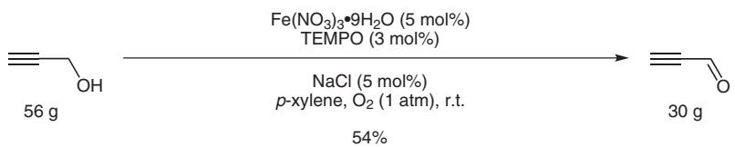
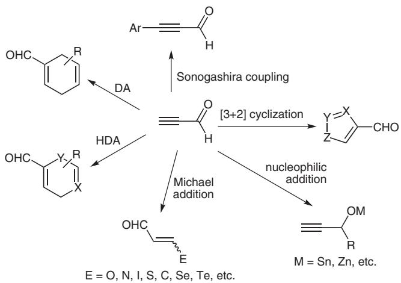
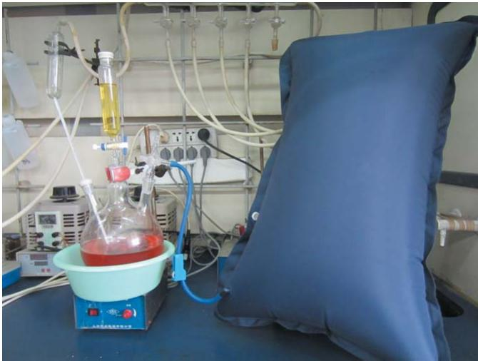

# practical synthetic procedures Aerobic Oxidation of Propargyl Alcohol: A Convenient Method for the Synthesis of Propiolaldehyde

Convenient Synthesis of Propiolaldehyde Jinxian Liu,a,b Shengming Ma\*a,c

a Shanghai Key Laboratory of Green Chemistry and Chemical Process, Department of Chemistry, East China Normal University, 3663 North Zhongshan Lu, Shanghai 200062, P. R. of China Fax +86(21)62609305; E-mail: masm@sioc.ac.cn   
b College of Chemistry and Materials Science, Longyan University, Longyan 364012, P. R. of China   
c State Key Laboratory of Organometallic Chemistry, Shanghai Institute of Organic Chemistry, Chinese Academy of Sciences, 354 Fenglin Lu, Shanghai 200032, P. R. of China

Received: 26.03.2013; Accepted after revision: 17.04.2013

text_image

PSP
No 250

Abstract: Propiolaldehyde was prepared by the oxidation of propargyl alcohol using molecular oxygen as the oxidant under atmospheric pressure and room temperature in a decent yield. Compared to the previous method with ${ \mathrm { C r O } } _ { 3 } ,$ , such a protocol avoids the use of a stoichiometric amount of oxidant, and the workup procedure is much more eco-friendly and convenient affording a higher yield of the product.

Key words: propargyl alcohol, aerobic oxidation, iron nitrate, TEMPO, sodium chloride

chemical

Organic reaction scheme showing oxidation of a hydroxy alcohol to an enone using Fe(NO3)3·9H2O and TEMPO under NaCl conditions

Scheme 1 Iron-catalyzed aerobic oxidation of propargyl alcohol

Propiolaldehyde is an important and useful chemical intermediate for organic synthesis, especially for the Michael addition,1 nucleophilic addition,2 Diels–Alder reaction,3 [3+2] cyclization,4 Sonogashira coupling,5 as well as other reactions6 (Scheme 2).

chemical

Reaction mechanism diagram showing sonogashira coupling and nucleophilic addition pathways for a heterocyclic compound

Scheme 2 Reactions of propiolaldehyde

Traditionally, propiolaldehyde is prepared by the oxidation of propargyl alcohol using at least a stoichiometric amount of oxidants, such as $\mathrm { { \bar { C } r O } } _ { 3 } , ^ { 7 }$ MnO28 as well as $\mathrm { D M S O . } ^ { 9 }$ In 1956, Sauer reported a practical method for the oxidation of propargyl alcohol using $\mathrm { C r O } _ { 3 }$ as oxidant affording propiolaldehyde in 35–41% yield.7a However, this oxidation system would produce almost a quantitative amount of oxidant-derived chromium waste, which is difficult to remove and the workup procedure is not so convenient for isolation. Therefore, novel protocols for this oxidation are highly required.

As a cheap and mild oxidant, molecular oxygen has drawn more and more attention.10 Recently, our group has developed an eco-friendly, mild, and practical aerobic oxidation protocol for alcohols bearing various types of functional groups including allenic, benzylic, allylic, as well as propargylic alcohols using $\mathrm { F e } ( \mathrm { N O } _ { 3 } ) _ { 3 } { \cdot } 9 \mathrm { H } _ { 2 } \mathrm { O } _ { \cdot }$ , TEMPO and NaCl as catalysts under atmospheric pressure and room temperature in 1,2-dichloroethane11 or toluene.12 Compared to Sauer’s method, this aerobic oxidation protocol is much more eco-friendly and convenient. Thus, we have now applied this protocol to the synthesis of propiolaldehyde.

Based on our previous observation, 1,2-dichloroethane is the best solvent for this reaction. However, the boiling point of propiolaldehyde is close to DCE, and it would be difficult to isolate. Therefore, an alternative solvent for this reaction was chosen. $p { \mathrm { - } } { \mathrm { X y } }$ lene is a commonly used organic solvent with a high boiling point. Fortunately, when p-xylene was used as reaction solvent instead of DCE, 54% isolated yield of propiolaldehyde was obtained after only simple workup procedure and distillation (Scheme 1).

In conclusion, we have developed a practical, mild, and convenient procedure for the synthesis of propiolaldehyde using molecular oxygen as oxidant under atmospheric pressure at room temperature with a higher yield.

1 H and 13C NMR spectra were recorded with an instrument operated at 300 MHz for 1 H NMR and 75 MHz for 13C NMR in ${ \mathrm { \hat { C } D C l } } _ { 3 } .$ Chemical shifts (δ) are given in parts per million (ppm). IR spectra were recorded on an FT IR spectrometer. Mass spectra were recorded in EI mode. Fe(NO3)3·9H2O, NaCl, and p-xylene were purchased from Sinopharm Chemical Reagent Corporation; TEMPO (purity: 99%) was purchased from AstaTech Pharmaceutical Corporation; propargyl alcohol (purity: 98%) was available from Shanghai Darui Fine Chemical Corporation.

# Propiolaldehyde (1)

A three-necked 2000 mL round-bottomed flask equipped with a thermometer and a pressure-equalizing addition funnel was fitted with a magnetic stirring bar. To this flask were added Fe(NO3)3·9H2O (20.20 g, 50.0 mmol), TEMPO (4.70 g, 30.0 mmol), NaCl (2.91 g, 50 mmol), and p-xylene (1000 mL) under the atmosphere of air at r.t. The air atmosphere was then replaced with oxygen by an oxygen bag commonly used in hospitals (SY-42 L, Shanghai Sanhe Medical Instrument CO., Ltd) (Figure 1). Propargyl alcohol (58.0 mL, d = 0.949, 55.85 g, 1.0 mol) was injected via a syringe and then added to the suspension through the addition funnel dropwise with stirring at r.t. within \~1 h. After stirring at r.t. for an additional 4 h (note: the reaction was exothermic, so the internal temperature would rise up to $4 5 ^ { \circ } \mathrm { C } ;$ care must be taken to keep the temperature <45 °C), the reaction was complete as monitored by 1 H NMR analysis (300 MHz, CDCl3) till the signals for the starting alcohol (δ = 4.24, d, J = 2.4 Hz, 2 H, CH2) disappeared. The resulting liquid layer was separated, and the residue was washed with p-xylene (2 × 50 mL). The combined organic layers were dried (Na2SO4) and filtered through a short pad of silica gel (Φ 7 cm × 1 cm). The filtrate was transferred to a 2 L round-bottomed flask equipped with a magnetic stirring bar and distilled through a Liebig condenser (20

natural_image

Laboratory setup with glassware and a blue cushion, no visible text or symbols

Figure 1 The reaction apparatus used for the aerobic oxidation of propargyl alcohol

cm) under atmospheric pressure to afford propiolaldehyde (38.78 g, bp 53–83 °C/760 mm Hg) containing about 12–23% of the solvent. Redistillation led to the collection of pure propiolaldehyde;13 yield: 30.06 g (54%); bp 54–57 °C/760 mm Hg; purity: 94%. The purity was determined by GC. Conditions: column: HP-5 (25 m × 0.32 mm); carrier: N2; injector: $2 5 0 ^ { \circ } \mathrm { C } ;$ detector (FID, H2): 250 °C; flow: 50 °C for 5 min, 3 °C/min to 150 °C and hold for 5 min; tR = 1.4 min (propiolaldehyde, 94%), $t _ { \mathrm { R } } = 5 . 1$ min (p-xylene, 5%).

Note: The product should be stored in a bottle with a glass-stopper, since contaminants from a rubber stopper may be sufficient to catalyze decomposition.

IR (neat): 3272, 2880, 2098, 1669, 1390, 948, 682 cm–1.

1 H NMR (300 MHz, CDCl3): δ = 9.21 (s, 1 H), 3.48 (s, 1 H).

13C NMR (75.4 MHz, CDCl3): δ = 176.4, 82.6, 81.5.

MS (EI): m/z (%) = 54 (M+, 16.93), 53 (M+ – H, 100).

# Acknowledgment

We greatly acknowledge the financial support from the Major State Basic Research Development Program of China (NO. 2009CB825300) and the National Natural Science Foundation of China (21232006).

Supporting Information for this article is available online at http://www.thieme-connect.com/ejournals/toc/synthesis.SIfr

# References

(1) (a) Sauer, J. C. J. Am. Chem. Soc. 1957, 79, 5314. (b) Dabrowski, J.; Kamienska-Trela, K. J. Am. Chem. Soc. 1976, 98, 2826. (c) Johnson, F.; Pillai, K. M. R.; Grollman, A. P.; Tseng, L.; Takeshita, M. J. Med. Chem. 1984, 27, 954.   
(d) Gorgues, A.; Simon, A.; Le Coq, A.; Hercouet, A.; Corre, F. Tetrahedron 1986, 42, 351. (e) Comasseto, J. V.; Brandt, C. A. Synthesis 1987, 146. (f) Mo, X.-S.; Huang, Y.- Z. Tetrahedron Lett. 1995, 36, 3539. (g) Berger, D.; Bartlome, A.; Neuenschwander, M. Helv. Chim. Acta 1996, 79, 179.   
(2) (a) Degl’Innocenti, A.; Capperucci, A.; Reginato, G.; Mordini, A.; Ricci, A. Tetrahedron Lett. 1992, 33, 1507. (b) Seebach, D.; Beck, A. K.; Schmidt, B.; Wang, Y. M. Tetrahedron 1994, 50, 4363. (c) Sandanayaka, V. P.; Feigelson, G. B.; Prashad, A. S.; Yang, Y.; Petersen, P. J. Bioorg. Med. Chem. Lett. 2001, 11, 997. (d) Gusarova, N. K.; Reutskaya, A. M.; Ivanova, N. I.; Medvedeva, A. S.; Demina, M. M.; Novopashin, P. S.; Afonin, A. V.; Albanov, A. I.; Trofimov, B. A. J. Organomet. Chem. 2002, 67, 172. (e) Karama, U.; Höfle, G. Eur. J. Org. Chem. 2003, 1042. (f) Xu, D.; Li, Z.; Ma, S. Tetrahedron: Asymmetry 2003, 14, 3657.   
(3) (a) Baldwin, S. W.; Tomesch, J. C. J. Org. Chem. 1980, 45, 1455. (b) Matcheva, K.; Beckmann, M.; Schomburg, D.; Winterfeldt, E. Synthesis 1989, 814. (c) Caprathe, B. W.; Jaen, J. C.; Wise, L. D.; Heffner, T. G.; Pugsley, T. A.; Meltzer, L. T.; Parvez, M. J. Am. Chem. Soc. 1996, 118, 7513. (d) Guzmán, A.; Romero, M.; Talamás, F. X. J. Org. Chem. 1996, 61, 2470. (e) Bäurle, S.; Blume, T.; Mengel, A.; Parchmann, C.; Skuballa, W.; Bäsler, S.; Schäfer, M.; Sülzle, D.; Wrona-Metzinger, H.-P. Angew. Chem. Int. Ed. 2003, 42, 3961. (f) Jones, S. B.; Simmons, B.; Mastracchio, A.; MacMillan, D. W. C. Nature 2011, 475, 183.   
(4) (a) Kobayashi, K.; Igura, Y.; Imachi, S.; Masui, Y.; Onaka, M. Chem. Lett. 2007, 36, 60. (b) Jarowski, P. D.; Wu, Y.-L.; Schweizer, W. B.; Diederich, F. Org. Lett. 2008, 10, 3347.

(c) Creary, X.; Anderson, A.; Brophy, C.; Crowell, F.; Funk, Z. J. Org. Chem. 2012, 77, 8756.   
(5) Li, L.; Zhang, J. Org. Lett. 2011, 13, 5940.   
(6) (a) Marnett, L. J.; Basu, A. K.; O’Hara, S. M.; Weller, P. E.; Rahman, A. F. M. M.; Oliver, J. P. J. Am. Chem. Soc. 1986, 108, 1348. (b) Caprathe, B. W.; Jaen, J. C.; Wise, L. D.; Heffner, T. G.; Pugsley, T. A.; Meltzer, L. T.; Parvez, M. J. Med. Chem. 1991, 34, 2736. (c) Marcinek, A.; Adamus, J.; Huben, K.; Gebicki, J.; Bartczak, T. J.; Bednarek, P.; Bally, T. J. Am. Chem. Soc. 2000, 122, 437. (d) Granum, K. A.; Merkel, G.; Mulder, J. A.; Debbins, S. A.; Hsung, R. P. Tetrahedron 2012, 68, 9293.   
(7) (a) Sauer, J. C. Org. Synth. 1956, 36, 66; Org. Synth. Coll. Vol. IV; Wiley: New York, 1963, 813. (b) Wille, F.; Saffer, L.; Weiskopf, W. Justus Liebigs Ann. Chem. 1950, 568, 34. (c) Veliev, M. G.; Guseinov, M. M. Synthesis 1980, 461. (d) van der Kerk, S. M.; Boersma, J.; van der Kerk, G. J. M. J. Organomet. Chem. 1981, 215, 303. (e) Kang, Y. K.; Lee,

K. S.; Yoo, K. H.; Shin, K. J.; Kim, D. C.; Lee, C.-S.; Kong, J. Y.; Kim, D. J. Bioorg. Med. Chem. Lett. 2003, 13, 463. (f) Seburg, R. A.; Hodges, J. A.; McMahon, R. J. Helv. Chim. Acta 2009, 92, 1626.   
(8) Lai, T. K.; Banerji, J.; Chatterjee, A.; Basak, B. Indian J. Chem., Sect. B: Org. Chem. Incl. Med. Chem. 2005, 44, 1309.   
(9) Dubey, A.; Kandula, S. R. V.; Kumar, P. Synth. Commun. 2008, 38, 746.   
(10) Qian, G.; Zhao, R.; Lu, G.; Qi, Y.; Suo, J. Synth. Commun. 2004, 34, 1753.   
(11) Ma, S.; Liu, J.; Li, S.; Chen, B.; Cheng, J.; Kuang, J.; Liu, Y.; Wan, B.; Wang, Y.; Ye, J.; Yu, Q.; Yuan, W.; Yu, S. Adv. Synth. Catal. 2011, 353, 1005.   
(12) Liu, J.; Xie, X.; Ma, S. Synthesis 2012, 44, 1569.   
(13) Szekelya, J.; Wang, H.; Peplowskia, K. M.; Knutsona, C. G.; Marnetta, L. J.; Rizzoa, C. J. Nucleosides, Nucleotides Nucleic Acids 2008, 27, 103.