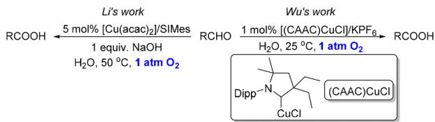
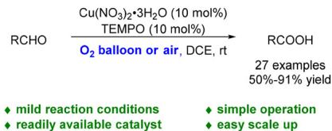
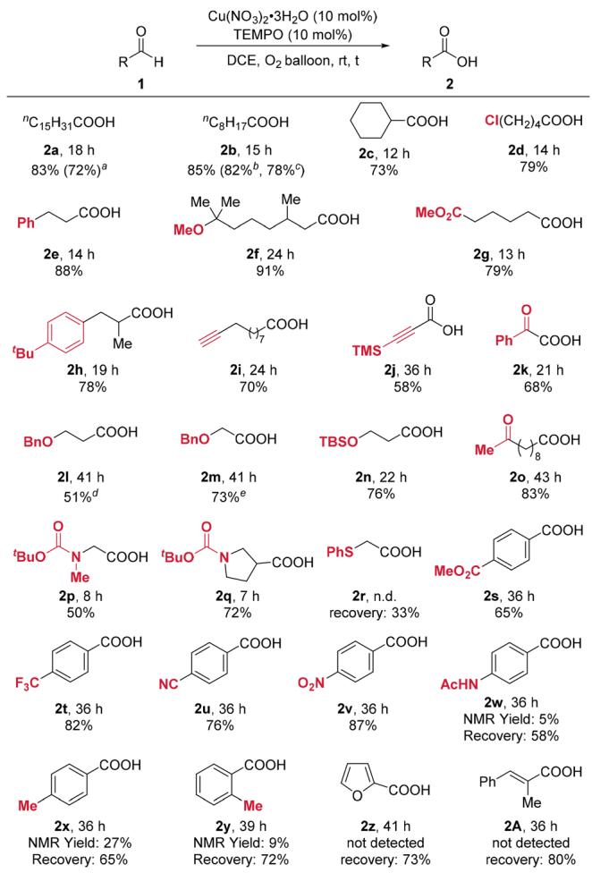
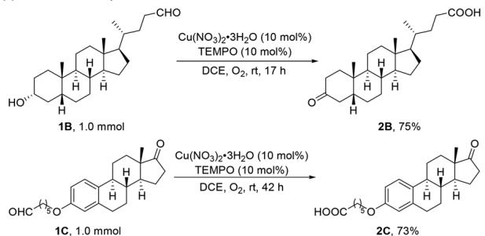
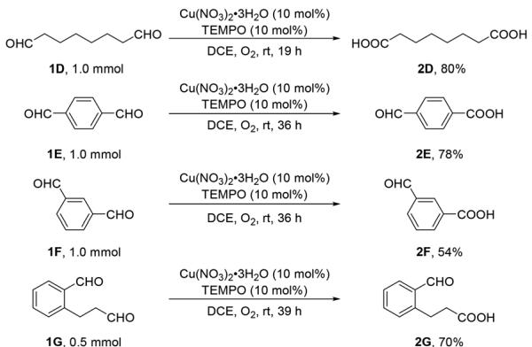
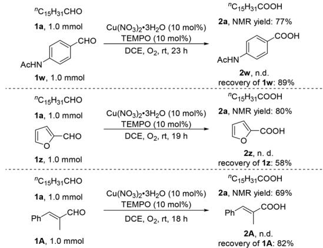

# RESEARCH ARTICLE

View Article Online

View Journal

Check for updates

Cite this: DOI: 10.1039/d5qo00330j

# Copper-catalyzed aerobic oxidation of aldehydes to carboxylic acids†

Yankai Huang,a Sheng Jiang,a Zhengnan Zhou,b Yibo Yu, \*a Hui Qian \*a and Shengming Ma \*a,b

Received 17th February 2025,

Accepted 15th April 2025

DOI: 10.1039/d5qo00330j

rsc.li/frontiers-organic

An efficient, practical aerobic oxidation of aldehydes to carboxylic acids using $O _ { 2 }$ or air as the oxidant has been developed. The reaction was carried out with a catalytic amount each of $\mathsf { C u } ( \mathsf { N O } _ { 3 } ) _ { 2 } { \cdot } 3 \mathsf { H } _ { 2 } \mathsf { O }$ and TEMPO at room temperature, tolerating many useful functional groups such as alkynyl, amino, aryl, etc. Complex molecules and compounds containing multiple aldehyde groups are applicable to this reaction with excellent selectivity. Gram-scale reactions have been easily conducted.

# Introduction

Carboxylic acids are a class of compounds that are extremely common in nature and widely used in laboratory,1 daily life,2 and industry.3 The oxidation of the corresponding aldehydes is one of the most straightforward strategies for the production of carboxylic acids.4 Traditionally, stoichiometric oxidants, such as metallic oxidants,5 peroxides,6 and hypervalent iodine compounds,7 are required. However, there exists an issue of generating equal amounts of waste from the applied oxidants. In contrast, molecular oxygen is a clean and atom-economic oxidant and water is usually the only by-product. Therefore, using environmentally friendly and inexpensive molecular oxygen as an oxidant has a significant advantage.8 Such aerobic oxidations have been achieved with noble metal catalysts, usually requiring higher reaction temperatures or stoichiometric amounts of additives.9 As a comparison, Earthabundant metal catalysts, such as Fe, Co, and Ni, can also catalyze this process.10 Copper, as an Earth-abundant metal, has been widely used in catalytic aerobic oxidation reactions; however, most oxidation reactions of alcohols stopped at the stage of the corresponding aldehydes,11,12 and there are relatively few reports on the oxidation of aldehydes to carboxylic acids.13 In 2008, Sekar’s group reported a CuCl-catalyzed oxidation of aldehydes to carboxylic acids at room temperature; however, the reaction requires one equivalent of explosive

chemical, TBHP, as the oxidant (Scheme $1 \mathrm { a } ) . ^ { 6 d }$ In 2016, Li’s group reported the Cu/NHC-catalyzed aerobic oxidation of aldehydes with one equivalent of NaOH, and the reaction needs to be carried out at 50 $^ { \circ } \mathrm { C } . ^ { ^ { 1 3 a } }$ Recently, Wu’s group reported a (CAAC)CuCl-catalyzed aerobic oxidation of aldehydes at ${ 2 5 ~ ^ { \circ } \mathrm { C } } ,$ , in which the substrates are mainly aromatic aldehydes (Scheme 1b).13b Herein, we wish to report a practical $\mathrm { C u } ( \mathrm { N O } _ { 3 } ) _ { 2 } { \cdot } 3 \mathrm { H } _ { 2 } \mathrm { O }$ and TEMPO catalyzed aerobic oxidation of aldehydes to carboxylic acids at room temperature (Scheme 1c).

# Results and discussion

We conducted initial studies with the evaluation of different copper catalysts to enable the aerobic oxidation of aldehydes

(Copper catalyzed oxidation of aldehydes to acids with TBHP as the oxidant

Copper catalyzed aerobic oxidation of aldehydes to acids with the preprepared catalyst

chemical

Two-step organic synthesis reaction scheme involving Li and Wu work, followed by CuCl-catalyzed cyclization to yield a product with Dipp and (CAAC)CuCl groups.

This work: Copper catalyzed aerobic oxidation with a commercially available catalyst to carboxylic acids using n-hexadecanal (1a) as the model substrate (Table 1). The oxidation of n-hexadecanal proceeded smoothly when using 10 mol% each of $\mathrm { C u } ( \mathrm { N O } _ { 3 } ) _ { 2 } { \cdot } 3 \mathrm { H } _ { 2 } \mathrm { O }$ and TEMPO as the catalysts (Table 1, entry 1). When switching to other copper catalysts, such as $\mathrm { C u C l } _ { 2 } , \ \mathrm { C u ( O A c ) } _ { 2 }$ , CuBr, and CuOAc, the oxidative reaction did not occur (Table 1, entries 2–5). The reaction with $\mathrm { L i N O } _ { 3 } , \mathrm { N a N O } _ { 3 } ,$ or ${ \bf K N O } _ { 3 }$ in the absence of any Cu salt failed to afford 2a; thus, Cu must have played a critical role in the oxidation process (Table 1, entries 6–8). Combining $\mathrm { L i N O } _ { 3 }$ with other Cu(II) salts, such as $\mathrm { C u C l } _ { 2 }$ and $\mathrm { C u } ( \mathrm { O A c } ) _ { 2 } ,$ did not yield the corresponding product (Table 1, entries 9 and 10). The reaction also failed with the more costeffective 4-OH-TEMPO (Table 1, entry 11). No desired product was observed in toluene or MeCN (Table 1, entries 12 and 13). Finally, control experiments showed that the oxidative reaction proceeded very slowly without TEMPO (Table 1, entry 14), while it failed to proceed in the absence of $\mathrm { C u } ( \mathrm { N O } _ { 3 } ) _ { 2 } { \cdot } 3 \mathrm { H } _ { 2 } \mathrm { O }$ (Table 1, entry 15).

chemical

Chemical reaction scheme for RCHO using Cu(NO3)2·3H2O and TEMPO under O2 balloon or air conditions, yielding RCOOH with 50%-91% yield

Scheme 1 Copper catalyzed oxidation of aldehydes to acids.

With the optimized reaction conditions in hand, the substrate scope was then investigated (Scheme 2). Linear aliphatic aldehydes and cyclohexanecarbaldehyde could all be oxidized smoothly to the corresponding acids 2a–2c. The oxidation reaction of 1a with an air balloon gave product 2a albeit with a slightly lower yield. The reaction may be easily conducted on a 50 mmol scale by using a pure oxygen bag with 1b as the substrate. When 1b was reacted under an air atmosphere, similar results could be obtained by extending the reaction time. The reactions of aliphatic aldehydes containing different functional groups, such as halogen, ester, ether, and aryl groups,

Table 1 Optimization of the reaction conditionsa 

<table><tr><td></td><td> $^nC_{15}H_{31}CHO$ 1a, 0.5 mmol</td><td> $Cu(NO_3)_2 \cdot 3H_2O$  (10 mol%)TEMPO (10 mol%)DCE,  $O_2$  balloon, rt, 18 h&quot;standard conditions&quot;</td><td> $^nC_{15}H_{31}COOH$ 2a</td><td></td></tr><tr><td>Entry</td><td colspan="2">Variation from the &quot;standard conditions&quot;</td><td>Recovery (%)</td><td>Yield (%)</td></tr><tr><td>1</td><td colspan="2">None</td><td>0</td><td>86</td></tr><tr><td>2</td><td colspan="2"> $CuCl_2$  instead of  $Cu(NO_3)_2 \cdot 3H_2O$ </td><td>91</td><td>0</td></tr><tr><td>3</td><td colspan="2"> $Cu(OAc)_2$  instead of  $Cu(NO_3)_2 \cdot 3H_2O$ </td><td>89</td><td>0</td></tr><tr><td>4</td><td colspan="2">CuBr instead of  $Cu(NO_3)_2 \cdot 3H_2O$ </td><td>88</td><td>0</td></tr><tr><td>5</td><td colspan="2">CuOAc instead of  $Cu(NO_3)_2 \cdot 3H_2O$ </td><td>85</td><td>0</td></tr><tr><td>6</td><td colspan="2"> $LiNO_3$  instead of  $Cu(NO_3)_2 \cdot 3H_2O$ </td><td>91</td><td>0</td></tr><tr><td>7</td><td colspan="2"> $NaNO_3$  instead of  $Cu(NO_3)_2 \cdot 3H_2O$ </td><td>86</td><td>0</td></tr><tr><td>8</td><td colspan="2"> $KNO_3$  instead of  $Cu(NO_3)_2 \cdot 3H_2O$ </td><td>93</td><td>0</td></tr><tr><td>9</td><td colspan="2"> $CuCl_2$  and  $LiNO_3$  instead of  $Cu(NO_3)_2 \cdot 3H_2O$ </td><td>88</td><td>0</td></tr><tr><td>10</td><td colspan="2"> $Cu(OAc)_2$  and  $LiNO_3$  instead of  $Cu(NO_3)_2 \cdot 3H_2O$ </td><td>88</td><td>0</td></tr><tr><td>11</td><td colspan="2">4-OH-TEMPO instead of TEMPO</td><td>84</td><td>0</td></tr><tr><td>12</td><td colspan="2">Toluene instead of DCE</td><td>88</td><td>0</td></tr><tr><td>13</td><td colspan="2">MeCN instead of DCE</td><td>88</td><td>0</td></tr><tr><td>14</td><td colspan="2">Without TEMPO</td><td>31</td><td>38</td></tr><tr><td>15</td><td colspan="2">Without  $Cu(NO_3)_2 \cdot 3H_2O$ </td><td>83</td><td>0</td></tr></table>

a The reaction was conducted with aldehyde 1a (0.5 mmol), copper salts and/or nitrate salts (0.05 mmol), TEMPO (0.05 mmol), and solvent (2.0 mL) with an $\mathbf { O } _ { 2 }$ balloon at rt. The NMR yield and recovery were determined by 1 H NMR analysis with dibromomethane as the internal standard.

chemical

Chemical reaction scheme showing copper-catalyzed coupling of alcohols to ketones, with yields and stereochemistry indicated for each product.

Scheme 2 Substrate scope. The reaction was conducted with 1 (1.0 mmol), $\mathsf { C u } ( \mathsf { N O } _ { 3 } ) _ { 2 } . 3 \mathsf { H } _ { 2 } \mathsf { O }$ (0.1 mmol), and TEMPO (0.1 mmol) in 4 mL of DCE at rt for a specified time with an $\mathsf { O } _ { 2 }$ balloon. a An air balloon was used. b 1b (50 mmol) with an $\mathsf { O } _ { 2 }$ bag, 24 h. c 1b (50 mmol) under open air, 30 h. d 15% NMR yield of benzaldehyde and 22% recovery of 1l were detected. e 5% NMR yield of benzaldehyde was detected.

also afforded the corresponding carboxylic acids 2d–2h. No benzylic C–H bond oxidation products were observed under the standard conditions (2e and 2h). The reaction also tolerated conjugated or unconjugated C–C triple bonds (1j and 1i) or the ketone functionality (1k and 1o) affording carboxylic acids 2i–2k and 2o. The aerobic oxidation of 3-(benzyloxy)propanal 1l afforded 51% of carboxylic acid 2l and 15% of benzaldehyde with 22% recovery of 1l. Such a benzylic C–O bond oxidative cleavage product was also formed in our previous report.14 The aerobic oxidation of 2-(benzyloxy)acetaldehyde 1m afforded 73% of 2m and also 5% of benzaldehyde. The aldehyde with silyl ether motif 1n could also be converted to the corresponding acid 2n in 76% yield; the corresponding deprotection product and the deprotective oxidation product were not obtained.15 Amino-carbonyl group-substituted aldehydes 1p and 1q also worked smoothly yielding the corresponding carboxylic acids 2p and 2q. However, for the substrate containing thioether unit 1r, the reaction was messy without affording the desired acid 2r. Aromatic aldehydes 1s–

1v substituted with electron-withdrawing groups were more easily oxidized to afford the corresponding acids 2s–2v in good to high yields. However, aldehydes 1w–1y substituted with electron-donating groups afforded 5% of acid 2w with 58% recovery, 27% of acid 2x with 65% recovery, and 9% of acid 2y with 72% recovery, respectively. The reactivity of electron-deficient aromatic aldehydes was much higher (2s–2v vs. 2w–2y). The reactions of 2-furaldehyde 1z and $\mathbf { \alpha } _ { \mathbf { \alpha } _ { } \mathbf { \beta } _ { } }$ -unsaturated enal 1A also failed to afford the corresponding acids.

This reaction also works with complex molecules: compound 1B containing a steroid skeleton could be oxidized to 2B in 75% yield with the secondary alcohol being converted to the ketone as well; compound 1C containing an estrone skeleton could be oxidized to the corresponding carboxylic acid 2C in 73% yield (Scheme 3a). No epimerization of the stereocenters occurred owing to the mild reaction conditions, as deter-

(a) Oxidation of complex molecules   

chemical

Chemical reaction scheme showing oxidation of compounds 1B and 1C to products 2B and 2C using Cu(NO3)2·3H2O under TEMPO conditions

(b) Selective oxidations of dialdehydes

chemical

Chemical reaction scheme showing copper-catalyzed coupling of compounds 1D and 1E to form products 2D, 2E, 2F, and 2G with yields and conditions

Competitive reactions between aliphatic aldehydes, conjugated enal, and aromatic aldehydes   

chemical

Chemical reaction scheme showing synthesis of compound 1A from various acrylate derivatives and NMR yields

Scheme 3 Reactions of complex molecules, dialdehydes and competitive experiments.

(a) Copper-catalyzed aerobic oxidation of primary alcohols to carboxylic acids 

<table><tr><td rowspan="3">nC15H31CH2OH
3, 1 mmol</td><td>Cu(NO3)2·3H2O (10 mol%)
TEMPO (10 mol%)</td><td rowspan="3">nC15H31COOH
2a, NMR yield: 89%</td></tr><tr><td>KHSO4(10 mol%)</td></tr><tr><td>DCE, O2, rt, 30 h</td></tr><tr><td>nC15H31CH2OH
3, 1 mmol</td><td>Cu(NO3)2·3H2O (10 mol%)
TEMPO (10 mol%)
DCE, O2, rt, 30 h</td><td>nC15H31CHO
1a, NMR yield: 67%</td></tr></table>

(b) Copper catalyzed aerobic oxidation of aldehydes to carboxylic acids 

<table><tr><td rowspan="2">nC15H31CHO</td><td>Cu(NO3)2·3H2O (10 mol%) 
TEMPO (10 mol%)</td><td rowspan="2">nC15H31COOH</td></tr><tr><td>KHSO4(10 mol%)</td></tr><tr><td>1a, 0.5 mmol</td><td>DCE, O2, rt, 24 h</td><td>2a, NMR yield: 85%</td></tr><tr><td rowspan="2">nC15H31CHO</td><td>Cu(NO3)2·3H2O (10 mol%) 
TEMPO (10 mol%)</td><td>nC15H31COOH</td></tr><tr><td>DCE, O2, rt, 24 h</td><td>2a, NMR yield: 85%</td></tr><tr><td>1a, 0.5 mmol</td><td></td><td></td></tr></table>

Scheme 4 The effects of $K H S O _ { 4 }$ on Cu/TEMPO catalyzed aerobic oxidation.

mined by $^ 1 \mathrm { H }$ and $^ { 1 3 } \mathrm { C }$ NMR analysis. Octanedial 1D may be oxidized to suberic acid 2D. Interestingly, for the reactions of para-phthalaldehyde 1E and meta-phthalaldehyde $^ { 1 \mathrm { F } , }$ only one aldehyde group was oxidized to afford aromatic carboxylic acids 2E and 2F with another aldehyde functionality remaining. The observed phenomenon could be rationalized by the low solubility of 2E and 2F, leading to precipitation during the reaction. With the substrate containing both aromatic aldehyde and aliphatic aldehyde, the aliphatic aldehyde unit was preferentially oxidized to afford product 2G (Scheme 3b). The result was consistent with the oxidation of o-methylbenzaldehyde 1y (Scheme $_ { 2 ) ; }$ the reactivity of ortho-alkyl substituted benzaldehyde was low due to the steric and electronic effects. Intermolecular competition experiments showed that aliphatic aldehydes were preferentially oxidized over aromatic aldehydes (Scheme 3c). When aliphatic aldehyde 1a and aromatic aldehydes 1w or 1z were introduced to the same reaction vessel, only aliphatic aldehyde 1a was oxidized; for the reaction of 1a in the presence of α,β-unsaturated enal 1A, only 1a was oxidized as well.

In the copper-catalyzed primary alcohol oxidation to acids, the addition of $\mathrm { K H S O _ { 4 } }$ significantly accelerated the reaction.16 In the absence of $\mathrm { K H S O _ { 4 } } ,$ only the generation of aldehyde was observed (Scheme $\mathsf { 4 a ) . }$ . However, in this copper-catalyzed aldehyde oxidation to acids, after 12 hours, regardless of the presence or absence of $\mathrm { K H S O _ { 4 } } ,$ aldehyde 1a was completely converted to carboxylic acid 2a (Scheme 4b). Based on these results, we reasoned that the mechanism is most probably different from that of alcohol. Thus, the mechanism is not clear yet, and further studies are in progress.

# Conclusions

In summary, we have developed an efficient synthesis of carboxylic acids via aerobic oxidation of aldehydes using

10 mol% each of $\mathrm { C u } ( \mathrm { N O } _ { 3 } ) _ { 2 } { \cdot } 3 \mathrm { H } _ { 2 } \mathrm { O }$ and TEMPO as catalysts and ambient 1 atm of pure ${ \bf O } _ { 2 }$ or oxygen in air as the oxidant. The transformation proceeded under very mild reaction conditions, which enabled the tolerance of many functionalities. This method exhibits excellent selectivity for different aldehyde functionalities. Further studies are being pursued in our laboratory.

# Author contributions

S. M., H. Q. and Y. Y. conceived and directed the project and designed the experiments. Y. H. conducted most of the experiments. S. J. conducted the experiments for the paper revisions according to the review reports. Z. Z. participated in the optimization of the reaction conditions. Y. H, H. Q. and S. M. checked the experimental data and wrote the manuscript.

# Data availability

The data supporting this article have been included as part of the ESI.†

# Conflicts of interest

There are no conflicts to declare.

# Acknowledgements

Financial support from the National Key R&D Program of China (Grant No. 2022YFA1503200) is greatly appreciated. We thank Mr Zuizhi Lin in this group for reproducing the results of 2g, 2q, and 2F presented in Schemes 2 and 3.

# References

1 (a) L. J. Gooßen, N. Rodríguez and K. Gooßen, Carboxylic Acids as Substrates in Homogeneous Catalysis, Angew. Chem., Int. Ed., 2008, 47, 3100–3120; (b) C. Min and D. Seidel, Asymmetric Brønsted Acid Catalysis with Chiral Carboxylic Acids, Chem. Soc. Rev., 2017, 46, 5889–5902;   
(c) N. Rodríguez and L. J. Goossen, Decarboxylative Coupling Reactions: A Modern Strategy for C–C-Bond Formation, Chem. Soc. Rev., 2011, 40, 5030–5048;   
(d) S. B. Beil, T. Q. Chen, N. E. Intermaggio and D. W. C. MacMillan, Carboxylic Acids as Adaptive Functional Groups in Metallaphotoredox Catalysis, Acc. Chem. Res., 2022, 55, 3481–3494.

2 (a) S. Patai, The chemistry of acid derivatives, wiley, New York, 1992; (b) S. S. Bharate, Carboxylic Acid Counterions in FDA-Approved Pharmaceutical Salts, Pharm. Res., 2021, 38, 1307–1326.

3 J. Magano and J. R. Dunetz, Large-Scale Carbonyl Reductions in the Pharmaceutical Industry, Org. Process Res. Dev., 2012, 16, 1156–1184.   
4 (a) M. B. Smith and J. March, March’s Advanced Organic Chemistry: Reactions, Mechanisms, and Structure, Wiley, Hoboken, 7th edn, 2013, ch. 19, pp. 1703–1869; (b) J. Clayden, N. Greeves and S. Warren, Organic Chemistry, Oxford University Press, Oxford, 2nd edn, 2012, ch. 23, pp. 528–561; (c) J. E. Bäckvall, Modern Oxidation Methods, John Wiley & Sons, Weinheim, Germany, 2011; (d) G. Tojo and M. Fernández, Oxidation of Primary Alcohols to Carboxylic Acids, Springer, New York, 2007; (e) S. Caron, R. W. Dugger, S. G. Ruggeri, J. A. Ragan and D. H. B. Ripin, Large-Scale Oxidations in the Pharmaceutical Industry, Chem. Rev., 2006, 106, 2943–2989.   
5 (a) R. L. Shriner and E. C. Kleiderer, Piperonylic acid, Org. Synth., 1930, 2, 538; (b) G. B. Evans, S. A. Cameron, S. R. Culbert and P. K. Grant, Tetrahedron Lett., 2014, 55, 6227–6230.   
6 (a) B. Ganem, R. P. Heggs, A. J. Biloski and D. R. Schwartz, A New Oxidation of Aldehydes to Carboxylic Acids, Tetrahedron Lett., 1980, 21, 685–688; (b) J.-K. Choi, Y.-K. Chang and S.-Y. Hong, Catalytic Oxidation of Aldehydes to Carboxylic Acids with Hydrogen Peroxide as Oxidant, Tetrahedron Lett., 1988, 29, 1967–1970; (c) K. Nakagawa, S. Mineo and S. Kawamura, Oxidation with Nickel Peroxide. XI. Oxidation of Aromatic Aldehydes to Carboxylic Acids in Aqueous Alkaline Solution, Chem. Pharm. Bull., 1978, 26, 299–302; (d) S. Mannam and G. Sekar, CuCl Catalyzed Oxidation of Aldehydes to Carboxylic Acids with Aqueous Tert-Butyl Hydroperoxide under Mild Conditions, Tetrahedron Lett., 2008, 49, 1083– 1086.   
7 M. Hunsen, Carboxylic Acids from Primary Alcohols and Aldehydes by a Pyridinium Chlorochromate Catalyzed Oxidation, Synthesis, 2005, 2487–2490.   
8 (a) T. Punniyamurthy, S. Velusamy and J. Iqbal, Recent Advances in Transition Metal Catalyzed Oxidation of Organic Substrates with Molecular Oxygen, Chem. Rev., 2005, 105, 2329–2364; (b) J. Liu, A. Guðmundsson and J.-E. Bäckvall, Efficient Aerobic Oxidation of Organic Molecules by Multistep Electron Transfer, Angew. Chem., Int. Ed., 2021, 60, 15686–15704; (c) S. E. Allen, R. R. Walvoord, R. Padilla-Salinas and M. C. Kozlowski, Aerobic Copper-Catalyzed Organic Reactions, Chem. Rev., 2013, 113, 6234–6458.   
9 For selected reports on the noble metal catalyzed aerobic oxidation of aldehydes to acids, see: (a) F. Vocanson, Y. P. Guo, J. L. Namy and H. B. Kagan, Dioxygen Oxidation of Alcohols and Aldehydes ver a Cerium Dioxide-Ruthenium System, Synth. Commun., 1998, 28, 2577–2582; (b) Z. Yang, R. Luo, Z. Zhu, X. Yang and W. Tang, Harnessing the Reactivity of Iridium Hydrides by Air: Iridium-Catalyzed Oxidation of Aldehydes to Acids in Water, Organometallics, 2017, 36, 4095–4098; (c) S. Biella, L. Prati and M. Rossi, Gold Catalyzed Oxidation of

Aldehydes in Liquid Phase, J. Mol. Catal. A: Chem., 2003, 197, 207–212; (d) L. J. Durndell, C. Cucuzzella, C. M. A. Parlett, M. A. Isaacs, K. Wilson and A. F. Lee, Platinum Catalysed Aerobic Selective Oxidation of Cinnamaldehyde to Cinnamic Acid, Catal. Today, 2019, 333, 161–168; (e) M. Liu, H. Wang, H. Zeng and C.-J. Li, Silver(I) as a Widely Applicable, Homogeneous Catalyst for Aerobic Oxidation of Aldehydes toward Carboxylic Acids in Water—“Silver Mirror”: From Stoichiometric to Catalytic, Sci. Adv., 2015, 1, e1500020; (f) For the Y-catalyzed aerobic oxidation of aliphatic aldehydes to acids at $4 0 \ ^ { \circ } \mathrm { C } ,$ see: P. W. Roesky, G. Canseco-Melchor and A. Zulys, A Pentanuclear Yttrium Hydroxo Cluster as an Oxidation Catalyst. Catalytic Oxidation of Aldehydes in the Presence of Air, Chem. Commun., 2004, 6, 738–739; (g) For the Recatalyzed aerobic oxidation of benzaldehyde, acrolein and hexanal to acids at 30 °C, see: A. Skarżyńska, M. Siczek and J. M. Sobczak, Synthesis, Characterisation and Catalytic Application of Oxidorhenium Complexes Bearing H-Spirophosphorane Ligands, Eur. J. Inorg. Chem., 2012, 20, 3331–3341.

10 For selected reports on the Fe-catalyzed aerobic oxidation of aldehydes to acids, see: (a) P. Lederer, S. Luňák, E. Mácová and J. Vepřek-Šiška, Oxidation of benzaldehyde by dioxygen. The thermal reaction, Collect. Czech. Chem. Commun., 1982, 47, 392–402; (b) R. Giannandrea, P. Mastrorilli, C. F. Nobile and G. P. Suranna, Aerobic Oxidation of Aldehydes, Ketones, Sulfides, Alcohols and Alkanes Catalysed by Polymerizable p-Ketoesterate Complexes of Iron(III), Nickel(II) and Cobalt(II), J. Mol. Catal., 1994, 94, 27–36; (c) X. T. Zhou, H. B. Ji, Q. L. Yuan, J. C. Xu, L. X. Pei and L. F. Wang, Aerobic Oxidation of Benzylic Aldehydes to Acids Catalyzed by Iron(III) Meso-Tetraphenylporphyrin Chloride under Ambient Conditions, Chin. Chem. Lett., 2007, 18, 926–928; (d) S. Tanaka, Y. Kon, Y. Uesaka, R. Morioka, M. Tamura and K. Sato, Iron-Catalyzed Selective Oxidation of α,β-Unsaturated Aldehydes to α,β-Unsaturated Carboxylic Acids by Molecular Oxygen, Chem. Lett., 2016, 45, 188–190; (e) X. Jiang, Y. Zhai, J. Chen, Y. Han, Z. Yang and S. Ma, Iron-Catalyzed Aerobic Oxidation of Aldehydes: Single Component Catalyst and Mechanistic Studies, Chin. J. Chem., 2018, 36, 15–19; (f ) R. Villano, M. R. Acocella and A. Scettri, $\mathrm { F e } _ { 3 } \mathrm { O } _ { 4 }$ Nanoparticles/Ethyl Acetoacetate System for the Efficient Catalytic Oxidation of Aldehydes to Carboxylic Acids, Tetrahedron Lett., 2014, 55, 2442–2445; (g) F. Yang, T. Qiu, C. Chi, S. Liang, L. Deng, X. Wang, C. Wang, J. Fu, Y. Wang and Y. Li, Synergistic effects of nitrogen-doped graphene and $\mathrm { F e } _ { 2 } \mathrm { O } _ { 3 }$ nanocomposites in catalytic oxidization of aldehyde with $\mathbf { O } _ { 2 } ,$ Chem. Eng. J., 2017, 330, 880–889. For selected reports on the Co-catalyzed aerobic oxidation of aldehydes to acids, see: (h) B. Bhatia, T. Punniyamurthy and J. Iqbal, Cobalt(II)-Catalyzed Reaction of Aldehydes with Acetic Anhydride under an Oxygen Atmosphere: Scope and Mechanism, J. Org. Chem., 1993, 58, 5518–5523; (i) A. N. Kharat, P. Pendleton, A. Badalyan, M. Abedini and

M. M. Amini, Oxidation of Aldehydes Using Silica-Supported Co(II)-Substituted Heteropolyacid, J. Mol. Catal., 2001, 175, 277–283; ( j) R. K. Sodhi, S. Paul and J. H. Clark, A Comparative Study of Different Metal Acetylacetonates Covalently Anchored onto Amine Functionalized Silica: A Study of the Oxidation of Aldehydes and Alcohols to Corresponding Acids in Water, Green Chem., 2012, 14, 1649–1656; (k) M. Hajimohammadi, N. Azizi, S. Tollabimazraeno, A. Tuna, J. Duchoslav and G. Knör, Cobalt(II) Phthalocyanine Sulfonate Supported on Reduced Graphene Oxide (RGO) as a Recyclable Photocatalyst for the Oxidation of Aldehydes to Carboxylic Acids, Catal. Lett., 2021, 151, 36–44. For selected reports on the Ni-catalyzed aerobic oxidation of aldehydes to acids, see: (l) T. Yamada, O. Rhode, T. Takai and T. Mukaiyama, Oxidation of Aldehydes into Carboxylic Acids with Molecular Oxygen Using Nickel(II) Complex Catalyst, Chem. Lett., 1991, 20, 5– 8.

11 For selected reviews on the copper catalyzed oxidation of alcohols affording aldehydes, see: (a) I. E. Markó, P. R. Giles, M. Tsukazaki, I. Chellé-Regnaut, A. Gautier, R. Dumeunier, F. Philippart, K. Doda, J.-L. Mutonkole, S. M. Brown and C. J. Urch, Efficient, Ecologically Benign, Aerobic Oxidation of Alcohols, Adv. Inorg. Chem., 2004, 56, 211; (b) R. A. Sheldon and I. W. C. E. Arends, Organocatalytic Oxidations Mediated by Nitroxyl Radicals, Adv. Synth. Catal., 2004, 346, 1051; (c) J. Piera and J.-E. Bäckvall, Catalytic Oxidation of Organic Substrates by Molecular Oxygen and Hydrogen Peroxide by Multistep Electron Transfer—A Biomimetic Approach, Angew. Chem., Int. Ed., 2008, 47, 3506; (d) B. L. Ryland and S. S. Stahl, Practical Aerobic Oxidations of Alcohols and Amines with Homogeneous Copper/TEMPO and Related Catalyst Systems, Angew. Chem., Int. Ed., 2014, 53, 8824; (e) Q. Cao, L. M. Dornan, L. Rogan, N. L. Hughes and M. J. Muldoon, Aerobic Oxidation Catalysis with Stable Radicals, Chem. Commun., 2014, 50, 4524.

12 For selected reports on the copper catalyzed oxidation of alcohols affording aldehydes, see: (a) M. F. Semmelhack, C. R. Schmid, D. A. Cortés and C. S. Chou, Oxidation of alcohols to aldehydes with oxygen and cupric ion, mediated by nitrosonium ion, J. Am. Chem. Soc., 1984, 106, 3374; (b) I. E. Markó, P. R. Giles, M. Tsukazaki, S. M. Brown and C. J. Urch, Copper-Catalyzed Oxidation of Alcohols to Aldehydes and Ketones: An Efficient, Aerobic Alternative, Science, 1996, 274, 2044; (c) P. Gamez, I. W. C. E. Arends, J. Reedijk and R. A. Sheldon, Copper(II)-catalysed aerobic oxidation of primary alcohols to aldehydes, Chem. Commun., 2003, 2414; (d) L. Liang, G. Rao, H.-L. Sun and J.-L. Zhang, Aerobic Oxidation of Primary Alcohols Catalyzed by Copper Salts and Catalytically Active μ- Hydroxyl-Bridged Trinuclear Copper Intermediate, Adv. Synth. Catal., 2010, 352, 2371; (e) J. M. Hoover and S. S. Stahl, Highly Practical Copper(I)/TEMPO Catalyst System for Chemoselective Aerobic Oxidation of Primary Alcohols, J. Am. Chem. Soc., 2011, 133, 16901; (f) Y. Liu and

S. Ma, CuCl-Catalyzed Aerobic Oxidation of Allylic and Propargylic Alcohols to Aldehydes or Ketones with 1 : 1 Combination of Phenanthroline and Bipyridine as the Ligands, Chin. J. Chem., 2012, 30, 29; (g) O. Das and T. K. Paine, Aerobic oxidation of primary alcohols catalyzed by copper complexes of 1,10-phenanthroline-derived ligands, Dalton Trans., 2012, 41, 11476; (h) Y. Sasano, S. Nagasawa, M. Yamazaki, M. Shibuya, J. Park and Y. Iwabuchi, Highly Chemoselective Aerobic Oxidation of Amino Alcohols into Amino Carbonyl Compounds, Angew. Chem., Int. Ed., 2014, 53, 3236; (i) B. Xu, J.-P. Lumb and B. A. Arndtsen, A TEMPO-Free Copper-Catalyzed Aerobic Oxidation of Alcohols, Angew. Chem., Int. Ed., 2015, 54, 4208; ( j) D. Zhai and S. Ma, Copper catalysis for highly selective aerobic oxidation of alcohols to aldehydes/ ketones, Org. Chem. Front., 2019, 6, 3101.

13 (a) M. Liu and C. Li, Catalytic Fehling’s Reaction: An Efficient Aerobic Oxidation of Aldehyde Catalyzed by Copper in Water, Angew. Chem., Int. Ed., 2016, 55, 10806– 10810; (b) S. Xu, X. Zhang, W. Xiong, P. Li, W. Ma, X. Hu and Y. Wu, Aerobic Oxidation of Aldehydes to Acids in Water with Cyclic (Alkyl)(Amino)Carbene Copper under Mild Conditions, Chem. Commun., 2022, 58, 2132–2135.   
14 Q. Zhang, J. Zhang, H. Qian and S. Ma, Aerobic Oxidation of PMB Ethers to Carboxylic Acids, Chem. – Eur. J., 2024, 30, e202401815.   
15 Z. Lin and S. Ma, Iron-catalyzed Aerobic Oxidation of Silyl Ethers to Carboxylic Acids, Chem. Commun., 2024, 60, 6272–6275.   
16 Y. Yu, D. Zhai, Z. Zhou, S. Jiang, H. Qian and S. Ma, Copper-Catalyzed Aerobic Oxidation of Primary Alcohols to Carboxylic Acids, Chem. Commun., 2023, 59, 5281–5284.