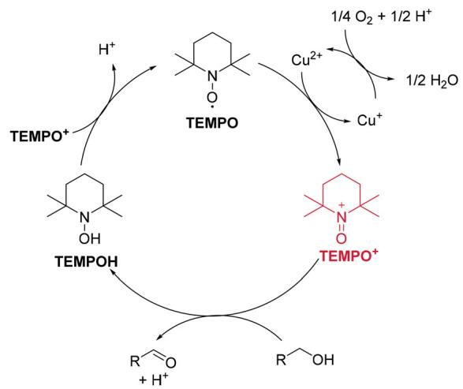
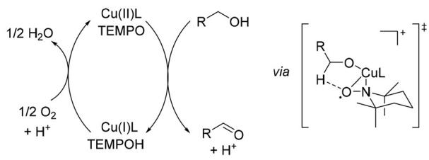
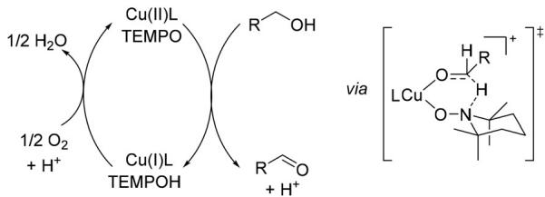
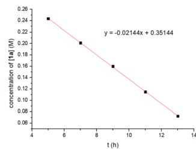
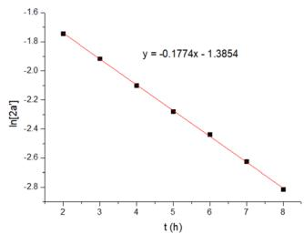
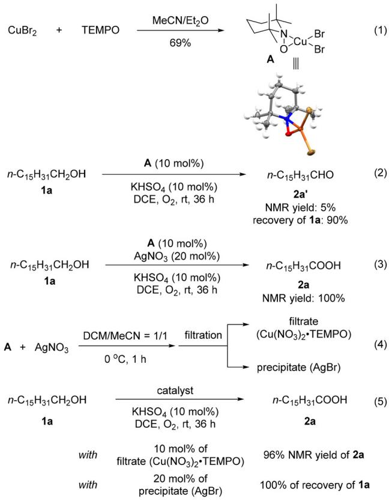
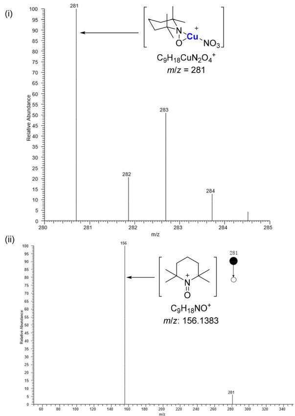
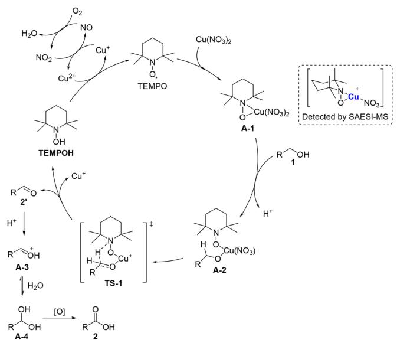
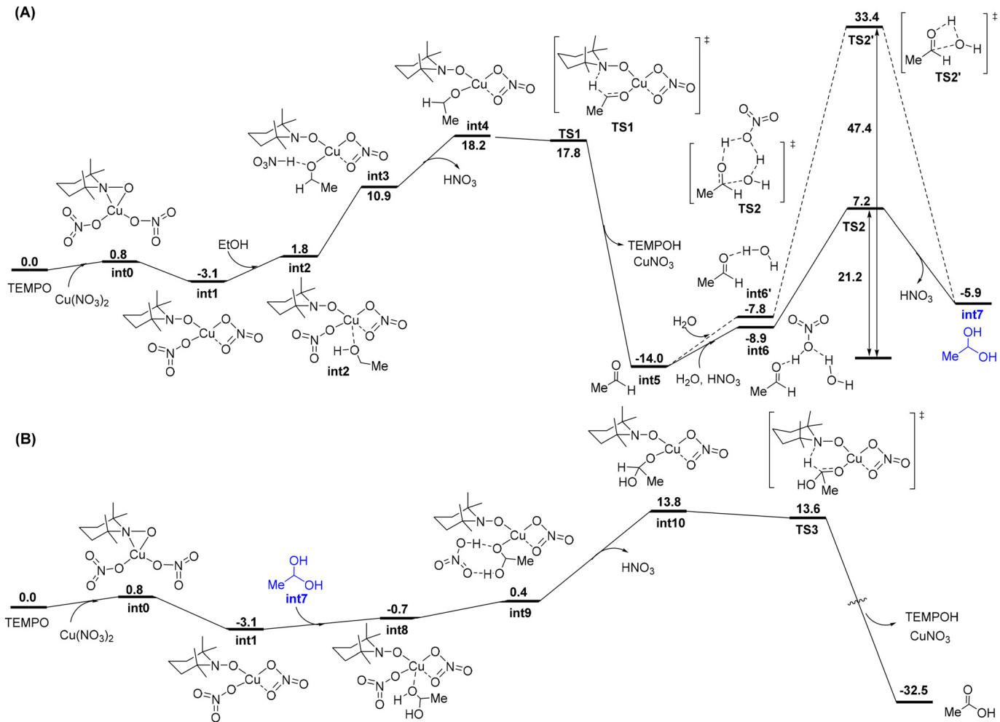

# RESEARCH ARTICLE

View Article Online

View Journal | View Issue

Check for updates

Cite this: , 2024, 11, 5003

Received 3rd May 2024,

Accepted 6th July 2024

DOI: 10.1039/d4qo00791c

rsc.li/frontiers-organic

# Mechanistic studies on $C u ( N O _ { 3 } ) _ { 2 }$ TEMPO-catalyzed aerobic oxidation of alcohols to carboxylic acids†

Yibo Yu, a Zhao Sun,b Yin-Long Guo, \*b Xue Zhang, \*b Hui Qian \*a and Shengming Ma \*a,b

Oxidation of alcohols to carbonyl compounds is one of the most important and fundamental reactions in organic chemistry. Such aerobic reactions that provide aldehydes or ketones mediated by copper and nitroxyl have been well developed during the past several decades. Recently, we successfully realized the aerobic oxidation of primary alcohols to carboxylic acids catalyzed by Cu/TEMPO for the first time. Herein, a mechanism involving a $C u ( N O _ { 3 } ) _ { 2 } - T E M P O$ adduct as identified by SAESI-MS studies is proposed, which is supported by our experimental studies and density functional theory (DFT) calculations.

# Introduction

Aerobic alcohol oxidation to aldehydes and ketones catalyzed by copper and nitroxyl has been well investigated,1,2 and numerous efforts have been made to elucidate the mechanism of these reactions, especially mediated by Cu(II), in recent years.3 In 1984, Semmelhack et al. developed the first selective Cu/TEMPO-catalyzed aerobic oxidation of primary alcohols to aldehydes and proposed the engagement of oxoammonium species (Scheme 1A).1a However, Sheldon et al. demonstrated that an oxoammonium based mechanism was inconsistent with experimental data, and postulated a mechanism involving an $\boldsymbol { \eta } ^ { 2 }$ Cu–TEMPO adduct, which was analogous to that observed for galactose oxidase mimics (Scheme 1B).3a,b Furthermore, a six-membered transition state involving an $\boldsymbol { \eta } ^ { 1 }$ Cu–TEMPO adduct was shown to be favorable with 2,2′-bipyridine (bpy) as a ligand and N-methylimidazole (NMI) as a base, wherein Cu(II) and TEMPO served as an one-electron oxidant, respectively (Scheme 1C).3d Recently, we have for the first time reported a Cu/TEMPO-catalyzed aerobic oxidation of alcohols to carboxylic acids under ligand- and base-free conditions.4 Here, we wish to report the results of our recent study on the mechanism of this copper nitrate/TEMPO catalyzed aerobic oxidation of alcohols to carboxylic acids.

a Research Center for Molecular Recognition and Synthesis, Department of Chemistry, Fudan University, 220 Handan Lu, Shanghai 200433, P. R. China.

E-mail: qian\_hui@fudan.edu.cn

b State Key Laboratory of Organometallic Chemistry, Shanghai Institute of Organic Chemistry, Chinese Academy of Sciences, 345 Lingling Lu, Shanghai 200032,

P. R. China. E-mail: masm@sioc.ac.cn

† Electronic supplementary information (ESI) available. CCDC 2353933. For ESI and crystallographic data in CIF or other electronic format see DOI: https://doi. org/10.1039/d4qo00791c

# Results and discussion

# Control experiments and determination of the reaction orders

In order to unveil the role of each catalyst, some control experiments for the aerobic oxidation of alcohol 1a were conducted (Table 1). These results showed that in the absence of Cu $\left( \mathrm { N O } _ { 3 } \right) _ { 2 } { \cdot } 3 \mathrm { H } _ { 2 } \mathrm { O }$ or TEMPO, the reaction could not occur (entries 2 and $3 ) .$ When the reaction was carried out in the absence of $\mathrm { K H S O _ { 4 } } ,$ only 61% NMR yield of aldehyde 2a′ was obtained with 21% recovery of 1a (entry 4). The kinetic studies illustrate that it follows the zero-order reaction law from alcohol to aldehyde while first-order from aldehyde to acid (Fig. 1).

# Detection of $\mathbf { N O } _ { { x } }$ and verification of the possibility of TEMPO+ as the active catalytic species

In addition, we carried out the reaction under standard conditions via monitoring with a flue gas analyzer (Scheme 2A, eqn (1)). 12 ppm of NO was detected after 1 h and its concentration was increased to $^ { 1 7 }$ ppm with the formation of 4.1 ppm of $\mathbf { N O } _ { 2 }$ after 4 h with 19% NMR yield of aldehyde 2a′. In comparison, for the reaction in the absence of $\mathrm { K H S O _ { 4 } } ,$ NO was not observed after 1 h and only 7 ppm of NO was detected after 4 h with 4% NMR yield of aldehyde $\mathbf { 2 a ^ { \prime } }$ (Scheme ${ \displaystyle 2 \mathbf { A } , }$ eqn (2)). These results indicated that $\mathrm { K H S O _ { 4 } }$ could promote the formation of $\mathrm { N O } _ { x }$ to facilitate the oxidation reaction.

Stahl et $a l . ^ { 5 }$ reported that TEMPO+ would be formed from TEMPO in the presence of $\mathrm { C u } ^ { 2 + }$ and ${ \bf N O } _ { 3 } ^ { - }$ and Anelli and Montanari et $a l . ^ { 6 }$ reported that alcohols could be oxidized to aldehydes by TEMPO+ with the formation of TEMPOH, so N-oxoammonium salt TEMPO $\mathrm { N O } _ { 3 } ^ { - }$ was deliberately prepared following the known procedure7 and used as the catalyst. It was observed that aldehyde $\mathbf { 2 } \mathbf { a } ^ { \prime }$ was produced in 16% NMR yield with 78% recovery of alcohol 1a and no carboxylic acid 2a was formed (Scheme 2B, eqn (3)). The reaction was greatly accelerated when 10 mol% of $\mathbf { N O } _ { 2 }$ was used together with 10 mol% of $\mathbf { T E M P O } ^ { + } \mathbf { N O } _ { 3 } ^ { - } ;$ however, still aldehyde 2a′ was formed as the major product in 69% yield with only 21% yield

(A) via Oxoammonium cations   

chemical

Reaction mechanism diagram showing TEMPO and TEMPOH intermediates with catalytic species and products

(B) via $\eta ^ { 2 }$ Cu-TEMPO adduct   

chemical

Chemical reaction mechanism involving Cu(II)L and Cu(I)L with TEMPO ligands, followed by a photochemical reaction pathway showing copper complex formation

(C) via η1 Cu-TEMPO adduct   

chemical

Chemical reaction mechanism involving Cu(II)L and Cu(I)L with TEMPO and TEMPOH intermediates, alongside a chemical structure of a copper complex with ligand exchange.

Scheme 1 The reported mechanisms for Cu(II)/TEMPO-catalyzed aerobic alcohol oxidation to aldehydes.

line

| t (h) | concentration of [Na] (M) |
| ----- | -------------------------- |
| 5     | 0.24                       |
| 7     | 0.20                       |
| 9     | 0.16                       |
| 11    | 0.12                       |
| 13    | 0.08                       |

(B)   

line

| t (h) | ln[2a] |
|-------|--------|
| 2     | -1.6   |
| 3     | -2.0   |
| 4     | -2.4   |
| 5     | -2.8   |
| 6     | -3.2   |
| 7     | -3.6   |
| 8     | -4.0   |

Fig. 1 (A) Determination of the order for alcohol 1a. (B) Determination of the order for aldehyde 2a’.

of carboxylic acid 2a (Scheme 2B, eqn (4)). These results illustrated that TEMPO+ was not the major active catalytic species. In addition, when 10 mol% of TEMPO and 20 mol% of $\mathbf { N O } _ { 2 }$ were applied for the aerobic oxidation of aldehyde 2a′, 29% of acid 2a was obtained with 59% recovery of 2a′ (Scheme 2C, eqn (5)). In comparison, aldehyde 2a′ was smoothly oxidized to carboxylic acid 2a in 80% yield under the standard conditions (Scheme 2C, eqn (6)). These results suggested that the oxidation of aldehyde via a copper-free $\mathrm { N O } _ { x } / \mathrm { T E M P O }$ catalytic cycle8 was at least not the major pathway although it could not be ruled out completely.

# 18O labelling experiments

Furthermore, 18O labelling experiments with alcohol 1a as the substrate were conducted (Scheme 3A). When ${ \mathrm { H } } _ { 2 } ^ { \ 1 8 } \mathrm { O }$ and ${ \bf O } _ { 2 }$ were added to the reaction, 20% of single $^ { 1 8 } \mathrm { O } \cdot$ -labeled carboxylic acid 2a was observed (Scheme 3A, eqn (1)). However, 42% of single 18O-labeled carboxylic acid and 8% of double $^ { 1 8 } \mathrm { O }$ -labeled carboxylic acid 2a were obtained when $^ { 1 8 } { \bf O } _ { 2 }$ were applied (Scheme 3A, eqn (2)). Then, $^ { 1 8 } \mathrm { O }$ labelling experiments with aldehyde $\mathbf { 2 a } ^ { \prime }$ as the substrate were conducted (Scheme 3B): 33% of single $^ { 1 8 } \mathrm { O } \cdot$ -labeled carboxylic acid and 6% of double 18O-labeled carboxylic acid were observed when $^ { 1 8 } { \bf O } _ { 2 }$ was used (Scheme 3B, eqn (3)) while 37% of single 18O-labeled carboxylic acid and 7% of double $^ { 1 8 } \mathrm { O } \cdot$ -labeled carboxylic acid were obtained when ${ \bf O } _ { 2 }$ and 1.0 equivalent of ${ \mathrm { H } } _ { 2 } ^ { \ 1 8 } \mathrm { O }$ were applied (Scheme 3B, eqn (4)). Considering that $^ { 1 8 } { \bf O } _ { 2 }$ was in excess, the amount of ${ \mathrm { H } } _ { 2 } ^ { \ 1 8 } \mathrm { O }$ was increased to 2.0 equiv., and we found that the yield of the 18O-labeled product was significantly improved (Scheme 3B, eqn (5)). These results indicated that the main source of the second oxygen atom is ambient $_ { \mathrm { H } _ { 2 } \mathrm { O } }$ with the hydrated aldehyde being the possible intermediate. The formation of double 18O-labeled carboxylic acid also demonstrated a reversible pathway between aldehyde and aldehyde hydrate.

Table 1 Control experiments for the aerobic oxidation of alcohol 1a a 

<table><tr><td></td><td>n-C15H31CH2OH1a</td><td>Cu(NO3)2·3H2O (10 mol%)TEMPO (10 mol%)KHSO4(10 mol%)DCE, O2(balloon), rt, 36 h</td><td>n-C15H31CHO + n-C15H31COOH2a&#x27; 2a</td><td>&quot;standard conditions&quot;</td><td></td><td></td></tr><tr><td>Entry</td><td>Cu(NO3)2·3H2O</td><td>TEMPO</td><td>KHSO4</td><td>Recovery of 1a (%)</td><td>NMR yield of 2a&#x27; (%)</td><td>NMR yield of 2a (%)</td></tr><tr><td>1</td><td>+</td><td>+</td><td>+</td><td>0</td><td>0</td><td>100</td></tr><tr><td>2</td><td>-</td><td>+</td><td>+</td><td>~100</td><td>0</td><td>0</td></tr><tr><td>3</td><td>+</td><td>-</td><td>+</td><td>~100</td><td>0</td><td>0</td></tr><tr><td>4</td><td>+</td><td>+</td><td>-</td><td>21</td><td>61</td><td>0</td></tr></table>

a The reaction was conducted with 1.0 mmol of 1a in 4 mL of DCE at rt for 36 h with an $\mathbf { O } _ { 2 }$ balloon. The NMR yield and recovery were determined by 1 H NMR analysis using dibromomethane as the internal standard.

(A) The effect of KHSO4 

<table><tr><td>n-C15H31CH2OH1a1 mmol</td><td>standard conditions→1 hNO: 12 ppmNO2: 0</td><td>standard conditions→4 hNO: 17 ppmNO2: 4.1 ppm</td><td>n-C15H31CHO2a&#x27; NMR yield: 19% Recovery: 74%</td></tr><tr><td>n-C15H31CH2OH1a1 mmol</td><td>standard conditions w/o KHSO4→1 hNO: 0NO2: 0</td><td>standard conditions w/o KHSO4→4 hNO: 7 ppmNO2: 0</td><td>n-C15H31CHO2a&#x27; NMR yield: 4% Recovery: 97%</td></tr></table>

(B) TEMPO\*NO as catalyst

<table><tr><td>n-C15H31CH2OH1a</td><td>TEMPO+NO3- (10 mol%)KHSO4(10 mol%)DCE, O2(balloon), 25 °C, 36 h</td><td>n-C15H31CHO2a&#x27; NMR yield: 16% recovery of 1a: 78%</td></tr><tr><td>n-C15H31CH2OH1a</td><td>NO2(10 mol%)TEMPO+NO3- (10 mol%)KHSO4(10 mol%)DCE, O2(balloon), 25 °C, 36 h</td><td>n-C15H31CHO + n-C15H31COOH (4)2a&#x27; NMR yield: 69% NMR yield: 21%</td></tr></table>

() Oxidation of aldehyde 2a' to carboxylic acid 2a 

<table><tr><td>n-C15H31CHO2a&#x27;</td><td>NO2(20 mol%)TEMPO (10 mol%)KHSO4(10 mol%)DCE, O2(balloon), rt, 12 h</td><td>n-C15H31COOH2aNMR yield: 29%recovery of 2a&#x27;: 59%</td></tr><tr><td>n-C15H31CHO2a&#x27;</td><td>Cu(NO3)2·3H2O (10 mol%)TEMPO (10 mol%)KHSO4(10 mol%)DCE, O2(balloon), rt, 12 h</td><td>n-C15H31COOH2aNMR yield: 80%</td></tr></table>

Scheme 2 Detection of $\mathsf { N O } _ { x }$ and verification of the possibility of TEMPO+ as the active catalytic species.

# Identification of the $\mathrm { C u } ( \mathbf { N O } _ { 3 } ) _ { 2 }$ –TEMPO adduct

In order to further identify any possible catalytically active species, the reaction of $\mathrm { C u } ( \mathrm { N O } _ { 3 } ) _ { 2 } { \cdot } 3 \mathrm { H } _ { 2 } \mathrm { O }$ and TEMPO under different conditions was tried; however, no crystals were obtained. Fortunately, the reaction of $\mathbf { C u B r } _ { 2 }$ with TEMPO afforded complex ${ \bf A } , ^ { 9 }$ whose structure has been successfully established by X-ray diffraction study (Fig. 2A, eqn (1)). 5% NMR yield of aldehyde $\mathbf { 2 } \mathbf { a } ^ { \prime }$ was obtained with 90% recovery of alcohol 1a when the reaction was conducted with 10 mol% of complex A and KHSO (Fig. 2A, eqn (2)). Interestingly, when $\mathbf { A g N O } _ { 3 }$ (20 mol%) was added to exchange the Br− out of complex A with ${ \mathrm { N O } } _ { 3 } { } ^ { - }$ , a quantitative yield of carboxylic acid 2a was obtained from alcohol 1a (Fig. 2A, eqn (3)). To exclude the effect of AgBr, we carried out the reaction of complex A and $\mathbf { A g N O } _ { 3 }$ (Fig. 2A, eqn (4)). After filtration, the filtrate and precipitate were used as the catalyst, respectively. Carboxylic acid 2a was formed in 96% yield with the filtrate as the catalyst while no reaction occurred with the precipitate (AgBr) as the catalyst (Fig. 2A, eqn (5)). Solvent-assisted electrospray ionization mass spectrometry (SAESI-MS) studies10 were conducted to analyze any possible species from the diluted filtrate. Signals with m/z of 281 and 283 were observed, which are consistent with the m/z of $\left[ \mathrm { T E M P O } . \mathrm { C u } ( \mathrm { N O } _ { 3 } ) \right] ^ { + }$ (Fig. 2B-i, calcd for $\mathrm { C _ { 9 } H _ { 1 8 } } ^ { 6 3 } \mathrm { C u N _ { 2 } O _ { 4 } } ^ { + } \colon 2 8 1 ; \mathrm { C _ { 9 } H _ { 1 8 } } ^ { 6 5 } \mathrm { C u N _ { 2 } O _ { 4 } } ^ { + } \colon 2 8 3 \Big )$ ). For further structural characterization of this intermediate, a SAESI-MS/MS experiment was conducted: the corresponding signal of TEMPO+ was detected (Fig. 2B-ii, calcd for $\mathrm { C _ { 9 } H _ { 1 8 } N O ^ { + } } \colon 1 5 6 ) .$ , formed by losing $\mathrm { C u } ^ { 2 + }$ , ${ \mathrm { N O } } _ { 3 } { } ^ { - }$ and an electron. These results illustrate the existence of the $\mathrm { C u } ( \mathrm { N O } _ { 3 } ) _ { 2 }$ –TEMPO adduct and support that A-1-type species may be the catalytically active species (Scheme 4).

() 8 labelling experiments with alcohol 1a as substrate 

<table><tr><td rowspan="2">n-C15H31CH2OH1a</td><td>Cu(NO3)2·3H2O (10 mol%)TEMPO (10 mol%)KHSO4(10 mol%)</td><td rowspan="2">n-C15H31COOH2aIsolated yield: 96%[16O]2:[16O][18O]80%: 20%</td></tr><tr><td>H218O(1.0 equiv)DCE (anhydrous)O2(balloon), rt, 58 h</td></tr><tr><td>n-C15H31CH2OH1a</td><td>Cu(NO3)2·3H2O (10 mol%)TEMPO (10 mol%)KHSO4(10 mol%)DCE (anhydrous)18O2(balloon), rt, 38 h</td><td>n-C15H31COOH2aIsolated yield: 87%[16O]2:[16O][18O]:[18O]250%: 42%: 8%</td></tr></table>

labelling experiments with aldehyde 2a' as substrate 

<table><tr><td>n-C15H31CHO2a&#x27;</td><td>Cu(NO3)2·3H2O (10 mol%)TEMPO (10 mol%)KHSO4(10 mol%)DCE (anhydrous) $^{18}O_{2}$  (balloon), rt, 24 h</td><td>n-C15H31COOH2aIsolated yield: 86%[ $^{16}O$ ]2: [ $^{16}O$ ][ $^{18}O$ ]:[ $^{18}O$ ]261%: 33%: 6%</td><td>(3)</td></tr><tr><td>n-C15H31CHO2a&#x27;</td><td>Cu(NO3)2·3H2O (10 mol%)TEMPO (10 mol%)KHSO4(10 mol%)H2 $^{18}O$  (1.0 equiv)DCE (anhydrous)O2(balloon), rt, 24 h</td><td>n-C15H31COOH2aIsolated yield: 93%[ $^{16}O$ ]2: [ $^{16}O$ ][ $^{18}O$ ]:[ $^{18}O$ ]256%: 37%: 7%</td><td>(4)</td></tr><tr><td>n-C15H31CHO2a&#x27;</td><td>Cu(NO3)2·3H2O (10 mol%)TEMPO (10 mol%)KHSO4(10 mol%)H2 $^{18}O$  (2.0 equiv)DCE (anhydrous)O2(balloon), rt, 24 h</td><td>n-C15H31COOH2aIsolated yield: 99%[ $^{16}O$ ]2: [ $^{16}O$ ][ $^{18}O$ ]:[ $^{18}O$ ]236%: 47%: 17%</td><td>(5)</td></tr></table>

Scheme 3 $^ { 1 8 } \mathrm { O }$ labelling experiments.

Based on these mechanistic studies, a possible mechanism has been proposed (Scheme 4): the $\boldsymbol { \eta } ^ { 2 }$ Cu–TEMPO species A-1 could undergo a ligand exchange reaction with the alcohol to form A-2. TEMPOH, aldehyde 2′, and $\mathrm { { C u } ^ { + } }$ would be generated via H-abstraction from a six-membered cyclic transition state TS-1. TEMPO would be regenerated via the oxidation of TEMPOH by $\mathrm { C u } ^ { 2 + 3 e } ,$ which would be recycled by the oxidation of $\mathrm { { C u } ^ { + } }$ with $\mathrm { N O } _ { 2 } .$ . Subsequently, water would attack the activated aldehyde intermediate A-3 to form the aldehyde hydrate A-4, which was further oxidized to carboxylic acid through the same process as the oxidation of alcohol.

()Aerobic oxidation of alcohol a with A as catalyst   

chemical

Multi-step organic synthesis reaction scheme involving copper complexes and NMR recovery, with catalysts and final yields for compounds 2a and 1a.

(B) SAESI-MS studies   

line

| m/z | Relative Abundance (C9H18CuN2O4+) | Relative Abundance (C9H18NO+) |
|-----|----------------------------------------|----------------------------------|
| 281 | 100                                    | -                                |
| 282 | -                                      | 20                               |
| 283 | -                                      | 50                               |
| 284 | -                                      | 10                               |
| 285 | -                                      | -                                |

| m/z   | Relative Abundance (C9H18NO+) | Relative Abundance (C9H18CuN2O4+) |
|-------|-----------------------------------|------------------------------------|
| 156   | -                                        | 90                               |
| 281   | -                                        | 90                               |

Fig. 2 Identification of the $\mathsf { C u } ( \mathsf { N O } _ { 3 } ) _ { 2 } \mathrm { - } \mathsf { T E M P O }$ adduct. (A) Aerobic oxidation of alcohol 1a with A as the catalyst. (B) SAESI-MS studies. (i) SAESI-MS spectrum of the diluted filtrate showing the signal of [TEMPO·Cu(NO )]+ at m/z 281. (ii) SAESI-MS/MS spectrum of the complex ion [TEMPO·Cu $( N O _ { 3 } ) ] ^ { + }$ at m/z 281.

chemical

Reaction mechanism diagram showing copper-catalyzed transformation of TEMPOH and TS-1 intermediates to products A-1, A-2, A-3, A-4 via intermediates 2', 3', and 4', with a highlighted detection by SAESI-MS.

Scheme 4 The proposed mechanism.

# DFT calculations

Density functional theory (DFT) calculations were performed at the $\mathbf { M 0 6 } / 6 { \cdot } 3 1 1 { \cdot } \mathbf { + G } ( \mathrm { d } , \mathrm { p } )$ -SDD/SMD(DCE)//M06/6-31G(d)- LANL2DZ level of theory to further support this proposed mechanism, using ethanol as the model substrate.11 Initial coupling of TEMPO with $\mathrm { C u } ( \mathrm { N O } _ { 3 } ) _ { 2 }$ provides the A-1 type $\eta ^ { 2 } -$ TEMPO adduct int0, which has a closed-shell singlet electronic structure. Subsequent isomerization of int0 yields a more stable $\boldsymbol { \eta } ^ { 1 } { - } \mathrm { T E M P O }$ adduct int1, which coordinates with alcohol to generate intermediate int2. Then displacement of one of the nitrate ions by the alkoxide ligand occurs uphill energetically (+21.3 kcal mol−1 , int4 with respective to int1) to produce the A-2 type Cu-alkoxide species int4, accompanied by the release of nitric acid. Subsequently, a six-membered-ring transition structure TS1 is located for the migration of hydrogen from the alkoxide to the nitrogen atom of TEMPO and the simultaneous reduction to Cu(I), resulting in the formation of aldehyde, TEMPOH and $\mathrm { C u N O } _ { 3 } .$ . Notably, the activation barrier for the hydrogen shift is very low (almost no barrier) from int4, while the overall free energy for oxidation of alcohol to aldehyde is 21.3 kcal mol−1 (Fig. 3A).

Subsequently, the aldehyde hydrate int7 could be generated from the reaction of aldehyde with water via a four-membered cyclic transition structure TS2′, which features a very high barrier of 47.4 kcal $\mathrm { m o l } ^ { - 1 }$ . With the aid of $\mathrm { H N O } _ { 3 }$ as the proton shuttle, this process would take place through a six-membered cyclic transition structure TS2 with a much lower activation barrier of 21.2 kcal $\mathrm { m o l ^ { - 1 } }$ . Then, aldehyde hydrate int7 would be further oxidized to acetic acid through a similar process with an overall free energy of 16.9 kcal $\mathrm { m o l ^ { - 1 } }$ (int10 with respective to int1, Fig. 3B). Based on the mechanistic experiments and DFT calculations, we considered that the active catalytic species is more inclined to be a Cu(III) species (see Scheme S2 in the ESI† for details).

chemical

Two chemical reaction pathways (A and B) showing copper-catalyzed transformations with intermediates, intermediates 10–10.9, and final products like TS1, TS2, and HNO3.

Fig. 3 DFT study of the mechanism shown in Scheme 4. (A) Free energy profiles $( \Delta G _ { \mathsf { s o l } }$ in kcal $\mathsf { m o l } ^ { - 1 } )$ for the copper-catalyzed oxidation of alcohol to aldehyde. (B) Free energy profiles $( \Delta G _ { \mathsf { s o l } }$ in kcal mol−1 ) for the copper-catalyzed oxidation of aldehyde hydrate to acetic acid.

# Conclusions

In summary, we present the mechanistic investigations of Cu (NO ) ·3H O/TEMPO/KHSO -catalyzed aerobic oxidation of primary alcohols to carboxylic acids. $\mathrm { K H S O _ { 4 } }$ is proven to promote the generation of $\mathrm { N O } _ { x }$ to facilitate the aerobic alcohol oxidation. On the basis of experimental results, we conclude that TEMPO+ is at least not the major active catalytic species. Furthermore, we observed a $\mathrm { C u } ( \mathrm { N O } _ { 3 } ) _ { 2 }$ –TEMPO adduct of A-1 as supported by SAESI-MS studies, which catalyzed this aerobic alcohol oxidation. DFT calculations have been applied to validate that the $\mathrm { C u } ( \mathrm { N O } _ { 3 } ) _ { 2 }$ 2–TEMPO adduct-catalyzed mechanism is favored over TEMPO+ catalysis.

# Author contributions

S. Ma, H. Qian and Y. Yu designed the experiments. Y. Yu performed the experiments. Z. Sun and Y.-L. Guo performed the SAESI-MS studies. X. Zhang performed the DFT calculations. Y. Yu, X. Zhang, H. Qian and S. Ma wrote the manuscript.

# Data availability

The data supporting this article have been included as part of the ESI.† Crystallographic data for complex A have been deposited at the Cambridge Crystallographic Data Center Centre [CCDC 2353933].†

# Conflicts of interest

There are no conflicts to declare.

# Acknowledgements

Financial support from the National Key R&D Program of China (Grant No. 2022YFA1503200 for S. Ma), the National Natural Science Foundation of China (Grant No. 21988101 for S. Ma) and the Shanghai Science and Technology Innovation Action Plan (Grant No. 21142200800 for Y.-L. Guo) is greatly appreciated.

# References

1 For selected reports on Cu/TEMPO-catalyzed aerobic oxidation of alcohols, see: (a) M. F. Semmelhack, C. R. Schmid, D. A. Cortes and C. S. Chou, Oxidation of alcohols to aldehydes with oxygen and cupric ion, mediated by nitrosonium ion, J. Am. Chem. Soc., 1984, 106, 3374; (b) B. Betzemeier, M. Cavazzini, S. Quici and P. Knochel, Copper-catalyzed aerobic oxidation of alcohols under fluorous biphasic conditions, Tetrahedron Lett., 2000, 41, 4343; (c) P. Gamez, I. W. C. E. Arends, J. Reedijk and R. A. Sheldon, Copper(II)-catalysed aerobic oxidation of primary alcohols to aldehydes, Chem. Commun., 2003, 2414; (d) N. Jiang and A. J. Ragauskas, Copper(II)-catalyzed aerobic oxidation of primary alcohols to aldehydes in ionic liquid [bmpy]PF6, Org. Lett., 2005, 7, 3689; (e) S. Velusamy, A. Srinivasan and T. Punniyamurthy, Copper(II) catalyzed selective oxidation of primary alcohols to aldehydes with atmospheric oxygen, Tetrahedron Lett., 2006, 47, 923; (f ) S. Striegler, Aerobic oxidation of primary alcohols under mild aqueous conditions promoted by a dinuclear copper (II) complex, Tetrahedron, 2006, 62, 9109; (g) P. J. Figiel, M. Leskelä and T. Repo, TEMPO-Copper(II) diimine-catalysed oxidation of benzylic alcohols in aqueous media, Adv. Synth. Catal., 2007, 349, 1173; (h) A. Dhakshinamoorthy, M. Alvaro and H. Garcia, Aerobic oxidation of benzylic alcohols catalyzed by metal−organic frameworks assisted by TEMPO, ACS Catal., 2011, 1, 48; (i) J. M. Hoover and S. S. Stahl, Highly practical copper(I)/TEMPO catalyst system for chemoselective aerobic oxidation of primary alcohols, J. Am. Chem. Soc., 2011, 133, 16901; ( j) X. Liu, Q. Xia, Y. Zhang, C. Chen and W. Chen, Cu-NHC-TEMPO catalyzed aerobic oxidation of primary alcohols to aldehydes, J. Org. Chem., 2013, 78, 8531; (k) G. Zhang, X. Han, Y. Luan, Y. Wang, X. Wen and C. Ding, l-Proline: an efficient N,O-bidentate ligand for copper-catalyzed aerobic oxidation of primary and secondary benzylic alcohols at room temperature, Chem. Commun., 2013, 49, 7908; (l) Y. Sasano, S. Nagasawa, M. Yamazaki, M. Shibuya, J. Park and Y. Iwabuchi, Highly chemoselective aerobic oxidation of amino alcohols into amino carbonyl compounds, Angew. Chem., Int. Ed., 2014, 53, 3236; (m) D. Zhai and

S. Ma, Copper catalysis for highly selective aerobic oxidation of alcohols to aldehydes/ketones, Org. Chem. Front., 2019, 6, 3101; (n) X. Liang, X. Wang, R. Liu, Q. Xu, X. Xue and F. Zhang, Chinese Pat, 200810010756.9, 2008.   
2 For selected reviews on Cu/TEMPO-catalyzed aerobic oxidation of alcohols, see: (a) B. L. Ryland and S. S. Stahl, Practical aerobic oxidations of alcohols and amines with homogeneous copper/TEMPO and related catalyst systems, Angew. Chem., Int. Ed., 2014, 53, 8824; (b) Q. Cao, L. M. Dornan, L. Rogan, N. L. Hughes and M. J. Muldoon, Aerobic oxidation catalysis with stable radicals, Chem. Commun., 2014, 50, 4524.   
3 (a) A. Dijksman, I. W. C. E. Arends and R. A. Sheldon, Cu (II)-nitroxyl radicals as catalytic galactose oxidase mimics, Org. Biomol. Chem., 2003, 1, 3232; (b) C. Michel, P. Belanzoni, P. Gamez, J. Reedijk and E. J. Baerends, Activation of the C−H bond by electrophilic attack: theoretical study of the reaction mechanism of the aerobic oxidation of alcohols to aldehydes by the Cu(bipy)2+/2,2,6,6- tetramethylpiperidinyl-1-oxy cocatalyst system, Inorg. Chem., 2009, 48, 11909; (c) J. M. Hoover, B. L. Ryland and S. S. Stahl, Copper/TEMPO-catalyzed aerobic alcohol oxidation: mechanistic assessment of different catalyst systems, ACS Catal., 2013, 3, 2599; (d) B. L. Ryland, S. D. McCann, T. C. Brunold and S. S. Stahl, Mechanism of alcohol oxidation mediated by copper(II) and nitroxyl radicals, J. Am. Chem. Soc., 2014, 136, 12166; (e) M. C. Ryan, L. D. Whitmire, S. D. McCann and S. S. Stahl, Copper/ TEMPO redox redux: analysis of PCET oxidation of TEMPOH by copper(II) and the reaction of TEMPO with copper(I), Inorg. Chem., 2019, 58, 10194.   
4 Y. Yu, D. Zhai, Z. Zhou, S. Jiang, H. Qian and S. Ma, Copper-catalyzed aerobic oxidation of primary alcohols to carboxylic acids, Chem. Commun., 2023, 59, 5281.   
5 J. E. Nutting, K. Mao and S. S. Stahl, Iron(III) nitrate/ TEMPO-catalyzed aerobic alcohol oxidation: distinguishing between serial versus integrated redox cooperativity, J. Am. Chem. Soc., 2021, 143, 10565.   
6 P. L. Anelli, C. Biffi, F. Montanari and S. Quici, Fast and selective oxidation of primary alcohols to aldehydes or to carboxylic acids and of secondary alcohols to ketones mediated by oxoammonium salts under two-phase conditions, J. Org. Chem., 1987, 52, 2559.   
7 M. Shibuya, Y. Osada, Y. Sasano, M. Tomizawa and Y. Iwabuchi, Highly efficient, organocatalytic aerobic alcohol oxidation, J. Am. Chem. Soc., 2011, 133, 6497.   
8 K. C. Miles, M. L. Abrams, C. R. Landis and S. S. Stahl, KetoABNO/NO cocatalytic aerobic oxidation of aldehydes to carboxylic acids and access to α-chiral carboxylic acids via sequential asymmetric hydroformylation/oxidation, Org. Lett., 2016, 18, 3590.   
9 (a) A. Caneschi, A. Grand, J. Laugier, P. Rey and R. Subra, Three-center binding of a nitroxyl free radical to copper(II) bromide, J. Am. Chem. Soc., 1988, 110, 2307; (b) R. C. Walroth, K. C. Miles, J. T. Lukens, S. N. MacMillan, S. S. Stahl and K. M. Lancaster, Electronic structural analysis of copper(II)–TEMPO/ABNO complexes provides evi-

dence for copper(I)–oxoammonium character, J. Am. Chem. Soc., 2017, 139, 13507.

10 J.-T. Zhang, H.-Y. Wang, W. Zhu, T.-T. Cai and Y.-L. Guo, Solvent-assisted electrospray ionization for direct analysis

of various compounds (complex) from low/nonpolar solvents and eluents, Anal. Chem., 2014, 86, 8937.

11 See the ESI† for DFT studies on two other less favorable pathways.