# Aerobic oxidation of indole carbinols using Fe(NO3)3·9H2O/TEMPO/NaCl as catalysts†

Cite this: , 2013, 11, 4186

Jinxian Liua and Shengming Ma\*a,b

Received 1st February 2013,

Accepted 13th April 2013

DOI: 10.1039/c3ob40226f

www.rsc.org/obc

A practical aerobic oxidation of indole carbinols using $\mathsf { F e } ( \mathsf { N O } _ { 3 } ) _ { 3 } { \cdot } 9 \mathsf { H } _ { 2 } \mathsf { O } / \mathsf { T E M P O } / \mathsf { N a C l }$ in DCE at room temperature and atmospheric pressure of oxygen affording aldehydes or ketones in good to excellent yields was developed. Furthermore, when using the industrially favored solvent toluene instead of DCE and air instead of pure oxygen, this protocol also works smoothly, demonstrating its high potential for possible industrial application.

# Introduction

Carbonyl compounds with indole units are important in organic synthesis since a large number of indole carbonyls with bioactivity have been found in natural products.1 Traditionally, such compounds could be obtained by oxidation of the corresponding alcohols using at least a stoichiometric amount of oxidants such as MnO ,2 CrO ,3 Pb(OAc) ,4 DMSO,5 hypervalent iodine compounds,6 etc.7 (Scheme 1). However, from an economical and environmental viewpoint, such protocol would produce an almost equivalent amount of oxidantderived waste, and place a heavy burden on the environment. Thus, development of a novel eco-friendly and economic approach for such a transformation is highly desired.

Molecular oxygen is a clean and cheap oxidant, and releases water as the sole byproduct, thus it’s an ideal terminal oxidant, especially for industrial applications. In the last three decades, numerous aerobic oxidation protocols with metal catalysts or even without a metallic catalyst have been reported.8 2,2,6,6-Tetramethylpiperidine-N-oxyl (TEMPO) has been used as a catalyst to oxidize alcohols with various oxidants including molecular oxygen.8e,9 As we know, there are very limited reports for the oxidation of indole carbinols using molecular oxygen as terminal oxidant in the literature.10 Recently, this group has developed a general and practical approach to aerobic oxidation of alcohols bearing a wide range of substrates under mild conditions using Fe(NO ) ·9H O/TEMPO/ NaCl as catalyst, yielding aldehydes or ketones in good to excellent yields.5 Therefore, we reasoned that such a catalytic protocol could also be applied to indole carbinols, providing an efficient alternative.

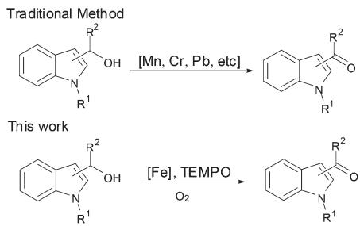

chemical

Chemical reaction scheme showing transformation of a traditional naphthoquinone derivative to a substituted quinone using Mn, Cr, Pb, and TEMPO under oxygen conditions

Scheme 1 Oxidation of indole carbinols.

# Results and discussion

We tried to optimize the reaction conditions with regard to additives, nitrates, solvents and catalyst loading; the results are summarized in Table 1. A commonly used kitchen chemical, we found that sodium chloride is an important accelerator for the Fe(NO ) ·9H O/TEMPO-catalyzed aerobic oxidation of alcohols.11 Thus, we first carried out a control experiment to investigate the effect of chloride ion on this oxidation (Table 1, entries 1 and 2). We found that when 10 mol% NaCl was added, the catalytic efficiency was greatly improved, and the reaction time was reduced from 15 hours to 2 hours. The role of Cl− in this reaction is not quite clear yet; it probably works as a ligand to $\mathrm { F e } ^ { 3 + }$ to accelerate the oxidation.11 Copper nitrate could also catalyze this reaction; however, the reaction is slow (6 h) (Table 1, entry 3). Therefore, we still chose iron nitrate as the co-catalyst. We next examined the effect of solvent on the aerobic oxidation reaction at room temperature (Table 1, entries 4 and 5) and found that this reaction could be carried out in ethyl acetate, THF or DCE due to its high reactivity. For

a Key Laboratory of Green Chemistry and Chemical Process, Department of Chemistry, East China Normal University, 3663 North Zhongshan Lu, Shanghai 200062, P. R. China. E-mail: masm@sioc.ac.cn; Fax: (+86)-21-6260-9305 b Key Laboratory of Organometallic Chemistry, Shanghai Institute of Organic Chemistry, Chinese Academy of Sciences, 345 Lingling Lu, Shanghai 200032, P. R. China † Electronic supplementary information (ESI) available. See DOI: 10.1039/c3ob40226f

Table 1 Optimization of the aerobic oxidation of (1-tosyl-1 -indol-2-yl)- carbinola 

<table><tr><td>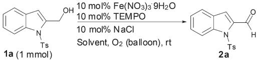</td></tr></table>

<table><tr><td>Entry</td><td>Solvent</td><td>Time (h)</td><td>Yield of 2a (%)</td></tr><tr><td>1</td><td>DCE</td><td>2</td><td>99</td></tr><tr><td> $2^b$ </td><td>DCE</td><td>15</td><td>93</td></tr><tr><td> $3^c$ </td><td>DCE</td><td>6</td><td>95</td></tr><tr><td>4</td><td>Ethyl acetate</td><td>3</td><td>97</td></tr><tr><td>5</td><td>THF</td><td>5</td><td>95</td></tr><tr><td> $6^d$ </td><td>DCE</td><td>4</td><td>96</td></tr><tr><td> $7^e$ </td><td>DCE</td><td>43</td><td>93</td></tr></table>

a Standard reaction conditions: 10 mol% $\mathrm { F e ( N O _ { 3 } ) _ { 3 } } { \cdot } 9 \mathrm { H } _ { 2 } \mathrm { O } ,$ 10 mol% TEMPO, and 10 mol% NaCl in 4 mL of DCE. b Without the addition of 10 mol% NaCl. $^ { c } \mathrm { C u } ( \mathrm { N O } _ { 3 } ) _ { 2 } { \cdot } 3 \mathrm { H } _ { 2 } \mathrm { O }$ was used instead of $\mathrm { F e } \left( \mathrm { N O } _ { 3 } \right) _ { 3 } { \cdot } 9 \mathrm { H } _ { 2 } \mathrm { O } .$ $^ { d } \mathrm { T h e }$ reaction was conducted with 5 mol% $\mathrm { F e } ( \mathrm { N O } _ { 3 } ) _ { 3 } { \cdot } 9 \mathrm { H } _ { 2 } \mathrm { O } , \ \bar { 5 }$ mol% TEMPO, and 5 mol% NaCl in 4 mL of DCE. e The reaction was conducted with 2 mol% $\mathrm { F e ( N O _ { 3 } ) _ { 3 } } { \cdot } 9 \mathrm { H } _ { 2 } \mathrm { O } ,$ , 2 mol% TEMPO, and 2 mol% NaCl in 4 mL of DCE.

the consideration of solubility and efficiency, we chose DCE as solvent in this reaction. We further investigated the catalyst loading (Table 1, entries 6 and 7) and found that when 10 mol % $\mathrm { F e ( N O } _ { 3 } \mathrm { ) } _ { 3 } { \cdot } 9 \mathrm { H } _ { 2 } \mathrm { O } ,$ 10 mol% TEMPO, and 10 mol% NaCl were used, the reaction could be rapidly completed in 2 hours with an almost quantitative yield; however, when the catalyst loading of each catalyst was reduced to 5 mol%, the reaction time doubled; when further reducing the catalyst loading of $\mathrm { F e ( N O _ { 3 } ) _ { 3 } { \cdot } 9 H _ { 2 } O , }$ TEMPO, and NaCl to 2 mol%, the reaction time was prolonged to 43 hours.

Therefore, we chose 10 mol% $\mathrm { F e } \left( \mathrm { N O } _ { 3 } \right) _ { 3 } { \cdot } 9 \mathrm { H } _ { 2 } \mathrm { O } ,$ 10 mol% TEMPO, and 10 mol% NaCl in DCE as standard reaction conditions for further investigation into the substrate scope of this reaction, with the results being summarized in Table 2. This protocol could not only be applied to the primary indole-2-carbinols (Table 2, entries 1–3) but also to the corresponding secondary alcohols (Table 2, entries 4 and 5) affording aldehydes and ketones, respectively, with excellent yields. The

Table 2 Room temperature aerobic oxidation of indole-2-carbinols to corresponding aldehydes or ketones 

<table><tr><td colspan="6">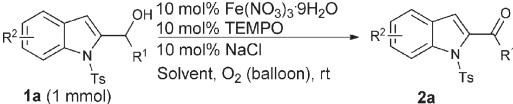</td></tr><tr><td>Entry</td><td>Substrate</td><td>R1</td><td>R2</td><td>Time (h)</td><td>Yield of 2 (%)</td></tr><tr><td>1</td><td>1a</td><td>H</td><td>H</td><td>2</td><td>99 (2a)</td></tr><tr><td>2</td><td>1b</td><td>H</td><td>5-F</td><td>3</td><td>90 (2b)</td></tr><tr><td>3</td><td>1c</td><td>H</td><td>5-COOMe</td><td>12</td><td>84 (2c)</td></tr><tr><td>4</td><td>1d</td><td>CH3</td><td>H</td><td>14</td><td>84 (2d)</td></tr><tr><td>5</td><td>1e</td><td>n-C5H11</td><td>H</td><td>24</td><td>92 (2e)</td></tr></table>

a Standard reaction conditions: 10 mol% F $\mathrm { e } { \left( \mathrm { N O } _ { 3 } \right) } _ { 3 } { \cdot } 9 \mathrm { H } _ { 2 } \mathrm { O } ,$ 10 mol% TEMPO, and 10 mol% NaCl in 4 mL of DCE.

indole ring could bear electron-withdrawing groups such as F and COOMe (Table 2, entries 2 and 3).

N–Ts, Boc or Ac are required for this transformation (Table $^ { 3 , }$ entries 1–3). When $\mathbf { R } ^ { 1 } = \mathrm { T } \mathbf { s }$ or $\operatorname { A c } ,$ the substrate could be oxidized to corresponding aldehyde rapidly with good yield; when $\mathbf { R } ^ { 1 } = \mathbf { B } \mathbf { o c } ,$ , 87% isolated yield could be obtained within 5 hours. The $\mathrm { R } ^ { 2 }$ group could be aryl, alkyl, a terminal C–C triple bond or an allene (Table 3, entries 4–7).

Table 3 Aerobic oxidation of indole-3-carbinols to corresponding aldehydes or ketones – the effect of -protecting groupa 

<table><tr><td>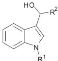</td><td>10 mol% Fe(NO3)3·9H2O10 mol% TEMPO10 mol% NaClDCE, O2 (balloon), rt</td><td>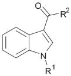</td></tr><tr><td>1 (1 mmol)</td><td></td><td>2</td></tr></table>

<table><tr><td>Entry</td><td>Substrate</td><td>R1</td><td>R2</td><td>Time (h)</td><td>Yield of 2 (%)</td></tr><tr><td>1</td><td>1f</td><td>Ts</td><td>H</td><td>1</td><td>80 (2f)</td></tr><tr><td>2</td><td>1g</td><td>Boc</td><td>H</td><td>5</td><td>83 (2g)</td></tr><tr><td>3</td><td>1h</td><td>Ac</td><td>H</td><td>1.5</td><td>87 (2h)</td></tr><tr><td>4</td><td>1i</td><td>Ac</td><td>Ph</td><td>5</td><td>89 (2i)</td></tr><tr><td>5</td><td>1j</td><td>Ac</td><td> $C_{2}H_{5}$ </td><td>4.5</td><td>89 (2j)</td></tr><tr><td>6</td><td>1k</td><td>Ac</td><td>HC≡C</td><td>9</td><td>94 (2k)</td></tr><tr><td>7</td><td>1l</td><td>Ac</td><td>CH=C=CH2</td><td>5</td><td>69 (2l)</td></tr></table>

a Standard reaction conditions: 10 mol% $\mathrm { F e } \left( \mathrm { N O } _ { 3 } \right) _ { 3 } { \cdot } 9 \mathrm { H } _ { 2 } \mathrm { O } _ { 3 }$ , 10 mol% TEMPO, and 10 mol% NaCl in 4 mL of DCE.

We further investigated the usability of air instead of pure oxygen; the results are summarized in Table 4. The transformation with air could be completed within 3 hours with 97% yield (Table 4, entry 1). When reducing the catalyst loading to 5 mol% each of $\mathrm { F e ( N O _ { 3 } ) _ { 3 } } { \cdot } 9 \mathrm { H } _ { 2 } \mathrm { O } ,$ , TEMPO, and NaCl, the reaction time doubled (Table 4, entry 2); when changing the reaction solvent to toluene,12 the reaction could also be completed in 10 hours (Table 4, entry 3).

Table 4 Optimization of the aerobic oxidation of (1-tosyl-1 -indol-2-yl)carbinol using air instead of oxygen 

<table><tr><td></td><td>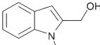Ts1a (1 mmol)</td><td>x mol% Fe(NO3)3·9H2Ox mol% TEMPOx mol% NaCIsolvent, air (balloon), rt</td><td colspan="2">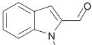2a Ts</td></tr><tr><td>Entry</td><td>x</td><td>Solvent</td><td>Time (h)</td><td>Yield of 2a (%, NMR)</td></tr><tr><td>1</td><td>10</td><td>DCE</td><td>3</td><td>97</td></tr><tr><td>2</td><td>5</td><td>DCE</td><td>8</td><td>96</td></tr><tr><td>3</td><td>10</td><td>Toluene</td><td>2</td><td>99</td></tr><tr><td>4</td><td>5</td><td>Toluene</td><td>10</td><td>99</td></tr></table>

a Standard reaction conditions: 10 mol% $\mathrm { F e } \left( \mathrm { N O } _ { 3 } \right) _ { 3 } { \cdot } 9 \mathrm { H } _ { 2 } \mathrm { O }$ , 10 mol% TEMPO, and 10 mol% NaCl in 4 mL of DCE.

We then applied these optimized reaction conditions using air as oxidant and toluene as solvent to some indole carbinols;

the results are summarized in Scheme 2. We found that both indole-2-carbinols and indole-3-carbinols could be transformed to corresponding carbonyl compounds in excellent yield under the standard conditions.

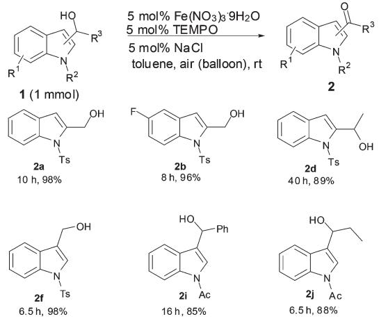  
Scheme 2 Room temperature aerobic oxidation of indole carbinols in toluene using air as oxidant.

To further show the practicality and efficiency of this catalytic system, a 0.1 mol reaction of (1-tosyl-1H-indol-3-yl)carbinol was conducted by using 2 mol% each of $\mathrm { F e } ( \mathrm { N O } _ { 3 } ) _ { 3 } { \cdot } 9 \mathrm { H } _ { 2 } \mathrm { O }$ , TEMPO and NaCl to give 1-tosyl-1H-indole-3-carbaldehyde in 89% isolated yield in 48 h by simple recrystallization.

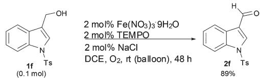

# Conclusions

In summary, we have developed a practical aerobic oxidation protocol for various types of indole carbinols using Fe-(NO ) ·9H O/TEMPO/NaCl as catalysts under mild conditions, affording the corresponding indole carbonyl compounds in good to excellent yields. This eco-friendly and economically oxidation system may be applied in academic laboratories as well as industrial scale production.

# Experimental section

# General experimental methods

1 H, 13C and $^ { 1 9 } \mathrm { F }$ NMR spectra were recorded with a Bruker AN 300 MHz spectrometer. 1 H NMR spectra (300 MHz) were recorded using TMS as an internal standard (δ 0 ppm). 13C NMR spectra (75 MHz) were recorded using CDCl as an internal standard (δ 77 ppm). 19F NMR spectra (282 MHz) were recorded using CFCl3 as an internal standard (δ 0 ppm). Infrared spectra were recorded on an FTIR spectrometer. Mass spectra were recorded in EI mode. HRMS spectra were recorded in EI mode.

# General procedure for the synthesis of aldehydes or ketones using molecular oxygen as oxidant (Method A)

To a 10 mL three-necked flask were added $\mathrm { F e } ( \mathrm { N O } _ { 3 } ) _ { 3 } { \cdot } 9 \mathrm { H } _ { 2 } \mathrm { O }$ (0.1 mmol), TEMPO (0.1 mmol), NaCl (0.1 mmol) and DCE (4 mL). Alcohol (1 mmol) was then added to the suspension and the resulting mixture was placed under an atmosphere of oxygen from a balloon and stirred at room temperature until the reaction was complete, as monitored by TLC (eluent: petroleum ether–ethyl acetate = 3 : 1). The resulting mixture was purified by column chromatography on silica gel (petroleum ether–ethyl acetate = 10/1) to afford the corresponding aldehyde or ketone.

# General procedure for the synthesis of aldehydes or ketones using air as oxidant (Method B)

To a 10 mL three-necked flask were added $\mathrm { F e } ( \mathrm { N O } _ { 3 } ) _ { 3 } { \cdot } 9 \mathrm { H } _ { 2 } \mathrm { O }$ (0.05 mmol), TEMPO (0.05 mmol), NaCl (0.05 mmol) and toluene (4 mL). Alcohol (1 mmol) was then added to the suspension and the resulting mixture was stirred at room temperature with an air balloon until the reaction was complete, as monitored by TLC (eluent: petroleum ether–ethyl acetate = 3 : 1). The resulting mixture was purified by column chromatography on silica gel (petroleum ether–ethyl acetate = 10/1) to afford the corresponding aldehyde or ketone.

# 1. Synthesis of 1-tosyl-1H-indole-2-carbaldehyde (2a).

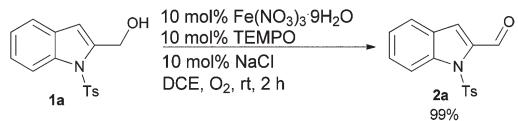

chemical

Chemical reaction scheme converting compound 1a to 2a under specified reagents and conditions

Method A: the reaction of (1-tosyl-1H-indol-2-yl)carbinol (301.3 mg, 1 mmol), $\mathrm { F e } \left( \mathrm { N O } _ { 3 } \right) _ { 3 } { \cdot } 9 \mathrm { H } _ { 2 } \mathrm { O }$ (40.5 mg, 0.1 mmol), TEMPO (15.6 mg, 0.1 mmol), and NaCl (5.8 mg, 0.1 mmol) in DCE (4 mL) afforded 1-tosyl-1H-indole-2-carbaldehyde13 (296.3 mg, 99%) as a white solid: m.p. 138–139 °C (hexane– ethyl acetate).

1 H NMR (300 MHz, CDCl3) δ 10.54 (s, 1H, CHO), 8.24 (d, J = 8.4 Hz, 1H, Ar-H), 7.66 (d, J = 8.4 Hz, 2H, Ar-H), 7.62 (d, J = 8.4 Hz, 1H, Ar-H), 7.52 (t, J = 7.5 Hz, 1H, Ar-H), 7.47 (s, 1H, Ar-H), 7.31 $\left( \mathrm { t } , J = 7 . 5 \right.$ Hz, 1H, Ar-H), 7.19 (d, J = 8.4 Hz, 2H, Ar-H), 2.33 (s, 3H, CH3); 13C NMR (75.4 MHz, CDCl3) δ 183.3, 145.6, 138.5, 137.8, 134.6, 130.0, 128.8, 128.2, 126.6, 124.8, 123.6, 118.8, 115.4, 21.6; IR (neat) 2928, 1673, 1595, 1529, 1441, 1409, 1364, 1346, 1229, 1172, 1148, 1120, 1088, 1041 cm−1 ; MS(EI) m/z (%) 299 (M+ , 30.92), 91 (100).

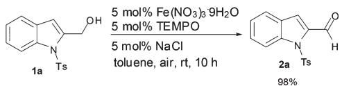

chemical

Chemical reaction scheme converting compound 1a to 2a using Fe(NO3)3·9H2O and TEMPO under NaCl in toluene at room temperature for 10 hours

Method B: the reaction of (1-tosyl-1H-indol-2-yl)carbinol (300.7 mg, 1 mmol), $\mathrm { F e } ( \mathrm { N O } _ { 3 } ) _ { 3 } { \cdot } 9 \mathrm { H } _ { 2 } \mathrm { O }$ (20.4 mg, 0.05 mmol),

TEMPO (8.0 mg, 0.05 mmol), and NaCl (3.0 mg, 0.05 mmol) in toluene (4 mL) afforded 1-tosyl-1H-indole-2-carbaldehyde (291.7 mg, 98%) as a white solid.

2. Synthesis of 5-fluoro-1-tosyl-1H-indole-2-carbaldehyde (2b).

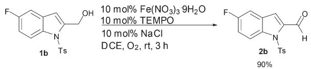

chemical

Chemical reaction scheme converting compound 1b to 2b using Fe(NO3)3 and TEMPO under NaCl conditions

Method A: the reaction of (5-fluoro-1-tosyl-1H-indol-2-yl)carbinol (319.8 mg, 1 mmol), $\mathrm { F e } ( \mathrm { N O } _ { 3 } ) _ { 3 } { \cdot } 9 \mathrm { H } _ { 2 } \mathrm { O }$ (40.6 mg, 0.1 mmol), TEMPO (15.6 mg, 0.1 mmol), and NaCl (5.9 mg, 0.1 mmol) in DCE (4 mL) afforded 5-fluoro-1-tosyl-1H-indole-2-carbaldehyde (286.7 mg, 90%) as a white solid: m.p. 152–153 °C (hexane– ethyl acetate).

1 H NMR (300 MHz, CDCl3) δ 10.53 (s, 1H, CHO), 8.20 (dd, $J _ { 1 } = 9 . 9$ Hz, $J _ { 2 } = 4 . 2 ~ \mathrm { H z } ,$ , 1H, Ar-H), 7.63 (d, J = 8.4 Hz, 2H, Ar-H), 7.41 (s, 1H, Ar-H), 7.30–7.18 (m, 4H, Ar-H), 2.34 (s, 3H, $\mathrm { C H } _ { 3 } \} ; \ ^ { 1 3 } \mathrm { C }$ NMR (75.4 MHz, CDCl3) δ 183.2, 160.0 $\left( \mathrm { d } , J = 2 3 8 . 0 \right.$ Hz), 145.8, 138.9, 134.7, 134.3, 130.0, 129.1 (d, J = 10.4 Hz), 126.6, 118.1 (d, J = 4.4 Hz), 117.2 (d, J = 25.8 Hz), 116.8 (d, J = 9.3 Hz), 108.5 (d, J = 23.7 Hz), 21.6; 19F NMR (282 MHz, CDCl3) δ −117.6; IR (neat) 2928, 1676, 1595, 1529, 1443, 1411, 1362, 1344, 1305, 1239, 1165, 1121, 1086, 1045 cm−1 ; MS(EI) m/z (%) 317 (M+ , 26.44), 91 (100); Anal. calcd for $\mathrm { C } _ { 1 6 } \mathrm { H } _ { 1 2 } \mathrm { F N O } _ { 3 } \mathrm { S } ;$ C 60.56; H 3.81; N 4.41; Found: C 60.49; H 3.81; N 4.22.

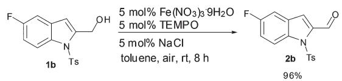

chemical

Chemical reaction scheme converting compound 1b to 2b using Fe(NO3)3·9H2O and TEMPO under NaCl conditions

Method B: the reaction of (5-fluoro-1-tosyl-1H-indol-2-yl)carbinol (319.6 mg, 1 mmol), $\mathrm { F e } ( \mathrm { N O } _ { 3 } ) _ { 3 } { \cdot } 9 \mathrm { H } _ { 2 } \mathrm { O }$ (20.8 mg, 0.05 mmol), TEMPO (7.9 mg, 0.1 mmol), and NaCl (2.7 mg, 0.1 mmol) in toluene (4 mL) afforded 5-fluoro-1-tosyl-1H-indole-2-carbaldehyde (304.6 mg, 96%) as white solid.

3. Synthesis of methyl 2-formyl-1-tosyl-1H-indole-5-carboxylate (2c).

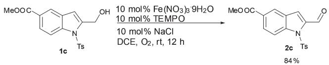

chemical

Chemical reaction scheme converting compound 1c to 2c using Fe(NO3)3·9H2O and TEMPO under NaCl conditions

Method A: the reaction of methyl 2-(hydroxymethyl)-1-tosyl-1Hindole-5-carboxylate (357.5 mg, 1 mmol), $\mathrm { F e } \left( \mathrm { N O } _ { 3 } \right) _ { 3 } { \cdot } 9 \mathrm { H } _ { 2 } \mathrm { O }$ (40.3 mg, 0.1 mmol), TEMPO (15.8 mg, 0.1 mmol), and NaCl (5.7 mg, 0.1 mmol) in DCE (4 mL) afforded methyl 2-formyl-1- tosyl-1H-indole-5-carboxylate (298.0 mg, 84%) as a white solid: m.p. 139–140 °C (hexane–ethyl acetate).

1 H NMR (300 MHz, CDCl3) δ 10.53 (s, 1H, CHO), 8.34 (s, 1H, Ar-H), 8.27 (d, J = 8.7 Hz, 1H, Ar-H), 8.17 (dt, $J _ { 1 } = 8 . 8 ~ \mathrm { H z }$ , $J _ { 2 } = 1 . 4 ~ \mathrm { H z } ,$ , 1H, Ar-H), 7.67 (d, J = 8.4 Hz, 2H, Ar-H), 7.50 (s, 1H, Ar-H), 7.21 (d, J = 8.4 Hz, 2H, Ar-H), 3.93 (s, 3H, OCH3), 2.33 (s, 3H, CH ); 13C NMR (75.4 MHz, CDCl ) δ 182.9, 166.4, 146.0, 140.6, 138.7, 134.4, 130.1, 129.4, 127.8, 126.9, 126.7, 125.9, 118.6, 115.1, 52.3, 21.6; IR (neat) 2988, 2901, 1716, 1669, 1614, 1596, 1534, 1462, 1436, 1409, 1374, 1307, 1286, 1256, 1233, 1162, 1137, 1086, 1050 $\mathrm { c m } ^ { - 1 }$ ; MS(EI) m/z (%) 357 (M+ , 27.95), 91 (100); Anal. calcd for ${ \bf C } _ { 1 8 } \mathrm { H } _ { 1 5 } { \bf N O } _ { 5 } { \bf S } \colon$ C 60.49; H 4.23; N 3.92; Found: C 60.29; H 4.15; N 3.64.

4. Synthesis of 1-(1-tosyl-1H-indol-2-yl)ethanone (2d).

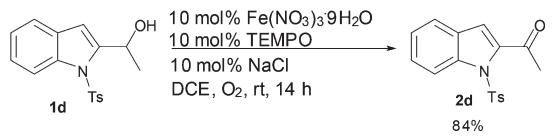

chemical

Chemical reaction scheme converting compound 1d to 2d using Fe(NO3)3·9H2O and TEMPO under NaCl conditions

Method A: the reaction of 1-(1-tosyl-1H-indol-2-yl)ethanol (315.9 mg, 1 mmol), $\mathrm { F e } ( \mathrm { N O } _ { 3 } ) _ { 3 } { \cdot } 9 \mathrm { H } _ { 2 } \mathrm { O }$ (40.1 mg, 0.1 mmol), TEMPO (15.7 mg, 0.1 mmol), and NaCl (5.9 mg, 0.1 mmol) in DCE (4 mL) afforded 1-(1-tosyl-1H-indol-2-yl)ethanone (263.7 mg, 84%) as a white solid: m.p. 130–131 °C (hexane– ethyl acetate).

1 H NMR (300 MHz, CDCl3) δ 8.15 (d, J = 8.4 Hz, 1H, Ar-H), 7.82 (d, J = 8.1 Hz, 2H, Ar-H), 7.55 (d, J = 7.8 Hz, 1H, Ar-H), 7.44 (t, J = 7.8 Hz, 1H, Ar-H), 7.30–7.18 (m, 3H, Ar-H), 7.10 (s, 1H, Ar-H), 2.63 (s, 3H, COCH3), 2.33 (s, 3H, CH3); 13C NMR (75.4 MHz, CDCl3) δ 191.7, 144.8, 139.9, 138.8, 135.1, 129.4, 128.3, 127.5, 127.3, 124.3, 122.8, 117.3, 115.7, 29.6, 21.5; IR (neat) 1689, 1537, 1442, 1360, 1330, 1312, 1266, 1223, 1169, 1147, 1125, 1102, 1089, 1018, 969 $\mathrm { c m } ^ { - 1 }$ ; MS(EI) m/z (%) 313 (M+ , 25.73), 91 (100); Anal. calcd for $\mathrm { C _ { 1 7 } H _ { 1 5 ^ { - } } }$ $\operatorname { N O } _ { 3 } \mathrm { S } ;$ C 65.16; H 4.82; N 4.47; Found: C 65.09; H 4.78; N 4.17.

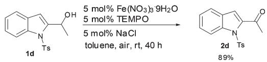

chemical

Chemical reaction scheme showing conversion of compound 1d to 2d using Fe(NO3)3·9H2O and TEMPO under NaCl in toluene at room temperature for 40 hours

Method B: the reaction of 1-(1-tosyl-1H-indol-2-yl)ethanol (315.2 mg, 1 mmol), $\mathrm { F e } ( \mathrm { N O } _ { 3 } ) _ { 3 } { \cdot } 9 \mathrm { H } _ { 2 } \mathrm { O }$ (20.0 mg, 0.05 mmol), TEMPO (7.9 mg, 0.05 mmol), and NaCl (3.0 mg, 0.05 mmol) in toluene (4 mL) afforded 1-(1-tosyl-1H-indol-2-yl)ethanone (278.2 mg, 89%) as a white solid.

5. Synthesis of 1-(1-tosyl-1H-indol-2-yl)hexan-1-one (2e).

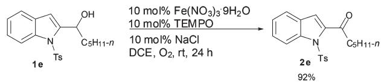

chemical

Chemical reaction scheme converting compound 1e to 2e using Fe(NO3)3·9H2O and TEMPO under NaCl conditions

Method A: the reaction of 1-(1-tosyl-1H-indol-2-yl)hexan-1-ol (370.1 mg, 1 mmol), $\mathrm { F e } ( \mathrm { N O } _ { 3 } ) _ { 3 } { \cdot } 9 \mathrm { H } _ { 2 } \mathrm { O }$ (40.1 mg, 0.1 mmol), TEMPO (15.6 mg, 0.1 mmol), and NaCl (5.6 mg, 0.1 mmol) in DCE (4 mL) afforded 1-(1-tosyl-1H-indol-2-yl)hexan-1-one (340.2 mg, 92%) as a white solid: m.p. $9 7 { - } 9 8 \ ^ { \circ } \mathrm { C }$ (hexane–ethyl acetate).

1 H NMR (300 MHz, CDCl ) δ 8.12 (d, J = 8.4 Hz, 1H, Ar-H), 7.85 (d, J = 8.4 Hz, 2H, Ar-H), 7.54 (d, J = 7.8 Hz, 1H, Ar-H), 7.43 (t, J = 7.8 Hz, 1H, Ar-H), 7.31–7.20 (m, 3H, Ar-H), 7.03 (s, 1H, Ar-H), 2.96 (t, J = 7.4 Hz, 2H, COCH2), 2.35 (s, 3H, COCH3),

1.82–1.65 (m, 2H, CH2), 1.43–1.25 (m, 4H, CH2CH2), 0.91 $\textstyle ( \mathrm { t } , J =$ 6.6 Hz, 3H, CH3); $^ { 1 3 } \mathrm { C }$ NMR (75.4 MHz, CDCl3) δ 195.4, 144.8, 140.0, 138.4, 135.1, 129.4, 128.5, 127.4, 127.1, 124.2, 122.6, 115.9, 115.5, 42.5, 31.3, 24.3, 22.4, 21.5, 13.9; IR (neat) 1686, 1597, 1535, 1356, 1332, 1299, 1255, 1234, 1217, 1187, 1169, 1123, 1092, 1046 cm−1 ; MS(EI) m/z (%) 369 (M+ , 22.37), 91 (100); Anal. calcd for $\mathrm { C } _ { 2 1 } \mathrm { H } _ { 2 3 } \mathrm { N O } _ { 3 } \mathrm { S } ;$ C 68.27; H 6.27; N 3.79; Found: C 68.19; H 6.13; N 3.51.

# 6. Synthesis of 1-tosyl-1H-indole-3-carbaldehyde (2f ).

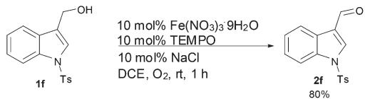

chemical

Chemical reaction scheme converting compound 1f to 2f using Fe(NO3)3·9H2O and TEMPO under NaCl conditions

Method A: the reaction of (1-tosyl-1H-indol-3-yl)carbinol (301.3 mg, 1 mmol), $\mathrm { F e } ( \mathrm { N O } _ { 3 } ) _ { 3 } { \cdot } 9 \mathrm { H } _ { 2 } \mathrm { O }$ (40.6 mg, 0.1 mmol), TEMPO (15.8 mg, 0.1 mmol), and NaCl (5.9 mg, 0.1 mmol) in DCE (4 mL) afforded 1-tosyl-1H-indole-3-carbaldehyde14 (238.4 mg, 80%) as a white solid (elute: petroleum ether–ethyl acetate = 5/1): m.p. 151–152 °C (hexane–ethyl acetate).

1 H NMR (300 MHz, CDCl3) δ 10.09 (s, 1H, CHO), 8.25 (d, J = 8.4 Hz, 1H, Ar-H), 8.23 (s, 1H, Ar-H), 7.95 (d, J = 7.5 Hz, 1H, Ar-H), 7.85 (d, J = 8.7 Hz, 2H, Ar-H), 7.45–7.32 (m, 2H, Ar-H), 7.28 (d, J = 8.7 Hz, 2H, Ar-H), 2.36 (s, 3H, CH ); $^ { 1 3 } \mathrm { C }$ NMR (75.4 MHz, CDCl3) δ 185.3, 146.1, 136.2, 135.1, 134.2, 130.3, 127.2, 126.24, 126.21, 125.0, 122.5, 122.3, 113.2, 21.6; IR (neat) 1662, 1595, 1538, 1479, 1444, 1399, 1372, 1279, 1237, 1168, 1126, 1098, 1082, 1016 cm−1 ; MS(EI) m/z (%) 299 (M+ , 49.19), 91 (100).

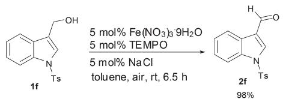

chemical

Chemical reaction scheme converting compound 1f to 2f under specified reagents and conditions

Method B: the reaction of (1-tosyl-1H-indol-3-yl)carbinol (301.8 mg, 1 mmol), $\mathrm { F e } \left( \mathrm { N O } _ { 3 } \right) _ { 3 } { \cdot } 9 \mathrm { H } _ { 2 } \mathrm { O }$ (20.8 mg, 0.05 mmol), TEMPO (7.9 mg, 0.05 mmol), and NaCl (2.9 mg, 0.05 mmol) in toluene (4 mL) afforded 1-tosyl-1H-indole-3-carbaldehyde (294.2 mg, 98%) as a white solid.

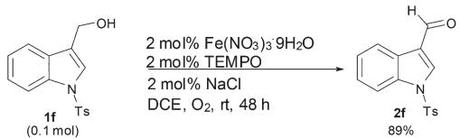

chemical

Chemical reaction scheme showing conversion of compound 1f to 2f using Fe(NO3)3·9H2O and TEMPO under NaCl conditions

To a 250 mL three-necked flask were added $\mathrm { F e } \left( \mathrm { N O } _ { 3 } \right) _ { 3 } { \cdot } 9 \mathrm { H } _ { 2 } \mathrm { O }$ (0.8090 g, 2.0 mmol), TEMPO (0.3130 g, 2.0 mmol), NaCl (0.1180 g, 2.0 mmol) and DCE (100 mL). (1-tosyl-1H-indol-3-yl)- carbinol (30.1984 g, 0.1 mol) was then added to the suspension and the resulting mixture was stirred at room temperature with an oxygen balloon until the reaction was complete, as monitored by TLC (eluent: petroleum ether–ethyl acetate = 3/1). The resulting mixture was washed with saturated brine, dried over anhydrous $\mathbf { M g S O _ { 4 } } ,$ concentrated in vacuo and recrystallized (DCM/petroleum ether) to afford 1-tosyl-1H-indole-3- carbaldehyde (26.5628 g, 89%) as a white solid.

# 7. Synthesis of tert-butyl 3-formyl-1H-indole-1-carboxylate (2g).

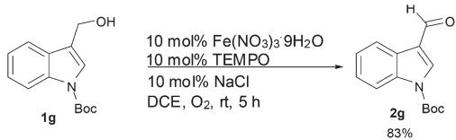

chemical

Chemical reaction scheme converting compound 1g to 2g using Fe(NO3)3·9H2O and TEMPO under NaCl conditions

Method A: the reaction of tert-butyl 3-(hydroxymethyl)-1Hindole-1-carboxylate (248.6 mg, 1 mmol), $\mathrm { F e } ( \mathrm { N O } _ { 3 } ) _ { 3 } { \cdot } 9 \mathrm { H } _ { 2 } \mathrm { O }$ (40.0 mg, 0.1 mmol), TEMPO (15.7 mg, 0.1 mmol), and NaCl (5.9 mg, 0.1 mmol) in DCE (4 mL) afforded tert-butyl 3-formyl-1H-indole-1-carboxylate15 (204.0 mg, 83%) as a white solid: m. p. 129–130 °C (hexane–ethyl acetate).

1 H NMR (300 MHz, CDCl3) δ 10.10 (s, 1H, CHO), 8.29 (dd, $J _ { 1 } = 6 . 9$ Hz, J2 = 1.8 Hz, 1H, Ar-H), 8.23 (s, 1H, Ar-H), 8.15 (d, $J = 7 . 5$ Hz, 1H, Ar-H), 7.45–7.34 (m, 2H, Ar-H), 1.71 (s, 9H, $\mathrm { C ( C H } _ { 3 } \mathrm { ) } _ { 3 } \mathrm { ) } ; \ ^ { 1 3 } \mathrm { C }$ NMR (75.4 MHz, CDCl3) δ 185.7, 148.8, 136.5, 135.9, 126.1, 126.0, 124.6, 122.1, 121.5, 115.1, 85.6, 28.0; IR (neat) 1740, 1675, 1556, 1482, 1449, 1396, 1355, 1327, 1310, 1273, 1238, 1153, 1131, 1099, 1044, 1016 cm−1 ; MS(EI) m/z (%) 245 (M+ , 12.63), 57 (100).

# 8. Synthesis of 1-acetyl-1H-indole-3-carbaldehyde (2h).

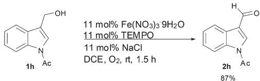

chemical

Chemical reaction scheme converting compound 1h to 2h using Fe(NO3)3·9H2O and TEMPO under NaCl conditions

Method A: the reaction of 1-(3-(hydroxymethyl)-1H-indol-1-yl) ethanone (176.3 mg, 1 mmol), $\mathrm { F e } ( \mathrm { N O } _ { 3 } ) _ { 3 } { \cdot } 9 \mathrm { H } _ { 2 } \mathrm { O }$ (40.3 mg, 0.1 mmol), TEMPO (15.4 mg, 0.1 mmol), and NaCl (5.9 mg, 0.1 mmol) in DCE (4 mL) afforded 1-acetyl-1H-indole-3-carbaldehyde16 (151.2 mg, 87%) as a pink solid (elute: petroleum ether–ethyl acetate = 3/1): m.p. 167–169 °C (hexane–ethyl acetate).

1 H NMR (300 MHz, CDCl3) δ 10.14 (s, 1H, CHO), 8.41 (d, J = 7.5 Hz, 1H, Ar-H), 8.28 (dd, J = 6.6 Hz, J = 1.8 Hz, 1H, Ar-H), 8.08 (s, 1H, Ar-H), 7.50–7.36 (m, 2H, Ar-H), 2.75 (s, 3H, CH3); $^ { 1 3 } \mathrm { C }$ NMR (75.4 MHz, CDCl3) δ 185.6, 168.5, 136.3, 135.1, 126.8, 126.0, 125.4, 122.6, 121.9, 116.3, 23.9; IR (neat) 1731, 1670, 1548, 1479, 1445, 1405, 1371, 1341, 1319, 1253, 1206, 1170, 1125, 1086, 1040, 1010 cm−1 ; MS(EI) m/z (%) 187 (M+ , 40.60), 144 (100).

# 9. Synthesis of 1-(3-benzoyl-1H-indol-1-yl)ethanone (2i).

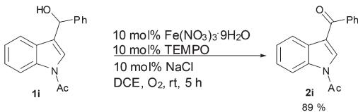

chemical

Chemical reaction scheme converting compound 1i to 2i using Fe(NO3)3·9H2O and TEMPO under NaCl conditions

Method A: the reaction of 1-(3-(hydroxy(phenyl)methyl)-1Hindol-1-yl)ethanone (265.3 mg, 1 mmol), $\mathrm { F e } ( \mathrm { N O } _ { 3 } ) _ { 3 } { \cdot } 9 \mathrm { H } _ { 2 } \mathrm { O }$ (40.0 mg, 0.1 mmol), TEMPO (15.7 mg, 0.1 mmol), and NaCl (5.8 mg, 0.1 mmol) in DCE (4 mL) afforded 1-(3-benzoyl-1Hindol-1-yl)ethanone (233.3 mg, 89%) as a white solid (elute: petroleum ether–ethyl acetate = 5/1): m.p. 109–110 °C (hexane– ethyl acetate).

1 H NMR (300 MHz, CDCl3) δ 8.43 (d, J = 7.5 Hz, 1H, Ar-H), 8.26 (d, J = 7.2 Hz, 1H, Ar-H), 7.90–7.83 (m, 3H, Ar-H), 7.66–7.38 (m, 5H, Ar-H), 2.67 (s, 3H, CH3); 13C NMR (75.4 MHz, CDCl3) δ 191.1, 168.6, 139.4, 136.0, 132.5, 132.2, 128.9, 128.6, 128.1, 126.4, 125.1, 122.4, 120.8, 116.2, 24.0; IR (neat) 1732, 1637, 1597, 1549, 1472, 1441, 1375, 1349, 1320, 1262, 1208, 1177, 1143, 1115, 1077, 1036, 1008 $\mathrm { c m } ^ { - 1 } ;$ ; MS(EI) m/z (%) 263 (M+ , 49.69), 144 (100); Anal. calcd for ${ \mathrm { C } } _ { 1 7 } { \mathrm { H } } _ { 1 3 } { \mathrm { N O } } _ { 2 } { \mathrm { : } }$ C 77.55; H 4.98; N 5.32; Found: C 77.12; H 4.97; N 4.95.

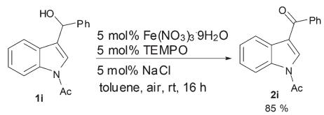

chemical

Chemical reaction scheme converting compound 1i to 2i using Fe(NO3)3·9H2O and TEMPO under NaCl in toluene at room temperature for 16 hours

Method B: the reaction of 1-(3-(hydroxy(phenyl)methyl)-1Hindol-1-yl)ethanone (265.0 mg, 1 mmol), $\mathrm { F e } \left( \mathrm { N O } _ { 3 } \right) _ { 3 } { \cdot } 9 \mathrm { H } _ { 2 } \mathrm { O }$ (20.0 mg, 0.05 mmol), TEMPO (7.7 mg, 0.05 mmol), and NaCl (3.0 mg, 0.05 mmol) in toluene (4 mL) afforded 1-(3-benzoyl-1H-indol-1-yl)ethanone (223.9 mg, 85%) as a white solid.

10. Synthesis of 1-(1-acetyl-1H-indol-3-yl)propan-1-one (2j).

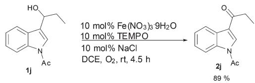

chemical

Chemical reaction scheme converting compound 1j to 2j using Fe(NO3)3·9H2O and TEMPO under DCE/O2 conditions

Method A: the reaction of 1-(3-(1-hydroxypropyl)-1H-indol-1-yl)- ethanone (217.9 mg, 1 mmol), $\mathrm { F e } \left( \mathrm { N O } _ { 3 } \right) _ { 3 } { \cdot } 9 \mathrm { H } _ { 2 } \mathrm { O }$ (40.0 mg, 0.1 mmol), TEMPO (15.7 mg, 0.1 mmol), and NaCl (5.9 mg, 0.1 mmol) in DCE (4 mL) afforded 1-(1-acetyl-1H-indol-3-yl) propan-1-one (192.1 mg, 89%) as a white solid (elute: petroleum ether–ethyl acetate = 5/1): m.p. 136–137 °C (hexane– ethyl acetate).

1 H NMR (300 MHz, CDCl ) δ 8.37–8.25 (m, 2H, Ar-H), 7.93 (s, 1H, Ar-H), 7.41–7.27 (m, 2H, Ar-H), 2.87 (q, J = 7.3 Hz, 2H, CH2), 2.65 (s, 3H, COCH3), 1.22 (t, J = 7.2 Hz, 3H, CH3); 13C NMR (75.4 MHz, CDCl3) δ 196.8, 168.6, 135.8, 130.3, 127.2, 126.0, 125.0, 122.3, 121.0, 116.0, 33.1, 23.9, 8.1; IR (neat) 1713, 1664, 1605, 1549, 1481, 1446, 1392, 1370, 1355, 1325, 1252, 1218, 1187, 1140, 1074, 1027 $\mathrm { c m } ^ { - 1 } ;$ MS(EI) m/z (%) 215 (M+ , 20.52), 144 (100); Anal. calcd for ${ \bf C } _ { 1 3 } { \bf H } _ { 1 3 } { \bf N O } _ { 2 } { \bf : \qquad }$ C 72.54; H 6.09; N 6.51; Found: C 72.35; H 5.93; N 6.30.

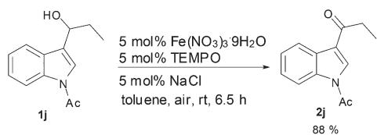

chemical

Chemical reaction scheme converting compound 1j to 2j using Fe(NO3)3 and TEMPO under NaCl in toluene at room temperature

Method B: the reaction of 1-(3-(1-hydroxypropyl)-1H-indol-1-yl)- ethanone (207.0 mg, 1 mmol), $\mathrm { F e } ( \mathrm { N O } _ { 3 } ) _ { 3 } { \cdot } 9 \mathrm { H } _ { 2 } \mathrm { O }$ (20.6 mg, 0.05 mmol), TEMPO (7.6 mg, 0.05 mmol), and NaCl (2.9 mg, 0.05 mmol) in toluene (4 mL) afforded 1-(1-acetyl-1H-indol-3- yl)propan-1-one (180.7 mg, 88%) as a white solid.

11. Synthesis of 1-(1-acetyl-1H-indol-3-yl)prop-2-yn-1-one (2k).

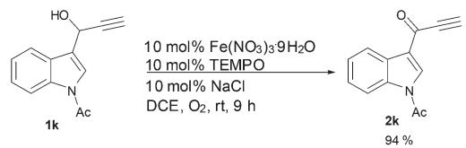

chemical

Chemical reaction scheme showing conversion of compound 1k to 2k using Fe(NO3)3·9H2O and TEMPO under NaCl conditions

Method A: the reaction of 1-(3-(1-hydroxyprop-2-ynyl)-1H-indol-1-yl)ethanone (212.9 mg, 1 mmol), $\mathrm { F e } ( \mathrm { N O } _ { 3 } ) _ { 3 } { \cdot } 9 \mathrm { H } _ { 2 } \mathrm { O }$ (40.4 mg, 0.1 mmol), TEMPO (15.4 mg, 0.1 mmol), and NaCl (5.5 mg, 0.1 mmol) in DCE (4 mL) afforded 1-(1-acetyl-1H-indol-3-yl) prop-2-yn-1-one (198.2 mg, 94%) as a white solid (elute: petroleum ether–ethyl acetate = 5/1): m.p. 151–152 °C (hexane– ethyl acetate).

1 H NMR (300 MHz, CDCl3) δ 8.39 (d, J = 7.5 Hz, 1H, Ar-H), 8.33 (d, J = 7.8 Hz, 1H, Ar-H), 8.25 (s, 1H, Ar-H), 7.48–7.35 (m, 2H, Ar-H), 3.31 (s, 1H, CH), 2.76 (s, 3H, CH3); $^ { 1 3 } \mathrm { C }$ NMR (75.4 MHz, CDCl3) δ 171.2, 168.5, 136.1, 135.1, 126.6, 126.0, 125.4, 122.3, 122.0, 116.2, 80.5, 77.4, 23.8; IR (neat) 2097, 1731, 1630, 1543, 1477, 1444, 1385, 1373, 1348, 1319, 1259, 1207, 1177, 1152, 1139, 1101, 1017 cm−1 ; MS(EI) m/z (%) 211 (M+ , 50.12), 169 (100); Anal. calcd for $\mathrm { C } _ { 1 3 } \mathrm { H } _ { 9 } \mathrm { N O } _ { 2 } \colon$ C 73.92; H 4.29; N 6.63; Found: C 73.60; H 4.32; N 6.21.

12. Synthesis of 1-(1-acetyl-1H-indol-3-yl)butyl-2,3-dien-1- one (2l).

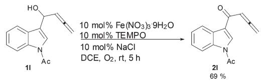

chemical

Chemical reaction scheme converting compound 1I to compound 2I using Fe(NO3)3·9H2O and TEMPO under NaCl conditions

Method A: the reaction of 1-(1-acetyl-1H-indol-3-yl)butyl-2,3- dien-1-ol (227.0 mg, 1 mmol), $\mathrm { F e } ( \mathrm { N O } _ { 3 } ) _ { 3 } { \cdot } 9 \mathrm { H } _ { 2 } \mathrm { O }$ (40.0 mg, 0.1 mmol), TEMPO (15.7 mg, 0.1 mmol), and NaCl (5.7 mg, 0.1 mmol) in DCE (4 mL) afforded 1-(1-acetyl-1H-indol-3-yl) butyl-2,3-dien-1-one (154.7 mg, 69%) as a yellow solid: m.p. 126–128 °C (hexane–ethyl acetate).

1 H NMR (300 MHz, CDCl3) δ 8.36 (d, J = 7.5 Hz, 1H, Ar-H), 8.33 (d, J = 7.5 Hz, 1H, Ar-H), 8.19 (s, 1H, Ar-H), 7.45–7.35 (m, 2H, Ar-H), 6.36 (t, J = 6.5 Hz, 1H, CvCvCH), 5.33 (d, $J = 6 . 6$ Hz, 2H, CvCvCH ), 2.71 (s, 3H, CH ); 13C NMR (75.4 MHz, CDCl ) δ 215.7, 184.9, 168.5, 135.6, 130.9, 127.6, 126.2, 125.1, 122.4, 120.9, 116.0, 94.4, 79.5, 23.8; IR (neat) 1963, 1934, 1703, 1633, 1538, 1480, 1448, 1420, 1381, 1349, 1326, 1254, 1217, 1188, 1140, $1 0 2 0 ~ \mathrm { { c m } ^ { - 1 } }$ ; MS(EI) m/z (%) 225 (M+ , 12.74), 144 (100); Anal. calcd for ${ \mathrm { C } } _ { 1 4 } { \mathrm { H } } _ { 1 1 } { \mathrm { N O } } _ { 2 } { \mathrm { : } }$ C 74.65; H 4.92; N 6.22; Found: C 74.24; H 4.94; N 6.03.

# Acknowledgements

We greatly acknowledge the financial support from the Major State Basic Research Development Program of China (No. 2009CB825300) and the National Natural Science Foundation of China (21232006). We thank Xiaobing Zhang in our group for reproducing the results of entry 5 in Table 2, and entries 3 and 6 in Table 3 presented in this study.

# References

1 (a) J. Shin, Y. Seo, K. W. Cho, J.-R. Rho and C. J. Sim, J. Nat. Prod., 1999, 62, 647; (b) N. Kogure, C. Nishiya, M. Kitajima and H. Takayama, Tetrahedron Lett., 2005, 46, 5857; (c) H. Zhang, X.-N. Wang, L.-P. Lin, J. Ding and J.-M. Yue, J. Nat. Prod., 2007, 70, 54; (d) B. Bao, Q. Sun, X. Yao, J. Hong, C.-O. Lee, H. Y. Cho and J. H. Jung, J. Nat. Prod., 2007, 70, 2; (e) A. E. Nugroho, Y. Hirasawa, N. Kawahara, Y. Goda, K. Awang, A. H. A. Hadi and H. Morita, J. Nat. Prod., 2009, 72, 1502; (f) B. L. J. Kindler, H.-J. Krämer, S. Nies, P. Gradicsky, G. Haase, P. Mayser, M. Spiteller and P. Spiteller, Eur. J. Org. Chem., 2010, 2084; (g) H. Chen, J. Bai, Z.-F. Fang, S.-S. Yu, S.-G. Ma, S. Xu, Y. Li, J. Qu, J.-H. Ren, L. Li, Y.-K. Si and X.-G. Chen, J. Nat. Prod., 2011, 74, 2438; (h) C.-H. Wang, G.-C. Wang, Y. Wang, X.-Q. Zhang, X.-J. Huang and W.-C. Ye, J. Asian Nat. Prod. Res., 2012, 14, 249.   
2 For oxidation of indole carbinols using MnO as stoichiometric oxidant see: (a) J. H. Mason and E. H. Pavry, J. Chem. Soc., 1963, 2565; (b) R. J. Sundberg, D. E. Rearick and H. F. Russell, J. Pharm. Sci., 1977, 66, 263; (c) O. Dann, H. Char, P. Fleischmann and H. Fricke, Liebigs Ann. Chem., 1986, 1986, 438; (d) S. Misztal, J. L. Mokrosz and Z. Bielecka, J. Prakt. Chem., 1989, 331, 751; (e) L. Pérez-Serrano, L. Casarrubios, G. Domínguez, P. González-Pérez and J. Pérez-Castells, Synthesis, 2002, 1810; (f ) E. M. Beccalli, G. Broggini, A. Farina, L. Malpezzi, A. Terraneo and G. Zechi, Eur. J. Org. Chem., 2002, 2080; (g) C. Zheng, Y. Lu, J. Zhang, X. Chen, Z. Chai, W. Ma and G. Zhao, Chem.–Eur. J., 2010, 16, 5853.   
3 For oxidation of indole carbinols using CrO as stoichiometric oxidant see: C. N. S. S. P. Kumar, C. L. Devi, V. J. Rao and S. Palaniappan, Synlett, 2008, 2023.   
4 For oxidation of indole carbinols using Pb(OAc) as stoichiometric oxidant see: T. Mukaiyama, K. Narasaka and H. Hokonok, J. Am. Chem. Soc., 1969, 91, 4317.   
5 For oxidation of indole carbinols using DMSO as stoichiometric oxidant see: N. Terzioglu, R. M. van Rijn, R. A. Bakker, I. J. P. De Esch and R. Leurs, Bioorg. Med. Chem. Lett., 2004, 14, 5251.   
6 For oxidation of indole carbinols using hypervalent iodine compounds as stoichiometric oxidant see: (a) M. Frigerio, M. Santagostino, S. Sputore and G. Palmisano, J. Org.

Chem., 1995, 60, 7272; (b) H. Naka, Y. Akagi, K. Yamada, T. Imahori, T. Kasahara and Y. Kondo, Eur. J. Org. Chem., 2007, 4635; (c) S. Hirao, Y. Yoshinaga, M. Iwao and F. Ishibashi, Tetrahedron Lett., 2010, 51, 533; (d) Y. Noguchi, T. Hirose, Y. Furuya, A. Ishiyama, K. Otoguro, S. Ömura and T. Sunazuka, Tetrahedron Lett., 2012, 53, 1802.

7 S. Kobayashi, H. Miyamura, R. Akiyama and T. Ishida, J. Am. Chem. Soc., 2005, 127, 9251.

8 For reviews, see: (a) J.-E. Bäckvall, Modern Oxidation Methods, Wiley-VCH, Weinheim, Germany, 2nd edn, 2010; (b) C. Parmeggiani and F. Cardona, Green Chem., 2012, 14, 547; (c) S. Caron, R. W. Dugger, S. G. Ruggeri, J. A. Ragan and D. H. B. Ripin, Chem. Rev., 2006, 106, 2943; (d) R. A. Sheldon and I. W. C. E. Arends, Adv. Synth. Catal., 2004, 346, 1051; (e) Oxidation of Alcohols to Aldehydes and Ketones: A Guide to Current Common Practice, ed. G. Tojo, M. I. Fernandez, Springer, 2006.

9 (a) J. M. Hoover, B. L. Ryland and S. S. Stahl, J. Am. Chem. Soc., 2013, 135, 2357; (b) Z. Hu and F. M. Kerton, Appl. Catal., A, 2012, 413–414, 332; (c) J. U. Ahmad, M. T. Räisänen, M. Leskelä and T. Repo, Appl. Catal., A, 2012, 411–412, 180; (d) P. J. Figiel, A. M. Kirillov, M. F. C. G. da Silva, J. Lasria and A. J. L. Pombeiro, Dalton Trans., 2010, 39, 9879; (e) W. Yin, C. Chu, Q. Lu, J. Tao, X. Liang and R. Liu, Adv. Synth. Catal., 2010, 352, 113; (f ) X. He, Z. Shen, W. Mo, N. Sun, B. Hu and X. Hu, Adv. Synth. Catal., 2009, 351, 89; (g) Z. Lu, T. Ladrak, O. Roubeau, J. van der Toorn, S. J. Teat, C. Massera, P. Gamez and J. Reedijk, Dalton Trans., 2009, 3559; (h) Z. Lu, J. S. Costa, O. Roubeau, I. Mutikainen, U. Turpeinen, S. J. Teat, P. Gamez and J. Reedijk, Dalton Trans., 2008, 3567; (i) X. Wang, R. Liu, Y. Jin and X. Liang, Chem.–Eur. J., 2008, 14, 2679; ( j) Y. Xie, W. Mo, D. Xu, Z. Shen, N. Sun, B. Hu and X. Hu, J. Org. Chem., 2007, 72, 4288; (k) R. A. Sheldon and I. W. C. E. Arends, J. Mol. Catal. A: Chem., 2006, 251, 200; (l) R. Liu, C. Dong, X. Liang, X. Wang and X. Hu, J. Org. Chem., 2005, 70, 729; (m) N. Wang, R. Liu, J. Chen and X. Liang, Chem. Commun., 2005, 5322; (n) R. Liu, X. Liang, C. Dong and X. Hu, J. Am. Chem. Soc., 2004, 126, 4112; (o) P. Gamez, I. W. C. E. Arends, R. A. Sheldon and J. Reedijk, Adv. Synth. Catal., 2004, 346, 805; (p) A. Dijksman, I. W. C. E. Arends and R. A. Sheldon, Org. Biomol. Chem., 2003, 1, 3232; (q) P. Gamez, I. W. C. E. Arends, J. Reedijk and R. A. Sheldon, Chem. Commun., 2003, 2414; (r) A. Dijksman, A. Marino-González, A. M. Payeras, I. W. C. E. Arends and R. A. Sheldon, J. Am. Chem. Soc., 2001, 123, 6826; (s) C. Bolm, A. S. Magnus and J. P. Hildebrand, Org. Lett., 2000, 2, 1173; (t) S. D. Rychnovsky and R. Vaidyanathan, J. Org. Chem., 1999, 64, 310; (u) A. Dijksman, I. W. C. E. Arends and R. A. Sheldon, Chem. Commun., 1999, 1591; (v) P. L. Anelli, C. Biffi, F. Montanari and S. Quici, J. Org. Chem., 1987, 52, 2559; (w) M. F. Semmelhack, C. R. Schmid,

D. A. Cortes and C. S. Chou, J. Am. Chem. Soc., 1984, 106, 3374.   
10 H. Tanaka, Y. Murakami, K. Okamoto, T. Aizawa and S. Torii, Bull. Chem. Soc. Jpn., 1988, 61, 310.   
11 S. Ma, J. Liu, S. Li, B. Chen, J. Cheng, J. Kuang, Y. Liu, B. Wan, Y. Wang, J. Ye, Q. Yu, W. Yuan and S. Yu, Adv. Synth. Catal., 2011, 353, 1005.   
12 J. Liu, X. Xie and S. Ma, Synthesis, 2012, 1569.

13 P. Kothandaraman, S. R. Mothe, S. S. M. Toh and P. W. H. Chan, J. Org. Chem., 2011, 76, 7633.   
14 X. Guo, W. Hu, S. Cheng, L. Wang and J. Chang, Synth. Commun., 2006, 36, 781.   
15 B. Chauder, A. Larkin and V. Snieckus, Org. Lett., 2002, 4, 815.   
16 O. Ottoni, R. Cruz and R. Alves, Tetrahedron, 1998, 54, 13915.