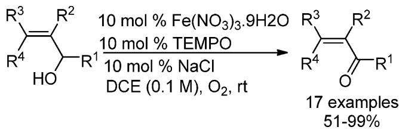
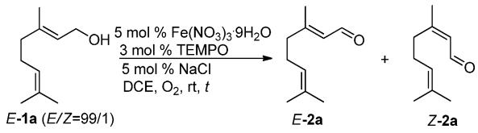
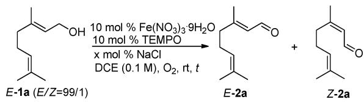
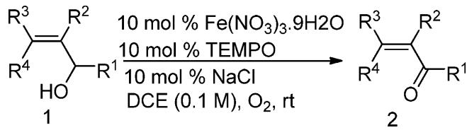
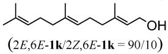
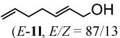
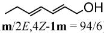
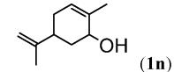
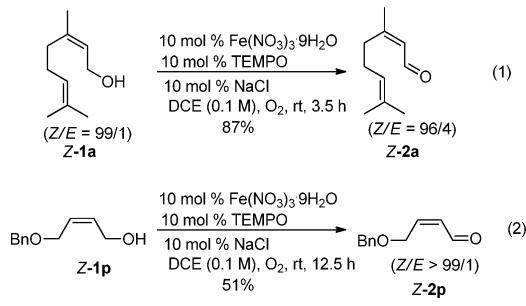
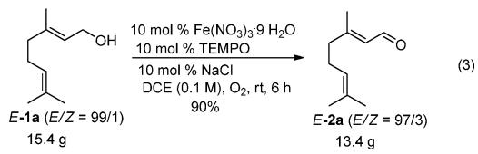

# Iron-Catalyzed Aerobic Oxidation of Allylic Alcohols: The Issue of CdC Bond Isomerization

Jinxian Liu†,‡ and Shengming Ma\*,†,§

Shanghai Key Laboratory of Green Chemistry and Chemical Process, Department of Chemistry, East China Normal University, 3663 North Zhongshan Lu, Shanghai 200062, P. R. China, College of Chemistry and Materials Science, Longyan University, Longyan 364000, P. R. China, and State Key Laboratory of Organometallic Chemistry, Shanghai Institute of Organic Chemistry, Chinese Academy of Sciences, 354 Fenglin Lu, Shanghai 200032, P. R. China

masm@sioc.ac.cn

Received July 8, 2013

ABSTRACT   

chemical

Chemical reaction scheme showing oxidation of a substituted cyclohexanone derivative using Fe(NO3)3.9H2O and TEMPO under NaCl conditions

An aerobic oxidation of allylic alcohols using Fe(NO3)3 3 9H2O/TEMPO/NaCl as catalysts under atmospheric pressure of oxygen at room temperature was developed. This eco-friendly and mild protocol provides a convenient pathway to the synthesis of stereodefined R,β-unsaturated enals or enones with the retention of the C C double-bond configuration.

R,β-Unsaturated aldehydes/ketones are important intermediates in many organic reactions, such as (hetero)Diels Alder reactions,1 Michael addition,2 (aza) Morita Baylis Hillman reaction,3 Aldol condensation,4 Heck coupling,5 cyclization,6 etc.7 There are numerous reports for the synthesis of such compounds.8 Oxidation of the corresponding allylic alcohols is the most convenient method for this transformation. Traditionally, a stoichiometric

amount of oxidants such as chromium oxides,9 MnO2,1 0 DMSO,11 or hypervalent iodine compounds12 is needed, which would produce almost the same amount of waste and cause serious environmental problems. In addition, the Z/E-isomerization of R,β-unsaturated carbonyl compounds was observed during the oxidation of the corresponding allylic alcohols.1316

On the other hand, molecular oxygen is a natural, cheap, and eco-friendly oxidant, which was applied in the oxidation of allylic alcohols as terminal oxidant with transition-metal catalysts such as $ { \mathrm { P d } } , ^ { 1 7 }  { \mathrm { P t } } , ^ { 1 8 }  { \mathrm { A u } } , ^ { 1 9 }  { \mathrm { R u } } , ^ { 2 0 }$ $\mathrm { P t { - } B i , ^ { 2 1 } \ O s { - } C u , ^ { 2 2 } \ \tilde { V } , ^ { 2 3 } \ C u , ^ { 2 4 } \ F e , ^ { 2 5 } }$ or even without a

(6) (a) Jacobsen, C. B.; Jensen, K. L.; Udmark, J.; Jørgensen, K. A. Org. Lett. 2011, 13, 4790. (b) Wei, C.- H.; Mannathan, S.; Cheng, C.-H. Angew. Chem., Int. Ed. 2012, 51, 10592. (c) Fujii, M.; Nishimura, T.; Koshiba, T.; Yokoshima, S.; Fukuyama, T. Org. Lett. 2013, 15, 232.   
(7) (a) Marzinzik, A. L.; Felder, E. R. J. Org. Chem. 1998, 63, 727. (b) Zhu, Y.; Chuah, G.-K.; Jaenicke, S. J. Catal. 2006, 241, 25. (c) Taber, D. F.; Nelson, C. G. J. Org. Chem. 2006, 71, 8973. (d) Zhao, G.-L.; Ibrahem, I.; Sunden, H.; Cordova, A.  Adv. Synth. Catal. 2007, 349, 1210. (e) Zu, L.; Zhang, S.; Xie, H.; Wang, W. Org. Lett. 2009, 11, 1627. (f) Penafiel, I.; Pastor, I. M.; Yus, M.; Esteruelas, M. A.; Oliv\~ an, M. Organometallics 2012, 31, 6154.   
(8) (a) Engel, C. R.; Lessard, J. J. Am. Chem. Soc. 1963, 85, 638. (b) Kourouli, T.; Kefalas, P.; Ragoussis, N.; Ragoussis, V. J. Org. Chem. 2002, 67, 4615. (c) Swenson, R. E.; Sowin, T. J.; Zhang, H. Q. J. Org. Chem. 2002, 67, 9182. (d) Yamashita, S.; Iso, K.; Hirama, M. Org. Lett. 2008, 10, 3413. (e) Reich, H. J.; Reich, I. L.; Renga, J. M. J. Am. Chem. Soc. 1973, 95, 5813. (f) Huang, X.; Yang, Y. Org. Lett. 2007, 9, 1667. (g) Richter, F.; Otto, H.-H. Liebigs Ann. Chem. 1990, 7. (h) Cadierno, V.; Garcla-Garrido, S. E.; Gimeno, J. Adv. Synth. Catal. 2006, 348, 101. (i) Shimizu, I.; Tsuji, J. J. Am. Chem. Soc. 1982, 104, 5844. (j) Mitsudo, T.-A.; Kadokura, M.; Watanabe, Y. J. Org. Chem. 1987, 52, 3186.   
(9) (a) Meng, Q.-H.; Feng, J.-C.; Bian, N.-S.; Liu, B.; Li, C.-C. Synth. Commun. 1998, 28, 1097. (b) Bora, U.; Chaudhuri, M. K.; Dey, D.; Kalita, D.; Kharmawphlang, W.; Mandal, G. C. Tetrahedron 2001, 57, 2445. (c) Gonzalez-Nunz, M. E.; Mello, R.; Olmos, A.; Acerete, R.;\~ Asensio, G. J. Org. Chem. 2006, 71, 1039.   
(10) (a) Shaabani, A.; Mirzaei, P.; Lee, D. G. Catal. Lett. 2004, 97, 119. (b) Ahmed, M. M.; Cui, H.; O’Doherty, G. A. J. Org. Chem. 2006, 71, 6686. (c) Beckmann, C.; Rattke, J.; Sperling, P.; Heinz, E.; Boland, W. Org. Biomol. Chem. 2003, 1, 2448.   
(11) (a) Matovic, N. J.; Hayes, P. Y.; Penman, K.; Lehmann, R. P.; De Voss, J. J. J. Org. Chem. 2011, 76, 4467. (b) Matovic, N.; Matthias, A.; Gertsch, J.; Raduner, S.; Bone, K. M.; Lehmann, R. P.; DeVoss, J. J. Org. Biomol. Chem. 2007, 5, 169. (c) Marshall, J. A.; Crooks, S. L.; DeHoff, B. S. J. Org. Chem. 1988, 53, 1616.   
(12) (a) Lin, C.-K.; Lu, T.-J. Tetrahedron 2010, 66, 9688. (b) Chakor, N. S.; Musso, L.; Dallavalle, S. J. Org. Chem. 2009, 74, 844.   
(13) For such oxidations with chromium oxides, see: (a) Martinez, Y.; de las Heras, M. A.; Vaquero, J. J.; Garcia-Navio, J. L.; Alvarez-Builla, J. Tetrahedron Lett. 1995, 36, 8513. (b) Schneider, R.; Gerardin, P.; Loubinoux, B.; Rihs, G. Tetrahedron 1995, 51, 4997. (c) Brunelet, T.; Jouitteau, C.; Gelbard, G. J. Org. Chem. 1986, 51, 4016. (d) Desong, P.; Kell, D. A.; Sidler, D. R. J. Org. Chem. 1985, 50, 2309.   
(14) For such oxidations with MnO , see: (a) Domı´ nguez, M.; Alvarez, R.; Borr  as, E.; Farres, J.; Pars, X.; de Lera, A. R. Org. Biomol. Chem. 2006, 4, 155. (b) Valla, A.; Cartier, D.; Laurent, A.; Valla, B.; Labia, R.; Potier, P. Synth. Commun. 2003, 33, 1195. (c) Stipa, P.; Finet, J.-P.; Le Moigne, F.; Tordo, P. J. Org. Chem. 1993, 58, 4465. (d) Tsuboi, S.; Masuda, T.; Takeda, A. J. Org. Chem. 1982, 47, 4478.   
(15) For such oxidations with hypervalent iodine compounds, see: (a) Xue, H.; Gopal, P.; Yang, J. J. Org. Chem. 2012, 77, 8933. (b) Martı´ nez-Bescos, P.; Cagide-Fagı´ n, F.; Roa, L. F.; Ortiz-Lara, J. C.; Kierus, K.; Ozores-Viturro, L.; Fernandez-Gonzalez, M.; Alonso, R. J. Org. Chem. 2008, 73, 3745.   
(16) For such oxidations with other oxidants, see: Nakano, T.; Ishii, Y.; Ogawa, M. J. Org. Chem. 1987, 52, 4855.   
(17) (a) Kaneda, K.; Fujii, M.; Morioka, K. J. Org. Chem. 1996, 61, 4502. (b) Kakiuchi, N.; Maeda, Y.; Nishimura, T.; Uemura, S. J. Org. Chem. 2001, 66, 6620. (c) Schultz, M. J.; Hamilton, S. S.; Jensen, D. R.; Sigman, M. S. J. Org. Chem. 2005, 70, 3343. (d) Batt, F.; Bourcet, E.; Kassab, Y.; Fache, F. Synlett 2007, 12, 1869. (e) Johnston, E. V.; Verho, O.; K€ark€as, M. D.; Shakeri, M.; Tai, C.-W.; Palmgren, P.; Eriksson, K.; Oscarsson, S.; B€ackvall, J.-E. Chem.;Eur. J. 2012, 18, 12202.   
(18) Tonucci, L.; Nicastro, M.; d’Alessandro, N.; Bressan, M.; D’Ambrosio, P.; Morvillo, A. Green Chem. 2009, 11, 816.   
(19) Muldoon, J.; Brown, S. N. Org. Lett. 2002, 4, 1043.   
(20) (a) Larock, R. C.; Varaprath, S. J. Org. Chem. 1984, 49, 3435. (b) Lee, M.; Chang, S. Tetrahedron Lett. 2000, 41, 7507.   
(21) Lee, A. F.; Gee, J. J.; Theyers, H. J. Green Chem. 2000, 2, 279.   
(22) (a) Abad, A.; Almela, C.; Corma, A.; Garcı´ a, H. Chem. Commun. 2006, 3178. (b) Abad, A.; Almela, C.; Corma, A.; Garcı´ a, H. Tetrahedron 2006, 62, 6666. (c) Abad, A.; Corma, A.; Garcı´ a, H. Pure Appl. Chem. 2007, 79, 1847.

metallic catalyst.26 It is worth noting that Z/E-isomerization has also been observed under aerobic oxidation conditions. For example, Christmann and co-workers have reported a copper-catalyzed aerobic oxidation/isomerization protocol of Z-allylic alcohols affording the completely isomerized products E-R,β-unsaturated aldehydes under mild conditions in $2 0 1 2 . ^ { 2 7 }$ Therefore, a clean and mild oxidation method toward allylic alcohols without isomerization is highly desirable for both academic preparation and industrial scale production. We have focused on the aerobic oxidation of alcohols and established a general protocol for the aerobic oxidation of a wide range of alcohols under mild conditions using $\mathrm { F e ( N O _ { 3 } ) _ { 3 } { \cdot } 9 H _ { 2 } O / T E M P O / N a C l }$ as catalysts, yielding the corresponding aldehydes or ketones in good to excellent yields.28 Herein, we report our efforts in the iron-catalyzed aerobic oxidation of allylic alcohols with retention of the C C double-bond configuration.

We initially tried this oxidation toward geraniol (E-1a) using 5 mol % Fe(NO3)3 3 9H2O, 3 mol % TEMPO, and 5 mol % NaCl as catalysts in 1,2-dichloethane (Table1, entry 1). It is interesting to observe that the issue of isomerization is concentration dependent: when the substrate concentration was reduced to 0.1 mol/L, no isomerization was observed (Table 1, entries 6 9). At a higher concentration, serious E to Z isomerization was observed (Table 1, entries 1 5). For considering conversion and extent of E/Z-isomerization, we have defined 10 mol % each of $\mathrm { F e } ( \mathrm { N O } _ { 3 } ) _ { 3 } { \cdot } 9 \mathrm { H } _ { 2 } \mathrm { O }$ , TEMPO, and NaCl in DCE (0.1 mol/L of substrate) as standard reaction conditions (Table 1, entry 9).

Changing the loading of NaCl does not affect the E/Z ratio of the product (Table 2, entries 2 5). As a comparsion, when the reaction was conducted in the absence of NaCl, only 49% of E-2a was obtained with 25% recovery of E-1a even with a prolonged reaction time of 24 h (Table 2, entry 1). The exact role of NaCl is still not clear; however, as noted in the previous report,28a we believe that it may be acting as a ligand to iron.

Allylic alcohols without such an issue could also be oxidized to the corresponding aldehydes/ketones in moderate to good yield (Table 3, entries 8 10). Farnesol (2E,6E-1k, E/Z = 90:10), an acyclic sesquiterpene alcohol

(23) Hanson, S. K.; Wu, R.; Silks, L. A. Org. Lett. 2011, 13, 1908.   
(24) (a) Semmelhack, M. F.; Schmid, C. R.; Cortes, D. A.; Chou, C. S. J. Am. Chem. Soc. 1984, 106, 3374. (b) Ragagnin, G.; Betzemeier, B.; Quici, S.; Knochel, P. Tetrahedron 2002, 58, 3985. (c) Liu, Y.; Ma, S. Chin. J. Chem. 2012, 30, 29. (d) B€ackvall, J.-E. Modern Oxidation Methods, 2nd ed.; Wiley-VCH: Weinheim, 2010. (e) Dijksman, A.; Marino-Gonzalez, A.; Payeras, A. M.; Arends, I. W. C. E.; Sheldon, R. A. J. Am. Chem. Soc. 2001, 123, 6826.   
(25) (a) Yin, W.; Chu, C.; Lu, Q.; Tao, J.; Liang, X.; Liu, R. Adv. Synth. Catal. 2010, 352, 113. (b) He, X.; Shen, Z.; Mo, W.; Sun, N.; Hu, B.; Hu, X. Adv. Synth. Catal. 2009, 351, 89. (c) Wang, N.; Liu, R.; Chen, J.; Liang, X. Chem. Commun. 2005, 5322.   
(26) (a) Wang, X.; Liu, R.; Jin, Y.; Liang, X. Chem.;Eur. J. 2008, 14, 2679. (b) Liu, R.; Liang, X.; Dong, C.; Hu, X. J. Am. Chem. Soc. 2004, 126, 4112.   
(27) Konning, D.; Hiller, W.; Christmann, M. € Org. Lett. 2012, 14, 5258.   
(28) (a) Ma, S.; Liu, J.; Li, S.; Chen, B.; Cheng, J.; Kuang, J.; Liu, Y.; Wan, B.; Wang, Y.; Ye, J.; Yu, Q.; Yuan, W.; Yu, S. Adv. Synth. Catal. 2011, 353, 1005. (b) Liu, J.; Xie, X.; Ma, S. Synthesis 2012, 44, 1569. (c) Liu, J.; Ma, S. Synthesis 2013, 45, 1624. (d) Liu, J.; Ma, S. Org. Biomol. Chem. 2013, 11, 4186.

Table 1. Optimization of the Reaction Conditionsa   

chemical

Organic synthesis reaction scheme showing conversion of compound E-1a to E-2a and Z-2a under specified conditions

<table><tr><td>entry</td><td>conc (mol/L)</td><td>time (h)</td><td>yield of 2ab (%)</td><td>E/Z</td></tr><tr><td>1</td><td>5.0</td><td>12</td><td>98 (0)</td><td>80/20</td></tr><tr><td>2</td><td>2.0</td><td>12</td><td>98 (0)</td><td>89/11</td></tr><tr><td>3</td><td>1.0</td><td>12</td><td>68 (32)</td><td>90/10</td></tr><tr><td>4</td><td>0.5</td><td>12</td><td>33 (51)</td><td>91/9</td></tr><tr><td>5</td><td>0.2</td><td>12</td><td>22 (59)</td><td>93/7</td></tr><tr><td>6</td><td>0.1</td><td>12</td><td>22 (66)</td><td>97/3</td></tr><tr><td>7</td><td>0.05</td><td>12</td><td>19 (72)</td><td>97/3</td></tr><tr><td>8c</td><td>0.1</td><td>24</td><td>44 (50)</td><td>97/3</td></tr><tr><td>9d</td><td>0.1</td><td>3</td><td>95 (0)</td><td>97/3</td></tr></table>

a The reaction was conducted using 10 mmol of E-1a, 5 mol % $\mathrm { F e } ( \mathrm { N O } _ { 3 } ) _ { 3 } { \cdot } 9 \mathrm { H } _ { 2 } \mathrm { O } .$ , 3 mol % TEMPO, and 5 mol % NaCl in DCE; b 1 H NMR yield of 2a with recovery of the alcohol in the parentheses; $^ { b } \dot { \mathrm { ~ H ~ } }$ c The reaction was conducted using 1 mmol of E-1a, 5 mol % $\vec { \bf \Phi } \mathrm { e } ( { \bf N O } _ { 3 } ) _ { 3 } .$ 2. ${ \mathrm { 9 H } } _ { 2 } { \mathrm { O } } .$ , 5 mol % TEMPO, and 10 mol % NaCl in ${ \mathrm { D C E } } ; { } ^ { d } { \mathrm { T } }$ he reaction was conducted using 1 mmol of E-1a, 10 mol $\mathrm { \% } \ \mathrm { F e } ( \mathrm { N O } _ { 3 } ) _ { 3 } { \cdot } 9 \mathrm { H } _ { 2 } \mathrm { O } .$ , 10 mol % TEMPO, and 10 mol % NaCl in DCE.

Table 2. Effect of NaCl in the Oxidation of $E \mathbf { - } \mathbf { 1 } \mathbf { a } ^ { a }$   

chemical

Chemical reaction scheme showing conversion of compound E-1a to E-2a and Z-2a using Fe(NO3)3·9H2O and TEMPO under NaCl conditions

<table><tr><td>entry</td><td>x</td><td>time (h)</td><td>yield of 2ab(%)</td><td>E/Z</td></tr><tr><td>1</td><td>0</td><td>24</td><td>49 (25)</td><td>97/3</td></tr><tr><td>2</td><td>5</td><td>4</td><td>95 (0)</td><td>97/3</td></tr><tr><td>3</td><td>10</td><td>3</td><td>95 (0)</td><td>97/3</td></tr><tr><td>4</td><td>15</td><td>3</td><td>95 (0)</td><td>97/3</td></tr><tr><td>5</td><td>20</td><td>3</td><td>95 (0)</td><td>97/3</td></tr></table>

a The reaction was conducted using 1 mmol of E-1a, 10 mol % $\mathrm { F e } ( \mathrm { N O } _ { 3 } ) _ { 3 } { \cdot } 9 \mathrm { H } _ { 2 } \mathrm { O } .$ , 10 mol % TEMPO, and x mol $\%$ NaCl in DCE; 3   b 1 H NMR yield of 2a with recovery of the alcohol in the parentheses.

that was extracted from many essential oils, could be oxidized under these conditions to afford the corresponding product with 66% yield with retention of the CdC bond configuration (Table 3, entry 11); allylic alcohols with conjugated as well as unconjugated diene moieties E-1l and 2E,4E-1m could also be oxidized to the corresponding aldehydes with good yield without changing the $E / Z$ ratio (Table 3, entries 12 and 13). In addition, as expected, cyclic allylic alcohol 1n and primary alcohols with two $\mathrm { C } { = } \mathrm { C }$ bonds 1o could also be oxidized to the corresponding ketone 2n and aldehyde 2o in moderate to good yields (Table 3, entries 14 and 15).

Interestingly, when Z-allylic alcohols Z-1a and Z-1n were oxidized under this set of standard conditions, the

Table 3. Substrate Scope of $\mathrm { F e ( N O _ { 3 } ) _ { 3 } } { \cdot } 9 \mathrm { H } _ { 2 } \mathrm { O } /$ TEMPO/NaCl-Catalyzed Room Temperature Aerobic Oxidation of Allylic Alcohols   

chemical

Chemical reaction scheme converting compound 1 to compound 2 using Fe(NO3)3.9H2O and TEMPO under NaCl conditions

<table><tr><td>entry</td><td> $R^1; R^2; R^3; R^4$ </td><td>t(h)</td><td>yield of 2(E/Z)(%)</td></tr><tr><td>1</td><td>H;H;Me2C=CH(CH2)3; CH3(1a)a</td><td>3</td><td>91 (97:3) (2a)</td></tr><tr><td>2</td><td>H;H;n-C4H9;H (1b)</td><td>5</td><td>83 (&gt;99/1) (2b)</td></tr><tr><td>3</td><td>H; H; n-C8H17; H (1c)</td><td>2</td><td>98 (&gt;99/1) (2c)</td></tr><tr><td>4</td><td>H; H; p-NO2C6H4; H (1d)</td><td>2</td><td>99 (&gt;99/1) (2d)</td></tr><tr><td>5</td><td>CH3; H; n-C4H9; H (1e)</td><td>2</td><td>92 (&gt;99/1) (2e)</td></tr><tr><td>6</td><td>C2H5; CH3; C2H5; H (1f)</td><td>3</td><td>60 (&gt;99/1) (2f)</td></tr><tr><td>7</td><td>Cy; H; CH3; H (1g)b</td><td>9</td><td>75 (97:3) (2g)</td></tr><tr><td>8</td><td>Ph; CH3; H; H (1h)</td><td>6</td><td>75 (2h)</td></tr><tr><td>9c</td><td>n-C5H11; H; H; H (1i)</td><td>13</td><td>76 (2i)</td></tr><tr><td>10c</td><td>n-C6H13; H; H; H (1j)</td><td>12.5</td><td>86 (2j)</td></tr><tr><td>11</td><td></td><td>47</td><td>66 (2E,6E-2k/2Z,6E-2k = 89/11)</td></tr><tr><td>12</td><td></td><td>9</td><td>72 (E-2l, E/Z = 88/12)</td></tr><tr><td>13</td><td>(2E,4E-1 )</td><td>4</td><td>70 (2E,4E-2m/2E,4Z-2m = 95/5)</td></tr><tr><td>14</td><td></td><td>12</td><td>67 (2n)</td></tr><tr><td>15</td><td></td><td>9</td><td>90 (2o)</td></tr></table>

$^ a E / Z = 9 9 / 1 . ^ { b } E / Z = 9 5 / 5 .$ . c The reaction was conducted using 5 mol % Fe $\mathrm { N O } _ { 3 } ) _ { 3 } { \cdot } 9 \mathrm { H } _ { 2 } \mathrm { O } , \qquad $ 5 mol % TEMPO, 5 mol % NaCl, 0.25 M in 1,2-dichloroethane.

corresponding Z-aldehydes Z-2a and Z-2p were obtained in moderate to good yields (Scheme 1).

To further show the practicality and efficiency of this catalytic system, a 0.1 mol reaction of E-1a was conducted under the optimized conditions to give E-2a in 90% isolated yield in 6 h without changing the $E / Z$ ratio (Scheme 2) .

Scheme 1. Iron-Catalyzed Aerobic Oxidation of Acyclic Z-Allylic Alcohols   

chemical

Two organic reaction schemes (1) and (2) showing oxidation products Z-1a and Z-1p with reagents, yields, and diastereomeric excess data

In conclusion, we have developed a mild and ecofriendly protocol for the aerobic oxidation of allylic alcohols using Fe(NO3)3 9H2O/TEMPO/NaCl as catalyst in DCE to synthesize R,β-unsaturated enals or enones with retention of the C C double bond configuration. Further

Scheme 2. 0.1 mol Scale Oxidation of E-1a   

chemical

Organic synthesis reaction showing conversion of compound E-1a to E-2a with reagents and yields

studies including the synthesis application are being pursued in our laboratory.

Acknowledgment. We greatly acknowledge the financial support from the National Basic Research Program of China (2009CB825300) and the NSF of China (2123006). We thank Binjie Guo in our group for reproducing the results of entries 4, 9, and 14 in Table 3 presented in this study.

Supporting Information Available. Experimental procedure and spectroscopic data for products. This material is available free of charge via the Internet at http://pubs.acs.org.