# RESEARCH ARTICLE

View Article Online

View Journal | View Issue

Check for updates

Cite this: , 2017, 4, 951

Received 7th December 2016, Accepted 6th February 2017

DOI: 10.1039/c6qo00785f

rsc.li/frontiers-organic

# Aerobic oxidation and EATA-based highly enantioselective synthesis of lamenallenic acid†

Xingguo Jiang,a Yufeng Xuea and Shengming Ma\*a,b

By utilizing the recently developed EATA (enantioselective allenylation of terminal alkynes) reaction and the aerobic oxidation of alcohols, lamenallenic acid, a naturally occurring axially chiral allene, has been synthesized with a high ee value and / selectivity from methyl 5-hexynoate and ( )-10-dodecenal, which could be prepared easily from 1-decyne and 1-pentyne, respectively, with ( )-α,α-dimethylprolinol as the chiral source.

# Introduction

Currently, about 150 natural products containing an allenic or cumulenic structure have been isolated and characterized.1 With a typical structure of 1,3-disubstitued allene, lamenallenic acid was isolated from Lamium Purpureum L. (Labiatae) seed oil in 1967.2 This molecule contains a trans double bond, an axially chiral allene unit, and a free carboxylic acid group (Scheme 1). According to the literature,2 the natural product was laevorotatory and the configuration was expected to be $R _ { a }$

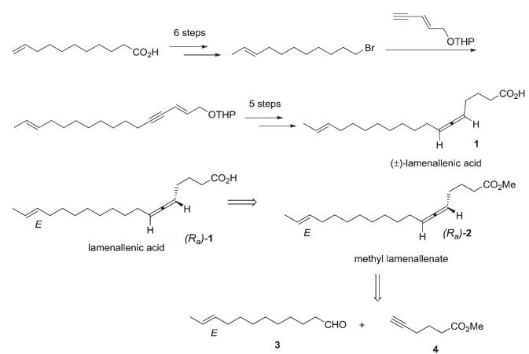

chemical

Reaction pathway diagram showing synthesis of methyl-lamenallenate from monomer to ester and final product

Scheme 1 Reported synthesis and our retrosynthetic analysis of lamenallenic acid.

a State Key Laboratory of Organometallic Chemistry, Shanghai Institute of Organic Chemistry, Chinese Academy of Sciences, 345 Lingling Lu, Shanghai 200032, P. R. China. E-mail: masm@sioc.ac.cn   
b Department of Chemistry, Fudan University, 220 Handan Lu, Shanghai 200433, P.R. China   
† Electronic supplementary information (ESI) available: 1 H, 13C NMR and HPLC spectra of all the products. See DOI: 10.1039/c6qo00785f

by comparing the specific rotation with (−)-laballenic acid of similar structure, which was previously determined to be $R _ { a }$ by the Landor group.3 Although the structure does not look too complicated, due to the lack of efficient methods for the highly stereoselective construction of the allene unit, in 1972, the Landor group finished the first total synthesis of racemic lamenallenic acid from 10-undecenoic acid and the THP-ether of 4-pentyn-2-enol in 12 steps.4 The allenic unit was synthesized by the reaction of 2,14-hexadecadien-4-yn-1-ol and LiAlH4. By adding cyclohexylidene-α-D-glucofuranose as the chiral source in this step, (−)-lamenallenic acid was obtained with a very low ee as judged by comparing the specific optical rotation of its (−)-methyl ester ([α] 20 = −5.8 (c = 5.6, EtOH)) to the reported data for methyl ester of the natural lamenallenoic acid ([α] 25 = −50 (c = 0.28, EtOH) at 589 nm).2 Thus, the known synthesis lacks efficiency and high stereoselectivity. Obviously, the challenges for synthesizing the naturally occurring lamenallenic acid are the highly stereoselective construction of the trans C–C double bond5 and the $R _ { a ^ { - } }$ axially chiral allene unit.6 According to the EATA reaction recently developed by our group,7 we reasoned that methyl lamenallenate $\left( R _ { a } \right) - 2$ may be synthesized from (E)-10-dodecenal 3 and methyl 5-hexynoate 4 (Scheme 1).

# Results and discussion

After some unsuccessful initial attempts to construct the CvC double bond with a high E/Z ratio involving compounds 6–16 (for details, see the ESI†), we observed that the reduction of 10-dodecynol THP ether 20, which was synthesized from 1-decyne 17 in 4 steps, with Li/NH3 (l)8 gave (E)-10-dodecenol THP ether 21 successfully in 98% yield with an E/Z ratio of 96/4 (Scheme 2). After deprotection, the trans dodec-10-enol 16 underwent an aerobic oxidation reaction using Fe $\left( \mathrm { N O } _ { 3 } \right) _ { 3 } { \cdot } 9 \mathrm { H } _ { 2 } \mathrm { O } /$ TEMPO/NaCl9,10 as catalysts to give trans 10-dodecynal 3.

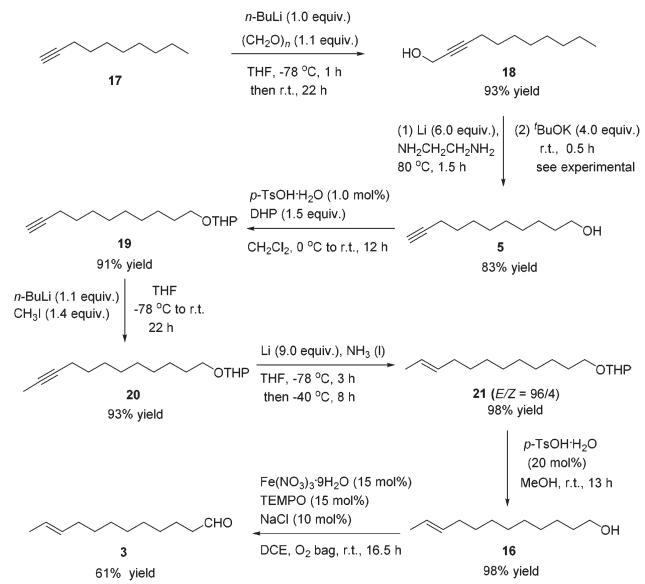

chemical

Multi-step organic synthesis reaction scheme showing intermediates 17, 18, 19, 20, 21, and 3 with yields and reagents labeled

Scheme 2 Synthetic route to (E)-10-dodecenal 3.

Methyl 5-hexynoate 4 was then synthesized from 1-pentyne 22 in 4 steps (Scheme 3): 5-hexyn-1-ol 24 was prepared from 1-pentyne 22 through a similar process for the preparation of alkynol 5 from 17, which was further oxidized to 5-hexynoic acid 25 by applying the $\mathrm { F e ( N O _ { 3 } ) _ { 3 } { \cdot } 9 H _ { 2 } O / T E M P O / K C l } .$ catalyzed aerobic oxidation reaction11 resulting in 86% yield with an $\mathbf { O } _ { 2 }$ bag and in 85% yield with an air bag. The esterification reaction with DCC, DMAP and MeOH in $\mathrm { C H } _ { 2 } \mathrm { C l } _ { 2 }$ afforded methyl 5-hexynoate 4 in 77% yield.

We then tested the EATA reaction of the terminal alkyne 4 with E-enal 3: the reaction under the reported conditions7 with 20 mol% of $\mathrm { C u B r } _ { 2 } ,$ 1.5 equiv. of alkyne 4, 1.5 equiv. of aldehyde 3 and 1.0 equiv. of (S)-diphenyl prolinol 26 in dioxane at 130 °C successfully afforded 47% yield of methyl lamenallenate (R )-2 with 93% ee. The yield and ee were almost not affected when reducing the amount of aldehyde from 1.5 to 1.1 (entries 1–3, Table 1). With 1.0 equiv. of aldehyde, the yield dropped to 45% (entry 4, Table 1). Increasing the amount of chiral amine (S)-26 to 1.5 equiv. or alkyne to 2.0 equiv. did not significantly improve the yield or ee (entries 5 and 6, Table 1).

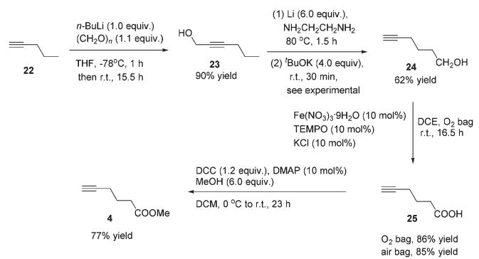

chemical

Organic synthesis reaction scheme showing multi-step transformation with yields and reagents for different intermediates

Scheme 3 The synthetic route to methyl 5-hexynoate 4.

Table 1 Optimization of EATA reactiona 

<table><tr><td>4 x equiv. + 3 y equiv.</td><td>+</td><td>CuBr2(20 mmol%) dioxane 130 °C, 12 h</td><td>→</td></tr></table>

<table><tr><td>Entry</td><td>X</td><td>y</td><td>z</td><td>R</td><td>Yield $^{b}$  of  $(R_a)-2$ (%)</td><td>ee(%)</td></tr><tr><td>1</td><td>1.5</td><td>1.5</td><td>1.0</td><td>Ph</td><td>52 (47)</td><td>93</td></tr><tr><td>2</td><td>1.5</td><td>1.2</td><td>1.0</td><td>Ph</td><td>50 (48)</td><td>92</td></tr><tr><td>3</td><td>1.5</td><td>1.1</td><td>1.0</td><td>Ph</td><td>50 (48)</td><td>92</td></tr><tr><td>4</td><td>1.5</td><td>1.0</td><td>1.0</td><td>Ph</td><td>48 (45)</td><td>92</td></tr><tr><td>5</td><td>1.5</td><td>1.0</td><td>1.5</td><td>Ph</td><td>48 (48)</td><td>91</td></tr><tr><td>6</td><td>2.0</td><td>1.1</td><td>1.0</td><td>Ph</td><td>51 (48)</td><td>93</td></tr><tr><td>7</td><td>1.5</td><td>1.5</td><td>1.0</td><td>Me</td><td>59 (59)</td><td>97</td></tr><tr><td>8</td><td>1.5</td><td>1.1</td><td>1.0</td><td>Me</td><td>57 (56)</td><td>97</td></tr><tr><td>9</td><td>1.2</td><td>1.1</td><td>1.0</td><td>Me</td><td>55 (54)</td><td>97</td></tr><tr><td>10</td><td>1.1</td><td>1.1</td><td>1.0</td><td>Me</td><td>55 (55)</td><td>96</td></tr></table>

a The reaction was conducted on the 0.1 mmol scale with 0.02 mmol of CuBr2, x equiv. of 4, y equiv. of 3 and z equiv. of chiral amine in 0.8 mL of dioxane at 130 $\mathrm { { \bar { \circ } } _ { C } }$ in a sealed tube for 12 h. b NMR yield. Isolated yield is given in parentheses.

However, changing the chiral amino alcohol from (S)-diphenyl prolinol (S)-26 to (S)-dimethyl prolinol (S)-27 increased the yield to 59% and ee to 97% (entry 7, Table 1). The ee remained high when reducing both terminal alkyne 4 and aldehyde 3 to 1.1 equiv. (entries 8–10, Table 1).

By applying 20 mol% of CuBr , 1.1 equiv. of alkyne 4, 1.1 equiv. of aldehyde 3 and 1.0 equiv. of (S)-dimethyl prolinol (S)- 27 in dioxane at 130 °C as the standard conditions, the reaction on the 1.16 mmol scale afforded methyl lamenallenate $\scriptstyle ( R _ { a } ) - ( - ) - 2$ in 50% yield with 97% ee $( [ \alpha ] _ { \mathrm { D } } ^ { 2 9 . 3 } = - 5 2 . 8 \ ( c = 0 . 3 0 5$ , EtOH)) $\left( \mathrm { l i t : } ^ { 2 } ~ [ \alpha ] _ { \mathrm { D } } ^ { 2 5 } \mathrm { - } 5 0 ~ \left( c = 0 . 2 8 , \mathrm { E t O H } \right) \right)$ (Scheme 4). KOH was used in MeOH at 60 °C to execute the hydrolysis to produce (−)-lamenallenic acid (Ra)-(−)-1 in 98% yield $( [ \alpha ] _ { \mathrm { D } } ^ { 2 9 . 4 } \ = \ - 5 5 . 2$ (c = 0.995, EtOH), E/Z = 94/6). For determination of ee of the synthesized (−)-lamenallenic acid, the prepared acid was subjected to a methylation reaction to reproduce (−)-methyl lamenallenate (R )-(−)-2 with 97% ee. Thus, the synthesis of (−)-lamenallenic acid with 97% ee was accomplished.

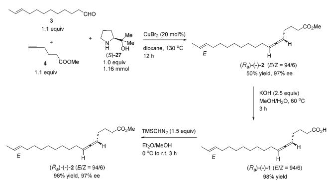

chemical

Organic synthesis reaction scheme showing conversion of alkyne derivatives to enone products with yields and conditions

Scheme 4 Synthesis of (−)-lamenallenic acid.

# Conclusions

In conclusion, we finished the highly enantioselective total synthesis of (−)-lamenallenic acid with high optical purity in 9 steps from 1-decyne and 1-pentyne. By applying (S)-dimethyl prolinol as the chiral source, the EATA reaction of (E)-10- dodecenal and methyl 5-hexynoate, which were prepared from two simple terminal alkynes by routine chemical transformations and iron-catalyzed aerobic oxidation reactions developed by our group, was accomplished with high ee. This has nicely demonstrated the direct tolerance of functional groups such as the CvC bond and carboxylate. Based on our previous report,7 the reaction of a terminal alkyne with an aldehyde in the presence of (S)-prolinol leads to $\left( R _ { a } \right)$ -allene; thus, we confirmed the absolute configuration of the allene moiety in natural lamenallenic acid. Compared to the known synthesis, the current synthesis enjoys a high efficiency and high enantioselectivity. Further studies are being pursued in this laboratory.

# Experimental

# General information

1 H and $^ { 1 3 } \mathrm { C }$ nuclear magnetic resonance spectra were recorded with an instrument operated at 400 MHz for 1 H NMR and 100 MHz for $^ { 1 3 } \mathrm { C }$ NMR spectra. THF and dioxane were dried over sodium wire and distilled freshly before use. DCE was used directly without further treatment unless mentioned otherwise. (S)-Dimethyl prolinol $\left( S \right) - 2 7 ^ { 1 2 }$ was synthesized by following the reported procedure. Other reagents were used as received without further treatment.

CAUTION: Oxygen in use with combination with organic solvents; remove all ignition sources including sources of sparks, static, or flames since oxygen increases the intensity of any fire. Inhalation of pure oxygen should be avoided as well.

# Experimental details and analytical data

2-Undecyn-1-ol (18).13

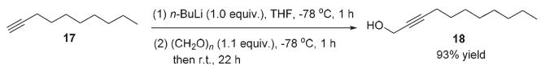

chemical

Chemical reaction scheme showing conversion of compound 17 to compound 18 with yields and conditions

To a 250 mL flame-dried three-necked flask were added 17 (11.6421 g, 95% purity, 80 mmol) and anhydrous THF (80 mL). A solution of n-BuLi (2.5 M in hexane, 32.0 mL, 80 mmol) was added dropwise at −78 °C under an Ar atmosphere in 25 min. After 1 h, paraformaldehyde (2.6426 g, 88 mmol) was added into the flask and the resulting mixture was stirred at −78 °C for 1 h. The reaction was then allowed to warm to room temperature naturally and stirred for 22 h. A saturated NH Cl aqueous solution (40 mL) was added to quench the reaction. $\mathrm { E t } _ { 2 } \mathrm { O }$ (200 mL) and $_ { \mathrm { H } _ { 2 } \mathrm { O } }$ (100 mL) were added. The organic layer was separated and the aqueous phase was extracted by ethyl ether (60 × 3 mL). The combined organic layer was washed with brine and dried over anhydrous ${ \mathrm { N a } } _ { 2 } { \mathrm { S O } } _ { 4 } .$ . After filtration and evaporation, the residue was purified by chromatography on silica gel (eluent: petroleum ether/ethyl acetate = 20/1 to 5/1) to afford $\mathbf { 1 8 } ^ { 1 3 }$ (12.5673 g, 93%) as an oil: 1 H NMR (400 MHz, CDCl3) δ 4.28–4.22 (m, 2 H, OCH2), 2.21 (tt, J1 = 7.0 Hz, J2 = 2.1 Hz, 2 H, CuCCH2), 1.87 (brs, 1 H, OH), 1.51 (quint, J = 7.2 Hz, 2 H, CH2), 1.42–1.20 (m, 10 H, 5 × CH2), 0.88 (t, J = 6.8 Hz, 3 H); 13C NMR (100 MHz, CDCl3) δ 86.6, 76.7, 51.3, 31.8, 29.14, 29.06, 28.8, 28.6, 22.6, 18.7, 14.0; IR (neat) ν $( \mathrm { c m } ^ { - 1 } )$ 3336, 2925, 2855, 2289, 2226, 1462, 1376, 1228, 1137, 1012; MS (ESI) m/z (%): 191 ((M + Na)+ ).

10-Undecyn-1-ol (5).14

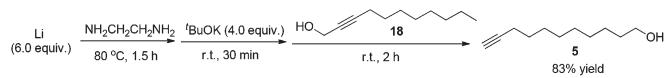

chemical

Organic synthesis reaction scheme showing conversion of Li (6.0 equiv.) to alcohol using a tBuOK reagent at room temperature and 18% yield

To a 250 mL three-necked flask were added a Li rod (2.0820 g, 300.0 mmol) and $\mathrm { N H _ { 2 } C H _ { 2 } C H _ { 2 } N H _ { 2 } }$ (200 mL) under an Ar atmosphere. The resulting mixture was stirred for 1.5 h at 80 $^ \circ \mathrm { C }$ with a preheated oil bath. After being cooled to room temperature naturally, t BuOK (22.4435 g, 200.0 mmol) was added and the mixture was stirred for 30 min at room temperature. 18 (8.4130 g, 50.0 mmol) was added dropwise within 5 min. After being stirred at room temperature for 2 h, the reaction mixture was poured into a 1 L beaker containing a mixture of ice and water (200 mL). Et O (300 mL) was added to separate the organic layer and the aqueous phase was extracted with ethyl ether (100 × 3 mL). The combined organic layer was washed sequentially with 1 M aqueous HCl (80 mL), a saturated $\mathrm { N a H C O } _ { 3 }$ aqueous solution (80 mL), and brine. After being dried over anhydrous $\mathrm { N a } _ { 2 } \mathrm { S O } _ { 4 } ,$ the mixture was filtered and evaporated. The residue was purified by chromatography on silica gel (eluent: petroleum ether/ethyl acetate = 9/1 to 3/1) to afford $5 ^ { 1 5 }$ (7.0109 g, 83%) as an oil: 1 H NMR (400 MHz, CDCl3) δ 3.63 (t, J = 6.6 Hz, 2 H, OCH2), 2.18 (td, J1 = 7.1 Hz, J2 = 2.8 Hz, 2 H, CuCCH2), 1.94 (t, J = 2.6 Hz, 1 H, CuCH), 1.70–1.48 (m, 5 H, OH + 2 × CH ), 1.44–1.22 (m, 10 H, 5 × CH2); 13C NMR (100 MHz, CDCl3) δ 84.7, 68.0, 62.9, 32.7, 29.4, 29.3, 29.0, 28.6, 28.4, 25.6, 18.3; IR (neat) ν (cm−1 ) 3308, 2928, 2856, 2116, 1462, 1055; MS (ESI) m/z (%): 169 (M + H)+ .

2-(10-Undecynyloxy)tetrahydro-2H-pyran (19).16

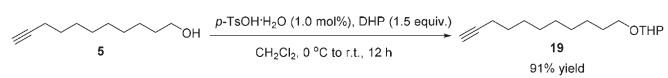

chemical

Organic synthesis reaction converting compound 5 to compound 19 with 91% yield, using p-TsOH·H2O and DHP reagents

To a 100 mL Schlenk flask were added 5 (1.6815 g, 10.0 mmol) and CH Cl (20 mL). p-TsOH·H O (19.0 mg, 0.1 mmol) and DHP (1.37 mL, $d = 0 . 9 2 2 \mathrm { ~ g ~ m L } ^ { - 1 }$ , 1.2618 g, 15.0 mmol) were added at 0 $^ \circ \mathrm { C } .$ Then, the resulting mixture was allowed to warm up to room temperature and stirred for 12 h. A saturated NaHCO aqueous solution (5 mL) was added to quench the reaction. $\mathrm { E t } _ { 2 } \mathrm { O }$ (50 mL) and $_ { \mathrm { H } _ { 2 } \mathrm { O } }$ (50 mL) were added. The organic phase was separated and the aqueous phase was extracted with ethyl ether (25 × 3 mL). The combined organic layer was washed with brine and dried over anhydrous ${ \mathrm { N a } } _ { 2 } { \mathrm { S O } } _ { 4 } .$ . After filtration and evaporation, the residue was purified by chromatography on silica gel (eluent: petroleum ether/ethyl ether = 100/1 to 50/1) to afford ${ \bf 1 9 } ^ { 1 6 }$ (2.2915 g, 91%) as an oil: 1 H NMR (400 MHz, CDCl3) δ 4.60–4.55 (m, 1 H, CH of the THP group), 3.91–3.83 (m, 1 H, one proton of the THP group),

3.77–3.69 (dt, J = 9.6 Hz, $J _ { 2 } ~ = ~ 7 . 0$ Hz, 1 H, one proton of OCH2), 3.54–3.46 (m, 1 H, one proton of the THP group), $3 . 4 2 \substack { - 3 . 3 4 }$ (dt, $J _ { 1 } ~ = ~ 9 . 6$ Hz, $J _ { 2 } ~ = ~ 6 . 8$ Hz, 1 H, one proton of OCH ), 2.18 $\left( \mathrm { t d } , J _ { 1 } = 7 . 1 \right.$ Hz, J = 2.8 Hz, $2 \ \mathrm { H } , \ \mathrm { C } { \equiv } \mathrm { C C H } _ { 2 } ) ,$ 1.94 $\left( \mathrm { t } , J = 2 . 6 \right.$ Hz, 1 H, CuCH), 1.89–1.78 (m, 1 H, one proton of the THP group), 1.76–1.67 (m, 1 H, one proton of the THP group), 1.64–1.47 (m, 8 H, four protons of the THP group + $2 \times \mathrm { C H } _ { 2 } )$ , 1.44–1.24 (m, 10 H, ${ \mathrm { 5 ~ } } \times { \mathrm { C H } } _ { 2 } { \mathrm { ) } } ;$ 13C NMR (100 MHz, $\mathrm { C D C l } _ { 3 } )$ δ 98.8, 84.7, 68.0, 67.6, 62.3, 30.7, 29.7, 29.4, 29.0, 28.7, 28.4, 26.1, 25.4, 19.6, 18.3; IR (neat) ν $( \mathrm { c m } ^ { - 1 } )$ 3310, 2930, 2856, 2117, 1460, 1350, 1260, 1202, 1121, 1076, 1029; MS (EI) m/z (%): 252 (M+ , 0.27), 85 (100).

2-(10-Dodecynyloxy)tetrahydro-2H-pyran (20).8

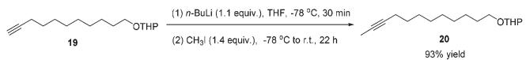

chemical

Chemical reaction scheme showing conversion of compound 19 to compound 20 using n-BuLi and CH3 under specified conditions

To a 250 mL flame-dried three-neck flask were added 19 (2.0210 g, 8.0 mmol) and anhydrous THF (25 mL) under an Ar atmosphere. A solution of n-BuLi (2.5 M in hexanes, 3.52 mL, 8.8 mmol) was added dropwise at $- 7 8 \ ^ { \circ } \mathrm { C }$ in 5 min. After 30 min, a solution of $\mathrm { C H } _ { 3 } \mathrm { I }$ (0.69 mL, $d = 2 . 3 \ \mathrm { g \ m L ^ { - 1 } }$ , 1.5897 g, 11.2 mmol) in anhydrous THF (20 mL) was added dropwise within 10 min $\mathrm { a t - } 7 8 \ ^ { \circ } \mathrm { C } .$ . The resulting mixture was allowed to warm up to room temperature naturally and stirred for 22 h. A saturated $\mathrm { N H _ { 4 } C l }$ aqueous solution (30 mL) was added to quench the reaction. $\mathrm { E t } _ { 2 } \mathrm { O }$ (200 mL) and $_ { \mathrm { H } _ { 2 } \mathrm { O } }$ (100 mL) were added. The organic layer was separated and the aqueous phase was extracted by ethyl ether (50 × 3 mL). The combined organic layer was washed with brine and dried over anhydrous ${ \mathrm { N a } } _ { 2 } { \mathrm { S O } } _ { 4 } .$ After filtration and evaporation, the residue was purified by chromatography on silica gel (eluent: petroleum ether/ ethyl ether = 30/1) to afford $2 { \bf 0 } ^ { 8 }$ (1.9848 g, 93%) as an oil: 1 H NMR (400 MHz, CDCl3) δ 4.61–4.54 (m, 1 H, CH of the THP group), 3.92–3.82 (m, 1 H, one proton of the THP group), 3.73 (dt, $J _ { 1 } ~ = ~ 9 . 6$ Hz, $J _ { 2 } ~ = ~ 6 . 9$ Hz, 1 H, one proton of $\mathrm { O C H } _ { 2 } ) ;$ , 3.55–3.45 (m, 1 H, one proton of the THP group), 3.38 $\textstyle ( \mathrm { d t } , J _ { 1 } =$ 9.6 Hz, $J _ { 2 } = 6 . 7$ Hz, 1 H, one proton of OCH2), 2.14–2.07 (m, 2 H, CH2), 1.88–1.80 (m, 1 H, one proton of the THP group), 1.78 (t, J = 2.4 Hz, 3 H, CH3), 1.76–1.67 (m, 1 H, one proton of the THP group), 1.64–1.42 (m, 8 H, four protons of the THP group ${ \bf { + } } { \bf { \nabla } } 2 { \bf { \times } } { \bf { \nabla C H } } _ { 2 } )$ , 1.41–1.22 (m, 10 H, 5 × CH ); 13C NMR (100 MHz, CDCl3) δ 98.8, 79.3, 75.2, 67.6, 62.3, 30.7, 29.7, 29.41, 29.38, 29.1, 29.0, 28.8, 26.2, 25.5, 19.6, 18.7, 3.4; IR (neat) ν $\cdot ( \mathrm { c m } ^ { - 1 } )$ 2928, 2856, 1460, 1350, 1260, 1202, 1122, 1076, 1031; MS (EI) m/z (%): 266 (M+ , 0.94), 85 (100).

(E)-2-(10-Dodecenyloxy)tetrahydro-2H-pyran (21).

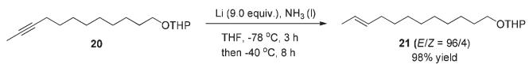

chemical

Chemical reaction scheme showing conversion of compound 20 to 21 using Li and NH3 under specified conditions

To a 500 mL three-necked flask was introduced $\mathrm { N H } _ { 3 }$ gas at $- 7 8 \mathrm { ~  ~ { ~ } ~ } ^ { \circ } \mathrm { C }$ to collect ∼150 mL of liquid NH3. 20 (4.5080 g, 17 mmol), THF (85 mL) and a Li rod (1.0178 g, 153 mmol) were added sequentially at −78 °C. After stirring at −78 °C for 3 h, the resulting mixture was then warmed $\mathrm { t o ~ - } 4 0 ~ ^ { \circ } \mathrm { C }$ and stirred for 8 h until the completion of the reaction as monitored by TLC. A saturated $\mathrm { N H _ { 4 } C l }$ aqueous solution (40 mL) was added to quench the reaction. The flask was opened to air overnight to allow the $\mathrm { { N H } } _ { 3 } \ ( \mathrm { { l } ) }$ to evaporate. $\mathrm { E t } _ { 2 } \mathrm { O }$ (40 mL) and $_ { \mathrm { H } _ { 2 } \mathrm { O } }$ (20 mL) were added and the organic layer was separated. The aqueous phase was extracted by ethyl ether (30 × 3 mL). The combined organic layer was washed with brine and dried over anhydrous $\mathbf { M g S O _ { 4 } } .$ After filtration and evaporation, the residue was purified by chromatography on silica gel (eluent: petroleum ether/ethyl ether = 50/1) to afford $2 \mathbf { 1 } ^ { 1 7 } \mathbf { \ : } \left( E / Z = 9 6 / 4 \right)$ (4.4510 g, 98%) as an oil: 1 H NMR (400 MHz, CDCl3) δ 5.47–5.35 (m, 2 H, CHvCH), 4.59–4.56 (m, 1 H, CH of the THP group), 3.91–3.83 (m, 1 H, one proton of the THP group), 3.73 (dt, J1 = 10.0 Hz, J2 = 7.0 Hz, 1 H, one proton of $\mathrm { O C H } _ { 2 } ) ;$ , 3.53–3.46 (m, 1 H, one proton of the THP group), 3.38 (dt, $J _ { 1 } =$ 9.6 Hz, $J _ { 2 } ~ = ~ 6 . 7$ Hz, 1 H, one proton of the THP group), 2.00–1.91 (m, 2 H, CH ), 1.88–1.78 (m, 1 H, one proton of the THP group), 1.76–1.68 (m, 1 H, one proton of the THP group), 1.66–1.62 (m, 3 H, CH ), 1.62–1.46 (m, 6 H, four protons of the THP group + CH ), 1.40–1.21 (m, 12 H, $6 \times \mathrm { C H } _ { 2 } ) ; \ ^ { 1 3 } \mathrm { C }$ NMR (100 MHz, CDCl3) δ 131.6, 124.5, 98.8, 67.6, 62.3, 32.6, 30.8, 29.7, 29.6, 29.5, 29.44, 29.43, 29.1, 26.2, 25.5, 19.7, 17.9; IR (neat) $\nu \ \mathrm { ( c m ^ { - 1 } ) }$ 2925, 2854, 1458, 1321, 1260, 1202, 1122, 1077, 1030; MS (EI) m/z (%): 268 (M+ , 0.33), 85 (100). The following signals are discernible for 21 (Z): 1 H NMR (400 MHz, CDCl3) δ 2.07–2.00 (m, 2 H, CH2).

(E)-10-Dodecen-1-ol (16).

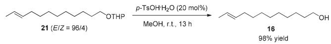

chemical

Chemical reaction equation showing conversion of compound 21 to compound 16 with 98% yield and p-TsOH·H₂O reagent

To a 100 mL round bottom flask were added 21 (4.2570 g, 16.0 mmol), $p { \mathrm { - } } \mathrm { T s O H } { \cdot } \mathrm { H } _ { 2 } \mathrm { O }$ (603.7 mg, 3.2 mmol), and MeOH (32 mL). The reaction was stirred for 13 h until the completion of the reaction as monitored by TLC. A saturated $\mathrm { N a H C O } _ { 3 }$ aqueous solution (40 mL) was added to quench the reaction. After filtration, MeOH was removed by evaporation. $\mathrm { E t } _ { 2 } \mathrm { O }$ (40 mL) and $_ { \mathrm { H } _ { 2 } \mathrm { O } }$ (20 mL) were added and the organic layer was separated. The aqueous phase was extracted by ethyl ether (30 × 3 mL). The combined organic layer was washed with brine (30 mL) and dried over anhydrous $\mathbf { M g S O _ { 4 } } .$ . After filtration and evaporation, the residue was purified by chromatography on silica gel (eluent: petroleum ether/ethyl acetate = 5/1 to 2/1) to afford $\mathbf { 1 6 } ^ { 8 }$ (2.8620 g, 98%) as an oil: 1 H NMR (400 MHz, CDCl ) δ 5.47–5.35 (m, 2 H, CHvCH), 3.62 (t, J = 6.6 Hz, 2 H, OCH2), 1.99–1.92 (m, 2 H, CH2), 1.80 (brs, 1 H, OH), 1.64 (dd, $J _ { 1 } = 3 . 6$ Hz, J2 = 1.2 Hz, 3 H, CH3), 1.56 (quint, J = 7.0 Hz, 2 H, CH2), 1.39–1.20 (m, 12 H, $6 ~ \times ~ \mathrm { C H } _ { 2 } ) ; ~ ^ { 1 3 } \mathrm { C }$ NMR (100 MHz, CDCl ) δ 131.6, 124.5, 62.9, 32.7, 32.5, 29.55, 29.53, 29.41, 29.38, 29.1, 25.7, 17.9; IR (neat) $\nu \ \left( \mathrm { c m } ^ { - 1 } \right)$ 3364, 2924, 2854, 1459, 1377, 1056; MS (EI) m/z (%): 184 (M+ , 0.54), 55 (100).

(E)-10-Dodecenal (3).9

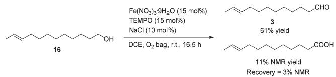

chemical

Organic synthesis reaction scheme showing conversion of compound 16 to compounds 3 and 4 using Fe(NO₃)₃·9H₂O and TEMPO under specified conditions

To a 50 mL Schlenk flask were added $\mathrm { F e } ( \mathrm { N O } _ { 3 } ) _ { 3 } { \cdot } 9 \mathrm { H } _ { 2 } \mathrm { O }$ (145.6 mg, 0.36 mmol), TEMPO (56.5 mg, 0.36 mmol), NaCl (14.1 mg, 0.24 mmol), 16 (442.5 mg, 2.4 mmol), and DCE (9.6 mL) sequentially under the atmosphere of oxygen from a gas bag. The reaction was then carried out at room temperature for 16.5 h. The crude reaction mixture was filtered through a short column of silica gel eluted with ethyl ether (3 × 40 mL). After evaporation, the residue was purified by chromatography on silica gel (eluent: petroleum ether/ethyl acetate = 30/1) to afford $3 ^ { 1 8 }$ (267.2 mg, 61%) as an oil: 1 H NMR (400 MHz, CDCl ) δ 9.76 (t, J = 1.8 Hz, 1 H, CHO), 5.47–5.35 (m, 2 H, CHvCH), 2.42 (td, J1 = 7.4 Hz, J2 = 2.0 Hz, 2 H, CH2), 1.99–1.90 (m, 2 H, CHvCHCH2), 1.68–1.58 (m, 5 H, $\mathrm { C H } _ { 3 } \ +$ CH2), 1.38–1.21 (m, 10 H, ${ 5 ~ \times ~ \mathrm { C H } _ { 2 } ) ; \ ^ { 1 3 } \mathrm { C } }$ NMR (100 MHz, CDCl3) δ 203.0, 131.5, 124.6, 43.9, 32.5, 29.5, 29.3, 29.2, 29.1, 29.0, 22.0, 17.9; IR (neat) $\nu \ \left( \mathrm { c m } ^ { - 1 } \right)$ 2925, 2854, 2715, 1727, 1455, 1411, 1013; MS (EI) m/z (%): 182 (M+ , 0.67), 55 (100).

2-Hexyn-1-ol (23).

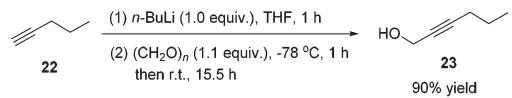

chemical

Chemical reaction scheme showing conversion of compound 22 to compound 23 with yields and conditions

Compound 23 was prepared following the same procedure as preparation of compound 18. The reaction of 22 (3.9134 $^ { \mathrm { g } , }$ 98% purity, 56.3 mmol), n-BuLi (2.5 M in hexanes, 22.5 mL, 56.3 mmol), and paraformaldehyde (1.9583 g, 95% purity, 61.9 mmol) in anhydrous THF (56 mL) afforded $2 3 ^ { 1 9 }$ (4.9558 g, 90%) as an oil: 1 H NMR (400 MHz, CDCl3) δ 4.29–4.23 (m, 2 H, OCH2), 2.20 (tt, J1 = 7.2 Hz, $J _ { 2 } ~ = ~ 2 . 2$ Hz, 2 H, CuCCH2), 1.56–1.49 (m, 3 H, CH2 + OH), 0.98 (t, J = 7.4 Hz, 3 H, CH3); $^ { 1 3 } \mathrm { C }$ NMR (100 MHz, CDCl3) δ 86.2, 78.4, 51.1, 21.9, 20.6, 13.4; IR (neat) $\nu \ \mathrm { ( c m ^ { - 1 } ) }$ 3329, 2963, 2935, 2872, 2289, 2227, 1457, 1431, 1380, 1338, 1136, 1032, 1003; MS (ESI) m/z (%): 98 (M+ , 15.61), 83 (100).

5-Hexyn-1-ol (24).

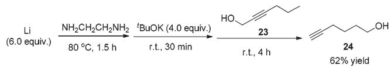

chemical

Organic synthesis reaction scheme showing lithium-catalyzed coupling with tert-butyl alcohol and alcohol products

Compound 24 was prepared following the same procedure as preparation of compound 5. The reaction of the Li rod (417.3 mg, 60.0 mmol), t BuOK (4.4892 g, 40.0 mmol), and 23 (981.7 mg, 10.0 mmol) in $\mathrm { N H _ { 2 } C H _ { 2 } C H _ { 2 } N H _ { 2 } }$ (40 mL) afforded $2 4 ^ { 2 0 }$ (608.8 mg, 62%) as an oil: 1 H NMR (400 MHz, CDCl ) δ 3.68 (t, J = 6.4 Hz, 2 H, OCH2), 2.24 (td, J1 = 6.8 Hz, $J _ { 2 } = { }$ 2.8 Hz, 2 $\mathrm { H } , { \equiv } \mathrm { C C H } _ { 2 } ) ,$ , 1.97 (t, J = 2.6 Hz, 1 H, uCH), 1.74–1.51 (m, 5 H, 2 × CH2 + OH); 13C NMR (100 MHz, CDCl3) δ 84.2, 68.5, 62.0, 31.5, 24.6, 18.1; IR (neat) ν (cm−1 ) 3295, 2941, 2868, 2116, 1455, 1434, 1329, 1260, 1161, 1060, 1039; MS (ESI) m/z (%): 98 (M+ , 4.42), 79 (100).

5-Hexynoic acid (25).13

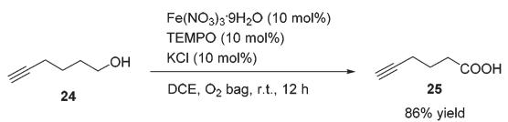

chemical

Chemical reaction scheme converting compound 24 to compound 25 with 86% yield, using Fe(NO3)3·9H2O and TEMPO/ KCl in DCE/O2 bag.

To a Schlenk tube were added $\mathrm { F e } ( \mathrm { N O } _ { 3 } ) _ { 3 } { \cdot } 9 \mathrm { H } _ { 2 } \mathrm { O }$ (40.6 mg, 0.1 mmol), TEMPO (15.7 mg, 0.1 mmol), KCl (7.7 mg, 0.1 mmol), 24 (97.8 mg, 1.0 mmol), and DCE (4.0 mL) sequentially under the atmosphere of oxygen from a gas bag. The reaction was then carried out at room temperature for 12 h until the completion of the reaction as monitored by TLC (petroleum ether/ethyl acetate = 5/1). The crude reaction mixture was filtered through a short column of silica gel eluted with ethyl ether (3 × 25 mL). After evaporation, the residue was purified by chromatography on silica gel (eluent: petroleum ether/ethyl acetate = 6/1 to 2/1) to afford $2 5 ^ { 2 1 }$ (95.9 mg, 86%) as an oil: 1 H NMR (400 MHz, CDCl3) δ 10.34 (brs, COOH), 2.52 (t, J = 7.4 Hz, 2 H, CH2), 2.29 (td, J1 = 7.0 Hz, J = 2.8 Hz, 2 H, uCCH ), 2.00 (t, J = 2.8 Hz, 1 H, CuCH), 1.86 (quint, J = 7.2 Hz, 2 H, CH2); $^ { 1 3 } \mathrm { C }$ NMR (100 MHz, CDCl3) δ 179.7, 83.0, 69.3, 32.5, 23.2, 17.7; IR (neat) ν $( \mathrm { c m } ^ { - 1 } )$ ) 3400–2800, 3297, 2118, 1703, 1413, 1242, 1205, 1156, 1052; MS (ESI) m/z (%): 112 (M+ , 1.68), 70 (100).

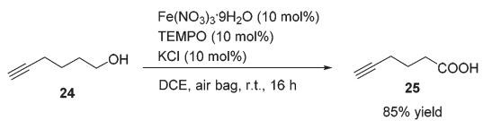

chemical

Chemical reaction scheme converting compound 24 to compound 25 with 85% yield, using Fe(NO3)3·9H2O and TEMPO reagents

To a 100 mL round bottom flask were added $\mathrm { F e } ( \mathrm { N O } _ { 3 } ) _ { 3 } { \cdot } 9 \mathrm { H } _ { 2 } \mathrm { O }$ (40.5 mg, 0.1 mmol) and DCE (3.0 mL). TEMPO (15.8 mg, 0.1 mmol), KCl (7.4 mg, 0.1 mmol), 24 (97.5 mg, 1.0 mmol), and DCE (1.0 mL) were then added sequentially. The flask was connected to a gas bag of air with a valve. The reaction was then carried out at room temperature for 16 h until the completion of the reaction as monitored by TLC (petroleum ether/ ethyl acetate = 5/1). The crude reaction mixture was filtered through a short column of silica gel eluted with ethyl ether (3 × 25 mL). After evaporation, the residue was purified by chromatography on silica gel (eluent: petroleum ether/ethyl acetate = 6/1 to 2/1) to afford $2 5 ^ { 2 1 }$ (94.6 mg, 85%) as an oil: 1 H NMR (400 MHz, CDCl3) δ 10.41 (brs, 1 H, COOH), 2.52 $\mathrm { ( t , ~ } J = 7 . 4 ~ \mathrm { H z , ~ }$ 2 H, CH2), 2.29 (td, J1 = 6.9 Hz, J2 = 2.7 Hz, 2 H, CH2), 2.00 (t, J = 2.6 Hz, 1 H, uCH), 1.86 (quint, J = 7.2 Hz, 2 H, CH ); 13C NMR (100 MHz, CDCl3) δ 179.7, 83.0, 69.3, 32.6, 23.2, 17.7.

Methyl 5-hexynoate (4).

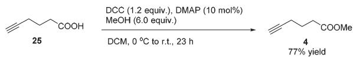

chemical

Organic synthesis reaction scheme showing conversion of compound 25 to compound 4 using DCC, DMAP, and MeOH reagents under specified conditions

To a round bottom flask were added 25 (1.1163 g, 10.0 mmol)/ DCM (5 mL) and DMAP (122.2 mg) sequentially. MeOH (2.43 mL, 0.791 $\mathrm { g \ m L ^ { - 1 } }$ , 1.9224 g, 60.0 mmol)/DCM (5 mL), DCC (2.4800 g, 12.0 mmol), and DCM (10 mL) were added sequentially at ${ \bf 0 } ^ { \mathrm { ~ \tiny ~ \circ ~ } } { \bf C } .$ . The resulting mixture was then allowed to warm up to room temperature and stirred for 23 h. The crude reaction mixture was filtered through a short column of silica gel eluted with DCM (3 × 10 mL) and evaporated. H O (20 mL) and $\mathrm { E t } _ { 2 } \mathrm { O }$ (20 mL) were added and the organic layer was separated. The aqueous phase was extracted by ethyl ether (20 × 3 mL). The combined organic layer was washed with brine and dried over anhydrous $\mathbf { M g S O _ { 4 } } .$ . After filtration and evaporation, the residue was purified via chromatography on silica gel (eluent: petroleum ether/ethyl ether = 25/1) to afford $4 ^ { 2 2 }$ (967.0 mg, 77%) as an oil: 1 H NMR (400 MHz, CDCl3) δ 3.69 (s, 3H, OCH3), 2.47 (t, J = 7.4 Hz, 2 H, CH2), 2.27 $\textstyle ( \operatorname { t d } , J _ { 1 } =$ 6.9 Hz, J2 = 2.7 Hz, 2 H, CH2), 1.98 (t, J = 2.8 Hz, $1 \ \mathrm { H } , { \equiv } \mathrm { C H } )$ , 1.86 (quint, J = 7.2 Hz, 2 H, $\mathrm { C H } _ { 2 } \mathbf { ) } ;$ 1 H NMR (400 MHz, CDCl3) δ 173.5, 83.2, 69.1, 51.6, 32.6, 23.5, 17.8; IR (neat) $\nu \ \left( \mathrm { c m } ^ { - 1 } \right)$ 3295, 2954, 2118, 1736, 1438, 1370, 1318, 1223, 1161, 1058; MS (ESI) m/z (%): 126 (M+ , 25.52), 82 (100).

Methyl $( R , E ) \cdot 5 , 6 ,$ 16-octadecatrienoate $( ( R _ { a } ) – ( - ) – 2 ) . ^ { 7 }$

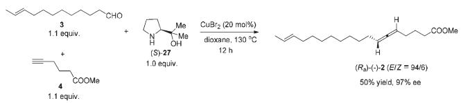

chemical

Organic synthesis reaction scheme showing conversion of alkyne 3 and acetyl 4 to chiral product (S)-27 and then to (R₅)-(1-)-2 under CuBr₂ catalysis

To a flame dried Schlenk tube were added $\mathrm { C u B r } _ { 2 }$ (51.6 mg, 0.23 mmol), $\left( S \right) - 2 7 ^ { 1 2 }$ (150.1 mg, 1.16 mmol), 4 (161.6 mg, 1.28 mmol)/dioxane (4.6 mL), and 3 (233.3 mg, 1.28 mmol)/ dioxane (4.6 mL) sequentially. The Schlenk tube was then sealed with a screw cap of polytetrafluoroethylene. The resulting mixture was then stirred at $1 3 0 ~ ^ { \circ } \mathrm { C }$ with a preheated oil bath. After 12 h, the reaction was complete as monitored by TLC (petroleum ether/ethyl acetate = 5/1) and the resulting mixture was diluted with 30 mL of $\mathrm { E t } _ { 2 } \mathrm { O }$ and washed with an aqueous solution of hydrochloric acid (3 M, 20 mL). The organic layer was separated and the aqueous phase was extracted with ethyl ether $\left( 2 0 \times 2 ~ \mathrm { m L } \right)$ . The combined organic layer was washed with brine and dried over anhydrous ${ \mathrm { N a } } _ { 2 } { \mathrm { S O } } _ { 4 } .$ After filtration and evaporation, the residue was purified by chromatography on silica gel (eluent: petroleum ether/ethyl ether = 200/1) to afford $( R _ { a } ) – ( - ) – 2 ^ { 2 , 4 }$ (E/Z = 94/6) (168.3 mg, 50%) as an oil: 97% ee (HPLC conditions: CHIRALPAK AD-RH (0.46 × 15 cm, 5 μm), $\mathrm { M e C N / H _ { 2 } O } = 6 2 / 3 8 ,$ 0.7 mL $\operatorname* { m i n } ^ { - 1 } , \lambda =$ 214 nm, $t _ { \mathrm { R } } ( \mathrm { m a j o r } ) = 4 8 . 9$ min, tR(minor) = 60.2 min); $[ \alpha ] _ { \mathrm { D } } ^ { 2 9 . 3 } =$ −52.8 (c = 0.305, EtOH) (lit:2 [α] 25D = −50 (c = 0.28, EtOH)); 1 H NMR (400 MHz, CDCl3) δ 5.47–5.35 (m, 2 H, CHvCH), 5.13–5.00 (m, 2 H, CHvCvCH), 3.67 (s, 3 H, CH3), 2.36 (t, J = 7.4 Hz, 2 H, CH2), 2.06–1.92 (m, 6 H, 3 × CH2), 1.74 (quint, J = 7.4 Hz, 2 H, CH2), 1.66–1.62 (m, 3 H, CH3), 1.43–1.22 (m, 12 H, $6 \times \mathrm { C H } _ { 2 } ) ; \ ^ { 1 3 } \mathrm { C }$ NMR (100 MHz, CDCl ) δ 204.0, 174.1, 131.6, 124.5, 91.5, 89.7, 51.5, 33.3, 32.6, 29.6, 29.5, 29.4, 29.18, 29.15, 29.08, 28.9, 28.3, 24.3, 17.9; IR (neat) $\nu \ : ( \mathrm { c m } ^ { - 1 } )$ 2924, 2853, 1962, 1741, 1436, 1365, 1313, 1243, 1209, 1154, 1059, 1019, 966, 876; MS (EI) m/z (%): 292 (M+ , 4.79), 154 (100). The following signals are discernible for (Ra)-(−)-2 (Z): 1.61–1.59 (m, 3 H, CH3).

Methyl (E)-5,6,16-octadecatrienoate ((rac)-(±)-2).7

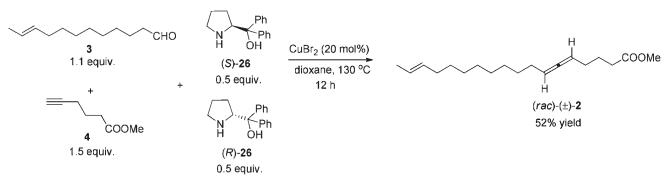

chemical

Chemical reaction scheme showing synthesis of (rαc)-(ε)-2 from aldehydes and silyl compounds under copper catalyst and dioxane conditions

To a flame dried Schlenk tube were added CuBr2 (18.0 mg, 0.08 mmol), (S)-26 (50.8 mg, 0.2 mmol), (R)-26 (50.9 mg, 0.2 mmol), 4 (75.7 mg, 0.6 mmol)/dioxane (1.6 mL), and 3 (80.2 mg, 0.44 mmol)/dioxane (1.6 mL) sequentially. The Schlenk tube was then sealed with a screw cap of polytetrafluoroethylene. The resulting mixture was then heated at $1 3 0 ~ ^ { \circ } \mathrm { C }$ with a preheated oil bath. The reaction was complete after 12 h as monitored by TLC (petroleum ether/ethyl acetate $= 5 / 1 )$ . After being cooled to room temperature, the resulting mixture was diluted with 15 mL of $\mathrm { E t } _ { 2 } \mathrm { O }$ and washed with an aqueous solution of hydrochloric acid (3 M, 10 mL). The organic layer was separated, and the aqueous phase was extracted by ethyl ether (10 mL). The combined organic layer was washed with brine and dried over anhydrous ${ \mathrm { N a } } _ { 2 } { \mathrm { S O } } _ { 4 } .$ After filtration and evaporation, the residue was purified by chromatography on silica gel (eluent: petroleum ether/ethyl ether = 200/1) to afford $( r a c ) – (\pm ) – 2 ^ { 4 }$ (60.7 mg, 52%) as an oil: $^ 1 \mathrm { H }$ NMR (400 MHz, CDCl ) δ 5.47–5.35 (m, 2 H, CHvCH), 5.14–4.99 (m, 2 H, CHvCvCH), 3.67 (s, 3 H, CH3), 2.36 (t, J = 7.4 Hz, 2 H), 2.06–1.92 (m, 6 H, 3 × CH ), 1.74 (quint, J = 7.4 Hz, 2 H, $\mathrm { C H } _ { 2 } )$ , 1.66–1.61 (m, 3 H, CH3), 1.43–1.22 (m, 12 H, $6 \times \mathrm { C H } _ { 2 } ) ;$ ; $^ { 1 3 } \mathrm { C }$ NMR (100 MHz, CDCl3) δ 204.0, 174.1, 131.7, 124.5, 91.5, 89.8, 51.5, 33.3, 32.6, 29.6, 29.5, 29.4, 29.19, 29.17, 29.1, 28.9, 28.3, 24.3, 17.9; IR (neat) $\nu \ \left( \mathrm { c m } ^ { - 1 } \right)$ 2924, 2853, 1962, 1741, 1436, 1365, 1313, 1242, 1207, 1154, 1060, 1018, 966, 876; MS (EI) m/z (%): 292 (M+ , 6.07), 80 (100).

(R,E)-5,6,16-Octadecatrienoic acid $( ( R _ { a } ) – ( - )  – 1 ) . ^ { 7 }$

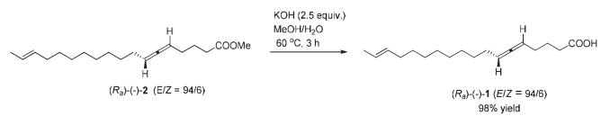

chemical

Organic reaction scheme showing conversion of (R₉)-(·)-2 to (R₉)-(·)-1 with 98% yield and KOH/MeOH conditions

To a round bottom flask were added sequentially KOH (56.1 mg, 1.0 mmol), a solvent mixture (2 mL, $\mathbf { M e O H } / \mathbf { H } _ { 2 } \mathbf { O } \ =$ 4/1 by volume), and $\scriptstyle ( R _ { a } ) - ( - ) - 2$ (117.0 mg, 0.4 mmol)/solvent mixture (2 mL, $\mathrm { M e O H / H _ { 2 } O } ~ = ~ 4 / 1$ by volume). The resulting mixture was then stirred at 60 °C. The reaction was complete after 3 h as monitored by TLC. HCl (3 M, 0.4 mL) was added dropwise after the mixture was cooled with an ice bath. MeOH was removed by using a rotary evaporator. $\mathrm { C H } _ { 2 } \mathrm { C l } _ { 2 } \left( 3 0 \ \mathrm { m L } \right)$ and water (20 mL) were added. The organic layer was separated, and the aqueous layer was extracted with $\mathrm { C H } _ { 2 } \mathrm { C l } _ { 2 }$ (10 mL × 3). The combined organic phase was washed with brine and dried over anhydrous ${ \mathrm { N a } } _ { 2 } { \mathrm { S O } } _ { 4 } .$ After filtration and evaporation, the residue was purified by chromatography on silica gel to afford $\left( { \cal R } _ { \alpha } \right) - ( - ) - 1 ^ { 2 , 4 } \left( E / Z = 9 4 / 6 \right)$ (109.3 mg, 98%) (eluent: petroleum ether/ethyl acetate = 10/1 to 2/1) as an oil: $[ \alpha ] _ { \mathrm { D } } ^ { 2 9 . 4 } \ = \ - 5 5 . 2$ (c = 0.995, EtOH); 1 H NMR (400 MHz, CDCl ) δ 10.93 (brs, 1 H, COOH), 5.47–5.34 (m, 2 H, CHvCH), 5.14–5.00 (m, 2 H, CHvCvCH), 2.40 (t, J = 7.4 Hz, 2 H, CH ), 2.08–1.92 (m, 6 H, 3 × CH ), 1.75 (quint, J = 7.4 Hz, 2 H, CH ), 1.66–1.62 (m, 3 H, CH3), 1.43–1.21 (m, 12 H, $6 \ \times \ \mathrm { C H } _ { 2 } ) ;$ ; $^ { 1 3 } \mathrm { C }$ NMR (100 MHz, CDCl ) δ 204.0, 180.3, 131.7, 124.5, 91.6, 89.6, 33.3, 32.6, 29.6, 29.5, 29.4, 29.18, 29.16, 29.1, 28.9, 28.2, 23.9, 17.9; IR (neat) ν (cm−1 ) 3500–2500, 2923, 2853, 1962, 1707, 1438, 1413, 1287, 1240, 1204, 1158, 1056, 964, 875; MS (EI) m/z (%): 278 (M+ , 1.17), 140 (100). The following signals are discernible for (Ra)-(−)-1 (Z): 1.61–1.58 (m, 3 H, CH3).

ee determination: by the synthesis of methyl $( R , E ) \mathbf { - } 5 , 6 , 1 6 \mathbf { - }$ octadecatrienoate $( ( R _ { a } ) – ( - ) – 2 ) .$ .11

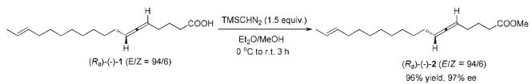

chemical

Organic synthesis reaction showing conversion of (R₉)-(-)-1 to (R₉)-(−)-2 using TMSCHN₂ and Et₂O/MeOH at room temperature

To a round bottom flask were added $( R _ { a } ) - ( - ) { \cdot } 1$ (55.8 mg, 0.2 mmol) and a solvent mixture (5 mL, $\mathrm { E t _ { 2 } O / M e O H } = 4 / 1$ by volume). TMSCHN2 (2 M in hexane, 0.15 mL, 0.3 mmol) was added dropwise at ${ \mathrm { ~ 0 ~ } } ^ { \mathrm { ~ \circ ~ } } \mathrm { C } .$ . The reaction mixture was then warmed up to room temperature naturally. When the reaction was complete as monitored by TLC after 3 h, the solvent was evaporated under vacuum, and the residue was purified by chromatography on silica gel to afford $\left( R _ { \alpha } \right) - ( - ) - 2 ^ { 2 , 4 } \ \left( E / Z = 9 4 / 6 \right)$ (56.2 mg, 96%) (eluent: petroleum ether/ethyl ether = 150/1) as an oil: 97% ee (HPLC conditions: CHIRALPAK AD-RH (0.46 × 15 cm, 5 μm), MeCN/H2O = 62/38, 0.7 mL min−1 , λ = 214 nm, $t _ { \mathrm { R } } ( \mathrm { m a j o r } ) = 4 7 . 1$ min, $t _ { \mathrm { R } } ( \mathrm { m i n o r } ) = 6 0 . 0$ min); $\left[ \alpha \right] _ { \mathrm { D } } ^ { 2 9 . 4 } = - 5 2 . 1 \left( c = \right.$ 0.315, EtOH) $( { \mathrm { l i t : } } ^ { 2 } \left[ \alpha \right] _ { \mathrm { D } } ^ { 2 5 } - 5 0 \left( c = 0 . 2 8 , { \mathrm { E t O H } } \right) ) ;$ 1 H NMR (400 MHz, CDCl ) δ 5.47–5.34 (m, 2 H, CHvCH), 5.13–5.00 (m, 2 H, CHvCvCH), 3.67 (s, 3 H, CH3), 2.36 $( \mathrm { t } , J = 7 . 6 ~ \mathrm { H z } , 2 ~ \mathrm { H } , \mathrm { C H } _ { 2 } ) ,$ 2.06–1.91 (m, 6 H, 3 × CH2), 1.74 (quint, J = 7.2 Hz, $2 \mathrm { H } , \mathrm { C H } _ { 2 } )$ , 1.67–1.61 (m, 3 H, CH ), 1.44–1.20 (m, 12 H, $6 \ \times \ \mathrm { C H } _ { 2 } ) ;$ .) $^ { 1 3 } \mathrm { C }$ NMR (100 MHz, CDCl3) δ 204.0, 174.0, 131.6, 124.5, 91.4, 89.7, 51.4, 33.3, 32.6, 29.6, 29.5, 29.4, 29.2, 29.14, 29.06, 28.9, 28.3, 24.3, 17.9. The following signals are discernible for (Ra)-(−)-1 (Z): 1.61–1.58 (m, 3 H, CH3).

# Acknowledgements

Financial support from the National Natural Science Foundation of China (21232006) and the National Basic Research Program (2015CB856600) are greatly appreciated.

# Notes and references

1 A. Hoffmann-Röder and N. Krause, Angew. Chem., Int. Ed., 2004, 43, 1196.   
2 K. L. Mikalaijczak, M. F. Rogers, C. R. Smith and I. A. Wolff, Biochem. J., 1967, 105, 1245.   
3 (a) S. R. Landor and N. Punja, Tetrahedron Lett., 1966, 7, 4905; (b) S. R. Landor, B. J. Miller, J. P. Regan and A. R. Tatchell, Chem. Commun., 1966, 585; (c) S. R. Landor, B. J. Miller and A. R. Tatchell, J. Chem. Soc. C, 1966, 1822; (d) R. J. D. Evans, S. R. Landor and J. P. Regan, Chem. Commun., 1965, 397.   
4 J. S. Cowie, P. D. Landor, S. R. Landor and N. Punja, J. Chem. Soc., Perkin Trans. 1, 1972, 2197.   
5 For some examples of metal catalyzed E-selective semireduction of alkynes: (a) B. M. Trost, Z. T. Ball and T. Jöge, J. Am. Chem. Soc., 2002, 124, 7922; (b) D. Srimani, Y. Diskin-Posner, Y. Ben-David and D. Milstein, Angew. Chem., Int. Ed., 2013, 52, 14131; (c) M. K. Karunananda and N. P. Mankad, J. Am. Chem. Soc., 2015, 137, 14598.

6 For selected reviews on constructing axially chiral allenes: (a) N. Krause and A. Hoffmann-Röder, Tetrahedron, 2004, 60, 11671; (b) M. Ogasawara, Tetrahedron: Asymmetry, 2009, 20, 259; (c) R. K. Neff and D. E. Frantz, ACS Catal., 2014, 4, 519; (d) J. Ye and S. Ma, Org. Chem. Front., 2014, 1, 1210.   
7 (a) X. Huang, T. Cao, Y. Han, X. Jiang, W. Lin, J. Zhang and S. Ma, Chem. Commun., 2015, 51, 6956; (b) X. Tang, X. Huang, T. Cao, Y. Han, X. Jiang, W. Lin, Y. Tang, J. Zhang and S. Ma, Org. Chem. Front., 2015, 2, 688; (c) X. Huang, C. Xue, C. Fu and S. Ma, Org. Chem. Front., 2015, 2, 1040.   
8 M. J. Cryle, P. Y. Hayes and J. J. De Voss, Chem. – Eur. J., 2012, 18, 15994.   
9 S. Ma, J. Liu, S. Li, B. Chen, J. Cheng, J. Kuang, Y. Liu, B. Wan, Y. Wang, J. Ye, Q. Yu, W. Yuan and S. Yu, Adv. Synth. Catal., 2011, 353, 1005; S. Ma, J. Liu, S. Li, B. Chen, J. Cheng, J. Kuang, Y. Liu, B. Wan, Y. Wang, J. Ye, Q. Yu, W. Yuan and S. Yu, CN Pat., 102336619, 2012; S. Ma, J. Liu, S. Li, B. Chen, J. Cheng, J. Kuang, Y. Liu, B. Wan, Y. Wang, J. Ye, Q. Yu, W. Yuan and S. Yu, US Pat., 8748669, 2014; S. Ma, J. Liu, S. Li, B. Chen, J. Cheng, J. Kuang, Y. Liu, B. Wan, Y. Wang, J. Ye, Q. Yu, W. Yuan and S. Yu, JP Pat., 5496366, 2014; S. Ma, J. Liu, S. Li, B. Chen, J. Cheng, J. Kuang, Y. Liu, B. Wan, Y. Wang, J. Ye, Q. Yu, W. Yuan and S. Yu, EP Pat., 2599765, 2016.   
10 For some reviews on metal-catalyzed aerobic oxidation of alcohols: (a) S. D. McCann and S. S. Stahl, Acc. Chem. Res., 2015, 48, 1756; (b) B. L. Ryland and S. S. Stahl, Angew. Chem., Int. Ed., 2014, 53, 8824; (c) J. Piera and J. E. Bäckvall, Angew. Chem., Int. Ed., 2008, 47, 3506; (d) Q. Cao, L. M. Dornan, L. Rogan, N. L. Hughes and M. J. Muldoon, Chem. Commun., 2014, 50, 4524.   
11 (a) X. Jiang, J. Zhang and S. Ma, J. Am. Chem. Soc., 2016, 138, 8344; (b) S. Ma and X. Jiang, Chinese patent pending, application No 201610141434.2, 2016.   
12 C. Zeng, D. Yuan, B. Zhao and Y. Yao, Org. Lett., 2015, 17, 2242.   
13 J. A. Cabezas and A. C. Oehlschlager, Synthesis, 1999, 107.   
14 (a) C. A. Brown and A. Yamashita, J. Am. Chem. Soc., 1975, 97, 891; (b) J. Kuang, X. Xie and S. Ma, Synthesis, 2013, 592.   
15 Y. Xue and M. B. Zimmt, Chem. Commun., 2011, 47, 8832.   
16 T. Nakamura, K. Yonesu, Y. Mizuno, C. Suzuki, Y. Sakata, Y. Takuwa, F. Narab and S. Satoh, Bioorg. Med. Chem., 2007, 15, 3548.   
17 N. Y. Plugar, G. G. Verba, A. A. Abduvakhabov and F. G. Kamaev, Chem. Nat. Compd., 1990, 26, 455.   
18 D.-H. Hu, J. He, Y.-W. Zhou, J.-T. Feng and X. Zhang, Molecules, 2012, 17, 12140.   
19 R. J. Fox, G. Lalic and R. G. Bergman, J. Am. Chem. Soc., 2007, 129, 14144.   
20 A.-C. Bédard and S. K. Collins, J. Am. Chem. Soc., 2011, 133, 19976.   
21 G. A. Krafft and J. A. Katzenellenbogen, J. Am. Chem. Soc., 1981, 103, 5459.   
22 L. Qi, M. M. Meijler, S.-H. Lee, C. Sun and K. D. Janda, Org. Lett., 2004, 6, 1673.