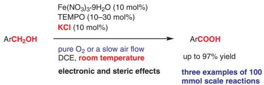
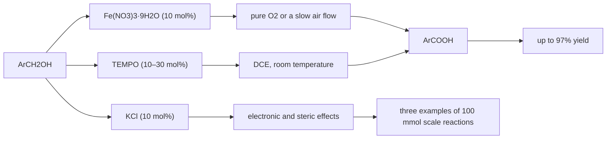
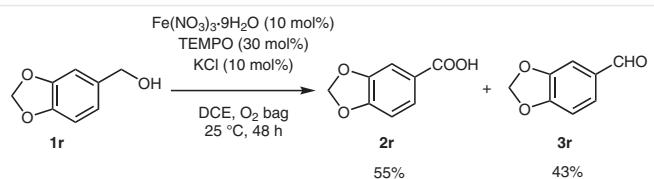
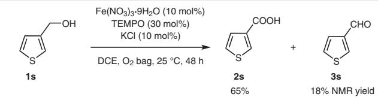
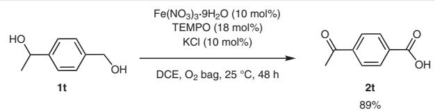
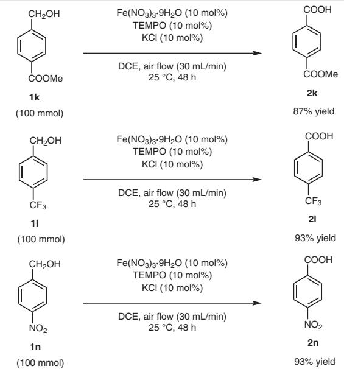
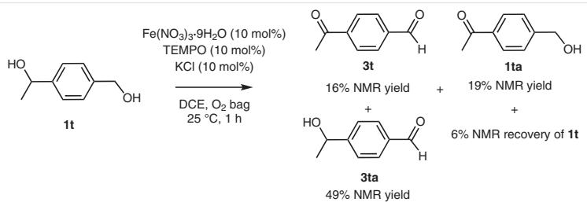
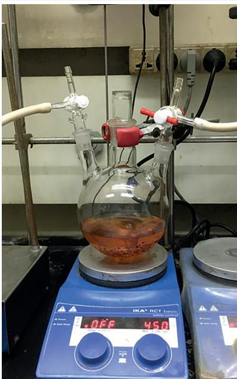

# Studies on Iron-Catalyzed Aerobic Oxidation of Benzylic Alcohols to Carboxylic Acids

Xingguo Jianga,b

Shengming Ma\*a,c 0-2-862-

a State Key Laboratory of Organometallic Chemistry, Shanghai Institute of Organic Chemistry, Chinese Academy of Sciences, 345 Lingling Lu, Shanghai 200032, P. R. of China masm@sioc.ac.cn   
b University of Chinese Academy of Sciences, Beijing 100049, P. R. of China   
c Department of Chemistry, Fudan University, 220 Handan Lu, Shanghai 200433, P. R. of China

flowchart

Received: 12.12.2017

Accepted after revision: 16.01.2018

Published online: 15.02.2018

DOI: 10.1055/s-0036-1591761; Art ID: ss-2017-h0805-psp

Abstract A comprehensive study on aerobic oxidation of benzylic alcohols to carboxylic acids with a catalytic amount each of Fe(NO3)3·9H2O, TEMPO, and KCl is conducted. Various synthetically useful functional groups are well tolerated in the reaction. Distinct electronic and steric effects are observed in the reaction: electron-withdrawing groups accelerate the reaction while electron-donating groups make the reaction slower, and ortho-substituted substrates react slower than meta-substituted substrates. Several large-scale reactions (100 mmol) are conducted using a slow air flow of 30 mL/min to demonstrate the practicality of this method in an academic laboratory.

Key words iron catalysis, aerobic oxidation, benzylic alcohols, carboxylic acids, electronic effects, steric effects

As one of the most fundamental transformations in organic chemistry, the oxidation reaction of alcohols to carboxylic acids is widely used in industry and in academic laboratories.1 Benzoic acids form a class of important chemicals. Traditionally, toxic and stoichiometric oxidants, such as $\mathrm { K M n O _ { 4 } } , ^ { 2 }$ chromium(VI) reagents3 and hypervalent iodine $\mathrm { r e a g e n t s } , { 4 }$ are used to prepare benzoic acids from benzylic alcohols. As a cheap and environmentally friendly compound, molecular oxygen is an ideal oxidant. Previous reports were focused on the aerobic oxidation reaction catalyzed by noble metals, such as $\mathsf { A g } , ^ { 5 } \mathsf { A u } , ^ { 6 } \mathsf { P d } , ^ { 7 } \mathsf { P t } , ^ { 8 } \mathsf { R u } , ^ { 9 }$ etc. In 2014, Jiang’s group5 reported the aerobic oxidation of several benzylic alcohols to carboxylic acids using 0.1 mol% of Ag(NHC) and 6 equivalents of KOH at $6 0 ^ { \circ } \mathrm { C }$ . Recently, Stahl’s group7a achieved this transformation with 1 mol% of a heterogeneous Pd-Bi-Te/C (PBT/C) catalyst and 3.4 equivalents of KOH at $5 0 ~ ^ { \circ } \mathrm { C } .$ In 2015, Jiang utilized NHC catalysts (SIMes and SIPr) combined with 5 equivalents of NaOt-Bu for such a reaction at room temperature.10 Reports of aerobic oxidation of benzylic alcohols to benzoic acids catalyzed

by earth-abundant metals are rare.11 In 2005, 4-tert-butylbenzyl alcohol and 4-chlorobenzyl alcohol were oxidized to the corresponding carboxylic acids using NaBr and Amberlyst 15 under sunlight.11a In $2 0 1 5 , ^ { 1 1 6 }$ the aerobic oxidation reaction of several benzylic alcohols to carboxylic acids was achieved with $\operatorname { N i B r } _ { 2 } ,$ imidazole as the ligand, and NaOAc in PEG-400 at $1 2 0 ~ ^ { \circ } \mathrm { C }$ for 48–96 hours. In 2016, Repo’s $\mathtt { g r o u p } ^ { 1 1 \mathrm { c } }$ reported the Fe $\mathrm { N O _ { 3 } } ) _ { 3 } { \cdot } 9 \mathrm { H } _ { 2 } \mathrm { O } / \mathrm { T E M P O } / 2 { , } 2 { \cdot } \mathrm { - b i } \mathrm { - }$ pyridine-catalyzed aerobic oxidation of benzylic alcohols in AcOH at $8 0 ~ ^ { \circ } \mathrm { C }$ . However, piperitol and heteroaromatic methanols such as furanyl and thienyl methanols could only give aldehydes. In the same year, and immediately prior to the aforementioned report, we described the $\mathrm { F e ( N O _ { 3 } ) _ { 3 } } { \cdot } 9 \mathrm { H _ { 2 } O } / \mathrm { T E M P O } / \mathrm { K C l } .$ -catalyzed aerobic oxidation of alcohols to carboxylic acids,11d in which the reaction of benzylic alcohols was slow and very much structure-based. In the present work, we conducted a comprehensive study on the aerobic reactions of different benzylic alcohols at room temperature with the purpose of identifying the general trend and to demonstrate the practicality by running the reactions on 100 mmol scale.

With 10 mol% each of $\mathrm { F e } ( \mathrm { N O } _ { 3 } ) _ { 3 } { \cdot } 9 \mathrm { H } _ { 2 } 0$ , TEMPO, and KCl in DCE at 25 °C for 48 hours as the standard conditions, the reactions were conducted with various benzylic alcohols. Some useful functional groups were well tolerated. Substituents including both electron-donating and electron-withdrawing groups at the para position were investigated. Benzoic acid (2a) was obtained in 57% yield from benzyl alcohol (1a) under the standard conditions together with a 38% NMR yield of the intermediate benzaldehyde product (Table 1, entry 1). When the loading of TEMPO was increased to 30 mol%, the yield of benzoic acid increased to 73% along with a 14% NMR yield of benzaldehyde (entry 2). For substrates with electron-donating groups, the reactions proceeded more slowly (entry 3). Substrate 1b with a para-methoxy group gave a 38% yield of acid 2b and a 52% yield of the intermediate aldehyde 3b. 2-Methoxybenzyl alcohol (1c) yielded 21% of the acid and 75% of the aldehyde, while 3- methoxybenzyl alcohol (1d) gave a 49% yield of the acid and a 38% yield of the aldehyde, which indicates that steric effects may exist (entry 4 vs entry 5). The larger steric hindrance of the ortho-substituted benzylic alcohol caused a lower yield of the acid compared with the corresponding meta- and para-substituted alcohols. For weak electron-donating groups, 4-methylbenzyl alcohol (1e) yielded 53% of 4-methylbenzoic acid (2e) and 30% of 4-methylbenzaldehyde (3e) (entry 6), which reacted similarly to benzyl alcohol. With 20 mol% of TEMPO, para-phenyl-substituted benzyl alcohol 1f generated a 93% yield of acid 2f and a 7% NMR yield of aldehyde 3f (compare entry 7 with entry 8). Benzylic alcohols with synthetically useful halogen substituents (Cl, Br, I) could be oxidized to the corresponding acids in high yields with 10–20 mol% of TEMPO, and with only minor amounts of the aldehydes being detected (entries 9– 13). Aerobic oxidation of 4-(hydroxymethyl)benzaldehyde (1j) generated an 80% yield of 4-formylbenzoic acid (2j) as well as a 6% NMR yield of 1,4-benzenedicarboxylic acid (4j), whilst the amount of 1,4-benzenedicarboxaldehyde (3j) was 1% according to NMR spectroscopy (entry 14). The reaction mainly stayed at the stage of 4-formylbenzoic acid instead of further oxidation to 1,4-benzenedicarboxylic acid. For substrates with stronger electron-withdrawing groups, 10 mol% of TEMPO was enough to enable the reaction to go to completion. Benzylic alcohols with COOMe, ${ \mathrm { C F } } _ { 3 } ,$ CN and ${ \mathsf { N O } } _ { 2 } ^ { 1 1 { \mathsf { d } } }$ substituents were fully converted into the corresponding acids in high yields under the standard conditions (entries 15–18). The results with substrates 1n– p, which have nitro groups at para, ortho, and meta positions, respectively, also showed obvious electronic and steric effects. Under the standard conditions, a 46% yield of the acid and a 46% yield of the aldehyde were obtained from 2- nitrobenzyl alcohol (1o), while a 57% yield of the acid and a 21% yield of the aldehyde were generated from 3-nitrobenzyl alcohol (1p). Using 20 mol% of TEMPO, 1o and 1p were transformed into the corresponding acids in 81% and 86% yields, respectively (entries 20 and 22). 5- Chloro-2-nitrobenzoic acid (2q) was obtained in 87% yield from the corresponding alcohol 1q (Table 1, entry 24). It can be concluded that electron-withdrawing groups promoted the oxidation reaction and steric hindrance hampered the reaction. According to the $\sigma _ { p a r a }$ values in the Hammett plot,12 the order of the electronic effect of the substituent is: OMe $< \mathrm { M e } < \mathrm { P h } \sim \mathrm { H } < \mathrm { I } < \mathrm { B r } \sim \mathrm { C l } \sim \mathrm { C H 0 } < \mathrm { C O O R } < \mathrm { C ( O ) M e } <$ < $\mathsf C \mathsf F _ { 3 } < \mathsf C \mathsf N < \mathsf N 0 _ { 2 }$ . The electronic effects of the reactions are good agreement with the order of the ${ \sigma } _ { p a r a }$ values.

The oxidation of piperonyl alcohol (1r) with 30 mol% of TEMPO led to a mixture of acid 2r (55%) and aldehyde 3r (43%) (Scheme 1). In addition, 3-thienylmethanol (1s) gave a 65% yield of acid 2s and an 18% NMR of aldehyde 3s (Scheme 2).

Table 1 Substrate Scope of the Aerobic Oxidation of Benzylic Alcoholsa 

<table><tr><td>Entry</td><td>Ar</td><td> $\sigma_{para}$ </td><td>x (mol%)</td><td>Yield of 2 (%)b</td><td>Yield of 3 (%)b</td></tr><tr><td>1</td><td>Ph (1a)</td><td>0</td><td>10</td><td>57 (2a)</td><td>38c(3a)</td></tr><tr><td>2</td><td>Ph (1a)</td><td>0</td><td>30</td><td>73 (2a)</td><td>14c(3a)</td></tr><tr><td>3</td><td>4-MeOC6H4(1b)</td><td>-0.268</td><td>10</td><td>38 (2b)</td><td>52 (3b)</td></tr><tr><td>4</td><td>2-MeOC6H4(1c)</td><td>-0.268d</td><td>10</td><td>21 (2c)</td><td>75 (3c)</td></tr><tr><td>5</td><td>3-MeOC6H4(1d)</td><td>0.115e</td><td>10</td><td>49 (2d)</td><td>38 (3d)</td></tr><tr><td>6</td><td>4-MeC6H4(1e)</td><td>-0.17</td><td>10</td><td>53 (2e)</td><td>30 (3e)</td></tr><tr><td>7</td><td>4-PhC6H4(1f)</td><td>-0.01</td><td>10</td><td>67 (2f)</td><td>33 (3f)</td></tr><tr><td>8</td><td>4-PhC6H4(1f)</td><td>-0.01</td><td>20</td><td>93 (2f)</td><td>7c(3f)</td></tr><tr><td>9</td><td>4-IC6H4(1g)</td><td>0.18</td><td>10</td><td>86 (2g)</td><td>11 (3g)</td></tr><tr><td>10</td><td>4-IC6H4(1g)</td><td>0.18</td><td>20</td><td>97 (2g)</td><td>3c(3g)</td></tr><tr><td>11</td><td>4-BrC6H4(1h)</td><td>0.23</td><td>10</td><td>82 (2h)</td><td>16 (3h)</td></tr><tr><td>12</td><td>4-BrC6H4(1h)</td><td>0.23</td><td>15</td><td>84 (2h)</td><td>7 (3h)</td></tr><tr><td>13</td><td>4-CIC6H4(1i)</td><td>0.23</td><td>10</td><td>82 (2i)</td><td>1c(3i)</td></tr><tr><td>14</td><td>4-OHCC6H4(1j)</td><td>0.22</td><td>10</td><td>80 (2j)</td><td>1c,f(3j)</td></tr><tr><td>15</td><td>4-MeOOCC6H4(1k)</td><td>0.45</td><td>10</td><td>91 (2k)</td><td>-</td></tr><tr><td>16</td><td>4-F3CC6H4(1l)</td><td>0.54</td><td>10</td><td>89 (2l)</td><td>-</td></tr><tr><td>17</td><td>4-NCC6H4(1m)</td><td>0.66</td><td>10</td><td>76 (2m)</td><td>-</td></tr><tr><td>18g</td><td>4-O2NC6H4(1n)</td><td>0.78</td><td>10</td><td>76 (2n)</td><td>-</td></tr><tr><td>19</td><td>2-O2NC6H4(1o)</td><td>0.78d</td><td>10</td><td>46 (2o)</td><td>46 (3o)</td></tr><tr><td>20</td><td>2-O2NC6H4(1o)</td><td>0.78d</td><td>20</td><td>81 (2o)</td><td>3c(3o)</td></tr><tr><td>21</td><td>3-O2NC6H4(1p)</td><td>0.71e</td><td>10</td><td>57 (2p)</td><td>21 (3p)</td></tr><tr><td>22</td><td>3-O2NC6H4(1p)</td><td>0.71e</td><td>20</td><td>86 (2p)</td><td>2c(3p)</td></tr><tr><td>23</td><td>5-Cl-2-O2NC6H3(1q)</td><td>0.37,e0.78d</td><td>10</td><td>60 (2q)</td><td>22 (3q)</td></tr><tr><td>24</td><td>5-Cl-2-O2NC6H3(1q)</td><td>0.37,e0.78d</td><td>20</td><td>87 (2q)</td><td>1c(3q)</td></tr></table>

a The reaction was carried out on a 1.0 mmol scale of 1 in 4.0 mL of DCE at 25 °C with a bag of ${ \mathrm { ~  ~ O ~ } } _ { 2 } .$ .   
2 b Yield of isolated product.   
c NMR yield.   
d The σpara values are shown since $\sigma _ { o r t h c }$ values were not described in the literature. 12c   
$_ { \textrm { \tiny { c } } } ^ { \textrm { \tiny { e } } } \sigma _ { { \textrm { m e t } } a }$ values.   
metaf Obtained with a 6% NMR yield of 1,4-benzenedicarboxylic acid (4j).   
g Reaction data obtained from ref. 11d.

chemical

Chemical reaction scheme showing oxidation of compound 1r to 2r and then to 3r under specified conditions

Scheme 1 The oxidation of piperonyl alcohol (1r)

chemical

Chemical reaction scheme showing conversion of compound 1s to 2s and 3s under specified conditions

Scheme 2 The oxidation of 3-thienylmethanol (1s)

4-(1-Hydroxyethyl)benzyl alcohol (1t) could be transformed into 4-acetylbenzoic acid (2t) in 89% yield using 18 mol% of TEMPO (Scheme 3). Both the primary and second hydroxy groups in the substrate were oxidized. To compare the reaction rates of the two types of hydroxy groups, we stopped the reaction after 1 hour and observed a 16% NMR yield of 3t, a 19% NMR yield of 1ta, and a 49% NMR yield of 3ta, with 6% recovery of 1t according to NMR (Scheme 4). The results indicated that the primary alcohol reacted faster than the secondary alcohol in the same molecule.

chemical

Chemical reaction scheme converting compound 1t to 2t using Fe(NO₃)₃·9H₂O and TEMPO in KCl at DCE/O₂ bag, with 89% yield

Scheme 3 The synthesis of 2t

A large-scale reaction of 1k (100 mmol) was conducted with a slow flow of air (30 mL/min) to afford an 87% isolated yield of 2k after simple recrystallization (Scheme 5), which shows the good practicality of the catalytic system and potential for large-scale syntheses. The reactions of 1l and 1n on 100 mmol scale also produced the corresponding acids 2l and 2n in high yields.

In summary, we have studied the electronic and steric effects in the Fe(NO ) ·9H O/TEMPO/KCl-catalyzed aerobic oxidations of benzylic alcohols to benzoic acids. Several synthetically useful functional groups were well tolerated in the reaction. Generally, it was found that benzylic alcohols substituted with electron-withdrawing groups promoted the process to form benzoic acids, while substrates with electron-donating groups reacted more slowly. Steric hindrance, especially at ortho positions, might also make the reactions slower. Reactions on 100 mmol scale were smoothly conducted with a slow air flow (30 mL/min) as

chemical

Chemical reaction scheme showing oxidation of compounds 1k, 1l, and 1n to products 2k, 2l, and 2n with yields and conditions

Scheme 5 Large-scale reactions of 1k, 1l, and 1n under a slow flow of air (30 mL/min)

the source of molecular oxygen. Further investigations including mechanistic studies and the improvement of the protocol for the oxidation of aryl alcohols with electron-donating groups are being pursued in this laboratory.

Fe $( \mathsf { N O } _ { 3 } ) _ { 3 } { \cdot } 9 \mathsf { H } _ { 2 } 0$ was purchased from Energy Chemical. TEMPO was purchased from Acros and Energy Chemical. KCl was purchased from Sinopharm. DCE was used directly without further treatment. Other reagents were used as received without further treatment. 4-(1-Hydroxyethyl)benzyl alcohol (1t) was synthesized according to the literature method.13 Petroleum ether (60–90 °C) was used for chromatography and recrystallization. Caution! Oxygen is used in combination with organic solvents; remove all ignition sources including sources of sparks, static, or flames since oxygen increases the intensity of any fire. Inhalation of pure oxygen should be avoided. Gas bags for reactions with O were obtained from Wattcas. Melting points were recorded using a Stuart SMP30 melting point apparatus. IR spectra were obtained using a Bruker Tensor 27 spectrometer. 1H, 13C and 19F NMR spectra were obtained using an Agilent (400 MHz), Varian Mercury (400 MHz), or Bruker (400 MHz) spectrometer. The mass spectra were recorded using an Agilent 5973N instrument.

chemical

Chemical reaction scheme showing oxidation of 1t to products 3t, 1ta, and 3ta under specified conditions

Scheme 4 The reaction of 1t after 1 hour

# Benzoic Acid (2a); Typical Procedure I

To a Schlenk tube were added Fe(NO3)3·9H2O (40.6 mg, 0.1 mmol), TEMPO (15.8 mg, 0.1 mmol), KCl (7.5 mg, 0.1 mmol), 1a (108.5 mg, 1.0 mmol), and DCE (4.0 mL) sequentially under an atmosphere of oxygen (gas bag, commercial size: 2 L, which could be expanded to 5 L). The mixture was then stirred at 25 °C until completion of the reaction as monitored by TLC (petroleum ether/EtOAc = 5:1) (48h). The crude reaction mixture was filtered through a short column of silica gel (height: 2 cm, diameter: 3 cm) eluting with Et2O (3 × 25 mL). After evaporation, the residue was purified by chromatography on silica gel [petroleum ether/EtOAc = 15:1 (500 mL) to 2:1 (300 mL)] to afford benzoic acid (2a)14 (69.9 mg, 57%) as a pale yellow solid. Yields of 57% of 2a and 38% of benzaldehyde (3a)15 were observed by NMR analysis of the crude product using CH2Br2 as an internal standard and by comparison with spectra reported in the literature.

Mp 120.9–121.9 °C (EtOAc/petroleum ether) (Lit.14 121–122 °C).

IR (neat): 3400–2100, 1680, 1601, 1582, 1453, 1420, 1323, 1288, 1183, 1127, 1072, 1026 cm–1.

1H NMR (400 MHz, CDCl3): δ = 12.15 (br s, 1 H, COOH), 8.13 (d, J = 7.2 Hz, 2 H, Ar-H), 7.61 (t, J = 7.4 Hz, 1 H, Ar-H), 7.47 (t, J = 7.8 Hz, 2 H, Ar-H).

13C NMR (100 MHz, CDCl ): δ = 172.6, 133.8, 130.2, 129.3, 128.5.

MS (EI, 70 eV): m/z (%) = 122 (82.59) [M+], 105 (100).

# Benzoic Acid (2a); Oxidation Using 30 mol% of TEMPO

Following Typical Procedure I, the reaction of Fe(NO3)3·9H2O (40.6 mg, 0.1 mmol), TEMPO (47.0 mg, 0.3 mmol), KCl (7.5 mg, 0.1 mmol), 1a (108.0 mg, 1.0 mmol), and DCE (4.0 mL) under an atmosphere of oxygen (gas bag, commercial size: 2 L, which could be expanded to 5 L) afforded, after column chromatographic purification [petroleum ether/EtOAc = 15:1 (600 mL) to 2:1 (300 mL)], benzoic acid (2a)14 (88.8 mg, 73%) as a pale yellow solid. Yields of 76% of 2a and 14% of 3a15 were observed by NMR analysis of the crude product.

1H NMR (400 MHz, CDCl3): δ = 11.27 (br s, 1 H, COOH), 8.13 (d, J = 7.2 Hz, 2 H, Ar-H), 7.61 (t, J = 7.4 Hz, 1 H, Ar-H), 7.48 (t, J = 7.8 Hz, 2 H, Ar-H).

13C NMR (100 MHz, CDCl3): δ = 172.4, 133.7, 130.1, 129.3, 128.4.

# 4-Methoxybenzoic Acid (2b) and 4-Methoxybenzaldehyde (3b)

Following Typical Procedure I, the reaction of Fe(NO3)3·9H2O (40.5 mg, 0.1 mmol), TEMPO (15.6 mg, 0.1 mmol), KCl (7.5 mg, 0.1 mmol), 1b (141.7 mg, 98% purity, 1.0 mmol), and DCE (4.0 mL) under an atmosphere of oxygen (gas bag, commercial size: 2 L, which could be expanded to 5 L) afforded, after column chromatographic purification [petroleum ether/EtOAc = 20:1 (500 mL) to 2:1 (600 mL)], 4-methoxybenzoic acid (2b)16 (57.6 mg, 38%) and 4-methoxybenzaldehyde (3b)17 (71.8 mg, 52%). Yields of 38% of 2b and 62% of benzaldehyde 3b were observed by NMR analysis of the crude product using CH2Br2 as an internal standard.

# 4-Methoxybenzoic Acid (2b)

Pale yellow solid; mp 182.6–184.2 °C (EtOAc/petroleum ether) (Lit.16 182–184 °C).

IR (neat): 3300–2100, 1677, 1600, 1574, 1514, 1424, 1296, 1258, 1178, 1165, 1128, 1104, 1023 cm–1.

1H NMR (400 MHz, DMSO-d ): δ = 12.64 (br s, 1 H, COOH), 7.92 (d, J = 8.8 Hz, 2 H, Ar-H), 7.03 (d, J = 8.8 Hz, 2 H, Ar-H), 3.84 (s, 3 H, CH3).

13C NMR (100 MHz, DMSO-d ): δ = 167.1, 162.9, 131.4, 123.0, 113.8, 55.4.

MS (EI, 70 eV): m/z (%) = 152 (79.71) [M+], 135 (100).

# 4-Methoxybenzaldehyde (3b)

Pale yellow oil.

IR (neat): 2840, 2738, 1680, 1595, 1575, 1509, 1460, 1426, 1393, 1314, 1254, 1214, 1182, 1156, 1108, 1021 cm–1.

1H NMR (400 MHz, CDCl3): δ = 9.88 (s, 1 H, CHO), 7.84 (d, J = 8.4 Hz, 2 H, Ar-H), 7.00 (d, J = 8.8 Hz, 2 H, Ar-H), 3.89 (s, 3 H, CH3).

13C NMR (100 MHz, CDCl3): δ = 190.8, 164.5, 131.9, 129.9, 114.2, 55.5.

MS (EI, 70 eV): m/z (%) = 136 (71.20) [M+], 135 (100).

# 2-MethoxybenzoicAcid (2c) and 2-Methoxybenzaldehyde (3c)

Following Typical Procedure I, the reaction of Fe(NO3)3·9H2O (40.6 mg, 0.1 mmol), TEMPO (15.6 mg, 0.1 mmol), KCl (7.6 mg, 0.1 mmol), 1c (141.5 mg, 98% purity, 1.0 mmol), and DCE (4.0 mL) under an atmosphere of oxygen (gas bag, commercial size: 2 L, which could be expanded to 5 L) afforded, after column chromatographic purification [petroleum ether/EtOAc = 20:1 (500 mL) to 2:1 (600 mL)], 2-methoxybenzoic acid (2c)18 (31.5 mg, 21%) and 2-methoxybenzaldehyde (3c)19 (106.2 mg, 96% purity, 75%). Yields of 22% of 2c and 78% of 3c were observed by NMR analysis of the crude product using CH2Br2 as an internal standard.

# 2-Methoxybenzoic Acid (2c)

Pale yellow solid; mp 101.1–102.7 °C (EtOAc/petroleum ether) (Lit.18 100–102 °C).

IR (neat): 3500–2300, 1665, 1597, 1577, 1490, 1461, 1434, 1408, 1314, 1248, 1166, 1085, 1047, 1017 cm–1.

1H NMR (400 MHz, CDCl3): δ = 10.82 (br s, 1 H, COOH), 8.17 (dd, J = 7.6 Hz, J = 1.6 Hz, 1 H, Ar-H), 7.62–7.55 (m, 1 H, Ar-H), 7.14 (t, J = 7.6 Hz, 1 H, Ar-H), 7.07 (d, J = 8.4 Hz, 1 H, Ar-H), 4.08 (s, 3 H, CH3).

13C NMR (100 MHz, CDCl ): δ = 165.6, 158.1, 135.1, 133.7, 122.1, 117.5, 111.6, 56.6.

MS (EI, 70 eV): m/z (%) = 152 (46.91) [M+], 105 (100).

# 2-Methoxybenzaldehyde (3c)

Pale yellow oil.

IR (neat): 2845, 2760, 1685, 1598, 1483, 1466, 1439, 1394, 1285, 1243, 1187, 1160, 1103, 1042, 1020 cm–1.

1H NMR (400 MHz, CDCl3): δ = 10.47 (s, 1 H, CHO), 7.82 (dd, J1 = 7.6 Hz, J2 = 1.6 Hz, 1 H, Ar-H), 7.59–7.52 (m, 1 H, Ar-H), 7.02 (t, J = 7.6 Hz, 1 H, Ar-H), 6.99 (d, J = 8.8 Hz, 1 H, Ar-H), 3.92 (s, 3 H, CH3).

13C NMR (100 MHz, CDCl3): δ = 189.8, 161.8, 135.9, 128.4, 124.7, 120.6, 111.6, 55.5.

MS (EI, 70 eV): m/z (%) = 136 (100) [M+].

# 3-Methoxybenzoic Acid (2d) and 3-Methoxybenzaldehyde (3d)

Following Typical Procedure I, the reaction of Fe(NO3)3·9H2O (40.6 mg, 0.1 mmol), TEMPO (15.7 mg, 0.1 mmol), KCl (7.5 mg, 0.1 mmol), 1d (140.5 mg, 98% purity, 1.0 mmol), and DCE (4.0 mL) under an atmosphere of oxygen (gas bag, commercial size: 2 L, which could be expanded to 5 L) afforded, after column chromatographic purification [petroleum ether/EtOAc = 20:1 (500 mL) to 2:1 (600 mL)], 3-methoxybenzoic acid (2d)18 (74.8 mg, 49%) and 3-methoxybenzaldehyde (3d)20 (54.3 mg, 95% purity, 38%). Yields of 52% of 2d and 42% of 3d were observed by NMR analysis of the crude product using CH2Br2 as an internal standard.

# 3-Methoxybenzoic Acid (2d)

Pale yellow solid; mp 104.9–106.0 °C (EtOAc/petroleum ether) (Lit.18 104–106 °C).

IR (neat): 3300–2100, 1685, 1604, 1581, 1488, 1464, 1429, 1415, 1308, 1285, 1228, 1177, 1120, 1104, 1087, 1041 cm–1.

1H NMR (400 MHz, CDCl3): δ = 11.33 (br s, 1 H, COOH), 7.73 (d, J = 7.6 Hz, 1 H, Ar-H), 7.65–7.61 (m, 1 H, Ar-H), 7.38 (t, J = 8.0 Hz, 1 H, Ar-H), 7.15 (dd, J1 = 8.2 Hz, J2 = 2.6 Hz, 1 H, Ar-H), 3.86 (s, 3 H, CH3).

13C NMR (100 MHz, CDCl ): δ = 172.3, 159.6, 130.6, 129.5, 122.7, 120.4, 114.4, 55.4.

MS (EI, 70 eV): m/z (%) = 153 (10.22) [M + 1+], 152 (100) [M+].

# 3-Methoxybenzaldehyde (3d)

Pale yellow oil.

IR (neat): 2839, 2729, 1700, 1587, 1485, 1461, 1435, 1388, 1322, 1285, 1260, 1190, 1164, 1147, 1079, 1038 cm–1.

1H NMR (400 MHz, CDCl ): δ = 9.97 (s, 1 H, CHO), 7.48–7.41 (m, 2 H, Ar-H), 7.39 (d, J = 2.4 Hz, 1 H, Ar-H), 7.21–7.15 (m, 1 H, Ar-H), 3.86 (s, 3 H, CH3).

13C NMR (100 MHz, CDCl ): δ = 192.1, 160.1, 137.7, 130.0, 123.4, 121.4, 112.0, 55.4.

MS (EI, 70 eV): m/z (%) = 137 (10.38) [M + 1+], 136 (100) [M+].

# 4-Methylbenzoic Acid (2e) and 4-Methylbenzaldehyde (3e)

Following Typical Procedure I, the reaction of Fe(NO3)3·9H2O (40.5 mg, 0.1 mmol), TEMPO (15.7 mg, 0.1 mmol), KCl (7.5 mg, 0.1 mmol), 1e (124.6 mg, 1.0 mmol), and DCE (4.0 mL) under an atmosphere of oxygen (gas bag, commercial size: 2 L, which could be expanded to 5 L) afforded, after column chromatographic purification [petroleum ether/EtOAc = 20:1 (400 mL) to 2:1 (500 mL)], 4-methylbenzoic acid (2e)16 (72.4 mg, 53%) and 4-methylbenzaldehyde (3e)21 (35.9 mg, 30%). Yields of 54% of 2e and 39% of 3e were observed by NMR analysis of the crude product using CH2Br2 as an internal standard.

# 4-Methylbenzoic Acid (2e)

Pale yellow solid.

Mp 179.9–181.2 °C (EtOAc/petroleum ether) (Lit.16 180–182 °C).

IR (neat): 3400–2300, 1670, 1611, 1576, 1516, 1417, 1320, 1283, 1183, 1126, 1118 cm–1.

1H NMR (400 MHz, DMSO-d ): δ = 12.83 (br s, 1 H, COOH), 7.87 (d, J = 8.0 Hz, 2 H, Ar-H), 7.31 (d, J = 8.0 Hz, 2 H, Ar-H), 2.38 (s, 3 H, CH3).

13C NMR (100 MHz, DMSO-d6): δ = 167.4, 143.1, 129.4, 129.2, 128.1, 21.2.

MS (EI, 70 eV): m/z (%) = 136 (97.38) [M+], 91 (100).

# 4-Methylbenzaldehyde (3e)

Pale yellow oil.

IR (neat): 3377, 2822, 2733, 1702, 1687, 1604, 1577, 1450, 1387, 1307, 1208, 1168, 1039, 1018.

1H NMR (400 MHz, CDCl3): δ = 9.96 (s, 1 H, CHO), 7.78 (d, J = 8.0 Hz, 2 H, Ar-H), 7.33 (d, J = 7.6 Hz, 2 H, Ar-H), 2.44 (s, 3 H, CH3).

13C NMR (100 MHz, CDCl3): δ = 192.0, 145.5, 134.1, 129.8, 129.7, 21.8.

MS (EI, 70 eV): m/z (%) = 120 (74.13) [M+], 119 (100).

# 4-Phenylbenzoic Acid (2f) and 4-Phenylbenzaldehyde (3f)

Following Typical Procedure I, the reaction of Fe(NO3)3·9H2O (40.4 mg, 0.1 mmol), TEMPO (15.7 mg, 0.1 mmol), KCl (7.6 mg, 0.1 mmol), 1f (188.2 mg, 1.0 mmol), and DCE (4.0 mL) under an atmosphere of oxygen (gas bag, commercial size: 2 L, which could be expanded to 5 L) afforded, after column chromatographic purification [eluent: petroleum ether/Et2O = 20:1 (500 mL) to petroleum ether/EtOAc = 2:1 (600 mL)], 4-phenylbenzoic acid (2f)22 (133.0 mg, 67%) and 4-phenylbenzaldehyde (3f)23 (60.6 mg, 33%). Yields of 67% of 2f and 33% of 3f were observed by NMR analysis of the crude product using CH Br as an internal standard.

# 4-Phenylbenzoic Acid (2f)

Pale yellow solid.

1H NMR (400 MHz, DMSO-d6): δ = 13.05 (br s, 1 H, COOH), 8.07 (d, J = 7.6 Hz, 2 H, Ar-H), 7.81 (d, J = 8.4 Hz, 2 H, Ar-H), 7.75 (d, J = 7.2 Hz, 2 H, Ar-H), 7.52 (t, J = 7.4 Hz, 2 H, Ar-H), 7.47–7.40 (m, 1 H, Ar-H).

13C NMR (100 MHz, DMSO-d ): δ = 167.2, 144.4, 139.1, 130.0, 129.7, 129.1, 128.3, 127.0, 126.8.

# 4-Phenylbenzaldehyde (3f)

Pale yellow solid; mp 58.7–59.7 °C (EtOAc/petroleum ether) (Lit.23 57–59 °C).

IR (neat): 2836, 2744, 1693, 1600, 1562, 1485, 1449, 1413, 1382, 1310, 1293, 1272, 1214, 1185, 1171, 1157, 1112, 1080, 1006 cm–1.

1H NMR (400 MHz, CDCl3): δ = 10.04 (s, 1 H, CHO), 7.94 (d, J = 8.0 Hz, 2 H, Ar-H), 7.74 (d, J = 8.4 Hz, 2 H, Ar-H), 7.63 (d, J = 7.2 Hz, 2 H, Ar-H), 7.47 (t, J = 7.6 Hz, 2 H, Ar-H), 7.44–7.38 (m, 1 H, Ar-H).

13C NMR (100 MHz, CDCl ): δ = 191.9, 147.1, 139.6, 135.1, 130.2, 129.0, 128.4, 127.6, 127.3.

MS (EI, 70 eV): m/z (%) = 182 (100) [M+].

# 4-Phenylbenzoic Acid (2f); Oxidation Using 20 mol% of TEMPO

Following Typical Procedure I, the reaction of Fe(NO3)3·9H2O (40.5 mg, 0.1 mmol), TEMPO (31.3 mg, 0.2 mmol), KCl (7.5 mg, 0.1 mmol), 1f (188.1 mg, 1.0 mmol), and DCE (4.0 mL) under an atmosphere of oxygen (gas bag, commercial size: 2 L, which could be expanded to 5 L) afforded, after column chromatographic purification [eluent: petroleum ether/EtOAc = 15:1 (500 mL) to 2:1 (600 mL)], 4-phenylbenzoic acid (2f)22 (184.5 mg, 93%) as a pale yellow solid. Yields of 89% of 2f and 7% of 3f23 were observed by NMR analysis of the crude product using CH Br as an internal standard.

Mp 223.6–225.1 °C (EtOAc/petroleum ether) (Lit.22 222–225 °C).

IR (neat): 3400–2200, 1676, 1606, 1421, 1317, 1286, 1193, 1129, 1007 cm–1.

1H NMR (400 MHz, DMSO-d6): δ = 13.05 (br s, 1 H, COOH), 8.07 (d, J = 8.4 Hz, 2 H, Ar-H), 7.81 (d, J = 8.0 Hz, 2 H, Ar-H), 7.75 (d, J = 7.6 Hz, 2 H, Ar-H), 7.52 (t, J = 7.4 Hz, 2 H, Ar-H), 7.44 (t, J = 7.2 Hz, 1 H, Ar-H).

13C NMR (100 MHz, DMSO-d ): δ = 167.3, 144.4, 139.1, 130.1, 129.7, 129.1, 128.4, 127.0, 126.9.

MS (EI, 70 eV): m/z (%) = 199 (15.43) [M + 1+], 198 (100) [M+].

# 4-Iodobenzoic Acid (2g) and 4-Iodobenzaldehyde (3g)

Following Typical Procedure I, the reaction of Fe(NO3)3·9H2O (40.4 mg, 0.1 mmol), TEMPO (15.7 mg, 0.1 mmol), KCl (7.6 mg, 0.1 mmol), 1g (238.6 mg, 98% purity, 1.0 mmol), and DCE (4.0 mL) under an atmosphere of oxygen (gas bag, commercial size: 2 L, which could be expanded to 5 L) afforded, after column chromatographic purification [eluent: petroleum ether/Et2O = 25:1 (500 mL) to petroleum ether/EtOAc = 2:1 (500 mL)], 4-iodobenzoic acid (2g)24 (212.7 mg, 86%) and 4-iodobenzaldehyde (3g)25 (27.8 mg, 91% purity, 11%). Yields of 86% of 2g and 14% of 3g were observed by NMR analysis of the crude product using CH2Br2 as an internal standard.

# 4-Iodobenzoic Acid (2g)

Pale yellow solid.

1H NMR (400 MHz, DMSO-d6): δ = 13.17 (br s, 1 H, COOH), 7.90 (d, J = 8.0 Hz, 2 H, Ar-H), 7.72 (d, J = 8.0 Hz, 2 H, Ar-H).   
13C NMR (100 MHz, DMSO-d ): δ = 166.9, 137.6, 131.1, 130.3, 101.2.

# 4-Iodobenzaldehyde (3g)

Pale yellow solid; mp 77.0–78.2 °C (EtOAc/petroleum ether) (Lit.25 77–78 °C).

IR (neat): 2825, 2733, 1684, 1657, 1579, 1561, 1473, 1403, 1376, 1275, 1201, 1160, 1048, 1003 cm–1.

1H NMR (400 MHz, CDCl3): δ = 9.96 (s, 1 H, CHO), 7.92 (d, J = 8.0 Hz, 2 H, Ar-H), 7.59 (d, J = 7.6 Hz, 2 H, Ar-H).

13C NMR (100 MHz, CDCl ): δ = 191.4, 138.4, 135.5, 130.8, 102.8.

MS (EI, 70 eV): m/z (%) = 233 (8.7) [M + 1+], 232 (100) [M+].

# 4-Iodobenzoic Acid (2g); Oxidation Using 20 mol% of TEMPO

Following Typical Procedure I, the reaction of Fe(NO3)3·9H2O (40.6 mg, 0.1 mmol), TEMPO (31.3 mg, 0.2 mmol), KCl (7.6 mg, 0.1 mmol), 1g (238.4 mg, 98% purity, 1.0 mmol), and DCE (4.0 mL) under an atmosphere of oxygen (gas bag, commercial size: 2 L, which could be expanded to 5 L) afforded, after column chromatographic purification [eluent: petroleum ether/EtOAc = 15:1 (300 mL) to 2:1 (400 mL)], 2g24 (239.2 mg, 97%) as a pale yellow solid. Yields of 96% of 2g and 3% of 3g25 were observed by NMR analysis of the crude product using CH Br as an internal standard.

Mp 272.5–273.7 °C (EtOAc/petroleum ether) (Lit.24 268–270 °C).

IR (neat): 3400–2000, 1672, 1563, 1422, 1391, 1316, 1293, 1272, 1179, 1125, 1108, 1054, 1006 cm–1.

1H NMR (400 MHz, DMSO-d6): δ = 13.16 (br s, 1 H, COOH), 7.90 (d, J = 8.4 Hz, 2 H, Ar-H), 7.72 (d, J = 8.4 Hz, 2 H, Ar-H).

13C NMR (100 MHz, DMSO-d ): δ = 166.9, 137.6, 131.1, 130.3, 101.2.

MS (EI, 70 eV): m/z (%) = 249 (9.96) [M + 1+], 248 (100) [M+].

# 4-Bromobenzoic Acid (2h) and 4-Bromobenzaldehyde (3h)

Following Typical Procedure I, the reaction of Fe(NO3)3·9H2O (40.4 mg, 0.1 mmol), TEMPO (15.7 mg, 0.1 mmol), KCl (7.5 mg, 0.1 mmol), 1h (190.8 mg, 98% purity, 1.0 mmol), and DCE (4.0 mL) under an atmosphere of oxygen (gas bag, commercial size: 2 L, which could be expanded to 5 L) afforded, after column chromatographic purification [eluent: petroleum ether/Et O = 20:1 (500 mL) to petroleum ether/EtOAc = 2:1 (500 mL)], 4-bromobenzoic acid (2h)26 (164.7 mg, 82%) and 4-bromobenzaldehyde (3h)27 (33.6 mg, 90% purity, 16%). Yields of 82% of 2h and 18% of 3h were observed by NMR analysis of the crude product using CH2Br2 as an internal standard.

# 4-Bromobenzoic Acid (2h)

Pale yellow solid.

1H NMR (400 MHz, DMSO-d6): δ = 13.21 (br s, 1 H, COOH), 7.90 (d, J = 8.0 Hz, 2 H, Ar-H), 7.72 (d, J = 8.0 Hz, 2 H, Ar-H).

13C NMR (100 MHz, DMSO-d6): δ = 166.7, 131.7, 131.3, 130.0, 126.9.

# 4-Bromobenzaldehyde (3h)

Yellow solid; mp 55.5–56.9 °C (EtOAc/petroleum ether) (Lit.27 56– 57 °C).

IR (neat): 2925, 2857, 1689, 1585, 1571, 1477, 1382, 1286, 1201, 1152, 1063, 1007 cm–1.

1H NMR (400 MHz, CDCl3): δ = 9.98 (s, 1 H, CHO), 7.76 (d, J = 8.0 Hz, 2 H, Ar-H), 7.69 (d, J = 8.0 Hz, 2 H, Ar-H).

13C NMR (100 MHz, CDCl3): δ = 191.1, 135.0, 132.4, 130.9, 129.8.

MS (EI, 70 eV): m/z (%) = 186 (66.93) [M+ (81Br)], 185 (100), 184 (70.35) [M+ (79Br)].

# 4-Bromobenzoic Acid (2h) and 4-Bromobenzaldehyde (3h); Oxidation Using 15 mol% of TEMPO

Following Typical Procedure I, the reaction of Fe(NO3)3·9H2O (40.4 mg, 0.1 mmol), TEMPO (23.4 mg, 0.15 mmol), KCl (7.6 mg, 0.1 mmol), 1h (190.8 mg, 98% purity, 1.0 mmol), and DCE (4.0 mL) under an atmosphere of oxygen (gas bag, commercial size: 2 L, which could be expanded to 5 L) afforded, after column chromatographic purification (eluent: petroleum ether/EtOAc = 15:1 to 1:1), 2h26 (169.2 mg, 84%) and 3h27 (13.2 mg, 7%).

# 4-Bromobenzoic Acid (2h)

Pale yellow solid; mp 252.2–254.2 °C (EtOAc/petroleum ether) (Lit.26 252–254 °C).

IR (neat): 3300–2200, 1673, 1585, 1486, 1422, 1398, 1317, 1295, 1277, 1177, 1126, 1109, 1067, 1011 cm–1.

1H NMR (400 MHz, DMSO-d6): δ = 13.22 (br s, 1 H, COOH), 7.89 (dt, J = 8.8 Hz, J = 2.1 Hz, 2 H, Ar-H), 7.72 (d, J = 8.4 Hz, 2 H, Ar-H).

13C NMR (100 MHz, DMSO-d ): δ = 166.7, 131.7, 131.3, 130.0, 126.9.

MS (EI, 70 eV): m/z (%) = 202 (99.69) [M+ (81Br)], 200 (100) [M+ (79Br)].

# 4-Bromobenzaldehyde (3h)

Yellow solid.

1H NMR (400 MHz, CDCl3): δ = 9.98 (s, 1 H, CHO), 7.76 (d, J = 8.0 Hz, 2 H, Ar-H), 7.70 (d, J = 8.0 Hz, 2 H, Ar-H).

# 4-Chlorobenzoic Acid (2i)

Following Typical Procedure I, the reaction of Fe(NO3)3·9H2O (40.4 mg, 0.1 mmol), TEMPO (15.7 mg, 0.1 mmol), KCl (7.6 mg, 0.1 mmol), 1i (145.7 mg, 98% purity, 1.0 mmol), and DCE (4.0 mL) under an atmosphere of oxygen (gas bag, commercial size: 2 L, which could be expanded to 5 L) afforded, after column chromatographic purification (eluent: petroleum ether/EtOAc = 2:1), 4-chlorobenzoic acid (2i)28 (129.1 mg, 82%) as a white solid. Yields of 86% of 2i and 1% of 4-chlorobenzaldehyde (3i)21 were observed by NMR analysis of the crude product using CH Br as an internal standard.

Mp 238.0–239.0 °C (EtOAc/petroleum ether) (Lit.28 239–240 °C).

IR (neat): 3300–2200, 1678, 1591, 1574, 1492, 1423, 1400, 1320, 1305, 1282, 1176, 1129, 1111, 1091, 1015 cm–1.

1H NMR (400 MHz, DMSO-d ): δ = 13.22 (br s, 1 H, COOH), 7.98 (d, J = 8.8 Hz, 2 H, Ar-H), 7.58 (d, J = 8.4 Hz, 2 H, Ar-H).

13C NMR (100 MHz, DMSO-d ): δ = 166.5, 137.9, 131.2, 129.7, 128.8.

MS (EI, 70 eV): m/z (%) = 158 (26.40) [M+ (37Cl)], 156 (85.79) [M+ (35Cl)], 139 (100).

# 4-Formylbenzoic Acid (2j)

To a Schlenk tube were added Fe(NO3)3·9H2O (40.7 mg, 0.1 mmol), TEMPO (15.7 mg, 0.1 mmol), KCl (7.6 mg, 0.1 mmol), 1j (138.7 mg, 98% purity, 1.0 mmol), and DCE (4.0 mL) sequentially under an atmosphere of oxygen (gas bag, commercial size: 2 L, which could be expanded to 5 L). The mixture was then stirred at 25 °C until completion of the reaction as monitored by TLC (petroleum ether/EtOAc = 5:1) (48 h). The crude reaction mixture was filtered through a short column of silica gel (100–200 mesh, height: 2 cm, diameter: 3 cm) eluting with Et2O (4 × 25 mL) and evaporated. A 79% NMR yield of 4-formylbenzoic acid (2j),29 a 1% NMR yield of 1,4-benzenedicarboxaldehyde (3j),20 and a 6% NMR yield of 1,4-benzenedicarboxylic acid (4j)10 were observed by NMR analysis of the crude product using CH Br as an internal standard. The residue was purified by chromatography on silica gel [H silica gel (10–40 μ), height: 14.5 cm, diameter: 3 cm; eluent: petroleum ether/EtOAc = 2:1 (900 mL)] to afford 2j (120.1 mg, 80%) as a white solid.

Mp 252.5 °C (started to sublime, EtOAc/petroleum ether) [Lit.29 250– 260 °C (H2O)].

IR (neat): 3300–2200, 1680, 1573, 1504, 1429, 1392, 1289, 1203, 1125, 1015 cm–1.

1H NMR (400 MHz, DMSO-d6): δ = 13.45 (br s, 1 H, COOH), 10.13 (s, 1 H, CHO), 8.16 (d, J = 7.6 Hz, 2 H, Ar-H), 8.04 (d, J = 8.0 Hz, 2 H, Ar-H).

13C NMR (100 MHz, DMSO-d ): δ = 193.0, 166.6, 138.9, 135.7, 130.0, 129.6.

MS (EI, 70 eV): m/z (%) = 150 (81.78) [M+], 149 (100).

# 4-(Methoxycarbonyl)benzoic Acid (2k); Typical Procedure II

To a Schlenk tube were added Fe(NO3)3·9H2O (40.5 mg, 0.1 mmol), TEMPO (15.8 mg, 0.1 mmol), KCl (7.5 mg, 0.1 mmol), 1k (169.8 mg, 98% purity, 1.0 mmol), and DCE (4.0 mL) sequentially under an atmosphere of oxygen (gas bag, commercial size: 2 L, which could be expanded to 5 L). The mixture was then stirred at 25 °C until completion of the reaction as monitored by TLC (petroleum ether/EtOAc = 5:1) (48 h). The crude reaction mixture was filtered through a short column of silica gel (height: 2 cm, diameter: 3 cm) eluting with Et O (3 × 25 mL). After evaporation, the residue was purified by recrystallization (EtOAc/petroleum ether = 3:1) to afford 4-(methoxycarbonyl)benzoic acid (2k)30 (164.4 mg, 91%) as a white solid.

Mp 221.0–222.5 °C (EtOAc/petroleum ether) (Lit.30 219–221 °C).

IR (neat): 3600–2600, 1720, 1683, 1572, 1507, 1425, 1409, 1274, 1194, 1128, 1102, 1017 cm–1.

1H NMR (400 MHz, DMSO-d ): δ = 13.39 (br s, 1 H, COOH), 8.12–8.02 (m, 4 H, Ar-H), 3.91 (s, 3 H, CH3).

13C NMR (100 MHz, DMSO-d ): δ = 166.6, 165.6, 134.8, 133.2, 129.6, 129.4, 52.5.

MS (EI, 70 eV): m/z (%) = 180 (29.53) [M+], 149 (100).

# 4-(Trifluoromethyl)benzoic Acid (2l)

Following Typical Procedure II, the reaction of Fe(NO ) ·9H O (40.6 mg, 0.1 mmol), TEMPO (15.6 mg, 0.1 mmol), KCl (7.4 mg, 0.1 mmol), 1l (179.7 mg, 98% purity, 1.0 mmol), and DCE (4.0 mL) under an atmosphere of oxygen (gas bag, commercial size: 2 L, which could be expanded to 5 L) afforded 4-(trifluoromethyl)benzoic acid (2l)31 [recrystallization (EtOAc/petroleum ether = 5:4) for the first round gave 147.2 mg of 2l]. After evaporation of the filtrate, recrystallization (EtOAc/petroleum ether = 5:4) for the second round gave 22.1 mg of 2l. In total, 169.3 mg (89%) of 2l was obtained as a white solid.

Mp 220.2–222.1 °C (EtOAc/petroleum ether) (Lit.31 220–222 °C).

IR (neat): 3400–2100, 1688, 1583, 1515, 1426, 1313, 1285, 1140, 1127, 1111, 1060, 1018 cm–1.

1H NMR (400 MHz, DMSO-d6): δ = 13.52 (br s, 1 H, COOH), 8.16 (d, J = 8.0 Hz, 2 H, Ar-H), 7.89 (d, J = 8.0 Hz, 2 H, Ar-H).

13C NMR (100 MHz, DMSO-d6): δ = 166.3, 134.6, 132.5 (q, J = 31.7 Hz), 130.1, 125.6 (q, J = 3.8 Hz), 123.9 (q, J = 271.2 Hz).

19F NMR (376 MHz, DMSO-d6): δ = –61.2.

MS (EI, 70 eV): m/z (%) = 190 (67.41) [M+], 173 (100).

# 4-Cyanobenzoic Acid (2m)

Following Typical Procedure II, the reaction of Fe(NO3)3·9H2O (40.5 mg, 0.1 mmol), TEMPO (15.6 mg, 0.1 mmol), KCl (7.4 mg, 0.1 mmol), 1m (133.2 mg, 1.0 mmol), and DCE (4.0 mL) under an atmosphere of oxygen (gas bag, commercial size: 2 L, which could be expanded to 5 L) afforded 4-cyanobenzoic acid (2m)32 (111.9 mg, 76%) (recrystallization from EtOAc/petroleum ether = 3:1) as a pale yellow solid.

Mp 221.0–222.2 °C (EtOAc/petroleum ether) (Lit.32 219–221 °C).

IR (neat): 3400–2300, 2231, 1685, 1610, 1566, 1429, 1322, 1286, 1183, 1126, 1116, 1020 cm–1.

1H NMR (400 MHz, DMSO-d6): δ = 13.62 (br s, 1 H, COOH), 8.12 (d, J = 8.0 Hz, 2 H, Ar-H), 8.00 (d, J = 8.4 Hz, 2 H, Ar-H).

13C NMR (100 MHz, DMSO-d ): δ = 166.1, 134.9, 132.7, 130.0, 118.3, 115.2.

MS (EI, 70 eV): m/z (%) = 147 (76.04) [M+], 130 (100).

# 2-Nitrobenzoic Acid (2o) and 2-Nitrobenzaldehyde (3o)

Following Typical Procedure I, the reaction of Fe(NO3)3·9H2O (40.4 mg, 0.1 mmol), TEMPO (15.8 mg, 0.1 mmol), KCl (7.6 mg, 0.1 mmol), 1o (156.2 mg, 98% purity, 1.0 mmol), and DCE (4.0 mL) under an atmosphere of oxygen (gas bag, commercial size: 2 L, which could be expanded to 5 L) afforded, after column chromatographic purification [eluent: petroleum ether/EtOAc = 15:1 (650 mL) to 2:1 (800 mL)], 2- nitrobenzoic acid (2o)33 (76.6 mg, 46%) and 2-nitrobenzaldehyde (3o)34 (69.3 mg, 46%). Yields of 46% of 2o and 52% of 3o were observed by NMR analysis of the crude product using CH2Br2 as an internal standard.

# 2-Nitrobenzoic Acid (2o)

Pale yellow solid.

1H NMR (400 MHz, DMSO-d6): δ = 13.84 (br s, 1 H, COOH), 8.02–7.95 (m, 1 H, Ar-H), 7.89–7.84 (m, 1 H, Ar-H), 7.83–7.74 (m, 2 H, Ar-H).

13C NMR (100 MHz, DMSO-d ): δ = 166.0, 148.5, 133.2, 132.5, 130.0, 127.4, 123.8.

# 2-Nitrobenzaldehyde (3o)

Pale yellow solid; mp 42.4–43.5 °C (EtOAc/petroleum ether) [Lit.34 42–43 °C (EtOAc/petroleum ether)].

IR (neat): 3102, 2921, 2863, 1692, 1606, 1571, 1526, 1513, 1447, 1396, 1345, 1315, 1269, 1187, 1142 cm–1.

1H NMR (400 MHz, CDCl ): δ = 10.42 (s, 1 H, CHO), 8.15–8.10 (m, 1 H, Ar-H), 7.96 (dd, J1 = 7.6 Hz, J2 = 1.6 Hz, 1 H, Ar-H), 7.85–7.75 (m, 2 H, Ar-H).

13C NMR (100 MHz, CDCl ): δ = 188.1, 149.5, 134.0, 133.7, 131.3, 129.5, 124.4.

MS (EI, 70 eV): m/z (%) = 152 (1.62) [M + 1+], 151 (3.02) [M+], 65 (100).

# 2-Nitrobenzoic Acid (2o); Oxidation Using 20 mol% of TEMPO

Following Typical Procedure I, the reaction of Fe(NO3)3·9H2O (40.5 mg, 0.1 mmol), TEMPO (31.2 mg, 0.2 mmol), KCl (7.5 mg, 0.1 mmol), 1o (156.5 mg, 98% purity, 1.0 mmol), and DCE (4.0 mL) under an atmosphere of oxygen (gas bag, commercial size: 2 L, which could be expanded to 5 L) afforded, after column chromatographic purification [(eluent: petroleum ether/EtOAc = 2:1 (800 mL)], 2o33 (136.0 mg, 81%) as a pale yellow solid. Yields of 83% of 2o and 3% of 3o34 were observed by NMR analysis of the crude product using CH2Br2 as an internal standard.

Mp 146.8–148.2 °C (EtOAc/petroleum ether) [Lit.33 147–149 °C (EtO-Ac/petroleum ether)].

IR (neat): 3300–2300, 1678, 1605, 1525, 1488, 1448, 1415, 1364, 1290, 1149, 1073 cm–1.

1H NMR (400 MHz, DMSO-d6): δ = 13.90 (br s, 1 H, COOH), 8.00 (d, J = 7.2 Hz, 1 H, Ar-H), 7.92–7.85 (m, 1 H, Ar-H), 7.85–7.74 (m, 2 H, Ar-H).

13C NMR (100 MHz, DMSO-d6): δ = 166.0, 148.5, 133.2, 132.5, 130.0, 127.3, 123.8.

MS (EI, 70 eV): m/z (%) = 167 (100) [M+].

# 3-Nitrobenzoic Acid (2p) and 3-Nitrobenzaldehyde (3p)

Following Typical Procedure I, the reaction of Fe(NO3)3·9H2O (40.5 mg, 0.1 mmol), TEMPO (15.8 mg, 0.1 mmol), KCl (7.4 mg, 0.1 mmol), 1p (155.9 mg, 98% purity, 1.0 mmol), and DCE (4.0 mL) under an atmosphere of oxygen (gas bag, commercial size: 2 L, which could be expanded to 5 L) afforded, after column chromatographic purification [eluent: petroleum ether/EtOAc = 20:1 (500 mL) to 15:1 (300 mL) to 2:1 (800 mL)], 3-nitrobenzoic acid (2p)18 (102.1 mg, 94% purity, 57%) and 3-nitrobenzaldehyde (3p)35 (31.7 mg, 21%). Yields of 65% of 2p and 25% of 3p were observed by NMR analysis of the crude product using CH Br as an internal standard.

# 3-Nitrobenzoic Acid (2p)

Pale yellow solid.

1H NMR (400 MHz, DMSO-d6): δ = 13.70 (br s, 1 H, COOH), 8.61 (s, 1 H, Ar-H), 8.50–8.42 (m, 1 H, Ar-H), 8.38–8.32 (m, 1 H, Ar-H), 7.81 (t, J = 8.0 Hz, 1 H, Ar-H).

13C NMR (100 MHz, DMSO-d ): δ = 165.5, 147.9, 135.4, 132.5, 130.5, 127.3, 123.7.

# 3-Nitrobenzaldehyde (3p)

Pale yellow solid; mp 56.5–57.6 °C (EtOAc/petroleum ether) [Lit.35 56–58 °C (EtOAc/petroleum ether)].

IR (neat): 3098, 3067, 2924, 2878, 2852, 1690, 1611, 1581, 1529, 1469, 1445, 1396, 1348, 1275, 1198, 1076 cm–1.

1H NMR (400 MHz, CDCl3): δ = 10.14 (s, 1 H, CHO), 8.73 (s, 1 H, Ar-H), 8.54–8.48 (m, 1 H, Ar-H), 8.26 (d, J = 7.6 Hz, 1 H), 7.80 (t, J = 8.0 Hz, 1 H, Ar-H).

13C NMR (100 MHz, CDCl ): δ = 189.7, 148.7, 137.3, 134.6, 130.4, 128.5, 124.4.

MS (EI, 70 eV): m/z (%) = 151 (97.57) [M+], 77 (100).

# 3-Nitrobenzoic Acid (2p); Oxidation Using 20 mol% of TEMPO

Following Typical Procedure I, the reaction of Fe(NO3)3·9H2O (40.5 mg, 0.1 mmol), TEMPO (31.3 mg, 0.2 mmol), KCl (7.6 mg, 0.1 mmol), 1p (155.9 mg, 98% purity, 1.0 mmol), and DCE (4.0 mL) under an atmosphere of oxygen (gas bag, commercial size: 2 L, which could be expanded to 5 L) afforded 3-nitrobenzoic acid (2p)18 (150.4 mg, 96% purity, 86%) (eluent: petroleum ether/EtOAc = 2:1) as a pale yellow solid. Yields of 90% of 2p and 2% of 3-nitrobenzaldehyde (3p)35 were observed by NMR analysis of the crude product using CH2Br2 as an internal standard.

Mp 138.5–139.6 °C (EtOAc/petroleum ether) (Lit.18 138–140 °C).

IR (neat): 3300–2300, 1700, 1618, 1529, 1481, 1448, 1418, 1350, 1323, 1283, 1261, 1150, 1083 cm–1.

1H NMR (400 MHz, DMSO-d6): δ = 13.71 (br s, 1 H, COOH), 8.62 (s, 1 H, Ar-H), 8.47 (d, J = 8.0 Hz, 1 H, Ar-H), 8.36 (d, J = 8.0 Hz, 1 H, Ar-H), 7.82 (t, J = 8.0 Hz, 1 H, Ar-H).

13C NMR (100 MHz, DMSO-d6): δ = 165.5, 147.9, 135.4, 132.5, 130.5, 127.3, 123.7.

MS (EI, 70 eV): m/z (%) = 168 (8.48) [M + 1+], 167 (M+, 100) [M+].

# 5-Chloro-2-nitrobenzoic Acid (2q) and 5-Chloro-2-nitrobenzaldehyde (3q)

Following Typical Procedure I, the reaction of Fe(NO3)3·9H2O (40.5 mg, 0.1 mmol), TEMPO (15.8 mg, 0.1 mmol), KCl (7.5 mg, 0.1 mmol), 1q (191.2 mg, 98% purity, 1.0 mmol), and DCE (4.0 mL) under an atmosphere of oxygen (gas bag, commercial size: 2 L, which could be expanded to 5 L) afforded, after column chromatographic purification [eluent: petroleum ether/EtOAc = 20:1 (500 mL) to 2:1 (800 mL)], 5- chloro-2-nitrobenzoic acid (2q)36 (127.3 mg, 60%, 96% purity) and 5- chloro-2-nitrobenzaldehyde (3q)37 (41.6 mg, 22%). Yields of 64% of 2q and 33% of 3q were observed by NMR analysis of the crude product using CH Br as an internal standard.

# 5-Chloro-2-nitrobenzoic Acid (2q)

Pale yellow solid.

1H NMR (400 MHz, DMSO-d ): δ = 13.13 (br s, 1 H, COOH), 8.07 (d, J = 8.8 Hz, 1 H, Ar-H), 7.92 (d, J = 2.0 Hz, 1 H, Ar-H), 7.89–7.82 (m, 1 H, Ar-H).

13C NMR (100 MHz, DMSO-d ): δ = 165.0, 146.5, 138.0, 132.0, 129.9, 129.5, 125.9.

# 5-Chloro-2-nitrobenzaldehyde (3q)

Pale yellow solid; mp 75.3–76.4 °C (EtOAc/petroleum ether) [Lit.37 74 °C (EtOAc/hexane)].

IR (neat): 3095, 2922, 2853, 1693, 1562, 1528, 1504, 1462, 1384, 1342, 1304, 1257, 1179, 1151, 1103, 1070 cm–1.

1H NMR (400 MHz, CDCl ): δ = 10.42 (s, 1 H, CHO), 8.13 (d, J = 8.8 Hz, 1 H, Ar-H), 7.90 (d, J = 2.4 Hz, 1 H), 7.72 (dd, J1 = 8.6 Hz, J2 = 2.2 Hz, 1 H, Ar-H).

13C NMR (100 MHz, CDCl ): δ = 186.8, 147.5, 141.2, 133.4, 132.7, 129.6, 126.2.

MS (EI, 70 eV): m/z (%) = 187 (0.54) [M+ (37Cl)], 185 (1.69) [M+ (35Cl)], 75 (100).

# 5-Chloro-2-nitrobenzoic Acid (2q); Oxidation Using 20 mol% of TEMPO

Following Typical Procedure I, the reaction of Fe(NO3)3·9H2O (40.3 mg, 0.1 mmol), TEMPO (31.3 mg, 0.2 mmol), KCl (7.5 mg, 0.1 mmol), 1q (191.6 mg, 98% purity, 1.0 mmol), and DCE (4.0 mL) under an atmosphere of oxygen (gas bag, commercial size: 2 L, which could be expanded to 5 L) afforded, after column chromatographic purification (eluent: petroleum ether/EtOAc = 2:1), 2q36 (176.2 mg, 87%) as a pale yellow solid. Yields of 83% of 2q and 1% of 3q37 were observed by NMR analysis of the crude product using CH Br as an internal standard.

Mp 137.8–139.4 °C (EtOAc/petroleum ether) (Lit.36 139 °C).

IR (neat): 3400–2200, 1709, 1611, 1571, 1517, 1475, 1418, 1343, 1283, 1253, 1148, 1106 cm–1.

1H NMR (400 MHz, DMSO-d6): δ = 14.17 (br s, 1 H, COOH), 8.07 (d, J = 8.8 Hz, 1 H, Ar-H), 7.93 (s, 1 H, Ar-H), 7.86 (d, J = 8.8 Hz, 1 H, Ar-H).

13C NMR (100 MHz, DMSO-d6): δ = 165.0, 146.5, 138.0, 132.1, 129.7, 129.5, 126.0.

MS (EI, 70 eV): m/z (%) = 203 (32.57) [M+ (37Cl)], 201 (100) [M+ (35Cl)].

# 3,4-(Methylenedioxy)benzoic Acid (2r) and 3,4-(Methylenedioxy)benzaldehyde (3r)

Following Typical Procedure I, the reaction of Fe(NO3)3·9H2O (40.5 mg, 0.1 mmol), TEMPO (47.0 mg, 0.3 mmol), KCl (7.5 mg, 0.1 mmol), 1r (155.8 mg, 98% purity, 1.0 mmol), and DCE (4.0 mL) under an atmosphere of oxygen (gas bag, commercial size: 2 L, which could be expanded to 5 L) afforded, after column chromatographic purification [eluent: petroleum ether/EtOAc = 50:1 (500 mL) to 15:1 (300 mL) to 2:1 (500 mL)], 3,4-(methylenedioxy)benzoic acid (2r)38 (91.5 mg, 55%) and 3,4-(methylenedioxy)benzaldehyde (3r)27 (64.3 mg, 43%). Yields of 55% of 2r and 44% of 3r were observed by NMR analysis of the crude product using CH2Br2 as an internal standard.

# 3,4-(Methylenedioxy)benzoic Acid (2r)

Pale yellow solid; mp 231.4–233.0 °C (EtOAc/petroleum ether) (Lit.38 233–234 °C).

IR (neat): 3300–2200, 1667, 1617, 1603, 1503, 1492, 1449, 1414, 1366, 1294, 1258, 1239, 1167, 1113, 1072, 1034 cm–1.

1H NMR (400 MHz, DMSO-d6): δ = 12.78 (br s, 1 H, COOH), 7.57 (d, J = 8.4 Hz, 1 H, Ar-H), 7.38 (s, 1 H, Ar-H), 7.01 (d, J = 8.0 Hz, 1 H, Ar-H), 6.14 (s, 2 H, CH ).

13C NMR (100 MHz, DMSO-d ): δ = 166.7, 151.2, 147.5, 125.0, 124.7, 108.9, 108.1, 102.0.

MS (EI, 70 eV): m/z (%) = 166 (94.85) [M+], 165 (100).

# 3,4-(Methylenedioxy)benzaldehyde (3r)

Pale yellow solid; mp 35.4–36.4 °C (EtOAc/petroleum ether) (Lit.27 35–36 °C).

IR (neat): 3000, 2920, 2794, 1670, 1623, 1599, 1493, 1448, 1418, 1256, 1116, 1095, 1036 cm–1.

1H NMR (400 MHz, CDCl3): δ = 9.81 (s, 1 H, CHO), 7.44–7.38 (m, 1 H, Ar-H), 7.33 (s, 1 H, Ar-H), 6.93 (d, J = 8.0 Hz, 1 H, Ar-H), 6.08 (s, 2 H, CH2).

13C NMR (100 MHz, CDCl ): δ = 190.2, 153.0, 148.6, 131.7, 128.6, 108.2, 106.7, 102.0.

MS (EI, 70 eV): m/z (%) = 150 (78.09) [M+], 149 (100).

# 3-Thienylcarboxylic Acid (2s)

Following Typical Procedure I, the reaction of Fe(NO3)3·9H2O (40.6 mg, 0.1 mmol), TEMPO (47.1 mg, 0.3 mmol), KCl (7.5 mg, 0.1 mmol), 1s (114.9 mg, 1.0 mmol), and DCE (4.0 mL) under an atmosphere of oxygen (gas bag, commercial size: 2 L, which could be expanded to 5 L) afforded, after column chromatographic purification [eluent: petroleum ether/EtOAc = 15:1 (400 mL) to 2:1 (500 mL)], 3-thienylcarboxylic acid (2s)16 (83.3 mg, 65%) as a pale yellow solid. Yields of 65% of 2s and 18% of 3-thienylcarboxaldehyde (3s)20 were observed by NMR analysis of the crude product using CH Br as an internal standard, and by comparing with the spectra reported in the literature).

Mp 138.5–140.0 °C (EtOAc/petroleum ether) (Lit.16 138–140 °C).

IR (neat): 3300–2100, 3107, 1669, 1523, 1440, 1276, 1217, 1200, 1110, 1082 cm–1.

1H NMR (400 MHz, CDCl3): δ = 11.24 (br s, 1 H, COOH), 8.25 (d, J = 3.2 Hz, 1 H, Ar-H), 7.58 (dd, J1 = 5.0 Hz, J2 = 0.6 Hz, 1 H, Ar-H), 7.34 (dd, J1 = 5.0 Hz, J2 = 3.0 Hz, 1 H, Ar-H).

13C NMR (100 MHz, CDCl ): δ = 168.3, 134.6, 132.9, 128.1, 126.3.

MS (EI, 70 eV): m/z (%) = 129 (5.19) [M + 1+], 128 (78.09) [M+], 111 (100).

# 4-Acetylbenzoic Acid (2t)

Following Typical Procedure I, the reaction of Fe(NO3)3·9H2O (40.6 mg, 0.1 mmol), TEMPO (28.2 mg, 0.18 mmol), KCl (7.6 mg, 0.1 mmol), 1t13 (152.3 mg, 1.0 mmol), and DCE (4.0 mL) under an atmosphere of oxygen (gas bag, commercial size: 2 L, which could be expanded to 5 L) afforded, after column chromatographic purification [eluent: petroleum ether/EtOAc = 6:1 (500 mL) to 2:1 (500 mL) to 1:1 (300 mL)], 4- acetylbenzoic acid (2t)39 (145.7 mg, 89%) as a pale yellow solid.

Mp 209.3–210.3 °C (EtOAc/petroleum ether) (Lit.39 209–210 °C).

IR (neat): 3400–2200, 1669, 1570, 1505, 1426, 1404, 1362, 1290, 1248, 1130, 1119 cm–1.

1H NMR (400 MHz, DMSO-d6): δ = 13.38 (br s, 1 H, COOH), 8.14–8.00 (m, 4 H, Ar-H), 2.65 (s, 3 H, CH ).

13C NMR (100 MHz, DMSO-d ): δ = 197.8, 166.7, 139.9, 134.6, 129.6, 128.4, 27.0.

MS (EI, 70 eV): m/z (%) = 164 (25.34) [M+], 149 (100).

# 4-Acetylbenzaldehyde (3t), 4-(1-Hydroxyethyl)benzaldehyde (3ta) and 1-[4-(Hydroxymethyl)phenyl]ethan-1-one (1ta)

Following Typical Procedure I, the reaction of Fe(NO3)3·9H2O (40.6 mg, 0.1 mmol), TEMPO (15.6 mg, 0.1 mmol), KCl (7.7 mg, 0.1 mmol), 1t13 (152.4 mg, 1.0 mmol), and DCE (4.0 mL) under an atmosphere of oxygen (gas bag, commercial size: 2 L, which could be expanded to 5 L) for 1 h afforded, after column chromatographic purification [eluent: petroleum ether/EtOAc = 15:1 (1 L) to 6:1 (1 L) to 2:1 (400 mL)], 4- acetylbenzaldehyde (3t)40 (41.3 mg, 91% purity, 25%), 4-(1-hydroxyethyl)benzaldehyde (3ta)41 (73.9 mg, 49%), and 1-[4-(hydroxymethyl)phenyl]ethan-1-one (1ta)41 (25.3 mg, 90% purity, 15%). Yields of 16% of 3t, 49% of 3ta, 19% of 1ta, and 6% of 1t were observed by NMR analysis of the crude product using CH Br as an internal standard.

# 4-Acetylbenzaldehyde (3t)

Pale yellow oil.

IR (neat): 2841, 2736, 1701, 1682, 1573, 1500, 1415, 1385, 1357, 1303, 1259, 1203, 1169, 1107, 1073, 1013 cm–1.

1H NMR (400 MHz, CDCl3): δ = 10.11 (s, 1 H, CHO), 8.11 (d, J = 8.0 Hz, 2 H, Ar-H), 7.99 (d, J = 8.4 Hz, 2 H, Ar-H), 2.68 (s, 3 H, CH3).

13C NMR (100 MHz, CDCl ): δ = 197.4, 191.6, 141.1, 138.9, 129.7, 128.7, 26.9.

MS (EI, 70 eV): m/z (%) = 149 (15.13) [M + 1+], 148 (24.45) [M+], 133 (100).

# 4-(1-Hydroxyethyl)benzaldehyde (3ta)

Pale yellow oil.

IR (neat): 3372, 2973, 2837, 2737, 1696, 1678, 1606, 1576, 1448, 1422, 1389, 1370, 1343, 1305, 1209, 1167, 1115, 1087, 1010 cm–1.

1H NMR (400 MHz, CDCl3): δ = 9.95 (s, 1 H, CHO), 7.83 (d, J = 8.0 Hz, 2 H, Ar-H), 7.52 (d, J = 8.0 Hz, 2 H, Ar-H), 4.96 (q, J = 6.5 Hz, 1 H, CH), 2.88 (br s, 1 H, OH), 1.50 (d, J = 6.4 Hz, 3 H, CH3).   
13C NMR (100 MHz, CDCl3): δ = 192.2, 152.8, 135.3, 130.0, 125.8, 69.7, 25.2.   
MS (EI, 70 eV): m/z (%) = 150 (2.82) [M+], 107 (100).

# 1-[4-(Hydroxymethyl)phenyl]ethan-1-one (1ta)

Pale yellow oil.

IR (neat): 3424, 1650, 1601, 1568, 1408, 1357, 1263, 1207, 1182, 1046, 1014 cm–1.

1H NMR (400 MHz, CDCl3): δ = 7.92 (d, J = 8.0 Hz, 2 H, Ar-H), 7.44 (d, J = 8.4 Hz, 2 H, Ar-H), 4.76 (s, 2 H, CH2), 2.59 (s, 3 H, CH3).

1H NMR (400 MHz, acetone-d ) δ = 7.96 (d, J = 8.4 Hz, 2 H, Ar-H), 7.50 (d, J = 8.4 Hz, 2 H, Ar-H), 4.72 (s, 2 H, CH ), 4.46 (br s, 1 H, OH), 2.57 (s, 3 H, CH3).

13C NMR (100 MHz, CDCl3) δ = 198.1, 146.3, 136.1, 128.5, 126.5, 64.3, 26.5.

MS (EI, 70 eV): m/z (%) = 150 (24.49) [M+], 135 (100).

natural_image

Laboratory setup with a glass flask containing orange liquid, connected to a digital balance scale (no visible text or symbols)

Figure 1 Apparatus for the aerobic reaction on 100 mmol scale with a slow air flow (30 mL/min)

# 4-(Methoxycarbonyl)benzoic Acid (2k) (100 mmol Scale Reaction with Slow Air Flow)

To a 1 L three-necked flask were added Fe(NO ) ·9H O (4.0412 g, 10.0 mmol), TEMPO (1.5618 g, 10.0 mmol), KCl (745.9 mg, 10.0 mmol), and DCE (200 mL) sequentially. After stirring for 10 min, 1k (16.9560 g, 98% purity, 100.0 mmol) and DCE (100 mL) were added. A slow flow of air directly from an air cylinder (99.99%, 30 mL/min) was then connected to the flask (Figure 1). The resulting mixture was stirred at $2 5 ~ ^ { \circ } C$ until completion of the reaction as monitored by TLC (petroleum ether/EtOAc = 5:1) (48 h). The crude reaction mixture was filtered through a short column of silica gel (height: 3 cm, diameter: 5 cm) eluting with $\mathrm { E t } _ { 2 } 0$ (400 mL), EtOAc (500 mL), and acetone (900 mL). After evaporation, the residue was purified by recrystallization (EtOAc/petroleum ether = 5.5:1) to afford 2k (16.1685 g) as an orange solid along with minor amounts of iron salts as impurities. The product was washed with 3 M HCl (250 mL) and petroleum ether (60 mL) sequentially to afford pure 2k30 (15.6479 g, 87%) as a white solid.

1H NMR (400 MHz, DMSO-d6): δ = 13.39 (br s, 1 H, COOH), 8.12–8.03 (m, 4 H, Ar-H), 3.91 (s, 3 H, CH3).

13C NMR (100 MHz, DMSO-d6): δ = 166.6, 165.6, 134.8, 133.2, 129.6, 129.4, 52.4.

# 4-(Trifluoromethyl)benzoic Acid (2l) (100 mmol Scale Reaction with Slow Air Flow)

To a 1 L three-necked flask were added Fe(NO3)3·9H2O (4.0408 g, 10.0 mmol), TEMPO (1.5632 g, 10.0 mmol), KCl (0.7462 g, 10.0 mmol), and DCE (200 mL) sequentially. After stirring for 10 min, 1l (17.9752 g, 98% purity, 100.0 mmol) and DCE (100 mL) were added. A slow flow of air directly from an air cylinder (99.99%, 30 mL/min) was then connected to the flask (see Figure 1). The resulting mixture was stirred at 25 °C until completion of the reaction as monitored by TLC (petroleum ether/EtOAc = 5:1) (48 h). The crude reaction mixture was transferred into a 1 L round-bottomed flask with EtOAc (300 mL). After evaporation, the residue (solid) was washed with 3 M HCl (300 mL). The residue was purified by recrystallization (EtOAc/petroleum ether = 6:11) to afford 2l (15.2716 g) as a solid. The filtrate was evaporated and purified by recrystallization (EtOAc/petroleum ether = 8:11) to afford an additional quantity of 2l (2.3232 g). In total, 17.5948 g (93%) of 2l31 was obtained as a white solid.

1H NMR (400 MHz, DMSO-d6): δ = 13.53 (br s, 1 H, COOH), 8.17 (d, J = 8.0 Hz, 2 H, Ar-H), 7.89 (d, J = 8.0 Hz, 2 H, Ar-H).

13C NMR (100 MHz, DMSO-d ): δ = 166.3, 134.7–134.6 (m), 132.6 (q, J = 31.8 Hz), 130.1, 125.6 (q, J = 3.8 Hz), 123.8 (q, J = 271.0 Hz).

19F NMR (376 MHz, DMSO-d6): δ = –61.2.

# 4-Nitrobenzoic Acid (2n) (100 mmol Scale Reaction with Slow Air Flow)

To a 1 L three-necked flask were added Fe(NO ) ·9H O (4.0423 g, 10.0 mmol), TEMPO (1.5627 g, 10.0 mmol), KCl (0.7458 g, 10.0 mmol), and DCE (200 mL) sequentially. After stirring for 10 min, 1n (15.4682 g, 99% purity, 100.0 mmol) and DCE (100 mL) were added. A slow flow of air directly from an air cylinder (99.99%, 30 mL/min) was then connected to the flask (Figure 1). The resulting mixture was stirred at 25 °C until completion of the reaction as monitored by TLC (petroleum ether/EtOAc = 5:1) (48 h). The crude reaction mixture was transferred into a 1 L round-bottomed flask with EtOAc (300 mL). After evaporation, the residue (solid) was washed with 3 M HCl (300 mL). The residue was purified by recrystallization (EtOAc/petroleum ether = 3:1) to afford 2n (13.3863 g) as a solid. The filtrate was evaporated and purified by recrystallization (EtOAc/petroleum ether = 4:1) to afford an additional quantity of 2n (2.1990 g). In total, 15.5853 g (93%) of 2n11d was obtained as a light yellow solid.

1H NMR (400 MHz, DMSO-d ): δ = 13.70 (br s, 1 H, COOH), 8.33 (d, J = 8.0 Hz, 2 H, Ar-H), 8.18 (d, J = 8.0 Hz, 2 H, Ar-H).

13C NMR (100 MHz, DMSO-d ): δ = 165.9, 150.0, 136.4, 130.7, 123.7.

# Funding Information

Financial support from the National Basic Research Program of China (2015CB856600) is greatly appreciated.

# Acknowledgment

We thank Di Zhai and Xiaoyan Wu for reproducing the results of Table 1, entries 9, 14, and 16 as presented in the text.

# Supporting Information

Supporting information for this article is available online at https://doi.org/10.1055/s-0036-1591761.

# References

(1) (a) Tojo, G.; Fernández, M. Oxidation of Primary Alcohols to Carboxylic Acids; Springer: New York, 2007. (b) Caron, S.; Dugger, R. W.; Ruggeri, S. G.; Ragan, J. A.; Ripin, D. H. B. Chem. Rev. 2006, 106, 2943.   
(2) (a) Sam, D. J.; Simmons, H. F. J. Am. Chem. Soc. 1972, 94, 4024. (b) Jefford, C. W.; Wang, Y. J. Chem. Soc., Chem. Commun. 1988, 634.   
(3) Wiles, C.; Watts, P.; Haswell, S. J. Tetrahedron Lett. 2006, 47, 5261.   
(4) (a) Hunsen, M. J. Fluorine Chem. 2005, 126, 1356. (b) Hunsen, M. Synthesis 2005, 2487. (c) Ren, Q.-G.; Chen, S.-Y.; Zhou, X.-T.; Ji, H.-B. Bioorg. Med. Chem. 2010, 18, 8144.   
(5) Han, L.; Xing, P.; Jiang, B. Org. Lett. 2014, 16, 3428.   
(6) (a) Wang, H.; Shi, Y.; Haruta, M.; Huang, J. Appl. Cat. A: Gen. 2017, 536, 27. (b) Kumar, R.; Gravel, E.; Hagège, A.; Li, H.; Jawale, D. V.; Verma, D.; Namboothiri, I. N. N.; Doris, E. Nanoscale 2013, 5, 6491. (c) Gómez-Villarraga, F.; Radnik, J.; Martin, A.; Köckritz, A. J. Nanopart. Res. 2016, 18, 141.   
(7) (a) Ahmed, M. S.; Mannel, D. S.; Root, T. W.; Stahl, S. S. Org. Process Res. Dev. 2017, 21, 1388. (b) Buffin, B. P.; Clarkson, J. P.; Belitz, N. L.; Kundu, A. J. Mol. Catal. A: Chem. 2005, 225, 111. (c) Zhang, Z.; Zhen, J.; Liu, B.; Lv, K.; Deng, K. Green Chem. 2015, 17, 1308.   
(8) Yamada, Y. M. A.; Arakawa, T.; Hocke, H.; Uozumi, Y. Angew. Chem. Int. Ed. 2007, 46, 704.   
(9) Kerdi, F.; Rass, H. A.; Pinel, C.; Besson, M.; Peru, G.; Leger, B.; Rio, S.; Monflier, E.; Ponchel, A. Appl. Catal. A: Gen. 2015, 506, 206.   
(10) Yu, D.-F.; Xing, P.; Jiang, B. Tetrahedron 2015, 71, 4269.   
(11) (a) Itoh, A.; Hashimoto, S.; Kuwabara, K.; Kodama, T.; Masaki, Y. Green Chem. 2005, 7, 830. (b) Urgoitia, G.; SanMartin, R.; Herrero, M. T.; Domínguez, E. Chem. Commun. 2015, 51, 4799. (c) Lagerblom, K.; Wrigstedt, P.; Keskiväli, J.; Parviainen, A.; Repo, T. ChemPlusChem 2016, 81, 1160. (d) Jiang, X.; Zhang, J.; Ma, S. J. Am. Chem. Soc. 2016, 138, 8344. (e) Xu, S.; Zhou, P.; Zhang, Z.; Yang, C.; Zhang, B.; Deng, K.; Bottle, S.; Zhu, H. J. Am. Chem. Soc. 2017, 139, 14775. (f) Saha, B.; Gupta, D.; Abu-Omar, M. M.; Modak, A.; Bhaumik, A. J. Catal. 2013, 299, 316. (g) Naik, R.; Joshi, P.; Deshpande, R. K. Catal. Commun. 2004, 5, 195.

(12) (a) McDaniel, D. H.; Brown, H. C. J. Org. Chem. 1958, 23, 420. (b) Ritchie, C. D.; Sager, W. F. An Examination of Structure-Reactivity Relationships, In Progress in Physical Organic Chemistry;2Vo.l Cohen, S. G.; Streitwieser, A. Jr.; Taft, R. W., Eds.; John Wiley & Sons: New York, 1964. (c) Anslyn, E. V.; Dougherty, D. A. Modern Physical Organic Chemistry; University Science Books: Sausalito, 2006.   
(13) Hoover, J. M.; Stahl, S. S. J. Am. Chem. Soc. 2011, 133, 16901.   
(14) Roberts, B.; Liptrot, D.; Alcaraz, L.; Luker, T.; Stocks, M. J. Org. Lett. 2010, 12, 4280.   
(15) Miao, C. X.; He, L.-N.; Wang, J.-Q.; Wang, J.-L. Adv. Synth. Catal. 2009, 351, 2209.   
(16) Kalmode, H. P.; Vadagaonkar, K. S.; Shinde, S. L.; Chaskar, A. C. J. Org. Chem. 2017, 82, 3781.   
(17) Lin, R.; Chen, F.; Jiao, N. Org. Lett. 2012, 14, 4158.   
(18) Sathyanarayana, P.; Ravi, O.; Muktapuram, P. R.; Bathula, S. R. Org. Biomol. Chem. 2015, 13, 9681.   
(19) Ohsawa, K.; Yoshida, M.; Doi, T. J. Org. Chem. 2013, 78, 3438.   
(20) Yu, B.; Yang, Z.; Zhao, Y.; Hao, L.; Zhang, H.; Gao, X.; Han, B.; Liu, Z. Chem. Eur. J. 2016, 22, 1097.   
(21) Kawahara, R.; Fujita, K.; Yamaguchi, R. J. Am. Chem. Soc. 2012, 134, 3643.   
(22) Edwards, G. A.; Trafford, M. A.; Hamilton, A. E.; Buxton, A. M.; Bardeaux, M. C.; Chalker, J. M. J. Org. Chem. 2014, 79, 2094.   
(23) Xu, Y.; Zhang, Z.; Zheng, J.; Du, Q.; Li, Y. Appl. Organomet. Chem. 2013, 27, 13.   
(24) Isaad, J. RSC Adv. 2014, 4, 49333.   
(25) Yang, H.; Li, Y.; Jiang, M.; Wang, J.; Fu, H. Chem. Eur. J. 2011, 17, 5652.   
(26) Shil, A. K.; Kumar, S.; Reddy, C. B.; Dadhwal, S.; Thakur, V.; Das, P. Org. Lett. 2015, 17, 5352.   
(27) Zhu, Y.; Zhao, B.; Shi, Y. Org. Lett. 2013, 15, 992.   
(28) Zheng, R.; Zhou, Q.; Gu, H.; Jiang, H.; Wua, J.; Jin, Z.; Han, D.; Dai, G.; Chen, R. Tetrahedron Lett. 2014, 55, 5671.   
(29) Robson, R.; Taube, H. J. Am. Chem. Soc. 1967, 89, 6487.   
(30) Zhang, X.; Zhang, W.-Z.; Shi, L.-L.; Guo, C.-X.; Zhang, L.-L.; Lu, X.- B. Chem. Commun. 2012, 48, 6292.   
(31) Watson, D. A.; Fan, X.; Buchwald, S. L. J. Org. Chem. 2008, 73, 7096.   
(32) Geng, H.; Huang, P.-Q. Tetrahedron 2015, 71, 3795.   
(33) Sodhi, R. K.; Paul, S.; Clark, J. H. Green Chem. 2012, 14, 1649.   
(34) Ye, X.; Fu, H.; Ma, J.; Zhong, W. Synth. Commun. 2016, 46, 885.   
(35) Li, Z.; Zhu, W.; Bao, J.; Zou, X. Synth. Commun. 2014, 44, 1155.   
(36) Archer, J. G.; Barker, A. J.; Smalley, R. K. J. Chem. Soc., Perkin Trans. 1 1973, 1169.   
(37) Mgkosza, M.; Owczarczyk, Z. J. Org. Chem. 1989, 54, 5094.   
(38) Correa, A.; Martín, R. J. Am. Chem. Soc. 2009, 131, 15974.   
(39) Yoshida, M.; Katagiri, Y.; Zhu, W.-B.; Shishido, K. Org. Biomol. Chem. 2009, 7, 4062.   
(40) Lin, Y.; Zhu, L.; Lan, Y.; Rao, Y. Chem. Eur. J. 2015, 21, 14937.   
(41) Li, X.-Q.; Wang, W.-K.; Han, Y.-X.; Zhang, C. Adv. Synth. Catal. 2010, 352, 2588.