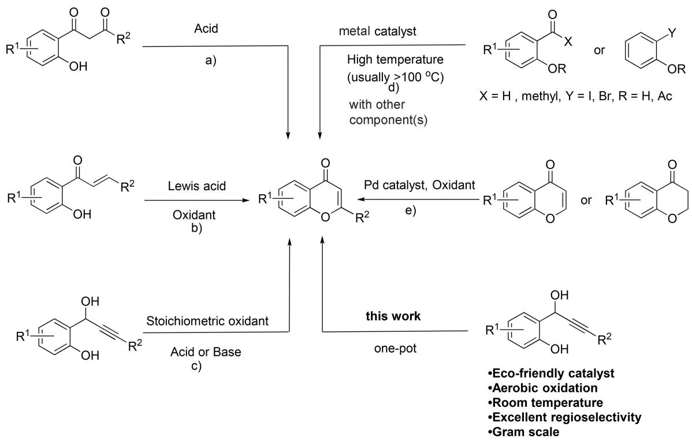
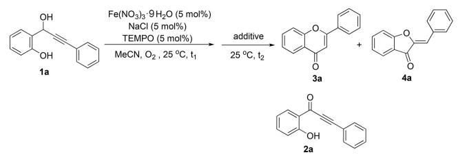
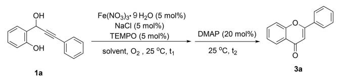
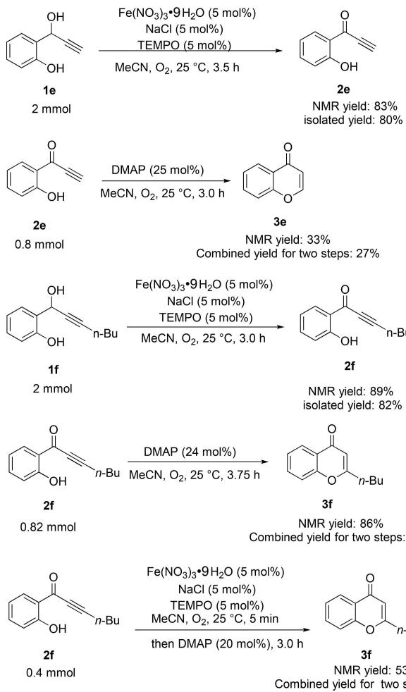
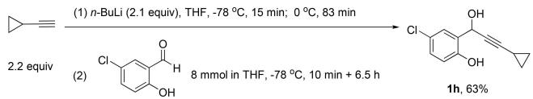
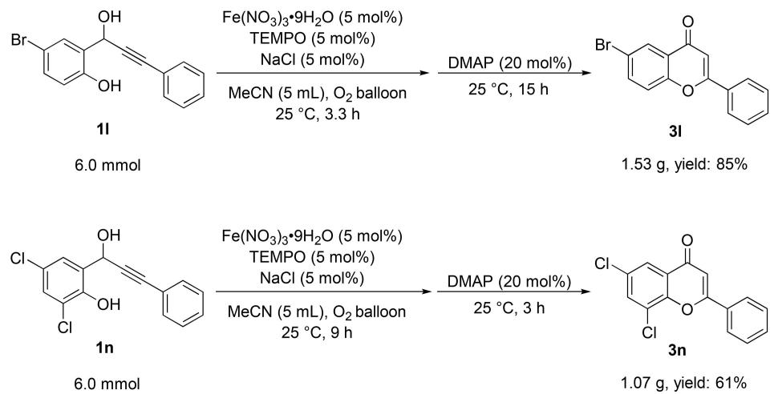
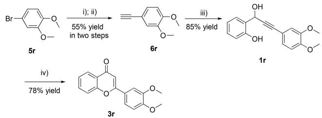
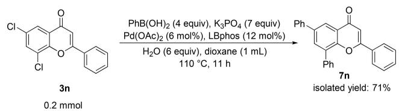
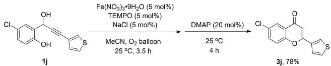
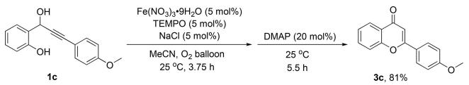

# One Pot Synthesis of g-Benzopyranones via Iron-Catalyzed Aerobic Oxidation and Subsequent 4-Dimethylaminopyridine Catalyzed 6-endo Cyclization

Di Zhai,a Lingzhu Chen,b Minqiang Jia,a,\* and Shengming Maa, b, c,\*

a Research Center of Molecular Recognition and Synthesis, Department of Chemistry, Fudan University, 220 Handan Road, Shanghai 200433, People’s Republic of China E-mail: mqjia@fudan.edu.cn   
b Department of Chemistry, Laboratory of Molecular Recognition and Synthesis, Zhejiang University, 38 Zheda Road, Zhejiang 310027, People-s Republic of China   
State Key Laboratory of Organometallic Chemistry, Shanghai Institute of Organic Chemistry, Chinese Academy of Sciences, 345 Lingling Road, Shanghai 200032, People-s Republic of China E-mail: masm@sioc.ac.cn

Received: July 30, 2017; Revised: October 17, 2017; Published online: November 17, 2017

Supporting information for this article is available on the WWW under https://doi.org/10.1002/adsc.201700993

Abstract: One-pot synthesis of g-benzopyranones was realized in decent yields and excellent regioselectivities via iron-catalyzed aerobic oxidation and 4-dimethylaminopyridine-catalyzed cyclization of related propargylic alcohols. Derivatizations to aromatic substituted g-benzopyranones and synthesis of naturally occurring 3’,4’-dimethoxyflavone have also been realized.

Keywords: one pot; iron catalysis; aerobic oxidation; flavones; natural products

As a major class of natural products commonly found in plants, g-benzopyranones have received a lot of attention due to their biological activities such as antitumor and anti-inflammatory activities.[1] In addition, the structure of conjugate enone fragment and fused phenyl have a great synthetic potential in organic synthesis.[2] Thus, much attention has been focused on the methods for flavone synthesis. The reported literatures mainly consist of five types of strategies (Scheme 1): a) cyclization and dehydration of bcarbonyl compounds.[3] b) Michael addition of chalcones and subsequent oxidation.[4] c) Michael addition of alkynones.[5] d) Metal-catalyzed cyclization reaction.[6] e) Palladium-catalyzed oxidative coupling reaction.[7] Unfortunately, they all suffer from too many steps, stoichiometric amount of oxidant, highly toxic carbon monoxide, expensive palladium catalyst or high temperature. The direct protocol using propargylic alcohols as starting material remains quite undeveloped.[8] Recently, our group developed an iron-catalyzed oxidation of different alcohols at room temperature in high yields and excellent selectivities.[9] By using this method, the oxidation of propargylic alcohols can be realized in excellent yields and selectivities. We hypothesized that by adding an extra catalyst into the oxidation system, g-benzopyranones can be generated from propargylic alcohols in a onepot process. Herein, we report our results on this topic.

To start our study, 2-(1-hydroxy-3-phenylprop-2- yn-1-yl)phenol (1 a) was selected as the model starting material. First, different additives were screened after the iron-catalyzed aerobic oxidation reaction.[9] When ${ \bf K } _ { 2 } { \bf C O } _ { 3 }$ and NaOH were used, both 2-phenyl-4Hchromen-4-one (3a) and 2-benzylidenebenzofuran-3(2H)-one (4 a) were formed in moderate yields (Table 1, entries 1 and 2).[10] Other additive such as PCy3 (Table 1, entry 3) resulted in a poor selectivity and low conversion. TfOH and t-BuOLi gave 86% yield and 79% yield of alkynone 2 a, respectively (Table 1, entries 4 and 5). Running this reaction by adding DMAP[11] gave the best result in 85% yield of 3 a with an excellent selectivity and no starting material was recovered (Table 1, entry 5).

Encouraged by these results, different solvents were examined. DMF, dioxane, and THF gave 43\~ 73% recovery of 1 a (Table 2, entries 1–3). When DCM was used as the solvent, 8% yield of gbenzopyranone 3 a was detected without recovery of 1 a (Table 2, entry 4). When DCE was used, 58% yield of 3 a was obtained (Table 2, entry 5). Finally, MeCN turned out to be the best solvent, providing gbenzopyranone 3 a in 85% NMR yield and 82% isolated yield (Table 2, entry 6).

chemical

Chemical reaction scheme showing synthesis pathways from R¹-catalyzed hydroxyacetic acid derivatives, including metal catalysts and Pd catalysts.

Scheme 1. The synthesis of g-benzopyranones.

Table 1. The optimization of the reaction conditions.[a]   

chemical

Chemical reaction scheme showing oxidation of compound 1a to products 3a and 4a under Fe(NO3)3·9H2O catalysis, followed by addition to yield 2a.

<table><tr><td rowspan="2">Entry</td><td rowspan="2">Additive</td><td rowspan="2">Equiv.</td><td rowspan="2"> $t_1/t_2(h)$ </td><td colspan="3">Yield (%) [b]</td></tr><tr><td>2a</td><td>3a</td><td>4a</td></tr><tr><td>1</td><td> $K_2CO_3$ </td><td>2.0</td><td>3.0/4.0</td><td>0</td><td>40</td><td>52</td></tr><tr><td>2</td><td>NaOH</td><td>2.0</td><td>3.0/2.5</td><td>0</td><td>15</td><td>61</td></tr><tr><td>3</td><td> $PCy_3$ </td><td>0.2</td><td>3.0/2.5</td><td>29</td><td>12</td><td>19</td></tr><tr><td>4</td><td>TfOH</td><td>0.2</td><td>2.3/2.5</td><td>86</td><td>0</td><td>0</td></tr><tr><td>5</td><td>t-BuOLi</td><td>0.2</td><td>3.2/14</td><td>79</td><td>0</td><td>0</td></tr><tr><td>6</td><td>DMAP</td><td>0.2</td><td>3.3/2.5</td><td>0</td><td>85</td><td>0</td></tr></table>

[a] The reaction was conducted using 1 a (1.0 mmol), Fe(NO ) ·9H O (0.05 mmol), NaCl (0.05 mmol), TEMPO (0.05 mmol), and additive in MeCN (5 mL) with an oxygen balloon at 258C.   
[b] Determined by 1 H NMR analysis with dibromomethane as the internal standard.

Subsequently, different loadings of DMAP were studied in this one-pot synthesis. With 0.1 equiv. of DMAP, only 19% yield of 3 a was detected together with 67% yield of aerobic oxidation product 2- alkynone 2 a (Table 3, entry 1). When the loading of DMAP was increased to 0.15 equiv, the yield of 3 a

Table 2. The effect of solvent.[a]   

chemical

Chemical reaction scheme showing oxidation of compound 1a to 3a using Fe(NO₃)₃·9H₂O and NaCl in solvent, followed by DMAP at 25°C for t₂

<table><tr><td>Entry</td><td>Solvent</td><td> $t_1/t_2$ (h)</td><td>Yield of 3a(%) [b]</td><td>Recovery of 1a(%) [b]</td></tr><tr><td>1</td><td>DMF</td><td>2.8/1.7</td><td>0</td><td>73</td></tr><tr><td>2</td><td>dioxane</td><td>2.7/2.4</td><td>0</td><td>43</td></tr><tr><td>3</td><td>THF</td><td>2.5/2.0</td><td>0</td><td>49</td></tr><tr><td>4</td><td>DCM</td><td>3.0/2.5</td><td>8</td><td>0</td></tr><tr><td>5</td><td>DCE</td><td>3.0/2.5</td><td>58</td><td>0</td></tr><tr><td>6</td><td>MeCN</td><td>3.3/2.5</td><td>85 (82)[c]</td><td>0</td></tr></table>

[a] The reaction was conducted using 1 a (1.0 mmol), Fe(NO3)3·9H2O (0.05 mmol), NaCl (0.05 mmol), TEMPO (0.05 mmol) in solvent (5 mL) with an oxygen balloon at 25 8C. After the disappearance of 1 a by TLC, DMAP (0.2 mmol) was added into the resulting mixture.   
[b] Determined by 1 H NMR analysis with dibromomethane as the internal standard.   
[c] The number in parenthesis represents isolated yield. DMAP: 4-dimethylaminopyridine.

was improved to 72% with no 2 a detected (Table 3, entry 2). The best catalyst of DMAP was proved to be 0.2 equiv. with 85% NMR yield of 3 a and no 2 a was detected (Table 3, entry 4). Further increasing the [a] The reaction was conducted using 1 a (1.0 mmol), F $\mathrm { e } ( \mathrm { N O } _ { 3 } ) _ { 3 } { \bullet } 9 \mathrm { H } _ { 2 } \mathrm { O }$ (0.05 mmol), NaCl (0.05 mmol), TEMPO (0.05 mmol) in MeCN (5 mL) with an oxygen balloon at 25 8C. After the disappearance of 1 a by TLC, DMAP (0.2 mmol) was added into the resulting mixture.

Table 3. The effect of the DMAP loading.[a] 

<table><tr><td rowspan="2">Entry</td><td rowspan="2">x</td><td rowspan="2"> $t_1/t_2$  (h)</td><td colspan="2">Yield (%) [b]</td></tr><tr><td>2a</td><td>3a</td></tr><tr><td>1</td><td>10</td><td>3.25/2.5</td><td>67</td><td>19</td></tr><tr><td>2</td><td>15</td><td>3.0/2.5</td><td>0</td><td>72</td></tr><tr><td>3</td><td>20</td><td>3.3/2.5</td><td>0</td><td>85 (81)[c]</td></tr><tr><td>4</td><td>30</td><td>2.6/1.5</td><td>0</td><td>83</td></tr></table>

[b] Determined by 1 H NMR analysis with dibromomethane as the internal standard.

[c] The number in parenthesis represents isolated yield.

loading of DMAP failed to improve the yield of 3 a (Table 3, entry 5).

With the optimal conditions in hand (Table 3, entry 3), the reaction scope was further investigated. When $\dot { \mathbf { R } } ^ { 1 }$ is H, different aryl groups can be introduced into the $\mathbf { R } ^ { 2 }$ position including electron withdrawing and electron donating group substituted phenyl groups, providing the desired g-benzopyranones in decent yields (Table 4, entries 1–4, 3 a–3 d). Replacing $\mathbf { R } ^ { 2 }$ with H and n-Bu resulted in lower yields (Table 4, entries 5 and 6, 3 e and 3 f). To understand the reason of low yields for the substrates 1 e and 1 f, ironcatalyzed oxidation and 6-endo cyclization were conducted separately. Firstly, the oxidation of 1 e provided the desired product 2 e in 83% NMR yield. The second step of 6-endo cyclization gave only 33% NMR yield of 3 e. Thus, we reasoned that the low yield of 3 e was mainly due to the low yield of 6-endo cyclization step. For the reaction of 1 f, iron-catalyzed oxidation provided 89% NMR yield of 2 f, the second step of 6-endo cyclizaion provided 86% NMR yield of 3 f with acetonitrile as solvent.[11] However, the 6-endo cyclization under the catalysis of DMAP together with the catalysts for the first step gave 3 f in only 53% NMR yield. Based on these results, we proposed that the low yield of 3 f was also caused by the low yield of 6-endo cyclization under the combined conditions (Scheme 2).

$\mathbf { R } ^ { 1 }$ may also be 5-chloro with $\mathbf { R } ^ { 2 }$ being phenyl, cyclopropyl, 2-thienyl, 3-thienyl, providing the desired product in 52–86% isolated yields (Table 4, entries 7– 10, 3 g–3 j). It is worth noting that methyl, bromo, nitro, and 3,5-dichloro on R1 position were all tolerated in this reaction providing the corresponding products in good to excellent yields (Table 4, entries

Table 4. The substrate scope.[a] 

<table><tr><td>Entry</td><td>R1/R2</td><td>t1/t2(h)</td><td>Yield of 3 (%)</td></tr><tr><td>1</td><td>H/Ph (1a)</td><td>3.3/2.5</td><td>82 (3a)</td></tr><tr><td>2</td><td>H/p-MeC6H4(1b)</td><td>3.0/3.0</td><td>81 (3b)</td></tr><tr><td>3[b]</td><td>H/p-MeOC6H4(1c)</td><td>3.75/5.5</td><td>81 (3c)</td></tr><tr><td>4</td><td>H/p-ClC6H4(1d)</td><td>3.3/11.6</td><td>68 (3d)</td></tr><tr><td>5</td><td>H/H (1e)</td><td>4.0/3.0</td><td>20 (3e)</td></tr><tr><td>6</td><td>H/n-Bu (1f)</td><td>3.0/3.0</td><td>44 (3f)</td></tr><tr><td>7</td><td>5-Cl/Ph (1g)</td><td>3.5/3.0</td><td>78 (3g)</td></tr><tr><td>8</td><td>5-Cl/Cyclopropyl (1h)</td><td>3.5/3.5</td><td>86 (3h)</td></tr><tr><td>9</td><td>5-Cl/2-thienyl (1i)</td><td>3.5/3.5</td><td>52 (3i)</td></tr><tr><td>10</td><td>5-Cl/3-thienyl (1j)</td><td>3.5/4.0</td><td>78 (3j)</td></tr><tr><td>11</td><td>5-Me/Ph (1k)</td><td>3.5/3.0</td><td>67 (3k)</td></tr><tr><td>12</td><td>5-Br/Ph (1l)</td><td>3.75/13</td><td>78 (3l)</td></tr><tr><td>13</td><td>5-NO2/Ph (1m)</td><td>3.75/13</td><td>85 (3m)</td></tr><tr><td>14</td><td>3-Cl, 5-Cl/Ph (1n)</td><td>12/7.0</td><td>63 (3n)</td></tr><tr><td>15</td><td>5-MeO/Ph (1o)</td><td>13/4.0</td><td>13 (3o)</td></tr></table>

[a] The reaction was conducted using 1 a (1.0 mmol), Fe(NO ) ·9H O (0.05 mmol), NaCl (0.05 mmol), TEMPO (0.05 mmol) in MeCN (5 mL) with an oxygen balloon at 25 8C. After the disappearance of 1 a by TLC, DMAP (0.2 mmol) was added into the resulting mixture.

[b] The reaction was conducted using 1 c (0.5 mmol).

11–14, 3 k–3 n). However, when $\mathbf { R } ^ { 1 }$ is 5-methoxyl group, the reaction provided the desired product 3 o in only 13% isolated yield (Table 4, entry 15, 3 o).

Since g-benzopyranones with multi-methoxy substituents are core structure of natural products and play an important role in pharmaceutical science, we also tested 4-methoxy and 4,5-dimethoxy substituted propargylic alcohols (1 p and 1 q). Since 1 p and 1 q are easily decomposed during the chromatographic purification, we used the crude products directly for the reaction. However, the one-pot process of oxidation and cyclization for 1 p provided only 10% yield of 3 p, and one-pot synthesis of 3 q failed, yielding a complex mixture-product 3 q was not observed from the crude NMR spectra. The poor results were due to the oxidation steps (24% NMR yield for 2 p and 5% NMR yield for 2 q). When 2 q was isolated and submitted for the cyclization process, the reaction proceeded smoothly to provide the final product 3 q in 76% yield (Scheme 3).

To demonstrate the practicality and efficiency of this methodology, gram scale synthesis of g-benzopyranones were carried out. When 1l and 1 n were chosen to be the substrates, 1.53 g of 3 l (85% yield) and 1.07 g of 3 n (61% yield) were successfully prepared (Scheme 4).

chemical

Multi-step organic synthesis reaction scheme showing NMR and DMAP yields for compounds 1e, 2e, 3e, 1f, 2f, 3f, and 2f with corresponding yields and conditions.

Scheme 2. Reactions of 1 e/2 e and1 f/2 f.

Naturally occurring 3’,4’- dimethoxyflavone 3 r was chosen as the target and synthesized in four steps from commercially available starting materials (Scheme 4).[12] The first two steps including Sonogashira coupling and subsequent Retro-Favorski reaction gave 6 r in 55% yield. Then, the reaction of salicylic aldehyde with 6 r-based lithium acetylide gave the desired propargylic alcohol 1 r in 85% yield. Finally, the naturally occurring 3’,4’-dimethoxyflavone 3 r was obtained in 78% yield (Scheme 5).

The Suzuki coupling reaction of 3 n with phenylboronic acid gave the desired g-benzopyranone 7 n by using LB-Phos[13] as the ligand in 71% isolated yield via simple recrystallization (Scheme 6).

In conclusion, a green methodology consisting of iron-catalyzed aerobic oxidation and DMAP-catalyzed 6-endo cyclization to differently substituted gbenzopyranones in moderate to excellent yields was developed. This eco-friendly one-pot synthesis protocol may be easily executed on gram scale and has been applied to the synthesis of naturally occurring 3’,4’-dimethoxyflavone 3r. Due to the importance of these products, this method will be of high interest to people who work in fine chemical and pharmaceutical synthesis.

# Experimental Section

General Information. NMR spectra were taken with an Agilent-400 spectrometer (400 MHz for 1 H NMR, 100 MHz for 13C NMR). 1 H NMR spectra were recorded using TMS as an internal standard (d 0 ppm), or using solvent residual signal of acetone-d6 as an internal standard (d 2.05 ppm), or using solvent residual signal of CD CN as an internal standard (d 1.95 ppm) and coupling constants were reported in Hz. 13C NMR spectra were recorded using $\mathrm { C D C l } _ { 3 } ^ { \overline { { } } }$ as an internal standard (d 77.0 ppm), or using acetone-d6 as an internal standard (d 29.84 ppm), or using CD3CN as an internal standard (d 118.2 ppm). All reactions were carried out in flame-dried Schlenk tubes. Fe(NO3)3·9H2O (98%) and Pd(OAc)2 (47.5% Pd) was purchased from J&K Chemicals; NaCl (>99.5%), CuI (>99.5%) and DMAP (>99%) was purchased from Sinopharm Chemical Reagent Co., Ltd; TEMPO (98%) was purchased from Shanghai Darui Fine Chemical Co., Ltd.; Pd(PPh3)2Cl2 (98%) was purchased from Energy Chemical; Dioxane, toluene and THF were dried over sodium wire. MeCN was dried over CaH and distilled. All the temperatures are referred to the oil baths, acetone/ dry ice bath or ice/water bath used. Recovery of substrates was determined by 1 H NMR analysis using dibromomethane as the internal standard.

# Experimental Details and Analytical Data

# 1. Synthesis of Propargylic Alcohols[8]

(1) Preparation of 3-cyclopropyl-1-(2-hydroxy-5-chlorophenyl)-2-propynol (1 h)

chemical

Chemical reaction scheme showing conversion of n-BuLi (2.1 equiv) to 1h (63%) using compound (2), with yields and conditions labeled

Typical Procedure A: To a flame-dried Schlenk tube were added cyclopropyl acetylene (1.18 g, 17.6 mmol) and THF (40 mL) under Ar. The resulting mixture was cooled to -78 8C. n-BuLi (2.4 M in hexanes, 7 mL, 16.8 mmol) was slowly added at -788C within 15 min. The mixture was put into an ice-water bath and stirred at 0 8C for 83 min. Then, the mixture was put into a dry ice-acetone bath at -788C. After 10 min, the solution of 5-chloro-2-hydroxybenzaldehyde (1.20 g, 8 mmol) in dry THF (20 mL) was slowly added within 10 min. After being stirred at -78 8C for 6.5 h, the resulting mixture was placed in an ice/water bath and quenched with a saturated aqueous ammonium chloride solution (40 mL). The organic layer was separated and the aqueous solution was extracted with ethyl ether (3 3 30 mL). The combined organic layer was dried over anhydrous ${ \mathrm { N a } } _ { 2 } { \mathrm { S O } } _ { 4 } .$ . After filtration and concentration under reduced pressure, the crude product was purified by column chromatography on silica gel to afford 1h (1.0735 g, 63%) as a white solid [DCM (100 mL) to DCM/ethyl ether=15/1 afforded impure 3 h, which was further purified with chromatography (eluent: petroleum ether/ethyl acetate=3/1)]: m.p. 74.0–

Scheme 3. Reactions of multi-methoxy substituted substrates 1 p and 1 q.

74.98C (petroleum ether/dichloromethane); 1 H NMR (400 MHz, CDCl ): d = 7.36 (s, 1 H, ArOH), 7.31 (d, J = 2.4 Hz, 1H, ArH), 7.18 (dd, J = 8.4 Hz, J = 2.4 Hz, 1H, ArH), 6.83 (d, J = 8.8 Hz, 1H, ArH), 5.59 (d, J = 4.0 Hz, 1H, OCH), 2.68 (d, J = 5.2 Hz, 1H, OH), 1.40–1.30 (m, 1H, CH from cyclopropane), 0.90–0.72 (m, 4H, CH -CH ); 13C NMR (100 MHz, CDCl ): d=153.9, 129.7, 127.4, 126.2, 124.8, 118.4, 93.3, 72.3, 63.8, 8.5, -0.5; MS (70 eV, EI) m/z (%): 224 (M+ ( 37Cl), 2.55), 222 (M+( 35Cl), 8.51), 176 (100); IR (neat): n = 3394, 2232, 1602, 1494, 1424, 1358, 1326, 1271, 1113 cm-1 ; Anal. Calcd for $\mathrm { C } _ { 1 2 } \mathrm { H } _ { 1 1 } \mathrm { C l O } _ { 2 } \mathrm { ; }$ C 64.73, H 4.98; Found: C 64.84, H 4.98.

# 2. Synthesis of g-Benzopyranones

(1) Preparation of 2-(4-methylphenyl)-4H-chromen-4-one (3 b)

Typical Procedure B: To a flame-dried Schlenk tube were added $\mathrm { F e ( N O _ { 3 } ) _ { 3 } { \cdot } ^ { 9 } H _ { 2 } O }$ (20.1 mg, 0.05 mmol) and NaCl (3.1 mg, 0.05 mmol) under argon. The Schlenk tube was then degassed to remove the argon inside completely, and refilled with O2 by a balloon of O2 for three times. Then, a solution of TEMPO (8.2 mg, 0.05 mmol) in dry MeCN (3 mL) and a

chemical

Two chemical reaction schemes (1l and 1n) for synthesizing compounds 3l and 3n from bromophenol derivatives using Fe(NO₃)₃·9H₂O and DMAP under specified conditions.

Scheme 4. Gram scale reactions.

chemical

Multi-step organic synthesis reaction scheme showing bromination, esterification, and subsequent ring expansion to form compounds 3r and 1r

Scheme 5. Synthesis of naturally occurring 3’,4’-dimethoxyflavone 3 r.

Reagents and conditions: i) 2-methylbut-3-yn-2-ol (3.6 equiv.), Pd(PPh3)2Cl2 (5 mol%), CuI (10 mol%), TEA, 90 8C, 24 h; ii) KOH (3 equiv.), toluene, ${ \bf \bar { 1 } 1 0 ^ { \circ } C , }$ , 22 h; iii) salicylic aldehyde (0.45 equiv.), n-BuLi (0.95 equiv.), THF, $- 7 8 ^ { \circ } \mathrm { C } ,$ 4 h; iv) Fe(NO3)3·9H2O (5 mol%), NaCl (5 mol%), TEMPO (5 mol%), MeCN, oxygen balloon, $2 5 ^ { \circ } \mathrm { C } ,$ 4.7 h; i) then DMAP (20 mol%), 258C, 6 h.

chemical

Chemical reaction scheme showing conversion of compound 3n to 7n under specified reagents and conditions, yielding 71% isolated yield

Scheme 6. Synthetic application.

solution of 1 b (239.4 mg, 1.0 mmol) in dry MeCN (2 mL) were added sequentially. Then the mixture was stirred at 25 8C with a balloon of $\mathrm { O } _ { 2 }$ for 3.0 h. After the disappearance of 1 b by TLC, O balloon was removed and DMAP (24.1 mg, 0.2 mmol) was added into the reaction mixture. Then the mixture was stirred at $2 5 ^ { \circ } \mathrm { C }$ for 3.0 h as monitored by TLC. After concentration under reduced pressure, the residue was diluted with DCM. To the solution was added 1 M HCl (10 mL) and the resulting mixture was washed with 20 mL of water. The organic layer was separated and the aqueous solution was extracted with DCM (3 3 30 mL). The combined organic layer was dried over anhydrous ${ \mathrm { N a } } _ { 2 } { \mathrm { S O } } _ { 4 } ,$

filtered and concentrated under reduced pressure. Then, the mixture was transferred with DCM, filtered through a short column on silica gel (3 cm) (eluent: ethyl ether) until no product can be observed by TLC, and concentrated under reduced pressure [the yield of 3 b was determined by 1 H NMR analysis of the crude products using dibromomethane as the internal standard (82%)]. The residue was purified by column chromatography on silica gel to afford $\mathbf { 3 6 } ^ { \mathrm { { \check { 8 } } } \mathrm { { ] } } }$ (193.5 mg, 81%) as a pale yellow solid [eluent: petroleum ether/ethyl acetate=8/1]: m.p. 112.5–113.48C (petroleum ether/DCM) $\mathrm { ( L i t ^ { [ 6 \mathrm { f } ] } }$ m.p.: 111 8C); 1 H NMR (400 MHz, CDCl ): d = 8.21 (dd, J = 7.6 Hz, J = 1.2 Hz, 1H, ArH), 7.78 (d, J =8.4 Hz, 2H, ArH), 7.70–7.62 (m, 1H, Ar-H), 7.53 (d, J = 8.4 Hz, 1H, ArH), 7.38 (t, J = 7.6 Hz, 1H, ArH), 7.28 (d, $J { = } 7 . 6 \mathrm { H z }$ , 2H, ArH), 6.76 (s, 1H, =CH), 2.40 (s, 3 H, CH3); 13C NMR (100 MHz, CDCl3): d=178.3, 163.4, 156.1, 142.1, 133.5, 129.6, 128.8, 126.1, 125.5, 125.0, 123.8, 117.9, 106.8, 21.4; MS (70 eV, EI) m/z (%): 236 (M +, 100); IR (neat): n = 1634, 1604, 1567, 1510, 1464, 1414, 1370, 1124 cm-1 .

(2) Preparation of 6-chloro-2-(thien-3-yl)-4H-chromen-4-one (3 j)   

chemical

Chemical reaction scheme showing conversion of compound 1j to 3j using Fe(NO3)2·9H2O and DMAP under different conditions

Typical Procedure C: To a flame-dried Schlenk tube were added Fe(NO3)3· 9H2O (20.2 mg, 0.05 mmol) and NaCl (2.7 mg, 0.05 mmol) under argon. The Schlenk tube was then degassed to remove the argon inside completely, and refilled with O by a balloon of O for three times. Then, a solution of TEMPO (8.1 mg, 0.05 mmol) in dry MeCN (2 mL) and a solution of 1 j (264.7 mg, 1.0 mmol) in dry MeCN (3 mL) were added sequentially. Then the resulting mixture was stirred at $2 5 ^ { \circ } \mathrm { C }$ with a balloon of $\mathrm { { O } } _ { 2 }$ for 3.5 h. After the disappearance of 1 j by TLC, $\mathrm { O } _ { 2 }$ balloon was removed and DMAP (24.4 mg, 0.2 mmol) was added into the reaction mixture. Then the mixture was stirred at $2 5 ^ { \circ } \mathrm { C }$ for 4 h as monitored by TLC. After concentration under reduced pressure, the residue was diluted with DCM. To the solution was added 1 M HCl (10 mL) and the resulting mixture was washed with 20 mL of water. The organic layer was separated and the aqueous solution was extracted with DCM (3 3 30 mL). The combined organic layer was dried over anhydrous $\mathrm { N a } _ { 2 } \mathrm { S O } _ { 4 } ,$ filtered and concentrated to remove most of DCM. Then, the resulting mixture was filtered through a short column on silica gel (3 cm) (eluent: ethyl ether) until no product may be collected as indicated by TLC, and concentrated under reduced pressure [the yield of 3 j was determined by 1 H NMR analysis of the crude products using dibromomethane as the internal standard (83%)]. The residue was purified by column chromatography on silica gel to afford $\mathsf { \mathbf { 3 } } \mathbf { j } ^ { [ 1 4 ] }$ (207.2 mg, 78%) as a white solid [eluent: petroleum ether/ethyl acetate=15/1 (400 mL) to petroleum ether/dichloromethane/ethyl acetate=15/2/1]: m.p. 155.5–156.48C (petroleum ether/ethyl ether) $\mathrm { ( L i t ^ { [ i \bar { 4 } ] } }$ m.p.: 160 8C); 1 H NMR (400 MHz, CDCl ): d = 8.14 (d, J = 2.4 Hz, 1H, ArH), 8.00 (t, J = 2.2 Hz, 1H, ArH), 7.60 (dd, $J _ { 1 } { = } 8 . 8$ Hz, $J _ { 2 } = 2 . 4$ 4 Hz, 1H, ArH), 7.51–7.41 (m, 3H, ArH), 6.64 (s, 1 H, =CH); 13C NMR (100 MHz, CDCl ): d = 177.1, 159.7, 154.3, 133.83, 133.77, 131.1, 127.5, 127.1, 125.1, 125.0, 124.9, 119.6, 107.0; MS (70 eV, EI) m/z (%): 264 (M+( 37Cl), 37.29), 262 $( \mathbf { M } ^ { + } ( ^ { 3 5 } \mathbf { C l } )$ , 100); IR (neat): v =1649, 1616, 1603, 1567, 1434, 1410, 1380, 1332, 1258, 1042 cm-1

(3) Preparation of 2-(4-methoxyphenyl)-4H-chromen-4-one (3 c)

chemical

Organic synthesis reaction scheme converting compound 1c to 3c with yields and conditions

Typical Procedure D: To a flame-dried Schlenk tube were added $\mathrm { F e ( N O _ { 3 } ) _ { 3 } { \cdot } ^ { 9 } H _ { 2 } O }$ (10.4 mg, 0.025 mmol) and NaCl (1.5 mg, 0.025 mmol) under argon. The Schlenk tube was then degassed to remove the argon inside completely, and refilled with $\mathrm { O } _ { 2 }$ by a balloon of $\mathrm { O } _ { 2 }$ for three times. Then, a solution of TEMPO (3.9 mg, 0.025 mmol) in dry MeCN (1.5 mL) and a solution of 1 c (127.5 mg, 0.5 mmol) in dry MeCN (1 mL) were added sequentially. Then the mixture was stirred at $2 5 ^ { \circ } \mathrm { C }$ with a balloon of $\mathrm { { O } } _ { 2 }$ for 3.75 h. After the disappearance of 1 c by TLC, the O2 balloon was removed and DMAP (12.3 mg, 0.1 mmol) was added into the reaction mixture. Then the mixture was stirred at $2 5 ^ { \circ } \mathrm { C }$ for 5.5 h as monitored by TLC. After concentration under reduced pressure, the residue was transferred with DCM, filtered through a short column on silica gel (3 cm) (eluent: ethyl ether) until no product can be observed by TLC, and concentrated under reduced pressure [the yield of 3 c was determined by 1 H NMR analysis of the crude products using dibromomethane as the internal standard (78%)]. The residue was purified by column chromatography on silica gel to afford $\mathbf { 3 \mathbf { c } } ^ { [ 8 ] }$ (102.5 mg, 81%) as a pale yellow solid (eluent: petroleum ether/ethyl acetate=10/1 (210 mL) to petroleum ether/ethyl acetate=5/1): m.p. 155.0–156.18C (petroleum ether/DCM) $\mathrm { ( L i t ^ { [ 7 e ] } }$ m.p.: 154–1568C); 1 H NMR (400 MHz, CDCl ): $\delta = 8 . 2 3$ (dd, J = 8.2 Hz, J = 1.4 Hz, 1H, ArH), 7.89 (d, J =9.2 Hz, 2H, ArH), 7.73–7.65 (m, 1H, ArH), 7.56 (d, J=8.0 Hz, 1 Hz, ArH), 7.45–7.37 (m, 1H, ArH), 7.03 (d, J= 9.2 Hz, 2H, ArH), 6.76 (s, 1H, =CH), 3.90 (s, 3H, OCH ); 13C NMR (100 MHz, CDCl ): d =178.4, 163.4, 162.4, 156.1, 133.5, 128.0, 125.6, 125.0, 123.9, 123.8, 117.9, 114.4, 106.1, 55.5; MS (70 eV, EI) m/z (%): 252 (M+, 100); IR (neat): n = 1644, 1604, 1570, 1512, 1464, 1426, 1376, 1314, 1264, 1251, 1192, 1122, 1023 cm-1 .

# Acknowledgements

Financial support from National Basic Research Program of China (2015CB856600) is greatly appreciated. We thank Shihua Song of our group for reproducing the results of entry 4, entry 5 and entry 14 in Table 4 represented in this study.

# References

[1] For selected examples on the bioactivity and pharmaceutical activity of g-benzopyranones, see: a) Y. Lin, F. Hsu, C. Chen, J. Chern, M. Lee, Phytochemistry 2007, 68, 1189–1199; b) J. Fan, W. Sun, Z. Wang, X. Peng, Y. Li, J. Cao, Chem. Commun. 2014, 50, 9573–9576; c) A. Gaspar, M. J. Matos, J. Garrido, E. Uriarte, F. Borges, Chem. Rev. 2014, 114, 4960–4992; d) M. Li, Y. Dong, X. Yu, Y. Zou, Y. Zheng, X. Bu, J. Quan, Z. He, H. Wu, Bioorg. Med. Chem. 2016, 24, 2280–2286.   
[2] For selected examples on the application of g-benzopyranone fragment, see: a) D. Zhao, B. Beiring, F. Glorius, Angew. Chem. 2013, 125, 8612–8616; Angew. Chem. Int. Ed. 2013, 52, 8454–8458; b) P. Bichovski, T. M. Haas, D. Kratzert, J. Streuff, Chem. Eur. J. 2015, 21, 2339–2342; c) P. Bichovski, T. M. Haas, M. Keller, J. Streuff, Org. Biomol. Chem. 2016, 14, 5673–5682; d) A. L. Gerten, L. M. Stanley, Tetrahedron Lett. 2016, 57, 5460–5463.   
[3] For selected examples on cyclization and dehydration of b-carbonyl compounds to synthesize g-benzopyranone, see: a) W. Baker, J. Chem. Soc. 1933, 1381–1389; b) P. F. Devitt, A. Timoney, M. A. Vickars, J. Org. Chem. 1961, 26, 4941–4944; c) C. M. M. Santos, A. M. S. Silva, J. A. S. Cavaleiro, Eur. J. Org. Chem. 2003, 4575–4585; d) P. Kçnigs, O. Neumann, O. Kataeva, G. Schnakenburg, S. R. Waldvogel, Eur. J. Org. Chem. 2010, 6417– 6422; e) J. Zhao, Y. Zhao, H. Fu, Org. Lett. 2012, 14, 2710–2713; f) J. C. L. Menezes, L. B. A. Vaz, P. M. Vieira, K. Fonseca, C. M. Carneiro, J. G. Taylor, Molecules 2015, 20, 43–51; g) Q. Dong, H. C. Shen, M. Jiang, Tetrahedron Lett. 2016, 57, 2116–2120; h) F. Stanek, M. Stodulski, Tetrahedron Lett. 2016, 57, 3841–3843.   
[4] For selected examples on Michael addition of chalcones and subsequent oxidation to synthesize g-benzopyranone, see: a) H. S. Mahal, H. S. Rai, K. Venkataraman, J. Chem. Soc. 1935, 866–868; b) Y. K. Rao, S.-H. Fang, Y.-M. Tzeng, Bioorg. Med. Chem. 2005, 13, 6850–6855; c) Z. Du, H. Ng, K. Zhang, H. Zeng, J. Wang, Org. Biomol. Chem. 2011, 9, 6930–6933; d) T. Yatabe, X. Jin, K. Yamaguchi, N. Mizuno, Angew. Chem. 2015, 127, 13500–13504; Angew. Chem. Int. Ed. 2015, 54, 13302– 13306; e) S. Zhong, Y. Liu, X. Cao, J. Wan, ChemCat Chem. 2017, 9, 465–468.   
[5] For selected examples on Michael addition of alkynones to synthesize g-benzopyranone, see: a) M. Yoshida, Y. Fujino, T. Doi, Org. Lett. 2011, 13, 4526–4529; b) M.

Yoshida, K. Saito, Y. Fujino, T. Doi, Chem. Commun. 2012, 48, 11796–11798; c) K. Saito, M. Yoshida, T. Doi, Chem. Lett. 2015, 44, 141–143.   
[6] For selected examples on palladium-catalyzed cyclization reaction to synthesize g-benzopyranone, see: a) H. Miao, Z. Yang, Org. Lett. 2000, 2, 1765–1768; b) A. V. Dubrovskiy, R. C. Larock, Org. Lett. 2010, 12, 3117– 3119; c) X. Wu, H. Neumann, M. Beller, Chem. Eur. J. 2012, 18, 12595–12598; d) F. Yang, K. Rauch, K. Kettelhoit, L. Ackermann, Angew. Chem. 2014, 126, 11467–11470; Angew. Chem. Int. Ed. 2014, 53, 11285– 11288; e) J. Liu, W. Song, Y. Yue, R. Liu, H. Yi, K. Zhuo, A. Lei, Chem.Commun. 2015, 51, 17576–17579; f) L. Shi, X. Zhang, X. Zhang, Tetrahedron 2016, 72, 8617–8622; g) D. Banerjee, U. Kayal, G. Maiti, Tetrahedron Lett. 2016, 57, 1667–1671; h) Zhao, X. Zhou, J. S. Lin, X. Jin, R. Liu, Org. Lett. 2017, 19, 976–979; i) Y. Yue, J. Peng, D. Wang, Y. Bian, P. Sun, C. Chen, J. Org. Chem. 2017, 82, 5481–5486; j) D. Yang, Z. Wang, X. Wang, H. Sun, Z. Xie, J. Fan, G. Zhang, W. Zhang, Z. Gao, J. Mol. Catal. A-Chem. 2017, 426, 24–29; k) H. Y. Kim, E. Song, K. Oh, Org. Lett. 2017, 19, 312–315.   
[7] For selected examples on palladium-catalyzed oxidative coupling reaction to synthesize g-benzopyranone, see: a) T. Diao, S. S. Stahl, J. Am. Chem. Soc. 2011, 133, 14566–14569; b) M. Khoobi, M. Alipour, S. Zarei, F. Jafarpour, A. Shafiee, Chem. Commun. 2012, 48, 2985– 2987; c) D. Kim, K. Ham, S. Hong, Org. Biomol. Chem. 2012, 10, 7305–7312; d) K. H. Kim, H. S. Lee, S. H. Kim, J. N. Kim, Tetrahedron Lett. 2012, 53, 2761–2764; e) J. Lee, J. Yu, S. H. Son, J. Heo, T. Kim, J.-Y. An, K.-S. Inn, N.-J. Kim, Org. Biomol. Chem. 2016, 14, 777–784; f) R. Narayan, A. P. Antonchick, Chem. Eur. J. 2014, 20, 4568–4572.   
[8] S. Zhang, C. Wan, Q. Wang, B. Zhang, L. Gao, Z. Zha, Z. Wang, Eur. J. Org. Chem. 2013, 2080–2083.

[9] a) S. Ma, J. Liu, S. Li, B. Chen, J. Cheng, J. Kuang, Y. Liu, B. Wan, Y. Wang, J. Ye, Q. Yu, W. Yuan, S. Yu, Adv. Synth. Catal. 2011, 353, 1005–1017; b) J. Liu, X. Xie, S. Ma, Synthesis 2012, 44, 1569–1576.   
[10] For selected examples on base-catalyzed reaction of alkynones, see: a) H. Harkat, A. Blanc, J.-M. Weibel, P. Pale, J. Org. Chem. 2008, 73, 1620–1623; b) S. Li, F. Jin, M. Viji, H. Jo, J. Sim, H. S. Kim, H. Lee, J.-K. Jung, Tetrahedron Lett. 2017, 58, 1417–1420.   
[11] M. Yoshida, Y. Fujino, K. Saito, T. Doi, Tetrahedron 2011, 67, 9993–9997.   
[12] For reports on the synthesis of 3’,4’-dimethoxyflavone, see: a) J. Budzianowski, M. Morozowska, M. Wesolowska, Phytochemistry 2005, 66, 1033–1039; b) Y. S. Kosenkova, M. P. Polovinka, N. I. Komarova, D. V. Korchagina, S. V. Morozov, A. I. Vyalkov, N. Y. Kurochkina, V. A. Cheremushkina, N. F. Salakhutdinov, Chem. Nat. Compd. 2008, 44, 564–568; c) N. Uddin, B. S. Siddiqui, S. Begum, H. A. Bhatti, A. Khan, S. Parveen, M. I. Choudhary, Phytochemistry Lett. 2011, 4, 454–458; d) E. C. Costa, T. B. Cassamale, D. B. Carvalho, L. S. S. Bosquiroli, M. Ojeda, T. V. Ximenes, M. F. C. Matos, M. C. T. Kadri, A. C. M. Baroni, C. C. P. Arruda, Molecules 2016, 21, 802–812; e) T. B. Cassamale, E. C. Costa, D. B. Carvalho, N. S. Cassemiro, C. C. Tomazela, M. C. S. Marques, M. Ojeda, M. F. C. Matos, S. Albuquerque, C. C. P. Arruda, A. C. M. Baroni, J. Braz. Chem. Soc. 2016, 27, 1217–1228.   
[13] For reports on the palladium-catalyzed coupling reaction using LB-phos, see: a) B. L, C. Fu, S. Ma, Tetrahedron Lett. 2010, 51, 1284–1286; b) B. L, C. Fu, S. Ma, Chem. Eur. J. 2010, 16, 6434–6437; c) P. Li, B. L, C. Fu, S. Ma, Org. Biomol. Chem. 2013, 11, 98–109.   
[14] R. C. Kamboj, R. Arora, D. Kumar, G. Sharma, J. Photoch. Photobio. A. 2011, 220, 124–133.